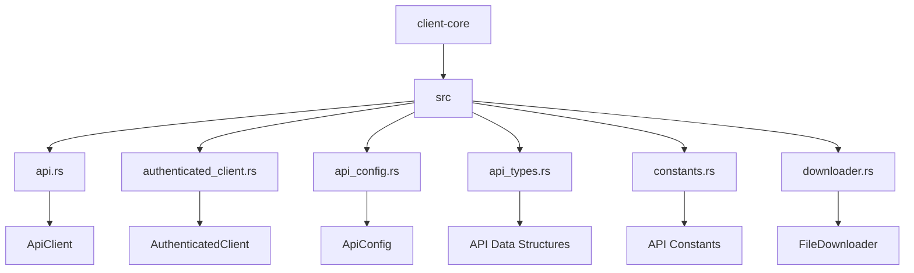
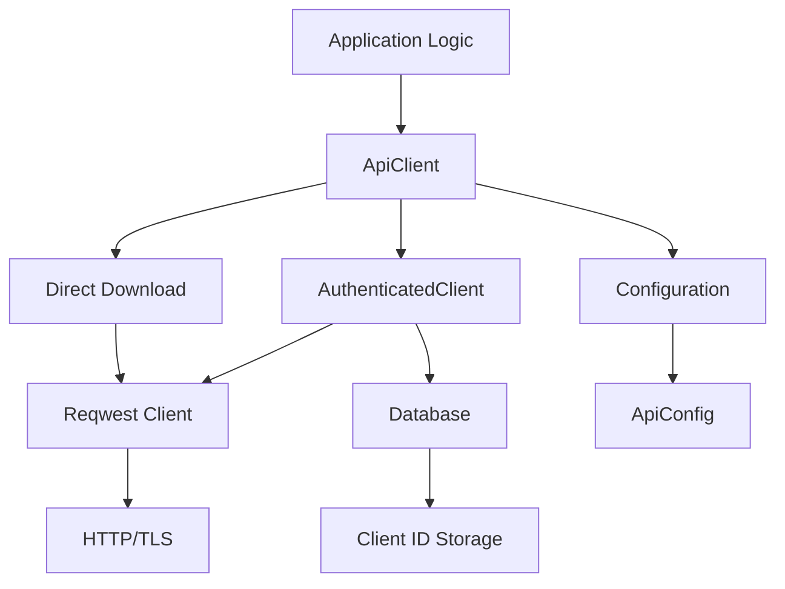
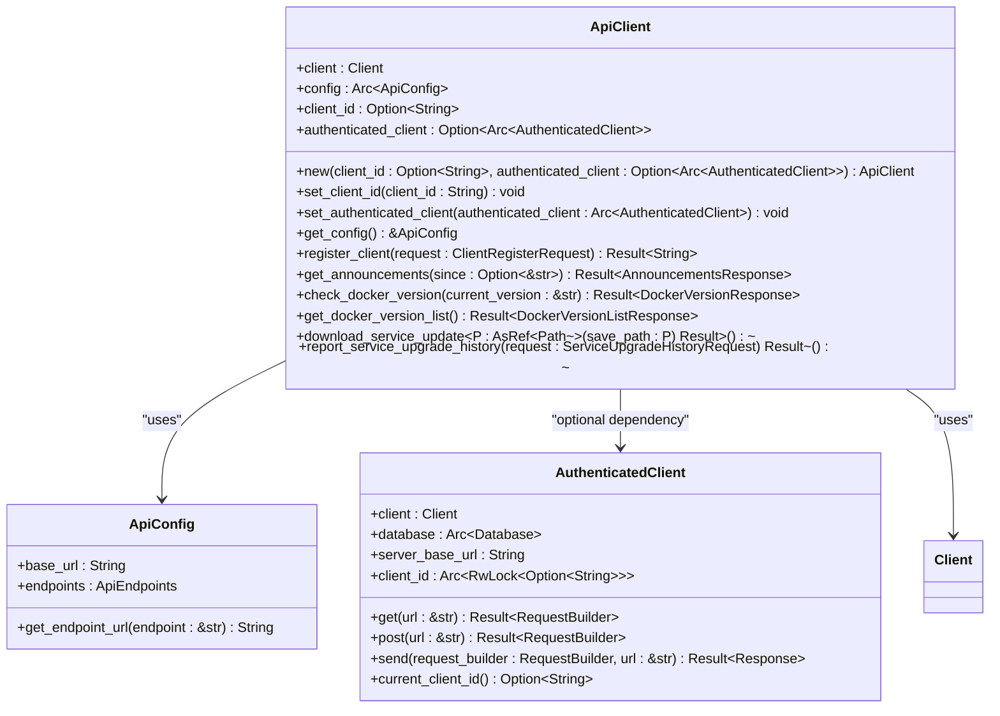
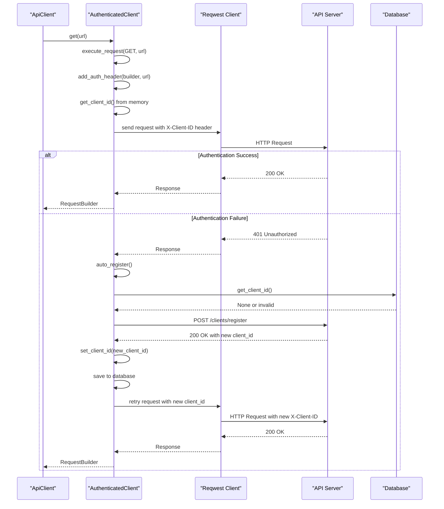
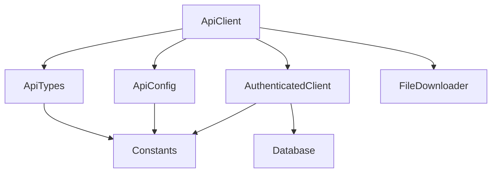

# API Client Implementation

<cite>
**Referenced Files in This Document**   
- [api.rs](file://client-core/src/api.rs)
- [authenticated_client.rs](file://client-core/src/authenticated_client.rs)
- [api_config.rs](file://client-core/src/api_config.rs)
- [api_types.rs](file://client-core/src/api_types.rs)
- [constants.rs](file://client-core/src/constants.rs)
- [downloader.rs](file://client-core/src/downloader.rs)
</cite>

## Table of Contents
1. [Introduction](#introduction)
2. [Project Structure](#project-structure)
3. [Core Components](#core-components)
4. [Architecture Overview](#architecture-overview)
5. [Detailed Component Analysis](#detailed-component-analysis)
6. [Dependency Analysis](#dependency-analysis)
7. [Performance Considerations](#performance-considerations)
8. [Troubleshooting Guide](#troubleshooting-guide)
9. [Conclusion](#conclusion)

## Introduction
This document provides comprehensive documentation for the API client implementation in the Duck Client project. It details the `ApiClient` and `AuthenticatedClient` components responsible for handling HTTP communication with the backend server, including authentication, request management, and error handling. The documentation covers the HTTP client setup using Reqwest with retry logic and timeout configurations, all API endpoints consumed by the client, the authentication flow with token management, error handling patterns, and integration with the upgrade system. The goal is to provide both technical depth and accessibility for developers and users with varying levels of technical expertise.

## Project Structure
The API client implementation is located within the `client-core` module of the Duck Client project. This module contains the core business logic and services that are shared across different parts of the application. The API-related components are organized in a dedicated section of the source tree, with clear separation between configuration, types, client implementation, and authentication logic.



**Diagram sources**
- [api.rs](file://client-core/src/api.rs)
- [authenticated_client.rs](file://client-core/src/authenticated_client.rs)
- [api_config.rs](file://client-core/src/api_config.rs)
- [api_types.rs](file://client-core/src/api_types.rs)
- [constants.rs](file://client-core/src/constants.rs)
- [downloader.rs](file://client-core/src/downloader.rs)

**Section sources**
- [api.rs](file://client-core/src/api.rs)
- [authenticated_client.rs](file://client-core/src/authenticated_client.rs)

## Core Components
The core components of the API client system are the `ApiClient` and `AuthenticatedClient` structs, which work together to provide a robust interface for communicating with the backend server. The `ApiClient` serves as the primary interface for making API calls, while the `AuthenticatedClient` handles authentication logic and token management. These components are designed to be modular and reusable, allowing for easy integration with different parts of the application.

The `ApiClient` is responsible for managing the HTTP client instance, configuration, and providing methods for specific API endpoints such as client registration, announcement retrieval, and Docker version checking. It also handles file downloads for service updates. The `AuthenticatedClient` wraps the Reqwest HTTP client and automatically manages the client ID authentication token, including automatic re-registration when authentication fails.

**Section sources**
- [api.rs](file://client-core/src/api.rs#L1-L50)
- [authenticated_client.rs](file://client-core/src/authenticated_client.rs#L1-L50)

## Architecture Overview
The API client architecture follows a layered design pattern with clear separation of concerns. At the foundation is the Reqwest HTTP client, which provides the underlying HTTP functionality. On top of this, the `AuthenticatedClient` adds authentication logic, automatically injecting the client ID header and handling re-authentication when necessary. The `ApiClient` sits at the highest level, providing a domain-specific interface for the application's API endpoints.

The architecture supports both authenticated and unauthenticated requests, with the ability to fall back to direct URL downloads when authentication is not required or available. This flexibility allows the client to handle different types of requests, from API calls that require authentication to direct file downloads from CDN or object storage services.



**Diagram sources**
- [api.rs](file://client-core/src/api.rs#L1-L100)
- [authenticated_client.rs](file://client-core/src/authenticated_client.rs#L1-L100)
- [api_config.rs](file://client-core/src/api_config.rs#L1-L50)

## Detailed Component Analysis

### ApiClient Analysis
The `ApiClient` struct is the primary interface for making API calls to the backend server. It encapsulates the HTTP client, configuration, and provides methods for all API endpoints. The client is designed to be cloneable and thread-safe, using `Arc` for shared ownership of the configuration.

#### ApiClient Class Diagram


**Diagram sources**
- [api.rs](file://client-core/src/api.rs#L1-L100)
- [api_config.rs](file://client-core/src/api_config.rs#L1-L50)
- [authenticated_client.rs](file://client-core/src/authenticated_client.rs#L1-L50)

**Section sources**
- [api.rs](file://client-core/src/api.rs#L1-L300)

### AuthenticatedClient Analysis
The `AuthenticatedClient` is a wrapper around the Reqwest HTTP client that automatically handles authentication using a client ID. It manages the client ID lifecycle, including retrieval from the database, injection into requests, and automatic re-registration when authentication fails. This component implements a resilient authentication flow that ensures API requests can continue even if the client ID becomes invalid.

#### Authentication Flow Sequence Diagram


**Diagram sources**
- [authenticated_client.rs](file://client-core/src/authenticated_client.rs#L1-L200)

**Section sources**
- [authenticated_client.rs](file://client-core/src/authenticated_client.rs#L1-L227)

### HTTP Client Configuration
The HTTP client setup uses Reqwest with default configurations for timeout and retry logic. While the `ApiClient` uses the default Reqwest client without explicit timeout settings, the `FileDownloader` component in the same module configures timeouts and other settings. This suggests that the API client relies on Reqwest's built-in defaults for connection management.

The `AuthenticatedClient` creates a new Reqwest client instance with default settings, which includes connection pooling and TLS configuration. Reqwest automatically handles connection reuse and TLS encryption for HTTPS connections, providing secure communication out of the box.

```mermaid
flowchart TD
A[HTTP Client Creation] --> B[Reqwest Client::new()]
B --> C[Default Connection Pooling]
C --> D[Automatic TLS Configuration]
D --> E[Connection Reuse]
E --> F[Efficient Request Handling]
```

**Diagram sources**
- [authenticated_client.rs](file://client-core/src/authenticated_client.rs#L50-L60)
- [downloader.rs](file://client-core/src/downloader.rs#L168-L173)

**Section sources**
- [authenticated_client.rs](file://client-core/src/authenticated_client.rs#L50-L60)

## Dependency Analysis
The API client components have well-defined dependencies on other modules within the client-core package. The `ApiClient` depends on `api_config` for endpoint configuration, `api_types` for request and response data structures, `authenticated_client` for authenticated requests, and `downloader` for file download functionality. The `AuthenticatedClient` depends on the `database` module for persistent storage of the client ID and on `constants` for API endpoint definitions.



**Diagram sources**
- [api.rs](file://client-core/src/api.rs)
- [authenticated_client.rs](file://client-core/src/authenticated_client.rs)
- [api_config.rs](file://client-core/src/api_config.rs)
- [api_types.rs](file://client-core/src/api_types.rs)
- [constants.rs](file://client-core/src/constants.rs)

**Section sources**
- [api.rs](file://client-core/src/api.rs)
- [authenticated_client.rs](file://client-core/src/authenticated_client.rs)

## Performance Considerations
The API client implementation includes several performance optimizations. The use of `Arc` for shared ownership of configuration and client instances enables efficient memory usage and thread-safe sharing across different parts of the application. Connection pooling is handled automatically by Reqwest, which reuses TCP connections for multiple requests to the same server, reducing connection overhead.

For file downloads, the implementation uses streaming to avoid loading large files into memory, writing data directly to disk as it is received. The download progress is reported with configurable intervals to balance between user feedback and performance overhead. The client also supports direct URL downloads without authentication when appropriate, reducing the number of round trips required for file retrieval.

The architecture supports request batching indirectly through the application logic, though this is not explicitly implemented in the client components themselves. Caching strategies for frequently accessed resources like service manifests are not implemented at the client level but could be added through higher-level application logic.

## Troubleshooting Guide
Common issues with the API client typically relate to authentication failures, network connectivity problems, or configuration errors. When authentication fails with a 401 status code, the `AuthenticatedClient` automatically attempts to re-register and obtain a new client ID. If this fails, the error is propagated up to the application level.

Network failures are handled by Reqwest's built-in retry mechanisms and timeout settings. For file downloads, the client provides detailed progress information and error messages to help diagnose issues. Configuration problems can be identified by checking the API configuration endpoints and ensuring the base URL is correctly set.

When debugging API client issues, it is recommended to check the following:
- Verify the API base URL configuration
- Check network connectivity to the server
- Examine the client ID stored in the database
- Review log messages for authentication and network errors
- Validate that the server endpoints are accessible

**Section sources**
- [api.rs](file://client-core/src/api.rs)
- [authenticated_client.rs](file://client-core/src/authenticated_client.rs)

## Conclusion
The API client implementation in the Duck Client project provides a robust and flexible interface for communicating with the backend server. The separation of concerns between the `ApiClient` and `AuthenticatedClient` components allows for clear responsibility division and easy maintenance. The use of modern Rust libraries like Reqwest and Tokio enables efficient, asynchronous HTTP communication with built-in support for connection pooling and TLS encryption.

The authentication flow is resilient, automatically handling client ID expiration and re-registration without requiring intervention from higher-level application code. The client supports both API requests and direct file downloads, making it versatile for different types of operations. While the current implementation relies on default timeout and retry settings, it provides a solid foundation that can be extended with additional performance optimizations and security features as needed.