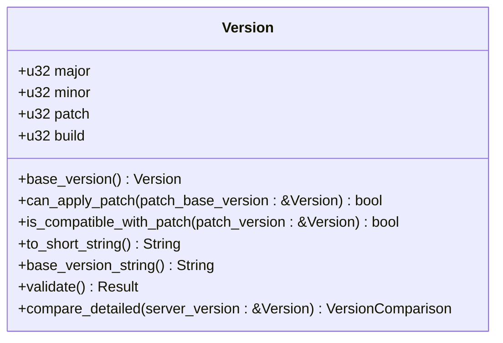
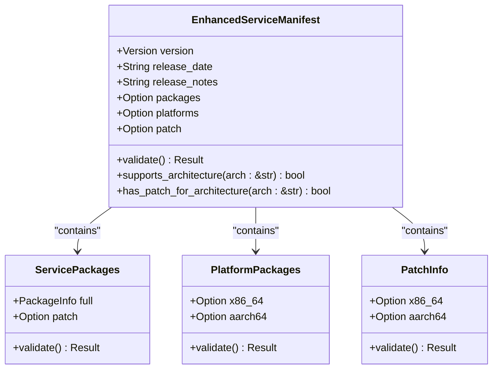
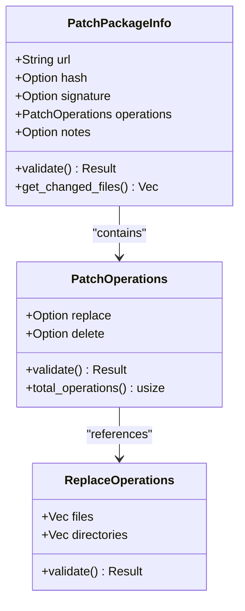
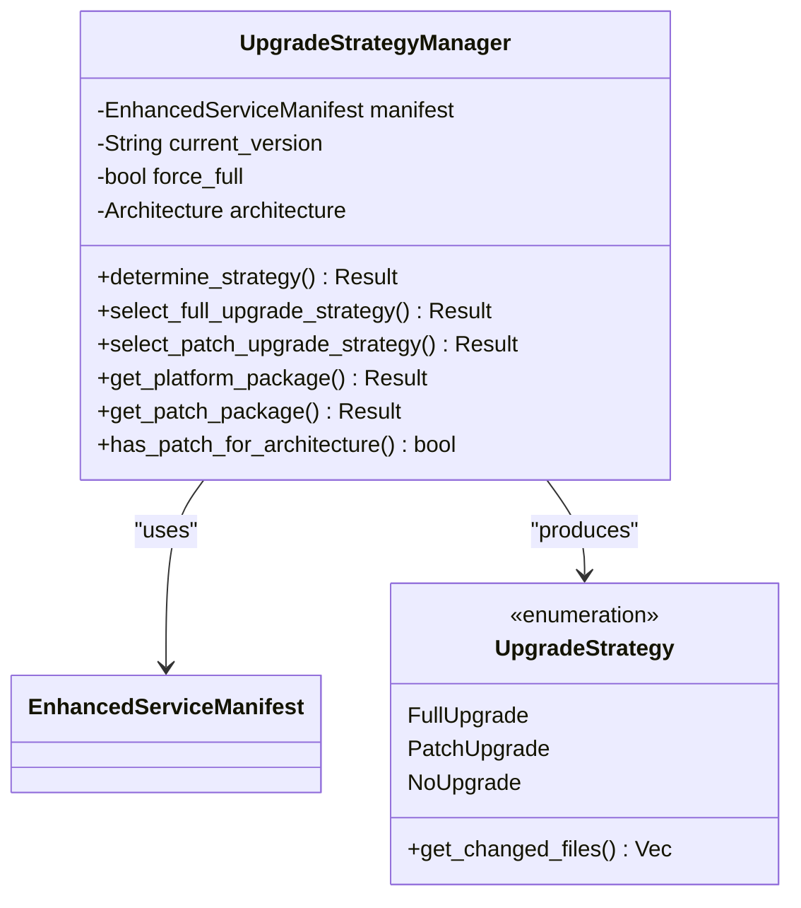
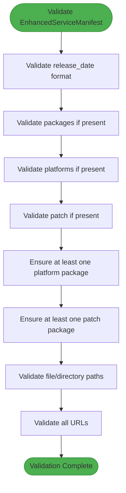
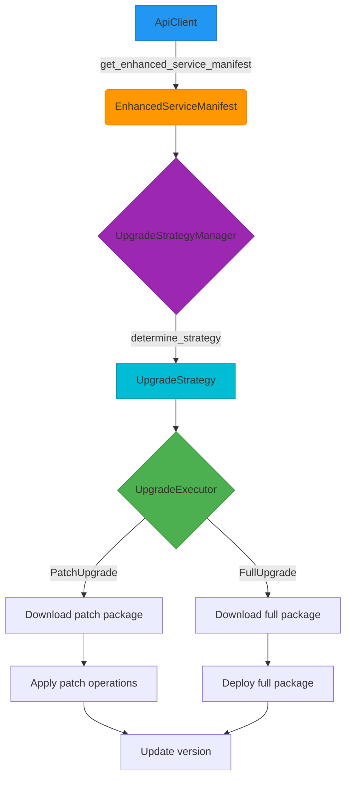

# API Data Models

<cite>
**Referenced Files in This Document**   
- [api_types.rs](file://client-core/src/api_types.rs)
- [version.rs](file://client-core/src/version.rs)
- [upgrade_strategy.rs](file://client-core/src/upgrade_strategy.rs)
- [upgrade-architecture-enhancement.md](file://spec/upgrade-architecture-enhancement.md)
- [patch-version-management-final.md](file://spec/patch-version-management-final.md)
</cite>

## Table of Contents
1. [Introduction](#introduction)
2. [Core Data Structures](#core-data-structures)
3. [Version Management](#version-management)
4. [Enhanced Service Manifest](#enhanced-service-manifest)
5. [Patch Operations](#patch-operations)
6. [Upgrade Strategy](#upgrade-strategy)
7. [Data Validation](#data-validation)
8. [Relationships and Data Flow](#relationships-and-data-flow)
9. [Sample JSON Representations](#sample-json-representations)
10. [Backward Compatibility](#backward-compatibility)

## Introduction
This document provides comprehensive documentation for the core API data structures defined in `api_types.rs`. The Duck CLI system implements a sophisticated upgrade architecture that supports both full and patch upgrades across multiple architectures. The data models are designed to support intelligent upgrade decisions, cryptographic verification, and backward compatibility. This documentation details the entity relationships, field definitions, serialization behavior, and validation rules for the key types that power the upgrade system.

## Core Data Structures
The API data model is centered around the `EnhancedServiceManifest` structure, which represents the service update manifest used for remote updates. This structure contains version information, release notes, and package metadata for both full and patch upgrades. The model supports architecture-specific builds for x86_64 and aarch64 platforms, enabling optimized downloads and deployments. The data structures are designed with backward compatibility in mind, maintaining support for the legacy `ServiceManifest` format while introducing enhanced capabilities.

**Section sources**
- [api_types.rs](file://client-core/src/api_types.rs#L150-L200)

## Version Management
The `Version` struct is a fundamental component of the upgrade system, representing a four-segment version number in the format major.minor.patch.build. This structure enables precise version tracking and intelligent upgrade decisions.

### Version Structure
The `Version` struct contains the following fields:
- **major**: The major version number (u32)
- **minor**: The minor version number (u32)
- **patch**: The patch version number (u32)
- **build**: The build number or patch level (u32)



**Diagram sources**
- [version.rs](file://client-core/src/version.rs#L25-L50)

**Section sources**
- [version.rs](file://client-core/src/version.rs#L25-L409)

### Version Comparison and Operations
The `Version` struct implements comprehensive comparison and operation methods:

- **base_version()**: Returns a new `Version` instance with the same major, minor, and patch values but a build value of 0
- **can_apply_patch()**: Determines if a patch can be applied to the current version by comparing base versions
- **is_compatible_with_patch()**: Checks if the current version is compatible with a patch version
- **compare_detailed()**: Returns a `VersionComparison` enum indicating the relationship between two versions (Equal, Newer, PatchUpgradeable, FullUpgradeRequired)

The version system supports parsing from strings in both three-segment (major.minor.patch) and four-segment (major.minor.patch.build) formats. Three-segment versions are automatically converted to four-segment versions with a build value of 0.

## Enhanced Service Manifest
The `EnhancedServiceManifest` struct represents the complete service update manifest, containing all information needed for upgrade decisions and package retrieval.

### Manifest Structure
The `EnhancedServiceManifest` contains the following fields:
- **version**: A `Version` instance representing the target version
- **release_date**: A string containing the release date in RFC 3339 format
- **release_notes**: A string containing the release notes
- **packages**: An optional `ServicePackages` instance for backward compatibility
- **platforms**: An optional `PlatformPackages` instance containing architecture-specific full upgrade packages
- **patch**: An optional `PatchInfo` instance containing architecture-specific patch upgrade packages



**Diagram sources**
- [api_types.rs](file://client-core/src/api_types.rs#L150-L175)

**Section sources**
- [api_types.rs](file://client-core/src/api_types.rs#L150-L250)

### Platform Packages
The `PlatformPackages` struct contains architecture-specific information for full upgrades:

- **x86_64**: An optional `PlatformPackageInfo` for x86_64 architecture
- **aarch64**: An optional `PlatformPackageInfo` for aarch64 architecture

The `PlatformPackageInfo` struct contains:
- **signature**: A string containing the digital signature
- **url**: A string containing the download URL

This structure enables the system to provide optimized full upgrade packages for different CPU architectures, reducing download sizes and improving deployment efficiency.

## Patch Operations
The patch upgrade system is designed to support incremental updates with minimal bandwidth usage. The patch operations model defines the file system changes that need to be applied during a patch upgrade.

### Patch Package Structure
The `PatchPackageInfo` struct contains information about a patch package:

- **url**: The download URL for the patch package
- **hash**: An optional string containing the hash value for integrity verification
- **signature**: An optional string containing the digital signature
- **operations**: A `PatchOperations` instance defining the file system operations
- **notes**: Optional patch notes



**Diagram sources**
- [api_types.rs](file://client-core/src/api_types.rs#L225-L275)

**Section sources**
- [api_types.rs](file://client-core/src/api_types.rs#L225-L300)

### Patch Operations
The `PatchOperations` struct defines the file system changes to be applied:

- **replace**: An optional `ReplaceOperations` defining files and directories to replace
- **delete**: An optional `ReplaceOperations` defining files and directories to delete

The `ReplaceOperations` struct contains:
- **files**: A vector of file paths to replace or delete
- **directories**: A vector of directory paths to replace or delete

The system includes comprehensive validation to prevent security issues, rejecting any paths that contain dangerous patterns like "../" or absolute paths.

## Upgrade Strategy
The upgrade strategy system determines the optimal upgrade path based on the current version, target version, and system configuration.

### Upgrade Strategy Types
The `UpgradeStrategy` enum defines the possible upgrade strategies:

- **FullUpgrade**: A full upgrade with URL, hash, signature, target version, and download type
- **PatchUpgrade**: A patch upgrade with patch info, target version, and download type
- **NoUpgrade**: No upgrade needed, with target version



**Diagram sources**
- [upgrade_strategy.rs](file://client-core/src/upgrade_strategy.rs#L50-L150)

**Section sources**
- [upgrade_strategy.rs](file://client-core/src/upgrade_strategy.rs#L50-L462)

### Strategy Decision Process
The `UpgradeStrategyManager` determines the appropriate upgrade strategy through the following process:

1. Parse the current version and server version
2. Compare versions using `compare_detailed()` to determine the relationship
3. Check if full upgrade is forced
4. Verify the existence of the docker directory and compose file
5. Select the appropriate strategy based on version comparison and system state

The decision factors include version compatibility, architecture support, and system configuration. The manager prioritizes patch upgrades when possible to minimize bandwidth usage, falling back to full upgrades when necessary.

## Data Validation
The API data models include comprehensive validation to ensure data integrity and security.

### Validation Methods
Each major data structure implements a `validate()` method:

- **EnhancedServiceManifest**: Validates release date format, packages, platforms, and patch information
- **ServicePackages**: Validates full and patch package information
- **PackageInfo**: Validates URL format and non-empty URL
- **PlatformPackages**: Validates platform package information and ensures at least one platform is defined
- **PlatformPackageInfo**: Validates URL format and non-empty URL
- **PatchInfo**: Validates patch package information and ensures at least one architecture is defined
- **PatchPackageInfo**: Validates URL, hash, and operations
- **PatchOperations**: Validates replace and delete operations
- **ReplaceOperations**: Validates file and directory paths, rejecting dangerous patterns



**Diagram sources**
- [api_types.rs](file://client-core/src/api_types.rs#L300-L500)

**Section sources**
- [api_types.rs](file://client-core/src/api_types.rs#L300-L500)

## Relationships and Data Flow
The API data models work together to enable intelligent upgrade decisions and efficient package deployment.

### Entity Relationships
The core entities are related as follows:
- `EnhancedServiceManifest` contains version information and references to both full and patch upgrade packages
- `Version` is used throughout the system for version comparison and upgrade decisions
- `UpgradeStrategyManager` uses `EnhancedServiceManifest` and `Version` to determine the appropriate upgrade strategy
- `PatchPackageInfo` contains the operations to be performed during a patch upgrade
- The system flows from manifest retrieval to strategy determination to package download and application



**Diagram sources**
- [api_types.rs](file://client-core/src/api_types.rs#L150-L500)
- [upgrade_strategy.rs](file://client-core/src/upgrade_strategy.rs#L50-L150)

**Section sources**
- [api_types.rs](file://client-core/src/api_types.rs#L150-L500)
- [upgrade_strategy.rs](file://client-core/src/upgrade_strategy.rs#L50-L462)

## Sample JSON Representations
The following examples show the JSON representations of the key data structures as they appear in network payloads.

### Enhanced Service Manifest
```json
{
    "version": "0.0.13",
    "release_date": "2025-01-12T13:49:59Z",
    "release_notes": "Enhanced version update",
    "packages": {
        "full": {
            "url": "https://example.com/docker.zip",
            "hash": "external",
            "signature": "",
            "size": 0
        },
        "patch": null
    },
    "platforms": {
        "x86_64": {
            "signature": "dW50cnVzdGVkIGNvbW1lbnQ6IHNpZ25hdHVyZSBmcm9tIGNsaSBzZWNyZXQga2V5CkNMSS1MSU5VWC1YNjQtdjEuMS4w",
            "url": "https://packages.com/x86_64/docker.zip"
        },
        "aarch64": {
            "signature": "dW50cnVzdGVkIGNvbW1lbnQ6IHNpZ25hdHVyZSBmcm9tIGNsaSBzZWNyZXQga2V5CkNMSS1XSU5ET1dTLVg2NC12MS4xLjA=",
            "url": "https://packages.com/aarch64/docker.zip"
        }
    },
    "patch": {
        "x86_64": {
            "url": "https://packages.com/patches/x86_64-patch.tar.gz",
            "hash": "sha256:patch_hash_x86_64",
            "signature": "patch_signature_x86_64",
            "operations": {
                "replace": {
                    "files": [
                        "app/app.jar",
                        "config/application.yml"
                    ],
                    "directories": [
                        "front/",
                        "plugins/"
                    ]
                },
                "delete": {
                    "files": [
                        "app/app.jar",
                        "config/application.yml"
                    ],
                    "directories": [
                        "front/",
                        "plugins/"
                    ]
                }
            }
        },
        "aarch64": {
            "url": "https://packages.com/patches/aarch64-patch.tar.gz",
            "hash": "sha256:patch_hash_aarch64",
            "signature": "patch_signature_aarch64",
            "operations": {
                "replace": {
                    "files": [
                        "app.jar",
                        "config/application.yml"
                    ],
                    "directories": [
                        "front/",
                        "plugins/"
                    ]
                },
                "delete": {
                    "files": [
                        "app/app.jar",
                        "config/application.yml"
                    ],
                    "directories": [
                        "front/",
                        "plugins/"
                    ]
                }
            }
        }
    }
}
```

### Version Comparison Scenarios
```json
// Scenario 1: Patch upgrade available
{
    "current_version": "0.0.13",
    "server_version": "0.0.13.2",
    "strategy": "PatchUpgrade",
    "download_url": "https://packages.com/patches/x86_64-patch.tar.gz"
}

// Scenario 2: Full upgrade required
{
    "current_version": "0.0.12",
    "server_version": "0.0.13",
    "strategy": "FullUpgrade",
    "download_url": "https://packages.com/x86_64/docker.zip"
}

// Scenario 3: No upgrade needed
{
    "current_version": "0.0.13.2",
    "server_version": "0.0.13.2",
    "strategy": "NoUpgrade"
}
```

## Backward Compatibility
The API data models are designed with backward compatibility as a primary consideration.

### Compatibility Strategies
The system employs several strategies to ensure backward compatibility:

1. **Optional Fields**: New fields (`platforms`, `patch`) are marked as optional, allowing older servers to omit them
2. **Legacy Support**: The `packages` field is retained for backward compatibility with existing clients
3. **Graceful Degradation**: When new fields are absent, the system falls back to traditional upgrade methods
4. **Architecture Detection**: The `supports_architecture()` method returns true by default when `platforms` is not present
5. **Version Parsing**: The system can parse both three-segment and four-segment version numbers

The backward compatibility design ensures that:
- Older clients can work with newer servers (using legacy fields)
- Newer clients can work with older servers (falling back to legacy behavior)
- The system can evolve without breaking existing deployments

This approach enables a smooth transition to the enhanced upgrade system while maintaining support for existing infrastructure.