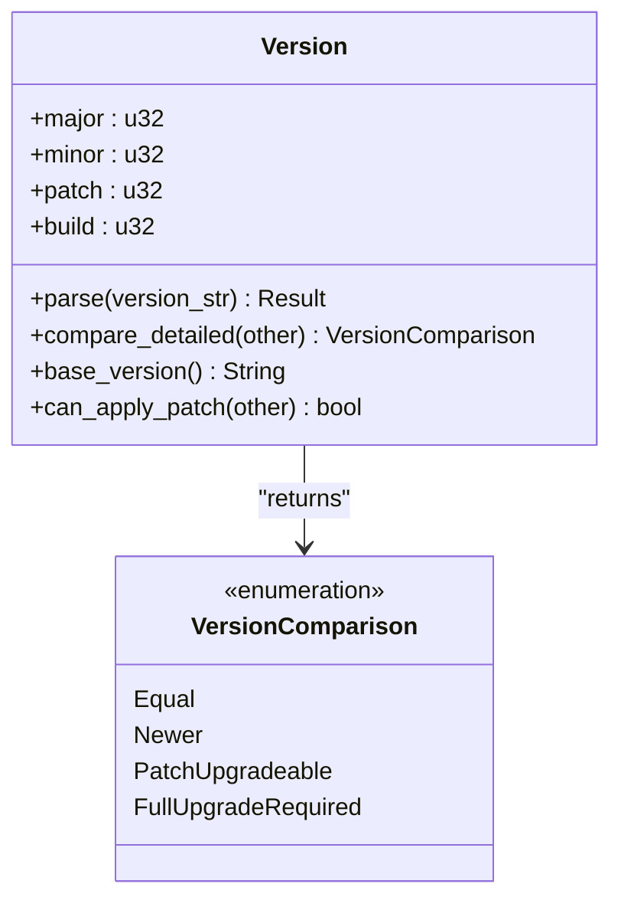
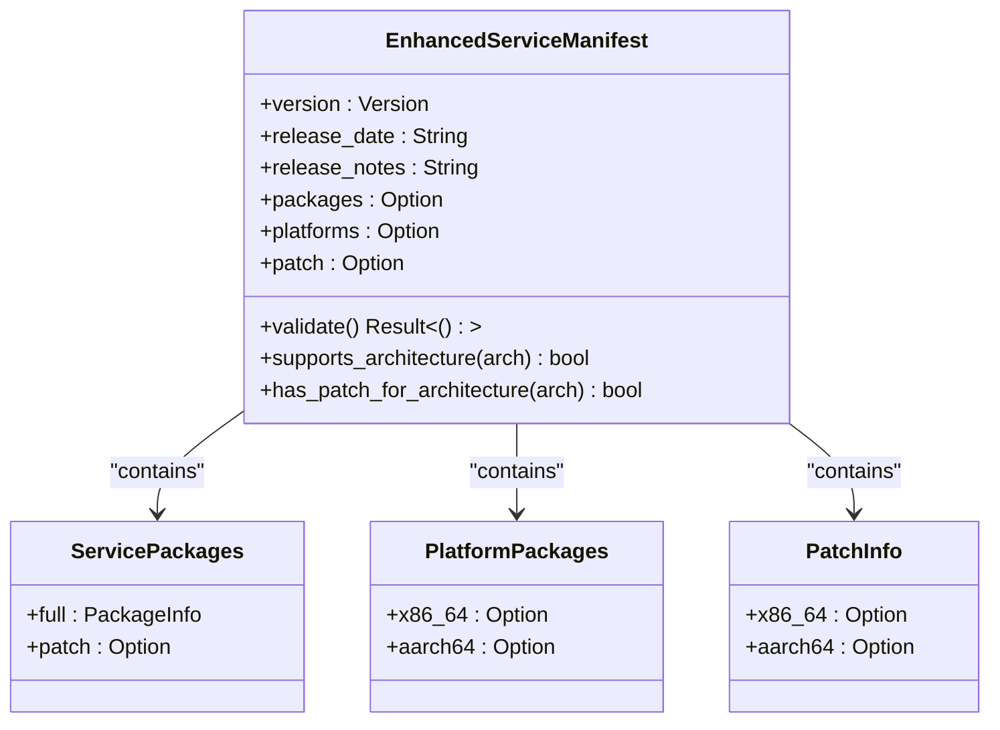
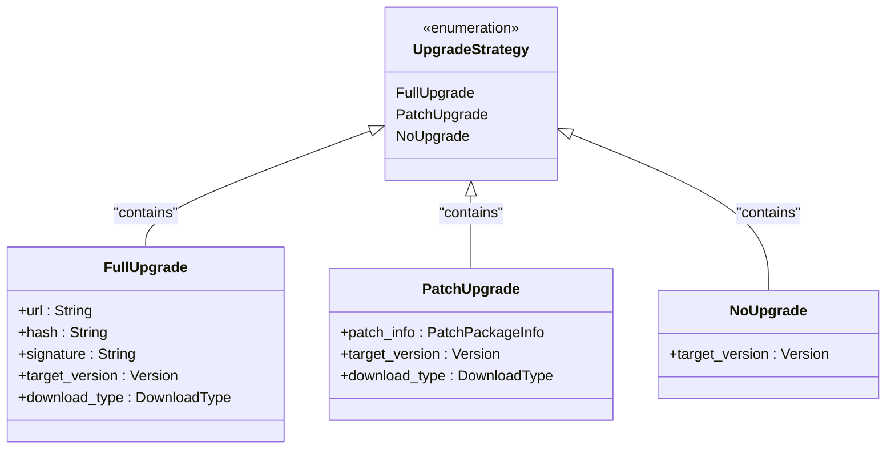
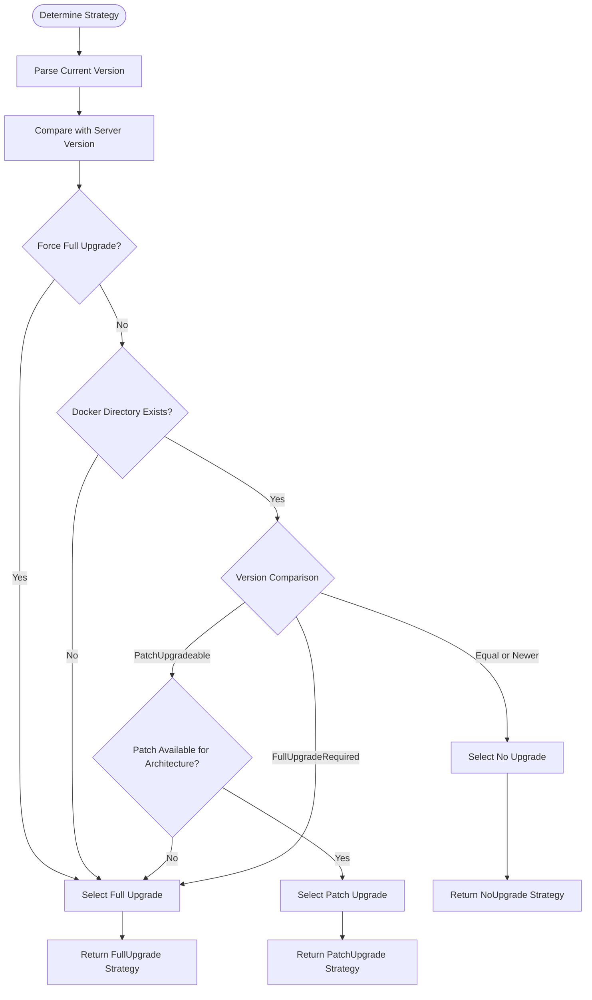
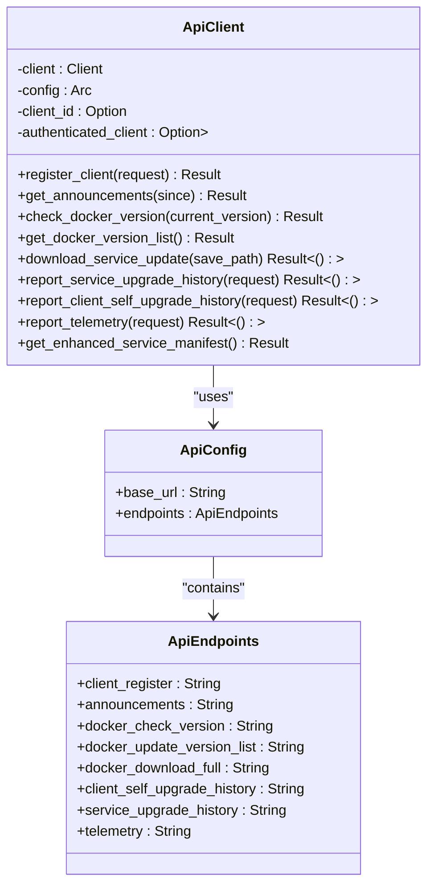
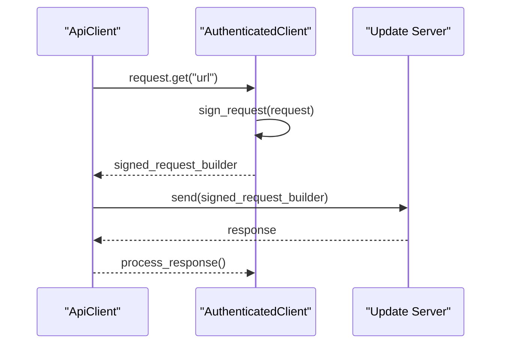
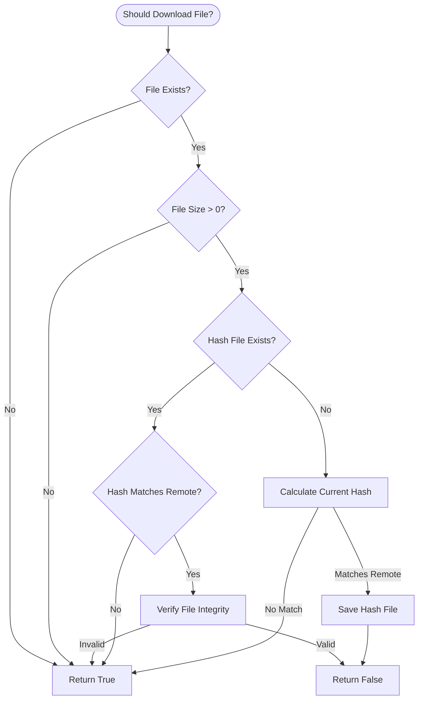

# API and Data Structures

<cite>
**Referenced Files in This Document**   
- [api_types.rs](file://client-core/src/api_types.rs#L0-L902)
- [upgrade_strategy.rs](file://client-core/src/upgrade_strategy.rs#L0-L462)
- [api.rs](file://client-core/src/api.rs#L0-L976)
- [authenticated_client.rs](file://client-core/src/authenticated_client.rs)
- [version.rs](file://client-core/src/version.rs)
- [models.rs](file://client-core/src/db/models.rs)
</cite>

## Table of Contents
1. [Introduction](#introduction)
2. [Core Data Structures](#core-data-structures)
3. [Version System](#version-system)
4. [Service Manifest Format](#service-manifest-format)
5. [Upgrade Strategy System](#upgrade-strategy-system)
6. [API Client Implementation](#api-client-implementation)
7. [Authentication Mechanisms](#authentication-mechanisms)
8. [Data Access and Caching](#data-access-and-caching)
9. [Security Considerations](#security-considerations)
10. [Sample Data Representations](#sample-data-representations)

## Introduction
This document provides comprehensive documentation for the core API data structures and functionality of the Duck Client system. The system implements a sophisticated update mechanism that supports both full and incremental (patch) upgrades for Docker-based services, with architecture-specific package handling for x86_64 and aarch64 platforms. The design emphasizes backward compatibility while introducing enhanced capabilities for efficient updates and secure package management. The documentation covers data models, serialization formats, validation rules, API client implementation, and upgrade decision logic.

## Core Data Structures

The core data structures are defined in `api_types.rs` and represent the primary data exchange formats between the client and server. These structures use Serde for JSON serialization and deserialization, with comprehensive validation rules to ensure data integrity.

### Version Structure
The `Version` structure supports four-segment version numbers (major.minor.patch.build) and provides comparison functionality to determine upgrade requirements.

### EnhancedServiceManifest
The `EnhancedServiceManifest` structure represents the service update manifest format used for remote updates. It contains version information, release details, and package URLs for both full and incremental updates.

### PatchPackageInfo
The `PatchPackageInfo` structure defines the format for incremental update packages, including the download URL, cryptographic signatures, and file operations to be performed during the patch application.

**Section sources**
- [api_types.rs](file://client-core/src/api_types.rs#L0-L902)

## Version System

The version system is implemented in `version.rs` and provides robust version parsing and comparison capabilities. The system supports four-segment version numbers in the format major.minor.patch.build, allowing for fine-grained version control and upgrade decisions.

The version comparison logic determines whether an upgrade is required and what type of upgrade (full or incremental) is appropriate based on the version differences. The system can identify when only the build number has changed (indicating a patch upgrade) versus when major, minor, or patch versions have changed (indicating a full upgrade).



**Diagram sources**
- [version.rs](file://client-core/src/version.rs)

**Section sources**
- [version.rs](file://client-core/src/version.rs)

## Service Manifest Format

The service manifest format has been enhanced to support architecture-specific builds and incremental updates while maintaining backward compatibility with the legacy format.

### EnhancedServiceManifest Structure
The `EnhancedServiceManifest` structure extends the traditional service manifest with new capabilities:



**Diagram sources**
- [api_types.rs](file://client-core/src/api_types.rs#L200-L300)

**Section sources**
- [api_types.rs](file://client-core/src/api_types.rs#L200-L300)

### Field Definitions
- **version**: The target version for the update, supporting four-segment format
- **release_date**: RFC 3339 formatted timestamp of the release
- **release_notes**: Human-readable description of changes in this version
- **packages**: Optional container for traditional package information (backward compatibility)
- **platforms**: Optional container for architecture-specific full packages
- **patch**: Optional container for architecture-specific incremental update packages

### Validation Rules
The manifest includes comprehensive validation rules:
- Release date must be in valid RFC 3339 format
- At least one platform package must be provided if platforms field exists
- URLs must have valid HTTP/HTTPS or local file format
- Patch operations must not reference dangerous paths (e.g., system directories)

## Upgrade Strategy System

The upgrade strategy system determines the appropriate upgrade method based on current version, target version, system architecture, and environmental factors.

### UpgradeStrategy Enum
The `UpgradeStrategy` enum defines three possible upgrade paths:



**Diagram sources**
- [upgrade_strategy.rs](file://client-core/src/upgrade_strategy.rs#L50-L100)

**Section sources**
- [upgrade_strategy.rs](file://client-core/src/upgrade_strategy.rs#L50-L100)

### Decision Logic
The `UpgradeStrategyManager` implements the decision logic for selecting the appropriate upgrade strategy:



**Diagram sources**
- [upgrade_strategy.rs](file://client-core/src/upgrade_strategy.rs#L150-L300)

**Section sources**
- [upgrade_strategy.rs](file://client-core/src/upgrade_strategy.rs#L150-L300)

### Key Decision Factors
1. **Version Compatibility**: Determines if the current version can be incrementally updated
2. **Architecture Support**: Checks for available packages for the current system architecture
3. **Force Full Flag**: Allows administrators to mandate full upgrades
4. **Environment Check**: Verifies the presence of required Docker directories

## API Client Implementation

The API client implementation in `api.rs` provides methods for interacting with the update server and managing the upgrade process.

### ApiClient Structure
The `ApiClient` class handles all communication with the update server:



**Diagram sources**
- [api.rs](file://client-core/src/api.rs#L50-L100)

**Section sources**
- [api.rs](file://client-core/src/api.rs#L50-L100)

### Key Methods
- **get_enhanced_service_manifest()**: Retrieves the service manifest with automatic format detection and backward compatibility
- **download_service_update_optimized()**: Downloads update packages with hash verification and progress tracking
- **report_service_upgrade_history()**: Reports upgrade results to the server for telemetry

## Authentication Mechanisms

The authentication system is implemented in `authenticated_client.rs` and provides secure access to protected resources. The system uses a layered approach with both client identification and authenticated requests.

### AuthenticatedClient
The `AuthenticatedClient` struct manages authentication tokens and provides methods for making authenticated requests. It integrates with the main `ApiClient` through dependency injection, allowing for flexible authentication strategies.

The authentication flow follows a standard pattern:
1. Client registration to obtain a client ID
2. Token acquisition (implementation details in `authenticated_client.rs`)
3. Signed requests using cryptographic signatures
4. Token refresh and renewal



**Diagram sources**
- [authenticated_client.rs](file://client-core/src/authenticated_client.rs)
- [api.rs](file://client-core/src/api.rs#L200-L250)

**Section sources**
- [authenticated_client.rs](file://client-core/src/authenticated_client.rs)
- [api.rs](file://client-core/src/api.rs#L200-L250)

## Data Access and Caching

The system implements sophisticated data access patterns and caching strategies to optimize performance and reduce bandwidth usage.

### Manifest Caching
Remote manifests are cached locally to minimize network requests. The system uses a combination of HTTP caching headers and local file storage to maintain manifest freshness while reducing server load.

### Intelligent Download Decisions
The `should_download_file()` method implements a multi-layered decision process:



**Diagram sources**
- [api.rs](file://client-core/src/api.rs#L800-L900)

**Section sources**
- [api.rs](file://client-core/src/api.rs#L800-L900)

### Performance Considerations
- **Progressive Parsing**: Large configurations are parsed incrementally to minimize memory usage
- **Stream Processing**: Downloaded files are processed as streams to avoid loading entire files into memory
- **Connection Pooling**: The HTTP client maintains a connection pool for efficient request handling
- **Asynchronous Operations**: All I/O operations are non-blocking to maintain responsiveness

## Security Considerations

The system implements multiple security measures to protect against common vulnerabilities.

### Cryptographic Verification
All downloaded packages are verified using cryptographic signatures and hash checks:
- SHA-256 hashing for file integrity verification
- Digital signatures for package authenticity
- Secure storage of hash files with version and timestamp

### Path Security
The patch system includes strict path validation to prevent directory traversal attacks:
- Rejects paths containing "../" or "..\\"
- Blocks absolute paths starting with "/" or "C:\\"
- Validates all file and directory operations before execution

### Data Protection
Sensitive information is protected through:
- Secure transmission using HTTPS
- Client identification without exposing credentials
- Limited data collection with user consent

## Sample Data Representations

### Enhanced Service Manifest (JSON)
```json
{
  "version": "0.0.13",
  "release_date": "2025-01-12T13:49:59Z",
  "release_notes": "Enhanced version update",
  "packages": {
    "full": {
      "url": "https://example.com/docker.zip",
      "hash": "external",
      "signature": "",
      "size": 0
    }
  },
  "platforms": {
    "x86_64": {
      "signature": "dW50cnVzdGVkIGNvbW1lbnQ6IHNpZ25hdHVyZSBmcm9tIGNsaSBzZWNyZXQga2V5CkNMSS1MSU5VWC1YNjQtdjEuMS4w",
      "url": "https://packages.com/x86_64/docker.zip"
    },
    "aarch64": {
      "signature": "dW50cnVzdGVkIGNvbW1lbnQ6IHNpZ25hdHVyZSBmcm9tIGNsaSBzZWNyZXQga2V5CkNMSS1XSU5ET1dTLVg2NC12MS4xLjA=",
      "url": "https://packages.com/aarch64/docker.zip"
    }
  },
  "patch": {
    "x86_64": {
      "url": "https://packages.com/patches/x86_64-patch.tar.gz",
      "hash": "sha256:patch_hash_x86_64",
      "signature": "patch_signature_x86_64",
      "operations": {
        "replace": {
          "files": [
            "app/app.jar",
            "config/application.yml"
          ],
          "directories": [
            "front/",
            "plugins/"
          ]
        },
        "delete": {
          "files": [
            "app/app.jar",
            "config/application.yml"
          ],
          "directories": [
            "front/",
            "plugins/"
          ]
        }
      }
    }
  }
}
```

### Upgrade Strategy Response
```json
{
  "strategy": "PatchUpgrade",
  "patch_info": {
    "url": "https://packages.com/patches/x86_64-patch.tar.gz",
    "hash": "sha256:patch_hash_x86_64",
    "signature": "patch_signature_x86_64",
    "operations": {
      "replace": {
        "files": ["app/app.jar"],
        "directories": ["front/"]
      }
    }
  },
  "target_version": "0.0.13.2",
  "download_type": "patch"
}
```

### API Configuration
```json
{
  "base_url": "https://api.duck-client.com/v1",
  "endpoints": {
    "client_register": "/clients/register",
    "announcements": "/announcements",
    "docker_check_version": "/docker/versions/latest",
    "docker_update_version_list": "/docker/versions",
    "docker_download_full": "/downloads/docker",
    "client_self_upgrade_history": "/clients/upgrade-history",
    "service_upgrade_history": "/services/upgrade-history",
    "telemetry": "/telemetry"
  }
}
```

**Section sources**
- [api_types.rs](file://client-core/src/api_types.rs#L200-L300)
- [api.rs](file://client-core/src/api.rs#L50-L100)
- [upgrade_strategy.rs](file://client-core/src/upgrade_strategy.rs#L50-L100)