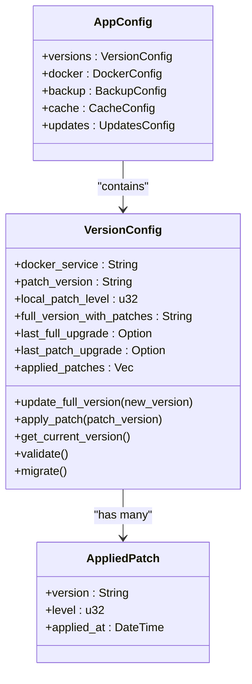
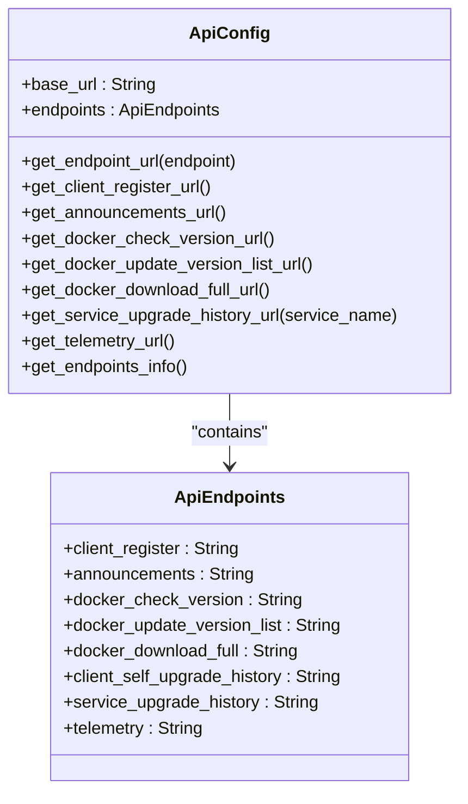
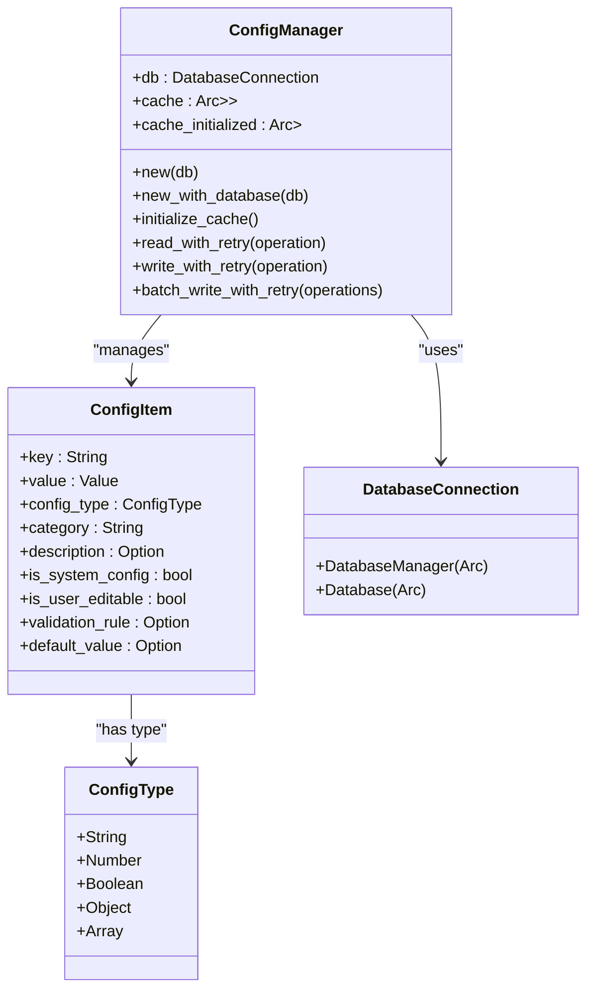
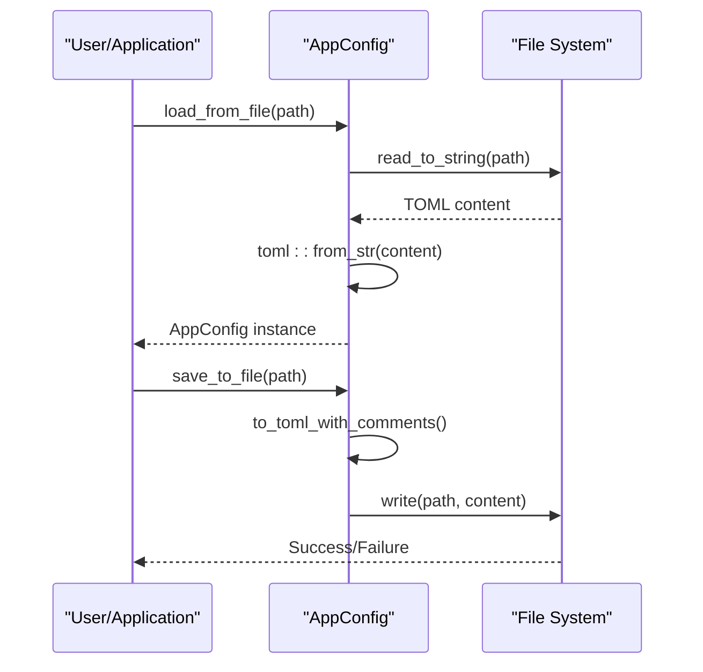
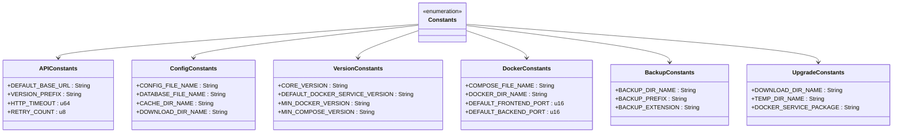

# Configuration Data Structures

<cite>
**Referenced Files in This Document**   
- [config.rs](file://client-core/src/config.rs#L0-L661)
- [api_config.rs](file://client-core/src/api_config.rs#L0-L125)
- [config_manager.rs](file://client-core/src/config_manager.rs#L0-L810)
- [constants.rs](file://client-core/src/constants.rs#L0-L522)
</cite>

## Table of Contents
1. [Introduction](#introduction)
2. [Core Configuration Structures](#core-configuration-structures)
3. [API Configuration](#api-configuration)
4. [Configuration Management](#configuration-management)
5. [Configuration Loading and Persistence](#configuration-loading-and-persistence)
6. [Default Values and Constants](#default-values-and-constants)
7. [Configuration File Format and Examples](#configuration-file-format-and-examples)
8. [Runtime Configuration Updates](#runtime-configuration-updates)
9. [Security and Validation](#security-and-validation)
10. [Conclusion](#conclusion)

## Introduction
This document provides comprehensive documentation for the configuration data structures used throughout the Duck Client system. The configuration system is designed to manage application settings, API endpoints, version information, and runtime behavior in a structured and maintainable way. The system uses TOML as the primary serialization format and provides robust mechanisms for loading, validating, and managing configuration data. This documentation covers the core configuration structures, their relationships, default values, and how they are managed at runtime.

**Section sources**
- [config.rs](file://client-core/src/config.rs#L0-L661)
- [api_config.rs](file://client-core/src/api_config.rs#L0-L125)

## Core Configuration Structures

The core configuration structure in the Duck Client system is defined by the `AppConfig` struct, which serves as the main container for all application settings. This structure is composed of several sub-structures that organize configuration data by functional domain.

### AppConfig Structure
The `AppConfig` struct is the root configuration structure that contains all application settings. It is composed of several sub-configurations:

```rust
pub struct AppConfig {
    pub versions: VersionConfig,
    pub docker: DockerConfig,
    pub backup: BackupConfig,
    pub cache: CacheConfig,
    pub updates: UpdatesConfig,
}
```

Each field represents a specific aspect of the application's configuration:

- **versions**: Manages version information and patch history
- **docker**: Contains Docker service configuration
- **backup**: Handles backup settings and storage
- **cache**: Manages caching directories and behavior
- **updates**: Controls update and upgrade settings

### Version Configuration
The `VersionConfig` struct manages version information and patch history for the application. It supports both full version upgrades and incremental patch updates.

```rust
pub struct VersionConfig {
    pub docker_service: String,
    pub patch_version: String,
    pub local_patch_level: u32,
    pub full_version_with_patches: String,
    pub last_full_upgrade: Option<chrono::DateTime<chrono::Utc>>,
    pub last_patch_upgrade: Option<chrono::DateTime<chrono::Utc>>,
    pub applied_patches: Vec<AppliedPatch>,
}
```

Key fields include:
- **docker_service**: The base Docker service version
- **patch_version**: The current patch version identifier
- **local_patch_level**: The number of patches applied (build number)
- **full_version_with_patches**: Complete version string including patch level
- **applied_patches**: History of applied patches for audit and rollback

The `VersionConfig` struct includes methods for:
- Creating new version configurations with default values
- Updating the full version (resets patch level)
- Applying patches (increments patch level)
- Validating configuration consistency
- Migrating legacy configurations
- Rolling back patches

### Applied Patch Structure
The `AppliedPatch` struct records individual patch applications for audit and rollback purposes:

```rust
pub struct AppliedPatch {
    pub version: String,
    pub level: u32,
    pub applied_at: chrono::DateTime<chrono::Utc>,
}
```

This structure enables the system to maintain a complete history of patch applications, including when each patch was applied and at what level.



**Diagram sources**
- [config.rs](file://client-core/src/config.rs#L10-L199)

**Section sources**
- [config.rs](file://client-core/src/config.rs#L10-L199)

## API Configuration

The API configuration system manages the client's interaction with remote services through the `ApiConfig` and `ApiEndpoints` structs.

### ApiConfig Structure
The `ApiConfig` struct defines the configuration for API communication:

```rust
pub struct ApiConfig {
    pub base_url: String,
    pub endpoints: ApiEndpoints,
}
```

This structure separates the base server URL from the specific endpoint paths, allowing for flexible configuration and easy URL construction.

### ApiEndpoints Structure
The `ApiEndpoints` struct contains all API endpoint paths:

```rust
pub struct ApiEndpoints {
    pub client_register: String,
    pub announcements: String,
    pub docker_check_version: String,
    pub docker_update_version_list: String,
    pub docker_download_full: String,
    pub client_self_upgrade_history: String,
    pub service_upgrade_history: String,
    pub telemetry: String,
}
```

Each endpoint field corresponds to a specific API route on the server.

### Default Values and Construction
The `ApiConfig` struct implements the `Default` trait, providing sensible default values:

```rust
impl Default for ApiConfig {
    fn default() -> Self {
        Self {
            base_url: api::DEFAULT_BASE_URL.to_string(),
            endpoints: ApiEndpoints {
                client_register: api::endpoints::CLIENT_REGISTER.to_string(),
                // ... other endpoints
            },
        }
    }
}
```

### URL Construction Methods
The `ApiConfig` struct provides convenience methods for constructing complete URLs:

```rust
impl ApiConfig {
    pub fn get_endpoint_url(&self, endpoint: &str) -> String {
        format!("{}{}", self.base_url, endpoint)
    }
    
    pub fn get_client_register_url(&self) -> String {
        self.get_endpoint_url(&self.endpoints.client_register)
    }
    
    // ... other endpoint-specific methods
}
```

These methods ensure consistent URL construction throughout the application.

### Display Implementation
The `ApiConfig` struct implements the `Display` trait to provide a human-readable representation of the configuration:

```rust
impl fmt::Display for ApiConfig {
    fn fmt(&self, f: &mut fmt::Formatter<'_>) -> fmt::Result {
        writeln!(f, "Current API configuration:")?;
        writeln!(f, "Server address: {}", self.base_url)?;
        writeln!(f, "\nMain endpoints:")?;
        for (name, url) in self.get_endpoints_info() {
            writeln!(f, "  {name}: {url}")?;
        }
        Ok(())
    }
}
```

This implementation is useful for debugging and CLI output.



**Diagram sources**
- [api_config.rs](file://client-core/src/api_config.rs#L0-L125)

**Section sources**
- [api_config.rs](file://client-core/src/api_config.rs#L0-L125)

## Configuration Management

The configuration management system is centered around the `ConfigManager` struct, which provides a unified interface for managing configuration data.

### ConfigManager Structure
The `ConfigManager` struct manages configuration data with caching and database integration:

```rust
pub struct ConfigManager {
    db: DatabaseConnection,
    cache: Arc<RwLock<HashMap<String, ConfigItem>>>,
    cache_initialized: Arc<RwLock<bool>>,
}
```

Key components:
- **db**: Database connection for persistent storage
- **cache**: In-memory cache for performance
- **cache_initialized**: Flag indicating cache initialization status

### ConfigItem Structure
The `ConfigItem` struct represents individual configuration entries:

```rust
pub struct ConfigItem {
    pub key: String,
    pub value: Value,
    pub config_type: ConfigType,
    pub category: String,
    pub description: Option<String>,
    pub is_system_config: bool,
    pub is_user_editable: bool,
    pub validation_rule: Option<String>,
    pub default_value: Option<Value>,
}
```

This structure supports typed configuration values with metadata for management and validation.

### ConfigType Enumeration
The `ConfigType` enum defines supported configuration value types:

```rust
pub enum ConfigType {
    String,
    Number,
    Boolean,
    Object,
    Array,
}
```

This enables type-safe configuration management and validation.

### DatabaseConnection Enumeration
The `DatabaseConnection` enum supports different database backends:

```rust
pub enum DatabaseConnection {
    DatabaseManager(Arc<DatabaseManager>),
    Database(Arc<Database>),
}
```

This abstraction allows the configuration system to work with different database implementations.

### Key Features
The `ConfigManager` provides several important features:

- **Memory caching**: Improves performance by reducing database queries
- **Cache initialization**: Loads all configuration into memory on startup
- **Database integration**: Persists configuration changes to the database
- **Retry mechanisms**: Handles transient database errors
- **Batch operations**: Supports efficient bulk configuration updates

### Initialization and Cache Management
The `ConfigManager` supports two creation methods:

```rust
impl ConfigManager {
    pub fn new(db: Arc<DatabaseManager>) -> Self { /* ... */ }
    pub fn new_with_database(db: Arc<Database>) -> Self { /* ... */ }
}
```

The `initialize_cache` method loads all configuration data from the database into memory:

```rust
pub async fn initialize_cache(&self) -> Result<()> {
    // Load all configuration from database into cache
    // ...
}
```

This ensures that subsequent configuration reads are fast and don't require database access.



**Diagram sources**
- [config_manager.rs](file://client-core/src/config_manager.rs#L0-L199)

**Section sources**
- [config_manager.rs](file://client-core/src/config_manager.rs#L0-L199)

## Configuration Loading and Persistence

The configuration system provides robust mechanisms for loading and saving configuration data to disk.

### File-Based Configuration
The `AppConfig` struct includes methods for loading and saving configuration files:

```rust
impl AppConfig {
    pub fn load_from_file<P: AsRef<Path>>(path: P) -> Result<Self> {
        let content = fs::read_to_string(&path)?;
        let config: AppConfig = toml::from_str(&content)?;
        Ok(config)
    }
    
    pub fn save_to_file<P: AsRef<Path>>(&self, path: P) -> Result<()> {
        let content = self.to_toml_with_comments();
        fs::write(&path, content)?;
        Ok(())
    }
}
```

These methods enable the application to persist configuration changes between sessions.

### TOML Serialization
The configuration system uses TOML as the serialization format. The `toml::from_str` function parses TOML content into the `AppConfig` structure:

```rust
let config: AppConfig = toml::from_str(&content)?;
```

This provides a human-readable and editable configuration format.

### Template-Based Configuration Generation
The system uses a template-based approach to generate configuration files with comments:

```rust
fn to_toml_with_comments(&self) -> String {
    const TEMPLATE: &str = include_str!("../templates/config.toml.template");
    
    TEMPLATE
        .replace("{docker_service_version}", &self.get_docker_versions())
        .replace("{compose_file}", &compose_file)
        .replace("{backup_storage_dir}", &backup_storage_dir)
        // ... other replacements
}
```

This ensures that configuration files include helpful comments and examples.

### Directory Management
The configuration system includes methods for ensuring required directories exist:

```rust
pub fn ensure_cache_dirs(&self) -> Result<()> {
    fs::create_dir_all(&self.cache.cache_dir)?;
    fs::create_dir_all(&self.cache.download_dir)?;
    Ok(())
}
```

This prevents errors due to missing directories.

### Path Resolution
The system provides methods for resolving various directory paths:

```rust
pub fn get_download_dir(&self) -> PathBuf { /* ... */ }
pub fn get_backup_dir(&self) -> PathBuf { /* ... */ }
pub fn get_version_download_dir(&self, version: &str, download_type: &str) -> PathBuf { /* ... */ }
```

These methods abstract path construction and ensure consistency.



**Diagram sources**
- [config.rs](file://client-core/src/config.rs#L315-L330)

**Section sources**
- [config.rs](file://client-core/src/config.rs#L315-L514)

## Default Values and Constants

The configuration system relies on a comprehensive set of constants defined in the `constants.rs` file.

### API Constants
The `api` module contains constants for API configuration:

```rust
pub mod api {
    pub const DEFAULT_BASE_URL: &str = "https://api-version.nuwax.com";
    
    pub mod endpoints {
        pub const CLIENT_REGISTER: &str = "/api/v1/clients/register";
        pub const ANNOUNCEMENTS: &str = "/api/v1/clients/announcements";
        // ... other endpoints
    }
    
    pub mod http {
        pub const DEFAULT_TIMEOUT: u64 = 30;
        pub const DEFAULT_RETRY_COUNT: u8 = 3;
        pub const USER_AGENT: &str = "nuwax-cli/1.0";
    }
}
```

These constants provide default values for API endpoints, timeouts, and retry policies.

### Configuration File Constants
The `config` module defines constants for configuration files and directories:

```rust
pub mod config {
    pub const CONFIG_FILE_NAME: &str = "config.toml";
    pub const DATABASE_FILE_NAME: &str = "duck_client.db";
    pub const CACHE_DIR_NAME: &str = "cacheDuckData";
    pub const DOWNLOAD_DIR_NAME: &str = "download";
    
    pub fn get_config_file_path() -> PathBuf { /* ... */ }
    pub fn get_database_path() -> PathBuf { /* ... */ }
    pub fn get_default_cache_dir() -> PathBuf { /* ... */ }
}
```

These constants ensure consistent file and directory naming.

### Version Constants
The `version` module contains version-related constants:

```rust
pub mod version {
    pub mod version_info {
        pub const CORE_VERSION: &str = env!("CARGO_PKG_VERSION");
        pub const DEFAULT_DOCKER_SERVICE_VERSION: &str = "0.0.1";
        pub const MIN_DOCKER_VERSION: &str = "20.10.0";
        pub const MIN_COMPOSE_VERSION: &str = "2.0.0";
        pub const API_VERSION: &str = "v1";
        pub const CONFIG_FORMAT_VERSION: &str = "1.0";
        pub const DATABASE_SCHEMA_VERSION: &str = "1.0";
    }
}
```

These constants define the default Docker service version and minimum required versions for dependencies.

### Docker Constants
The `docker` module contains constants for Docker-related paths and ports:

```rust
pub mod docker {
    pub const COMPOSE_FILE_NAME: &str = "docker-compose.yml";
    pub const DOCKER_DIR_NAME: &str = "docker";
    pub const ENV_FILE_NAME: &str = ".env";
    
    pub mod ports {
        pub const DEFAULT_FRONTEND_PORT: u16 = 80;
        pub const DEFAULT_BACKEND_PORT: u16 = 8080;
        // ... other ports
    }
    
    pub mod env_vars {
        pub const FRONTEND_HOST_PORT: &str = "FRONTEND_HOST_PORT";
        // ... other environment variables
    }
}
```

These constants ensure consistent Docker configuration across the application.

### Backup and Update Constants
The `backup` and `upgrade` modules contain constants for backup and update operations:

```rust
pub mod backup {
    pub const BACKUP_DIR_NAME: &str = "backups";
    pub const BACKUP_PREFIX: &str = "backup_";
    pub const BACKUP_EXTENSION: &str = ".zip";
}

pub mod upgrade {
    pub const DOWNLOAD_DIR_NAME: &str = "downloads";
    pub const TEMP_DIR_NAME: &str = "temp";
    pub const DOCKER_SERVICE_PACKAGE: &str = "docker.zip";
    // ... other constants
}
```

These constants define the structure of backup and update operations.



**Diagram sources**
- [constants.rs](file://client-core/src/constants.rs#L0-L522)

**Section sources**
- [constants.rs](file://client-core/src/constants.rs#L0-L522)

## Configuration File Format and Examples

The configuration system uses TOML as the primary format for configuration files.

### TOML Format
TOML (Tom's Obvious, Minimal Language) is chosen for its readability and simplicity. The configuration file includes sections for different configuration domains:

```toml
# Version configuration
[versions]
docker_service = "0.0.1"
patch_version = "0.0.0"
local_patch_level = 0
full_version_with_patches = "0.0.1.0"

# Docker configuration
[docker]
compose_file = "docker/docker-compose.yml"
```

### Template-Based Generation
The system uses a template file (`config.toml.template`) to generate configuration files with comments:

```rust
const TEMPLATE: &str = include_str!("../templates/config.toml.template");
```

This template includes placeholders that are replaced with actual values:

```rust
TEMPLATE
    .replace("{docker_service_version}", &self.get_docker_versions())
    .replace("{compose_file}", &compose_file)
    // ... other replacements
```

### Example Configuration File
A complete configuration file might look like:

```toml
# Duck Client Configuration
# This file contains settings for the Duck Client application

# Version configuration
[versions]
# Base Docker service version
docker_service = "0.0.1"
# Current patch version
patch_version = "0.0.0"
# Number of patches applied
local_patch_level = 0
# Complete version with patch level
full_version_with_patches = "0.0.1.0"

# Docker service configuration
[docker]
# Path to docker-compose.yml file
compose_file = "docker/docker-compose.yml"

# Backup configuration
[backup]
# Directory for backup storage
storage_dir = "backups"

# Cache configuration
[cache]
# Directory for cache storage
cache_dir = "cacheDuckData"
# Directory for downloads
download_dir = "cacheDuckData/download"

# Update configuration
[updates]
# How often to check for updates
check_frequency = "daily"
```

### Customization
Users can customize settings by editing the configuration file directly. The template-based approach ensures that even if the file is regenerated, user modifications to values are preserved.

## Runtime Configuration Updates

The configuration system supports runtime updates through the `ConfigManager`.

### Memory Caching
The `ConfigManager` uses an in-memory cache to improve performance:

```rust
cache: Arc<RwLock<HashMap<String, ConfigItem>>>
```

This cache is initialized on startup and updated when configuration changes are made.

### Cache Initialization
The `initialize_cache` method loads all configuration from the database:

```rust
pub async fn initialize_cache(&self) -> Result<()> {
    // Load all configuration from database into cache
    // ...
}
```

This ensures that subsequent reads are fast and don't require database access.

### Configuration Updates
The system supports updating configuration at runtime:

```rust
pub async fn write_with_retry<F, R>(&self, operation: F) -> Result<R> { /* ... */ }
pub async fn batch_write_with_retry<F, R>(&self, operations: F) -> Result<R> { /* ... */ }
```

These methods ensure that configuration changes are persisted to the database.

### Reload Mechanism
While the provided code doesn't show an explicit reload mechanism, the design supports it:

1. Configuration is loaded from disk on startup
2. Changes are saved to disk via `save_to_file`
3. The application could implement a file watcher to detect changes
4. On change detection, reload configuration with `load_from_file`

### Thread Safety
The configuration system is designed to be thread-safe:

```rust
cache: Arc<RwLock<HashMap<String, ConfigItem>>>
cache_initialized: Arc<RwLock<bool>>
```

The use of `Arc` and `RwLock` allows multiple threads to safely access the configuration.

## Security and Validation

The configuration system includes several security and validation mechanisms.

### Configuration Validation
The `VersionConfig` struct includes validation methods:

```rust
pub fn validate(&self) -> Result<()> {
    // Validate base version format
    if self.docker_service.is_empty() {
        return Err(anyhow::anyhow!("docker_service cannot be empty"));
    }
    
    // Validate complete version format
    if !self.full_version_with_patches.is_empty() {
        let _version = self
            .full_version_with_patches
            .parse::<Version>()
            .map_err(|e| anyhow::anyhow!(format!("Invalid version format: {e}")))?;
    }
    
    // Validate patch level consistency
    if self.applied_patches.len() != self.local_patch_level as usize {
        tracing::warn!("Patch level inconsistent with history");
    }
    
    Ok(())
}
```

### Migration and Backward Compatibility
The system includes migration support for legacy configurations:

```rust
pub fn needs_migration(&self) -> bool {
    self.full_version_with_patches.is_empty()
        || (self.local_patch_level == 0 && !self.applied_patches.is_empty())
}

pub fn migrate(&mut self) -> Result<()> {
    if self.full_version_with_patches.is_empty() {
        self.full_version_with_patches =
            format!("{}.{}", self.docker_service, self.local_patch_level);
    }
    self.validate()?;
    Ok(())
}
```

### Sensitive Data Handling
While the provided code doesn't show specific sensitive data handling, the design considerations include:

- Configuration files are stored in the application directory
- No encryption is shown in the provided code
- Environment variables could be used for sensitive data
- The system could be extended to support encrypted configuration

### Type Safety
The configuration system uses strong typing to prevent errors:

```rust
pub enum ConfigType {
    String,
    Number,
    Boolean,
    Object,
    Array,
}
```

This ensures that configuration values are used correctly.

### Error Handling
The system uses the `anyhow` crate for comprehensive error handling:

```rust
use anyhow::Result;
```

This provides detailed error information for debugging.

## Conclusion
The Duck Client configuration system provides a comprehensive and robust framework for managing application settings. The system is built around several key components:

1. **AppConfig**: The root configuration structure that organizes settings by domain
2. **ApiConfig**: Manages API endpoint configuration and URL construction
3. **ConfigManager**: Provides a unified interface for configuration management with caching
4. **Constants**: Defines default values and system parameters

The system uses TOML as the serialization format, providing a human-readable and editable configuration file. Configuration is loaded from disk on startup and can be saved back to disk, with a template-based approach ensuring consistent file generation.

The configuration management system includes memory caching for performance, database integration for persistence, and thread-safe design for concurrent access. The system also includes validation and migration mechanisms to ensure configuration consistency and backward compatibility.

Overall, the configuration system is well-designed, maintainable, and provides the flexibility needed for a complex application like Duck Client.

**Section sources**
- [config.rs](file://client-core/src/config.rs#L0-L661)
- [api_config.rs](file://client-core/src/api_config.rs#L0-L125)
- [config_manager.rs](file://client-core/src/config_manager.rs#L0-L810)
- [constants.rs](file://client-core/src/constants.rs#L0-L522)