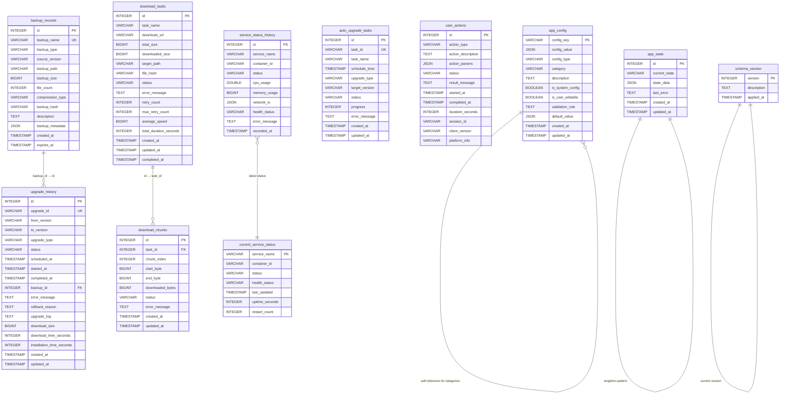

# Database Schema

<cite>
**Referenced Files in This Document**   
- [models.rs](file://client-core/src/db/models.rs)
- [init_duckdb.sql](file://client-core/migrations/init_duckdb.sql)
- [manager.rs](file://client-core/src/db/manager.rs)
- [actor.rs](file://client-core/src/db/actor.rs)
- [messages.rs](file://client-core/src/db/messages.rs)
</cite>

## Table of Contents
1. [Introduction](#introduction)
2. [Data Models](#data-models)
3. [DuckDB Schema Initialization](#duckdb-schema-initialization)
4. [Database Relationships](#database-relationships)
5. [Data Access Patterns](#data-access-patterns)
6. [Indexing and Performance Optimization](#indexing-and-performance-optimization)
7. [Data Lifecycle Management](#data-lifecycle-management)
8. [Migration Strategies](#migration-strategies)
9. [Backup Procedures](#backup-procedures)

## Introduction
This document provides comprehensive documentation for the DuckDB database schema used in the Duck Client application. The database serves as the central persistence layer for application configuration, state management, backup records, upgrade history, download tasks, and system monitoring. The schema is designed with concurrency optimization in mind, leveraging DuckDB's capabilities for high-performance read operations while maintaining data integrity through proper indexing and constraints.

The database architecture follows a modular design with distinct tables for different functional domains including application configuration, backup management, upgrade tracking, download operations, and system monitoring. The implementation uses an actor-based pattern for thread-safe database access, ensuring that all operations are serialized through a single-threaded actor to prevent race conditions.

**Section sources**
- [init_duckdb.sql](file://client-core/migrations/init_duckdb.sql#L1-L452)
- [models.rs](file://client-core/src/db/models.rs#L1-L27)

## Data Models
The application's data model is defined in the `models.rs` file, which contains Rust structs representing the primary entities in the system. These models are used for serialization/deserialization between the application and database layers.

### Backup Record Model
The `BackupRecord` struct represents a backup operation in the system, capturing essential metadata about each backup.

**Label Structure Requirements**
- **id**: i64 - Primary key identifier for the backup record
- **file_path**: String - File system path where the backup is stored
- **service_version**: String - Version of the service at the time of backup
- **backup_type**: String - Type of backup (e.g., FULL, INCREMENTAL)
- **status**: String - Current status of the backup operation
- **created_at**: DateTime<Utc> - Timestamp when the backup was created

```rust
pub struct BackupRecord {
    pub id: i64,
    pub file_path: String,
    pub service_version: String,
    pub backup_type: String,
    pub status: String,
    pub created_at: DateTime<Utc>,
}
```

### Scheduled Task Model
The `ScheduledTask` struct represents a scheduled operation in the system, such as an automatic upgrade or backup task.

**Label Structure Requirements**
- **id**: i64 - Primary key identifier for the task
- **task_type**: String - Type of task (e.g., backup, upgrade)
- **target_version**: String - Target version for upgrade tasks
- **scheduled_at**: DateTime<Utc> - When the task is scheduled to execute
- **status**: String - Current execution status of the task
- **details**: Option<String> - Additional details about task execution
- **created_at**: DateTime<Utc> - Timestamp when the task was created
- **completed_at**: Option<DateTime<Utc>> - Timestamp when the task completed

```rust
pub struct ScheduledTask {
    pub id: i64,
    pub task_type: String,
    pub target_version: String,
    pub scheduled_at: DateTime<Utc>,
    pub status: String,
    pub details: Option<String>,
    pub created_at: DateTime<Utc>,
    pub completed_at: Option<DateTime<Utc>>,
}
```

**Section sources**
- [models.rs](file://client-core/src/db/models.rs#L8-L26)

## DuckDB Schema Initialization
The database schema is initialized through the `init_duckdb.sql` script, which creates all necessary tables, indexes, sequences, and default configuration values. The schema is designed to support the application's core functionality including configuration management, state tracking, backup operations, and upgrade history.

### App Configuration Table
The `app_config` table serves as a unified configuration store for the application, replacing separate config and UI settings tables.

**Table Structure**
- **config_key**: VARCHAR - Primary key, unique identifier for the configuration
- **config_value**: JSON - Configuration value stored in JSON format
- **config_type**: VARCHAR - Data type (STRING/NUMBER/BOOLEAN/OBJECT/ARRAY)
- **category**: VARCHAR - Configuration category (system/ui/backup/upgrade/etc.)
- **description**: TEXT - Human-readable description of the configuration
- **is_system_config**: BOOLEAN - Whether the config is a system setting
- **is_user_editable**: BOOLEAN - Whether users can modify the setting
- **validation_rule**: TEXT - Validation rules (JSON Schema or regex)
- **default_value**: JSON - Default value for the configuration
- **created_at**: TIMESTAMP - Creation timestamp
- **updated_at**: TIMESTAMP - Last update timestamp

The table includes indexes on category, system config flag, and user editable flag to optimize query performance for configuration management operations.

### App State Table
The `app_state` table implements a singleton pattern to track the current application state.

**Table Structure**
- **id**: INTEGER - Primary key with CHECK constraint (id = 1)
- **current_state**: VARCHAR - Current state enumeration
- **state_data**: JSON - State-specific data in JSON format
- **last_error**: TEXT - Last error message encountered
- **created_at**: TIMESTAMP - Creation timestamp
- **updated_at**: TIMESTAMP - Last update timestamp

This table uses a CHECK constraint to ensure only one record exists, preventing multiple state entries.

### Download Tasks Table
The `download_tasks` table manages download operations with support for resumable downloads.

**Table Structure**
- **id**: INTEGER - Primary key using sequence
- **task_name**: VARCHAR - Name of the download task
- **download_url**: VARCHAR - Source URL for download
- **total_size**: BIGINT - Total file size in bytes
- **downloaded_size**: BIGINT - Bytes downloaded (updated at key intervals)
- **target_path**: VARCHAR - Local file system path
- **file_hash**: VARCHAR - Hash for integrity verification
- **status**: VARCHAR - PENDING/DOWNLOADING/PAUSED/COMPLETED/FAILED
- **error_message**: TEXT - Error details if download failed
- **retry_count**: INTEGER - Number of retry attempts
- **max_retry_count**: INTEGER - Maximum allowed retries
- **average_speed**: BIGINT - Average download speed (calculated on completion)
- **total_duration_seconds**: INTEGER - Total download duration
- **created_at**: TIMESTAMP - Creation timestamp
- **updated_at**: TIMESTAMP - Last update timestamp
- **completed_at**: TIMESTAMP - Completion timestamp

The table is optimized to minimize write conflicts by only updating key fields at critical points rather than continuously.

### Backup Records Table
The `backup_records` table stores metadata about backup operations.

**Table Structure**
- **id**: INTEGER - Primary key using sequence
- **backup_name**: VARCHAR - Unique name for the backup
- **backup_type**: VARCHAR - FULL/INCREMENTAL/DATA_ONLY
- **source_version**: VARCHAR - Service version at backup time
- **backup_path**: VARCHAR - File system location of backup
- **backup_size**: BIGINT - Size of backup in bytes
- **file_count**: INTEGER - Number of files in backup
- **compression_type**: VARCHAR - Compression algorithm used (default: gzip)
- **backup_hash**: VARCHAR - Hash for integrity verification
- **description**: TEXT - User-provided description
- **backup_metadata**: JSON - Additional metadata in JSON format
- **created_at**: TIMESTAMP - Creation timestamp
- **expires_at**: TIMESTAMP - Optional expiration timestamp

Indexes are created on creation time and backup type to optimize queries for backup management.

### Upgrade History Table
The `upgrade_history` table tracks all upgrade operations with detailed metadata.

**Table Structure**
- **id**: INTEGER - Primary key using sequence
- **upgrade_id**: VARCHAR - Unique identifier (UUID)
- **from_version**: VARCHAR - Source version
- **to_version**: VARCHAR - Target version
- **upgrade_type**: VARCHAR - FULL/INCREMENTAL/HOTFIX
- **status**: VARCHAR - PENDING/RUNNING/SUCCESS/FAILED/ROLLED_BACK
- **scheduled_at**: TIMESTAMP - Scheduled execution time
- **started_at**: TIMESTAMP - Actual start time
- **completed_at**: TIMESTAMP - Completion time
- **backup_id**: INTEGER - Foreign key to backup_records
- **error_message**: TEXT - Error details if upgrade failed
- **rollback_reason**: TEXT - Reason for rollback if applicable
- **upgrade_log**: TEXT - Detailed upgrade process log
- **download_size**: BIGINT - Size of upgrade package
- **download_time_seconds**: INTEGER - Duration of download phase
- **installation_time_seconds**: INTEGER - Duration of installation phase
- **created_at**: TIMESTAMP - Creation timestamp
- **updated_at**: TIMESTAMP - Last update timestamp

The table includes foreign key constraints to ensure referential integrity with backup records.

**Section sources**
- [init_duckdb.sql](file://client-core/migrations/init_duckdb.sql#L7-L387)

## Database Relationships
The database schema establishes relationships between various entities to maintain data integrity and enable efficient querying.



**Diagram sources**
- [init_duckdb.sql](file://client-core/migrations/init_duckdb.sql#L7-L387)

## Data Access Patterns
The application uses an actor-based pattern for database access through the `DbManager` in `manager.rs`, which communicates with a `DuckDbActor` to ensure thread-safe operations.

### DbManager Implementation
The `DuckDbManager` struct provides a high-level interface for database operations, using message passing to communicate with the underlying `DuckDbActor`.

```mermaid
sequenceDiagram
participant Application as "Application"
participant DbManager as "DuckDbManager"
participant Actor as "DuckDbActor"
participant Database as "DuckDB"
Application->>DbManager : create_backup_record()
DbManager->>Actor : Send DbMessage : : CreateBackupRecord
Actor->>Database : Execute INSERT INTO backup_records
Database-->>Actor : Return generated ID
Actor-->>DbManager : Send result via oneshot channel
DbManager-->>Application : Return backup ID
Application->>DbManager : get_all_backups()
DbManager->>Actor : Send DbMessage : : GetAllBackups
Actor->>Database : Execute SELECT from backup_records
Database-->>Actor : Return backup records
Actor-->>DbManager : Send result via oneshot channel
DbManager-->>Application : Return backup list
```

**Diagram sources**
- [manager.rs](file://client-core/src/db/manager.rs#L1-L540)
- [actor.rs](file://client-core/src/db/actor.rs#L1-L742)

### Common Queries and Transactions
The database access patterns follow a consistent message-based approach:

#### Configuration Management
```rust
// Get configuration value
async fn get_config(&self, key: &str) -> Result<Option<String>> {
    let (respond_to, receiver) = oneshot::channel();
    self.sender.send(DbMessage::GetConfig { 
        key: key.to_string(), 
        respond_to 
    }).await?;
    receiver.await?
}

// Set configuration value
async fn set_config(&self, key: &str, value: &str) -> Result<()> {
    let (respond_to, receiver) = oneshot::channel();
    self.sender.send(DbMessage::SetConfig { 
        key: key.to_string(), 
        value: value.to_string(), 
        respond_to 
    }).await?;
    receiver.await?
}
```

#### Backup Operations
```rust
// Create backup record
async fn create_backup_record(
    &self,
    file_path: String,
    service_version: String,
    backup_type: &str,
    status: &str,
) -> Result<i64> {
    let (respond_to, receiver) = oneshot::channel();
    self.sender.send(DbMessage::CreateBackupRecord {
        file_path,
        service_version,
        backup_type: backup_type.to_string(),
        status: status.to_string(),
        respond_to,
    }).await?;
    receiver.await?
}

// Get all backup records
async fn get_all_backups(&self) -> Result<Vec<BackupRecord>> {
    let (respond_to, receiver) = oneshot::channel();
    self.sender.send(DbMessage::GetAllBackups { respond_to }).await?;
    receiver.await?
}
```

#### Download Management
```rust
// Create download task
async fn create_download_task(
    &self,
    task_name: String,
    download_url: String,
    total_size: i64,
    target_path: String,
    file_hash: Option<String>,
) -> Result<i64> {
    let (respond_to, receiver) = oneshot::channel();
    self.sender.send(DbMessage::CreateDownloadTask {
        task_name,
        download_url,
        total_size,
        target_path,
        file_hash,
        respond_to,
    }).await?;
    receiver.await?
}
```

**Section sources**
- [manager.rs](file://client-core/src/db/manager.rs#L1-L540)
- [actor.rs](file://client-core/src/db/actor.rs#L1-L742)
- [messages.rs](file://client-core/src/db/messages.rs#L1-L196)

## Indexing and Performance Optimization
The database schema includes several indexing strategies and performance optimizations to ensure efficient query execution and scalability.

### Primary Indexes
The schema employs various index types to optimize different query patterns:

#### B-Tree Indexes
```sql
-- Configuration table indexes
CREATE INDEX IF NOT EXISTS idx_app_config_category ON app_config(category);
CREATE INDEX IF NOT EXISTS idx_app_config_system ON app_config(is_system_config);
CREATE INDEX IF NOT EXISTS idx_app_config_editable ON app_config(is_user_editable);

-- Backup records indexes
CREATE INDEX IF NOT EXISTS idx_backup_records_created_at ON backup_records(created_at);
CREATE INDEX IF NOT EXISTS idx_backup_records_type ON backup_records(backup_type);

-- Upgrade history indexes
CREATE INDEX IF NOT EXISTS idx_upgrade_history_status ON upgrade_history(status);
CREATE INDEX IF NOT EXISTS idx_upgrade_history_versions ON upgrade_history(from_version, to_version);

-- Download tasks indexes
CREATE INDEX IF NOT EXISTS idx_download_chunks_task_id ON download_chunks(task_id);
CREATE INDEX IF NOT EXISTS idx_download_tasks_status ON download_tasks(status);

-- System checks index
CREATE INDEX IF NOT EXISTS idx_system_checks_type_platform ON system_checks(check_type, platform);

-- Service status index
CREATE INDEX IF NOT EXISTS idx_service_status_service_time ON service_status_history(service_name, recorded_at);

-- User actions indexes
CREATE INDEX IF NOT EXISTS idx_user_actions_type_time ON user_actions(action_type, started_at);
CREATE INDEX IF NOT EXISTS idx_user_actions_status ON user_actions(status);

-- Performance metrics index
CREATE INDEX IF NOT EXISTS idx_performance_metrics_name_time ON performance_metrics(metric_name, recorded_at);

-- Auto upgrade tasks indexes
CREATE INDEX IF NOT EXISTS idx_auto_upgrade_tasks_status ON auto_upgrade_tasks(status);
CREATE INDEX IF NOT EXISTS idx_auto_upgrade_tasks_schedule ON auto_upgrade_tasks(schedule_time);
```

### Performance Optimization Strategies
The schema incorporates several performance optimization techniques:

1. **JSON Storage for Complex Data**: Uses JSON columns for flexible data storage in `app_config.config_value` and `backup_metadata`, allowing schema flexibility without additional tables.

2. **Sequence-Based Primary Keys**: Employs sequences for primary key generation to ensure efficient ID allocation and avoid contention.

3. **Minimal Write Operations**: Optimizes for concurrency by minimizing frequent writes to high-contention fields, updating key metrics only at critical points.

4. **UPSERT Pattern**: Uses INSERT OR REPLACE for singleton tables like `app_state` to avoid race conditions in concurrent environments.

5. **View-Based Query Optimization**: Creates views for common query patterns to simplify complex queries and improve readability.

```sql
-- Current download progress view
CREATE VIEW IF NOT EXISTS current_download_progress AS
SELECT 
    dt.id,
    dt.task_name,
    dt.total_size,
    dt.downloaded_size,
    ROUND(dt.downloaded_size * 100.0 / dt.total_size, 2) as progress_percentage,
    dt.status,
    dt.created_at,
    dt.updated_at,
    COUNT(dc.id) as total_chunks,
    COUNT(CASE WHEN dc.status = 'COMPLETED' THEN 1 END) as completed_chunks
FROM download_tasks dt
LEFT JOIN download_chunks dc ON dt.id = dc.task_id
WHERE dt.status IN ('DOWNLOADING', 'PAUSED')
GROUP BY dt.id, dt.task_name, dt.total_size, dt.downloaded_size, dt.status, dt.created_at, dt.updated_at;
```

**Section sources**
- [init_duckdb.sql](file://client-core/migrations/init_duckdb.sql#L15-L387)

## Data Lifecycle Management
The application implements comprehensive data lifecycle management policies for various data types, including retention policies, cleanup procedures, and backup expiration.

### Retention Policies
The system defines specific retention periods for different types of historical data:

**Label Structure Requirements**
- **backup.retention_days**: 30 days - Manual backup retention period
- **auto_backup_retention_days**: 7 days - Automatic backup retention period
- **maintenance.cleanup_service_history_days**: 7 days - Service status history retention
- **maintenance.cleanup_user_actions_days**: 90 days - User action audit log retention
- **maintenance.cleanup_performance_metrics_days**: 30 days - Performance monitoring data retention

These policies are configured in the `app_config` table and can be modified by users through the application interface.

### Data Expiration and Cleanup
The schema supports automatic cleanup of expired data through scheduled maintenance tasks:

1. **Backup Expiration**: The `backup_records` table includes an `expires_at` column that can be used to automatically clean up expired backups.

2. **Historical Data Cleanup**: Maintenance configuration settings define retention periods for various historical records, with automatic cleanup processes running according to the configured schedule.

3. **Database Optimization**: The system includes automatic database optimization with a configurable schedule (default: weekly at 2:00 AM).

```sql
-- Database maintenance configuration
INSERT OR IGNORE INTO app_config (config_key, config_value, config_type, category, description, is_system_config, is_user_editable, default_value) VALUES
('maintenance.cleanup_service_history_days', '7', 'NUMBER', 'maintenance', '服务状态历史保留天数', TRUE, TRUE, '7'),
('maintenance.cleanup_user_actions_days', '90', 'NUMBER', 'maintenance', '用户操作历史保留天数', TRUE, TRUE, '90'),
('maintenance.cleanup_performance_metrics_days', '30', 'NUMBER', 'maintenance', '性能监控数据保留天数', TRUE, TRUE, '30'),
('maintenance.vacuum_schedule', '"0 2 * * 0"', 'STRING', 'maintenance', '数据库VACUUM计划（每周日凌晨2点）', TRUE, TRUE, '"0 2 * * 0"'),
('maintenance.auto_optimize_enabled', 'true', 'BOOLEAN', 'maintenance', '自动数据库优化', TRUE, TRUE, 'true');
```

### Automatic Cleanup Procedures
The application implements automatic cleanup procedures that run according to the configured schedules:

1. **Service Status History Cleanup**: Removes records older than the configured retention period (default: 7 days).

2. **User Action History Cleanup**: Archives or removes audit log entries older than the configured retention period (default: 90 days).

3. **Performance Metrics Cleanup**: Removes performance monitoring data older than the configured retention period (default: 30 days).

4. **Backup Cleanup**: Automatically removes expired backups based on their `expires_at` timestamp or retention policy.

**Section sources**
- [init_duckdb.sql](file://client-core/migrations/init_duckdb.sql#L280-L387)

## Migration Strategies
The application implements a robust migration strategy for schema evolution and version compatibility between client versions.

### Schema Version Management
The system uses a dedicated `schema_version` table to track database schema versions and ensure compatibility:

```sql
CREATE TABLE IF NOT EXISTS schema_version (
    version INTEGER PRIMARY KEY,
    description TEXT,
    applied_at TIMESTAMP NOT NULL DEFAULT CURRENT_TIMESTAMP
);

-- Record current database version
INSERT OR REPLACE INTO schema_version (version, description) VALUES 
(1, '初始数据库结构 - 支持DuckDB并发优化');
```

This table allows the application to:
- Detect the current schema version on startup
- Apply necessary migrations when upgrading
- Prevent downgrades to incompatible versions
- Provide meaningful error messages for version mismatches

### SQL Schema Diff Generation
The application uses a sophisticated SQL diff generation system to create migration scripts between different schema versions:


**Diagram sources**
- [init_duckdb.sql](file://client-core/migrations/init_duckdb.sql#L363-L387)

The migration system supports various types of schema changes:
- **Table Creation**: Adding new tables to support new features
- **Table Deletion**: Removing obsolete tables during refactoring
- **Column Modifications**: Changing data types, constraints, or default values
- **Index Management**: Adding or removing indexes for performance optimization
- **Constraint Updates**: Modifying primary keys, foreign keys, or unique constraints

### Version Compatibility
The application ensures version compatibility through several mechanisms:

1. **Forward Compatibility**: Newer clients can work with older database schemas by applying necessary migrations on startup.

2. **Backward Compatibility**: Schema changes are designed to be backward compatible when possible, allowing older clients to continue functioning with newer schemas.

3. **Migration Validation**: Migration scripts are validated for syntax correctness and potential issues before execution.

4. **Rollback Capability**: Critical operations maintain backup references to enable rollback in case of migration failures.

**Section sources**
- [init_duckdb.sql](file://client-core/migrations/init_duckdb.sql#L363-L387)
- [client-core/tests/sql_syntax_validation_test.rs](file://client-core/tests/sql_syntax_validation_test.rs#L151-L189)

## Backup Procedures
The application implements comprehensive backup procedures for both application data and the database itself.

### Application Data Backup
The backup system creates comprehensive backups of application data and configuration:

**Label Structure Requirements**
- **Backup Types**: FULL, INCREMENTAL, DATA_ONLY
- **Compression**: gzip (default)
- **Verification**: Hash-based integrity checking
- **Scheduling**: Configurable cron expressions
- **Retention**: Configurable retention policies

The backup process follows these steps:
1. **Preparation**: Gather all files and data to be backed up
2. **Archiving**: Compress files into a single archive
3. **Hashing**: Calculate hash for integrity verification
4. **Storage**: Save to configured backup directory
5. **Metadata**: Record backup details in database
6. **Verification**: Optionally verify backup integrity

### Database Backup and Recovery
The system implements robust database backup and recovery procedures:

#### Database Initialization
```rust
// Explicit database initialization
pub async fn init_database(&self) -> Result<()> {
    debug!("显式初始化数据库表...");
    self.init_tables().await?;
    debug!("数据库初始化完成");
    Ok(())
}

// Check if database is initialized
pub async fn is_database_initialized(&self) -> Result<bool> {
    match self.get_config("db_initialized").await {
        Ok(Some(value)) => Ok(value == "true"),
        Ok(None) => Ok(false),
        Err(_) => Ok(false),
    }
}
```

#### Backup Creation
The backup creation process is managed through the `create_backup_record` method:

```rust
fn create_backup_record(
    &mut self,
    file_path: &str,
    service_version: &str,
    backup_type: &str,
    _status: &str,
) -> Result<i64> {
    let backup_name = format!("backup_{}", chrono::Utc::now().format("%Y%m%d_%H%M%S"));
    
    self.connection.execute(
        "INSERT INTO backup_records (backup_name, backup_type, source_version, backup_path) 
         VALUES (?, ?, ?, ?)",
        params![backup_name, backup_type, service_version, file_path],
    )?;

    let id: i64 =
        self.connection
            .query_row("SELECT currval('backup_records_seq')", [], |row| row.get(0))?;

    Ok(id)
}
```

#### Recovery Process
The recovery process uses the upgrade history and backup records to restore the system to a previous state:

1. **Identify Target Backup**: Select the appropriate backup from the backup records
2. **Stop Services**: Halt all running services to prevent data corruption
3. **Restore Files**: Extract the backup archive to the working directory
4. **Update Database**: Record the recovery operation in the upgrade history
5. **Restart Services**: Bring services back online with the restored data

The system also supports automatic backup before upgrades, with rollback capability if the upgrade fails.

**Section sources**
- [manager.rs](file://client-core/src/db/manager.rs#L1-L540)
- [actor.rs](file://client-core/src/db/actor.rs#L1-L742)
- [init_duckdb.sql](file://client-core/migrations/init_duckdb.sql#L158-L188)