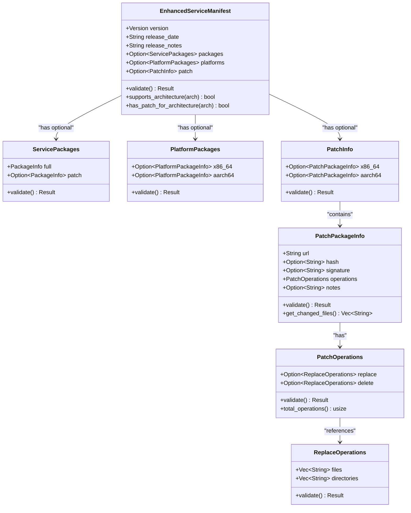
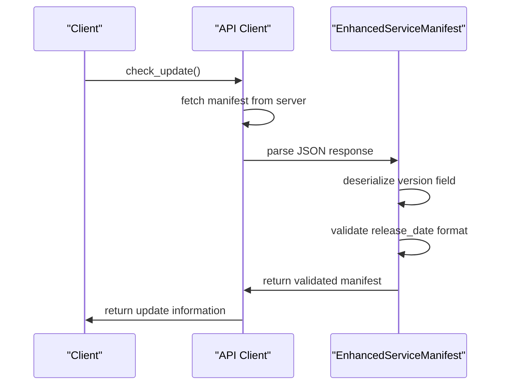
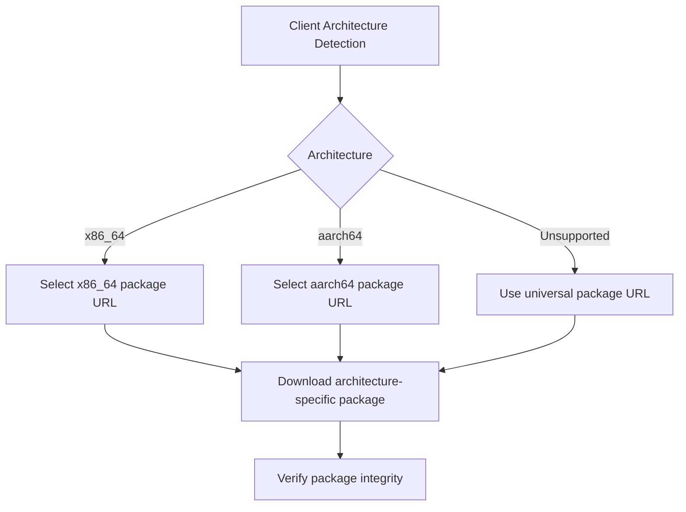
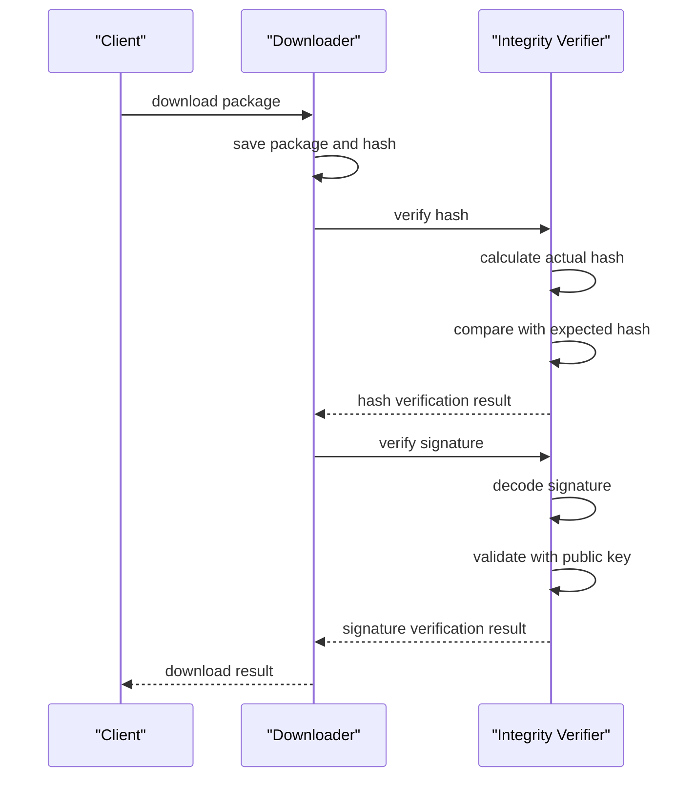
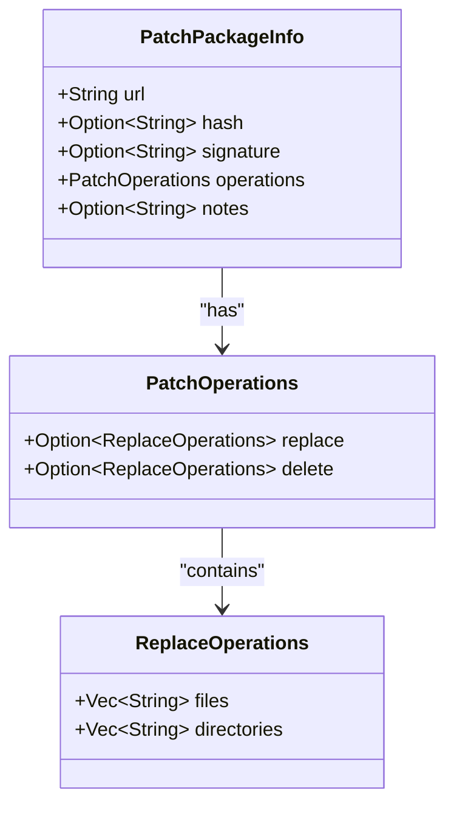
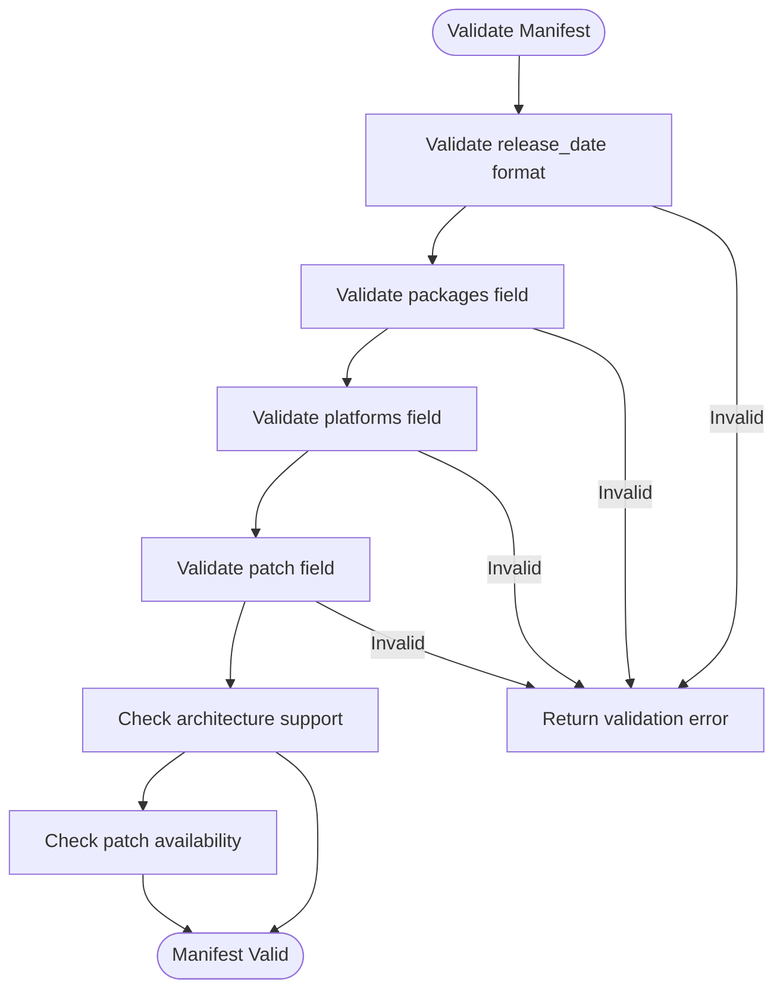
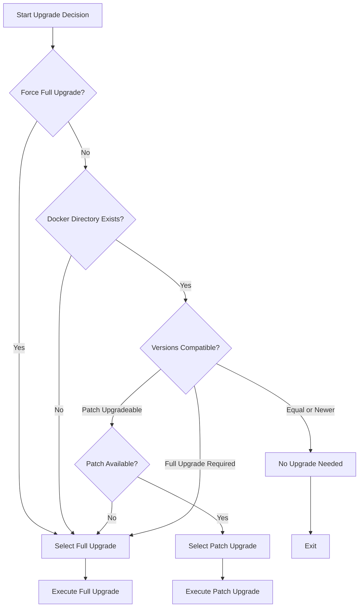
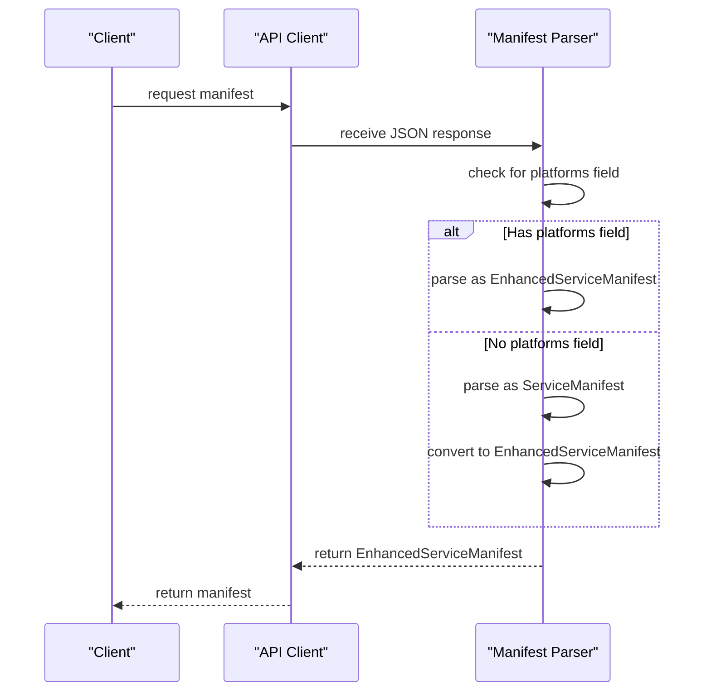
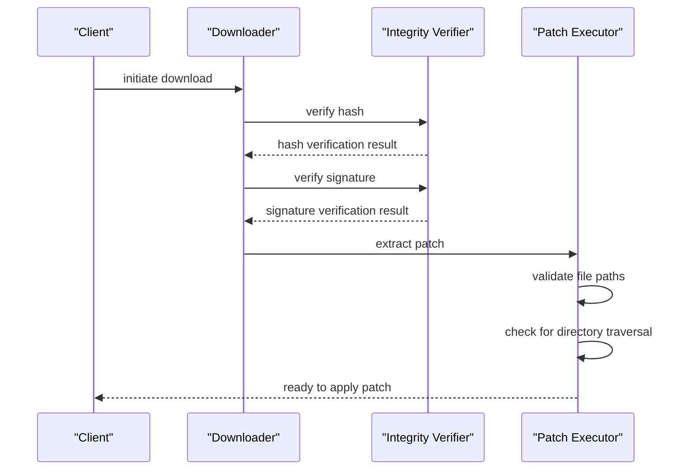

# Service Manifest Format

<cite>
**Referenced Files in This Document**   
- [api_types.rs](file://client-core/src/api_types.rs#L300-L600)
- [upgrade_strategy.rs](file://client-core/src/upgrade_strategy.rs#L0-L462)
- [patch_executor/mod.rs](file://client-core/src/patch_executor/mod.rs#L0-L431)
- [patch_executor/patch_processor.rs](file://client-core/src/patch_executor/patch_processor.rs#L0-L454)
- [patch_executor/file_operations.rs](file://client-core/src/patch_executor/file_operations.rs#L0-L523)
- [api.rs](file://client-core/src/api.rs#L600-L799)
</cite>

## Table of Contents
1. [Introduction](#introduction)
2. [EnhancedServiceManifest Structure](#enhancedservicemanifest-structure)
3. [Version Metadata and Release Information](#version-metadata-and-release-information)
4. [Package URLs and Architecture Detection](#package-urls-and-architecture-detection)
5. [Cryptographic Signatures and Security](#cryptographic-signatures-and-security)
6. [Patch Deltas and Incremental Updates](#patch-deltas-and-incremental-updates)
7. [Dependency Specifications and Validation](#dependency-specifications-and-validation)
8. [Upgrade Decision Logic](#upgrade-decision-logic)
9. [Schema Versioning and Backward Compatibility](#schema-versioning-and-backward-compatibility)
10. [Manifest Integration with Components](#manifest-integration-with-components)
11. [JSON Schema Definition](#json-schema-definition)
12. [Security Mechanisms](#security-mechanisms)

## Introduction
The EnhancedServiceManifest format is a critical component of the system's update mechanism, enabling intelligent upgrade decisions through support for both full and incremental updates. This document provides a comprehensive analysis of the manifest structure, its role in the upgrade process, and its integration with various system components. The manifest serves as the central configuration that defines available updates, their metadata, cryptographic signatures, and patch operations, while supporting multiple architectures and ensuring backward compatibility with older clients.

**Section sources**
- [api_types.rs](file://client-core/src/api_types.rs#L300-L600)
- [upgrade_strategy.rs](file://client-core/src/upgrade_strategy.rs#L0-L462)

## EnhancedServiceManifest Structure
The EnhancedServiceManifest is a JSON-based structure that extends the traditional service manifest format with support for architecture-specific packages and incremental updates. It contains version metadata, release information, package URLs, cryptographic signatures, and patch operations.



**Diagram sources**
- [api_types.rs](file://client-core/src/api_types.rs#L300-L600)

**Section sources**
- [api_types.rs](file://client-core/src/api_types.rs#L300-L600)

## Version Metadata and Release Information
The EnhancedServiceManifest contains comprehensive version metadata that enables intelligent upgrade decisions. The version field uses a semantic versioning scheme with an optional fourth component for incremental updates. The release_date field follows RFC 3339 format to ensure consistent timestamp parsing across clients.

The version field is deserialized using a custom function `version_from_str` that handles both standard semantic versions (e.g., "1.0.2") and extended versions with an incremental component (e.g., "1.0.2.4"). This allows the system to distinguish between major releases and incremental patches within the same base version.



**Diagram sources**
- [api_types.rs](file://client-core/src/api_types.rs#L300-L600)
- [api.rs](file://client-core/src/api.rs#L600-L799)

**Section sources**
- [api_types.rs](file://client-core/src/api_types.rs#L300-L600)

## Package URLs and Architecture Detection
The EnhancedServiceManifest supports both universal and architecture-specific package URLs through two distinct fields: `packages` and `platforms`. The `packages` field maintains backward compatibility with older clients by providing a single URL for all architectures, while the `platforms` field enables optimized downloads for specific architectures.

Architecture detection is performed automatically by the `Architecture::detect()` method, which identifies the client's CPU architecture (x86_64 or aarch64). The manifest uses this information to select the appropriate package URL, ensuring optimal performance and compatibility.



**Diagram sources**
- [upgrade_strategy.rs](file://client-core/src/upgrade_strategy.rs#L0-L462)
- [api_types.rs](file://client-core/src/api_types.rs#L300-L600)

**Section sources**
- [upgrade_strategy.rs](file://client-core/src/upgrade_strategy.rs#L0-L462)

## Cryptographic Signatures and Security
The EnhancedServiceManifest includes cryptographic signatures to ensure package integrity and authenticity. Each package and patch contains a signature field that can be verified against a trusted public key. The system supports both SHA-256 hash verification and digital signature validation.

For full packages, the signature is mandatory and stored in the `signature` field of `PackageInfo` or `PlatformPackageInfo`. For patch packages, the signature is optional but recommended, stored in the `signature` field of `PatchPackageInfo`. The validation process checks both the hash and signature when available, providing defense in depth against tampering.



**Diagram sources**
- [patch_executor/patch_processor.rs](file://client-core/src/patch_executor/patch_processor.rs#L0-L454)
- [api_types.rs](file://client-core/src/api_types.rs#L300-L600)

**Section sources**
- [patch_executor/patch_processor.rs](file://client-core/src/patch_executor/patch_processor.rs#L0-L454)

## Patch Deltas and Incremental Updates
The EnhancedServiceManifest supports incremental updates through the `patch` field, which contains architecture-specific patch packages. Each patch package includes a URL to download the patch, cryptographic verification data, and a detailed specification of the file operations required to apply the patch.

The patch operations are defined in the `PatchOperations` structure, which specifies files and directories to be replaced or deleted. This enables efficient updates by only downloading and applying the changes between versions rather than the entire package.



**Diagram sources**
- [api_types.rs](file://client-core/src/api_types.rs#L300-L600)

**Section sources**
- [api_types.rs](file://client-core/src/api_types.rs#L300-L600)

## Dependency Specifications and Validation
The EnhancedServiceManifest includes comprehensive validation rules to ensure data integrity and prevent malformed manifests from causing system issues. The validation process checks the format of all fields, verifies URL syntax, and ensures that required fields are present.

The manifest validation is performed recursively, with each component validating its own fields before the overall manifest is considered valid. This layered approach ensures that errors are caught early and provides detailed error messages for troubleshooting.



**Diagram sources**
- [api_types.rs](file://client-core/src/api_types.rs#L300-L600)

**Section sources**
- [api_types.rs](file://client-core/src/api_types.rs#L300-L600)

## Upgrade Decision Logic
The upgrade decision logic is implemented in the `UpgradeStrategyManager` class, which analyzes the EnhancedServiceManifest and client state to determine the optimal upgrade strategy. The decision process considers version compatibility, architecture, and system state to choose between full upgrades, incremental updates, or no upgrade.

The decision algorithm first compares the current version with the target version to determine if an upgrade is needed. If the versions have the same base version, an incremental update is preferred. Otherwise, a full upgrade is required. The system also checks for the presence of necessary files and directories before proceeding with any upgrade.



**Diagram sources**
- [upgrade_strategy.rs](file://client-core/src/upgrade_strategy.rs#L0-L462)

**Section sources**
- [upgrade_strategy.rs](file://client-core/src/upgrade_strategy.rs#L0-L462)

## Schema Versioning and Backward Compatibility
The EnhancedServiceManifest maintains backward compatibility through a dual-format approach. When a manifest contains the `platforms` field, it is parsed as an enhanced format. Otherwise, it is treated as a legacy format and automatically converted to the enhanced format.

This approach allows older servers to continue using the traditional format while newer clients can take advantage of the enhanced features. The conversion process preserves all relevant information and sets appropriate default values for new fields.



**Diagram sources**
- [api.rs](file://client-core/src/api.rs#L600-L799)
- [api_types.rs](file://client-core/src/api_types.rs#L300-L600)

**Section sources**
- [api.rs](file://client-core/src/api.rs#L600-L799)

## Manifest Integration with Components
The EnhancedServiceManifest integrates with multiple system components, including the download manager, patch executor, and API client. The download manager uses the manifest to determine the appropriate package URL and verification data, while the patch executor uses the patch operations to apply incremental updates.

The integration is designed to be modular, with each component responsible for a specific aspect of the update process. This separation of concerns ensures that changes to one component do not affect the others, making the system more maintainable and easier to test.

```mermaid
graph TB
subgraph "Update System"
Manifest[EnhancedServiceManifest]
Strategy[UpgradeStrategyManager]
Downloader[FileDownloader]
Executor[PatchExecutor]
end
Manifest --> Strategy : "Provides update data"
Strategy --> Downloader : "Provides download URL"
Strategy --> Executor : "Provides patch operations"
Downloader --> Executor : "Downloads patch package"
Executor --> Executor : "Applies patch operations"
```

**Diagram sources**
- [upgrade_strategy.rs](file://client-core/src/upgrade_strategy.rs#L0-L462)
- [patch_executor/mod.rs](file://client-core/src/patch_executor/mod.rs#L0-L431)

**Section sources**
- [upgrade_strategy.rs](file://client-core/src/upgrade_strategy.rs#L0-L462)
- [patch_executor/mod.rs](file://client-core/src/patch_executor/mod.rs#L0-L431)

## JSON Schema Definition
The EnhancedServiceManifest follows a well-defined JSON schema that ensures consistency and validity across all instances. The schema includes validation rules for all fields and supports both required and optional properties.

```json
{
  "type": "object",
  "properties": {
    "version": {
      "type": "string",
      "pattern": "^(\\d+)\\.(\\d+)\\.(\\d+)(\\.\\d+)?$"
    },
    "release_date": {
      "type": "string",
      "format": "date-time"
    },
    "release_notes": {
      "type": "string"
    },
    "packages": {
      "type": "object",
      "properties": {
        "full": {
          "type": "object",
          "properties": {
            "url": {
              "type": "string",
              "format": "uri"
            },
            "hash": {
              "type": "string"
            },
            "signature": {
              "type": "string"
            },
            "size": {
              "type": "integer"
            }
          },
          "required": ["url", "hash", "signature", "size"]
        },
        "patch": {
          "type": "object",
          "properties": {
            "url": {
              "type": "string",
              "format": "uri"
            },
            "hash": {
              "type": "string"
            },
            "signature": {
              "type": "string"
            },
            "size": {
              "type": "integer"
            }
          }
        }
      },
      "required": ["full"]
    },
    "platforms": {
      "type": "object",
      "properties": {
        "x86_64": {
          "type": "object",
          "properties": {
            "url": {
              "type": "string",
              "format": "uri"
            },
            "signature": {
              "type": "string"
            }
          }
        },
        "aarch64": {
          "type": "object",
          "properties": {
            "url": {
              "type": "string",
              "format": "uri"
            },
            "signature": {
              "type": "string"
            }
          }
        }
      }
    },
    "patch": {
      "type": "object",
      "properties": {
        "x86_64": {
          "type": "object",
          "properties": {
            "url": {
              "type": "string",
              "format": "uri"
            },
            "hash": {
              "type": "string"
            },
            "signature": {
              "type": "string"
            },
            "operations": {
              "type": "object",
              "properties": {
                "replace": {
                  "type": "object",
                  "properties": {
                    "files": {
                      "type": "array",
                      "items": {
                        "type": "string"
                      }
                    },
                    "directories": {
                      "type": "array",
                      "items": {
                        "type": "string"
                      }
                    }
                  }
                },
                "delete": {
                  "type": "object",
                  "properties": {
                    "files": {
                      "type": "array",
                      "items": {
                        "type": "string"
                      }
                    },
                    "directories": {
                      "type": "array",
                      "items": {
                        "type": "string"
                      }
                    }
                  }
                }
              }
            },
            "notes": {
              "type": "string"
            }
          }
        },
        "aarch64": {
          "type": "object",
          "properties": {
            "url": {
              "type": "string",
              "format": "uri"
            },
            "hash": {
              "type": "string"
            },
            "signature": {
              "type": "string"
            },
            "operations": {
              "type": "object",
              "properties": {
                "replace": {
                  "type": "object",
                  "properties": {
                    "files": {
                      "type": "array",
                      "items": {
                        "type": "string"
                      }
                    },
                    "directories": {
                      "type": "array",
                      "items": {
                        "type": "string"
                      }
                    }
                  }
                },
                "delete": {
                  "type": "object",
                  "properties": {
                    "files": {
                      "type": "array",
                      "items": {
                        "type": "string"
                      }
                    },
                    "directories": {
                      "type": "array",
                      "items": {
                        "type": "string"
                      }
                    }
                  }
                }
              }
            },
            "notes": {
              "type": "string"
            }
          }
        }
      }
    }
  },
  "required": ["version", "release_date", "release_notes"]
}
```

**Section sources**
- [api_types.rs](file://client-core/src/api_types.rs#L300-L600)

## Security Mechanisms
The EnhancedServiceManifest incorporates multiple security mechanisms to prevent tampering and ensure the integrity of updates. These include cryptographic signatures, hash verification, and path validation to prevent directory traversal attacks.

The system verifies both the hash and signature of downloaded packages, providing defense in depth against various attack vectors. The patch processor also validates the structure of extracted files and checks for dangerous paths that could lead to security vulnerabilities.



**Diagram sources**
- [patch_executor/patch_processor.rs](file://client-core/src/patch_executor/patch_processor.rs#L0-L454)
- [patch_executor/file_operations.rs](file://client-core/src/patch_executor/file_operations.rs#L0-L523)

**Section sources**
- [patch_executor/patch_processor.rs](file://client-core/src/patch_executor/patch_processor.rs#L0-L454)
- [patch_executor/file_operations.rs](file://client-core/src/patch_executor/file_operations.rs#L0-L523)