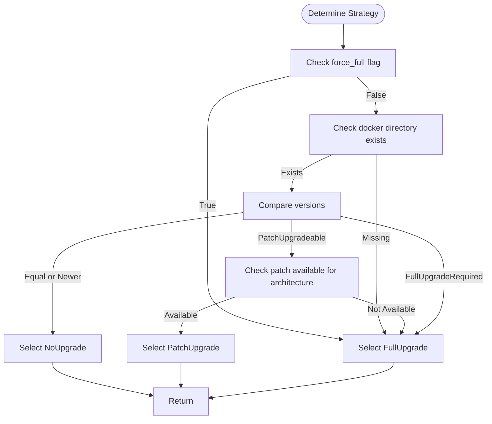
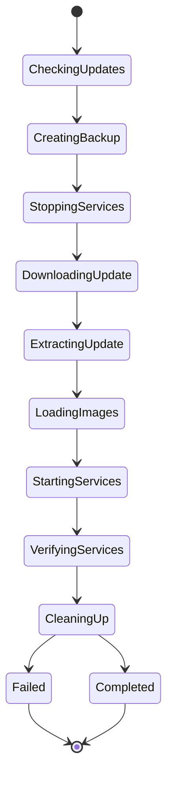
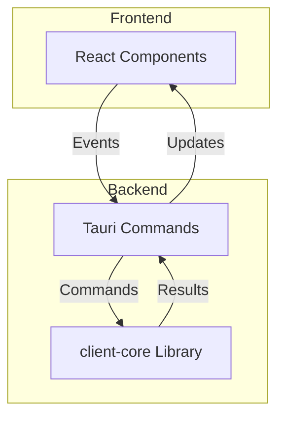
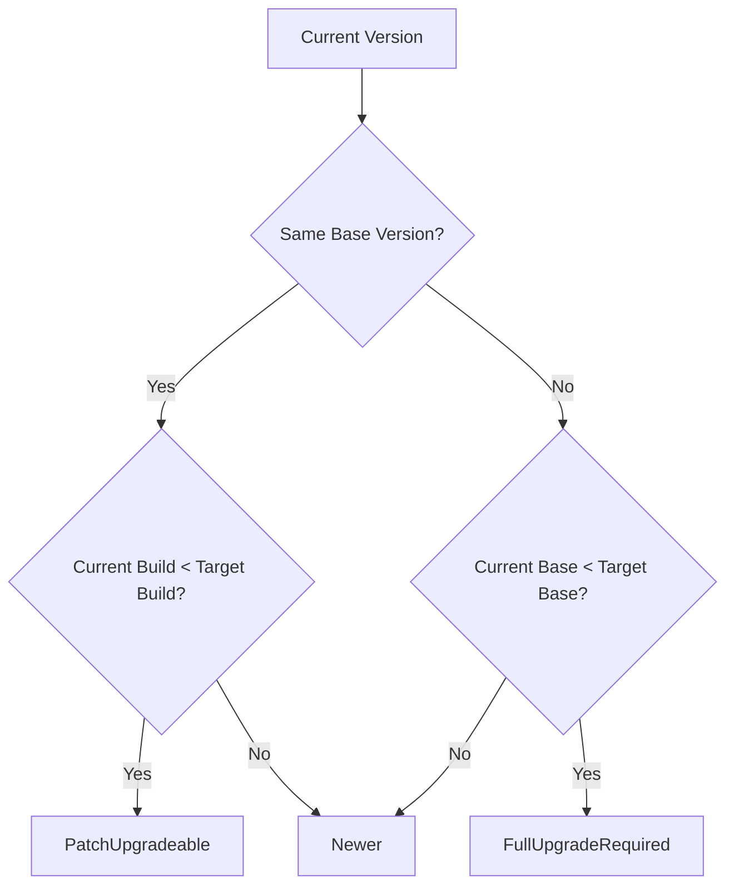

# Architectural Patterns and Design Decisions

<cite>
**Referenced Files in This Document**   
- [upgrade_strategy.rs](file://client-core/src/upgrade_strategy.rs)
- [upgrade.rs](file://client-core/src/upgrade.rs)
- [version.rs](file://client-core/src/version.rs)
- [api_types.rs](file://client-core/src/api_types.rs)
- [architecture.rs](file://client-core/src/architecture.rs)
- [constants.rs](file://client-core/src/constants.rs)
- [lib.rs](file://client-core/src/lib.rs)
- [update.rs](file://nuwax-cli/src/commands/update.rs)
- [mod.rs](file://cli-ui/src-tauri/src/commands/mod.rs)
- [cli.rs](file://cli-ui/src-tauri/src/commands/cli.rs)
</cite>

## Table of Contents
1. [Introduction](#introduction)
2. [Strategy Pattern Implementation](#strategy-pattern-implementation)
3. [Factory Pattern for Strategy Instantiation](#factory-pattern-for-strategy-instantiation)
4. [Observer Pattern for Upgrade Monitoring](#observer-pattern-for-upgrade-monitoring)
5. [MVC-like Separation of Concerns](#mvc-like-separation-of-concerns)
6. [Code Examples and Implementation Details](#code-examples-and-implementation-details)
7. [Benefits and Trade-offs](#benefits-and-trade-offs)
8. [Extension Guidelines](#extension-guidelines)

## Introduction
This document details the key architectural patterns implemented in the duck_client application, with a focus on the upgrade system. The system employs several well-known design patterns including Strategy, Factory, and Observer, along with a clear separation of concerns that resembles the MVC pattern. These patterns work together to create a flexible, maintainable, and extensible upgrade mechanism that can handle both full and incremental updates across different hardware architectures.

The upgrade system is designed to intelligently determine the most appropriate upgrade strategy based on version compatibility, system architecture, and deployment conditions. It provides a robust foundation for future enhancements while maintaining backward compatibility with existing deployment patterns.

## Strategy Pattern Implementation

The upgrade system implements the Strategy pattern through the `UpgradeStrategy` enum and its associated methods, allowing different upgrade algorithms to be selected and executed interchangeably.

The core of the strategy pattern is defined in the `UpgradeStrategy` enum, which represents three distinct upgrade approaches:

- **FullUpgrade**: Complete replacement of the existing installation
- **PatchUpgrade**: Incremental update applying only changed components
- **NoUpgrade**: No action required as the current version is up-to-date

Each strategy encapsulates its specific data requirements and behavior within the enum variants. The `FullUpgrade` variant includes download URL, hash, signature, and target version information. The `PatchUpgrade` variant contains a `PatchPackageInfo` structure with details about the patch operations to be performed. The `NoUpgrade` variant simply indicates that no action is needed.

A key method that demonstrates the strategy pattern is `get_changed_files()`, which returns the set of files that will be modified by the upgrade:

```rust
impl UpgradeStrategy {
    pub fn get_changed_files(&self) -> Vec<PathBuf> {
        let change_files = match self {
            UpgradeStrategy::FullUpgrade { .. } => vec!["data".to_string()],
            UpgradeStrategy::PatchUpgrade { patch_info, .. } => patch_info.get_changed_files(),
            UpgradeStrategy::NoUpgrade { .. } => vec![]
        };
        change_files.into_iter().map(PathBuf::from).collect()
    }
}
```

This implementation allows the calling code to interact with any upgrade strategy through a consistent interface, regardless of the underlying implementation details. The pattern enables easy addition of new upgrade strategies in the future without modifying existing client code.

**Section sources**
- [upgrade_strategy.rs](file://client-core/src/upgrade_strategy.rs#L45-L68)

## Factory Pattern for Strategy Instantiation

The system implements a Factory pattern through the `UpgradeStrategyManager` struct, which is responsible for determining and creating the appropriate upgrade strategy based on various decision factors.

The factory follows a decision-making process that evaluates multiple conditions to select the optimal strategy:

1. **Force flag check**: If `force_full` is true, always select `FullUpgrade`
2. **Environment check**: If the docker directory or compose file is missing, use `FullUpgrade`
3. **Version comparison**: Compare current and target versions to determine upgrade type
4. **Architecture compatibility**: Ensure the selected strategy is compatible with the system architecture



**Diagram sources**
- [upgrade_strategy.rs](file://client-core/src/upgrade_strategy.rs#L120-L230)

The factory uses several supporting components to make its decisions:

- **Version comparison**: The `compare_detailed()` method in the `Version` struct returns a `VersionComparison` enum that indicates whether versions are equal, newer, patch-upgradeable, or require full upgrade
- **Architecture detection**: The `Architecture::detect()` method automatically identifies the system architecture (x86_64 or aarch64)
- **Manifest analysis**: The `EnhancedServiceManifest` structure contains information about available packages for different architectures

The factory pattern centralizes the complex decision logic in one place, making it easier to modify the selection criteria without affecting the rest of the system. It also provides a clean separation between strategy selection and strategy execution.

**Section sources**
- [upgrade_strategy.rs](file://client-core/src/upgrade_strategy.rs#L120-L230)
- [version.rs](file://client-core/src/version.rs#L270-L300)
- [architecture.rs](file://client-core/src/architecture.rs#L35-L45)

## Observer Pattern for Upgrade Monitoring

The upgrade system implements an observer-like pattern through callback mechanisms that allow external components to monitor upgrade progress and respond to status changes.

The primary mechanism for observation is the `ProgressCallback` type alias, which defines a callback function that can be invoked at various stages of the upgrade process:

```rust
pub type ProgressCallback = Box<dyn Fn(UpgradeStep, &str) + Send + Sync>;
```

The `UpgradeStep` enum represents the different stages of the upgrade process:



**Diagram sources**
- [upgrade.rs](file://client-core/src/upgrade.rs#L25-L45)

While the current implementation shows the observer pattern in its data structures, the actual notification mechanism is not fully implemented in the provided code. However, the design clearly anticipates this pattern by defining the `ProgressCallback` type and the comprehensive `UpgradeStep` enum.

The observer pattern enables multiple components to react to upgrade events without being tightly coupled to the upgrade process itself. For example, a UI component could subscribe to progress updates to display a progress bar, while a logging component could record each step for audit purposes.

This pattern promotes loose coupling and high cohesion, allowing the upgrade system to evolve independently of its observers. It also supports multiple observers simultaneously, enabling rich monitoring and logging capabilities.

**Section sources**
- [upgrade.rs](file://client-core/src/upgrade.rs#L20-L45)

## MVC-like Separation of Concerns

The duck_client architecture follows a pattern similar to Model-View-Controller (MVC), with clear separation between the React frontend components (View), Tauri commands (Controller), and client-core library (Model).



**Diagram sources**
- [cli.rs](file://cli-ui/src-tauri/src/commands/cli.rs)
- [upgrade.rs](file://client-core/src/upgrade.rs)

### View Layer (React Components)
The view layer consists of React components in the `cli-ui` directory that handle user interface rendering and user interactions. Key components include:

- `OperationPanel.tsx`: Main interface for upgrade operations
- `ParameterInputModal.tsx`: Modal for upgrade parameter input
- `TerminalWindow.tsx`: Display for upgrade progress and logs

These components are responsible for presenting information to the user and capturing user input, but they contain minimal business logic.

### Controller Layer (Tauri Commands)
The controller layer is implemented through Tauri commands in the `src-tauri/src/commands` directory. These commands act as intermediaries between the frontend and the core business logic:

```rust
// Command exposed to frontend
#[tauri::command]
pub async fn check_for_updates(window: tauri::Window) -> Result<UpgradeStrategy, String> {
    // Delegate to model layer
    let strategy = app.upgrade_manager.check_for_updates(false).await;
    strategy.map_err(|e| e.to_string())
}
```

The controller layer handles:
- API exposure to the frontend
- Error translation for UI consumption
- State management between requests
- Security and validation of inputs

### Model Layer (client-core)
The model layer contains the core business logic in the `client-core` library. This includes:
- Upgrade strategy determination
- Version comparison algorithms
- Architecture detection
- File operations and package management

The model layer is completely independent of the UI and can be used by different frontends (CLI, web, desktop) without modification.

This separation allows each layer to evolve independently. The UI can be redesigned without affecting the business logic, and the core algorithms can be improved without requiring UI changes.

**Section sources**
- [cli.rs](file://cli-ui/src-tauri/src/commands/cli.rs)
- [upgrade.rs](file://client-core/src/upgrade.rs)
- [upgrade_strategy.rs](file://client-core/src/upgrade_strategy.rs)

## Code Examples and Implementation Details

### Strategy Pattern Implementation Example

The `UpgradeStrategy` enum demonstrates the strategy pattern with three distinct variants:

```rust
#[derive(Debug, Clone, PartialEq)]
pub enum UpgradeStrategy {
    FullUpgrade {
        url: String,
        hash: String,
        signature: String,
        target_version: Version,
        download_type: DownloadType,
    },
    PatchUpgrade {
        patch_info: PatchPackageInfo,
        target_version: Version,
        download_type: DownloadType,
    },
    NoUpgrade {
        target_version: Version,
    },
}
```

Each variant contains the specific data needed for that upgrade type, allowing the system to handle each strategy appropriately.

### Factory Method Example

The `determine_strategy()` method in `UpgradeStrategyManager` implements the factory pattern:

```rust
pub fn determine_strategy(&self) -> Result<UpgradeStrategy> {
    // Force full upgrade if requested
    if self.force_full {
        return self.select_full_upgrade_strategy();
    }
    
    // Check if docker directory exists
    let work_dir = get_docker_work_dir();
    let compose_file_path = get_compose_file_path();
    if !work_dir.exists() || !compose_file_path.exists() {
        return self.select_full_upgrade_strategy();
    }
    
    // Compare versions
    let base_comparison = current_ver.compare_detailed(&server_ver);
    
    match base_comparison {
        VersionComparison::Equal | VersionComparison::Newer => {
            Ok(UpgradeStrategy::NoUpgrade {
                target_version: self.manifest.version.clone(),
            })
        }
        VersionComparison::PatchUpgradeable => {
            if !self.has_patch_for_architecture() {
                self.select_full_upgrade_strategy()
            } else {
                self.select_patch_upgrade_strategy()
            }
        }
        VersionComparison::FullUpgradeRequired => {
            self.select_full_upgrade_strategy()
        }
    }
}
```

### Version Comparison Logic

The version comparison system uses a four-segment version format (major.minor.patch.build) to determine compatibility:



**Diagram sources**
- [version.rs](file://client-core/src/version.rs#L270-L300)

The `compare_detailed()` method returns a `VersionComparison` enum that guides the factory in selecting the appropriate strategy.

### Architecture Detection

The system detects the host architecture to select the appropriate package:

```rust
impl Architecture {
    pub fn detect() -> Self {
        let arch_str = std::env::consts::ARCH;
        Self::from_str(arch_str).unwrap_or_else(|_| {
            warn!("Detected unknown architecture: {}", arch_str);
            Self::Unsupported(arch_str.to_string())
        })
    }
}
```

This ensures that the correct binary package is selected for the target system.

**Section sources**
- [upgrade_strategy.rs](file://client-core/src/upgrade_strategy.rs#L45-L68)
- [version.rs](file://client-core/src/version.rs#L270-L300)
- [architecture.rs](file://client-core/src/architecture.rs#L35-L45)

## Benefits and Trade-offs

### Benefits Realized

**Extensibility**
The strategy pattern makes it easy to add new upgrade types without modifying existing code. For example, a differential upgrade strategy could be added by:
1. Adding a new variant to the `UpgradeStrategy` enum
2. Implementing the corresponding logic in the factory
3. No changes required to client code that uses the strategies

**Testability**
The separation of concerns and dependency injection make the system highly testable:
- Strategy selection can be tested independently of actual file operations
- Version comparison logic can be verified with comprehensive unit tests
- The factory can be tested with mock manifests and architecture detection

**Maintainability**
The clear separation of concerns reduces cognitive load:
- UI developers focus on presentation
- Business logic developers focus on algorithms
- Integration is handled through well-defined interfaces

**Performance**
The system optimizes network usage by selecting the most efficient upgrade strategy:
- Patch upgrades minimize bandwidth consumption
- Architecture-specific packages reduce download size
- Intelligent caching can be implemented at the strategy level

### Trade-offs Considered

**Complexity vs. Flexibility**
The pattern introduces additional complexity through multiple layers of abstraction. However, this is justified by the need for flexibility in handling different upgrade scenarios across various architectures.

**Backward Compatibility**
The system maintains backward compatibility with older deployment formats while supporting new features:
- Legacy package formats are still supported
- Default behaviors ensure functionality on systems without advanced features
- Clear migration paths for older installations

**Error Handling**
The system must handle errors at multiple levels:
- Network failures during download
- File system errors during extraction
- Version incompatibilities
- Architecture mismatches

The current implementation uses Rust's `Result` type extensively, but could benefit from more sophisticated error handling that distinguishes between recoverable and fatal errors.

**Security Considerations**
The upgrade system handles potentially malicious input:
- Download URLs are validated
- File paths in patch operations are checked for directory traversal
- Signatures are verified (though not shown in the provided code)

**Section sources**
- [upgrade_strategy.rs](file://client-core/src/upgrade_strategy.rs)
- [version.rs](file://client-core/src/version.rs)
- [api_types.rs](file://client-core/src/api_types.rs)

## Extension Guidelines

### Adding New Upgrade Strategies

To add a new upgrade strategy (e.g., differential upgrade):

1. **Extend the UpgradeStrategy enum**:
```rust
DifferentialUpgrade {
    differential_package: DifferentialPackageInfo,
    target_version: Version,
    download_type: DownloadType,
}
```

2. **Add corresponding data structures** in `api_types.rs`:
```rust
pub struct DifferentialPackageInfo {
    pub url: String,
    pub hash: Option<String>,
    pub signature: Option<String>,
    pub base_version: Version,
    pub operations: DifferentialOperations,
}
```

3. **Implement factory logic** in `UpgradeStrategyManager`:
```rust
fn select_differential_upgrade_strategy(&self) -> Result<UpgradeStrategy> {
    // Logic to select differential upgrade
}
```

4. **Update version comparison** to support differential upgrade conditions

### Enhancing the Observer Pattern

To fully implement the observer pattern:

1. **Create an Observer trait**:
```rust
pub trait UpgradeObserver {
    fn on_progress(&self, step: UpgradeStep, message: &str);
    fn on_complete(&self, result: &UpgradeResult);
    fn on_error(&self, error: &str);
}
```

2. **Modify UpgradeManager to maintain observers**:
```rust
pub struct UpgradeManager {
    observers: Vec<Arc<dyn UpgradeObserver>>,
    // ... other fields
}
```

3. **Add registration methods**:
```rust
impl UpgradeManager {
    pub fn add_observer(&mut self, observer: Arc<dyn UpgradeObserver>) {
        self.observers.push(observer);
    }
}
```

4. **Notify observers at key points**:
```rust
fn notify_progress(&self, step: UpgradeStep, message: &str) {
    for observer in &self.observers {
        observer.on_progress(step, message);
    }
}
```

### Adding New Architectures

To support additional architectures:

1. **Extend the Architecture enum**:
```rust
enum Architecture {
    X86_64,
    Aarch64,
    RiscV64,
    Unsupported(String),
}
```

2. **Update architecture detection**:
```rust
impl Architecture {
    pub fn from_str(arch_str: &str) -> Result<Self> {
        match arch_str.to_lowercase().as_str() {
            "x86_64" | "amd64" | "x64" => Ok(Self::X86_64),
            "aarch64" | "arm64" | "armv8" => Ok(Self::Aarch64),
            "riscv64" | "risc-v" => Ok(Self::RiscV64),
            _ => Err(anyhow::anyhow!("Unsupported architecture: {}", arch_str)),
        }
    }
}
```

3. **Add constants for new architecture**:
```rust
pub const DOCKER_SERVICE_RISCV64_PACKAGE: &str = "docker-riscv64.zip";
```

4. **Update manifest parsing** to handle new architecture

### Improving Error Handling

To enhance error handling:

1. **Create specific error types**:
```rust
#[derive(Debug, Error)]
pub enum UpgradeError {
    #[error("Network error: {0}")]
    Network(#[from] reqwest::Error),
    #[error("File system error: {0}")]
    FileSystem(#[from] std::io::Error),
    #[error("Version compatibility error: {0}")]
    VersionCompatibility(String),
    #[error("Architecture mismatch: {0}")]
    ArchitectureMismatch(String),
}
```

2. **Use error contexts**:
```rust
fn get_platform_package(&self) -> Result<crate::api_types::PlatformPackageInfo> {
    // ...
    Err(anyhow::anyhow!("No platform package found for architecture"))
        .context("Failed to get platform package")
}
```

3. **Implement structured error reporting** to the UI

These extension guidelines ensure that new features can be added in a way that maintains the integrity of the existing architectural patterns while expanding the system's capabilities.

**Section sources**
- [upgrade_strategy.rs](file://client-core/src/upgrade_strategy.rs)
- [api_types.rs](file://client-core/src/api_types.rs)
- [architecture.rs](file://client-core/src/architecture.rs)