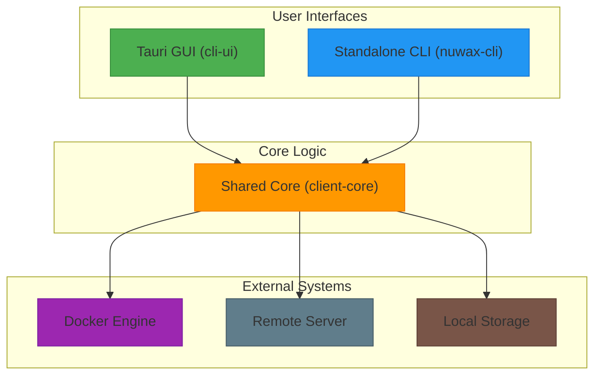
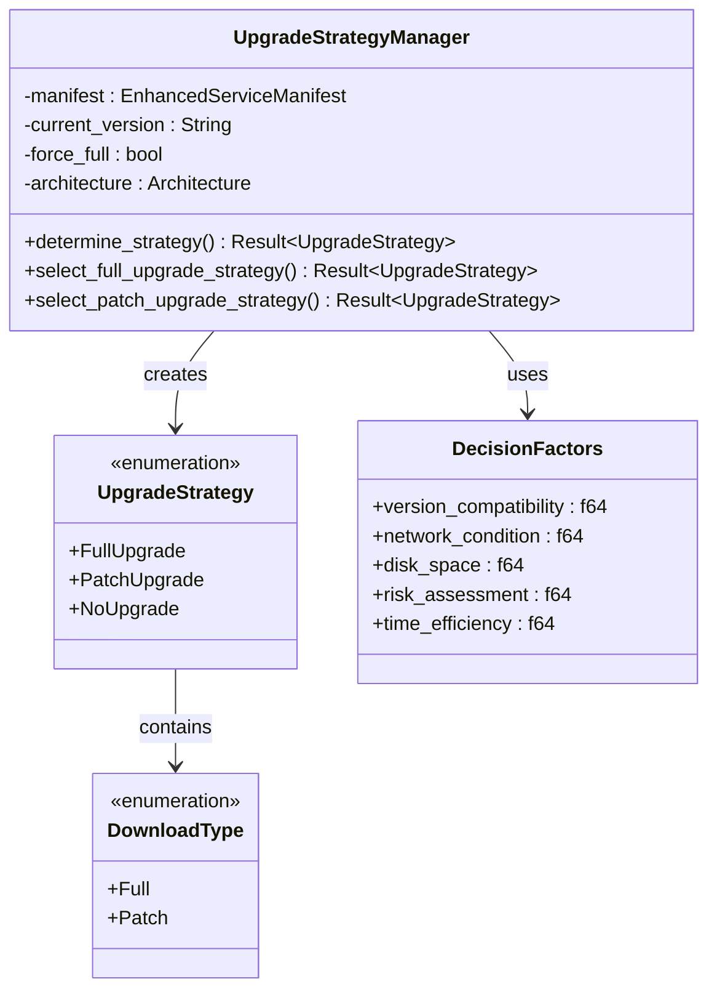
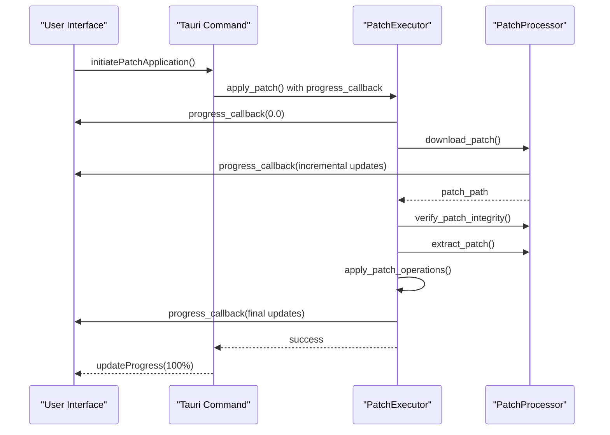
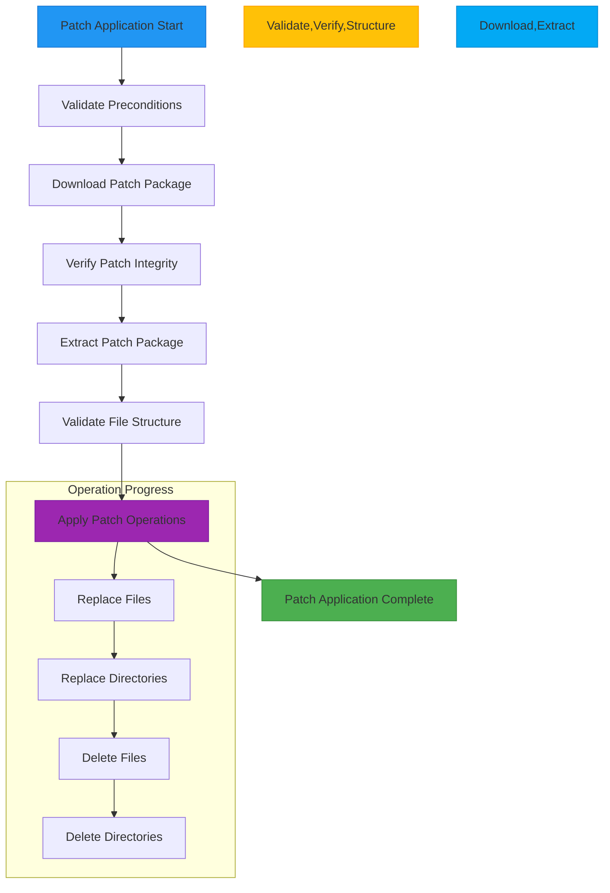
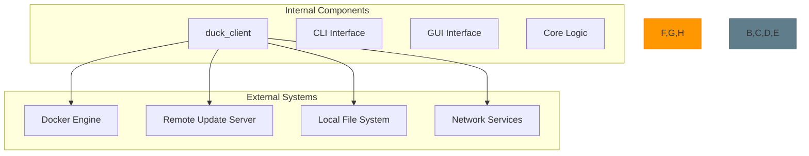
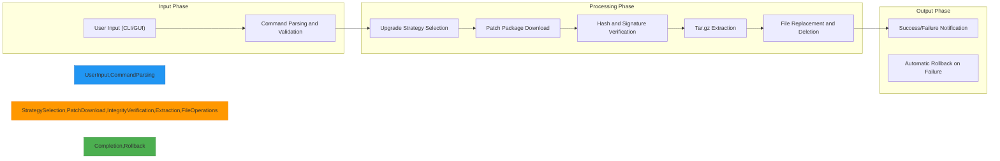
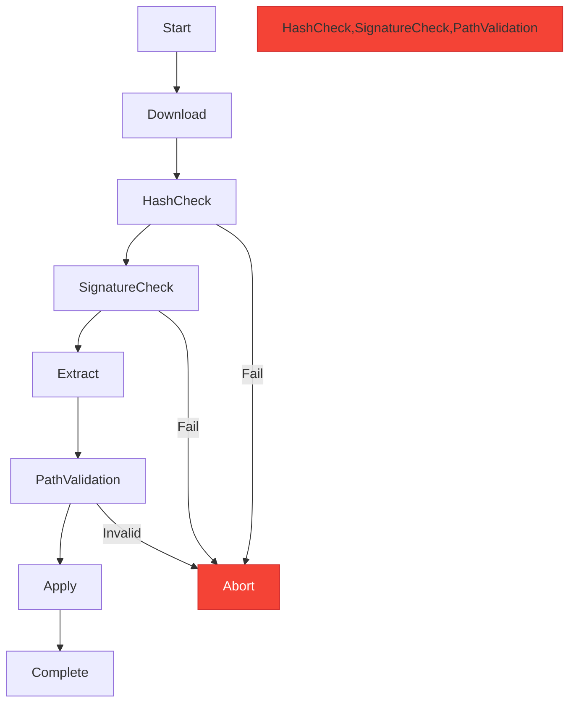

# Architecture Overview

<cite>
**Referenced Files in This Document**   
- [mod.rs](file://client-core/src/patch_executor/mod.rs)
- [file_operations.rs](file://client-core/src/patch_executor/file_operations.rs)
- [patch_processor.rs](file://client-core/src/patch_executor/patch_processor.rs)
- [upgrade_strategy.rs](file://client-core/src/upgrade_strategy.rs)
- [api_types.rs](file://client-core/src/api_types.rs)
</cite>

## Table of Contents
1. [Architecture Overview](#architecture-overview)
2. [Core Components](#core-components)
3. [Upgrade Strategy Pattern](#upgrade-strategy-pattern)
4. [Observer Pattern for Progress Monitoring](#observer-pattern-for-progress-monitoring)
5. [System Boundaries and Integration Points](#system-boundaries-and-integration-points)
6. [Data Flow Analysis](#data-flow-analysis)
7. [Cross-Cutting Concerns](#cross-cutting-concerns)

## Architecture Overview

The duck_client system is a monorepo-based application structured around three primary components: a Tauri-based GUI (cli-ui), a standalone CLI tool (nuwax-cli), and a shared core library (client-core) that encapsulates business logic. This architecture enables code reuse while supporting multiple user interfaces.

The system follows an MVC-like separation pattern:
- **View**: React components in the cli-ui frontend
- **Controller**: Tauri commands that bridge frontend and backend
- **Model**: client-core library handling business logic, state management, and external interactions

Both the GUI and CLI clients consume the client-core library, ensuring consistent behavior across interfaces. The monorepo structure with workspace-managed dependencies allows for coordinated development and versioning of these components.



**Diagram sources**
- [mod.rs](file://client-core/src/patch_executor/mod.rs)
- [upgrade_strategy.rs](file://client-core/src/upgrade_strategy.rs)

## Core Components

The client-core library contains the essential business logic for the duck_client system, with key components organized into modular crates. The architecture separates concerns into distinct modules:

- **Container Management**: Handles Docker container operations, configuration, and service management
- **Database Operations**: Manages database connections, migrations, and SQL operations
- **Patch Execution**: Implements the core patch application logic with safety features
- **Upgrade Strategy**: Determines optimal upgrade paths based on version compatibility and system constraints
- **Configuration Management**: Handles application settings and persistent state

The system leverages Rust's strong type system and error handling to ensure reliability and safety in critical operations like file manipulation and system updates.

**Section sources**
- [mod.rs](file://client-core/src/patch_executor/mod.rs)
- [upgrade_strategy.rs](file://client-core/src/upgrade_strategy.rs)

## Upgrade Strategy Pattern

The system implements a sophisticated strategy pattern for upgrade management, allowing flexible selection between full and incremental update approaches based on runtime conditions.



**Diagram sources**
- [upgrade_strategy.rs](file://client-core/src/upgrade_strategy.rs)

The `UpgradeStrategyManager` acts as a factory that evaluates multiple factors to determine the appropriate upgrade strategy:

1. **Version Compatibility**: Compares current and target versions to determine if a patch upgrade is possible
2. **Architecture Detection**: Identifies the system architecture (x86_64 or aarch64) to select appropriate packages
3. **System State**: Checks for the presence of required directories and files
4. **User Preferences**: Respects forced full upgrade settings

The strategy selection process follows this decision tree:
- If current version equals or exceeds target version → NoUpgrade
- If forced full upgrade is enabled → FullUpgrade
- If working directory or compose file is missing → FullUpgrade
- If versions have different base numbers → FullUpgrade
- If same base version with available patch → PatchUpgrade

This pattern allows the system to adapt to different deployment scenarios while maintaining a consistent interface for upgrade operations.

**Section sources**
- [upgrade_strategy.rs](file://client-core/src/upgrade_strategy.rs#L1-L462)

## Observer Pattern for Progress Monitoring

The patch execution system implements the observer pattern through callback functions to provide real-time progress updates during long-running operations.



**Diagram sources**
- [mod.rs](file://client-core/src/patch_executor/mod.rs#L1-L432)
- [patch_processor.rs](file://client-core/src/patch_executor/patch_processor.rs#L1-L455)

The `PatchExecutor` struct accepts a progress callback function as a parameter in its `apply_patch` method:

```rust
pub async fn apply_patch<F>(
    &mut self,
    patch_info: &PatchPackageInfo,
    operations: &PatchOperations,
    progress_callback: F,
) -> Result<(), PatchExecutorError>
where
    F: Fn(f64) + Send + Sync,
```

This callback is invoked at key stages of the patch application process:
1. Initialization (0%)
2. After download completion (25%)
3. After integrity verification (35%)
4. After extraction (45%)
5. During operation application (50-100% based on completion)

The file operations component also implements progress tracking through individual operation callbacks:



**Diagram sources**
- [mod.rs](file://client-core/src/patch_executor/mod.rs#L1-L432)
- [file_operations.rs](file://client-core/src/patch_executor/file_operations.rs#L1-L524)

For rollback operations, the system maintains a backup directory using `TempDir` when backup mode is enabled, allowing for safe recovery if an upgrade fails.

**Section sources**
- [mod.rs](file://client-core/src/patch_executor/mod.rs#L1-L432)
- [file_operations.rs](file://client-core/src/patch_executor/file_operations.rs#L1-L524)
- [patch_processor.rs](file://client-core/src/patch_executor/patch_processor.rs#L1-L455)

## System Boundaries and Integration Points

The duck_client system integrates with several external systems through well-defined boundaries:



**Diagram sources**
- [mod.rs](file://client-core/src/patch_executor/mod.rs)
- [upgrade_strategy.rs](file://client-core/src/upgrade_strategy.rs)

Key integration points include:
- **Docker Engine**: Managed through Docker Compose files and direct API calls for service lifecycle management
- **Remote Servers**: Used for downloading patch packages and retrieving version manifests via HTTPS
- **Local Storage**: Stores configuration files, backup data, and temporary files during operations
- **System Architecture**: Supports both x86_64 and aarch64 platforms with architecture-specific package selection

The system handles platform differences through the `Architecture` enum which automatically detects the current platform and selects appropriate upgrade packages.

## Data Flow Analysis

The data flow for a typical patch application follows a structured pipeline:



**Diagram sources**
- [mod.rs](file://client-core/src/patch_executor/mod.rs#L1-L432)
- [upgrade_strategy.rs](file://client-core/src/upgrade_strategy.rs#L1-L462)

The process begins with user input from either the CLI or GUI interface, which is parsed and validated before being passed to the core logic. The `UpgradeStrategyManager` determines the appropriate upgrade approach, then the `PatchExecutor` coordinates the download, verification, and application of patches.

During patch application, the system maintains data integrity through:
- Pre-operation validation
- Atomic file operations using temporary files
- Optional backup creation before modifications
- Automatic rollback on failure detection

## Cross-Cutting Concerns

### Security

The system implements multiple security measures:
- **Signature Verification**: Digital signatures are validated for all downloaded patches
- **Hash Checking**: SHA-256 hashes ensure package integrity
- **Path Safety**: Protection against directory traversal attacks during extraction
- **Atomic Operations**: File replacements use temporary files to prevent corruption



**Diagram sources**
- [patch_processor.rs](file://client-core/src/patch_executor/patch_processor.rs#L1-L455)

### Monitoring and Health Checks

The system includes comprehensive logging and monitoring capabilities:
- Structured logging with `tracing` crate
- Progress callbacks for UI updates
- Detailed error reporting with context
- Health check integration for Docker services

### Disaster Recovery

Robust disaster recovery features include:
- **Backup/Restore**: Optional backup creation before patch application
- **Automatic Rollback**: Failed operations automatically revert to previous state
- **Idempotent Operations**: Safe to retry failed operations
- **Error Resilience**: Comprehensive error handling with recovery options

The backup system creates a temporary directory that stores copies of files before they are modified, enabling complete restoration if an upgrade fails.

**Section sources**
- [mod.rs](file://client-core/src/patch_executor/mod.rs#L1-L432)
- [file_operations.rs](file://client-core/src/patch_executor/file_operations.rs#L1-L524)
- [patch_processor.rs](file://client-core/src/patch_executor/patch_processor.rs#L1-L455)