# CLI Async Execution Model

<cite>
**Referenced Files in This Document**   
- [main.rs](file://nuwax-cli/src/main.rs)
- [Cargo.toml](file://nuwax-cli/Cargo.toml)
- [lib.rs](file://nuwax-cli/src/lib.rs)
- [app.rs](file://nuwax-cli/src/app.rs)
- [docker_service.rs](file://nuwax-cli/src/commands/docker_service.rs)
- [backup.rs](file://nuwax-cli/src/commands/backup.rs)
- [diff_sql.rs](file://nuwax-cli/src/commands/diff_sql.rs)
- [cli.rs](file://nuwax-cli/src/cli.rs)
</cite>

## Table of Contents
1. [Introduction](#introduction)
2. [Tokio Runtime Initialization and Configuration](#tokio-runtime-initialization-and-configuration)
3. [Async/Await Patterns in Command Implementations](#asyncawait-patterns-in-command-implementations)
4. [Handling Synchronous Operations in Async Context](#handling-synchronous-operations-in-async-context)
5. [Managing Long-Running Operations](#managing-long-running-operations)
6. [Performance Considerations and Task Management](#performance-considerations-and-task-management)
7. [Resource Cleanup and Error Handling](#resource-cleanup-and-error-handling)
8. [Best Practices for Async CLI Development](#best-practices-for-async-cli-development)

## Introduction
The nuwax-cli application implements a robust asynchronous execution model using the Tokio runtime to handle various CLI operations efficiently. This document provides a comprehensive analysis of how asynchronous execution is structured, configured, and utilized across the codebase. The system is designed to handle both short-lived commands and long-running operations like Docker image pulls and SQL patch applications without blocking the CLI interface. The architecture leverages Rust's async/await patterns to provide responsive user experience while maintaining performance and reliability.

## Tokio Runtime Initialization and Configuration

The Tokio runtime is initialized at the entry point of the nuwax-cli application using the `#[tokio::main]` attribute macro. This macro sets up the Tokio runtime with default configuration suitable for CLI applications.


**Diagram sources**
- [main.rs](file://nuwax-cli/src/main.rs#L5-L102)

**Section sources**
- [main.rs](file://nuwax-cli/src/main.rs#L5-L102)
- [Cargo.toml](file://nuwax-cli/Cargo.toml#L55)

The `#[tokio::main]` macro in `main.rs` automatically configures the Tokio runtime with the "full" feature set, as specified in the Cargo.tomI dependencies. This includes:
- Multi-threaded scheduler
- Timers
- I/O drivers for TCP and UDP
- File system operations
- Signal handling
- Async-aware synchronization primitives

The dependency is declared in `Cargo.toml` as:
```toml
tokio = { workspace = true, features = ["full"] }
```

This configuration enables the CLI to handle multiple concurrent operations efficiently, particularly important for operations involving network requests, file I/O, and inter-process communication with Docker services.

## Async/Await Patterns in Command Implementations

The application follows a consistent pattern of using async/await throughout command implementations. The core application structure is defined in `lib.rs`, which exports various command functions that are inherently async.


**Diagram sources**
- [lib.rs](file://nuwax-cli/src/lib.rs#L1-L27)
- [app.rs](file://nuwax-cli/src/app.rs#L1-L146)

**Section sources**
- [lib.rs](file://nuwax-cli/src/lib.rs#L1-L27)
- [app.rs](file://nuwax-cli/src/app.rs#L1-L146)

The `CliApp` struct, defined in `app.rs`, serves as the central coordinator for all commands. It contains references to various managers (database, Docker, backup, etc.) wrapped in `Arc` for efficient sharing across async tasks. The `run_command` method uses pattern matching to delegate to appropriate async command handlers:

```rust
pub async fn run_command(&mut self, command: Commands) -> Result<()> {
    match command {
        Commands::Status => commands::run_status(self).await,
        Commands::Backup => commands::run_backup(self).await,
        Commands::Upgrade { args } => commands::run_upgrade(self, args).await,
        Commands::DockerService(docker_cmd) => commands::run_docker_service_command(self, docker_cmd).await,
        Commands::DiffSql { old_sql, new_sql, old_version, new_version, output } => 
            commands::run_diff_sql(old_sql, new_sql, old_version, new_version, output).await,
        // ... other commands
    }
}
```

Each command module (e.g., `docker_service.rs`, `backup.rs`) implements its functionality using async functions that return `Result<T, Error>` types, allowing for proper error propagation in the async context.

## Handling Synchronous Operations in Async Context

The codebase demonstrates careful handling of synchronous operations within the async execution model. For file I/O operations, the application uses synchronous std::fs methods within async functions, which can potentially block the async runtime.

In `diff_sql.rs`, file operations are performed synchronously:

```rust
let old_sql_content = fs::read_to_string(&old_sql_path).map_err(|e| {
    client_core::error::DuckError::custom(format!("读取旧版本SQL文件失败: {e}"))
})?;

let new_sql_content = fs::read_to_string(&new_sql_path).map_err(|e| {
    client_core::error::DuckError::custom(format!("读取新版本SQL文件失败: {e}"))
})?;

fs::write(&output_file, &diff_sql)
    .map_err(|e| client_core::error::DuckError::custom(format!("写入差异文件失败: {e}")))?;
```


**Diagram sources**
- [diff_sql.rs](file://nuwax-cli/src/commands/diff_sql.rs#L1-L113)

**Section sources**
- [diff_sql.rs](file://nuwax-cli/src/commands/diff_sql.rs#L1-L113)
- [backup.rs](file://nuwax-cli/src/commands/backup.rs#L1-L199)

While these operations use blocking file I/O, they are generally acceptable for CLI applications where the operations are relatively fast and the overall execution time is dominated by other factors (like Docker operations). For longer file operations, Tokio provides async file APIs that could be used to prevent blocking the runtime.

The application also handles system calls through synchronous execution of external commands. In the Tauri UI layer, commands are executed using both sidecar and system command approaches, but these are invoked from async contexts:

```rust
let output = StdCommand::new("ps")
    .args(["aux"])
    .stdout(Stdio::piped())
    .stderr(Stdio::piped())
    .output();
```

## Managing Long-Running Operations

Long-running operations such as Docker image pulls and service deployments are managed through the Docker service command implementations. The architecture ensures these operations do not block the CLI interface by leveraging the async/await pattern throughout the operation chain.

```mermaid
sequenceDiagram
participant CLI as CLI User
participant Main as main()
participant App as CliApp
participant Docker as DockerService
participant DockerAPI as Docker API (bollard)
CLI->>Main : nuwax-cli docker-service deploy
Main->>App : Initialize application
App->>Docker : deploy_services().await
activate Docker
Docker->>DockerAPI : pull_images().await
activate DockerAPI
DockerAPI-->>Docker : Stream progress
loop Progress Updates
DockerAPI->>Docker : Progress event
Docker->>CLI : info!("Downloading { : .1}%", progress)
end
DockerAPI-->>Docker : Images pulled
deactivate DockerAPI
Docker->>DockerAPI : create_containers().await
DockerAPI-->>Docker : Containers created
Docker->>DockerAPI : start_containers().await
DockerAPI-->>Docker : Containers started
Docker->>DockerAPI : health_check().await
DockerAPI-->>Docker : Health report
Docker->>CLI : info!("✅ Docker 服务部署成功!")
deactivate Docker
CLI->>CLI : Command completes
```



**Diagram sources**
- [docker_service.rs](file://nuwax-cli/src/commands/docker_service.rs#L1-L199)
- [main.rs](file://nuwax-cli/src/main.rs#L5-L102)

**Section sources**
- [docker_service.rs](file://nuwax-cli/src/commands/docker_service.rs#L1-L199)

The `deploy_docker_services` function in `docker_service.rs` demonstrates how long-running operations are structured:

1. **Progressive feedback**: The function provides continuous feedback through `info!` macros, keeping users informed of the operation's progress.

2. **Error handling**: Comprehensive error handling ensures that if any step fails, the operation terminates gracefully with a descriptive error message.

3. **Resource management**: The Docker service manager handles the complete lifecycle of Docker resources, ensuring proper cleanup in case of failures.

4. **Health checking**: After deployment, a health check verifies the operational status of all services.

For operations that might take extended periods, the application could benefit from implementing proper cancellation tokens. Currently, the codebase does not show explicit support for task cancellation, meaning operations must complete or fail naturally rather than being interrupted by user request.

## Performance Considerations and Task Management

The application's performance characteristics are shaped by its Tokio runtime configuration and async implementation patterns. By using the "full" feature set of Tokio, the application benefits from a multi-threaded runtime that can efficiently handle concurrent operations.

Key performance considerations include:

**Thread Pool Configuration**: The default Tokio multi-threaded runtime creates a thread pool with a number of threads equal to the number of CPU cores. This is suitable for the mixed workload of the CLI, which includes CPU-intensive operations (SQL diff generation) and I/O-bound operations (Docker API calls, file operations).

**Blocking Operations**: As noted earlier, the use of synchronous file I/O operations can potentially block worker threads. For optimal performance, especially with large files, the application could migrate to Tokio's async file APIs:

```rust
// Instead of std::fs::read_to_string
let content = tokio::fs::read_to_string(path).await?;
```

**Resource Utilization**: The application efficiently shares resources through `Arc` (Atomic Reference Counting), minimizing memory overhead when passing data between components:

```rust
pub struct CliApp {
    pub config: Arc<AppConfig>,
    pub database: Arc<Database>,
    // ... other Arc-wrapped components
}
```

This pattern allows multiple components to share the same instance without cloning the underlying data, reducing memory usage and improving performance.

**Command Specialization**: The application optimizes performance by handling certain commands before full application initialization. Commands like `init`, `status`, and `diff-sql` are processed early in the `main` function, avoiding the overhead of loading configuration and initializing database connections when unnecessary.


**Diagram sources**
- [main.rs](file://nuwax-cli/src/main.rs#L5-L102)

**Section sources**
- [main.rs](file://nuwax-cli/src/main.rs#L5-L102)

## Resource Cleanup and Error Handling

The application implements comprehensive error handling and resource cleanup strategies to ensure reliability and prevent resource leaks.

**Error Propagation**: The codebase uses Rust's `anyhow` and `thiserror` crates for flexible error handling, allowing errors to be easily propagated through the async call stack:

```rust
use anyhow::Result;

pub async fn deploy_docker_services(app: &CliApp, frontend_port: Option<u16>) -> Result<()> {
    // ... operation logic
    match docker_service_manager.deploy_services().await {
        Ok(_) => {
            info!("✅ Docker 服务部署成功!");
        }
        Err(e) => {
            error!("❌ Docker 服务部署失败: {:?}", e);
            return Err(anyhow::anyhow!(format!("Docker 服务部署失败: {e:?}")));
        }
    }
    Ok(())
}
```

**Graceful Degradation**: For the `status` command, the application implements graceful degradation when initialization fails, providing helpful guidance to users:

```rust
Err(e) => {
    error!("⚠️  无法获取完整状态信息: {}", e);
    info!("");
    info!("💡 可能的原因:");
    info!("   - 当前目录不是 Nuwax Cli ent 工作目录");
    info!("   - 配置文件或数据库文件不在当前目录");
    info!("   - 数据库文件被其他进程占用");
    info!("");
    info!("🔧 解决方案:");
    info!("   1. 切换到 Nuwax Cli ent 初始化的目录（包含 config.toml 的目录）");
    info!("   2. 或者在新目录运行 'nuwax-cli init' 重新初始化");
    info!("   3. 确保没有其他 nuwax-cli 进程在运行");
}
```

**Resource Management**: The application uses RAII (Resource Acquisition Is Initialization) principles through Rust's ownership system. Resources like database connections and Docker clients are managed by structs that implement `Drop` traits, ensuring cleanup when they go out of scope.

The `Arc` wrapper ensures that resources are only cleaned up when all references are dropped, preventing premature cleanup while allowing efficient sharing.

**Process Management**: The Tauri UI layer includes functionality to check for and clean up running nuwax-cli processes, preventing conflicts when multiple instances might interfere with each other:

```rust
/// 检查并清理运行中的nuwax-cli进程
#[command]
pub async fn check_and_cleanup_duck_processes() -> Result<ProcessCheckResult, String> {
    // ... process checking logic
}
```

## Best Practices for Async CLI Development

Based on the analysis of the nuwax-cli codebase, the following best practices for async CLI development can be identified:

**1. Use Appropriate Runtime Configuration**
- For CLI applications with mixed workloads, use `tokio = { features = ["full"] }` to access all capabilities
- Consider the trade-offs between single-threaded and multi-threaded runtimes based on expected workload

**2. Structure Commands for Efficient Execution**
- Handle lightweight commands before full application initialization
- Use early returns for special cases to avoid unnecessary setup
- Organize commands into logical modules for maintainability

**3. Balance Async and Synchronous Operations**
- Use async file operations for large files or when responsiveness is critical
- Synchronous file I/O is acceptable for small, predictable operations
- Offload CPU-intensive work to blocking tasks when necessary:

```rust
let result = tokio::task::spawn_blocking(move || {
    // CPU-intensive work here
}).await?;
```

**4. Provide Clear User Feedback**
- Use logging to provide progress updates for long-running operations
- Implement graceful degradation when components fail
- Offer actionable suggestions for resolving common issues

**5. Implement Robust Error Handling**
- Use `anyhow` for application-level error handling
- Preserve error context for debugging
- Provide user-friendly error messages

**6. Manage Resources Efficiently**
- Use `Arc` for sharing expensive resources across async tasks
- Leverage Rust's ownership system for automatic resource cleanup
- Minimize cloning of large data structures

**7. Design for Testability**
- Separate pure logic from I/O operations
- Use dependency injection where appropriate
- Implement comprehensive unit and integration tests

The nuwax-cli application exemplifies many of these best practices, particularly in its command organization, error handling, and resource management. Areas for potential improvement include migrating blocking file operations to async alternatives and implementing explicit task cancellation mechanisms for long-running operations.