# Auto Backup Command

<cite>
**Referenced Files in This Document**   
- [auto_backup.rs](file://nuwax-cli/src/commands/auto_backup.rs#L1-L431)
- [constants.rs](file://client-core/src/constants.rs#L322-L521)
- [config_manager.rs](file://client-core/src/config_manager.rs#L540-L626)
- [backup.rs](file://client-core/src/backup.rs#L96-L129)
- [docker_utils.rs](file://nuwax-cli/src/docker_utils.rs)
- [timeout.rs](file://client-core/src/constants.rs#L380-L396)
</cite>

## Table of Contents
1. [Introduction](#introduction)
2. [Configuration Parameters](#configuration-parameters)
3. [Scheduled Backup Execution](#scheduled-backup-execution)
4. [Event-Triggered Backup Workflow](#event-triggered-backup-workflow)
5. [Backup Lifecycle Management](#backup-lifecycle-management)
6. [Notification Mechanisms](#notification-mechanisms)
7. [Reliability Features](#reliability-features)
8. [Resource Management](#resource-management)
9. [Integration with System Schedulers](#integration-with-system-schedulers)
10. [Operational Considerations](#operational-considerations)

## Introduction
The Auto Backup Command provides automated backup capabilities for the Duck Client application, designed to protect data integrity through scheduled and event-triggered operations. The system follows a comprehensive workflow that temporarily stops Docker services, performs backups, and restarts services to ensure data consistency. While the current implementation does not include a built-in scheduler, it integrates with system-level cron (Linux/macOS) or launchd (macOS) for time-based execution. The command supports manual execution, status monitoring, and configuration management through a CLI interface.

**Section sources**
- [auto_backup.rs](file://nuwax-cli/src/commands/auto_backup.rs#L1-L431)

## Configuration Parameters
The auto-backup system utilizes configurable parameters stored in the application database, allowing customization of backup behavior without code changes. These parameters control scheduling, retention, storage location, and operational thresholds.

### Configuration Options
- **Enabled**: Controls whether automatic backups are active (default: `false`)
- **Cron Expression**: Defines the backup schedule using standard cron syntax (default: `"0 2 * * *"`)
- **Retention Days**: Specifies how long backup files are retained (default: `7` days)
- **Backup Directory**: Sets the file system location for backup storage (default: `"./backups"`)
- **Last Backup Time**: Records the timestamp of the most recent backup attempt
- **Last Backup Status**: Stores the outcome (success/failure) of the previous backup

### Default Configuration Values
```rust
impl Default for AutoBackupConfig {
    fn default() -> Self {
        Self {
            enabled: false,
            cron_expression: "0 2 * * *".to_string(),
            last_backup_time: None,
            backup_retention_days: 7,
            backup_directory: "./backups".to_string(),
        }
    }
}
```

**Section sources**
- [auto_backup.rs](file://nuwax-cli/src/commands/auto_backup.rs#L15-L25)
- [config_manager.rs](file://client-core/src/config_manager.rs#L590-L626)

## Scheduled Backup Execution
The auto-backup system supports time-based scheduling through cron expressions, though it relies on external system schedulers rather than an internal timer. This design choice simplifies the application architecture while leveraging mature system-level scheduling tools.

### Default Schedule
The default cron expression `"0 2 * * *"` configures backups to run daily at 2:00 AM. This time is selected to minimize impact on user activity during typical operating hours.

```rust
pub mod cron {
    /// Default auto backup cron expression (daily at 2 AM)
    pub const DEFAULT_BACKUP_CRON: &str = "0 2 * * *";
    pub const CRON_FIELDS_COUNT: usize = 5;
}
```

### Configuration Management
Users can view and modify the backup schedule through the CLI, with changes persisted to the application database. The system validates cron expressions for proper format before acceptance.

```mermaid
flowchart TD
A["User executes nuwax-cli auto-backup status"] --> B["System retrieves configuration from database"]
B --> C{"Enabled?"}
C --> |Yes| D["Display cron expression and last backup time"]
C --> |No| E["Show disabled status"]
F["User enables backup"] --> G["Update auto_backup_enabled in database"]
G --> H["System confirms: '启用自动备份'"]
```



**Section sources**
- [constants.rs](file://client-core/src/constants.rs#L428-L433)
- [auto_backup.rs](file://nuwax-cli/src/commands/auto_backup.rs#L261-L337)

## Event-Triggered Backup Workflow
The auto-backup command executes a structured workflow when triggered, ensuring data consistency by coordinating with Docker service lifecycle events. The process follows a four-phase approach: service status check, service stop, backup execution, and service restart.

### Backup Execution Sequence


### Phase Details
1. **Service Status Check**: Determines if Docker services are currently running
2. **Service Stop**: Halts all Docker containers to ensure data consistency
3. **Backup Execution**: Creates a snapshot of the application data
4. **Service Restart**: Restores Docker services to operational state

**Diagram sources**
- [auto_backup.rs](file://nuwax-cli/src/commands/auto_backup.rs#L66-L150)

**Section sources**
- [auto_backup.rs](file://nuwax-cli/src/commands/auto_backup.rs#L66-L150)

## Backup Lifecycle Management
The system manages the complete lifecycle of backup operations, from initiation through completion, with proper state tracking and error handling. Backup records are maintained in the database to provide audit trails and operational visibility.

### State Tracking
The system records critical metadata for each backup operation:
- **Start Time**: When the backup process began
- **Completion Status**: Success or failure outcome
- **Duration**: Elapsed time for the operation
- **Associated Version**: Service version at time of backup

### Database Integration
Backup status is persisted through configuration manager methods that update key-value pairs in the application database:

```rust
pub async fn update_last_backup_time(
    &self,
    backup_time: chrono::DateTime<chrono::Utc>,
    success: bool,
) -> Result<()> {
    let time_value = Value::String(backup_time.to_rfc3339());
    self.update_config("auto_backup_last_time", time_value).await?;

    let status_value = Value::String(if success { "success" } else { "failed" }.to_string());
    self.update_config("auto_backup_last_status", status_value).await?;
}
```

**Section sources**
- [config_manager.rs](file://client-core/src/config_manager.rs#L545-L588)
- [auto_backup.rs](file://nuwax-cli/src/commands/auto_backup.rs#L377-L429)

## Notification Mechanisms
The auto-backup system provides multiple notification channels to inform users about backup status and results, using both immediate CLI output and persistent status tracking.

### Real-time Notifications
The system generates informative log messages throughout the backup process:

- **Progress Indicators**: "停止Docker服务以进行备份", "等待Docker服务完全启动"
- **Success Messages**: "自动备份流程完成，服务已重新启动"
- **Failure Warnings**: "自动备份流程完成（备份失败）"
- **Timeout Alerts**: "等待服务停止超时，但继续进行备份"

### Status Commands
Users can query the current backup status using the status command, which displays historical records and configuration:

```rust
pub async fn show_status(app: &mut CliApp) -> Result<()> {
    info!("📦 备份管理");
    info!("============");
    backup::run_list_backups(app).await?;
    info!("");
    info!("🔧 快捷操作:");
    info!("   - 立即执行备份: nuwax-cli auto-backup run");
}
```

**Section sources**
- [auto_backup.rs](file://nuwax-cli/src/commands/auto_backup.rs#L293-L337)

## Reliability Features
The auto-backup system incorporates several reliability features to ensure robust operation in various conditions, including error handling, state verification, and failure recovery.

### Error Handling Strategy
The system follows a graceful degradation approach:
- **Non-blocking on Failure**: Service restart proceeds even if backup fails
- **Comprehensive Logging**: Detailed debug information for troubleshooting
- **Final State Verification**: Post-restart service status check

### Duplicate Prevention
The system prevents concurrent backup operations through sequential execution design. Since backups are triggered externally and execute synchronously, race conditions are naturally avoided. The single-threaded execution model ensures only one backup process runs at a time.

### Pause/Resume Functionality
While the system does not support pausing and resuming individual backup operations, it provides equivalent functionality through the enable/disable mechanism:

```rust
pub async fn set_enabled(app: &mut CliApp, enabled: Option<bool>) -> Result<()> {
    match enabled {
        Some(enable) => {
            app.database.set_config("auto_backup_enabled", &enable.to_string()).await?;
            if enable {
                info!("启用自动备份");
            } else {
                info!("禁用自动备份");
            }
        }
        None => {
            let config = get_auto_backup_config(app).await?;
            info!(enabled = config.enabled, "自动备份状态");
        }
    }
}
```

### Retry Logic
The system implements retry mechanisms at the database level, though not specifically for backup operations. Database operations use exponential backoff for retryable errors, enhancing overall system resilience.

**Section sources**
- [auto_backup.rs](file://nuwax-cli/src/commands/auto_backup.rs#L261-L291)
- [auto_backup.rs](file://nuwax-cli/src/commands/auto_backup.rs#L217-L259)

## Resource Management
The auto-backup system manages system resources carefully, particularly during the backup window when services are stopped. The design minimizes disruption while ensuring data integrity.

### Timeout Configuration
The system uses configurable timeouts for service operations:
- **Service Stop Timeout**: 30 seconds (`SERVICE_STOP_TIMEOUT`)
- **Service Start Timeout**: 60 seconds (`SERVICE_START_TIMEOUT`)
- **Health Check Timeout**: 180 seconds (`HEALTH_CHECK_TIMEOUT`)

```rust
pub mod timeout {
    pub const SERVICE_STOP_TIMEOUT: u64 = 30;
    pub const SERVICE_START_TIMEOUT: u64 = 60;
    pub const HEALTH_CHECK_TIMEOUT: u64 = 180;
    pub const SERVICE_CHECK_INTERVAL: u64 = 2;
}
```

### Service Coordination
During backup operations, the system coordinates with Docker services to minimize disruption:
- Services are stopped only for the duration of the backup
- Immediate restart ensures minimal downtime
- Health checks verify service recovery
- Timeout mechanisms prevent indefinite waits

**Section sources**
- [constants.rs](file://client-core/src/constants.rs#L380-L396)
- [auto_backup.rs](file://nuwax-cli/src/commands/auto_backup.rs#L71-L111)

## Integration with System Schedulers
The auto-backup system is designed to integrate with external scheduling systems rather than implementing an internal scheduler. This approach leverages existing system capabilities and reduces application complexity.

### Current Implementation Status
The code contains TODO comments indicating that built-in scheduling is planned for future versions:

```rust
// TODO: 未来版本实现内置定时调度器后启用这些命令
// AutoBackupCommand::Cron { expression } => set_cron_expression(app, expression.clone()).await,
// AutoBackupCommand::Enabled { enabled } => set_enabled(app, *enabled).await,
```

### External Scheduling Recommendation
Users are explicitly informed to use system cron for scheduling:

```rust
info!("注意：当前版本暂未实现定时任务功能，请使用系统cron手动配置");
```

### Suggested Cron Configuration
For Linux/macOS systems, users should add an entry to their crontab:
```
0 2 * * * /path/to/nuwax-cli auto-backup run
```

This executes the backup daily at 2:00 AM, aligning with the default schedule.

**Section sources**
- [auto_backup.rs](file://nuwax-cli/src/commands/auto_backup.rs#L36-L64)

## Operational Considerations
When deploying and managing the auto-backup system, several operational factors should be considered to ensure reliable and non-disruptive operation.

### Backup Window Planning
Schedule backups during periods of low activity to minimize impact. The default 2:00 AM schedule assumes typical usage patterns, but this should be adjusted based on actual usage metrics.

### Storage Management
Monitor backup directory growth and ensure sufficient disk space. The retention policy (default: 7 days) should be reviewed based on storage capacity and recovery requirements.

### Monitoring and Alerting
Implement external monitoring to detect backup failures, as the system's notifications are primarily local. Consider integrating with centralized logging systems to capture backup status.

### Failure Recovery
The system is designed to recover from most failure scenarios:
- If backup fails, services are still restarted
- If service restart fails, the original state is preserved
- Database records provide audit trails for troubleshooting

### Performance Impact
During the backup window, services are unavailable. The duration of this window depends on:
- Time to stop Docker services
- Backup operation speed
- Time to restart Docker services
- Service initialization time

Optimize by ensuring fast storage for backup operations and properly configured service startup parameters.

**Section sources**
- [auto_backup.rs](file://nuwax-cli/src/commands/auto_backup.rs#L150-L193)
- [constants.rs](file://client-core/src/constants.rs#L380-L396)