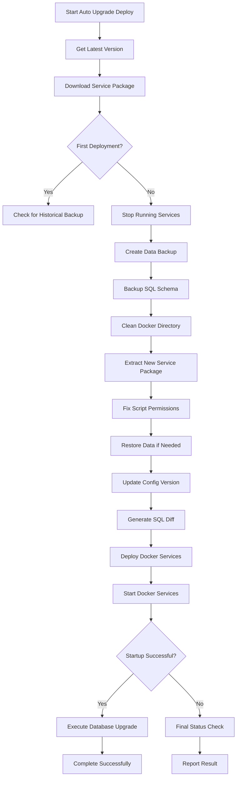
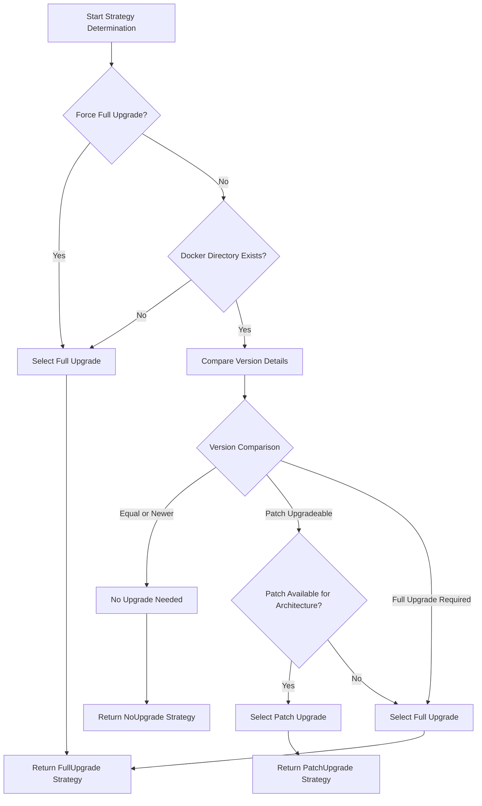
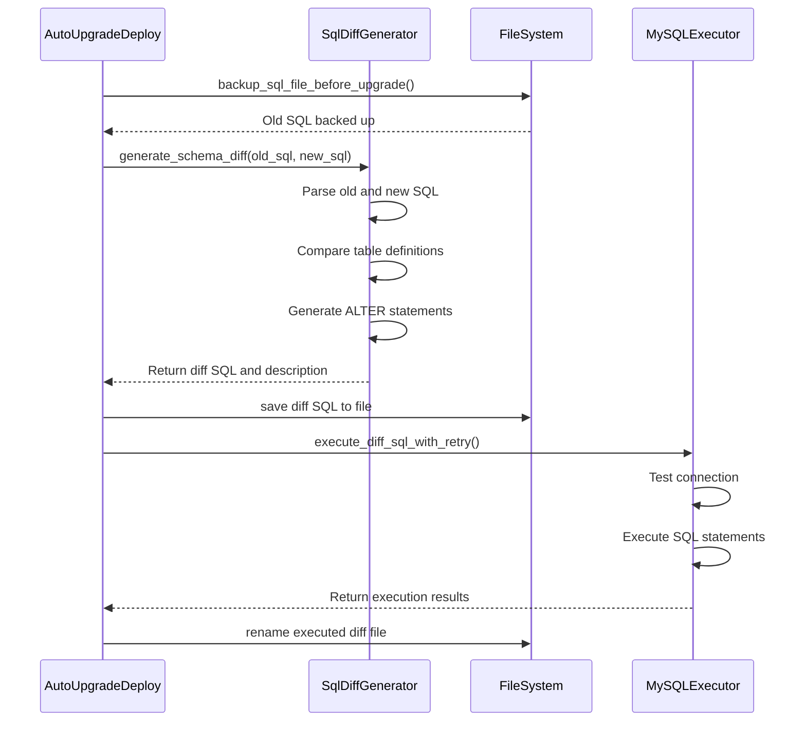
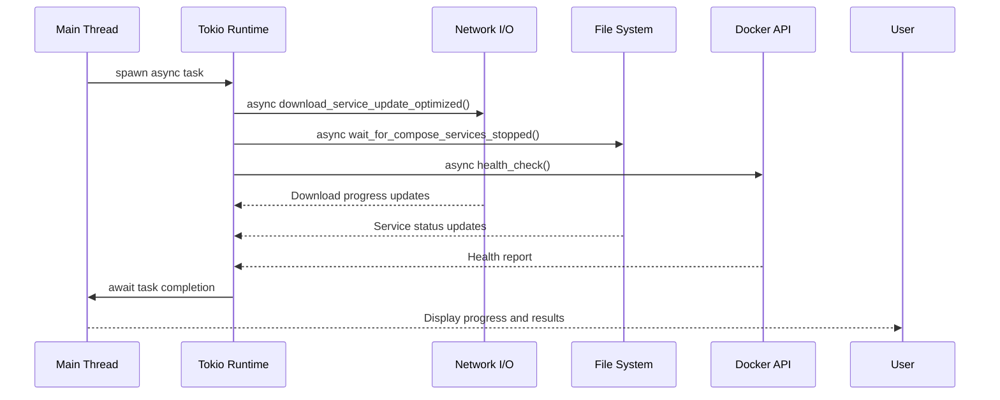

# Auto Upgrade Deploy Command

<cite>
**Referenced Files in This Document**   
- [auto_upgrade_deploy.rs](file://nuwax-cli/src/commands/auto_upgrade_deploy.rs)
- [cli.rs](file://nuwax-cli/src/cli.rs)
- [upgrade_strategy.rs](file://client-core/src/upgrade_strategy.rs)
- [update.rs](file://nuwax-cli/src/commands/update.rs)
- [docker_service.rs](file://nuwax-cli/src/commands/docker_service.rs)
</cite>

## Table of Contents
1. [Introduction](#introduction)
2. [Command Syntax and Options](#command-syntax-and-options)
3. [Execution Flow](#execution-flow)
4. [Upgrade Strategy Selection](#upgrade-strategy-selection)
5. [Database Schema Upgrades](#database-schema-upgrades)
6. [Async Orchestration with Tokio](#async-orchestration-with-tokio)
7. [Safety Mechanisms](#safety-mechanisms)
8. [Common Issues and Best Practices](#common-issues-and-best-practices)

## Introduction
The `auto-upgrade-deploy` CLI command provides a fully automated solution for upgrading and deploying Docker-based services. This command orchestrates the entire upgrade process, from checking for updates to post-deployment validation, ensuring a seamless and reliable upgrade experience. The implementation leverages Rust's async capabilities through Tokio to manage concurrent operations while maintaining safety through comprehensive rollback mechanisms.

**Section sources**
- [auto_upgrade_deploy.rs](file://nuwax-cli/src/commands/auto_upgrade_deploy.rs#L0-L35)

## Command Syntax and Options
The `auto-upgrade-deploy` command supports multiple subcommands for different deployment scenarios:

```bash
# Immediate deployment
nuwax-cli auto-upgrade-deploy run [--port PORT]

# Delayed deployment
nuwax-cli auto-upgrade-deploy delay-time-deploy --time 2 --unit hours

# Check deployment status
nuwax-cli auto-upgrade-deploy status
```

The command options are defined in the `AutoUpgradeDeployCommand` enum:

**Command Options:**
- **Run**: Immediate execution of the upgrade deployment
  - `--port`: Specify frontend service port (default: 80)
- **DelayTimeDeploy**: Schedule delayed deployment
  - `--time`: Delay duration value
  - `--unit`: Time unit (hours, minutes, days)
- **Status**: Display current deployment status

The command structure is implemented using the clap crate for robust argument parsing and validation.

```mermaid
classDiagram
class AutoUpgradeDeployCommand {
+Run{ port : Option<u16> }
+DelayTimeDeploy{ time : u32, unit : String }
+Status
}
class CliApp {
+api_client : ApiClient
+config : Config
+database : Database
+docker_manager : DockerManager
}
class UpgradeStrategy {
+FullUpgrade
+PatchUpgrade
+NoUpgrade
}
AutoUpgradeDeployCommand --> CliApp : "executes on"
AutoUpgradeDeployCommand --> UpgradeStrategy : "uses"
CliApp --> UpgradeStrategyManager : "contains"
```

**Diagram sources**
- [cli.rs](file://nuwax-cli/src/cli.rs#L50-L79)
- [auto_upgrade_deploy.rs](file://nuwax-cli/src/commands/auto_upgrade_deploy.rs#L0-L35)

**Section sources**
- [cli.rs](file://nuwax-cli/src/cli.rs#L50-L79)
- [auto_upgrade_deploy.rs](file://nuwax-cli/src/commands/auto_upgrade_deploy.rs#L0-L35)

## Execution Flow
The `auto-upgrade-deploy` command follows a comprehensive execution flow that ensures reliable and safe service upgrades. The process is orchestrated through the `run_auto_upgrade_deploy` function, which coordinates multiple stages of the upgrade process.



**Diagram sources**
- [auto_upgrade_deploy.rs](file://nuwax-cli/src/commands/auto_upgrade_deploy.rs#L37-L799)

**Section sources**
- [auto_upgrade_deploy.rs](file://nuwax-cli/src/commands/auto_upgrade_deploy.rs#L37-L799)

### Detailed Execution Steps
1. **Version Check**: The command first retrieves the latest service manifest from the API client to determine the target version for upgrade.

2. **Package Download**: Using the `update::run_upgrade` function, the appropriate service package is downloaded based on the determined upgrade strategy.

3. **Deployment Type Detection**: The system checks whether this is a first-time deployment or an upgrade by verifying the existence of the docker directory and compose file.

4. **Service Management**: For upgrades, running services are stopped gracefully with a timeout mechanism to ensure clean shutdown.

5. **Backup Creation**: A comprehensive backup is created, including both data files and the current SQL schema for later comparison.

6. **Environment Preparation**: The existing docker directory is cleaned according to the upgrade strategy (full cleanup for full upgrade, selective removal for patch upgrade).

7. **Package Extraction**: The new service package is extracted, and critical script permissions are automatically fixed.

8. **Data Restoration**: If a backup exists, data is restored to maintain continuity.

9. **Configuration Update**: The configuration file is updated with the new version information.

10. **SQL Diff Generation**: A schema difference is generated between the old and new SQL files for database migration.

11. **Service Deployment**: Docker services are deployed with the specified frontend port.

12. **Service Startup**: Services are started, and the system waits for them to become fully operational.

13. **Database Upgrade**: If the deployment was an upgrade, the SQL difference is applied to update the database schema.

## Upgrade Strategy Selection
The upgrade strategy selection process is a critical component of the auto-upgrade-deploy command, determining whether a full or patch upgrade should be performed based on various factors.



**Diagram sources**
- [upgrade_strategy.rs](file://client-core/src/upgrade_strategy.rs#L104-L184)

**Section sources**
- [upgrade_strategy.rs](file://client-core/src/upgrade_strategy.rs#L104-L184)

### Strategy Factory Pattern
The upgrade strategy is implemented using a factory pattern through the `UpgradeStrategyManager` class, which encapsulates the decision logic for selecting the appropriate upgrade strategy.

**UpgradeStrategy Enum:**
- **FullUpgrade**: Complete replacement of the service package
  - `url`: Download URL for the full package
  - `hash`: File integrity hash
  - `signature`: Package signature
  - `target_version`: Target version for upgrade
  - `download_type`: Full download type
- **PatchUpgrade**: Incremental update with only changed files
  - `patch_info`: Information about the patch package
  - `target_version`: Target version for upgrade
  - `download_type`: Patch download type
- **NoUpgrade**: No upgrade needed
  - `target_version`: Current version

The factory pattern implementation provides several benefits:
- **Encapsulation**: The complex decision logic is encapsulated within the manager
- **Extensibility**: New strategies can be added without modifying client code
- **Testability**: The strategy selection can be easily tested in isolation
- **Maintainability**: Changes to strategy logic are localized

```rust
// Example of strategy selection in action
let manager = UpgradeStrategyManager::new(
    current_version,
    force_full,
    manifest
);
let strategy = manager.determine_strategy()?;
```

The strategy selection considers multiple factors:
- Current and target version compatibility
- System architecture (x86_64 vs aarch64)
- Network conditions and download efficiency
- Available disk space
- Risk assessment of different upgrade approaches

## Database Schema Upgrades
Database schema upgrades are a critical part of the service upgrade process, ensuring that the database structure remains compatible with the new service version.

### SQL Difference Generation
The system uses a sophisticated SQL diff generation mechanism to create migration scripts that transform the old database schema to the new one.



**Diagram sources**
- [auto_upgrade_deploy.rs](file://nuwax-cli/src/commands/auto_upgrade_deploy.rs#L734-L772)
- [auto_upgrade_deploy.rs](file://nuwax-cli/src/commands/auto_upgrade_deploy.rs#L924-L980)

**Section sources**
- [auto_upgrade_deploy.rs](file://nuwax-cli/src/commands/auto_upgrade_deploy.rs#L734-L772)
- [auto_upgrade_deploy.rs](file://nuwax-cli/src/commands/auto_upgrade_deploy.rs#L924-L980)

### Database Upgrade Process
The database upgrade process follows these steps:

1. **Pre-upgrade Backup**: The current SQL schema is backed up before any changes are made.

2. **Diff Generation**: The system compares the old and new SQL files to generate a migration script.

3. **Validation**: The generated SQL is validated to ensure it contains meaningful statements (not just comments or whitespace).

4. **Connection**: A connection to the MySQL container is established using configuration extracted from the docker-compose file.

5. **Execution**: The migration script is executed with retry logic to handle transient failures.

6. **Post-execution**: Successfully executed migration files are renamed with a timestamp to preserve history.

The `execute_sql_diff_upgrade` function handles the entire database upgrade process:

```rust
async fn execute_sql_diff_upgrade() -> Result<()> {
    // Check if diff file exists
    let diff_sql_path = temp_sql_dir.join("upgrade_diff.sql");
    if !diff_sql_path.exists() {
        return Ok(());
    }

    // Read and validate SQL content
    let diff_sql = fs::read_to_string(&diff_sql_path)?;
    let meaningful_lines: Vec<&str> = diff_sql
        .lines()
        .filter(|line| {
            let trimmed = line.trim();
            !trimmed.is_empty() && !trimmed.starts_with("--") && !trimmed.starts_with("/*")
        })
        .collect();

    if meaningful_lines.is_empty() {
        return Ok(());
    }

    // Connect to MySQL
    let config = MySqlConfig::for_container(Some(compose_file_str), Some(env_file_str)).await?;
    let executor = MySqlExecutor::new(config);

    // Execute with retry logic
    match executor.execute_diff_sql_with_retry(&diff_sql, 3).await {
        Ok(results) => {
            // Rename file after successful execution
            let new_path = parent.join(new_name);
            fs::rename(&diff_sql_path, &new_path)?;
            info!("✅ Database upgrade successful");
        }
        Err(e) => {
            error!("❌ Database upgrade failed: {}", e);
            return Err(e);
        }
    }

    Ok(())
}
```

## Async Orchestration with Tokio
The auto-upgrade-deploy command leverages Tokio's async runtime to efficiently manage concurrent operations and I/O-bound tasks throughout the upgrade process.

### Async Execution Model
The command uses Rust's async/await syntax to handle potentially long-running operations without blocking the main thread:



**Diagram sources**
- [auto_upgrade_deploy.rs](file://nuwax-cli/src/commands/auto_upgrade_deploy.rs#L37-L799)
- [update.rs](file://nuwax-cli/src/commands/update.rs#L0-L161)

**Section sources**
- [auto_upgrade_deploy.rs](file://nuwax-cli/src/commands/auto_upgrade_deploy.rs#L37-L799)
- [update.rs](file://nuwax-cli/src/commands/update.rs#L0-L161)

### Key Async Patterns
The implementation uses several key async patterns:

**1. Sequential Execution with Error Handling:**
```rust
// Operations are executed sequentially with proper error propagation
let latest_version = match app.api_client.get_enhanced_service_manifest().await {
    Ok(enhanced_service_manifest) => enhanced_service_manifest.version.to_string(),
    Err(e) => {
        warn!("⚠️ 获取版本信息失败，使用配置版本: {}", e);
        app.config.get_docker_versions()
    }
};
```

**2. Concurrent Operations:**
While the main flow is sequential, certain operations like file system operations and network requests are handled asynchronously, allowing the runtime to switch between tasks efficiently.

**3. Timeout Management:**
```rust
// Using tokio::time::sleep for delayed execution
sleep(delay_duration).await;

// Waiting for services with timeout
if docker_utils::wait_for_compose_services_started(&compose_path, timeout::DEPLOY_START_TIMEOUT).await? {
    info!("✅ 自动升级部署完成，服务已成功启动");
} else {
    warn!("⚠️ 等待服务启动超时，请手动检查服务状态");
}
```

**4. Resource Management:**
The async model allows for efficient resource utilization, as the runtime can handle multiple I/O operations without creating additional threads.

## Safety Mechanisms
The auto-upgrade-deploy command implements comprehensive safety mechanisms to prevent data loss and ensure system stability during the upgrade process.

### Pre-flight Checks
Before initiating the upgrade, the system performs several validation checks:

- **Version Compatibility**: Ensures the target version is compatible with the current system
- **Disk Space**: Verifies sufficient disk space for the new package
- **Network Connectivity**: Confirms network access to download servers
- **Service State**: Checks the current state of running services

### Backup and Rollback
The system implements a robust backup and rollback strategy:

**Backup Strategy:**
- **Data Backup**: Before any changes, a complete backup of the data directory is created
- **SQL Schema Backup**: The current database schema is preserved for comparison
- **Configuration Backup**: Current configuration files are preserved

**Automatic Rollback:**
The system automatically triggers rollback in the following scenarios:
- Package extraction failure
- Service startup timeout
- Database migration failure
- Any critical error during the upgrade process

```rust
// Example of rollback on extraction failure
match docker_service::extract_docker_service_with_upgrade_strategy(app, upgrade_strategy).await {
    Ok(_) => {
        // Success handling
    }
    Err(e) => {
        error!("❌ Docker服务包解压失败: {}", e);
        // Restore from backup
        if !is_first_deployment {
            if let Some(backup_id) = latest_backup_id {
                backup::run_rollback(app, Some(backup_id), true, false, false, true).await?;
            } else {
                restore_data_after_cleanup(&temp_data_backup).await?;
            }
        }
        return Err(e);
    }
}
```

### Timeout Enforcement
The system enforces strict timeouts at various stages:

- **Service Stop Timeout**: Maximum time to wait for services to stop gracefully
- **Service Start Timeout**: Maximum time to wait for services to become operational
- **Network Operations**: Timeouts for download and API requests

### Verification and Validation
Post-upgrade validation ensures the system is functioning correctly:

- **Service Health Check**: Verifies all containers are running and healthy
- **Database Connectivity**: Confirms database is accessible
- **API Endpoint Validation**: Tests critical API endpoints
- **Configuration Consistency**: Validates configuration files are correctly updated

## Common Issues and Best Practices
This section addresses common issues encountered during auto-upgrade-deploy operations and provides best practices for production environments.

### Common Issues
**1. Partial Deployments:**
Partial deployments can occur when the upgrade process is interrupted. The system mitigates this through:
- Atomic operations where possible
- Comprehensive backup before any destructive operations
- Automatic rollback on failure

**2. Network Interruptions:**
Network issues during package download are handled by:
- Resume capability for interrupted downloads
- Checksum verification of downloaded packages
- Retry logic with exponential backoff

**3. Permission Issues:**
Script permission problems are prevented by:
- Automatic permission fixing for critical scripts
- Validation of script executability before deployment
- Fallback mechanisms for permission-related failures

### Operational Best Practices
**1. Production Environment Guidelines:**
- **Schedule Off-Peak Upgrades**: Use the delayed deployment feature to upgrade during low-traffic periods
- **Monitor System Resources**: Ensure sufficient CPU, memory, and disk space before upgrading
- **Backup Verification**: Regularly verify backup integrity and test restoration procedures

**2. Testing Strategy:**
- **Staging Environment**: Test upgrades in a staging environment first
- **Rollback Testing**: Regularly test the rollback procedure
- **Database Migration Testing**: Validate SQL migration scripts on copy of production data

**3. Monitoring and Alerting:**
- **Real-time Monitoring**: Monitor the upgrade process in real-time
- **Post-upgrade Validation**: Automated checks for service health and functionality
- **Alerting**: Immediate notifications for upgrade failures or timeouts

**4. Recovery Procedures:**
- **Documented Rollback Plan**: Clear procedures for manual intervention if automated rollback fails
- **Emergency Access**: Ensure emergency access to the system for troubleshooting
- **Support Contact Information**: Readily available support contacts for critical issues

By following these best practices, organizations can ensure smooth and reliable service upgrades with minimal risk to production systems.