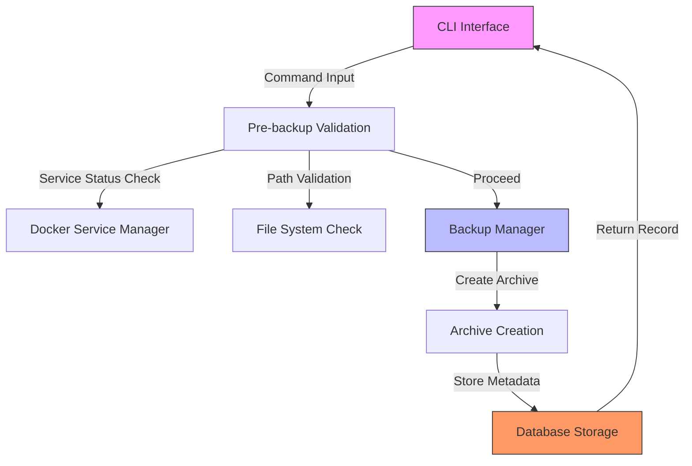
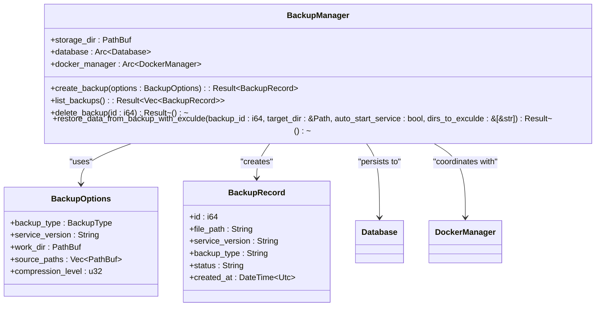
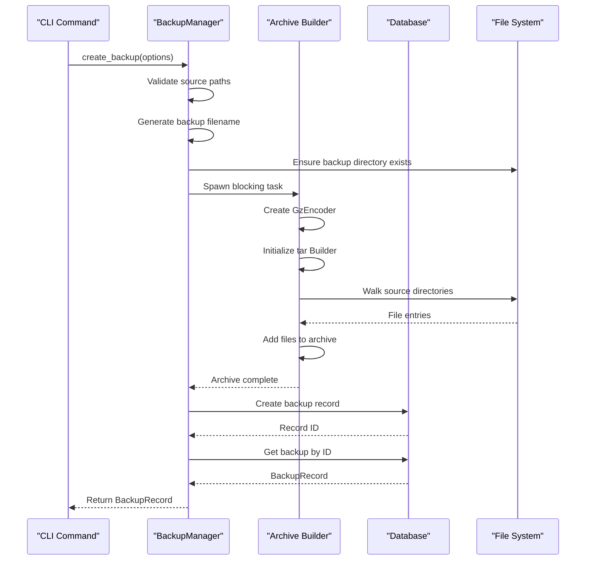
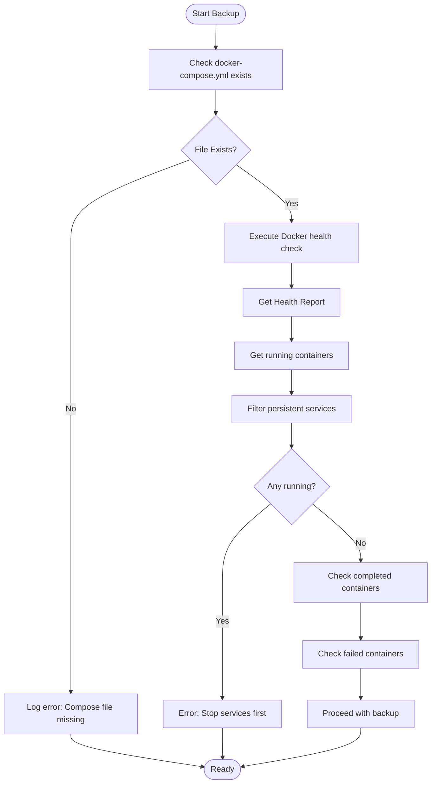
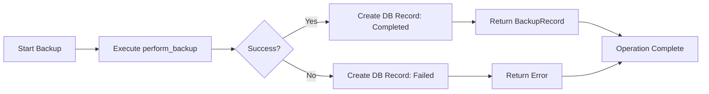
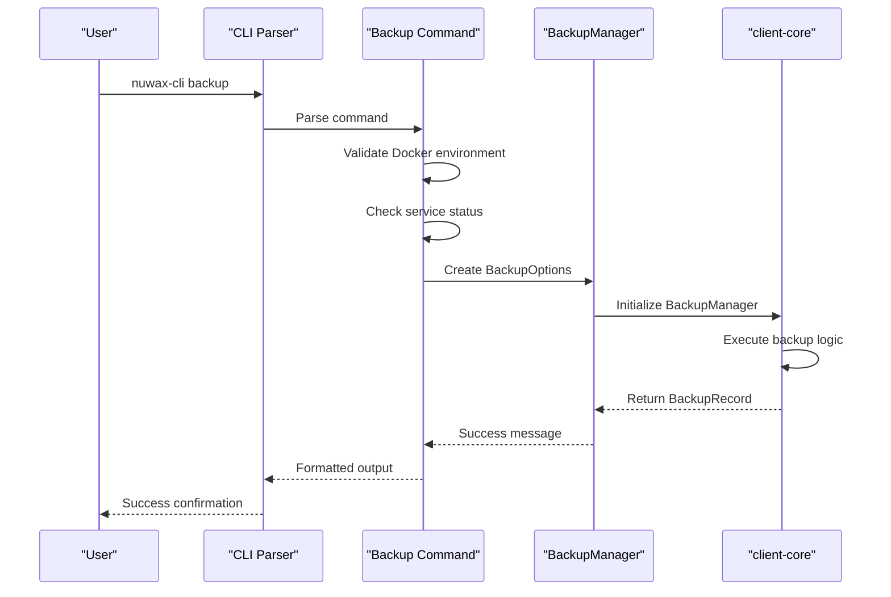

# Backup Command

<cite>
**Referenced Files in This Document**   
- [backup.rs](file://client-core/src/backup.rs)
- [backup.rs](file://nuwax-cli/src/commands/backup.rs)
- [cli.rs](file://nuwax-cli/src/cli.rs)
- [models.rs](file://client-core/src/db/models.rs)
- [tauri.ts](file://cli-ui/src/utils/tauri.ts)
- [BackupSelectionModal.tsx](file://cli-ui/src/components/BackupSelectionModal.tsx)
- [actor.rs](file://client-core/src/db/actor.rs)
</cite>

## Table of Contents
1. [Introduction](#introduction)
2. [Command Syntax and Flags](#command-syntax-and-flags)
3. [Core Components](#core-components)
4. [Architecture Overview](#architecture-overview)
5. [Detailed Component Analysis](#detailed-component-analysis)
6. [Error Handling and Validation](#error-handling-and-validation)
7. [Integration with Client-Core Module](#integration-with-client-core-module)
8. [Troubleshooting Guide](#troubleshooting-guide)
9. [Best Practices](#best-practices)

## Introduction
The Backup Command is a critical CLI utility designed to create snapshots of service state before upgrades, ensuring data integrity and enabling rollback capabilities. This document provides a comprehensive analysis of the backup implementation, covering its architecture, internal logic flow, error handling mechanisms, and integration points across the codebase. The system supports both manual and pre-upgrade backups, with robust validation and recovery features.

## Command Syntax and Flags
The backup command provides a flexible interface for creating and managing backups through the CLI. Users can invoke the command using `nuwax-cli backup` for manual backups or through automated upgrade workflows.

**Supported Commands:**
- `nuwax-cli backup`: Creates a manual backup
- `nuwax-cli list-backups`: Lists all available backups
- `nuwax-cli rollback [id]`: Restores from a specific backup
- `nuwax-cli rollback-data-only [id]`: Restores only the data directory

**Key Flags:**
- `--force`: Forces overwrite during rollback operations
- `--list-json`: Outputs backup list in JSON format for GUI integration
- `--rollback-data`: Determines whether to include data directory in rollback (default: false)
- `--auto-start-service`: Automatically restarts services after rollback completion

The command supports interactive mode for backup selection when no ID is provided, guiding users through available options with clear prompts and validation.

**Section sources**
- [cli.rs](file://nuwax-cli/src/cli.rs#L132-L180)
- [backup.rs](file://nuwax-cli/src/commands/backup.rs#L454-L486)

## Core Components
The backup functionality is implemented across multiple components, with the core logic residing in the client-core library and CLI interface in the nuwax-cli module. The system follows a layered architecture with clear separation of concerns.

The primary components include:
- **BackupManager**: Central class responsible for backup creation and restoration
- **BackupOptions**: Configuration structure defining backup parameters
- **BackupRecord**: Data model representing stored backup metadata
- **CLI Commands**: Interface layer for user interaction

The BackupManager orchestrates the entire backup process, coordinating between file operations, database recording, and Docker service state management. It ensures atomic operations and maintains consistency across the system state.

**Section sources**
- [backup.rs](file://client-core/src/backup.rs#L19-L27)
- [models.rs](file://client-core/src/db/models.rs#L4-L10)
- [backup.rs](file://nuwax-cli/src/commands/backup.rs#L375-L419)

## Architecture Overview
The backup system follows a modular architecture with clear separation between the CLI interface, business logic, and data persistence layers. The workflow begins with user interaction through the CLI, proceeds through validation and execution in the core module, and concludes with metadata storage in the database.



**Diagram sources**
- [backup.rs](file://client-core/src/backup.rs)
- [backup.rs](file://nuwax-cli/src/commands/backup.rs)

**Section sources**
- [backup.rs](file://client-core/src/backup.rs#L60-L94)
- [backup.rs](file://nuwax-cli/src/commands/backup.rs#L200-L400)

## Detailed Component Analysis

### Backup Manager Implementation
The BackupManager is the central component responsible for coordinating backup operations. It handles the entire lifecycle from initiation to completion, including error recovery and metadata management.



**Diagram sources**
- [backup.rs](file://client-core/src/backup.rs#L19-L27)
- [models.rs](file://client-core/src/db/models.rs#L4-L10)

**Section sources**
- [backup.rs](file://client-core/src/backup.rs#L60-L94)
- [backup.rs](file://client-core/src/backup.rs#L126-L155)

### Backup Creation Workflow
The backup creation process follows a structured sequence of operations, ensuring data consistency and system stability.



**Diagram sources**
- [backup.rs](file://client-core/src/backup.rs#L126-L186)
- [backup.rs](file://client-core/src/backup.rs#L60-L94)

**Section sources**
- [backup.rs](file://client-core/src/backup.rs#L126-L186)
- [backup.rs](file://nuwax-cli/src/commands/backup.rs#L375-L419)

### Pre-backup Validation Process
Before initiating a backup, the system performs comprehensive validation to ensure the environment is in a suitable state. This includes checking Docker service status and verifying critical file paths.



**Diagram sources**
- [backup.rs](file://nuwax-cli/src/commands/backup.rs#L200-L400)
- [backup.rs](file://nuwax-cli/src/commands/backup.rs#L375-L419)

**Section sources**
- [backup.rs](file://nuwax-cli/src/commands/backup.rs#L200-L400)
- [backup.rs](file://nuwax-cli/src/commands/backup.rs#L375-L419)

## Error Handling and Validation
The backup system implements comprehensive error handling to manage various failure scenarios gracefully. The validation process ensures system integrity before initiating backup operations.

### Pre-backup Validation
The system performs several critical checks before creating a backup:
- **Docker Compose File Validation**: Verifies the existence of the docker-compose.yml file
- **Service State Validation**: Ensures no persistent services are running during cold backup
- **Path Validation**: Confirms source paths exist and are accessible
- **Disk Space Verification**: Implicitly checked during archive creation

When persistent services are detected, the system provides detailed information about running containers and clear instructions for resolution:

```rust
if !persistent_running_services.is_empty() {
    warn!("⚠️  Persistent services still running!");
    error!("❌ Cold backup requires persistent services to be stopped");
    
    info!("📝 Found {} persistent services:", persistent_running_services.len());
    for container in &persistent_running_services {
        info!("   - {} (Status: {}, restart: {})", 
              container.name, 
              container.status.display_name(), 
              container.get_restart_display());
    }
    
    info!("💡 Please stop persistent services before backup");
    return Ok(());
}
```

### Error Recovery and Reporting
The system implements transactional semantics for backup operations, ensuring database consistency even when file operations fail:



When backup creation fails, the system still records the attempt in the database with a "Failed" status, providing audit trail and diagnostic information.

**Section sources**
- [backup.rs](file://client-core/src/backup.rs#L60-L94)
- [backup.rs](file://client-core/src/backup.rs#L157-L186)
- [backup.rs](file://nuwax-cli/src/commands/backup.rs#L200-L400)

## Integration with Client-Core Module
The CLI backup command integrates seamlessly with the client-core backup module through a well-defined interface. This integration enables consistent backup functionality across different application interfaces.

### CLI to Core Integration
The nuwax-cli command module acts as a bridge between user input and the core backup functionality:



The integration uses the BackupManager struct from client-core, passing configuration through the BackupOptions struct. This decoupled design allows the core functionality to be reused across different interfaces.

### GUI Integration via JSON Output
The system supports GUI integration through a JSON output mode, enabling the web interface to consume backup data programmatically:

```rust
/// Output JSON-formatted backup list (for GUI integration)
async fn output_backups_as_json(app: &CliApp) -> Result<()> {
    match get_backups_as_json(app).await {
        Ok(response) => {
            // Output pure JSON to stdout without log interference
            match serde_json::to_string(&response) {
                Ok(json_str) => {
                    print!("{json_str}");
                    Ok(())
                }
                Err(e) => {
                    let error_response = JsonBackupListResponse {
                        success: false,
                        backups: vec![],
                        error: Some(format!("JSON serialization failed: {e}")),
                    };
                    if let Ok(error_json) = serde_json::to_string(&error_response) {
                        print!("{error_json}");
                    }
                    Ok(())
                }
            }
        }
        Err(e) => {
            let error_response = JsonBackupListResponse {
                success: false,
                backups: vec![],
                error: Some(e.to_string()),
            };
            if let Ok(error_json) = serde_json::to_string(&error_response) {
                print!("{error_json}");
            }
            Ok(())
        }
    }
}
```

The GUI components consume this JSON output to display backup information in the web interface:

```typescript
static async getBackupList(workingDir: string): Promise<{ success: boolean; backups: any[]; error?: string }> {
    try {
        const result = await this.executeSmart(['rollback', '--list-json'], workingDir);
        
        if (result.success) {
            try {
                const stdout = result.stdout.trim();
                const firstBraceIndex = stdout.indexOf('{');
                const lastBraceIndex = stdout.lastIndexOf('}');
                
                if (firstBraceIndex !== -1 && lastBraceIndex !== -1 && firstBraceIndex < lastBraceIndex) {
                    const jsonStr = stdout.substring(firstBraceIndex, lastBraceIndex + 1);
                    const jsonResponse = JSON.parse(jsonStr);
                    return jsonResponse;
                } else {
                    return {
                        success: false,
                        backups: [],
                        error: 'No valid JSON data found'
                    };
                }
            } catch (parseError) {
                return {
                    success: false,
                    backups: [],
                    error: `JSON parsing failed: ${parseError}`
                };
            }
        } else {
            return {
                success: false,
                backups: [],
                error: result.stderr || 'Failed to get backup list'
            };
        }
    } catch (error) {
        return {
            success: false,
            error: `Failed to get backup list: ${error}`
        };
    }
}
```

**Diagram sources**
- [backup.rs](file://nuwax-cli/src/commands/backup.rs#L951-L990)
- [tauri.ts](file://cli-ui/src/utils/tauri.ts#L776-L823)

**Section sources**
- [backup.rs](file://nuwax-cli/src/commands/backup.rs#L951-L990)
- [tauri.ts](file://cli-ui/src/utils/tauri.ts#L776-L823)
- [BackupSelectionModal.tsx](file://cli-ui/src/components/BackupSelectionModal.tsx#L32-L71)

## Troubleshooting Guide
This section addresses common backup failures and provides solutions for troubleshooting issues.

### Common Backup Failures
**1. Persistent Services Running**
- **Symptom**: "Cold backup requires persistent services to be stopped"
- **Cause**: Docker containers with restart policies are still running
- **Solution**: Stop all persistent services using `nuwax-cli docker-service stop`

**2. Missing Backup Files**
- **Symptom**: "Backup file missing" in list output
- **Cause**: Backup file was deleted or moved manually
- **Solution**: 
  - Verify backup directory configuration
  - Clean up invalid records using database maintenance
  - Recreate missing backups

**3. Permission Errors**
- **Symptom**: "Permission denied" during backup creation
- **Cause**: Insufficient write permissions to backup directory
- **Solution**: 
  - Verify directory ownership and permissions
  - Ensure the executing user has write access
  - Check file system mount options

**4. Disk Space Issues**
- **Symptom**: Backup operation fails mid-process
- **Cause**: Insufficient disk space for archive creation
- **Solution**:
  - Check available disk space with `df -h`
  - Clean up old backups or increase storage capacity
  - Configure backup retention policy

**5. Corrupted Archives**
- **Symptom**: Failure during restore operations
- **Cause**: Incomplete backup due to system interruption
- **Solution**:
  - Verify archive integrity with `tar -tzf backup.tar.gz`
  - Recreate the backup
  - Implement regular backup verification

### Diagnostic Commands
The system provides several commands for diagnosing backup issues:

```bash
# Check current backup status
nuwax-cli list-backups

# Verify Docker service state
nuwax-cli docker-service status

# Check available disk space
df -h /path/to/backup/directory

# Test archive integrity
tar -tzf /path/to/backup/file.tar.gz | head -20
```

**Section sources**
- [backup.rs](file://nuwax-cli/src/commands/backup.rs#L417-L452)
- [backup.rs](file://nuwax-cli/src/commands/backup.rs#L488-L519)
- [actor.rs](file://client-core/src/db/actor.rs#L300-L331)

## Best Practices
Implementing effective backup strategies is crucial for system reliability and data protection. The following best practices ensure optimal backup operations.

### Regular Backup Scheduling
Establish a regular backup schedule based on your data change frequency:
- **Critical Systems**: Daily backups with hourly snapshots
- **Production Systems**: Daily backups with weekly retention
- **Development Systems**: On-demand backups before major changes

Use automated scheduling to ensure consistency:
```bash
# Example cron job for daily backups
0 2 * * * /usr/local/bin/nuwax-cli backup --quiet
```

### Backup Verification
Regularly verify backup integrity to ensure recoverability:
- **Automated Verification**: Implement post-backup validation scripts
- **Periodic Testing**: Perform test restores on a staging environment
- **Checksum Validation**: Store and verify MD5/SHA256 checksums

```rust
// Example verification logic
async fn verify_backup_integrity(backup_path: &Path) -> Result<bool> {
    if !backup_path.exists() {
        return Ok(false);
    }
    
    tokio::task::spawn_blocking(move || {
        let file = File::open(backup_path)?;
        let decoder = GzDecoder::new(file);
        let mut archive = Archive::new(decoder);
        
        // Try to read the first few entries
        let mut entries = archive.entries()?;
        let valid = entries.next().is_some();
        
        Ok(valid)
    }).await?
}
```

### Storage Management
Implement proper storage management to prevent disk space issues:
- **Retention Policy**: Keep only necessary backups (e.g., 7 daily, 4 weekly)
- **Compression Settings**: Balance compression level and performance
- **Storage Location**: Use dedicated storage with sufficient capacity

### Monitoring and Alerts
Set up monitoring for backup operations:
- **Success/Failure Notifications**: Email or message alerts
- **Storage Usage Alerts**: Warn when disk usage exceeds thresholds
- **Backup Age Alerts**: Notify when no backup has been created recently

### Security Considerations
Protect backup data with appropriate security measures:
- **Encryption**: Encrypt sensitive backup data at rest
- **Access Control**: Restrict access to backup files and directories
- **Audit Logging**: Maintain logs of backup and restore operations

**Section sources**
- [backup.rs](file://client-core/src/backup.rs#L600-L623)
- [backup.rs](file://nuwax-cli/src/commands/backup.rs#L375-L419)
- [backup.rs](file://client-core/src/backup.rs#L126-L155)