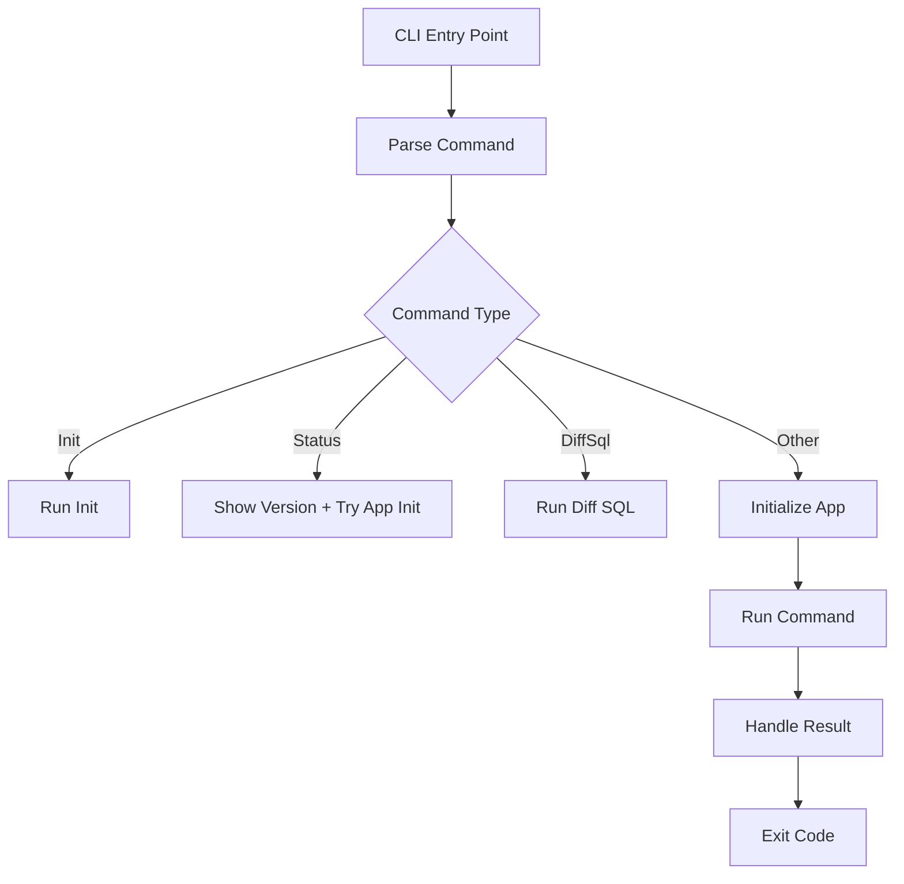
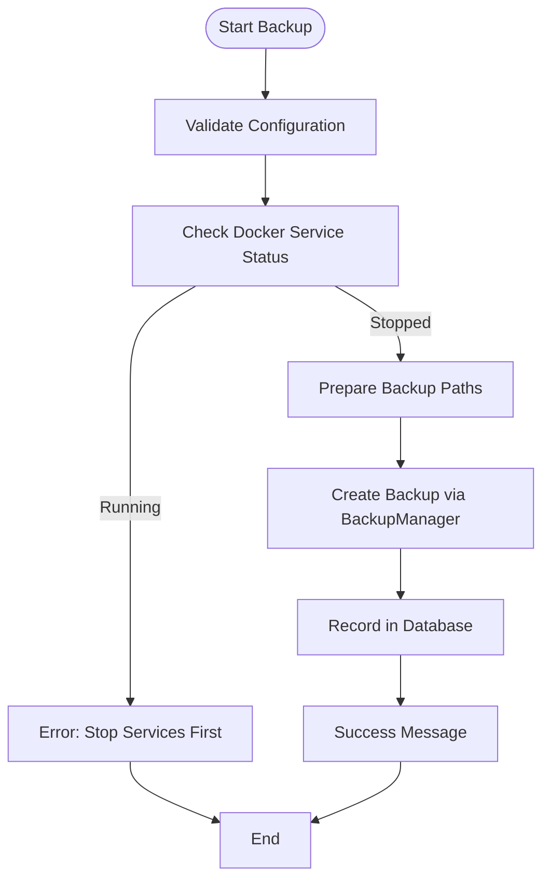
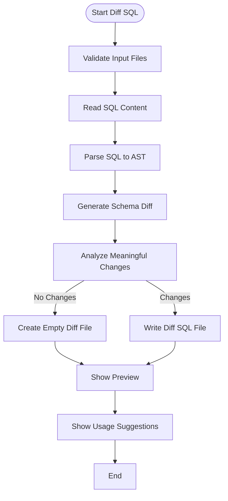
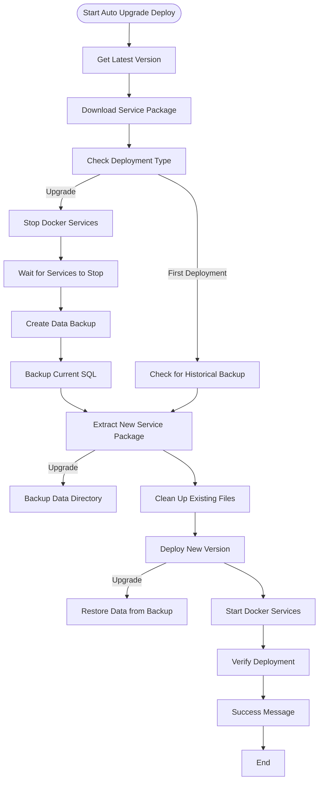
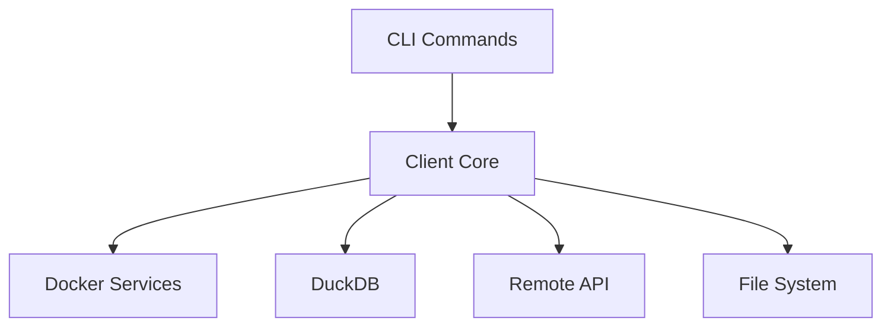

# CLI Command Implementations

<cite>
**Referenced Files in This Document**   
- [main.rs](file://nuwax-cli/src/main.rs)
- [cli.rs](file://nuwax-cli/src/cli.rs)
- [backup.rs](file://nuwax-cli/src/commands/backup.rs)
- [diff_sql.rs](file://nuwax-cli/src/commands/diff_sql.rs)
- [auto_upgrade_deploy.rs](file://nuwax-cli/src/commands/auto_upgrade_deploy.rs)
- [app.rs](file://nuwax-cli/src/app.rs)
- [backup.rs](file://client-core/src/backup.rs)
- [differ.rs](file://client-core/src/sql_diff/differ.rs)
- [generator.rs](file://client-core/src/sql_diff/generator.rs)
- [parser.rs](file://client-core/src/sql_diff/parser.rs)
- [types.rs](file://client-core/src/sql_diff/types.rs)
- [upgrade_strategy.rs](file://client-core/src/upgrade_strategy.rs)
- [version.rs](file://client-core/src/version.rs)
- [api_types.rs](file://client-core/src/api_types.rs)
</cite>

## Table of Contents
1. [Introduction](#introduction)
2. [Command Architecture Overview](#command-architecture-overview)
3. [Backup Command Implementation](#backup-command-implementation)
4. [Diff SQL Command Implementation](#diff-sql-command-implementation)
5. [Auto Upgrade Deploy Command Implementation](#auto-upgrade-deploy-command-implementation)
6. [Common Patterns and Utilities](#common-patterns-and-utilities)
7. [Error Handling and Logging](#error-handling-and-logging)
8. [Integration with Client Core](#integration-with-client-core)
9. [Troubleshooting Guide](#troubleshooting-guide)

## Introduction
This document provides a comprehensive analysis of the CLI command implementations in the nuwax-cli application. The system is designed as a Docker service management and upgrade tool that provides automated backup, intelligent upgrade, and operational monitoring capabilities. The commands are implemented using Rust with Tokio for async operations, clap for command-line argument parsing, and tracing for logging. Each command follows a consistent pattern of configuration loading, pre-execution checks, interaction with Docker services, and result reporting.

**Section sources**
- [main.rs](file://nuwax-cli/src/main.rs#L0-L102)
- [cli.rs](file://nuwax-cli/src/cli.rs#L0-L221)

## Command Architecture Overview
The nuwax-cli application follows a modular command architecture where each command is implemented as a separate module within the commands directory. The main entry point in main.rs handles command parsing and routing, with special handling for initialization, status, and diff-sql commands that have different initialization requirements.



**Diagram sources**
- [main.rs](file://nuwax-cli/src/main.rs#L0-L102)

**Section sources**
- [main.rs](file://nuwax-cli/src/main.rs#L0-L102)
- [mod.rs](file://nuwax-cli/src/commands/mod.rs#L0-L40)

## Backup Command Implementation

### Command Structure and Invocation
The backup command provides functionality for creating manual backups, listing existing backups, and rolling back from backups. It is invoked using the `nuwax-cli backup` command and supports several subcommands for different operations.

```rust
#[derive(Subcommand)]
pub enum Commands {
    /// 手动创建备份
    Backup,
    /// 列出所有备份
    ListBackups,
    /// 从备份恢复
    Rollback {
        /// 备份 ID（可选，不提供时将显示交互式选择界面）
        backup_id: Option<i64>,
        /// 强制覆盖
        #[arg(long)]
        force: bool,
        /// 输出 JSON 格式的备份列表（用于 GUI 集成）
        #[arg(long)]
        list_json: bool,
    },
}
```

### Internal Logic Flow
The backup command follows a structured execution flow that includes configuration loading, pre-execution checks, interaction with Docker services, and result reporting.



**Diagram sources**
- [backup.rs](file://nuwax-cli/src/commands/backup.rs#L0-L200)
- [backup.rs](file://client-core/src/backup.rs#L0-L200)

### Integration with Client Core
The backup command integrates with the client-core functionality through the BackupManager, which handles the actual backup operations. The CLI command prepares the backup options and then delegates to the core library.

```rust
let backup_options = BackupOptions {
    backup_type: BackupType::Manual,
    service_version: app.config.get_docker_versions(),
    work_dir,
    source_paths: need_backup_paths,
    compression_level: 6,
};

let backup_manager = BackupManager::new(
    app.config.get_backup_dir(),
    app.database.clone(),
    app.docker_manager.clone(),
)?;

let backup_record = backup_manager.create_backup(backup_options).await?;
```

**Section sources**
- [backup.rs](file://nuwax-cli/src/commands/backup.rs#L0-L200)
- [backup.rs](file://client-core/src/backup.rs#L0-L200)

## Diff SQL Command Implementation

### Purpose and Syntax
The diff-sql command compares two SQL files and generates a difference SQL script that can be used to upgrade from the old schema to the new schema. This is particularly useful for database migrations and schema evolution.

**Invocation Syntax:**
```
nuwax-cli diff-sql <old_sql> <new_sql> [--old-version <version>] [--new-version <version>] [--output <file>]
```

### Supported Flags and Options
- **old_sql**: Path to the old SQL file (required)
- **new_sql**: Path to the new SQL file (required)
- **--old-version**: Specify the version of the old schema (optional)
- **--new-version**: Specify the version of the new schema (optional)
- **--output**: Output file for the difference SQL (default: "diff.sql")

### Internal Logic Flow
The diff-sql command follows a file-based processing flow that doesn't require the full application initialization, making it lightweight and fast.



**Diagram sources**
- [diff_sql.rs](file://nuwax-cli/src/commands/diff_sql.rs#L0-L113)

### Integration with SQL Diff Engine
The command leverages the client-core's SQL diff engine, which uses a multi-stage process to compare database schemas:

1. **Parsing**: SQL files are parsed into abstract syntax trees using sqlparser
2. **Extraction**: Table definitions are extracted from the AST
3. **Comparison**: Structural differences are identified between old and new schemas
4. **Generation**: Appropriate ALTER TABLE statements are generated

```rust
let (diff_sql, description) = generate_schema_diff(
    Some(&old_sql_content),
    &new_sql_content,
    Some(from_version),
    to_version,
)?;
```

The diff engine handles various types of schema changes:
- **New tables**: Generates CREATE TABLE statements
- **Deleted tables**: Generates DROP TABLE statements
- **Modified tables**: Generates ALTER TABLE statements for:
  - Added columns
  - Removed columns
  - Modified columns
  - Added indexes
  - Removed indexes

**Section sources**
- [diff_sql.rs](file://nuwax-cli/src/commands/diff_sql.rs#L0-L113)
- [generator.rs](file://client-core/src/sql_diff/generator.rs#L0-L194)
- [differ.rs](file://client-core/src/sql_diff/differ.rs#L0-L266)
- [parser.rs](file://client-core/src/sql_diff/parser.rs#L0-L381)

## Auto Upgrade Deploy Command Implementation

### Command Structure
The auto-upgrade-deploy command provides automated deployment of new service versions with support for different deployment strategies.

```rust
pub enum AutoUpgradeDeployCommand {
    /// 立即执行自动升级部署
    Run {
        /// 指定frontend服务的端口号（默认80端口）
        #[arg(
            long,
            help = "指定frontend服务的端口号，对应docker-compose.yml中的FRONTEND_HOST_PORT变量（默认: 80端口）"
        )]
        port: Option<u16>,
    },
    /// 延迟执行自动升级部署
    DelayTimeDeploy {
        /// 延迟时间数值
        #[arg(help = "延迟时间数值，例如 2")]
        time: u32,
        /// 时间单位 (hours, minutes, days)
        #[arg(
            long,
            default_value = "hours",
            help = "时间单位：hours(小时), minutes(分钟), days(天)"
        )]
        unit: String,
    },
    /// 显示当前自动升级配置
    Status,
}
```

### Internal Logic Flow
The auto-upgrade-deploy command implements a comprehensive deployment workflow that handles both initial deployments and upgrades.



**Diagram sources**
- [auto_upgrade_deploy.rs](file://nuwax-cli/src/commands/auto_upgrade_deploy.rs#L0-L200)

### Upgrade Strategy Integration
The command integrates with the upgrade strategy system to determine whether a full or patch upgrade is needed based on version compatibility and architecture.

```rust
let upgrade_strategy = update::run_upgrade(app, upgrade_args).await?;
```

The upgrade strategy considers:
- **Current version vs. target version**: Determines if upgrade is needed
- **Architecture compatibility**: Ensures correct platform-specific packages
- **Network conditions**: May influence download strategy
- **Disk space**: Verifies sufficient space for download and extraction

For patch upgrades, only changed files are replaced, while full upgrades replace the entire service package.

**Section sources**
- [auto_upgrade_deploy.rs](file://nuwax-cli/src/commands/auto_upgrade_deploy.rs#L0-L200)
- [upgrade_strategy.rs](file://client-core/src/upgrade_strategy.rs#L0-L200)
- [version.rs](file://client-core/src/version.rs#L0-L200)

## Common Patterns and Utilities

### Configuration Loading
All commands follow a consistent pattern for configuration loading through the CliApp structure:

```rust
pub struct CliApp {
    pub config: Arc<AppConfig>,
    pub database: Arc<Database>,
    pub api_client: Arc<ApiClient>,
    pub authenticated_client: Arc<AuthenticatedClient>,
    pub docker_manager: Arc<DockerManager>,
    pub backup_manager: Arc<BackupManager>,
    pub upgrade_manager: Arc<UpgradeManager>,
}
```

The `new_with_auto_config` method handles the initialization process:

```rust
pub async fn new_with_auto_config() -> Result<Self> {
    let config = Arc::new(AppConfig::find_and_load_config()?);
    config.ensure_cache_dirs()?;
    let db_path = config::get_database_path();
    let database = Arc::new(Database::connect(&db_path).await?);
    // ... other initializations
}
```

### Pre-execution Checks
Commands implement various pre-execution checks to ensure proper execution conditions:

- **Docker service status**: Verifies services are stopped before backup
- **File existence**: Checks for required files before processing
- **Directory permissions**: Validates write permissions for output directories
- **Version compatibility**: Ensures upgrade compatibility

### Progress Reporting
The system uses structured logging with emoji indicators for user-friendly progress reporting:

```rust
info!("🔄 开始创建备份...");
info!("✅ 备份创建成功: {}", backup_record.file_path);
error!("❌ 有持续运行的服务，无法进行冷备份");
warn!("⚠️ 获取版本信息失败，使用配置版本: {}", e);
```

### User Confirmation and Interaction
While most commands are designed for automation, they provide clear output to inform users of progress and required actions:

```rust
info!("💡 使用建议:");
info!("   1. 请先备份您的数据库");
info!("   2. 在测试环境中验证差异SQL");
info!("   3. 确认无误后在生产环境执行");
```

**Section sources**
- [app.rs](file://nuwax-cli/src/app.rs#L0-L43)
- [backup.rs](file://nuwax-cli/src/commands/backup.rs#L0-L200)
- [diff_sql.rs](file://nuwax-cli/src/commands/diff_sql.rs#L0-L113)

## Error Handling and Logging

### Error Handling Strategy
The system implements a comprehensive error handling strategy using the anyhow and thiserror crates:

```rust
use anyhow::Result;
use client_core::error::DuckError;
```

Errors are handled at multiple levels:
- **Command level**: Top-level error handling with user-friendly messages
- **Service level**: Domain-specific error handling
- **Operation level**: Fine-grained error handling for individual operations

```rust
if let Err(e) = run_diff_sql(old_sql, new_sql, old_version, new_version, output).await {
    error!("❌ SQL差异对比失败: {}", e);
    std::process::exit(1);
}
```

### Logging Implementation
The system uses tracing for structured logging with different severity levels:

- **info!**: General progress and status messages
- **error!**: Errors and failure conditions
- **warn!**: Warnings and non-critical issues
- **debug!**: Detailed debugging information
- **trace!**: Fine-grained tracing for development

The logging system supports verbose output when the `--verbose` flag is used:

```rust
#[arg(short, long)]
pub verbose: bool,
```

### Async Operations with Tokio
All commands use Tokio for async operations, allowing non-blocking I/O and efficient resource utilization:

```rust
#[tokio::main]
async fn main() {
    // ... async operations
}
```

Async patterns include:
- **File operations**: Non-blocking file reads and writes
- **HTTP requests**: Async API calls
- **Docker interactions**: Async container management
- **Database operations**: Async queries and transactions

```rust
tokio::task::spawn_blocking(move || {
    // CPU-intensive operations in blocking task
    let file = File::create(&backup_path)?;
    // ... compression operations
}).await??;
```

**Section sources**
- [main.rs](file://nuwax-cli/src/main.rs#L0-L102)
- [backup.rs](file://nuwax-cli/src/commands/backup.rs#L0-L200)
- [diff_sql.rs](file://nuwax-cli/src/commands/diff_sql.rs#L0-L113)

## Integration with Client Core

### Architecture Overview
The nuwax-cli application serves as a command-line interface to the client-core library, which contains the core business logic.



### Key Integration Points
The integration between nuwax-cli and client-core occurs through well-defined interfaces:

- **BackupManager**: Handles backup and restore operations
- **Database**: Manages database connections and queries
- **DockerManager**: Controls Docker container lifecycle
- **UpgradeManager**: Manages service upgrades
- **ApiClient**: Communicates with remote API

### Data Flow
The data flow between CLI and core components follows a consistent pattern:

1. **Command parsing**: CLI parses arguments and options
2. **Configuration loading**: App configuration is loaded
3. **Option preparation**: Command-specific options are prepared
4. **Core invocation**: Core functionality is invoked with options
5. **Result processing**: Results are processed and reported

```rust
// Example: Backup command flow
let backup_options = BackupOptions { /* ... */ };
let backup_manager = BackupManager::new(/* ... */);
let backup_record = backup_manager.create_backup(backup_options).await?;
```

**Section sources**
- [app.rs](file://nuwax-cli/src/app.rs#L0-L43)
- [backup.rs](file://client-core/src/backup.rs#L0-L200)
- [api_types.rs](file://client-core/src/api_types.rs#L0-L200)

## Troubleshooting Guide

### Common Issues and Solutions

#### Backup Command Issues
**Issue**: "有持续运行的服务，无法进行冷备份"
**Solution**: Stop Docker services before creating a backup:
```bash
nuwax-cli docker-service stop
nuwax-cli backup
```

**Issue**: Configuration file not found
**Solution**: Initialize the client or specify the correct config path:
```bash
nuwax-cli init
# or
nuwax-cli backup --config /path/to/config.toml
```

#### Diff SQL Command Issues
**Issue**: "旧版本SQL文件不存在"
**Solution**: Verify the file path and permissions:
```bash
ls -la old_init_mysql.sql
nuwax-cli diff-sql ./old_init_mysql.sql ./new_init_mysql.sql
```

**Issue**: No meaningful differences found
**Solution**: This is expected when schemas are identical. The tool creates an empty diff file with explanatory comments.

#### Auto Upgrade Deploy Issues
**Issue**: "等待服务停止超时"
**Solution**: Force stop Docker services and retry:
```bash
docker-compose -f docker/docker-compose.yml down
nuwax-cli auto-upgrade-deploy run
```

**Issue**: Permission denied when extracting files
**Solution**: Ensure write permissions on the docker directory:
```bash
chmod -R 755 docker/
```

### Best Practices
- **Regular backups**: Create backups before any upgrade operation
- **Test in staging**: Always test SQL diffs in a staging environment
- **Monitor disk space**: Ensure sufficient space for downloads and backups
- **Use version tags**: Specify versions explicitly when possible
- **Enable verbose logging**: Use `--verbose` flag for detailed troubleshooting

### Debugging Tips
- Check the log output for error messages and warnings
- Verify file and directory permissions
- Ensure Docker is running and accessible
- Validate network connectivity to the API server
- Check disk space with `df -h`
- Review configuration file settings

**Section sources**
- [status.rs](file://nuwax-cli/src/commands/status.rs#L85-L115)
- [backup.rs](file://nuwax-cli/src/commands/backup.rs#L0-L200)
- [diff_sql.rs](file://nuwax-cli/src/commands/diff_sql.rs#L0-L113)
- [auto_upgrade_deploy.rs](file://nuwax-cli/src/commands/auto_upgrade_deploy.rs#L0-L200)