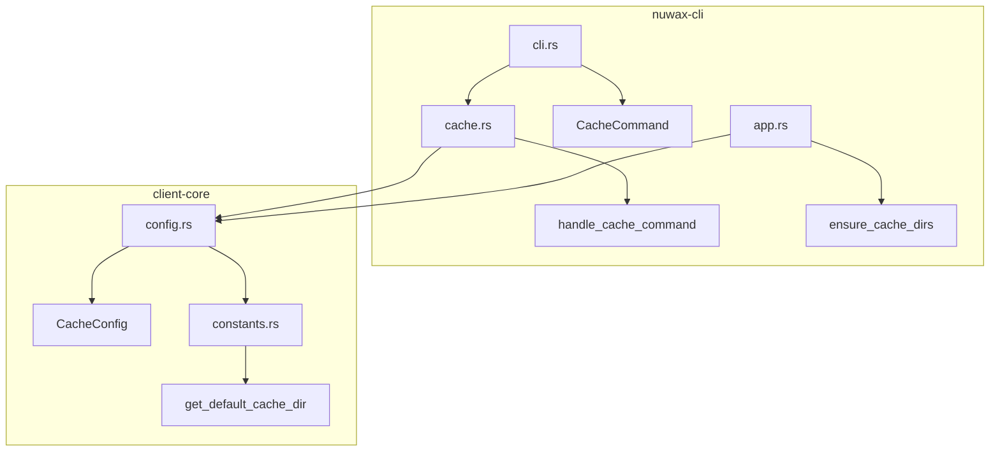
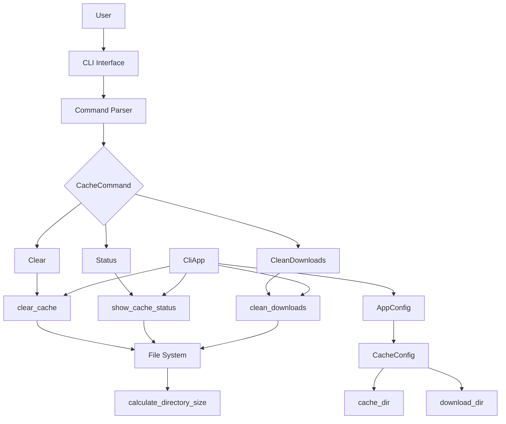
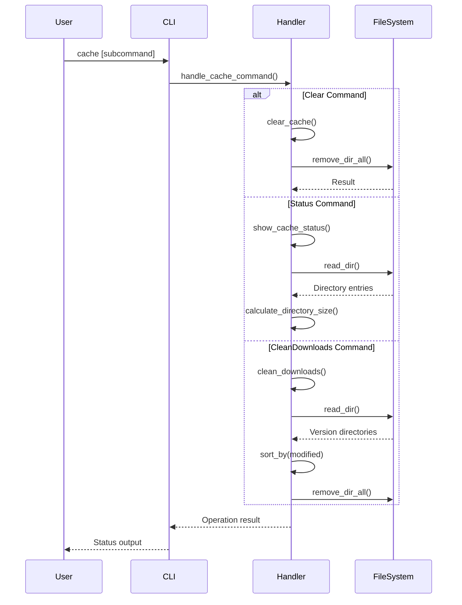
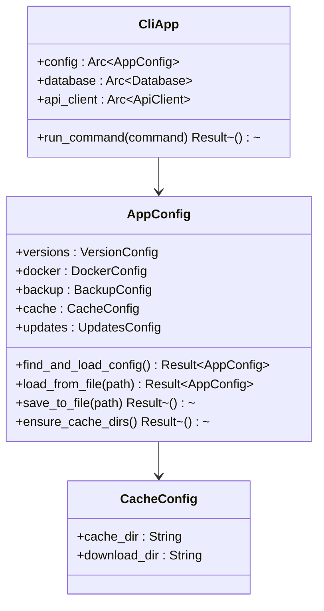
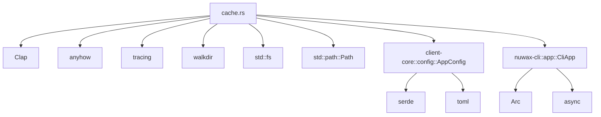

# Cache Command

<cite>
**Referenced Files in This Document**   
- [cache.rs](file://nuwax-cli/src/commands/cache.rs)
- [cli.rs](file://nuwax-cli/src/cli.rs)
- [config.rs](file://client-core/src/config.rs)
- [constants.rs](file://client-core/src/constants.rs)
- [app.rs](file://nuwax-cli/src/app.rs)
</cite>

## Table of Contents
1. [Introduction](#introduction)
2. [Project Structure](#project-structure)
3. [Core Components](#core-components)
4. [Architecture Overview](#architecture-overview)
5. [Detailed Component Analysis](#detailed-component-analysis)
6. [Dependency Analysis](#dependency-analysis)
7. [Performance Considerations](#performance-considerations)
8. [Troubleshooting Guide](#troubleshooting-guide)
9. [Conclusion](#conclusion)

## Introduction
The Cache Command is a CLI utility designed to manage local download caches for update packages in the Duck Client application. It provides functionality to clean, list, and inspect cached artifacts, ensuring efficient storage management and system performance. The command supports three primary operations: clearing all cache files, displaying cache status, and cleaning download caches while preserving a specified number of recent versions. This documentation provides a comprehensive analysis of its implementation, architecture, and usage patterns.

## Project Structure
The cache command implementation is organized within the `nuwax-cli` module of the Duck Client repository. The core functionality resides in the `commands/cache.rs` file, which handles cache operations through asynchronous functions. Configuration for cache directories is defined in the `client-core/src/config.rs` file, while default paths are established in `client-core/src/constants.rs`. The CLI interface is structured using the Clap framework in `nuwax-cli/src/cli.rs`, enabling subcommand-based interaction. Cache directories are automatically created during application initialization in `nuwax-cli/src/app.rs`.

**Diagram sources**
- [cache.rs](file://nuwax-cli/src/commands/cache.rs)
- [cli.rs](file://nuwax-cli/src/cli.rs)
- [config.rs](file://client-core/src/config.rs)
- [constants.rs](file://client-core/src/constants.rs)
- [app.rs](file://nuwax-cli/src/app.rs)

**Section sources**
- [cache.rs](file://nuwax-cli/src/commands/cache.rs)
- [cli.rs](file://nuwax-cli/src/cli.rs)
- [config.rs](file://client-core/src/config.rs)

## Core Components
The cache command system consists of several key components that work together to manage cached artifacts. The `CacheCommand` enum defines the available operations: Clear, Status, and CleanDownloads. The `handle_cache_command` function serves as the entry point, routing requests to appropriate handler functions. Cache configuration is managed through the `CacheConfig` struct, which stores directory paths. The `calculate_directory_size` function provides accurate space usage calculations by traversing directory trees. These components are integrated through the `CliApp` structure, which maintains application state and configuration.

**Section sources**
- [cache.rs](file://nuwax-cli/src/commands/cache.rs#L0-L237)
- [cli.rs](file://nuwax-cli/src/cli.rs#L100-L110)
- [config.rs](file://client-core/src/config.rs#L245-L252)

## Architecture Overview
The cache command follows a modular architecture with clear separation of concerns. The CLI layer parses user commands and routes them to the appropriate handler. The business logic layer processes cache operations, interacting with the file system through Rust's standard library and the walkdir crate. The configuration layer provides directory paths and retention policies. Error handling is implemented using the anyhow crate, with logging through tracing. The architecture ensures thread safety through Arc-wrapped configuration and proper error recovery mechanisms.

**Diagram sources**
- [cache.rs](file://nuwax-cli/src/commands/cache.rs)
- [cli.rs](file://nuwax-cli/src/cli.rs)
- [config.rs](file://client-core/src/config.rs)
- [app.rs](file://nuwax-cli/src/app.rs)

## Detailed Component Analysis

### Cache Command Handler
The `handle_cache_command` function is the central dispatcher for cache operations. It takes a `CliApp` reference and a `CacheCommand` enum, matching on the command variant to invoke the appropriate handler. The function uses pattern matching to route execution flow, ensuring type safety and exhaustiveness. Each handler operates asynchronously, allowing non-blocking file system operations.

**Diagram sources**
- [cache.rs](file://nuwax-cli/src/commands/cache.rs#L0-L34)
- [cli.rs](file://nuwax-cli/src/cli.rs#L100-L110)

### Cache Configuration Management
The cache system uses a hierarchical configuration approach. Default directory paths are defined in constants, while runtime configuration is stored in the `AppConfig` structure. The `ensure_cache_dirs` method guarantees directory existence during application startup. This design provides flexibility while maintaining consistency across different environments.

**Diagram sources**
- [config.rs](file://client-core/src/config.rs#L240-L252)
- [app.rs](file://nuwax-cli/src/app.rs#L15-L20)

## Dependency Analysis
The cache command system has well-defined dependencies that ensure modularity and maintainability. The primary dependencies include the Clap crate for CLI parsing, anyhow for error handling, tracing for logging, and walkdir for directory traversal. The system depends on the application's configuration module for directory paths and relies on Rust's standard library for file system operations. These dependencies are managed through Cargo.toml files in their respective modules.

**Diagram sources**
- [cache.rs](file://nuwax-cli/src/commands/cache.rs)
- [Cargo.toml](file://nuwax-cli/Cargo.toml)
- [Cargo.toml](file://client-core/Cargo.toml)

**Section sources**
- [cache.rs](file://nuwax-cli/src/commands/cache.rs)
- [Cargo.toml](file://nuwax-cli/Cargo.toml)

## Performance Considerations
The cache command implementation prioritizes performance through efficient directory traversal and minimal memory usage. The `calculate_directory_size` function uses the walkdir crate to traverse directory trees without loading all entries into memory simultaneously. File operations are performed synchronously within async functions to prevent blocking the event loop. The system avoids redundant operations by checking directory existence before attempting removal. For large cache directories, performance can be optimized by ensuring sufficient I/O bandwidth and using SSD storage.

**Section sources**
- [cache.rs](file://nuwax-cli/src/commands/cache.rs#L213-L236)

## Troubleshooting Guide
Common issues with the cache command typically involve permission errors, missing directories, or corrupted cache states. Permission errors occur when the application lacks write access to cache directories. Missing directories can be resolved by running the application initialization command. Corrupted cache states may require manual directory cleanup. The system provides detailed logging through the tracing framework, which can be enabled for debugging. When encountering issues, users should verify directory permissions and check available disk space.

**Section sources**
- [cache.rs](file://nuwax-cli/src/commands/cache.rs)
- [app.rs](file://nuwax-cli/src/app.rs#L31)

## Conclusion
The Cache Command provides a robust solution for managing local download caches in the Duck Client application. Its modular design, clear separation of concerns, and comprehensive error handling make it reliable and maintainable. The implementation effectively balances functionality with performance, providing users with essential cache management capabilities. By following best practices in Rust development and leveraging well-established crates, the system delivers a stable and efficient solution for cache management.