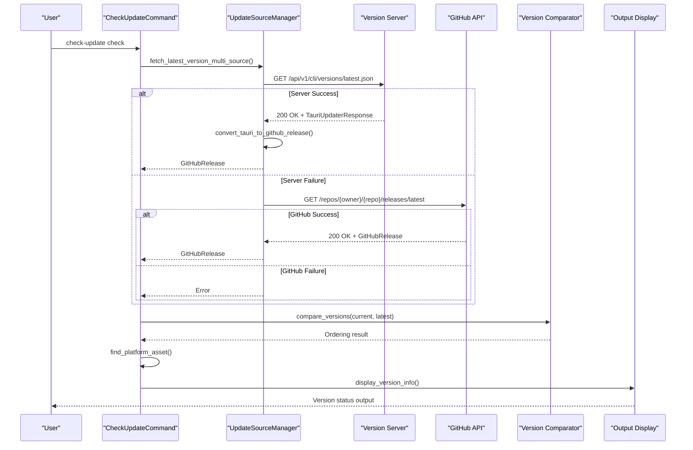
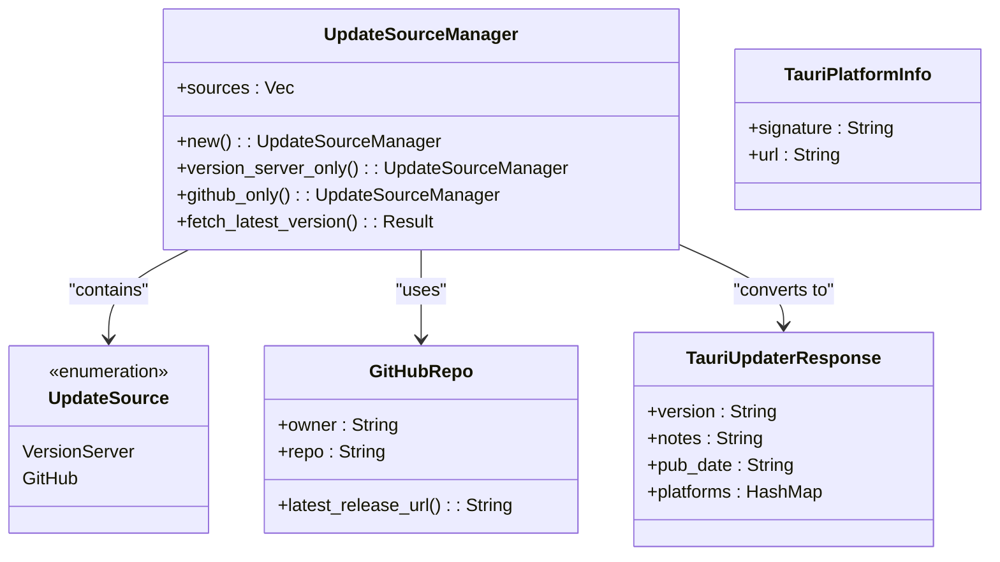
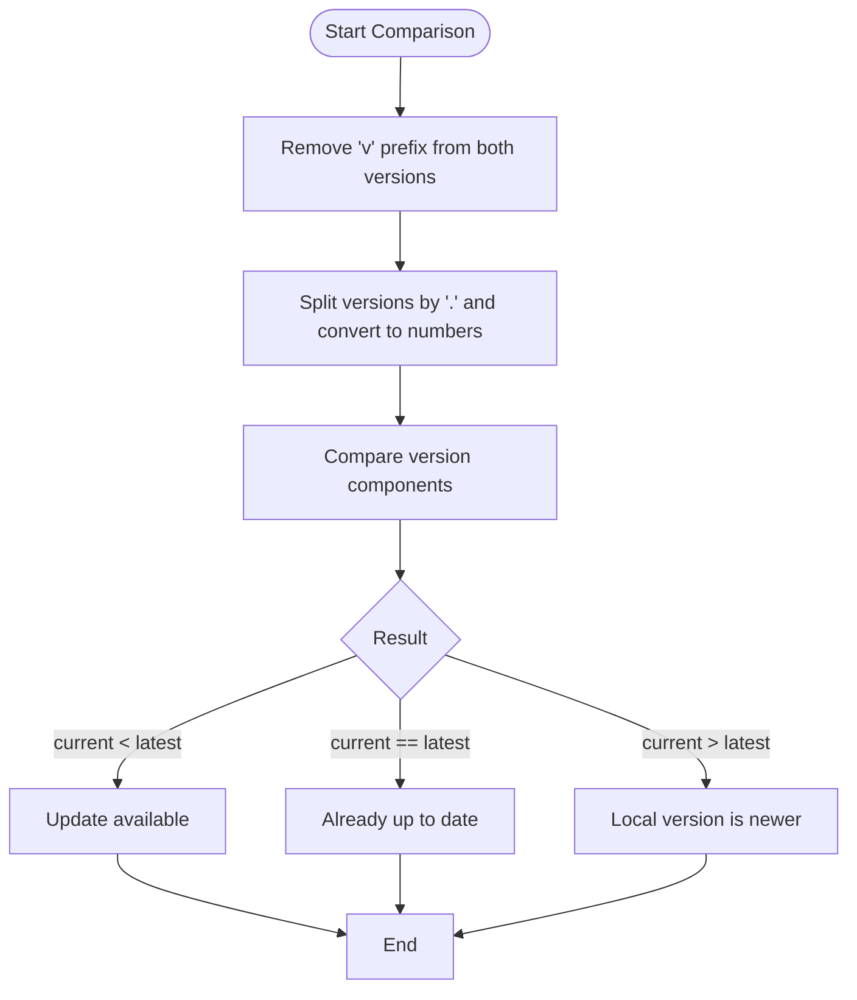
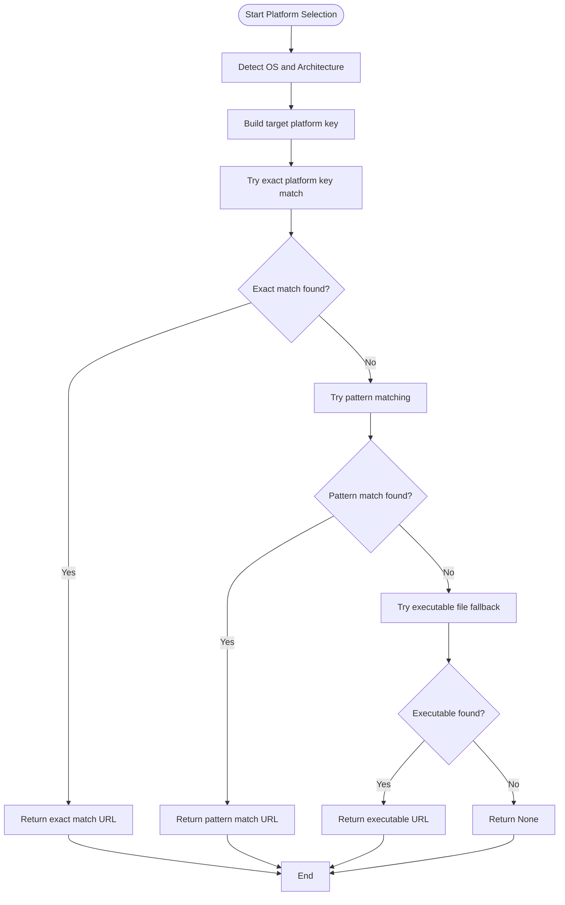
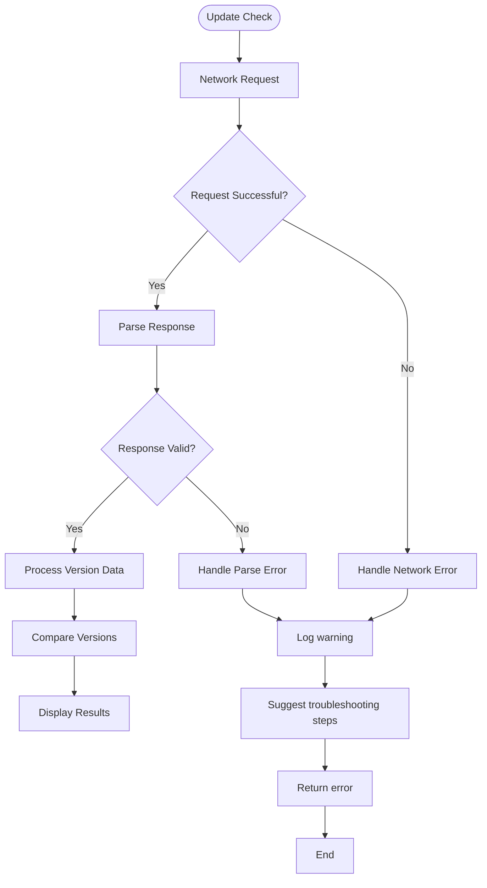
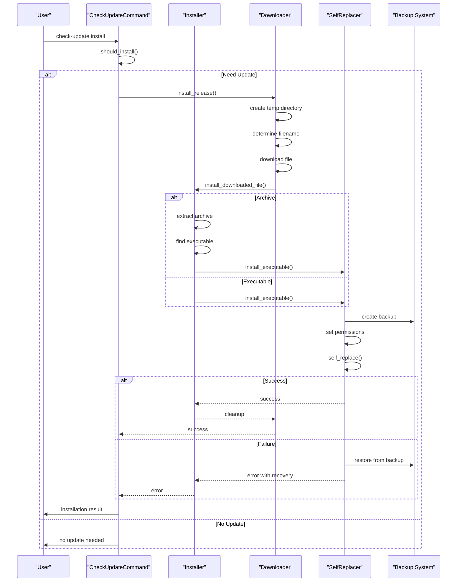

# Check Update Command

<cite>
**Referenced Files in This Document**   
- [check_update.rs](file://nuwax-cli/src/commands/check_update.rs#L1-L814)
- [cli.rs](file://nuwax-cli/src/cli.rs#L1-L221)
- [version.rs](file://client-core/src/version.rs#L1-L410)
</cite>

## Table of Contents
1. [Introduction](#introduction)
2. [Command Syntax and Options](#command-syntax-and-options)
3. [Update Checking Workflow](#update-checking-workflow)
4. [Source Management and Fallback](#source-management-and-fallback)
5. [Version Comparison Logic](#version-comparison-logic)
6. [Platform-Specific Package Selection](#platform-specific-package-selection)
7. [Error Handling and Edge Cases](#error-handling-and-edge-cases)
8. [Installation Process](#installation-process)
9. [Integration and Monitoring](#integration-and-monitoring)
10. [Troubleshooting Guide](#troubleshooting-guide)

## Introduction
The `check-update` command is a critical component of the nuwax-cli tool that enables users to query remote servers for available updates. This command implements a robust update checking system that verifies the current version against the latest available version, determines upgrade eligibility, and provides installation guidance. The implementation features multiple fallback sources, platform-specific package selection, and comprehensive error handling to ensure reliable operation across different environments.

The command serves two primary functions: checking for available updates and installing new versions. It integrates with both a dedicated version check server and GitHub's API to retrieve version information, ensuring high availability even if one service is temporarily unavailable. The system is designed to be user-friendly, providing clear output about the current version status and actionable recommendations for upgrading when necessary.

**Section sources**
- [check_update.rs](file://nuwax-cli/src/commands/check_update.rs#L1-L814)

## Command Syntax and Options
The `check-update` command supports two subcommands: `check` and `install`, each with specific options that control its behavior. The command structure is defined using the Clap framework, which provides intuitive command-line interface parsing and help generation.

```rust
#[derive(Subcommand, Debug)]
pub enum CheckUpdateCommand {
    /// 检查最新版本信息
    Check,
    /// 安装指定版本或最新版本
    Install {
        /// 指定版本号（如不指定则安装最新版本）
        #[arg(long)]
        version: Option<String>,
        /// 强制重新安装（即使当前已是最新版本）
        #[arg(long)]
        force: bool,
    },
}
```

The command can be invoked in several ways:

- `nuwax-cli check-update check`: Checks for available updates without installing
- `nuwax-cli check-update install`: Installs the latest available version
- `nuwax-cli check-update install --version v1.2.3`: Installs a specific version
- `nuwax-cli check-update install --force`: Forces reinstallation even if already on the latest version

The `version` parameter allows users to specify a particular version to install, while the `force` flag bypasses version comparison checks, enabling reinstallation of the current version or installation of an older version. This flexibility supports various use cases, from routine update checks to targeted version deployments in testing environments.

**Section sources**
- [cli.rs](file://nuwax-cli/src/cli.rs#L1-L221)

## Update Checking Workflow
The update checking process follows a systematic workflow that ensures reliable version verification and upgrade determination. The process begins when the user invokes the `check-update check` command, which triggers the `handle_check_update_command` function in the check_update module.



**Diagram sources**
- [check_update.rs](file://nuwax-cli/src/commands/check_update.rs#L1-L814)

**Section sources**
- [check_update.rs](file://nuwax-cli/src/commands/check_update.rs#L1-L814)

The workflow consists of several key steps:
1. **Source Selection**: The system attempts to retrieve version information from multiple sources in order of priority
2. **Remote Query**: HTTP requests are sent to the version check server or GitHub API to fetch the latest release information
3. **Response Processing**: The received data is parsed into a standardized GitHubRelease structure
4. **Version Comparison**: The current version is compared against the latest version to determine if an update is available
5. **Platform Matching**: The appropriate download URL is selected based on the user's operating system and architecture
6. **Result Display**: The version information is formatted and displayed to the user

This workflow ensures that users receive accurate and relevant information about available updates, including the current version, latest version, release notes, and download instructions when an update is available.

## Source Management and Fallback
The update checking system implements a sophisticated source management strategy with built-in fallback mechanisms to ensure high availability. The `UpdateSourceManager` class manages multiple update sources, prioritizing them to optimize performance and reliability.



**Diagram sources**
- [check_update.rs](file://nuwax-cli/src/commands/check_update.rs#L1-L814)

**Section sources**
- [check_update.rs](file://nuwax-cli/src/commands/check_update.rs#L1-L814)

The system uses two primary sources for version information:
1. **Version Check Server**: The primary source at `https://api-version.nuwax.com/api/v1/cli/versions/latest.json`
2. **GitHub API**: The fallback source using the GitHub Releases API

The `UpdateSourceManager` implements a failover strategy where it first attempts to retrieve version information from the dedicated version check server. If this request fails due to network issues, timeouts, or API errors, the system automatically falls back to the GitHub API. This dual-source approach increases reliability by providing redundancy in case one service becomes unavailable.

The version check server returns data in the Tauri updater format, which is then converted to a GitHub release format for consistency. This conversion process normalizes the response structure, allowing the rest of the system to work with a unified data model regardless of the source. The `convert_tauri_to_github_release` function handles this transformation, mapping Tauri's platform-specific information to GitHub's asset structure.

## Version Comparison Logic
The version comparison system implements semantic versioning principles to accurately determine whether a newer version is available. The comparison logic is designed to handle various version formats and edge cases, ensuring reliable upgrade eligibility assessment.

```rust
/// 比较版本号
pub fn compare_versions(current: &str, latest: &str) -> std::cmp::Ordering {
    // 简单的版本比较，假设版本格式为 v1.2.3 或 1.2.3
    let normalize_version = |v: &str| -> String { v.trim_start_matches('v').to_string() };

    let current_norm = normalize_version(current);
    let latest_norm = normalize_version(latest);

    // 使用语义版本比较（简化版）
    let parse_version = |v: &str| -> Vec<u32> {
        v.split('.')
            .map(|s| s.parse::<u32>().unwrap_or(0))
            .collect()
    };

    let current_parts = parse_version(&current_norm);
    let latest_parts = parse_version(&latest_norm);

    current_parts.cmp(&latest_parts)
}
```

The comparison process follows these steps:
1. **Normalization**: Removes the 'v' prefix from version strings (e.g., "v1.2.3" becomes "1.2.3")
2. **Parsing**: Splits the version string by '.' and converts each part to a numeric value
3. **Comparison**: Performs lexicographic comparison of version components

The system handles several version format variations:
- Standard semantic versioning (e.g., "1.2.3")
- Prefixed versions (e.g., "v1.2.3")
- Incomplete versions (e.g., "1.2" is treated as "1.2.0")

For the current version, the system uses the Cargo package version compiled into the binary via `env!("CARGO_PKG_VERSION")`. This ensures that the version check is always based on the actual installed version rather than potentially outdated metadata.



**Diagram sources**
- [check_update.rs](file://nuwax-cli/src/commands/check_update.rs#L1-L814)

**Section sources**
- [check_update.rs](file://nuwax-cli/src/commands/check_update.rs#L1-L814)

## Platform-Specific Package Selection
The update system includes intelligent platform detection and package selection to ensure users receive the correct binary for their operating system and architecture. The `find_platform_asset` function implements a multi-tier matching strategy to identify the appropriate download URL from the available release assets.

```rust
/// 查找适合当前平台的资源
fn find_platform_asset(assets: &[GitHubAsset]) -> Option<String> {
    use tracing::debug;

    let os = std::env::consts::OS;
    let arch = std::env::consts::ARCH;

    debug!("平台检测: os={}, arch={}", os, arch);

    // 构建目标平台键（兼容 Tauri updater 格式）
    let target_platform = match (os, arch) {
        ("windows", "x86_64") => "windows-x86_64",
        ("windows", "x86") => "windows-x86",
        ("linux", "x86_64") => "linux-x86_64",
        ("linux", "aarch64") => "linux-aarch64",
        ("macos", "x86_64") => "darwin-x86_64",
        ("macos", "aarch64") => "darwin-aarch64",
        _ => return None,
    };

    debug!("目标平台键: {}", target_platform);

    // 首先尝试精确匹配平台键
    for asset in assets {
        debug!(
            "检查资产: name={}, url={}",
            asset.name, asset.browser_download_url
        );

        // 检查是否包含平台键
        if asset.name.contains(target_platform) {
            debug!("找到精确匹配的平台资产: {}", asset.name);
            return Some(asset.browser_download_url.clone());
        }
    }
```

The platform detection system uses Rust's standard library constants (`std::env::consts::OS` and `std::env::consts::ARCH`) to determine the current environment. It supports the following platform combinations:
- Windows x86_64 (windows-x86_64)
- Windows x86 (windows-x86)
- Linux x86_64 (linux-x86_64)
- Linux aarch64 (linux-aarch64)
- macOS x86_64 (darwin-x86_64)
- macOS aarch64 (darwin-aarch64)

The selection algorithm employs a three-tier matching strategy:
1. **Exact Platform Match**: First attempts to match the standardized platform key (e.g., "windows-x86_64")
2. **Pattern Matching**: If no exact match is found, searches for common platform identifiers in the asset name or URL
3. **File Type Fallback**: As a last resort, selects the first asset that appears to be a valid executable

The pattern matching system uses different keyword sets for each platform to increase the likelihood of finding a suitable package, even if the naming convention varies. For example, on Windows, it looks for "windows", "win64", "x86_64-pc-windows", or "x64" in the asset name.



**Diagram sources**
- [check_update.rs](file://nuwax-cli/src/commands/check_update.rs#L1-L814)

**Section sources**
- [check_update.rs](file://nuwax-cli/src/commands/check_update.rs#L1-L814)

## Error Handling and Edge Cases
The update checking system implements comprehensive error handling to gracefully manage various failure scenarios and edge cases. The implementation follows a defensive programming approach, anticipating potential issues and providing meaningful feedback to users.



**Diagram sources**
- [check_update.rs](file://nuwax-cli/src/commands/check_update.rs#L1-L814)

**Section sources**
- [check_update.rs](file://nuwax-cli/src/commands/check_update.rs#L1-L814)

The system handles several key edge cases:

**Network Failures**: When the version check server or GitHub API is unreachable, the system logs a warning and attempts to use the fallback source. If all sources fail, it provides helpful troubleshooting suggestions:

```rust
info!("💡 可能的原因:");
info!("   - 网络连接问题");
info!("   - 版本检查服务器暂时不可用");
info!("   - GitHub API 暂时不可用");
info!("   - 项目尚未发布任何版本");
```

**Parsing Errors**: If the API response cannot be parsed, the system returns a descriptive error message and continues to the next source in the priority list.

**Offline Operation**: The system can operate in offline mode by catching network errors and providing appropriate feedback, allowing users to understand that the check failed due to connectivity issues rather than the absence of updates.

**Version Skew**: The comparison logic handles various version format inconsistencies, such as missing build numbers or different version string formats, by normalizing the input before comparison.

**Authentication Issues**: While not explicitly shown in the code, the implementation includes User-Agent headers that identify the client, which can help with rate limiting and server-side diagnostics.

The error handling strategy prioritizes user experience by:
1. Providing clear, actionable error messages
2. Implementing automatic fallback to alternative sources
3. Maintaining system stability even when external services fail
4. Logging detailed information for debugging while presenting simplified messages to users

## Installation Process
The installation process is tightly integrated with the update checking system, providing a seamless experience from version verification to complete installation. When a user chooses to install an update, the system follows a comprehensive workflow that ensures safe and reliable upgrades.



**Diagram sources**
- [check_update.rs](file://nuwax-cli/src/commands/check_update.rs#L1-L814)

**Section sources**
- [check_update.rs](file://nuwax-cli/src/commands/check_update.rs#L1-L814)

The installation workflow consists of several critical steps:

1. **Eligibility Check**: The `should_install` function verifies whether an update is actually needed by comparing versions, unless the `--force` flag is used.

2. **Download**: The system downloads the new version to a temporary directory, preserving the original filename from the URL.

3. **Installation Type Detection**: The installer examines the downloaded file's extension to determine the appropriate installation method:
   - `.tar.gz` or `.tgz`: Treated as compressed archives
   - `.exe` or executable files: Treated as standalone executables
   - Other formats: Rejected with an error

4. **Backup Creation**: Before replacing the current executable, the system creates a backup with a `.backup` extension to enable recovery in case of installation failure.

5. **File Replacement**: The `self_replace` library is used to atomically replace the current executable with the new version, ensuring that the process is as safe as possible.

6. **Permission Setting**: On Unix systems, the installer sets appropriate execute permissions (0755) on the new binary.

7. **Cleanup**: Temporary files are removed after successful installation.

The system implements robust error recovery by attempting to restore from the backup if the file replacement fails. This safety mechanism helps prevent the application from becoming unusable due to failed updates.

## Integration and Monitoring
The `check-update` command is designed to be easily integrated into monitoring systems and automated workflows. Its structured output and predictable behavior make it suitable for both interactive use and programmatic integration.

For monitoring integration, the command can be incorporated into health checks and status reporting systems. The clear success/failure semantics and detailed logging enable monitoring tools to track update availability and installation success rates across deployments.

The command's output is designed to be both human-readable and machine-parsable. When an update is available, the system provides:
- Current and latest version numbers
- Release notes (truncated to 500 characters)
- Download URL
- Publication timestamp
- Installation command suggestion

This information can be extracted and processed by monitoring tools to generate alerts, update dashboards, or trigger automated update procedures.

For automated integration, the command can be incorporated into CI/CD pipelines, scheduled tasks, or configuration management systems. The `--force` option enables reinstallation for testing purposes, while the ability to specify exact versions supports targeted deployments.

The system's use of standard HTTP clients with configurable timeouts and User-Agent headers ensures compatibility with network monitoring and security tools. The comprehensive error handling provides clear indications of failure modes, facilitating troubleshooting in automated environments.

## Troubleshooting Guide
When encountering issues with the `check-update` command, users should follow this systematic troubleshooting approach:

**Network Connectivity Issues**:
- Verify internet connection
- Check firewall settings that might block requests to `api-version.nuwax.com` or `api.github.com`
- Test connectivity to the endpoints using tools like curl or ping
- Ensure DNS resolution is working properly

**Failed Installations**:
- Check available disk space in the temporary directory
- Verify write permissions to the installation directory
- Ensure the current executable is not in use by another process
- Check antivirus software that might block file replacement

**Version Comparison Problems**:
- Verify the current version is correctly reported
- Check for version format inconsistencies
- Ensure the system clock is accurate (for timestamp validation)

**Platform Detection Issues**:
- Verify the operating system and architecture are correctly detected
- Check that the release assets include packages for the target platform
- Examine the asset naming conventions for compatibility with the matching patterns

The system provides detailed logging through the tracing framework, which can be enabled for diagnostic purposes. Error messages include specific suggestions for resolution, such as checking network connectivity or ensuring sufficient disk space.

**Section sources**
- [check_update.rs](file://nuwax-cli/src/commands/check_update.rs#L1-L814)