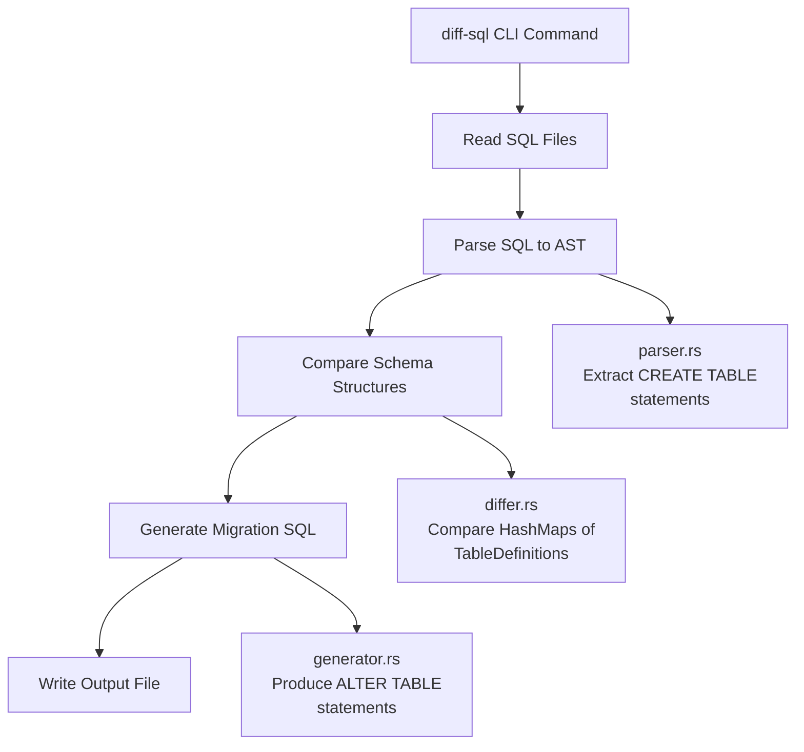
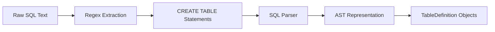
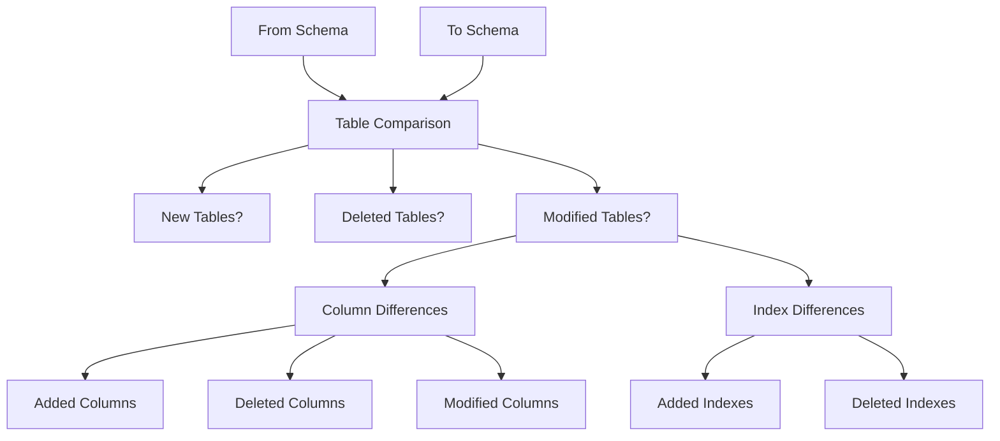
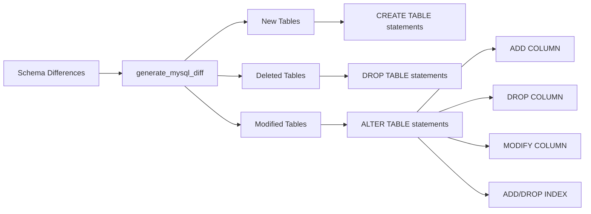
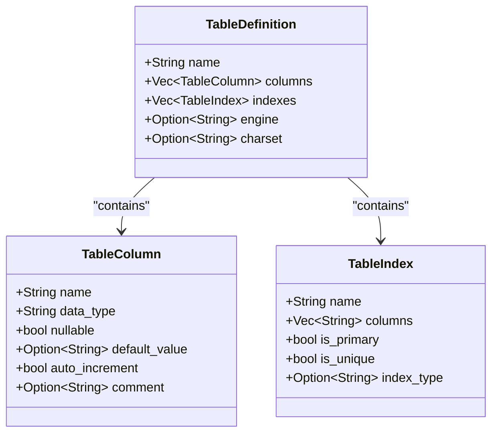

# Diff SQL Command

<cite>
**Referenced Files in This Document**   
- [diff_sql.rs](file://nuwax-cli/src/commands/diff_sql.rs)
- [differ.rs](file://client-core/src/sql_diff/differ.rs)
- [generator.rs](file://client-core/src/sql_diff/generator.rs)
- [parser.rs](file://client-core/src/sql_diff/parser.rs)
- [types.rs](file://client-core/src/sql_diff/types.rs)
- [mod.rs](file://client-core/src/sql_diff/mod.rs)
- [README.md](file://client-core/src/sql_diff/README.md)
- [diff_sql_tests.rs](file://client-core/tests/diff_sql_tests.rs)
- [old_init_mysql.sql](file://client-core/fixtures/old_init_mysql.sql)
- [new_init_mysql.sql](file://client-core/fixtures/new_init_mysql.sql)
</cite>

## Table of Contents
1. [Introduction](#introduction)
2. [Command Invocation and Options](#command-invocation-and-options)
3. [Core Architecture and Workflow](#core-architecture-and-workflow)
4. [Schema Parsing with Parser Combinators](#schema-parsing-with-parser-combinators)
5. [Structural Comparison Logic](#structural-comparison-logic)
6. [Patch SQL Generation](#patch-sql-generation)
7. [Data Structures for Schema Representation](#data-structures-for-schema-representation)
8. [Edge Case Handling](#edge-case-handling)
9. [Performance Considerations](#performance-considerations)
10. [CI/CD Integration Guidance](#cicd-integration-guidance)
11. [Best Practices for Diff Review](#best-practices-for-diff-review)

## Introduction
The **diff-sql** CLI command is a powerful tool designed to compare database schemas represented as SQL dump files and generate migration scripts that can transform one schema version into another. This functionality enables safe, automated database schema evolution by detecting structural differences between versions and producing executable SQL patches. The command serves as the user-facing interface to the `sql_diff` module in `client-core`, orchestrating the entire diff generation process from file input to output of migration scripts. It supports comparison between two SQL files representing different schema versions, with optional version metadata to enhance traceability. The system is specifically optimized for MySQL schema comparisons, handling table creation, modification, deletion, as well as column and index changes. By leveraging parser combinators and abstract syntax tree (AST) transformations, the implementation achieves semantic understanding of SQL structure rather than relying on textual comparison, resulting in more accurate and reliable migration scripts.

## Command Invocation and Options
The diff-sql command provides a straightforward interface for comparing database schema versions and generating migration scripts. Users invoke the command by specifying paths to the old and new SQL files, along with an output file for the generated diff.

**Syntax:**
```bash
diff-sql --old-sql <OLD_SQL_PATH> --new-sql <NEW_SQL_PATH> --output <OUTPUT_FILE> [--from-version <VERSION>] [--to-version <VERSION>]
```

**Key Options:**
- `--old-sql`: Path to the SQL file representing the source schema version
- `--new-sql`: Path to the SQL file representing the target schema version
- `--output`: Path where the generated migration script will be saved
- `--from-version`: Optional identifier for the source version (defaults to "unknown")
- `--to-version`: Optional identifier for the target version (defaults to "latest")

The command implementation in `nuwax-cli/src/commands/diff_sql.rs` validates input file existence, reads their contents, and delegates the core diffing logic to the `client_core::sql_diff::generate_schema_diff` function. Upon completion, it provides detailed feedback including the number of executable SQL statements generated and a preview of the migration script. The command also generates informative output even when no differences are detected, creating an empty diff file with explanatory comments. This approach ensures users receive clear feedback about the comparison result regardless of whether changes exist.

**Section sources**
- [diff_sql.rs](file://nuwax-cli/src/commands/diff_sql.rs#L0-L113)

## Core Architecture and Workflow
The diff-sql functionality follows a modular architecture with distinct components handling parsing, comparison, and generation tasks. The workflow begins with the CLI command invoking the `generate_schema_diff` function, which orchestrates the entire process.



**Diagram sources**
- [diff_sql.rs](file://nuwax-cli/src/commands/diff_sql.rs#L0-L113)
- [generator.rs](file://client-core/src/sql_diff/generator.rs#L0-L194)
- [differ.rs](file://client-core/src/sql_diff/differ.rs#L0-L199)
- [parser.rs](file://client-core/src/sql_diff/parser.rs#L0-L199)

**Section sources**
- [mod.rs](file://client-core/src/sql_diff/mod.rs#L0-L10)
- [README.md](file://client-core/src/sql_diff/README.md#L0-L76)

The process starts with reading the content of both SQL files, followed by parsing them into structured representations using the SQL parser. The parsed schemas are then compared to identify differences at the table, column, and index levels. Finally, the detected differences are transformed into executable SQL migration statements. The architecture is designed with clear separation of concerns, where each component has a single responsibility: parsing (extracting structure from text), differ (comparing structures), and generator (producing SQL from differences). This modular design enhances testability and maintainability, allowing each component to be developed and tested independently.

## Schema Parsing with Parser Combinators
The SQL parsing component uses a hybrid approach combining regex-based statement extraction with formal SQL parsing to transform raw SQL text into structured data models. This two-stage process efficiently handles large SQL dump files by first isolating CREATE TABLE statements using regular expressions, then parsing each statement with a proper SQL parser.



**Diagram sources**
- [parser.rs](file://client-core/src/sql_diff/parser.rs#L0-L199)

The initial regex-based extraction (`extract_create_table_statements_with_regex`) identifies the boundaries of CREATE TABLE statements, handling nested parentheses and string literals correctly. This preprocessing step significantly reduces the parsing workload by focusing only on relevant statements. The extracted statements are then processed by the `sqlparser` crate with MySQL dialect support, which converts the SQL text into an Abstract Syntax Tree (AST). The AST is traversed to extract table metadata including column definitions, constraints, and indexes, which are transformed into the domain-specific `TableDefinition` data structure. This approach balances performance and accuracy, avoiding the overhead of parsing irrelevant SQL statements (like INSERTs or configuration commands) while maintaining semantic understanding of the schema structure.

**Section sources**
- [parser.rs](file://client-core/src/sql_diff/parser.rs#L0-L199)

## Structural Comparison Logic
The structural comparison logic in the differ component analyzes two parsed schema representations to identify additions, deletions, and modifications at multiple levels of granularity. The comparison operates on HashMaps of `TableDefinition` objects, enabling efficient lookup and comparison operations.



**Diagram sources**
- [differ.rs](file://client-core/src/sql_diff/differ.rs#L0-L199)

The comparison algorithm follows a systematic approach:
1. **Table-level comparison**: Identifies tables present in the target schema but not in the source (new tables) and vice versa (deleted tables)
2. **Column-level comparison**: For tables present in both schemas, compares columns to detect additions, deletions, and modifications based on name, data type, nullability, default values, and other attributes
3. **Index-level comparison**: Analyzes primary keys, unique constraints, and regular indexes to identify index changes

The implementation uses `HashMap` lookups for O(1) table name resolution and structural equality (`==`) for comparing column definitions. When a column exists in both schemas but with different properties, the system generates a MODIFY COLUMN statement with the new definition. This approach ensures that only meaningful structural differences trigger migration operations, ignoring cosmetic changes like comment modifications or statement formatting.

**Section sources**
- [differ.rs](file://client-core/src/sql_diff/differ.rs#L0-L199)

## Patch SQL Generation
The SQL generation component transforms detected schema differences into executable migration scripts using template-based SQL construction. The generator produces semantically correct MySQL ALTER TABLE statements that can safely evolve a database from the source schema to the target schema.



**Diagram sources**
- [generator.rs](file://client-core/src/sql_diff/generator.rs#L0-L194)

The generation process follows these principles:
- **Idempotency**: Statements like `DROP TABLE IF EXISTS` and `ADD COLUMN` are constructed to be safe for repeated execution
- **Comprehensive coverage**: Handles all major schema modification types including table creation/deletion, column operations, and index management
- **Descriptive annotations**: Generated scripts include comments identifying the nature of each change (e.g., "-- 新增表: users")
- **Temporal metadata**: Scripts are annotated with generation timestamps for audit purposes

The `generate_create_table_sql` function reconstructs complete CREATE TABLE statements from `TableDefinition` objects, while specialized functions like `generate_column_sql` and `generate_index_sql` handle component-level SQL generation. The resulting migration script is a sequence of ALTER TABLE operations that can be executed in order to achieve the target schema. When no meaningful differences are detected (only comments or formatting changes), the generator returns an empty string, signaling that no migration is necessary.

**Section sources**
- [generator.rs](file://client-core/src/sql_diff/generator.rs#L0-L194)

## Data Structures for Schema Representation
The SQL diff functionality relies on a set of domain-specific data structures that represent database schema elements in a way that facilitates comparison and SQL generation. These structures abstract away SQL syntax details while preserving semantic meaning.



**Diagram sources**
- [types.rs](file://client-core/src/sql_diff/types.rs#L0-L30)

The core data structures include:
- **TableDefinition**: Represents a database table with its name, columns, indexes, and storage options
- **TableColumn**: Captures column metadata including name, data type, nullability, default values, auto-increment status, and comments
- **TableIndex**: Describes indexes with their name, constituent columns, and properties (primary, unique)

These structures implement `PartialEq` for direct comparison, enabling the differ component to detect changes by comparing object instances. The use of `Option` types for non-essential attributes (like charset or comment) accommodates schema variations while maintaining type safety. This object-oriented representation decouples the diff logic from SQL syntax, allowing the system to focus on semantic differences rather than textual variations.

**Section sources**
- [types.rs](file://client-core/src/sql_diff/types.rs#L0-L30)

## Edge Case Handling
The diff-sql implementation includes robust handling of edge cases and potential issues that commonly arise in database schema evolution. The system employs defensive programming practices to ensure reliability even with imperfect input.

**Key edge case handling strategies:**
- **Empty or identical schemas**: When comparing identical SQL content, the system detects this early and returns an empty diff with an appropriate description, avoiding unnecessary processing
- **Missing input files**: Validates file existence before processing and provides clear error messages when files are not found
- **Syntax errors**: Uses proper error handling with `Result` types and returns descriptive error messages when SQL parsing fails
- **Non-schema SQL statements**: The parser focuses only on CREATE TABLE statements, ignoring other SQL commands that don't affect schema structure
- **Case sensitivity**: Handles identifier case sensitivity appropriately for MySQL environments

The system also manages ambiguous scenarios such as column renames, which are detected as a deletion followed by an addition rather than a rename operation. This conservative approach ensures that migration scripts are predictable and reversible. When no executable SQL statements are generated (only comments or whitespace differences), the system creates an empty migration file with explanatory comments, providing an audit trail of the comparison activity.

**Section sources**
- [diff_sql.rs](file://nuwax-cli/src/commands/diff_sql.rs#L0-L113)
- [generator.rs](file://client-core/src/sql_diff/generator.rs#L0-L194)
- [diff_sql_tests.rs](file://client-core/tests/diff_sql_tests.rs#L0-L199)

## Performance Considerations
The diff-sql implementation incorporates several performance optimizations to handle large database dump files efficiently. The system is designed to minimize memory usage and processing time while maintaining accuracy.

**Performance optimization strategies:**
- **Incremental parsing**: Uses regex-based statement extraction to process only CREATE TABLE statements, avoiding parsing of data-loading SQL
- **Efficient data structures**: Employs HashMaps for O(1) table name lookups during comparison
- **Early termination**: Detects identical content before parsing and returns immediately
- **Stream-like processing**: Processes SQL files as text streams rather than loading entire files into memory at once

For very large schemas, the primary performance bottleneck is the SQL parsing phase, particularly when using the formal SQL parser on complex table definitions. The regex preprocessing step significantly reduces this overhead by filtering out irrelevant statements. The comparison algorithm has O(n+m) complexity where n and m are the number of tables in each schema, making it scalable for databases with hundreds of tables. Memory usage is proportional to the size of the parsed schema representations, with each table definition stored once in memory for comparison.

**Section sources**
- [parser.rs](file://client-core/src/sql_diff/parser.rs#L0-L199)
- [differ.rs](file://client-core/src/sql_diff/differ.rs#L0-L199)

## CI/CD Integration Guidance
The diff-sql command can be effectively integrated into CI/CD pipelines to automate database schema evolution as part of application deployment workflows. This integration enables safe, auditable, and repeatable database migrations.

**Recommended CI/CD integration pattern:**
```yaml
# Example GitHub Actions workflow
name: Database Schema Migration
on:
  push:
    branches: [main]
jobs:
  generate-migration:
    runs-on: ubuntu-latest
    steps:
      - name: Checkout code
        uses: actions/checkout@v3
        
      - name: Extract previous schema
        run: |
          # Extract schema from previous version/tag
          git checkout v$(get_previous_version)
          cp path/to/schema.sql schema_previous.sql
          
      - name: Generate migration script
        run: |
          # Compare with current schema
          diff-sql --old-sql schema_previous.sql \
                  --new-sql path/to/schema.sql \
                  --output migrations/$(date +%Y%m%d)_migration.sql \
                  --from-version v$(get_previous_version) \
                  --to-version $(get_current_version)
                  
      - name: Validate migration
        run: |
          # Run syntax validation and dry-run tests
          validate-sql migrations/*.sql
          
      - name: Commit migration
        run: |
          git config user.name "CI Bot"
          git add migrations/
          git commit -m "Add auto-generated migration script"
```

Best practices for CI/CD integration include:
- **Version tagging**: Use consistent version identifiers to track schema evolution
- **Automated testing**: Validate generated migrations in a test environment before production deployment
- **Backup procedures**: Ensure database backups are created before applying migrations
- **Rollback planning**: Design migrations to be reversible or provide corresponding rollback scripts
- **Change review**: Incorporate generated migrations into code review processes

The system's output format, with descriptive comments and version metadata, facilitates auditability and makes migration scripts self-documenting.

**Section sources**
- [spec/cli-ui.md](file://spec/cli-ui.md#L2958-L3082)
- [spec/Design.md](file://spec/Design.md#L231-L269)

## Best Practices for Diff Review
Before applying generated migration scripts, thorough review is essential to ensure data safety and migration correctness. The following best practices help identify potential issues and verify that the generated diff aligns with intended schema changes.

**Review checklist:**
1. **Verify change intent**: Confirm that all detected changes match the expected schema evolution
2. **Check data loss risks**: Identify operations that might cause data loss (e.g., DROP COLUMN, DROP TABLE)
3. **Validate constraints**: Ensure that new constraints (UNIQUE, NOT NULL) won't conflict with existing data
4. **Review index changes**: Verify that index modifications align with query performance requirements
5. **Assess migration order**: For complex changes, ensure that operations are ordered correctly (e.g., adding a column before adding a constraint that references it)

The system supports safe migration practices by:
- Generating idempotent statements where possible
- Including descriptive comments that explain each change
- Providing a count of executable statements for quick assessment
- Creating empty migration files when no changes are detected, maintaining consistency in the migration history

Always test migrations on a copy of production data before applying them to live databases, and ensure that appropriate backups are available.

**Section sources**
- [diff_sql.rs](file://nuwax-cli/src/commands/diff_sql.rs#L0-L113)
- [diff_sql_tests.rs](file://client-core/tests/diff_sql_tests.rs#L0-L199)