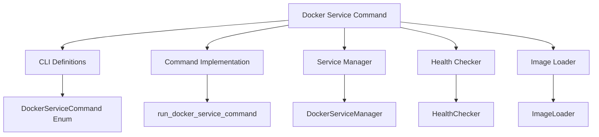
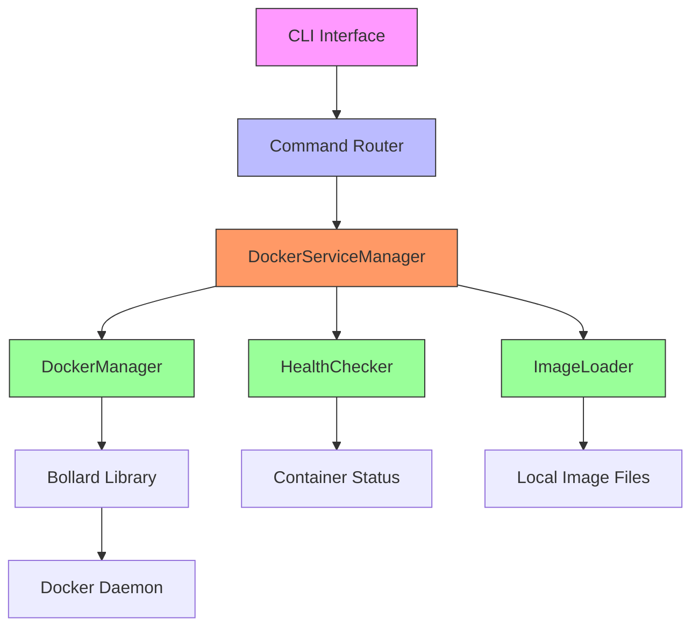
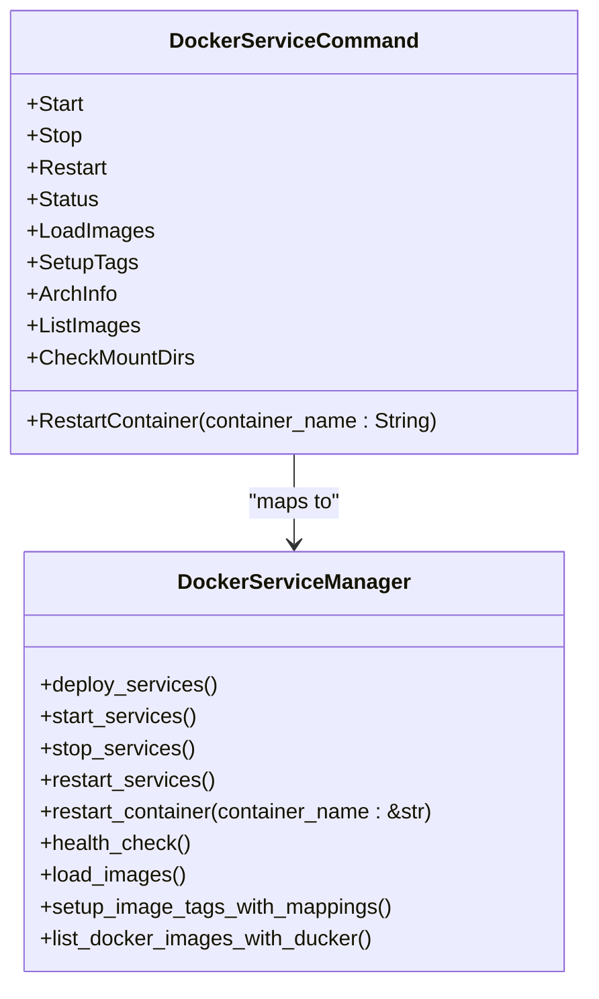
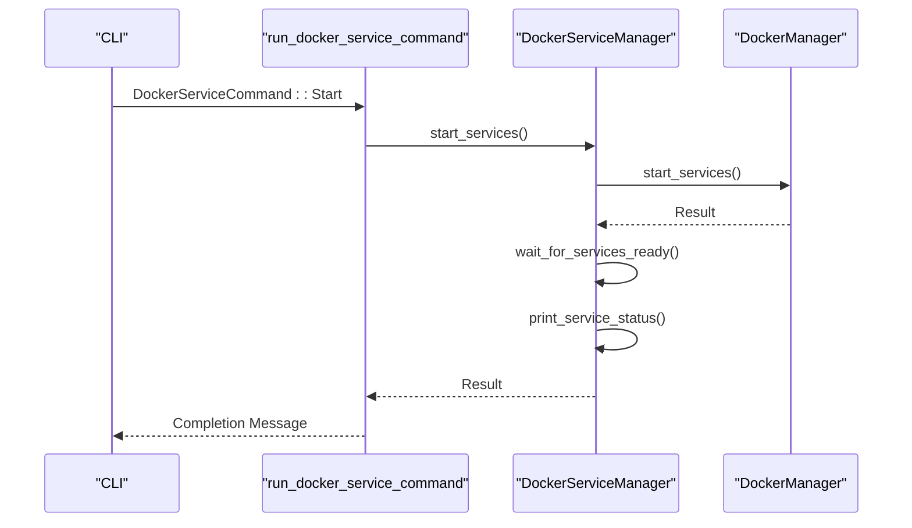
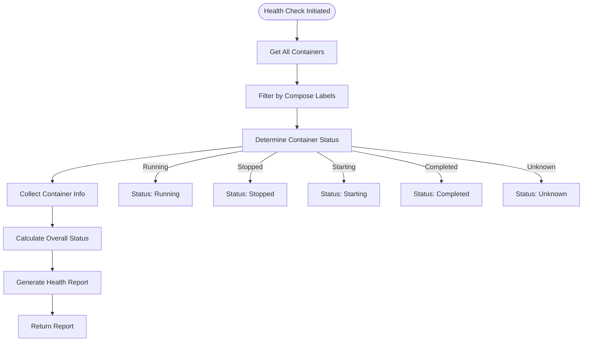
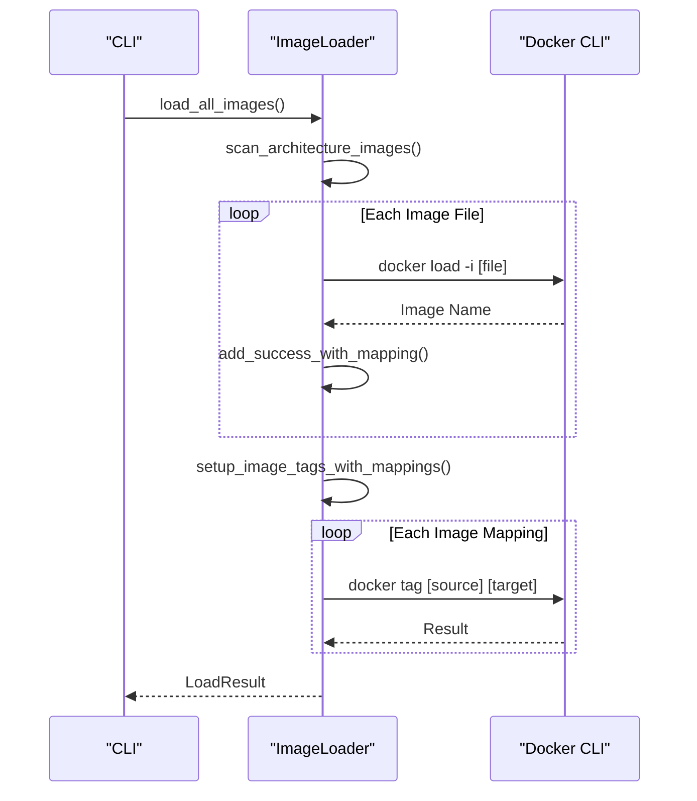
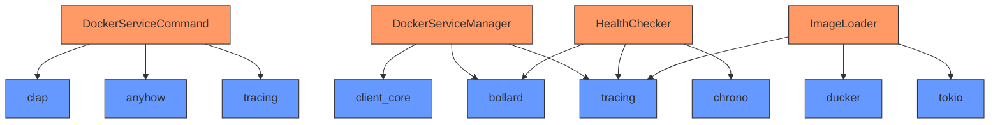

# Docker Service Command

<cite>
**Referenced Files in This Document**   
- [cli.rs](file://nuwax-cli/src/cli.rs#L1-L220)
- [docker_service.rs](file://nuwax-cli/src/commands/docker_service.rs#L1-L535)
- [manager.rs](file://nuwax-cli/src/docker_service/manager.rs#L1-L799)
- [health_check.rs](file://nuwax-cli/src/docker_service/health_check.rs#L1-L799)
- [image_loader.rs](file://nuwax-cli/src/docker_service/image_loader.rs#L1-L627)
</cite>

## Table of Contents
1. [Introduction](#introduction)
2. [Project Structure](#project-structure)
3. [Core Components](#core-components)
4. [Architecture Overview](#architecture-overview)
5. [Detailed Component Analysis](#detailed-component-analysis)
6. [Dependency Analysis](#dependency-analysis)
7. [Performance Considerations](#performance-considerations)
8. [Troubleshooting Guide](#troubleshooting-guide)
9. [Conclusion](#conclusion)

## Introduction
The Docker Service Command module provides a comprehensive CLI interface for managing Docker-based services within the Duck Client application. This documentation details the implementation of low-level Docker service operations including start, stop, restart, and inspect functionalities. The system leverages Bollard for container lifecycle control, implements health check polling mechanisms, and supports log streaming capabilities. Special attention is given to graceful shutdown procedures, signal handling, and race condition mitigation during concurrent operations. The documentation also addresses edge cases such as orphaned containers or daemon connectivity issues, providing operational best practices for service maintenance.

## Project Structure
The Docker service functionality is organized across multiple modules within the nuwax-cli package. The core command definitions are located in the CLI module, while the implementation is distributed across specialized components for service management, health checking, and image loading. This modular approach enables separation of concerns and promotes code reusability.

**Diagram sources**
- [cli.rs](file://nuwax-cli/src/cli.rs#L1-L220)
- [docker_service.rs](file://nuwax-cli/src/commands/docker_service.rs#L1-L535)
- [manager.rs](file://nuwax-cli/src/docker_service/manager.rs#L1-L799)
- [health_check.rs](file://nuwax-cli/src/docker_service/health_check.rs#L1-L799)
- [image_loader.rs](file://nuwax-cli/src/docker_service/image_loader.rs#L1-L627)

**Section sources**
- [cli.rs](file://nuwax-cli/src/cli.rs#L1-L220)
- [docker_service.rs](file://nuwax-cli/src/commands/docker_service.rs#L1-L535)

## Core Components
The Docker service implementation consists of several key components that work together to provide comprehensive container management capabilities. The system is built around a command pattern that routes CLI requests to appropriate handlers, with each operation implemented as a separate function. The core functionality includes service lifecycle management, health status monitoring, image loading, and tag management.

**Section sources**
- [docker_service.rs](file://nuwax-cli/src/commands/docker_service.rs#L1-L535)
- [manager.rs](file://nuwax-cli/src/docker_service/manager.rs#L1-L799)

## Architecture Overview
The Docker service command architecture follows a layered approach with clear separation between command parsing, business logic, and low-level Docker interactions. The system uses Bollard as the primary interface to the Docker daemon, providing asynchronous operations for container management. Health checking is implemented through a dedicated component that monitors container status and provides detailed reports.

**Diagram sources**
- [docker_service.rs](file://nuwax-cli/src/commands/docker_service.rs#L1-L535)
- [manager.rs](file://nuwax-cli/src/docker_service/manager.rs#L1-L799)
- [health_check.rs](file://nuwax-cli/src/docker_service/health_check.rs#L1-L799)
- [image_loader.rs](file://nuwax-cli/src/docker_service/image_loader.rs#L1-L627)

## Detailed Component Analysis

### Docker Service Command Analysis
The DockerServiceCommand enum defines all available operations for Docker service management. Each variant corresponds to a specific action that can be performed on the Docker services.

**Diagram sources**
- [cli.rs](file://nuwax-cli/src/cli.rs#L1-L220)
- [manager.rs](file://nuwax-cli/src/docker_service/manager.rs#L1-L799)

**Section sources**
- [cli.rs](file://nuwax-cli/src/cli.rs#L1-L220)
- [manager.rs](file://nuwax-cli/src/docker_service/manager.rs#L1-L799)

### Service Management Analysis
The DockerServiceManager class provides the primary interface for Docker service operations. It encapsulates the logic for starting, stopping, and restarting services, as well as handling health checks and image management.

**Diagram sources**
- [docker_service.rs](file://nuwax-cli/src/commands/docker_service.rs#L1-L535)
- [manager.rs](file://nuwax-cli/src/docker_service/manager.rs#L1-L799)

**Section sources**
- [docker_service.rs](file://nuwax-cli/src/commands/docker_service.rs#L1-L535)
- [manager.rs](file://nuwax-cli/src/docker_service/manager.rs#L1-L799)

### Health Check Analysis
The health checking system provides comprehensive monitoring of Docker container status. It uses Docker Compose labels to identify services and tracks their state, providing detailed reports on service health.

**Diagram sources**
- [health_check.rs](file://nuwax-cli/src/docker_service/health_check.rs#L1-L799)

**Section sources**
- [health_check.rs](file://nuwax-cli/src/docker_service/health_check.rs#L1-L799)

### Image Management Analysis
The image loading and tag management system handles the loading of Docker images from local files and the creation of appropriate tags for service deployment.

**Diagram sources**
- [image_loader.rs](file://nuwax-cli/src/docker_service/image_loader.rs#L1-L627)

**Section sources**
- [image_loader.rs](file://nuwax-cli/src/docker_service/image_loader.rs#L1-L627)

## Dependency Analysis
The Docker service command implementation has a well-defined dependency structure that promotes modularity and testability. The system relies on several external crates for core functionality.

**Diagram sources**
- [cli.rs](file://nuwax-cli/src/cli.rs#L1-L220)
- [manager.rs](file://nuwax-cli/src/docker_service/manager.rs#L1-L799)
- [health_check.rs](file://nuwax-cli/src/docker_service/health_check.rs#L1-L799)
- [image_loader.rs](file://nuwax-cli/src/docker_service/image_loader.rs#L1-L627)

**Section sources**
- [cli.rs](file://nuwax-cli/src/cli.rs#L1-L220)
- [manager.rs](file://nuwax-cli/src/docker_service/manager.rs#L1-L799)
- [health_check.rs](file://nuwax-cli/src/docker_service/health_check.rs#L1-L799)
- [image_loader.rs](file://nuwax-cli/src/docker_service/image_loader.rs#L1-L627)

## Performance Considerations
The Docker service command implementation includes several performance optimizations to ensure responsive operation. The system uses asynchronous operations throughout to prevent blocking the main thread during Docker interactions. Health checks are optimized to minimize API calls by batching container status queries. Image loading operations are performed sequentially with progress reporting to provide feedback during potentially long-running operations.

The system also implements intelligent caching of Docker Compose service configurations to avoid repeated parsing of the compose file. Port conflict detection is performed efficiently using a single pass through the compose configuration. The health checker uses Docker labels for precise service identification, avoiding expensive string matching operations.

## Troubleshooting Guide
The Docker service command includes comprehensive error handling and diagnostic capabilities. When operations fail, the system provides detailed error messages and troubleshooting suggestions based on the specific container and error type.

For common issues such as architecture mismatches (amd64 vs arm64), the system provides specific recommendations for resolution. Port conflicts are detected proactively with suggestions for resolution. Permission issues with startup scripts are identified and guidance is provided for fixing file permissions.

The health checker provides detailed status reports that include container names, images, ports, and current status. Failed containers are highlighted with specific troubleshooting advice based on the container type (e.g., database, frontend, backend).

**Section sources**
- [docker_service.rs](file://nuwax-cli/src/commands/docker_service.rs#L1-L535)
- [manager.rs](file://nuwax-cli/src/docker_service/manager.rs#L1-L799)
- [health_check.rs](file://nuwax-cli/src/docker_service/health_check.rs#L1-L799)

## Conclusion
The Docker Service Command implementation provides a robust and comprehensive interface for managing Docker-based services within the Duck Client application. The system's modular architecture, comprehensive error handling, and detailed diagnostic capabilities make it well-suited for both development and production environments. The use of asynchronous operations ensures responsive performance, while the detailed health checking system provides valuable insights into service status. The implementation demonstrates best practices in Rust application design, with clear separation of concerns and thoughtful error handling throughout.