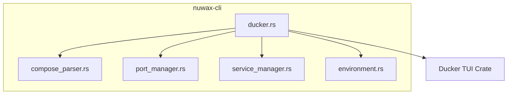
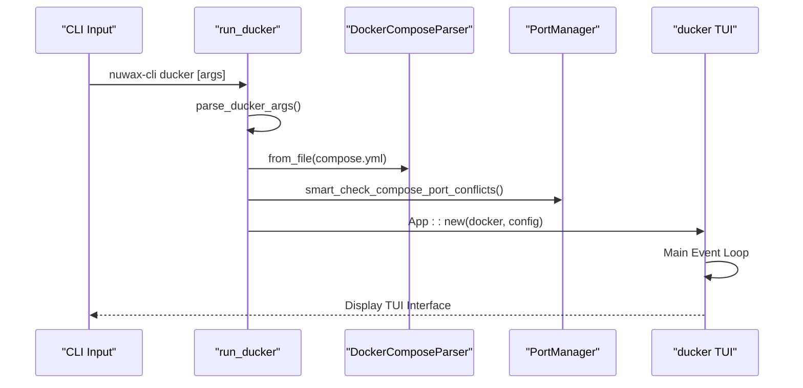
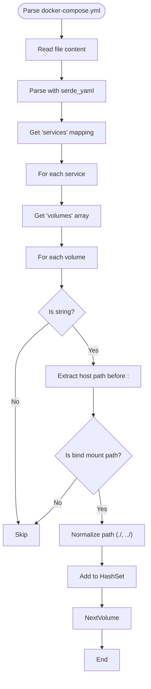
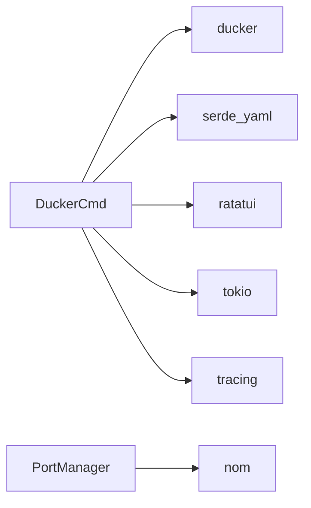

# Ducker Command

<cite>
**Referenced Files in This Document**   
- [ducker.rs](file://nuwax-cli/src/commands/ducker.rs)
- [compose_parser.rs](file://nuwax-cli/src/docker_service/compose_parser.rs)
- [port_manager.rs](file://nuwax-cli/src/docker_service/port_manager.rs)
- [service_manager.rs](file://nuwax-cli/src/docker_service/service_manager.rs)
- [environment.rs](file://nuwax-cli/src/docker_service/environment.rs)
</cite>

## Table of Contents
1. [Introduction](#introduction)
2. [Project Structure](#project-structure)
3. [Core Components](#core-components)
4. [Architecture Overview](#architecture-overview)
5. [Detailed Component Analysis](#detailed-component-analysis)
6. [Dependency Analysis](#dependency-analysis)
7. [Performance Considerations](#performance-considerations)
8. [Troubleshooting Guide](#troubleshooting-guide)
9. [Conclusion](#conclusion)

## Introduction
The **Ducker Command** is a CLI tool integrated into the `nuwax-cli` application that provides a terminal-based user interface (TUI) for managing Docker containers, images, volumes, and networks. It enables users to interact with Docker services through an intuitive, k9s-like interface without requiring a separate installation. The command supports loading, validating, and deploying `docker-compose.yml` files, orchestrating container lifecycles, and handling environment-specific configurations. This document details its implementation, integration with parsing and management modules, validation logic, and troubleshooting guidance.

## Project Structure
The `ducker` command is part of the `nuwax-cli` module within the larger `duck_client` repository. It leverages several submodules under `nuwax-cli/src/docker_service/` to handle compose parsing, port management, service orchestration, and environment configuration. The TUI interface is powered by the external `ducker` crate, which is directly integrated into the CLI.



**Diagram sources**
- [ducker.rs](file://nuwax-cli/src/commands/ducker.rs)
- [compose_parser.rs](file://nuwax-cli/src/docker_service/compose_parser.rs)
- [port_manager.rs](file://nuwax-cli/src/docker_service/port_manager.rs)
- [service_manager.rs](file://nuwax-cli/src/docker_service/service_manager.rs)
- [environment.rs](file://nuwax-cli/src/docker_service/environment.rs)

## Core Components
The core functionality of the `ducker` command revolves around launching a TUI interface that allows users to manage Docker resources. It parses command-line arguments, initializes configuration, and connects to the Docker daemon. The command integrates with the `compose_parser` to extract volume and port mappings from `docker-compose.yml`, uses `port_manager` for conflict detection, and relies on placeholder modules for future service lifecycle management.

**Section sources**
- [ducker.rs](file://nuwax-cli/src/commands/ducker.rs)
- [compose_parser.rs](file://nuwax-cli/src/docker_service/compose_parser.rs)
- [port_manager.rs](file://nuwax-cli/src/docker_service/port_manager.rs)

## Architecture Overview
The `ducker` command acts as a bridge between the CLI and the `ducker` TUI library. Upon invocation, it parses user arguments, configures Docker connection settings, and launches the TUI application loop. It delegates compose file parsing to `DockerComposeParser`, port validation to `PortManager`, and service orchestration to `ServiceManager`. Environment variables from `.env` files are loaded to support dynamic configuration.



**Diagram sources**
- [ducker.rs](file://nuwax-cli/src/commands/ducker.rs#L20-L212)
- [compose_parser.rs](file://nuwax-cli/src/docker_service/compose_parser.rs#L10-L271)
- [port_manager.rs](file://nuwax-cli/src/docker_service/port_manager.rs#L300-L886)

## Detailed Component Analysis

### Ducker Command Implementation
The `run_ducker` function is the entry point for the command. It processes CLI arguments such as `--docker-path`, `--docker-host`, and `--log-path`, then initializes the TUI environment using the `ducker` crate. The function integrates logging via `tracing`, error handling via `color_eyre`, and terminal management via `ratatui`.

```rust
pub async fn run_ducker(args: Vec<String>) -> Result<()> {
    info!("启动ducker Docker TUI工具...");
    let ducker_args = parse_ducker_args(args)?;
    run_ducker_tui(ducker_args).await.map_err(|e| {
        error!("ducker执行失败: {}", e);
        anyhow::anyhow!(format!("ducker执行失败: {e}"))
    })
}
```

**Section sources**
- [ducker.rs](file://nuwax-cli/src/commands/ducker.rs#L20-L212)

### Compose Parser Integration
The `DockerComposeParser` extracts bind mount directories and volume mappings from `docker-compose.yml`. It normalizes paths, distinguishes bind mounts from named volumes, and handles both Unix and Windows path formats. The parser uses `serde_yaml` to load the YAML structure and recursively traverse the `services.volumes` section.



**Diagram sources**
- [compose_parser.rs](file://nuwax-cli/src/docker_service/compose_parser.rs#L10-L271)

### Port Conflict Validation
The `PortManager` performs intelligent port conflict detection by checking if a port is already in use and whether the process using it belongs to the same Docker Compose project. It parses port mappings from the compose file, expands environment variables (e.g., `${PORT:-8080}`), and uses `TcpListener::bind()` to test availability.

```rust
pub async fn smart_check_compose_port_conflicts(
    &mut self,
    compose_file_path: &Path,
) -> DockerServiceResult<PortConflictReport>
```

It differentiates between conflicts caused by unrelated processes (real conflicts) and those from existing compose services (expected). This prevents false positives when restarting services.

**Section sources**
- [port_manager.rs](file://nuwax-cli/src/docker_service/port_manager.rs#L496-L530)

### Service and Environment Management
The `ServiceManager` and `EnvironmentChecker` are currently placeholder modules with minimal implementation. They are designed to be extended for managing service lifecycles (start, stop, restart) and validating Docker environment prerequisites.

```rust
pub struct ServiceManager;
pub struct EnvironmentChecker;
```

These modules follow a modular design pattern, allowing future expansion without affecting the core `ducker` command.

**Section sources**
- [service_manager.rs](file://nuwax-cli/src/docker_service/service_manager.rs)
- [environment.rs](file://nuwax-cli/src/docker_service/environment.rs)

## Dependency Analysis
The `ducker` command depends on several internal and external crates:
- `ducker`: Provides the TUI interface for Docker management.
- `serde_yaml`: Parses `docker-compose.yml` files.
- `ratatui`: Renders the terminal UI.
- `tokio`: Enables async operations.
- `tracing`: Handles logging.
- `nom`: Parses environment variable expressions in port definitions.



**Diagram sources**
- [ducker.rs](file://nuwax-cli/src/commands/ducker.rs)
- [port_manager.rs](file://nuwax-cli/src/docker_service/port_manager.rs)

## Performance Considerations
The `ducker` command is optimized for responsiveness:
- **Lazy loading**: Environment variables are loaded only when needed.
- **Non-blocking I/O**: All Docker interactions are async.
- **Caching**: Port and service states are cached during the TUI session.
- **Efficient parsing**: Uses `serde_yaml` and `nom` for fast YAML and string parsing.

However, performance may degrade with very large compose files due to full in-memory parsing.

## Troubleshooting Guide
Common issues and solutions:

**Port Conflicts**
- **Symptom**: "端口被其他进程占用"
- **Solution**: Use `lsof -i :<port>` to identify the process and stop it, or modify the port in `docker-compose.yml`.

**Missing .env File**
- **Symptom**: Environment variables not expanded
- **Solution**: Ensure `.env` file exists in the same directory as `docker-compose.yml`.

**Invalid Volume Paths**
- **Symptom**: Bind mounts not created
- **Solution**: Use absolute or relative paths (e.g., `./data:/app/data`), not named volumes.

**Docker Connection Failure**
- **Symptom**: "failed to create docker connection"
- **Solution**: Verify Docker daemon is running and `--docker-path` or `--docker-host` is correctly set.

**Section sources**
- [ducker.rs](file://nuwax-cli/src/commands/ducker.rs)
- [port_manager.rs](file://nuwax-cli/src/docker_service/port_manager.rs)
- [compose_parser.rs](file://nuwax-cli/src/docker_service/compose_parser.rs)

## Conclusion
The `ducker` command provides a powerful, integrated TUI for Docker management within the `nuwax-cli` toolset. It supports full compose file parsing, intelligent port conflict detection, and environment variable resolution. While service lifecycle management is currently minimal, the architecture is extensible. Future work should focus on enhancing `ServiceManager` and adding schema validation for compose files.