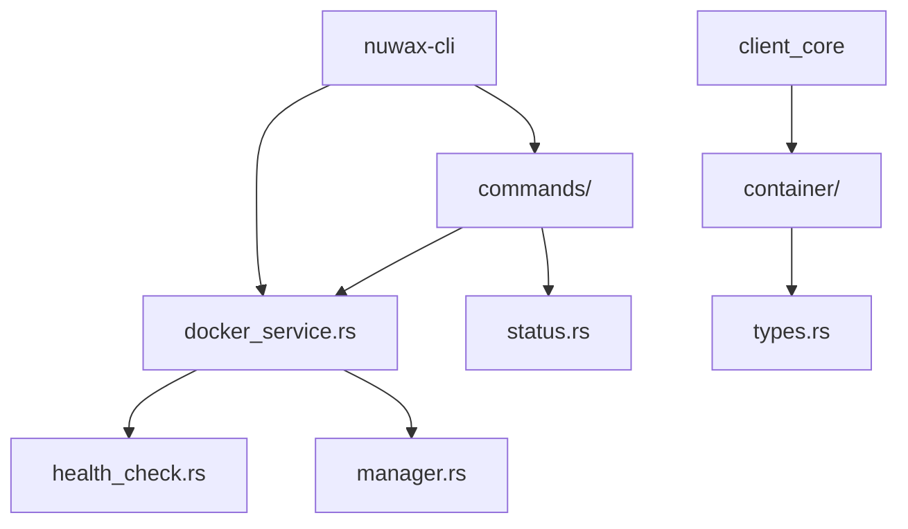
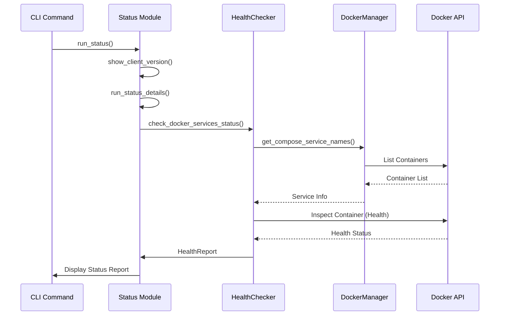
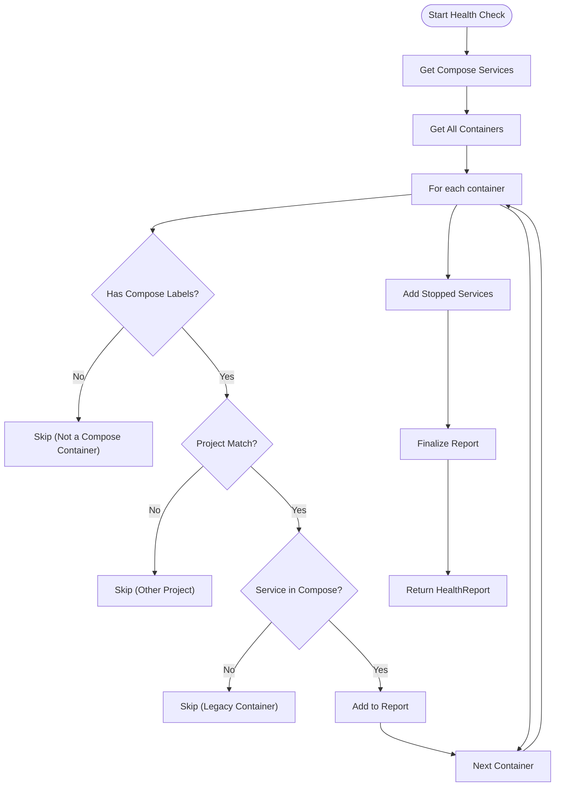
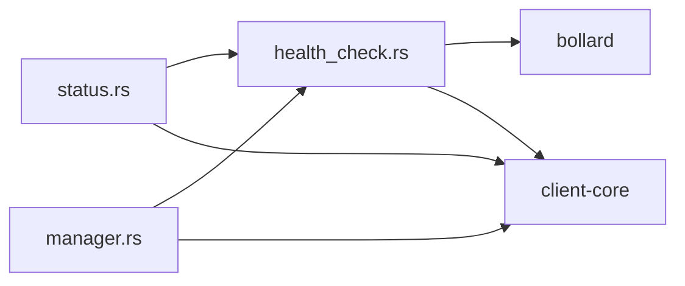

# Status Command

<cite>
**Referenced Files in This Document**   
- [status.rs](file://nuwax-cli/src/commands/status.rs)
- [health_check.rs](file://nuwax-cli/src/docker_service/health_check.rs)
- [manager.rs](file://nuwax-cli/src/docker_service/manager.rs)
- [types.rs](file://client-core/src/container/types.rs)
</cite>

## Table of Contents
1. [Introduction](#introduction)
2. [Project Structure](#project-structure)
3. [Core Components](#core-components)
4. [Architecture Overview](#architecture-overview)
5. [Detailed Component Analysis](#detailed-component-analysis)
6. [Dependency Analysis](#dependency-analysis)
7. [Performance Considerations](#performance-considerations)
8. [Troubleshooting Guide](#troubleshooting-guide)
9. [Conclusion](#conclusion)

## Introduction
The **Status Command** is a critical CLI utility within the `nuwax-cli` application that provides real-time health and version information for the DuckDB client ecosystem. It enables users to verify system readiness, inspect service status, and diagnose deployment issues. This document details the implementation, functionality, and usage of the `status` command, focusing on its integration with Docker services, health checking mechanisms, and structured output capabilities. The command serves as a primary diagnostic tool for both end-users and administrators, offering insights into client versioning, Docker container states, file integrity, and service health.

## Project Structure
The `status` command is implemented within the `nuwax-cli` module of the Duck Client repository. The project follows a modular Rust-based architecture with clear separation of concerns between core logic, CLI commands, and Docker service management.



**Diagram sources**
- [status.rs](file://nuwax-cli/src/commands/status.rs)
- [health_check.rs](file://nuwax-cli/src/docker_service/health_check.rs)
- [manager.rs](file://nuwax-cli/src/docker_service/manager.rs)
- [types.rs](file://client-core/src/container/types.rs)

## Core Components
The `status` command functionality is built upon several key components:
- `show_client_version`: Displays client version and basic metadata.
- `run_status` and `run_status_details`: Entry points for status execution.
- `check_docker_services_status`: Internal function for Docker health verification.
- `HealthChecker`: Core service responsible for querying and evaluating container health.
- `DockerServiceManager`: Orchestrates Docker operations and provides status context.
- `ServiceStatus` and `ContainerStatus`: Enumerations defining service and container states.

These components work together to provide a comprehensive system health report.

**Section sources**
- [status.rs](file://nuwax-cli/src/commands/status.rs#L1-L138)
- [health_check.rs](file://nuwax-cli/src/docker_service/health_check.rs#L1-L1009)
- [manager.rs](file://nuwax-cli/src/docker_service/manager.rs#L1-L888)
- [types.rs](file://client-core/src/container/types.rs#L1-L60)

## Architecture Overview
The `status` command follows a layered architecture, starting from the CLI entry point and progressing through health checking and Docker interaction layers.



**Diagram sources**
- [status.rs](file://nuwax-cli/src/commands/status.rs#L1-L138)
- [health_check.rs](file://nuwax-cli/src/docker_service/health_check.rs#L1-L1009)
- [manager.rs](file://nuwax-cli/src/docker_service/manager.rs#L1-L888)

## Detailed Component Analysis

### Status Command Implementation
The `status` command is implemented in `nuwax-cli/src/commands/status.rs`. It provides two primary functions: `run_status` and `run_status_details`. The former displays the client version header before calling the latter, which performs the detailed system check.

The command checks for the existence of critical files like `docker-compose.yml` and the service package archive. It then delegates Docker service status checking to the `HealthChecker` via the `check_docker_services_status` helper function.

```rust
pub async fn run_status_details(app: &CliApp) -> Result<()> {
    info!("   Docker服务版本: {}", app.config.get_docker_versions());
    // ... file checks ...
    match check_docker_services_status(docker_compose_path, env_file_path).await {
        Ok(()) => { /* success */ }
        Err(e) => { warn!("   ⚠️  服务状态检查失败: {}", e); }
    }
    // ... status suggestions ...
}
```

**Section sources**
- [status.rs](file://nuwax-cli/src/commands/status.rs#L1-L138)

### Health Checking Mechanism
The `HealthChecker` struct, defined in `nuwax-cli/src/docker_service/health_check.rs`, is the core component responsible for assessing Docker service health. It uses the Bollard library to interact with the Docker API and performs a multi-step verification process.

The `health_check` method first retrieves the list of services defined in the `docker-compose.yml` file. It then queries the Docker daemon for all containers, using Docker Compose labels (e.g., `com.docker.compose.service`, `com.docker.compose.project`) to precisely match containers to their corresponding services. This label-based approach ensures accurate identification, even when container names are modified.



**Diagram sources**
- [health_check.rs](file://nuwax-cli/src/docker_service/health_check.rs#L1-L1009)

#### Container Status Determination
The `HealthChecker` uses a sophisticated logic to determine container status, considering both the Docker state and the service's restart policy. The `RestartPolicy` enum (`No`, `Always`, `UnlessStopped`, `OnFailure`) is used to classify services as either "oneshot" (e.g., initialization tasks) or "persistent" (e.g., databases, web servers).

A container with a `restart: no` policy that has stopped is considered `Completed` (healthy), whereas a persistent service that has stopped is considered `Stopped` (unhealthy). This intelligent status mapping prevents false alarms for one-time tasks.

```rust
impl ContainerStatus {
    pub fn from_ducker_status(running: bool, status: &str, is_oneshot: bool) -> Self {
        if running { ContainerStatus::Running }
        else if status.to_lowercase().contains("exited") {
            if is_oneshot { ContainerStatus::Completed } else { ContainerStatus::Stopped }
        }
        // ... other cases ...
    }
}
```

**Section sources**
- [health_check.rs](file://nuwax-cli/src/docker_service/health_check.rs#L1-L1009)

### Health Report Structure
The `HealthReport` struct aggregates the results of the health check into a structured format. It tracks running, completed, and failed containers, calculates overall service status (`AllRunning`, `PartiallyRunning`, `AllStopped`), and generates a human-readable summary.

The report includes a `get_status_summary` method that produces a detailed string with emoji indicators for quick visual assessment of the system state.

```rust
pub struct HealthReport {
    pub containers: Vec<ContainerInfo>,
    pub check_time: chrono::DateTime<chrono::Utc>,
    pub errors: Vec<String>,
    // ... counters ...
}

impl HealthReport {
    pub fn is_all_healthy(&self) -> bool {
        let healthy_count = self.get_healthy_count();
        let one_shot_count = self.get_one_shot_count();
        let total_count = self.get_total_count();
        healthy_count > 0 && healthy_count == total_count - one_shot_count
    }
}
```

**Section sources**
- [health_check.rs](file://nuwax-cli/src/docker_service/health_check.rs#L1-L1009)

### Docker Service Manager Integration
The `DockerServiceManager` in `nuwax-cli/src/docker_service/manager.rs` acts as an orchestrator, providing the `HealthChecker` with the necessary `DockerManager` instance. It also implements its own `health_check` method, which serves as a convenient wrapper.

This manager is responsible for higher-level operations like `start_services`, which includes a built-in `wait_for_services_ready` call that uses the `HealthChecker` to poll for service readiness, demonstrating a tight integration between status checking and service lifecycle management.

```rust
impl DockerServiceManager {
    pub async fn start_services(&mut self) -> DockerServiceResult<()> {
        // ... start logic ...
        match self
            .health_checker
            .wait_for_services_ready(check_interval)
            .await
        {
            Ok(report) => { /* success */ }
            Err(e) => { /* handle timeout */ }
        }
        // ... 
    }
}
```

**Section sources**
- [manager.rs](file://nuwax-cli/src/docker_service/manager.rs#L1-L888)

### Container and Service Status Types
The `ServiceStatus` and `ContainerStatus` enums define the possible states of Docker services and containers. The `ServiceStatus` in `client-core/src/container/types.rs` represents the raw state from Docker Compose (e.g., `Running`, `Stopped`), while the `ContainerStatus` in `health_check.rs` represents a higher-level, interpreted state (e.g., `Running`, `Completed`, `Starting`).

This separation allows the `HealthChecker` to translate low-level Docker states into meaningful application-level statuses.

```rust
// From client-core/src/container/types.rs
#[derive(Debug, Clone, PartialEq)]
pub enum ServiceStatus {
    Running,
    Stopped,
    Created,
    Restarting,
    Unknown,
}
```

**Section sources**
- [types.rs](file://client-core/src/container/types.rs#L1-L60)

## Dependency Analysis
The `status` command relies on a well-defined dependency chain. The `nuwax-cli` crate depends on `client-core` for core types and configuration, and on `bollard` for Docker API interaction. The `HealthChecker` depends on `DockerManager` from `client-core` to perform container queries.



**Diagram sources**
- [status.rs](file://nuwax-cli/src/commands/status.rs)
- [health_check.rs](file://nuwax-cli/src/docker_service/health_check.rs)
- [manager.rs](file://nuwax-cli/src/docker_service/manager.rs)
- [types.rs](file://client-core/src/container/types.rs)

## Performance Considerations
The `status` command is designed for quick execution. The health check process is asynchronous and performs network calls to the Docker daemon efficiently. The use of label-based container matching minimizes the need for complex string parsing or name inference.

For long-running operations like `wait_for_services_ready`, the system uses a configurable polling interval and timeout to balance responsiveness with resource usage. The default timeout is set to 180 seconds, which is sufficient for most service startups.

## Troubleshooting Guide
The `status` command and its underlying components provide extensive troubleshooting information.

**Interpreting Status Indicators:**
- **✅ Service正在运行**: All persistent services are healthy.
- **❌ 存在服务未运行**: One or more persistent services are stopped or failed.
- **🟡 启动中**: Some services are in a transitional state (e.g., restarting).
- **✅ 服务包文件**: The service package has been downloaded.
- **❌ 服务包文件**: The service package is missing; run `nuwax-cli upgrade`.

**Common Issues and Solutions:**
- **Unhealthy Containers**: Check the container logs with `docker-compose logs <service_name>`. The `print_container_troubleshooting` method in `manager.rs` provides specific advice based on the container name (e.g., GPU issues for `video-analysis-worker`, permission issues for `backend`).
- **Version Mismatches**: Ensure the `docker-compose.yml` and `.env` files are from the correct version. The `get_version_download_file_path` method ensures the correct versioned paths are used.
- **Transient Network Failures**: The `HealthChecker` gracefully handles connection errors to the Docker daemon, logging a warning but not failing the entire status command.
- **Container Startup Delays**: The `wait_for_services_ready` function is designed to handle slow-starting services by polling until the timeout is reached.

**Section sources**
- [status.rs](file://nuwax-cli/src/commands/status.rs#L1-L138)
- [health_check.rs](file://nuwax-cli/src/docker_service/health_check.rs#L1-L1009)
- [manager.rs](file://nuwax-cli/src/docker_service/manager.rs#L1-L888)

## Conclusion
The `status` command is a robust and informative tool that provides a comprehensive view of the Duck Client system's health. Its implementation leverages a modular architecture, using the `HealthChecker` to perform intelligent, label-based health checks on Docker services. By differentiating between one-shot and persistent services and providing detailed troubleshooting guidance, it effectively serves as the primary diagnostic interface for the application. The command's design emphasizes clarity, resilience to transient failures, and actionable feedback for users.