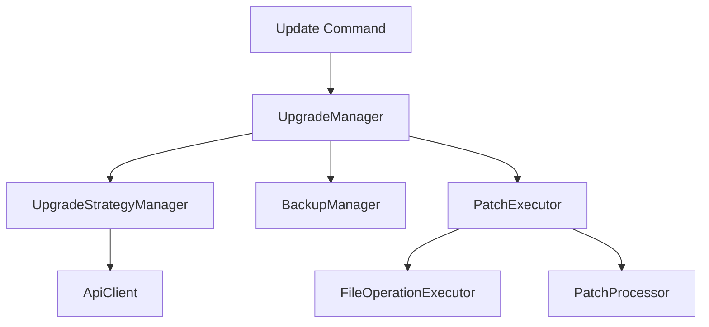
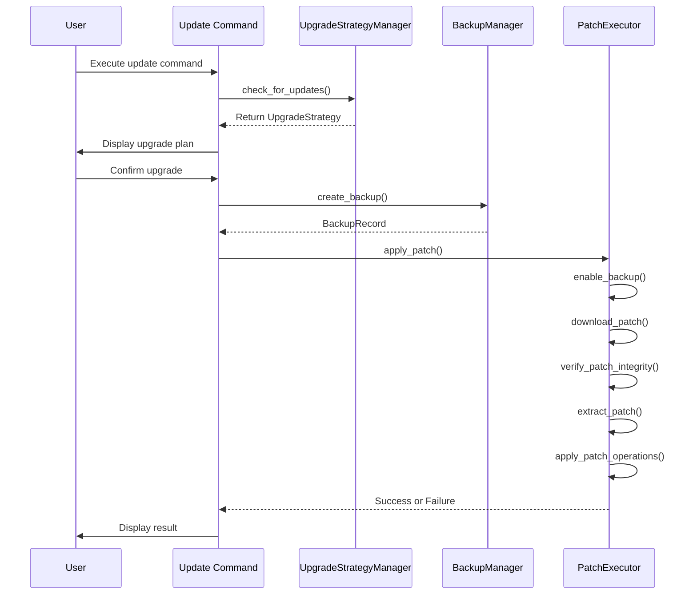
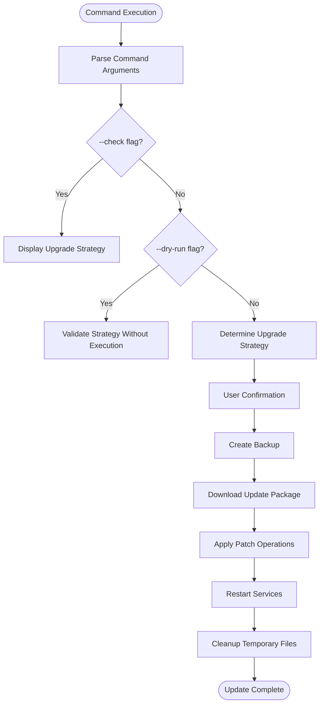
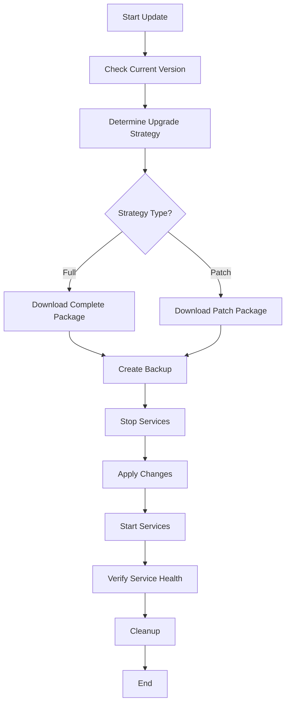
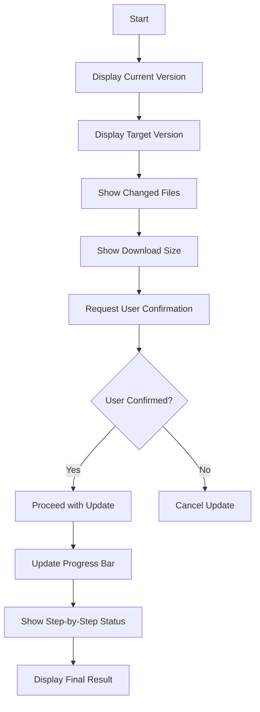
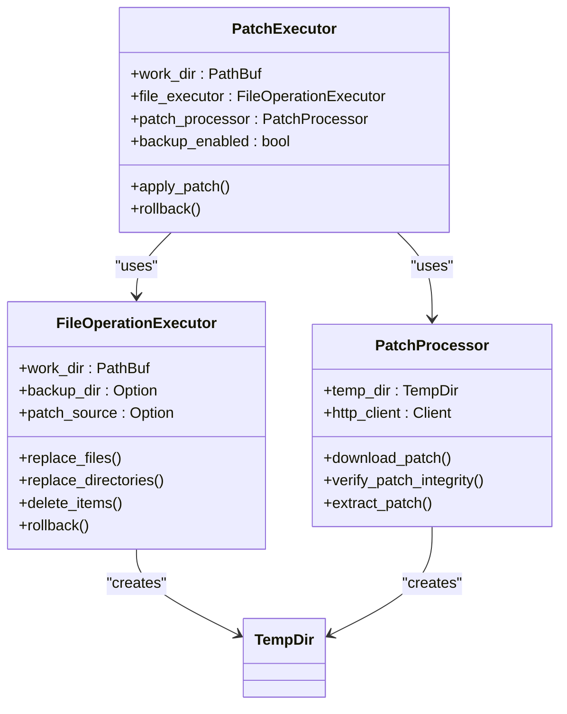
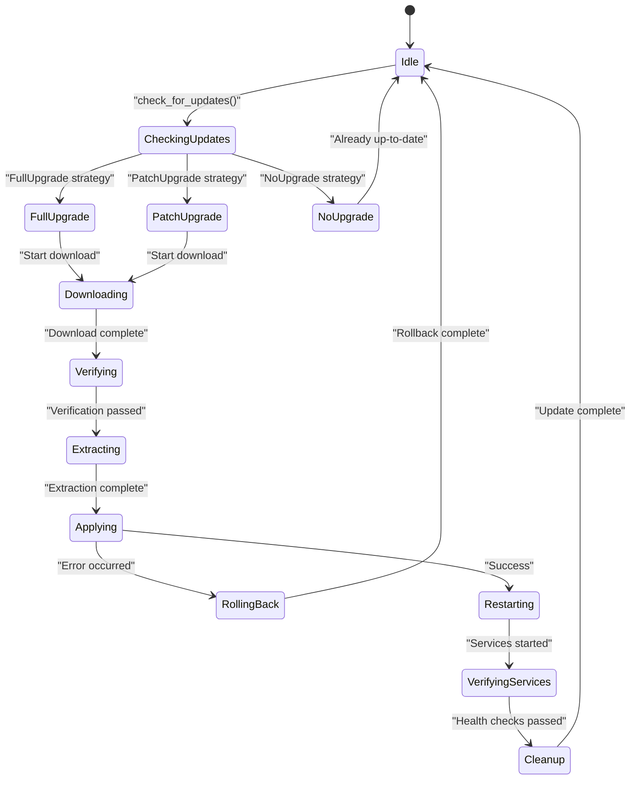

# Update Command

<cite>
**Referenced Files in This Document**   
- [update.rs](file://nuwax-cli/src/commands/update.rs#L0-L161)
- [upgrade.rs](file://client-core/src/upgrade.rs#L0-L89)
- [upgrade_strategy.rs](file://client-core/src/upgrade_strategy.rs#L0-L463)
- [patch_executor/mod.rs](file://client-core/src/patch_executor/mod.rs#L0-L432)
- [file_operations.rs](file://client-core/src/patch_executor/file_operations.rs#L0-L524)
- [patch_processor.rs](file://client-core/src/patch_executor/patch_processor.rs#L0-L455)
- [backup.rs](file://client-core/src/backup.rs#L0-L624)
- [version.rs](file://client-core/src/version.rs#L0-L410)
- [api_types.rs](file://client-core/src/api_types.rs#L0-L902)
</cite>

## Table of Contents
1. [Update Command Overview](#update-command-overview)
2. [Interactive Upgrade Process](#interactive-upgrade-process)
3. [Command Syntax and Options](#command-syntax-and-options)
4. [Step-by-Step Execution Flow](#step-by-step-execution-flow)
5. [TUI Elements and Progress Reporting](#tui-elements-and-progress-reporting)
6. [Safety Features and Atomic Operations](#safety-features-and-atomic-operations)
7. [Failure Recovery and Rollback](#failure-recovery-and-rollback)
8. [Best Practices for Manual Intervention](#best-practices-for-manual-intervention)

## Update Command Overview

The **Update Command** in the Duck Client system provides a comprehensive mechanism for upgrading Docker services through either full or incremental (patch) updates. The command orchestrates a multi-step process that includes version checking, download preparation, user confirmation, backup creation, patch application, and service restart. It supports both interactive and automated workflows, with robust safety features including atomic operations, transactional file system changes, and automatic rollback capabilities.

The update system is designed with a modular architecture where the CLI command (`update.rs`) serves as the entry point, delegating core logic to the `UpgradeManager` in `client-core`. This separation allows for clean responsibility boundaries between user interface concerns and business logic.



**Diagram sources**
- [update.rs](file://nuwax-cli/src/commands/update.rs#L0-L161)
- [upgrade.rs](file://client-core/src/upgrade.rs#L0-L89)
- [upgrade_strategy.rs](file://client-core/src/upgrade_strategy.rs#L0-L463)
- [patch_executor/mod.rs](file://client-core/src/patch_executor/mod.rs#L0-L432)

**Section sources**
- [update.rs](file://nuwax-cli/src/commands/update.rs#L0-L161)
- [upgrade.rs](file://client-core/src/upgrade.rs#L0-L89)

## Interactive Upgrade Process

The interactive upgrade process follows a well-defined sequence of operations that ensures reliability and user awareness throughout the update lifecycle. The process begins with version detection and strategy determination, followed by user confirmation before proceeding with potentially destructive operations.

When a user initiates the update command, the system first checks the current version against the latest available version from the server. Based on this comparison, the `UpgradeStrategyManager` determines whether a full upgrade, patch upgrade, or no upgrade is needed. The decision takes into account factors such as version compatibility, network conditions, disk space, and risk assessment.

For patch upgrades, the system downloads only the changed files and directories as specified in the `PatchPackageInfo`, which contains operations for file replacement and deletion. The process includes built-in confirmation prompts that require user acknowledgment before proceeding with backup creation and patch application.



**Diagram sources**
- [update.rs](file://nuwax-cli/src/commands/update.rs#L0-L161)
- [upgrade_strategy.rs](file://client-core/src/upgrade_strategy.rs#L0-L463)
- [backup.rs](file://client-core/src/backup.rs#L0-L624)
- [patch_executor/mod.rs](file://client-core/src/patch_executor/mod.rs#L0-L432)

**Section sources**
- [update.rs](file://nuwax-cli/src/commands/update.rs#L0-L161)
- [upgrade_strategy.rs](file://client-core/src/upgrade_strategy.rs#L0-L463)
- [backup.rs](file://client-core/src/backup.rs#L0-L624)

## Command Syntax and Options

The update command supports several options that modify its behavior to accommodate different use cases and operational requirements. These options are defined in the `UpgradeArgs` structure and processed by the `run_upgrade` function.

### Command Syntax
```
nuwax-cli update [OPTIONS]
```

### Available Options

**--dry-run**
- **Description**: Performs a trial run of the update process without making any actual changes
- **Use Case**: Allows users to preview what changes would be made without risking system stability
- **Implementation**: When this flag is present, the system goes through the upgrade strategy determination but stops before any file modifications or downloads occur

**--strategy**
- **Description**: Specifies the upgrade strategy to use (full, patch, or auto)
- **Values**: 
  - `full`: Forces a complete download and replacement of all service files
  - `patch`: Attempts to use incremental updates with only changed files
  - `auto`: Allows the system to determine the optimal strategy based on current conditions
- **Implementation**: This option maps directly to the `force` parameter in the `check_for_updates` method, where `--strategy full` sets `force=true`

**--check**
- **Description**: Checks for available updates without downloading or applying them
- **Use Case**: Useful for scripting and automation where only version information is needed
- **Implementation**: When this flag is set, the process terminates after displaying the upgrade strategy without proceeding to download or apply changes

**--force**
- **Description**: Forces re-download of update packages even if they already exist locally
- **Use Case**: Resolves issues with corrupted downloads or ensures fresh copies are used
- **Implementation**: Passed as the `force_full` parameter to `check_for_updates`, triggering the `select_full_upgrade_strategy` method

The command also supports architecture-specific downloads by detecting the current system architecture through the `Architecture::detect()` method, ensuring that the correct binary packages are downloaded for the target platform.



**Diagram sources**
- [update.rs](file://nuwax-cli/src/commands/update.rs#L0-L161)
- [upgrade_strategy.rs](file://client-core/src/upgrade_strategy.rs#L0-L463)

**Section sources**
- [update.rs](file://nuwax-cli/src/commands/update.rs#L0-L161)
- [upgrade_strategy.rs](file://client-core/src/upgrade_strategy.rs#L0-L463)

## Step-by-Step Execution Flow

The update command executes through a well-defined sequence of steps that ensure reliability and data integrity throughout the upgrade process. Each step builds upon the previous one, with appropriate error handling and progress reporting.

### 1. Download Preparation
The process begins with the creation of appropriate download directories based on the target version and download type (full or patch). The `create_version_download_dir` function ensures that the necessary directory structure exists before any downloads commence.

```rust
pub fn create_version_download_dir(
    download_dir: PathBuf,
    version: &str,
    download_type: &str,
) -> Result<PathBuf> {
    let dir = download_dir.join(version).join(download_type);
    fs::create_dir_all(&dir)?;
    Ok(dir)
}
```

### 2. User Confirmation
Before proceeding with potentially destructive operations, the system displays detailed information about the intended upgrade, including current and target versions, download URLs, and file paths. This information allows users to make informed decisions about proceeding with the update.

### 3. Backup Creation
The system automatically creates a backup of critical files before applying any changes. For full upgrades, this typically includes the `data` directory, while patch upgrades also back up the specific files and directories that will be modified.

```rust
pub async fn create_backup(&self, options: BackupOptions) -> Result<BackupRecord> {
    // Generate backup filename with timestamp
    let timestamp = Utc::now().format("%Y-%m-%d_%H-%M-%S");
    let backup_filename = format!(
        "backup_{}_v{}_{}.tar.gz",
        backup_type_str, options.service_version, timestamp
    );
    
    // Perform the actual backup operation
    self.perform_backup(&need_backup_paths, &backup_path, options.compression_level).await
}
```

### 4. Patch Application
For patch upgrades, the system downloads the patch package, verifies its integrity through hash and signature checks, extracts the contents, and applies the specified operations (file replacement, directory replacement, and file deletion).

### 5. Service Restart
After successful patch application, the system restarts the Docker services to ensure that the new versions are properly loaded and running. This step includes health checks to verify that all services are functioning correctly after the update.

The entire process is coordinated through the `UpgradeManager` which tracks progress through various `UpgradeStep` states, allowing for detailed progress reporting and error recovery at each stage.



**Diagram sources**
- [update.rs](file://nuwax-cli/src/commands/update.rs#L0-L161)
- [backup.rs](file://client-core/src/backup.rs#L0-L624)
- [patch_executor/mod.rs](file://client-core/src/patch_executor/mod.rs#L0-L432)

**Section sources**
- [update.rs](file://nuwax-cli/src/commands/update.rs#L0-L161)
- [backup.rs](file://client-core/src/backup.rs#L0-L624)
- [patch_executor/mod.rs](file://client-core/src/patch_executor/mod.rs#L0-L432)

## TUI Elements and Progress Reporting

The update command incorporates several Text-Based User Interface (TUI) elements to provide real-time feedback and maintain user engagement throughout the potentially lengthy update process. These elements include progress indicators, status messages, and confirmation prompts.

Progress is reported through a callback mechanism that notifies the UI of state changes. The `ProgressCallback` type is defined as a boxed closure that accepts an `UpgradeStep` enum and a status message string:

```rust
pub type ProgressCallback = Box<dyn Fn(UpgradeStep, &str) + Send + Sync>;
```

The `UpgradeStep` enum defines various stages of the update process:

```rust
#[derive(Debug, Clone)]
pub enum UpgradeStep {
    CheckingUpdates,
    CreatingBackup,
    StoppingServices,
    DownloadingUpdate,
    ExtractingUpdate,
    LoadingImages,
    StartingServices,
    VerifyingServices,
    CleaningUp,
    Completed,
    Failed(String),
}
```

During patch application, a more granular progress callback is used that reports completion percentage:

```rust
pub async fn apply_patch<F>(
    &mut self,
    patch_info: &PatchPackageInfo,
    operations: &PatchOperations,
    progress_callback: F,
) -> Result<(), PatchExecutorError>
where
    F: Fn(f64) + Send + Sync,
{
    info!("🔄 开始应用增量补丁...");
    progress_callback(0.0);
    
    // Various stages with progress updates
    progress_callback(0.25); // After download
    progress_callback(0.35); // After verification  
    progress_callback(0.45); // After extraction
    progress_callback(0.5);  // After structure validation
    progress_callback(1.0);  // At completion
}
```

The CLI interface displays these progress updates with appropriate emojis and formatting to enhance readability:

```
🔄 开始应用增量补丁...
📥 下载补丁包...
🔍 验证补丁完整性...
📦 解压补丁包...
🔧 应用补丁操作...
✅ 增量补丁应用完成
```

For user confirmation, the system displays a summary of the intended changes and waits for explicit user approval before proceeding with backup creation and patch application. This prevents accidental updates and gives users the opportunity to review the impact of the changes.



**Diagram sources**
- [upgrade.rs](file://client-core/src/upgrade.rs#L0-L89)
- [patch_executor/mod.rs](file://client-core/src/patch_executor/mod.rs#L0-L432)

**Section sources**
- [upgrade.rs](file://client-core/src/upgrade.rs#L0-L89)
- [patch_executor/mod.rs](file://client-core/src/patch_executor/mod.rs#L0-L432)

## Safety Features and Atomic Operations

The update system incorporates multiple safety features designed to prevent data loss and ensure system stability during the upgrade process. These features include atomic file operations, transactional file system changes, and comprehensive backup mechanisms.

### Atomic File Operations
File replacements are performed atomically using temporary files to prevent partial writes and ensure data consistency. The `atomic_file_replace` method creates a temporary file in the same directory as the target, writes the new content, and then renames the temporary file to the target name in a single atomic operation:

```rust
async fn atomic_file_replace(&self, source: &Path, target: &Path) -> Result<()> {
    // Create temporary file in target directory
    let temp_file = NamedTempFile::new_in(target.parent().unwrap_or_else(|| Path::new(".")))?;
    
    // Write content to temporary file
    let source_content = fs::read(source).await?;
    fs::write(temp_file.path(), source_content).await?;
    
    // Atomic rename operation
    temp_file.persist(target)?;
    Ok(())
}
```

This approach ensures that either the complete file is replaced or the original remains intact, preventing scenarios where a partially written file could cause application failures.

### Transactional File System Changes
The system implements a transaction-like pattern for file operations by enabling backup mode before any changes are made. When `enable_backup()` is called on the `PatchExecutor`, a temporary directory is created to store copies of all files that will be modified:

```rust
pub fn enable_backup(&mut self) -> Result<(), PatchExecutorError> {
    self.file_executor.enable_backup()?;
    self.backup_enabled = true;
    info!("📦 已启用补丁执行备份模式");
    Ok(())
}
```

This creates a rollback point that can be used to restore the system to its previous state if the update process fails at any point.

### Comprehensive Backup System
The backup system creates timestamped archives of critical data before any updates are applied. Backups are stored in a designated storage directory and recorded in the database for audit and recovery purposes:

```rust
pub async fn create_backup(&self, options: BackupOptions) -> Result<BackupRecord> {
    // Generate timestamped backup filename
    let timestamp = Utc::now().format("%Y-%m-%d_%H-%M-%S");
    let backup_filename = format!(
        "backup_{}_v{}_{}.tar.gz",
        backup_type_str, options.service_version, timestamp
    );
    
    // Store backup record in database
    let record_id = self
        .database
        .create_backup_record(
            backup_path.to_string_lossy().to_string(),
            options.service_version,
            options.backup_type,
            BackupStatus::Completed,
        )
        .await?;
    Ok(record)
}
```

The backup includes both the `data` directory for full upgrades and any files specifically modified by patch operations, ensuring that all potentially affected data is preserved.



**Diagram sources**
- [patch_executor/mod.rs](file://client-core/src/patch_executor/mod.rs#L0-L432)
- [file_operations.rs](file://client-core/src/patch_executor/file_operations.rs#L0-L524)
- [patch_processor.rs](file://client-core/src/patch_executor/patch_processor.rs#L0-L455)

**Section sources**
- [patch_executor/mod.rs](file://client-core/src/patch_executor/mod.rs#L0-L432)
- [file_operations.rs](file://client-core/src/patch_executor/file_operations.rs#L0-L524)

## Failure Recovery and Rollback

The update system includes comprehensive failure recovery mechanisms that automatically initiate rollback procedures when errors occur during the update process. This ensures system stability and data integrity even when updates are interrupted or fail.

### Automatic Rollback
When a patch application fails, the system automatically attempts to roll back to the previous state if backup mode is enabled. The rollback process is triggered in the error handling branch of the `apply_patch` method:

```rust
match self.execute_patch_pipeline(patch_info, operations, &progress_callback).await {
    Ok(_) => {
        progress_callback(1.0);
        info!("✅ 增量补丁应用完成");
        Ok(())
    }
    Err(e) => {
        error!("❌ 补丁应用失败: {}", e);
        
        // Automatic rollback if backup is enabled
        if e.requires_rollback() && self.backup_enabled {
            warn!("🔄 开始自动回滚...");
            if let Err(rollback_err) = self.rollback().await {
                error!("❌ 回滚失败: {}", rollback_err);
                return Err(PatchExecutorError::rollback_failed(format!(
                    "原始错误: {e}, 回滚错误: {rollback_err}"
                )));
            }
            info!("✅ 自动回滚完成");
        }
        Err(e)
    }
}
```

The `rollback` method restores all files from the backup directory, effectively undoing all changes made during the failed update:

```rust
pub async fn rollback(&self) -> Result<()> {
    if let Some(backup_dir) = &self.backup_dir {
        warn!("🔙 开始回滚文件操作...");
        
        // Restore all files from backup
        tokio::task::spawn_blocking(move || {
            for entry in WalkDir::new(&backup_path) {
                // Copy each file from backup to working directory
                std::fs::copy(backup_file_path, &target_path)?;
            }
            Ok(())
        }).await??;
        
        info!("✅ 文件操作回滚完成");
    } else {
        return Err(PatchExecutorError::BackupNotEnabled);
    }
    Ok(())
}
```

### Error Classification
Errors are classified to determine appropriate recovery actions. The `PatchExecutorError` enum includes methods to determine whether an error requires rollback:

```rust
impl PatchExecutorError {
    pub fn requires_rollback(&self) -> bool {
        match self {
            PatchExecutorError::VerificationFailed(_) => true,
            PatchExecutorError::ExtractionFailed(_) => true,
            PatchExecutorError::IoError(_) => true,
            _ => false,
        }
    }
}
```

This allows the system to distinguish between critical errors that require rollback and non-critical errors that might allow the process to continue.

### Database Transaction Safety
All backup and update operations are recorded in the database with appropriate status indicators. If an operation fails, the database record is updated to reflect the failure, providing an audit trail for troubleshooting:

```rust
// Record failed backup in database
self.database
    .create_backup_record(
        backup_path.to_string_lossy().to_string(),
        options.service_version,
        options.backup_type,
        BackupStatus::Failed,
    )
    .await?;
```

This ensures that even if the update process is interrupted, administrators can determine the last known state of the system and take appropriate recovery actions.



**Diagram sources**
- [patch_executor/mod.rs](file://client-core/src/patch_executor/mod.rs#L0-L432)
- [file_operations.rs](file://client-core/src/patch_executor/file_operations.rs#L0-L524)

**Section sources**
- [patch_executor/mod.rs](file://client-core/src/patch_executor/mod.rs#L0-L432)
- [file_operations.rs](file://client-core/src/patch_executor/file_operations.rs#L0-L524)

## Best Practices for Manual Intervention

When automated updates fail, administrators may need to perform manual intervention to resolve issues and complete the update process. The following best practices provide guidance for troubleshooting and recovery.

### 1. Verify Network Connectivity
Before attempting any manual update, verify that the system has stable network connectivity to the update server. Use tools like `ping` and `curl` to test connectivity and download speeds.

```bash
# Test connectivity to update server
curl -I https://updates.example.com

# Check DNS resolution
nslookup updates.example.com
```

### 2. Check Disk Space
Ensure adequate disk space is available for both the download and extraction processes. The system typically requires at least twice the size of the update package in free space.

```bash
# Check available disk space
df -h /path/to/download/directory

# Clean up old backups if necessary
rm /path/to/backups/old-backup_*.tar.gz
```

### 3. Manual Backup Verification
Before proceeding with manual updates, verify that recent backups exist and are intact. Test the integrity of backup files using checksum verification.

```bash
# Verify backup file integrity
sha256sum backup_v0.0.13.2_2025-01-12_10-00-00.tar.gz

# Test backup extraction
tar -tzf backup_v0.0.13.2_2025-01-12_10-00-00.tar.gz | head -20
```

### 4. Manual Patch Application
If automated patch application fails, the patch package can be applied manually by extracting the contents and applying the operations specified in the `PatchOperations` structure.

```bash
# Extract patch package manually
mkdir patch-extracted
tar -xzf patch.tar.gz -C patch-extracted

# Apply file replacements
cp patch-extracted/app.jar ./docker/app.jar
cp patch-extracted/config.yml ./docker/config.yml

# Apply directory replacements
rm -rf ./docker/front/
cp -r patch-extracted/front/ ./docker/front/

# Remove deleted files
rm ./docker/old-files/app.jar
rm ./docker/old-files/config.yml
```

### 5. Service Restart and Verification
After manual changes, restart the Docker services and verify their health through logs and status checks.

```bash
# Restart Docker services
docker-compose down
docker-compose up -d

# Check service status
docker-compose ps

# Monitor logs for errors
docker-compose logs --tail=50
```

### 6. Database Record Update
After successful manual updates, update the database records to reflect the new version and update status, ensuring that future update checks function correctly.

```sql
-- Update version in configuration
UPDATE config SET value = '0.0.13.3' WHERE key = 'docker_version';

-- Record successful update
INSERT INTO backup_records 
(backup_path, service_version, backup_type, status, created_at)
VALUES ('manual_update_0.0.13.3', '0.0.13.3', 'manual', 'completed', NOW());
```

These manual intervention steps should only be performed when automated updates consistently fail, and administrators should document all manual changes for audit and recovery purposes.

**Section sources**
- [patch_executor/mod.rs](file://client-core/src/patch_executor/mod.rs#L0-L432)
- [backup.rs](file://client-core/src/backup.rs#L0-L624)
- [upgrade.rs](file://client-core/src/upgrade.rs#L0-L89)