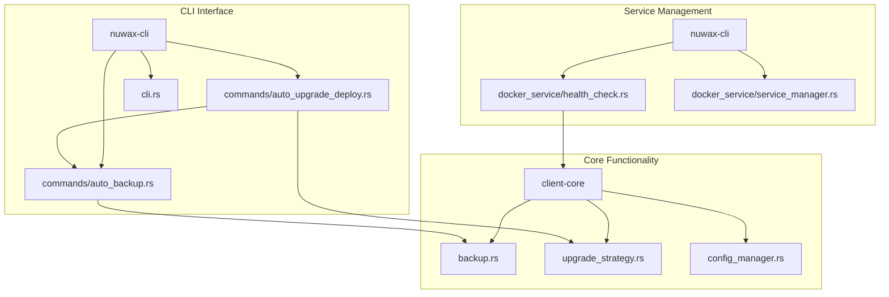
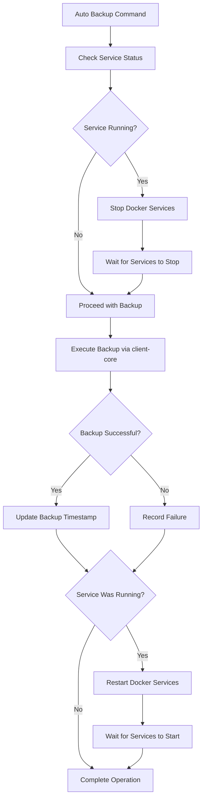
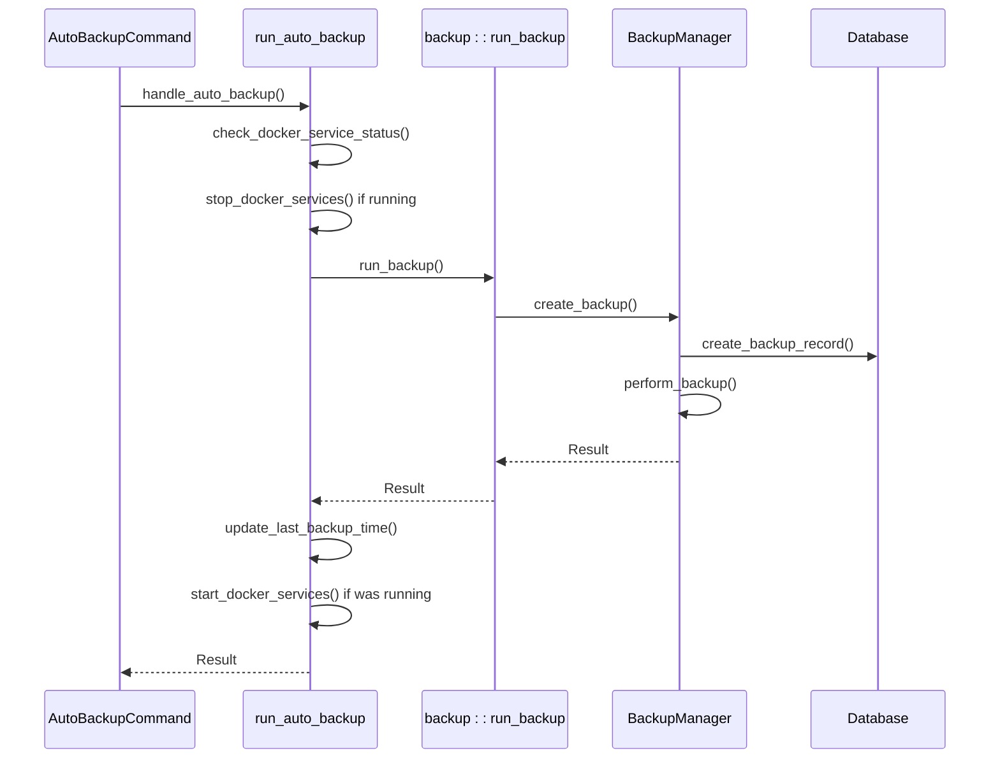
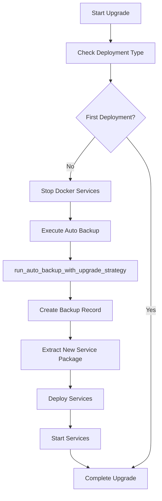
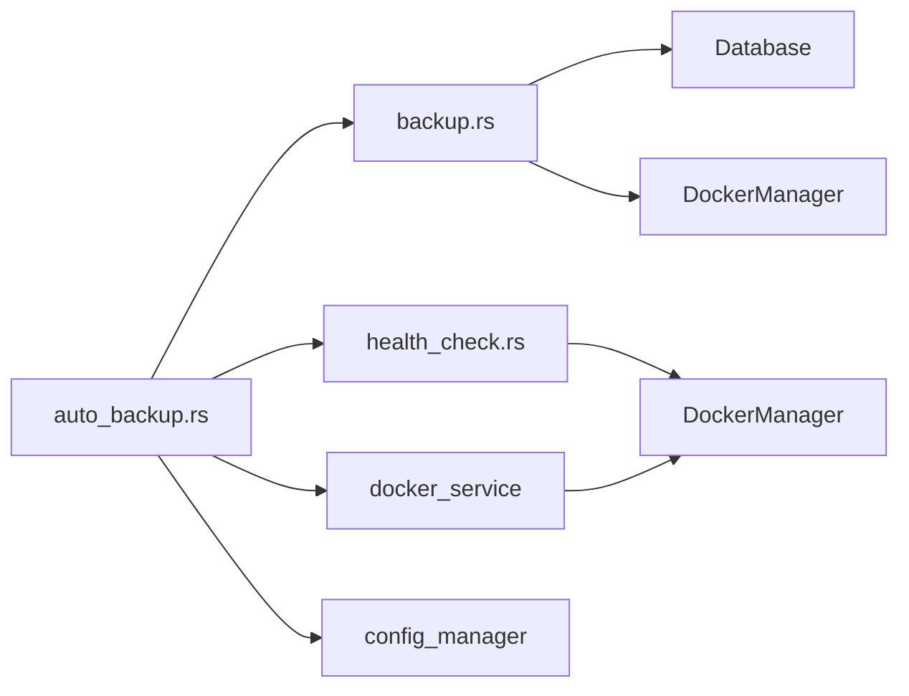

# Auto Backup Command

<cite>
**Referenced Files in This Document**   
- [auto_backup.rs](file://nuwax-cli/src/commands/auto_backup.rs)
- [auto_upgrade_deploy.rs](file://nuwax-cli/src/commands/auto_upgrade_deploy.rs)
- [backup.rs](file://client-core/src/backup.rs)
- [upgrade_strategy.rs](file://client-core/src/upgrade_strategy.rs)
- [health_check.rs](file://nuwax-cli/src/docker_service/health_check.rs)
- [cli.rs](file://nuwax-cli/src/cli.rs)
</cite>

## Table of Contents
1. [Introduction](#introduction)
2. [Project Structure](#project-structure)
3. [Core Components](#core-components)
4. [Architecture Overview](#architecture-overview)
5. [Detailed Component Analysis](#detailed-component-analysis)
6. [Dependency Analysis](#dependency-analysis)
7. [Performance Considerations](#performance-considerations)
8. [Troubleshooting Guide](#troubleshooting-guide)
9. [Conclusion](#conclusion)

## Introduction
The Auto Backup Command in nuwax-cli is a critical component designed to ensure data integrity during upgrade operations. This document provides a comprehensive analysis of the automatic backup implementation, focusing on its integration within the upgrade workflow, interaction with the client-core backup module, and relationship with other system components. The command serves as a protective mechanism that automatically triggers backups before any upgrade deployment, preventing data loss during version transitions. It operates through a well-defined sequence of pre-execution checks, service management, and error handling, ensuring reliability even in failure scenarios. The implementation demonstrates a layered architecture with clear separation of concerns between the CLI interface, business logic, and core functionality.

## Project Structure
The project follows a modular architecture with distinct components organized by functionality. The auto-backup command resides within the nuwax-cli module, which acts as the command-line interface layer. This module interacts with the client-core module, which contains the fundamental business logic and data management capabilities. The structure separates concerns effectively, with the CLI handling user interaction and command routing, while the core module manages persistent operations like backup, database interactions, and service control.



**Diagram sources**
- [auto_backup.rs](file://nuwax-cli/src/commands/auto_backup.rs)
- [auto_upgrade_deploy.rs](file://nuwax-cli/src/commands/auto_upgrade_deploy.rs)
- [backup.rs](file://client-core/src/backup.rs)
- [upgrade_strategy.rs](file://client-core/src/upgrade_strategy.rs)
- [health_check.rs](file://nuwax-cli/src/docker_service/health_check.rs)

**Section sources**
- [auto_backup.rs](file://nuwax-cli/src/commands/auto_backup.rs)
- [auto_upgrade_deploy.rs](file://nuwax-cli/src/commands/auto_upgrade_deploy.rs)

## Core Components
The auto-backup implementation consists of several key components that work together to provide reliable backup functionality. The primary component is the `run_auto_backup` function in auto_backup.rs, which orchestrates the entire backup process by coordinating service management, backup execution, and error recovery. This function integrates with the client-core backup module through the `backup::run_backup` function, leveraging its robust backup capabilities. The command also interacts with the Docker service controller to manage service lifecycle during backup operations, ensuring data consistency by stopping services before backup and restarting them afterward. The implementation includes comprehensive error handling that allows the system to recover gracefully from failures while maintaining data integrity.

**Section sources**
- [auto_backup.rs](file://nuwax-cli/src/commands/auto_backup.rs#L26-L112)
- [backup.rs](file://client-core/src/backup.rs#L23-L50)

## Architecture Overview
The auto-backup command operates within a well-defined architectural framework that ensures data safety during upgrade operations. The architecture follows a layered approach with clear separation between the command interface, business logic, and core functionality. When triggered, the command first checks the Docker service status using the health check module, then stops the services to ensure data consistency. It then delegates the actual backup operation to the client-core backup module, which handles the file archiving and database recording. After the backup completes, the command restarts the services and updates the backup status in the configuration database. This architecture ensures that backup operations are atomic and reliable, with proper error handling at each step.



**Diagram sources**
- [auto_backup.rs](file://nuwax-cli/src/commands/auto_backup.rs)
- [health_check.rs](file://nuwax-cli/src/docker_service/health_check.rs)
- [backup.rs](file://client-core/src/backup.rs)

## Detailed Component Analysis

### Auto Backup Command Implementation
The auto-backup command implementation in auto_backup.rs provides the primary interface for backup operations within the nuwax-cli system. The command supports two main operations: immediate backup execution and status display. The implementation follows a structured approach that prioritizes data safety by ensuring services are properly managed during the backup process. The command uses asynchronous execution to handle potentially long-running operations like service stop/start and file archiving, providing responsive feedback to users through logging statements.

#### Auto Backup Command Structure
```mermaid
classDiagram
class AutoBackupCommand {
+Run
+Status
}
class AutoBackupConfig {
+enabled : bool
+cron_expression : String
+last_backup_time : Option<DateTime>
+backup_retention_days : i32
+backup_directory : String
}
class AutoBackupFunctions {
+handle_auto_backup()
+run_auto_backup()
+run_auto_backup_with_upgrade_strategy()
+set_enabled()
+show_status()
+get_auto_backup_config()
+update_last_backup_time()
+check_docker_service_status()
}
AutoBackupCommand --> AutoBackupFunctions : "invokes"
AutoBackupFunctions --> AutoBackupConfig : "uses"
AutoBackupFunctions --> "backup : : run_backup" : "delegates"
AutoBackupFunctions --> "docker_service : : stop/start" : "controls"
```

**Diagram sources**
- [auto_backup.rs](file://nuwax-cli/src/commands/auto_backup.rs#L1-L431)
- [cli.rs](file://nuwax-cli/src/cli.rs#L15-L22)

**Section sources**
- [auto_backup.rs](file://nuwax-cli/src/commands/auto_backup.rs#L1-L431)
- [cli.rs](file://nuwax-cli/src/cli.rs#L15-L22)

### Client-Core Backup Module Integration
The auto-backup command integrates with the client-core backup module through a well-defined interface that abstracts the complexities of file archiving and database management. The integration occurs primarily through the `backup::run_backup` function, which the auto-backup command calls to execute the actual backup operation. This design follows the principle of separation of concerns, with the CLI layer handling service orchestration and the core layer managing data persistence. The integration includes error propagation that allows the auto-backup command to respond appropriately to backup failures, maintaining system reliability.

#### Backup Module Integration Flow


**Diagram sources**
- [auto_backup.rs](file://nuwax-cli/src/commands/auto_backup.rs)
- [backup.rs](file://client-core/src/backup.rs)

**Section sources**
- [auto_backup.rs](file://nuwax-cli/src/commands/auto_backup.rs#L80-L112)
- [backup.rs](file://client-core/src/backup.rs#L52-L80)

### Upgrade Workflow Integration
The auto-backup command is tightly integrated into the upgrade workflow through the auto_upgrade_deploy command, which invokes backup operations as a critical step before deploying new versions. This integration ensures that data is protected before any potentially disruptive upgrade operations. The upgrade workflow uses the `run_auto_backup_with_upgrade_strategy` function, which extends the basic backup functionality by incorporating upgrade strategy information. This allows the backup system to adapt its behavior based on the type of upgrade being performed, providing context-aware protection.

#### Upgrade Workflow with Backup


**Diagram sources**
- [auto_upgrade_deploy.rs](file://nuwax-cli/src/commands/auto_upgrade_deploy.rs#L100-L200)
- [auto_backup.rs](file://nuwax-cli/src/commands/auto_backup.rs#L261-L300)

**Section sources**
- [auto_upgrade_deploy.rs](file://nuwax-cli/src/commands/auto_upgrade_deploy.rs#L100-L200)
- [auto_backup.rs](file://nuwax-cli/src/commands/auto_backup.rs#L261-L300)

## Dependency Analysis
The auto-backup command has a well-defined dependency structure that ensures modularity and maintainability. The primary dependencies include the client-core backup module for backup execution, the Docker service controller for service management, and the configuration database for state persistence. The command also depends on the health check module to determine service status before backup operations. These dependencies are managed through clear interfaces that abstract implementation details, allowing for easier testing and maintenance. The dependency graph shows a unidirectional flow from the CLI layer to the core functionality, preventing circular dependencies and ensuring a clean architectural separation.



**Diagram sources**
- [auto_backup.rs](file://nuwax-cli/src/commands/auto_backup.rs)
- [backup.rs](file://client-core/src/backup.rs)
- [health_check.rs](file://nuwax-cli/src/docker_service/health_check.rs)

**Section sources**
- [auto_backup.rs](file://nuwax-cli/src/commands/auto_backup.rs)
- [backup.rs](file://client-core/src/backup.rs)

## Performance Considerations
The auto-backup implementation includes several performance optimizations to minimize impact on system operations. The backup process runs file archiving operations in a blocking task on a separate thread pool, preventing the async runtime from being blocked by I/O operations. This design allows other operations to continue while the backup executes. The implementation also includes timeout mechanisms for service stop/start operations, preventing indefinite waits that could impact system responsiveness. The backup compression level can be configured to balance between storage efficiency and CPU usage, allowing administrators to optimize for their specific hardware constraints.

## Troubleshooting Guide
Common issues with the auto-backup command typically fall into several categories: permission errors, disk space constraints, and timeout handling. Permission errors often occur when the process lacks write access to the backup directory or read access to the source files. These can be resolved by ensuring proper file permissions and running the command with appropriate privileges. Disk space constraints can cause backup failures, which can be mitigated by monitoring available storage and configuring appropriate backup retention policies. Timeout issues during service stop/start operations may indicate underlying problems with the Docker daemon or container health, requiring investigation of the container logs.

**Section sources**
- [auto_backup.rs](file://nuwax-cli/src/commands/auto_backup.rs#L80-L150)
- [health_check.rs](file://nuwax-cli/src/docker_service/health_check.rs#L500-L600)

## Conclusion
The auto-backup command in nuwax-cli provides a robust mechanism for protecting data during upgrade operations. Its implementation demonstrates a well-architected approach with clear separation of concerns, reliable error handling, and seamless integration with the upgrade workflow. The command effectively coordinates with the client-core backup module and Docker service controller to ensure data consistency while maintaining system availability. By following best practices for asynchronous execution and error recovery, the implementation provides a reliable foundation for automated backup operations. Future enhancements could include more sophisticated scheduling capabilities and improved monitoring of backup integrity.