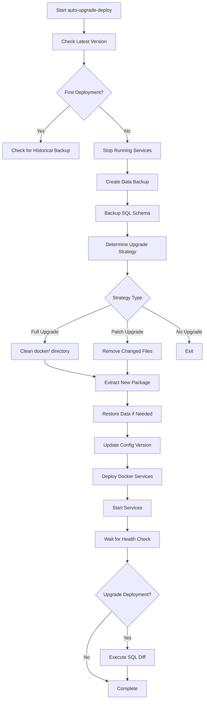
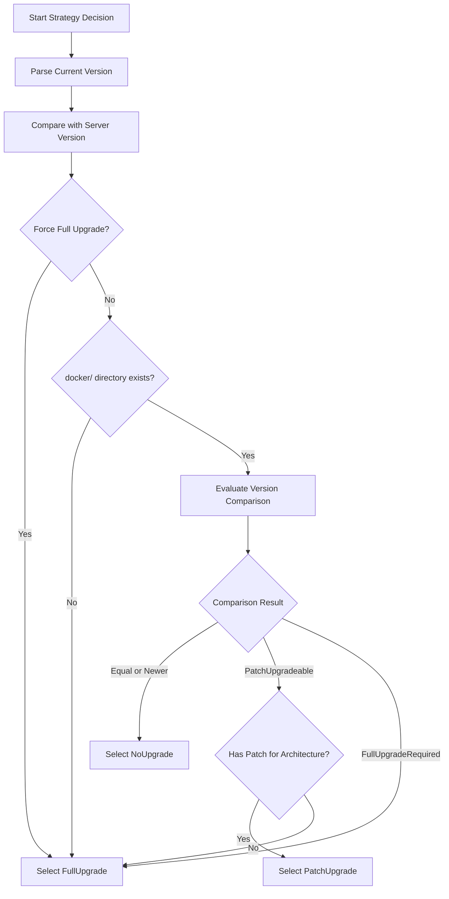
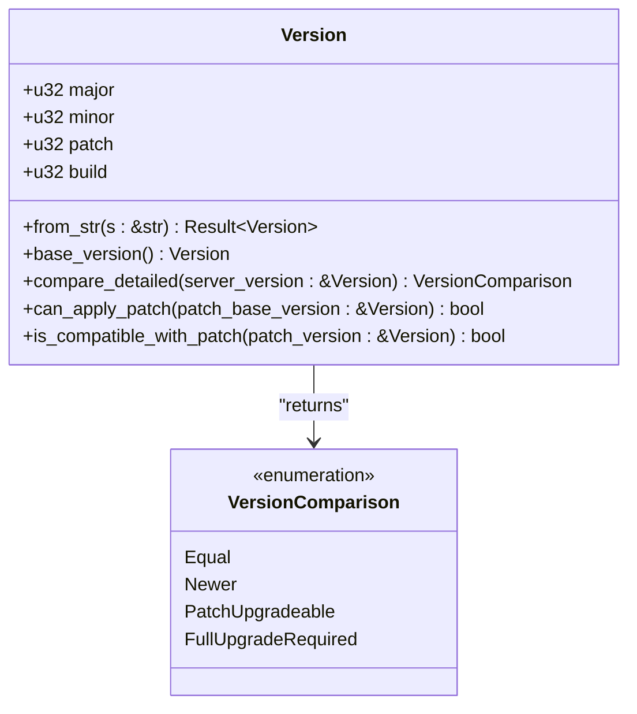
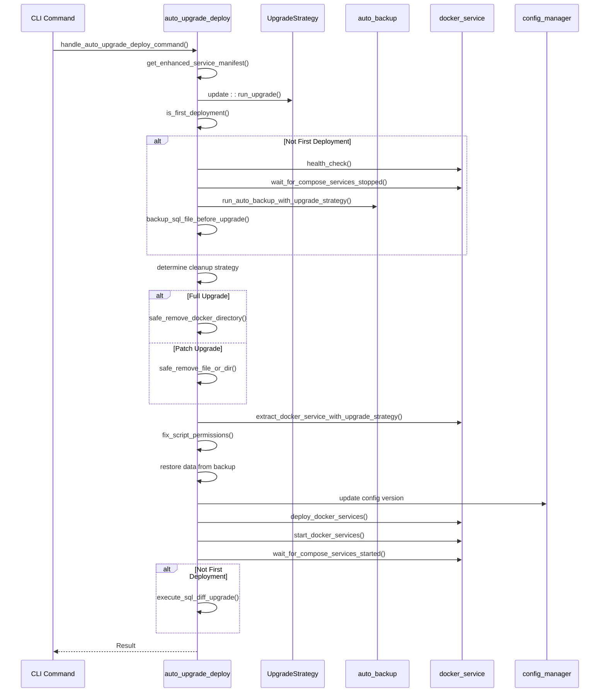
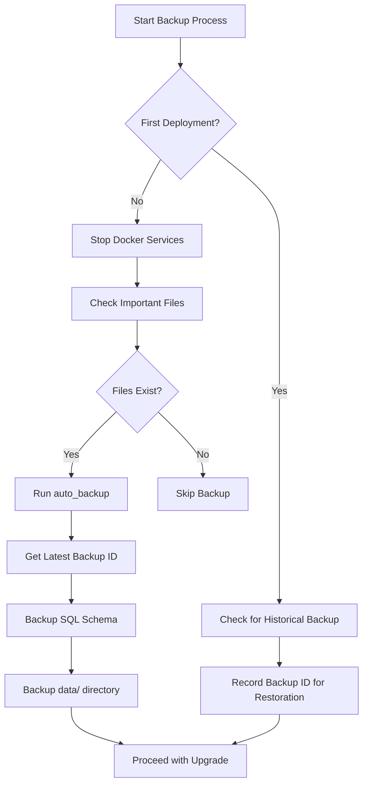
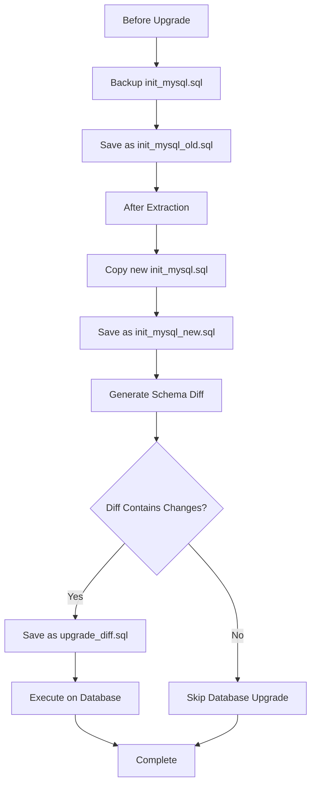
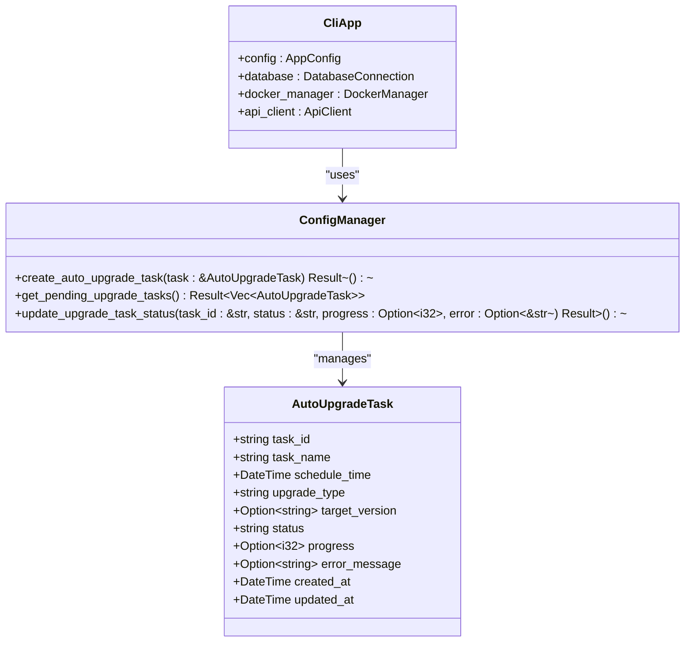
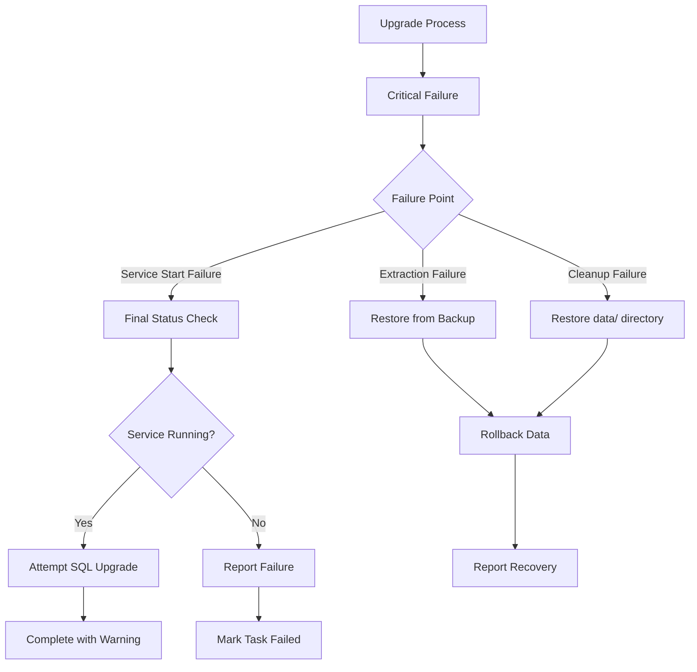

# Auto Upgrade Deploy Command

<cite>
**Referenced Files in This Document**   
- [auto_upgrade_deploy.rs](file://nuwax-cli/src/commands/auto_upgrade_deploy.rs#L0-L1127)
- [upgrade_strategy.rs](file://client-core/src/upgrade_strategy.rs#L0-L463)
- [version.rs](file://client-core/src/version.rs#L0-L410)
- [update.rs](file://nuwax-cli/src/commands/update.rs)
- [backup.rs](file://nuwax-cli/src/commands/backup.rs)
- [docker_service.rs](file://nuwax-cli/src/commands/docker_service.rs)
- [config_manager.rs](file://client-core/src/config_manager.rs)
</cite>

## Table of Contents
1. [Introduction](#introduction)
2. [Core Workflow Overview](#core-workflow-overview)
3. [Upgrade Strategy Decision Logic](#upgrade-strategy-decision-logic)
4. [Version Comparison System](#version-comparison-system)
5. [Detailed Execution Flow](#detailed-execution-flow)
6. [Backup and Data Protection](#backup-and-data-protection)
7. [SQL Schema Diff and Database Upgrade](#sql-schema-diff-and-database-upgrade)
8. [Configuration and State Management](#configuration-and-state-management)
9. [Error Handling and Recovery](#error-handling-and-recovery)
10. [Performance and Optimization](#performance-and-optimization)
11. [Troubleshooting Guide](#troubleshooting-guide)

## Introduction
The `auto-upgrade-deploy` command orchestrates the complete end-to-end upgrade workflow for the Duck Client application. This document provides a comprehensive analysis of its architecture, integration points, and execution logic. The command coordinates multiple critical operations including version checking, strategy selection, backup creation, package download, service redeployment, and database schema migration. It serves as the central automation engine for both patch and full upgrades, ensuring data integrity and system stability throughout the upgrade process.

## Core Workflow Overview

**Diagram sources**
- [auto_upgrade_deploy.rs](file://nuwax-cli/src/commands/auto_upgrade_deploy.rs#L50-L799)

**Section sources**
- [auto_upgrade_deploy.rs](file://nuwax-cli/src/commands/auto_upgrade_deploy.rs#L50-L799)

## Upgrade Strategy Decision Logic

The upgrade strategy is determined by the `UpgradeStrategyManager` which evaluates multiple factors to select between full, patch, or no upgrade. The decision process is implemented in the `determine_strategy` method.

**Diagram sources**
- [upgrade_strategy.rs](file://client-core/src/upgrade_strategy.rs#L150-L250)

**Section sources**
- [upgrade_strategy.rs](file://client-core/src/upgrade_strategy.rs#L150-L250)

### Strategy Types
The `UpgradeStrategy` enum defines three possible upgrade paths:

**UpgradeStrategy Types**
- **FullUpgrade**: Complete replacement of the docker directory
- **PatchUpgrade**: Incremental update of specific files and directories
- **NoUpgrade**: No action required (current version is up-to-date)

Each strategy contains metadata including download URLs, hashes, signatures, and target versions. The `get_changed_files` method returns the list of files that will be affected by the upgrade, which is used during the cleanup phase.

## Version Comparison System

The version comparison system uses a four-segment version format (major.minor.patch.build) to determine the appropriate upgrade strategy. The `Version` struct provides comprehensive version management capabilities.

**Diagram sources**
- [version.rs](file://client-core/src/version.rs#L100-L250)

**Section sources**
- [version.rs](file://client-core/src/version.rs#L100-L250)

### Version Comparison Logic
The `compare_detailed` method implements the core version comparison algorithm:

**Version Comparison Rules**
- **Equal**: Current version exactly matches server version
- **Newer**: Current version is more recent than server version
- **PatchUpgradeable**: Same base version (major.minor.patch) with higher build number on server
- **FullUpgradeRequired**: Different base versions

The system first compares base versions (ignoring build numbers). If base versions match, it compares build numbers to determine if a patch upgrade is possible. If base versions differ, a full upgrade is required.

## Detailed Execution Flow

The `run_auto_upgrade_deploy` function orchestrates the complete upgrade workflow through a series of coordinated steps:

**Diagram sources**
- [auto_upgrade_deploy.rs](file://nuwax-cli/src/commands/auto_upgrade_deploy.rs#L100-L799)

**Section sources**
- [auto_upgrade_deploy.rs](file://nuwax-cli/src/commands/auto_upgrade_deploy.rs#L100-L799)

### Key Integration Points
The command integrates with several core modules:

**Integration Components**
- **client-core::upgrade_strategy**: Determines upgrade type (full/patch)
- **client-core::version**: Compares version numbers and determines compatibility
- **nuwax-cli::commands::update**: Downloads and verifies upgrade packages
- **nuwax-cli::commands::backup**: Manages data backup and restoration
- **nuwax-cli::commands::docker_service**: Handles Docker service deployment and management

## Backup and Data Protection

The system implements a comprehensive data protection strategy that varies based on deployment type:

**Diagram sources**
- [auto_upgrade_deploy.rs](file://nuwax-cli/src/commands/auto_upgrade_deploy.rs#L200-L300)

**Section sources**
- [auto_upgrade_deploy.rs](file://nuwax-cli/src/commands/auto_upgrade_deploy.rs#L200-L300)

### Backup Scenarios
The system handles three distinct backup scenarios:

**Backup Scenarios**
- **Upgrade Deployment**: Creates a new backup before upgrade, preserves data directory
- **First Deployment with History**: Detects and can restore from historical backups
- **Clean First Deployment**: No backup operations performed

The `backup_data_before_cleanup` function creates a temporary backup of the `data/` directory before cleaning the docker directory, providing a safety net in case the upgrade fails during extraction.

## SQL Schema Diff and Database Upgrade

The system automatically generates and applies SQL schema differences between versions:

**Diagram sources**
- [auto_upgrade_deploy.rs](file://nuwax-cli/src/commands/auto_upgrade_deploy.rs#L600-L700)

**Section sources**
- [auto_upgrade_deploy.rs](file://nuwax-cli/src/commands/auto_upgrade_deploy.rs#L600-L700)

### Diff Generation Process
The SQL diff generation uses the `generate_schema_diff` function from the `sql_diff` module:

**Diff Generation Steps**
1. Preserve current SQL schema before upgrade
2. Extract new SQL schema from upgraded package
3. Compare old and new schemas using structural analysis
4. Generate migration script with appropriate DDL statements
5. Execute migration after service restart

The system filters out comment lines and empty lines when determining if meaningful changes exist, preventing unnecessary database operations.

## Configuration and State Management

The upgrade process maintains state through configuration files and database records:

**Diagram sources**
- [config_manager.rs](file://client-core/src/config_manager.rs)
- [auto_upgrade_deploy.rs](file://nuwax-cli/src/commands/auto_upgrade_deploy.rs#L400-L500)

**Section sources**
- [auto_upgrade_deploy.rs](file://nuwax-cli/src/commands/auto_upgrade_deploy.rs#L400-L500)

### Configuration Updates
After a successful upgrade, the system updates the configuration:

**Configuration Update Process**
- Reads current version from manifest
- Compares with existing configuration
- Updates `docker_versions` field if changed
- Persists changes to `config.toml`
- Maintains in-memory configuration consistency

The system includes error handling for configuration persistence failures, logging warnings but continuing execution to prevent upgrade rollback due to configuration file issues.

## Error Handling and Recovery

The system implements comprehensive error handling and recovery mechanisms:

**Diagram sources**
- [auto_upgrade_deploy.rs](file://nuwax-cli/src/commands/auto_upgrade_deploy.rs#L500-L799)

**Section sources**
- [auto_upgrade_deploy.rs](file://nuwax-cli/src/commands/auto_upgrade_deploy.rs#L500-L799)

### Recovery Scenarios
The system handles multiple failure scenarios:

**Recovery Mechanisms**
- **Extraction Failure**: Restores data from latest backup or temporary backup
- **Cleanup Failure**: Attempts to restore data directory from temporary backup
- **Service Start Timeout**: Performs final status check and attempts SQL upgrade if services are running
- **Partial Success**: Updates task status with progress and error information

The system prioritizes data integrity, ensuring that user data is preserved even when the upgrade process fails.

## Performance and Optimization

The upgrade process includes several performance optimizations:

**Performance Optimizations**
- **Incremental Updates**: Patch upgrades only replace changed files, reducing download size
- **Architecture-Specific Packages**: Downloads only the package for the current architecture
- **Parallel Operations**: Service stop/start operations are asynchronous
- **Efficient File Operations**: Uses batch file removal and optimized directory copying
- **Cache Utilization**: Reuses downloaded packages when possible

The system minimizes network usage by selecting the smallest appropriate package (patch vs full) based on version compatibility. It also optimizes disk I/O by only removing files that will be replaced in the new version.

## Troubleshooting Guide

Common issues and their solutions:

**Common Deployment Failures**
- **Service Stop Timeout**: Ensure all Docker containers are stopped manually before retrying
- **Permission Errors**: Verify script files have execute permissions after extraction
- **Disk Space Issues**: Ensure sufficient space for both old and new versions during upgrade
- **Network Failures**: Check connectivity to package download URLs
- **Database Migration Errors**: Verify SQL syntax compatibility between versions

**Diagnostic Commands**
- `auto-upgrade-deploy status`: Check current upgrade tasks and service status
- `docker-compose logs`: View container logs for startup issues
- `ls -la docker/`: Verify file permissions after extraction
- `df -h`: Check available disk space

**Recovery Procedures**
1. Identify failure point from logs
2. Manually stop any running containers
3. Restore from latest backup if necessary
4. Clean the docker directory
5. Retry the upgrade process

The system's modular design allows for targeted troubleshooting of specific upgrade phases.