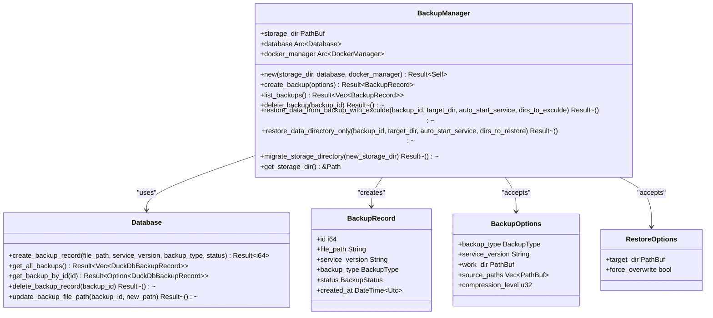
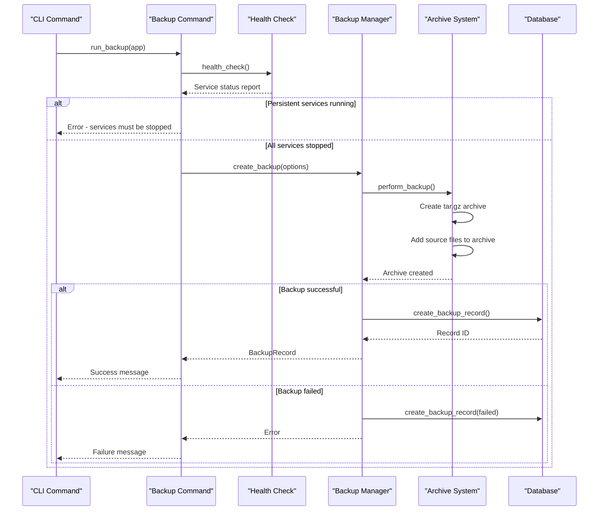
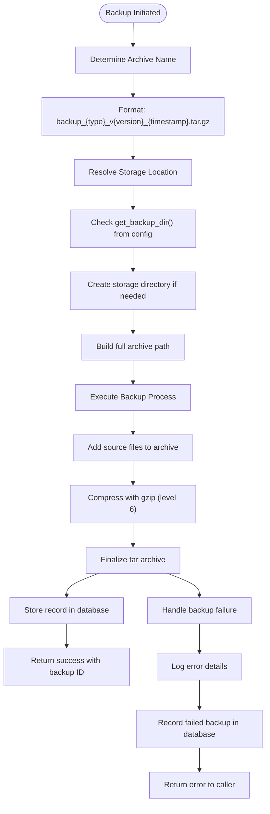
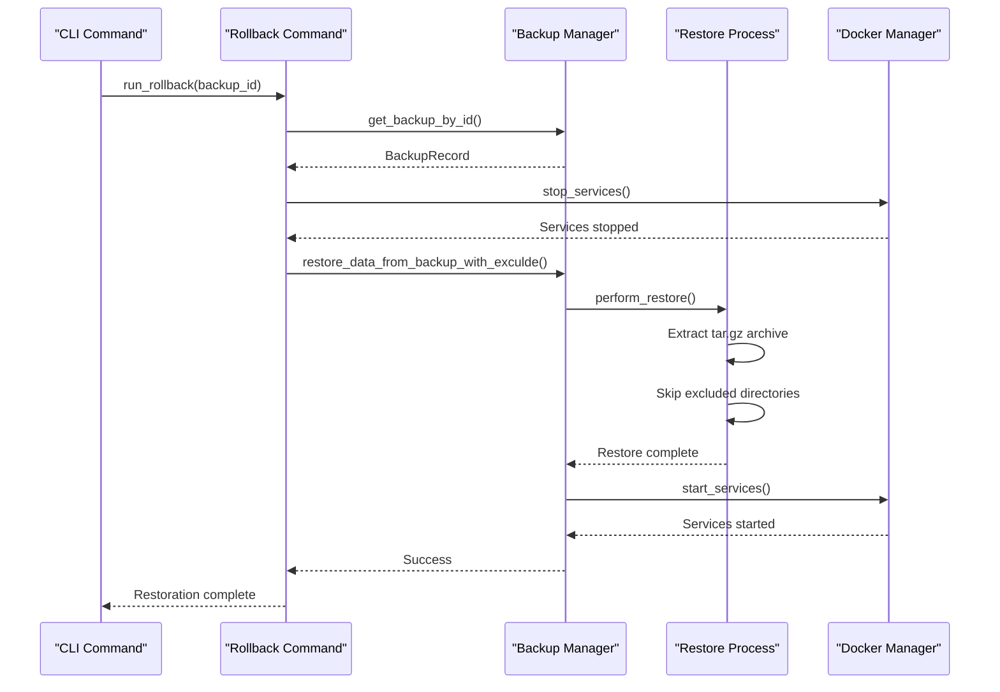
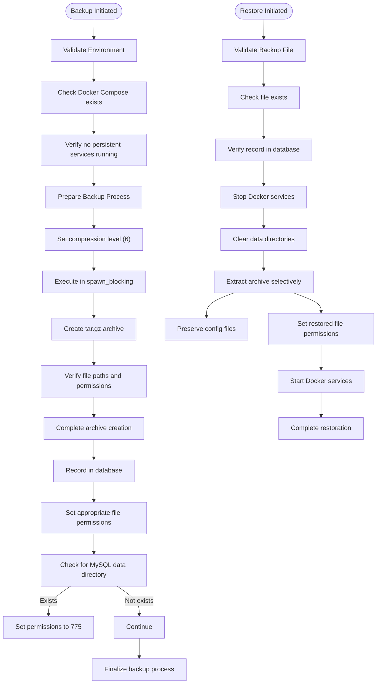

# Backup Command

<cite>
**Referenced Files in This Document**   
- [backup.rs](file://client-core/src/backup.rs)
- [backup.rs](file://nuwax-cli/src/commands/backup.rs)
- [constants.rs](file://client-core/src/constants.rs)
- [database.rs](file://client-core/src/database.rs)
</cite>

## Table of Contents
1. [Backup Command Overview](#backup-command-overview)
2. [Architecture and Integration](#architecture-and-integration)
3. [Backup Creation Process](#backup-creation-process)
4. [Archive Management and Storage](#archive-management-and-storage)
5. [Data Restoration and Rollback](#data-restoration-and-rollback)
6. [Security and Integrity Considerations](#security-and-integrity-considerations)
7. [Troubleshooting Common Issues](#troubleshooting-common-issues)
8. [Command Interface and Usage](#command-interface-and-usage)

## Backup Command Overview

The Backup Command provides a comprehensive solution for creating snapshot archives of service configurations and data volumes in the Duck Client system. This command enables proactive data protection through manual backups and automated pre-upgrade snapshots. The implementation follows a cold backup strategy, requiring services to be stopped before creating consistent snapshots of the system state.

The backup functionality is designed to capture critical application data while preserving configuration files that may contain environment-specific settings. This approach ensures that backups can be restored across different environments without overwriting essential configuration parameters. The system supports both full application state backups and selective data-only restoration, providing flexibility for different recovery scenarios.

**Section sources**
- [backup.rs](file://client-core/src/backup.rs#L1-L624)
- [backup.rs](file://nuwax-cli/src/commands/backup.rs#L0-L1033)

## Architecture and Integration

The backup system is implemented as a multi-layered architecture with clear separation of concerns between the command interface, business logic, and storage management components. The core functionality resides in the `BackupManager` class within the client-core module, which coordinates the backup and restoration processes.



**Diagram sources**
- [backup.rs](file://client-core/src/backup.rs#L1-L624)

**Section sources**
- [backup.rs](file://client-core/src/backup.rs#L1-L624)

## Backup Creation Process

The backup creation process follows a systematic approach to ensure data consistency and integrity. When a backup command is executed, the system first validates the Docker environment by checking for the existence of the docker-compose.yml file and assessing the current state of running containers.



**Diagram sources**
- [backup.rs](file://nuwax-cli/src/commands/backup.rs#L0-L1033)
- [backup.rs](file://client-core/src/backup.rs#L1-L624)

**Section sources**
- [backup.rs](file://nuwax-cli/src/commands/backup.rs#L0-L1033)
- [backup.rs](file://client-core/src/backup.rs#L1-L624)

The process begins with service state validation, where the system distinguishes between persistent services and one-shot containers. Persistent services must be stopped to ensure data consistency, while one-shot containers (identified by restart policy) are safely ignored during the backup process. This intelligent detection prevents unnecessary service interruptions while maintaining backup integrity.

Once the environment is validated, the `BackupManager` creates a compressed archive using the tar.gz format with configurable compression levels (default: 6). The archive includes specified source paths such as the data directory and application directory. During archiving, file paths are standardized to Unix-style separators for cross-platform compatibility, and relative paths are preserved within the archive structure.

## Archive Management and Storage

The backup system implements a structured approach to archive naming and storage location resolution. Backup files follow a consistent naming convention that includes the backup type, service version, and timestamp for easy identification and sorting.



**Diagram sources**
- [backup.rs](file://client-core/src/backup.rs#L1-L624)
- [constants.rs](file://client-core/src/constants.rs#L0-L522)

**Section sources**
- [backup.rs](file://client-core/src/backup.rs#L1-L624)
- [constants.rs](file://client-core/src/constants.rs#L0-L522)

The storage location is resolved through the application configuration, with the default path being the "backups" directory within the Docker working directory. The system ensures the storage directory exists before creating backups, automatically creating the directory structure when necessary.

Archive naming follows the pattern: `backup_{type}_v{version}_{timestamp}.tar.gz`, where:
- **type**: Either "manual" for user-initiated backups or "pre-upgrade" for automated upgrade preparation
- **version**: The current service version at the time of backup
- **timestamp**: UTC timestamp in YYYY-MM-DD_HH-MM-SS format

The system also provides storage management capabilities, including the ability to migrate the entire backup storage directory to a new location. During migration, all backup files are moved and database records are updated to reflect the new file paths, ensuring continuity of backup references.

## Data Restoration and Rollback

The restoration system provides multiple rollback strategies to accommodate different recovery scenarios. The primary restoration methods include full data recovery and selective data directory restoration, allowing users to recover application state while preserving current configuration files.



**Diagram sources**
- [backup.rs](file://nuwax-cli/src/commands/backup.rs#L0-L1033)
- [backup.rs](file://client-core/src/backup.rs#L1-L624)

**Section sources**
- [backup.rs](file://nuwax-cli/src/commands/backup.rs#L0-L1033)
- [backup.rs](file://client-core/src/backup.rs#L1-L624)

The restoration process begins with service termination to ensure data consistency during the recovery operation. The system then clears the target data directories while preserving configuration files such as docker-compose.yml and .env files. This selective cleanup ensures that environment-specific settings are maintained while outdated data is removed.

Two primary restoration modes are available:
1. **Full Recovery**: Restores both data and application directories while preserving top-level configuration files
2. **Data-Only Recovery**: Restores only the data directory, preserving both application files and configuration

The system supports interactive backup selection, allowing users to choose from available backups based on creation time, version, and file size. Before proceeding with restoration, the system validates the existence and integrity of the backup file and provides confirmation prompts to prevent accidental data loss.

## Security and Integrity Considerations

The backup system incorporates several security and integrity measures to protect data throughout the backup and restoration lifecycle. File permissions are carefully managed, particularly for sensitive data directories such as MySQL data storage.



**Diagram sources**
- [backup.rs](file://client-core/src/backup.rs#L1-L624)
- [backup.rs](file://nuwax-cli/src/commands/backup.rs#L0-L1033)

**Section sources**
- [backup.rs](file://client-core/src/backup.rs#L1-L624)
- [backup.rs](file://nuwax-cli/src/commands/backup.rs#L0-L1033)

The system performs integrity verification by recording backup status (completed or failed) in the database. Failed backups are still recorded to maintain an audit trail of backup attempts. The database records include the file path, service version, backup type, and creation timestamp, enabling comprehensive backup management.

During restoration, the system sets appropriate file permissions for critical directories, particularly the MySQL data directory, which requires specific permissions (775) to function correctly. This automatic permission setting reduces the risk of post-restoration configuration errors.

The backup process runs compression operations in a blocking task to prevent interference with the async runtime, ensuring that resource-intensive operations do not affect system responsiveness. File paths are carefully validated and standardized to prevent directory traversal vulnerabilities.

## Troubleshooting Common Issues

The system includes comprehensive error handling and diagnostic capabilities to assist with common backup and restoration issues. The following troubleshooting guide addresses frequent problems and their solutions.

**Locked Files and Running Services**
When persistent services are running during backup attempts, the system prevents the operation and provides clear diagnostic information:
- **Symptom**: "有持续运行的服务，无法进行冷备份"
- **Cause**: Persistent Docker containers are still running
- **Solution**: Stop services using `nuwax-cli docker-service stop` before attempting backup

**Insufficient Storage Space**
The system does not perform pre-backup storage checks but will fail during archive creation:
- **Symptom**: Backup creation fails with file I/O errors
- **Cause**: Insufficient disk space in backup directory
- **Solution**: Free up space or configure a different backup directory with adequate capacity

**Network-Mounted Volume Challenges**
When using network-mounted volumes for backup storage:
- **Symptom**: Slow backup performance or timeouts
- **Cause**: Network latency affecting file operations
- **Solution**: Use local storage for backups or increase timeout thresholds

**Missing Backup Files**
The system detects and reports missing backup files:
- **Symptom**: "备份文件不存在" error during restoration
- **Cause**: Backup file was moved, deleted, or storage path changed
- **Solution**: Verify backup file location or restore from alternative backup

**Permission Issues**
File permission problems, particularly with MySQL data:
- **Symptom**: Services fail to start after restoration
- **Cause**: Incorrect permissions on data directories
- **Solution**: The system automatically sets MySQL directory permissions to 775, but manual verification may be needed in complex environments

The system provides detailed logging at multiple levels (info, warn, error) to assist with diagnosis. The `list_backups` command includes file existence checks and displays warnings for missing backup files, helping users identify potential issues before attempting restoration.

**Section sources**
- [backup.rs](file://nuwax-cli/src/commands/backup.rs#L0-L1033)
- [backup.rs](file://client-core/src/backup.rs#L1-L624)

## Command Interface and Usage

The backup command provides a comprehensive interface for managing backup operations through both direct invocation and programmatic integration. The command supports multiple subcommands for different backup and restoration scenarios.

**Direct Invocation Examples**
```bash
# Create a manual backup
nuwax-cli backup

# List all available backups
nuwax-cli backup list

# Interactive rollback to a previous state
nuwax-cli rollback

# Rollback to a specific backup ID
nuwax-cli rollback 123

# Rollback only data directory (preserve app files)
nuwax-cli rollback --rollback-data

# List backups in JSON format (for GUI integration)
nuwax-cli backup list --json
```

**Success and Failure Handling**
The command provides clear output for both successful and failed operations:
- **Success**: Returns exit code 0 with confirmation messages including backup ID and file path
- **Failure**: Returns non-zero exit code with descriptive error messages and suggestions for resolution

**Output Formatting**
The system supports multiple output formats for different use cases:
- **Human-readable**: Formatted tables with backup details, sizes, and status indicators
- **JSON**: Structured JSON output for programmatic consumption by GUI applications
- **Minimal**: Compact output for scripting and automation scenarios

The command integrates with Docker volume inspection through the health check system, which examines container restart policies to distinguish between persistent services and one-shot tasks. This integration enables intelligent backup decisions without requiring manual intervention.

**Section sources**
- [backup.rs](file://nuwax-cli/src/commands/backup.rs#L0-L1033)