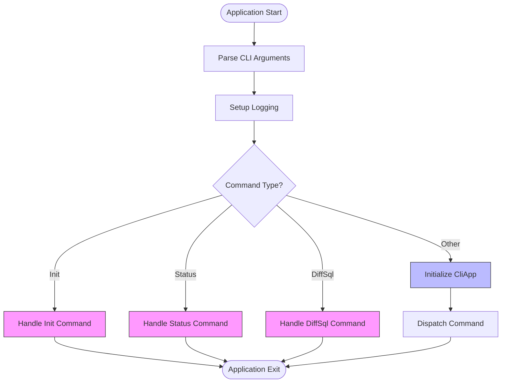
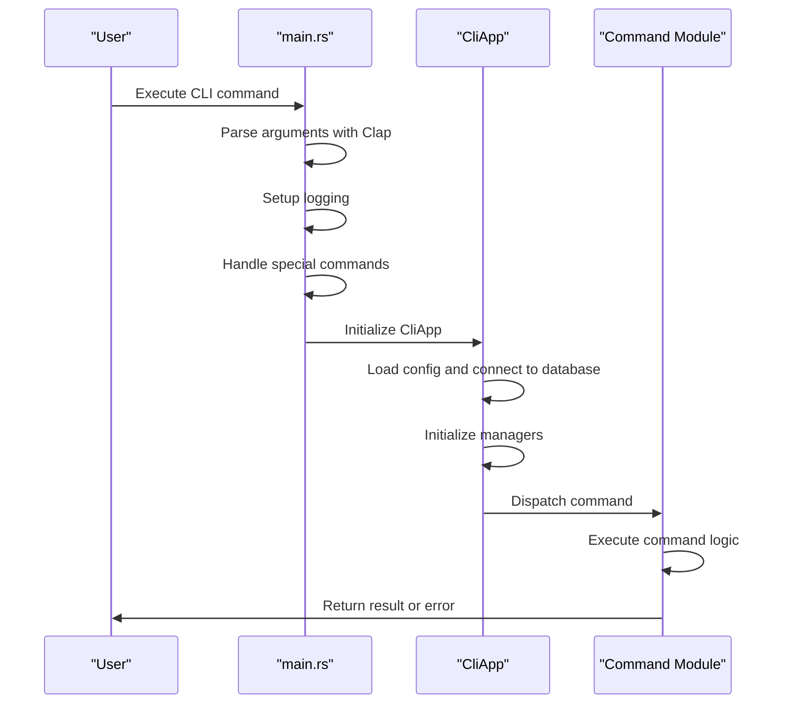
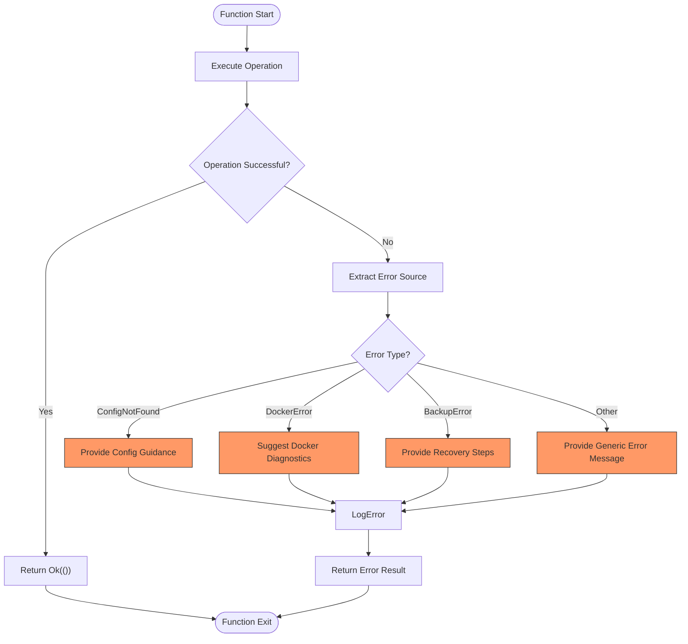

# CLI Command Structure

<cite>
**Referenced Files in This Document**   
- [main.rs](file://nuwax-cli/src/main.rs#L1-L102)
- [cli.rs](file://nuwax-cli/src/cli.rs#L1-L221)
- [lib.rs](file://nuwax-cli/src/lib.rs#L1-L28)
- [app.rs](file://nuwax-cli/src/app.rs#L1-L146)
- [commands/mod.rs](file://nuwax-cli/src/commands/mod.rs#L1-L41)
- [commands/status.rs](file://nuwax-cli/src/commands/status.rs#L1-L139)
- [commands/backup.rs](file://nuwax-cli/src/commands/backup.rs#L1-L1033)
- [commands/docker_service.rs](file://nuwax-cli/src/commands/docker_service.rs#L1-L536)
</cite>

## Table of Contents
1. [Project Structure and Command Organization](#project-structure-and-command-organization)
2. [Clap-Based Command Definition](#clap-based-command-definition)
3. [Command Registration and Export Mechanism](#command-registration-and-export-mechanism)
4. [CLI Initialization and Dispatch Flow](#cli-initialization-and-dispatch-flow)
5. [Special Command Handling in Main](#special-command-handling-in-main)
6. [Command Implementation Patterns](#command-implementation-patterns)
7. [Integration with Client-Core Library](#integration-with-client-core-library)
8. [Error Handling and Async Execution](#error-handling-and-async-execution)
9. [Best Practices and Maintenance Guidelines](#best-practices-and-maintenance-guidelines)

## Project Structure and Command Organization

The nuwax-cli application follows a modular Rust project structure with a clear separation of concerns. The CLI command implementations are organized under the `src/commands` directory, where each command or command group has its own dedicated module file. This modular approach enables maintainability and scalability of the CLI interface.

The command modules include:
- `auto_backup.rs`: Handles automatic backup operations
- `auto_upgrade_deploy.rs`: Manages automatic upgrade deployment
- `backup.rs`: Implements backup and rollback functionality
- `cache.rs`: Provides cache management commands
- `check_update.rs`: Handles client update checking
- `diff_sql.rs`: Implements SQL difference comparison
- `docker_service.rs`: Manages Docker service operations
- `ducker.rs`: Integrates with the ducker terminal application
- `status.rs`: Displays system status information
- `update.rs`: Handles update operations

This organization follows Rust's module system conventions, with each command file containing related functions and types that implement specific CLI functionality.

**Section sources**
- [commands/mod.rs](file://nuwax-cli/src/commands/mod.rs#L1-L41)

## Clap-Based Command Definition

The nuwax-cli application uses the Clap crate to define its command-line interface structure. The command definitions are centralized in `cli.rs`, where the `Cli` struct serves as the root command parser. Clap's derive macros enable declarative definition of commands, subcommands, arguments, and flags.

The `Cli` struct is annotated with `#[derive(Parser)]` and configured with metadata such as name, version, description, and author information. It contains two primary fields:
- `config`: A `PathBuf` field for specifying the configuration file path with a default value of "config.toml"
- `verbose`: A boolean flag for enabling detailed output
- `command`: An enum field marked with `#[command(subcommand)]` that contains all available subcommands

The `Commands` enum defines all top-level commands available in the CLI, using Clap's `Subcommand` derive to create a hierarchical command structure. Each variant represents a distinct command, with some commands containing nested subcommands through associated enums.

For example, the `UpgradeArgs` struct defines parameters for the upgrade command:
```rust
#[derive(Args, Debug)]
pub struct UpgradeArgs {
    #[arg(long)]
    pub force: bool,
    #[arg(long)]
    pub check: bool,
}
```

Similarly, command groups like `AutoBackupCommand`, `AutoUpgradeDeployCommand`, and `CheckUpdateCommand` are defined as separate enums that are then used as associated data in the main `Commands` enum, creating a nested subcommand structure.

**Section sources**
- [cli.rs](file://nuwax-cli/src/cli.rs#L1-L221)

## Command Registration and Export Mechanism

The command registration and export system in nuwax-cli follows Rust's module visibility patterns to provide a clean API surface. The `commands/mod.rs` file serves as the central hub for exporting command implementations, using both module declarations and selective function re-exports.

The file begins with public module declarations for each command file:
```rust
pub mod auto_backup;
pub mod auto_upgrade_deploy;
// ... other modules
```

Following the module declarations, the file uses `pub use` statements to selectively export specific functions from each command module. This pattern allows the library to control its public API surface while keeping implementation details private.

For example, status-related functions are exported as:
```rust
pub use status::{run_api_info, run_status, run_status_details, show_client_version};
```

Similarly, backup commands are exported with:
```rust
pub use backup::{run_backup, run_list_backups};
```

This export pattern continues for other command groups, with specialized handler functions for command groups like auto backup, auto upgrade deploy, and cache management. The `lib.rs` file then re-exports these command functions, making them available to the rest of the application.

This layered export system provides several benefits:
- Encapsulation of implementation details within command modules
- Centralized control over the public API
- Clear separation between command interface and implementation
- Easy maintenance and refactoring of command logic

**Section sources**
- [commands/mod.rs](file://nuwax-cli/src/commands/mod.rs#L1-L41)
- [lib.rs](file://nuwax-cli/src/lib.rs#L1-L28)

## CLI Initialization and Dispatch Flow

The CLI initialization and command dispatch flow begins in `main.rs`, which serves as the entry point for the application. The flow follows a structured pattern that handles special commands before initializing the main application context.

The process starts with parsing command-line arguments using Clap's `Parser::parse()` method:
```rust
let cli = Cli::parse();
```

After argument parsing, the application sets up logging based on the verbose flag:
```rust
setup_logging(cli.verbose);
```

The dispatch logic then handles special commands that don't require full application initialization. These include:
- `Init`: Handled immediately without configuration loading
- `Status`: Special handling to provide basic information even if configuration fails
- `DiffSql`: Pure file operation that doesn't require database initialization

For these special cases, the application uses pattern matching to identify the command and execute the appropriate handler function directly, bypassing the normal initialization flow.

For all other commands, the application initializes the `CliApp` instance using `CliApp::new_with_auto_config().await`. This method loads configuration, connects to the database, and initializes various managers for Docker, backup, upgrade, and API operations.

Once the application context is established, the command is dispatched through the `run_command` method, which matches on the command enum and calls the appropriate handler function with the application context.



**Diagram sources**
- [main.rs](file://nuwax-cli/src/main.rs#L1-L102)

**Section sources**
- [main.rs](file://nuwax-cli/src/main.rs#L1-L102)

## Special Command Handling in Main

The `main.rs` file implements special handling for certain commands that require unique initialization patterns or need to provide feedback even when configuration fails. This special handling ensures that users receive appropriate feedback in various scenarios.

The `Init` command is handled as a special case because it creates the initial configuration and doesn't require an existing configuration file. When this command is detected, the application calls `run_init(force).await` directly and exits after completion.

The `Status` command receives the most complex special handling. It first displays basic client version information unconditionally, then attempts to initialize the application to provide detailed status. If initialization fails, it provides user-friendly guidance on potential causes and solutions:

```rust
error!("⚠️  Unable to get complete status: {}", e);
info!("");
info!("💡 Possible causes:");
info!("   - Current directory is not a Nuwax Cli ent working directory");
info!("   - Configuration or database file not in current directory");
info!("   - Database file is in use by another process");
```

This approach ensures that users always receive some useful information, even when the application cannot be fully initialized.

The `DiffSql` command is another special case as it performs pure file operations without requiring database access or configuration. This allows users to compare SQL files regardless of their current working directory or configuration state.

These special handling patterns demonstrate a user-centric design approach, prioritizing clear feedback and actionable guidance over strict architectural consistency.

**Section sources**
- [main.rs](file://nuwax-cli/src/main.rs#L1-L102)

## Command Implementation Patterns

Command implementations in nuwax-cli follow consistent patterns across different modules, promoting maintainability and predictability. Each command module typically contains several related functions that handle specific aspects of the command's functionality.

The `status.rs` file demonstrates a clear pattern with three related functions:
- `show_client_version()`: Displays basic client information
- `run_status()`: Main entry point that combines version info with detailed status
- `run_status_details()`: Provides comprehensive system status information

This pattern of having a main function that orchestrates multiple specialized functions is repeated across command modules. For example, the `backup.rs` file contains numerous helper functions that support the main backup operations:

```rust
fn display_running_containers(containers: &Vec<&&ContainerInfo>)
fn display_container_summary(report: &HealthReport)
async fn check_docker_service_running(app_config: Arc<AppConfig>, docker_manager: Arc<DockerManager>) -> Result<bool>
```

These helper functions handle specific aspects of the command logic, such as UI presentation, status checking, and validation, while the main functions like `run_backup()` and `run_list_backups()` orchestrate the overall workflow.

The command functions typically follow Rust's error handling conventions, returning `Result<()>` and using the `anyhow` crate for error propagation. They also use structured logging with the `tracing` crate to provide detailed output that can be controlled via the verbose flag.



**Diagram sources**
- [status.rs](file://nuwax-cli/src/commands/status.rs#L1-L139)
- [backup.rs](file://nuwax-cli/src/commands/backup.rs#L1-L1033)

**Section sources**
- [status.rs](file://nuwax-cli/src/commands/status.rs#L1-L139)
- [backup.rs](file://nuwax-cli/src/commands/backup.rs#L1-L1033)
- [docker_service.rs](file://nuwax-cli/src/commands/docker_service.rs#L1-L536)

## Integration with Client-Core Library

The nuwax-cli application integrates closely with the `client-core` library to delegate business logic and data management responsibilities. This separation of concerns allows the CLI to focus on user interaction and command orchestration while leveraging the core library for domain-specific functionality.

The `app.rs` file demonstrates this integration by importing numerous types and traits from `client-core`:
```rust
use client_core::{
    api::ApiClient, authenticated_client::AuthenticatedClient, backup::BackupManager,
    config::AppConfig, constants::config, container::DockerManager, database::Database,
    upgrade::UpgradeManager,
};
```

The `CliApp` struct contains fields for various managers from the core library:
- `config`: Configuration management
- `database`: Database operations
- `api_client`: API communication
- `authenticated_client`: Authentication handling
- `docker_manager`: Docker container management
- `backup_manager`: Backup operations
- `upgrade_manager`: Upgrade operations

These managers are initialized in the `new_with_auto_config()` method, which coordinates their creation and dependency injection. For example, the `BackupManager` is created with references to the database and Docker manager:
```rust
let backup_manager = Arc::new(BackupManager::new(
    PathBuf::from(&config.backup.storage_dir),
    database.clone(),
    docker_manager.clone(),
));
```

The `lib.rs` file also re-exports key components from `client-core` to make them available to other parts of the application:
```rust
pub use client_core::{config_manager::ConfigManager, database_manager::DatabaseManager};
```

This integration pattern provides several advantages:
- Clear separation between CLI interface and business logic
- Reusability of core functionality across different interfaces
- Easier testing of business logic independent of the CLI
- Simplified maintenance and evolution of domain-specific code

**Section sources**
- [app.rs](file://nuwax-cli/src/app.rs#L1-L146)
- [lib.rs](file://nuwax-cli/src/lib.rs#L1-L28)

## Error Handling and Async Execution

The nuwax-cli application employs a comprehensive error handling strategy that combines Rust's type system with the `anyhow` crate for flexible error reporting. All command functions return `Result<()>`, allowing for consistent error propagation throughout the application.

The main error handling occurs in `main.rs`, where the top-level error handler converts errors to user-friendly messages and exits with an appropriate status code:
```rust
if let Err(e) = run_init(force).await {
    error!("❌ Initialization failed: {}", e);
    std::process::exit(1);
}
```

For commands that go through the `CliApp::run_command()` method, errors are similarly handled with descriptive messages and non-zero exit codes. The application uses the `tracing` crate for structured logging, with different log levels (info, warn, error) to provide appropriate feedback based on the severity of the situation.

All command execution is asynchronous, leveraging Rust's async/await syntax for non-blocking operations. The `#[tokio::main]` macro in `main.rs` sets up the async runtime, allowing the application to perform I/O operations efficiently.

The error handling patterns vary slightly depending on the command type:
- For initialization errors, the application provides specific guidance on how to resolve configuration issues
- For Docker service errors, it suggests diagnostic commands like `docker-compose ps`
- For backup and restore operations, it provides detailed recovery suggestions

The application also handles error sources to provide more specific feedback. For example, when configuration fails to load, it checks the error chain for `ConfigNotFound` to provide a targeted message:
```rust
let mut is_config_not_found = false;
while let Some(err) = source {
    if err.downcast_ref::<DuckError>().is_some() {
        if let Some(DuckError::ConfigNotFound) = err.downcast_ref::<DuckError>() {
            is_config_not_found = true;
            break;
        }
    }
    source = err.source();
}
```

This sophisticated error handling ensures that users receive actionable feedback regardless of where an error occurs in the application.



**Diagram sources**
- [main.rs](file://nuwax-cli/src/main.rs#L1-L102)
- [app.rs](file://nuwax-cli/src/app.rs#L1-L146)

**Section sources**
- [main.rs](file://nuwax-cli/src/main.rs#L1-L102)
- [app.rs](file://nuwax-cli/src/app.rs#L1-L146)

## Best Practices and Maintenance Guidelines

The nuwax-cli command structure exemplifies several best practices for building maintainable CLI applications in Rust. These practices ensure consistency, readability, and ease of maintenance as the application evolves.

### Command Naming Conventions
The application follows consistent naming conventions for commands and subcommands:
- Top-level commands use lowercase names (status, backup, upgrade)
- Subcommands use descriptive names that clearly indicate their purpose
- Command groups follow a consistent pattern (auto_backup, auto_upgrade_deploy)

### Help Text Standards
The help text for commands and arguments is comprehensive and user-focused:
- Each command has a clear description of its purpose
- Arguments include detailed help text explaining their function
- Default values are documented where applicable
- Examples are implied through parameter descriptions

### Async Command Patterns
All command functions are async, following a consistent pattern:
```rust
pub async fn run_command(app: &CliApp) -> Result<()>
```
This ensures that all I/O operations are non-blocking and that the application can handle multiple operations efficiently.

### Error Handling Consistency
The application maintains consistent error handling across all commands:
- All command functions return `Result<()>`
- Errors are propagated using the `?` operator
- Top-level error handling provides user-friendly messages
- Specific error types trigger targeted guidance

### Module Organization
The modular organization of commands provides several maintenance benefits:
- Each command group is isolated in its own file
- Related functionality is co-located
- Dependencies are explicit and manageable
- Testing can be focused on specific command groups

### Future Enhancement Recommendations
To further improve the command structure, consider the following enhancements:
1. **Command Configuration**: Introduce a configuration system for command behavior that can be overridden by command-line arguments
2. **Command Composition**: Implement reusable command components for common operations like confirmation prompts or progress reporting
3. **Command Testing**: Expand integration tests for command workflows, particularly for error conditions
4. **Command Documentation**: Generate comprehensive command documentation from the Clap definitions
5. **Command Validation**: Implement pre-execution validation to catch configuration issues before command execution

These practices and recommendations ensure that the CLI remains maintainable and user-friendly as new features are added.

**Section sources**
- [cli.rs](file://nuwax-cli/src/cli.rs#L1-L221)
- [commands/mod.rs](file://nuwax-cli/src/commands/mod.rs#L1-L41)
- [main.rs](file://nuwax-cli/src/main.rs#L1-L102)