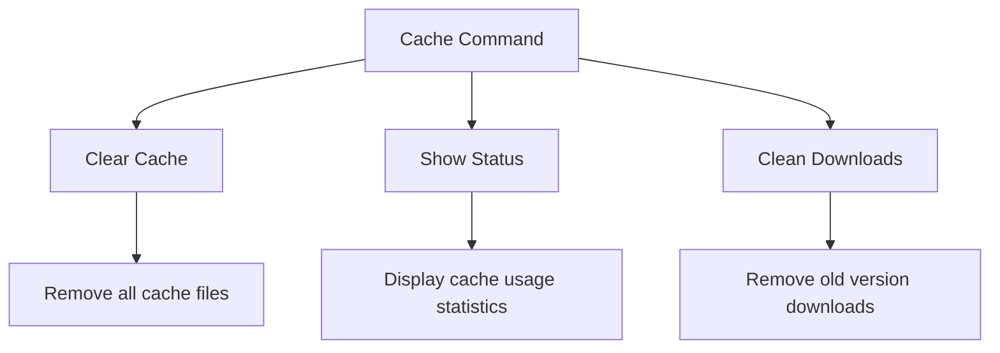
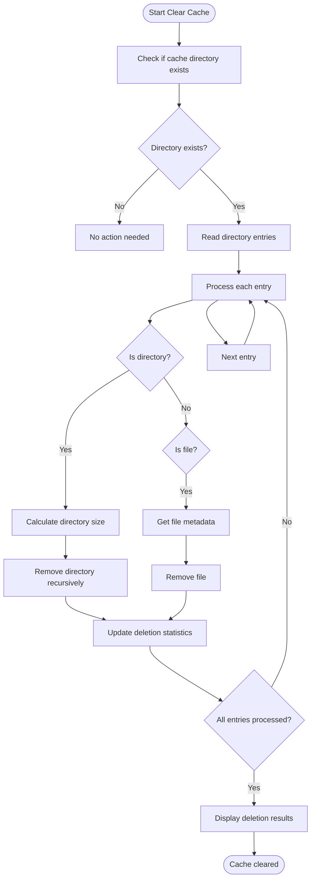
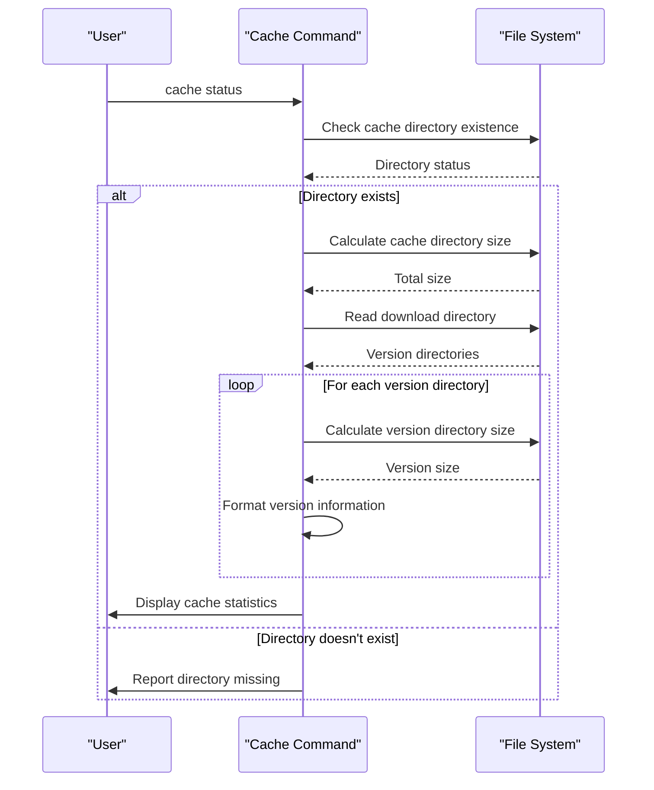
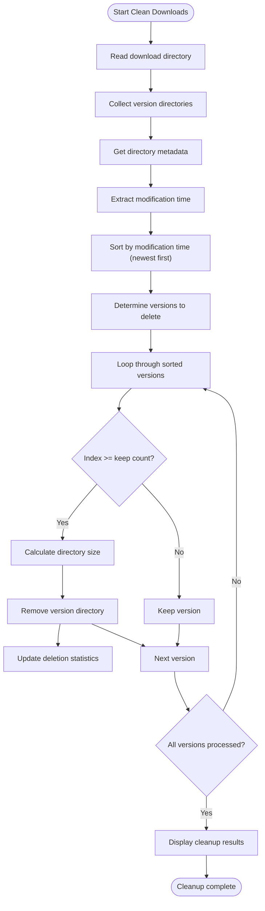
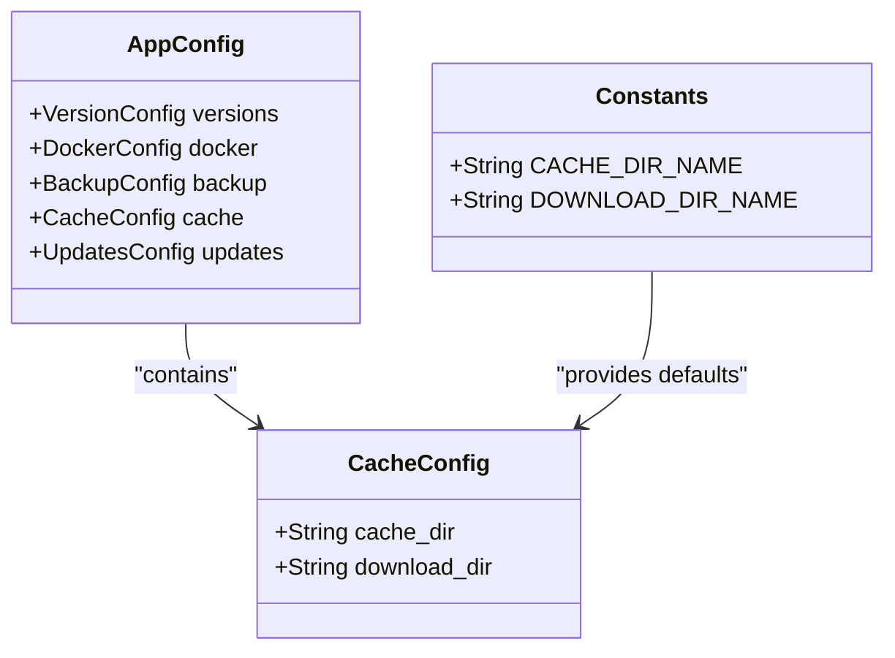
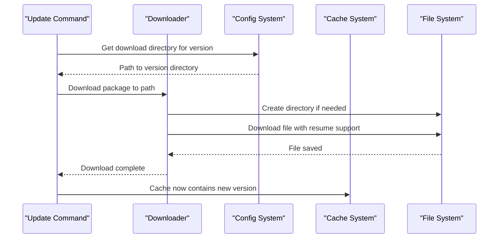

# Cache Command

<cite>
**Referenced Files in This Document**   
- [cache.rs](file://nuwax-cli/src/commands/cache.rs)
- [cli.rs](file://nuwax-cli/src/cli.rs)
- [config.rs](file://client-core/src/config.rs)
- [constants.rs](file://client-core/src/constants.rs)
- [downloader.rs](file://client-core/src/downloader.rs)
</cite>

## Table of Contents
1. [Introduction](#introduction)
2. [Cache Command Overview](#cache-command-overview)
3. [Subcommands and Functionality](#subcommands-and-functionality)
4. [Cache Configuration and Structure](#cache-configuration-and-structure)
5. [Integration with Downloading System](#integration-with-downloading-system)
6. [Performance and Optimization](#performance-and-optimization)
7. [Common Issues and Troubleshooting](#common-issues-and-troubleshooting)
8. [Usage Examples](#usage-examples)

## Introduction
The Cache Command is a core utility within the nuwax-cli toolset designed to manage local storage of downloaded update packages and service artifacts. It plays a critical role in optimizing bandwidth usage and accelerating repeated deployments by maintaining a local repository of previously downloaded content. This document provides a comprehensive analysis of the cache command's architecture, functionality, and integration points within the system.

**Section sources**
- [cache.rs](file://nuwax-cli/src/commands/cache.rs)
- [cli.rs](file://nuwax-cli/src/cli.rs)

## Cache Command Overview
The cache command provides a suite of tools for managing the local cache used by the application to store downloaded update packages and service artifacts. Its primary purpose is to optimize bandwidth usage by preventing redundant downloads and to accelerate deployment operations by reusing previously downloaded content. The command interacts directly with the filesystem through the client-core configuration system and implements various cache management strategies.

The cache system is structured around two main directories:
- **Cache root directory**: Stores general cache files and metadata
- **Download directory**: Specifically stores downloaded update packages organized by version

This separation allows for targeted cache operations and efficient management of downloaded artifacts.



**Diagram sources**
- [cache.rs](file://nuwax-cli/src/commands/cache.rs)
- [config.rs](file://client-core/src/config.rs)

**Section sources**
- [cache.rs](file://nuwax-cli/src/commands/cache.rs)
- [cli.rs](file://nuwax-cli/src/cli.rs)

## Subcommands and Functionality
The cache command provides three main subcommands for managing the local cache system, each serving a specific purpose in the cache lifecycle management.

### Clear Cache
The `clear` subcommand removes all files and directories within the cache root directory. This operation is comprehensive and affects all cached content, not just downloaded packages.



**Diagram sources**
- [cache.rs](file://nuwax-cli/src/commands/cache.rs#L31-L67)

**Section sources**
- [cache.rs](file://nuwax-cli/src/commands/cache.rs#L31-L67)

### Status Display
The `status` subcommand provides detailed information about cache usage, including total size and breakdown of downloaded versions. It calculates directory sizes and presents the information in a human-readable format.



**Diagram sources**
- [cache.rs](file://nuwax-cli/src/commands/cache.rs#L69-L115)

**Section sources**
- [cache.rs](file://nuwax-cli/src/commands/cache.rs#L69-L115)

### Download Cleanup
The `clean-downloads` subcommand implements an automated retention policy by removing older version downloads while preserving the most recent ones. This helps manage disk space while maintaining access to recent versions.



**Diagram sources**
- [cache.rs](file://nuwax-cli/src/commands/cache.rs#L117-L178)

**Section sources**
- [cache.rs](file://nuwax-cli/src/commands/cache.rs#L117-L178)

## Cache Configuration and Structure
The cache system is configured through the client-core configuration module, which defines the directory structure and default paths for cache storage.

### Configuration Structure
The cache configuration is defined in the `CacheConfig` struct within the client-core module, containing two key properties:

**CacheConfig**
- **cache_dir**: Root directory for all cache files
- **download_dir**: Subdirectory for storing downloaded update packages

These paths are initialized with default values from the constants module and can be customized in the configuration file.



**Diagram sources**
- [config.rs](file://client-core/src/config.rs#L180-L200)
- [constants.rs](file://client-core/src/constants.rs#L450-L470)

**Section sources**
- [config.rs](file://client-core/src/config.rs#L180-L200)
- [constants.rs](file://client-core/src/constants.rs#L450-L470)

### Directory Structure
The cache system follows a hierarchical structure with the download directory containing version-specific subdirectories:

```
cacheDuckData/
├── download/
│   ├── 0.0.1/
│   │   ├── full/
│   │   └── patch/
│   ├── 0.0.2/
│   │   ├── full/
│   │   └── patch/
│   └── 0.0.3/
│       ├── full/
│       └── patch/
└── [other cache files]
```

This structure allows for efficient organization and retrieval of downloaded artifacts by version.

## Integration with Downloading System
The cache command is tightly integrated with the downloading system, which stores downloaded update packages in the cache directory structure.

### Download Process Integration
When update packages are downloaded, they are stored in version-specific directories within the download cache. The downloader module uses the configuration system to determine the appropriate storage location.



**Diagram sources**
- [downloader.rs](file://client-core/src/downloader.rs#L200-L400)
- [config.rs](file://client-core/src/config.rs#L300-L350)

**Section sources**
- [downloader.rs](file://client-core/src/downloader.rs#L200-L400)
- [config.rs](file://client-core/src/config.rs#L300-L350)

### Metadata Tracking
The downloading system implements sophisticated metadata tracking to support features like resume downloads and integrity verification. Download metadata is stored alongside the downloaded files, enabling the system to resume interrupted downloads and verify file integrity.

Key metadata includes:
- **URL**: Source URL of the download
- **Expected size**: Total file size
- **Expected hash**: SHA-256 hash for integrity verification
- **Downloaded bytes**: Progress tracking
- **Timestamps**: Start and last update times

This metadata system enables the cache command to make intelligent decisions about which files can be resumed or need to be re-downloaded.

## Performance and Optimization
The cache system is designed with performance considerations in mind, balancing disk usage, network efficiency, and operational speed.

### Size and Structure Implications
The cache size directly impacts both disk usage and performance. A larger cache reduces network bandwidth consumption but increases disk space requirements. The hierarchical structure with version-specific directories enables efficient cleanup operations.

Key performance characteristics:
- **Directory traversal**: O(n) where n is the number of cache entries
- **Size calculation**: O(m) where m is the total number of files in directories
- **Cleanup operations**: O(k log k) where k is the number of version directories (due to sorting)

The system uses efficient filesystem operations and avoids loading unnecessary data into memory during cache operations.

### Caching Strategies
The system implements several caching strategies to optimize performance:

1. **Version-based retention**: Keeps multiple recent versions available for quick redeployment
2. **Automated cleanup**: Removes older versions based on configurable retention policies
3. **Integrity verification**: Uses hash validation to ensure cached files are not corrupted
4. **Resume support**: Allows resuming interrupted downloads, reducing bandwidth usage

These strategies work together to create an efficient caching system that minimizes network usage while maintaining reliability.

## Common Issues and Troubleshooting
The cache system may encounter various issues that require troubleshooting and resolution.

### Corruption Detection
The system includes mechanisms for detecting corrupted cache entries through hash verification. When a file's hash does not match the expected value, the system identifies it as corrupted and can take appropriate action.

Detection workflow:
1. Calculate hash of cached file
2. Compare with expected hash from metadata
3. If mismatch, mark as corrupted
4. Remove corrupted file and associated metadata
5. Initiate fresh download

### Stale Entries
Stale entries can occur when version directories remain after their content is no longer needed. The cleanup command addresses this by removing older versions based on modification time.

Prevention strategies:
- Always update modification time when using a version
- Implement regular cleanup schedules
- Monitor cache growth patterns

### Concurrent Access
During upgrades, multiple processes may attempt to access the cache simultaneously. The system handles this through:
- Filesystem-level locking where appropriate
- Atomic operations for cache modifications
- Error handling for concurrent access conflicts

The cache command operations are designed to be idempotent, allowing safe repetition if interrupted.

## Usage Examples
The cache command provides practical tools for managing the local cache in various scenarios.

### Manual Cache Management
```bash
# Display current cache status
nuwax-cli cache status

# Clean all cache files
nuwax-cli cache clear

# Clean download cache, keeping only the 2 most recent versions
nuwax-cli cache clean-downloads --keep 2
```

### Automated Retention Policies
The system can be integrated into automated workflows to maintain optimal cache size:

```bash
# Daily cleanup script
#!/bin/bash
echo "Starting daily cache maintenance"
nuwax-cli cache clean-downloads --keep 3
echo "Cache maintenance completed"

# Monitor cache size and alert if too large
SIZE=$(nuwax-cli cache status | grep "Total size" | awk '{print $3}')
if (( $(echo "$SIZE > 1000" | bc -l) )); then
    echo "Warning: Cache size exceeds 1000MB"
    nuwax-cli cache clean-downloads --keep 2
fi
```

These examples demonstrate how the cache command can be used both interactively and in automated scripts to maintain an efficient caching system.

**Section sources**
- [cache.rs](file://nuwax-cli/src/commands/cache.rs)
- [cli.rs](file://nuwax-cli/src/cli.rs)