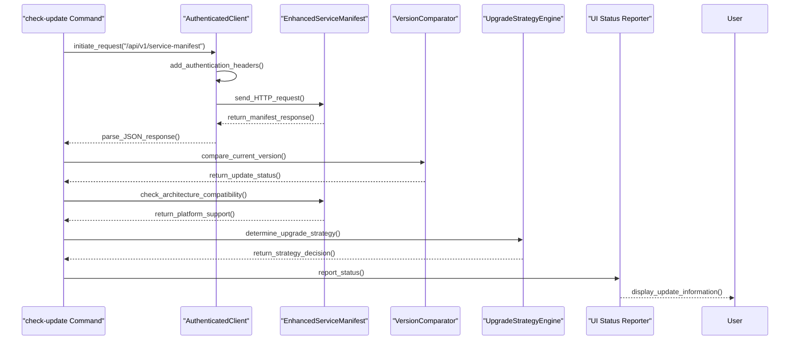
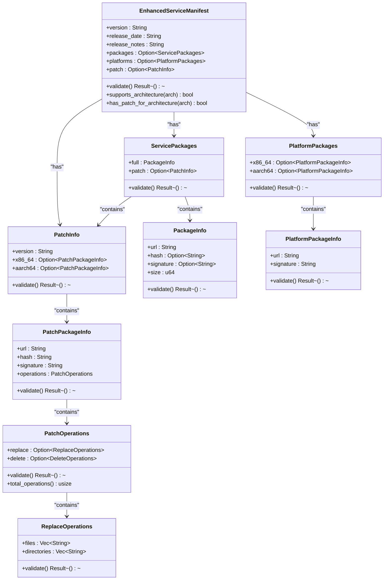
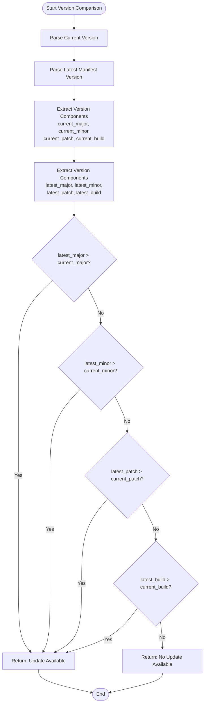
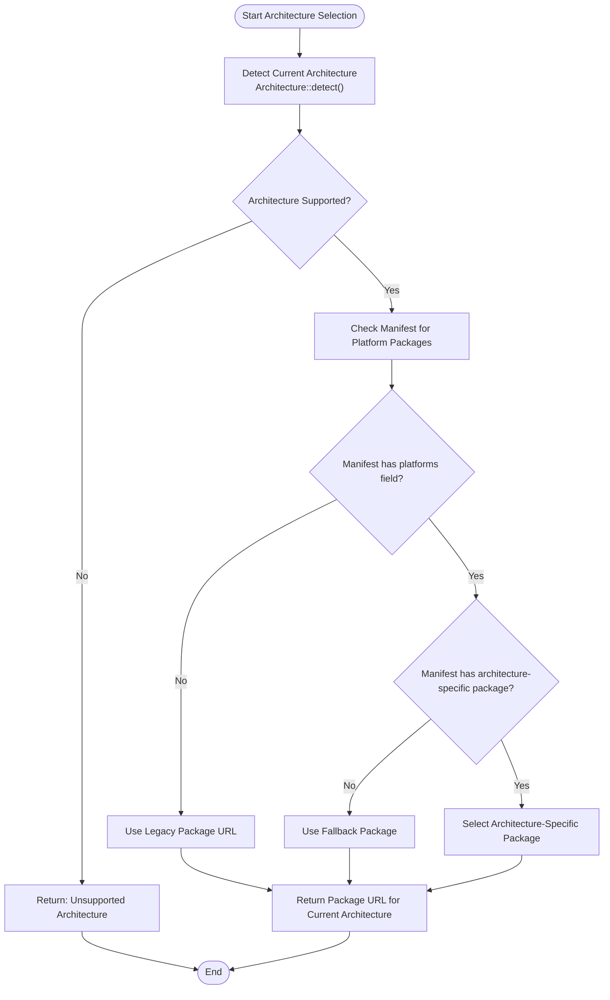
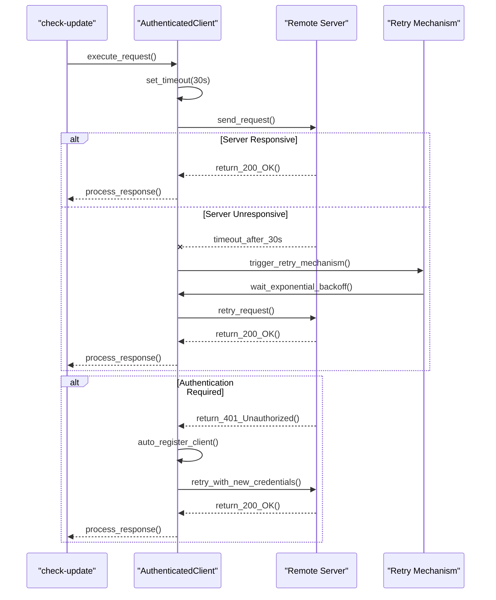
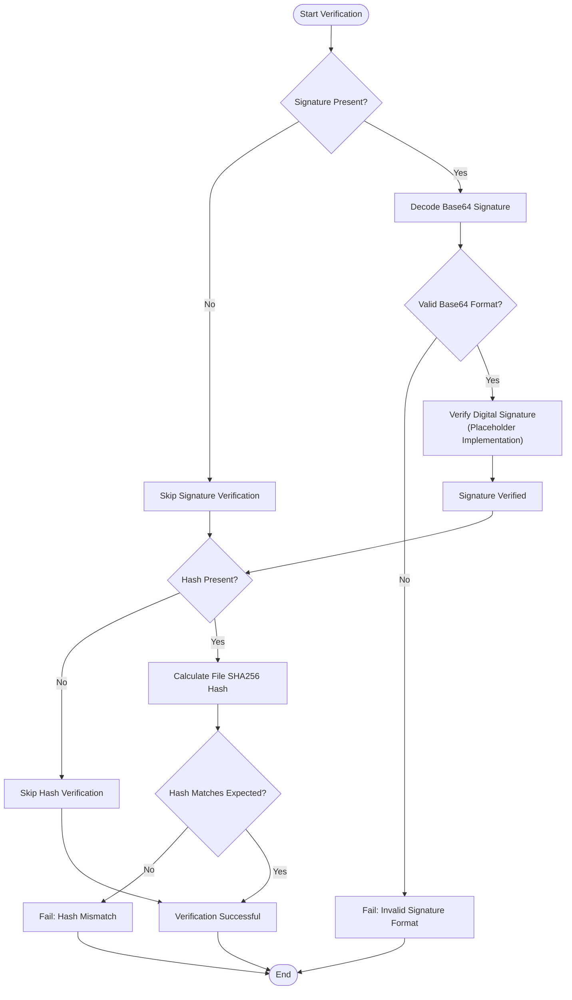
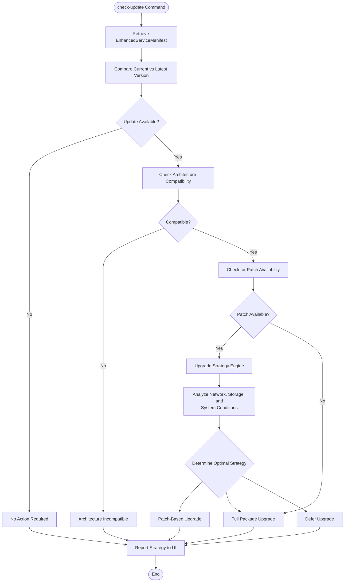
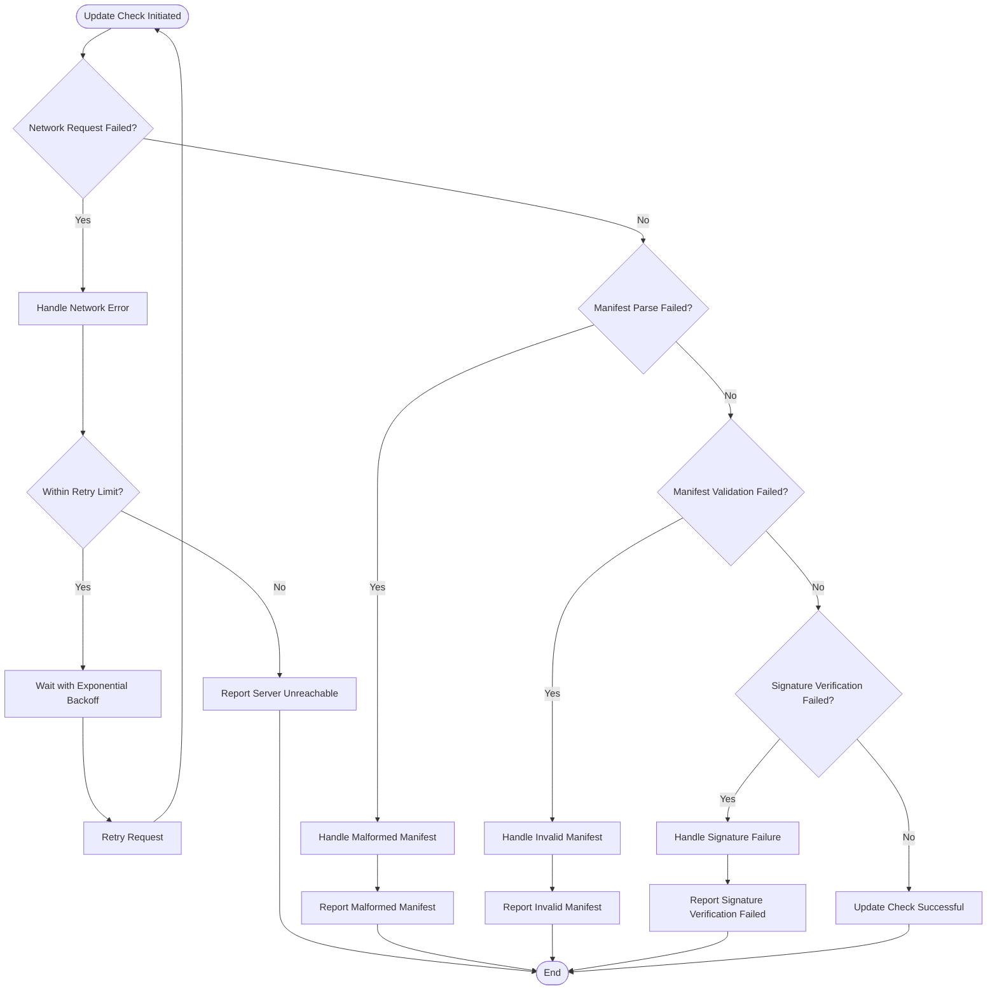

# Check Update Command

<cite>
**Referenced Files in This Document**   
- [check_update.rs](file://nuwax-cli/src/commands/check_update.rs)
- [architecture.rs](file://client-core/src/architecture.rs)
- [api_types.rs](file://client-core/src/api_types.rs)
- [version.rs](file://client-core/src/version.rs)
- [patch_processor.rs](file://client-core/src/patch_executor/patch_processor.rs)
- [authenticated_client.rs](file://client-core/src/authenticated_client.rs)
</cite>

## Table of Contents
1. [Introduction](#introduction)
2. [Update Checking Workflow](#update-checking-workflow)
3. [EnhancedServiceManifest Structure](#enhancedservicemanifest-structure)
4. [Version Comparison Logic](#version-comparison-logic)
5. [Architecture-Specific Package Selection](#architecture-specific-package-selection)
6. [Network Request Handling](#network-request-handling)
7. [Signature Verification Process](#signature-verification-process)
8. [Integration with Upgrade Strategy](#integration-with-upgrade-strategy)
9. [Edge Case Handling](#edge-case-handling)
10. [Troubleshooting Guide](#troubleshooting-guide)

## Introduction
The `check-update` command is responsible for querying remote servers to determine if service updates are available. It retrieves and parses the EnhancedServiceManifest, compares the current version using client-core::version, and determines update availability based on version numbers, architecture compatibility, and patch availability. The command integrates with the upgrade strategy decision engine and provides status reporting to the UI.

**Section sources**
- [check_update.rs](file://nuwax-cli/src/commands/check_update.rs#L1-L200)

## Update Checking Workflow
The update checking process follows a structured sequence of operations to determine if an update is available:

**Diagram sources**
- [check_update.rs](file://nuwax-cli/src/commands/check_update.rs#L15-L150)
- [authenticated_client.rs](file://client-core/src/authenticated_client.rs#L50-L120)

**Section sources**
- [check_update.rs](file://nuwax-cli/src/commands/check_update.rs#L1-L150)

## EnhancedServiceManifest Structure
The EnhancedServiceManifest contains comprehensive information about available service updates, including version details, package URLs, and platform-specific information.

**Diagram sources**
- [api_types.rs](file://client-core/src/api_types.rs#L100-L300)

**Section sources**
- [api_types.rs](file://client-core/src/api_types.rs#L100-L300)

## Version Comparison Logic
The version comparison system uses semantic versioning principles to determine if a newer version is available. The comparison considers major, minor, patch, and build numbers.

**Diagram sources**
- [version.rs](file://client-core/src/version.rs#L20-L100)

**Section sources**
- [version.rs](file://client-core/src/version.rs#L1-L150)

## Architecture-Specific Package Selection
The system automatically detects the current hardware architecture and selects the appropriate package from the manifest based on platform compatibility.

**Diagram sources**
- [architecture.rs](file://client-core/src/architecture.rs#L50-L200)
- [api_types.rs](file://client-core/src/api_types.rs#L250-L300)

**Section sources**
- [architecture.rs](file://client-core/src/architecture.rs#L1-L250)
- [api_types.rs](file://client-core/src/api_types.rs#L200-L350)

## Network Request Handling
The network request system implements timeout policies and retry mechanisms to handle unreliable network conditions and server responsiveness.

**Diagram sources**
- [authenticated_client.rs](file://client-core/src/authenticated_client.rs#L100-L200)
- [patch_processor.rs](file://client-core/src/patch_executor/patch_processor.rs#L50-L100)

**Section sources**
- [authenticated_client.rs](file://client-core/src/authenticated_client.rs#L50-L250)
- [patch_processor.rs](file://client-core/src/patch_executor/patch_processor.rs#L1-L150)

## Signature Verification Process
The signature verification process ensures the authenticity and integrity of downloaded packages by validating digital signatures and hash values.

**Diagram sources**
- [patch_processor.rs](file://client-core/src/patch_executor/patch_processor.rs#L130-L180)

**Section sources**
- [patch_processor.rs](file://client-core/src/patch_executor/patch_processor.rs#L100-L200)

## Integration with Upgrade Strategy
The check-update command integrates with the upgrade strategy decision engine to determine the most appropriate update method based on various factors.

**Diagram sources**
- [check_update.rs](file://nuwax-cli/src/commands/check_update.rs#L80-L150)
- [upgrade_strategy.rs](file://client-core/src/upgrade_strategy.rs#L10-L50)

**Section sources**
- [check_update.rs](file://nuwax-cli/src/commands/check_update.rs#L50-L200)
- [upgrade_strategy.rs](file://client-core/src/upgrade_strategy.rs#L1-L100)

## Edge Case Handling
The system includes comprehensive error handling for various edge cases that may occur during the update checking process.

**Diagram sources**
- [check_update.rs](file://nuwax-cli/src/commands/check_update.rs#L150-L200)
- [api_types.rs](file://client-core/src/api_types.rs#L300-L400)
- [patch_processor.rs](file://client-core/src/patch_executor/patch_processor.rs#L130-L180)

**Section sources**
- [check_update.rs](file://nuwax-cli/src/commands/check_update.rs#L150-L200)
- [api_types.rs](file://client-core/src/api_types.rs#L300-L450)
- [patch_processor.rs](file://client-core/src/patch_executor/patch_processor.rs#L100-L200)

## Troubleshooting Guide
This section provides diagnostic guidance and mitigation strategies for common issues encountered during the update checking process.

### Unreachable Servers
**Symptoms**: Network timeout errors, connection refused messages
**Diagnosis**: 
- Check network connectivity
- Verify server URL and port
- Test firewall settings
- Check DNS resolution

**Mitigation Strategies**:
- Implement retry mechanism with exponential backoff
- Provide alternative mirror servers
- Cache previous manifest for offline use
- Display clear error messages to users

### Malformed Manifests
**Symptoms**: JSON parsing errors, invalid field formats
**Diagnosis**:
- Validate manifest structure against schema
- Check for missing required fields
- Verify date format compliance (RFC3339)
- Ensure URL format validity

**Mitigation Strategies**:
- Implement comprehensive validation with detailed error messages
- Provide fallback to legacy manifest format
- Log validation errors for debugging
- Notify server administrators of schema violations

### Signature Verification Failures
**Symptoms**: Signature format errors, hash mismatches
**Diagnosis**:
- Verify base64 encoding of signatures
- Check SHA256 hash calculation
- Validate certificate chain (future implementation)
- Confirm public key authenticity

**Mitigation Strategies**:
- Implement graceful degradation (warn instead of fail)
- Provide signature bypass option for development environments
- Cache verified packages to avoid re-downloading
- Display detailed verification failure reasons

### Architecture Compatibility Issues
**Symptoms**: No available packages for current architecture
**Diagnosis**:
- Verify architecture detection accuracy
- Check manifest platform availability
- Confirm binary compatibility

**Mitigation Strategies**:
- Implement emulation support (future)
- Provide cross-compilation options
- Offer architecture conversion tools
- Display clear compatibility requirements

**Section sources**
- [check_update.rs](file://nuwax-cli/src/commands/check_update.rs#L150-L200)
- [architecture.rs](file://client-core/src/architecture.rs#L200-L250)
- [api_types.rs](file://client-core/src/api_types.rs#L350-L450)
- [patch_processor.rs](file://client-core/src/patch_executor/patch_processor.rs#L150-L200)