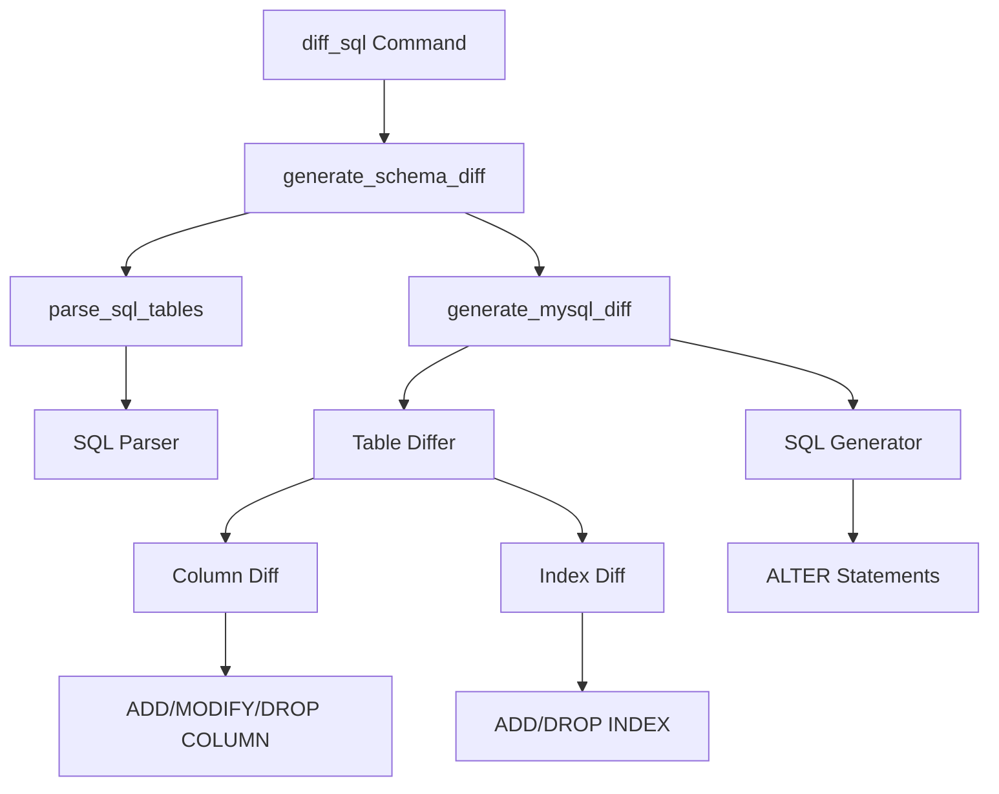
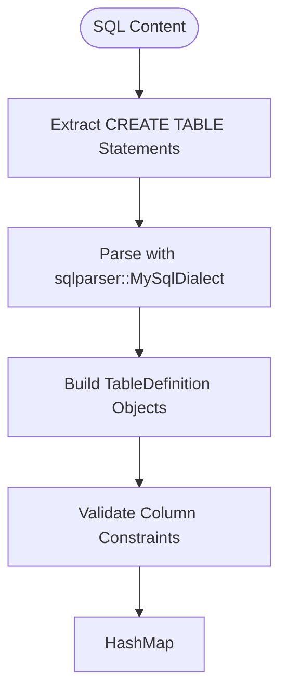
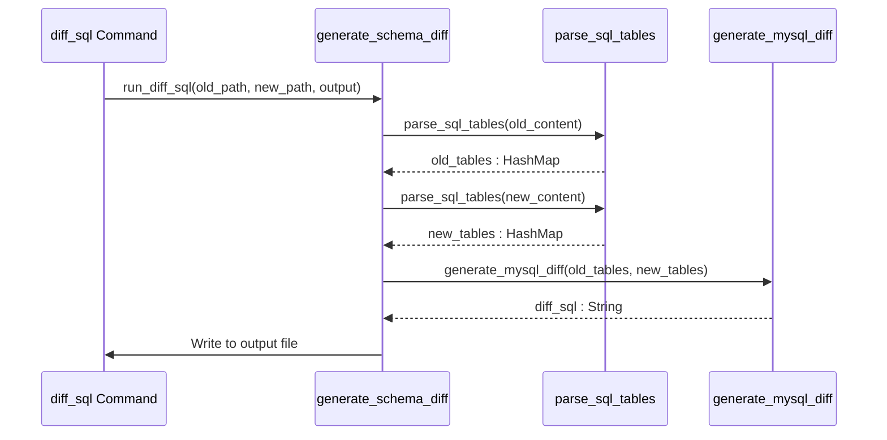

# Diff SQL Command

<cite>
**Referenced Files in This Document**   
- [diff_sql.rs](file://nuwax-cli/src/commands/diff_sql.rs#L0-L113)
- [generator.rs](file://client-core/src/sql_diff/generator.rs#L0-L194)
- [differ.rs](file://client-core/src/sql_diff/differ.rs#L0-L265)
- [parser.rs](file://client-core/src/sql_diff/parser.rs#L0-L380)
- [types.rs](file://client-core/src/sql_diff/types.rs#L0-L30)
- [mod.rs](file://client-core/src/sql_diff/mod.rs#L0-L10)
- [new_init_mysql.sql](file://client-core/fixtures/new_init_mysql.sql)
- [old_init_mysql.sql](file://client-core/fixtures/old_init_mysql.sql)
- [diff_sql_tests.rs](file://client-core/tests/diff_sql_tests.rs#L0-L297)
</cite>

## Table of Contents
1. [Introduction](#introduction)
2. [Core Architecture](#core-architecture)
3. [Input Sources and Parsing](#input-sources-and-parsing)
4. [Diff Generation Process](#diff-generation-process)
5. [Output Formatting and Examples](#output-formatting-and-examples)
6. [Accuracy Considerations](#accuracy-considerations)
7. [Limitations and Validation](#limitations-and-validation)
8. [Troubleshooting Guide](#troubleshooting-guide)

## Introduction
The **diff-sql** command is a schema migration tool that generates executable SQL patches by comparing two database states. It analyzes differences between SQL dump files or database snapshots and produces ALTER statements to migrate from one schema version to another. The command leverages the `client-core::sql_diff` module to provide intelligent, context-aware diffing capabilities for MySQL-compatible schemas.

The primary use case involves comparing an older database schema (source) with a newer one (target) to generate a migration script that can be safely applied to upgrade production databases. The tool emphasizes accuracy, readability, and safety through comprehensive logging, preview capabilities, and validation recommendations.

**Section sources**
- [diff_sql.rs](file://nuwax-cli/src/commands/diff_sql.rs#L0-L113)

## Core Architecture

The diff-sql functionality is structured as a layered system with clear separation of concerns between parsing, comparison, and generation components.



**Diagram sources**
- [mod.rs](file://client-core/src/sql_diff/mod.rs#L0-L10)
- [generator.rs](file://client-core/src/sql_diff/generator.rs#L0-L194)
- [differ.rs](file://client-core/src/sql_diff/differ.rs#L0-L265)

**Section sources**
- [mod.rs](file://client-core/src/sql_diff/mod.rs#L0-L10)

## Input Sources and Parsing

### Supported Input Types
The diff-sql command accepts two primary input sources:
- **SQL dump files**: Complete schema definitions exported from databases
- **Live database snapshots**: Indirectly supported through pre-dumped SQL files

The command requires both an old and new SQL file path as mandatory inputs, with optional version identifiers for better traceability.

### SQL Parsing Mechanism
The parser uses a hybrid approach combining regex pattern matching with formal SQL parsing:

1. **Content Extraction**: Uses regular expressions to locate `CREATE TABLE` statements and skip non-DDL content like `USE` statements
2. **Formal Parsing**: Employs the `sqlparser` crate with MySQL dialect to parse column definitions, constraints, and data types
3. **Structure Building**: Converts parsed AST into internal data structures (`TableDefinition`, `TableColumn`, `TableIndex`)



**Diagram sources**
- [parser.rs](file://client-core/src/sql_diff/parser.rs#L0-L380)
- [types.rs](file://client-core/src/sql_diff/types.rs#L0-L30)

**Section sources**
- [parser.rs](file://client-core/src/sql_diff/parser.rs#L0-L380)
- [types.rs](file://client-core/src/sql_diff/types.rs#L0-L30)

## Diff Generation Process

### Comparison Algorithm
The differ component performs three-phase comparison:

1. **Table-Level Diff**: Identifies tables present in target but missing in source (ADD TABLE) or vice versa (DROP TABLE)
2. **Column-Level Diff**: For existing tables, compares column definitions to detect additions, deletions, or modifications
3. **Index-Level Diff**: Analyzes index definitions including primary keys, unique constraints, and secondary indexes



**Diagram sources**
- [generator.rs](file://client-core/src/sql_diff/generator.rs#L0-L194)
- [differ.rs](file://client-core/src/sql_diff/differ.rs#L0-L265)

**Section sources**
- [generator.rs](file://client-core/src/sql_diff/generator.rs#L0-L194)
- [differ.rs](file://client-core/src/sql_diff/differ.rs#L0-L265)

## Output Formatting and Examples

### Generated SQL Structure
The output follows a standardized format with:
- Timestamped comment header
- Descriptive section comments (e.g., "-- Modify table: users")
- Properly quoted identifiers using backticks
- Multi-statement batches separated by newlines

### Example Output
Based on the fixture files comparison, typical generated statements include:

```sql
-- Modify table: custom_field_definition
ALTER TABLE `custom_field_definition` ADD COLUMN `field_str_len` INT COMMENT '字符串字段长度,可空,比如字符串,可以指定长度使用';

-- Modify table: custom_table_definition
ALTER TABLE `custom_table_definition` ADD COLUMN `status` TINYINT DEFAULT 1 NOT NULL COMMENT '状态：1-启用 -1-禁用';
```

### Empty Diff Handling
When no structural changes are detected, the command generates a descriptive empty file:

```sql
-- SQL差异分析结果
-- 版本 unknown 到 latest: 仅有注释或格式变化，无实际架构差异
-- 无需执行任何SQL语句，数据库架构无变化
```

**Section sources**
- [generator.rs](file://client-core/src/sql_diff/generator.rs#L0-L194)
- [old_init_mysql.sql](file://client-core/fixtures/old_init_mysql.sql)
- [new_init_mysql.sql](file://client-core/fixtures/new_init_mysql.sql)

## Accuracy Considerations

### Data Type and Constraint Handling
The system maintains high fidelity in representing schema elements:

- **Default Values**: Properly quoted and preserved in MODIFY COLUMN statements
- **Comments**: Maintained through COMMENT clauses in column definitions
- **Nullability**: NOT NULL constraints are explicitly included
- **Auto-increment**: AUTO_INCREMENT attribute is preserved

### Special Case Detection
The generator intelligently handles various MySQL-specific constructs:

- **Primary Keys**: Detected via `is_primary` flag and generated as `ADD PRIMARY KEY`
- **Unique Constraints**: Translated to `ADD UNIQUE KEY` with proper constraint naming
- **Index Types**: Supports KEY, UNIQUE KEY, and PRIMARY KEY variations

### Version Tracking
Optional version parameters (`old_version`, `new_version`) enhance traceability by:
- Including version information in the output description
- Enabling better change tracking in migration workflows
- Supporting audit requirements for production deployments

**Section sources**
- [generator.rs](file://client-core/src/sql_diff/generator.rs#L0-L194)
- [differ.rs](file://client-core/src/sql_diff/differ.rs#L0-L265)

## Limitations and Validation

### Current Detection Capabilities
The system has well-defined scope boundaries:

**Supported Changes:**
- Table creation and deletion
- Column addition, removal, and modification
- Index and constraint changes
- Basic table options (ENGINE, CHARSET)

**Not Currently Supported:**
- Trigger detection and migration
- Stored procedure/function changes
- View modifications
- Foreign key constraint analysis
- User/permission changes
- Complex data type alterations

### Validation Recommendations
To ensure migration safety, follow these best practices:

1. **Pre-Execution Validation**: Always review the generated SQL before application
2. **Test Environment**: Apply migrations to a staging environment first
3. **Backup Strategy**: Ensure complete database backups exist before migration
4. **Idempotency Check**: Verify the script can be safely re-run if interrupted
5. **Performance Impact**: Consider index creation timing for large tables

### Edge Case Handling
The system includes safeguards for common issues:
- Empty diffs are explicitly documented
- File existence is validated before processing
- Parsing errors provide descriptive context
- Meaningless changes (comments, formatting) are filtered out

**Section sources**
- [diff_sql_tests.rs](file://client-core/tests/diff_sql_tests.rs#L0-L297)
- [generator.rs](file://client-core/src/sql_diff/generator.rs#L0-L194)

## Troubleshooting Guide

### Common Parsing Errors
**Error**: "读取旧版本SQL文件失败"  
**Solution**: Verify file paths exist and have read permissions

**Error**: "解析 SQL 语句失败"  
**Solution**: Check for malformed CREATE TABLE statements or unsupported syntax

**Error**: "正则表达式编译失败"  
**Solution**: Report to development team - indicates internal regex issue

### Unexpected Diff Results
**Issue**: No changes detected despite schema modifications  
**Diagnosis**: Compare file content trimming - identical whitespace may cause false negatives

**Issue**: Incorrect column modification statements  
**Diagnosis**: Check data type precision and nullability differences that may not be visually obvious

**Issue**: Missing index changes  
**Diagnosis**: Verify index names are consistent between versions - name changes may appear as drop+add

### Debugging Workflow
1. Enable verbose logging to see parsing details
2. Compare fixture test results with actual behavior
3. Use the test suite to validate parser behavior
4. Check for encoding issues in SQL files (UTF-8 recommended)
5. Validate that USE statements are properly handled in multi-database dumps

**Section sources**
- [diff_sql.rs](file://nuwax-cli/src/commands/diff_sql.rs#L0-L113)
- [parser.rs](file://client-core/src/sql_diff/parser.rs#L0-L380)
- [diff_sql_tests.rs](file://client-core/tests/diff_sql_tests.rs#L0-L297)