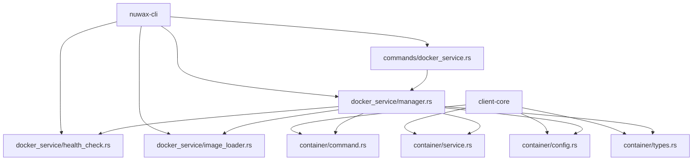
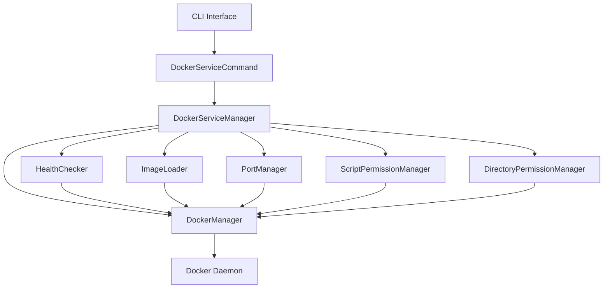
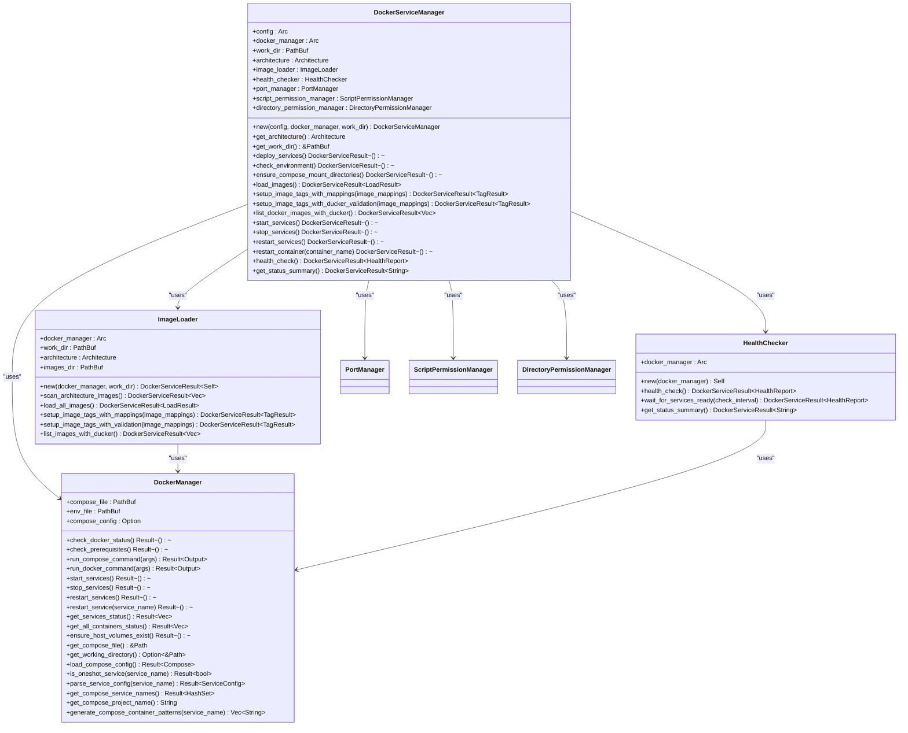
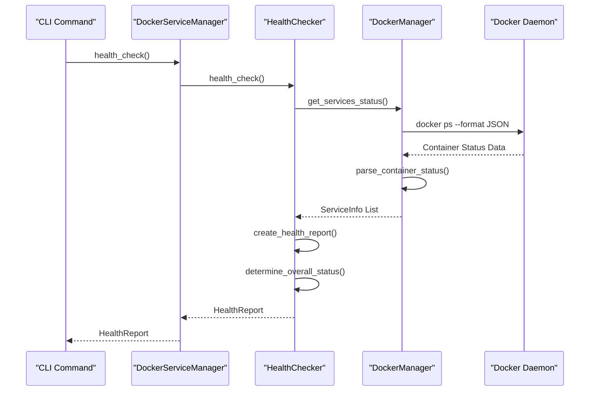
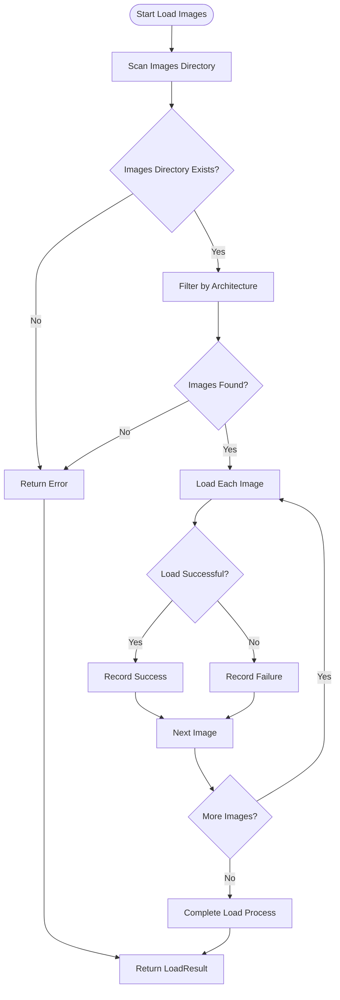
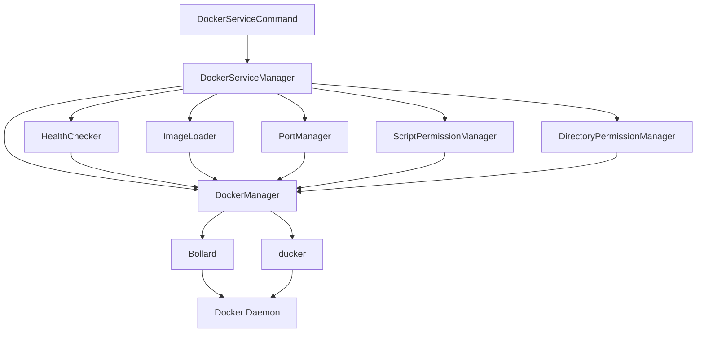

# Docker Service Command

<cite>
**Referenced Files in This Document**   
- [docker_service.rs](file://nuwax-cli/src/commands/docker_service.rs)
- [manager.rs](file://nuwax-cli/src/docker_service/manager.rs)
- [health_check.rs](file://nuwax-cli/src/docker_service/health_check.rs)
- [image_loader.rs](file://nuwax-cli/src/docker_service/image_loader.rs)
- [mod.rs](file://nuwax-cli/src/docker_service/mod.rs)
- [cli.rs](file://nuwax-cli/src/cli.rs)
- [command.rs](file://client-core/src/container/command.rs)
- [service.rs](file://client-core/src/container/service.rs)
- [config.rs](file://client-core/src/container/config.rs)
- [types.rs](file://client-core/src/container/types.rs)
</cite>

## Table of Contents
1. [Introduction](#introduction)
2. [Project Structure](#project-structure)
3. [Core Components](#core-components)
4. [Architecture Overview](#architecture-overview)
5. [Detailed Component Analysis](#detailed-component-analysis)
6. [Dependency Analysis](#dependency-analysis)
7. [Performance Considerations](#performance-considerations)
8. [Troubleshooting Guide](#troubleshooting-guide)
9. [Conclusion](#conclusion)

## Introduction
The Docker Service Command is a comprehensive toolset within the Nuwax CLI that provides low-level control over Dockerized services. This documentation details its capabilities for service inspection, lifecycle management (start/stop/restart), and configuration introspection. The command integrates with Bollard for Docker API communication, enabling container listing, log retrieval, and health status checks. It addresses security implications of Docker socket access and permission requirements, while also covering common failure modes such as container crashes, network conflicts, and image pull failures with diagnostic procedures and resolution steps.

## Project Structure
The project structure reveals a well-organized codebase with clear separation of concerns. The Docker service functionality is primarily located in the nuwax-cli component, with supporting infrastructure in client-core. The architecture follows a modular design pattern with distinct components for command handling, service management, health checking, and image loading.



**Diagram sources**
- [docker_service.rs](file://nuwax-cli/src/commands/docker_service.rs)
- [manager.rs](file://nuwax-cli/src/docker_service/manager.rs)
- [command.rs](file://client-core/src/container/command.rs)
- [service.rs](file://client-core/src/container/service.rs)

**Section sources**
- [docker_service.rs](file://nuwax-cli/src/commands/docker_service.rs)
- [manager.rs](file://nuwax-cli/src/docker_service/manager.rs)
- [command.rs](file://client-core/src/container/command.rs)

## Core Components
The core components of the Docker Service Command system include the DockerServiceManager, HealthChecker, ImageLoader, and DockerManager. These components work together to provide comprehensive control over Dockerized services. The DockerServiceManager serves as the primary interface, coordinating operations between the various subsystems. The HealthChecker component provides detailed status information about running containers, while the ImageLoader handles the loading and tagging of Docker images. The DockerManager from client-core provides the foundational interface to Docker operations.

**Section sources**
- [manager.rs](file://nuwax-cli/src/docker_service/manager.rs)
- [health_check.rs](file://nuwax-cli/src/docker_service/health_check.rs)
- [image_loader.rs](file://nuwax-cli/src/docker_service/image_loader.rs)
- [types.rs](file://client-core/src/container/types.rs)

## Architecture Overview
The architecture of the Docker Service Command follows a layered approach with clear separation between command handling, service management, and Docker interaction. The system uses a modular design where each component has a specific responsibility, promoting maintainability and testability.



**Diagram sources**
- [docker_service.rs](file://nuwax-cli/src/commands/docker_service.rs)
- [manager.rs](file://nuwax-cli/src/docker_service/manager.rs)
- [mod.rs](file://nuwax-cli/src/docker_service/mod.rs)
- [types.rs](file://client-core/src/container/types.rs)

## Detailed Component Analysis
This section provides an in-depth analysis of the key components that make up the Docker Service Command system, detailing their functionality, interactions, and implementation patterns.

### Docker Service Manager Analysis
The DockerServiceManager is the central component that orchestrates Docker service operations. It coordinates between various subsystems to provide a unified interface for service management.

#### Class Diagram


**Diagram sources**
- [manager.rs](file://nuwax-cli/src/docker_service/manager.rs)
- [image_loader.rs](file://nuwax-cli/src/docker_service/image_loader.rs)
- [health_check.rs](file://nuwax-cli/src/docker_service/health_check.rs)
- [types.rs](file://client-core/src/container/types.rs)

**Section sources**
- [manager.rs](file://nuwax-cli/src/docker_service/manager.rs)
- [image_loader.rs](file://nuwax-cli/src/docker_service/image_loader.rs)
- [health_check.rs](file://nuwax-cli/src/docker_service/health_check.rs)

### Health Check System Analysis
The health check system provides comprehensive monitoring of Docker service status, offering detailed insights into container states and overall system health.

#### Sequence Diagram


**Diagram sources**
- [health_check.rs](file://nuwax-cli/src/docker_service/health_check.rs)
- [service.rs](file://client-core/src/container/service.rs)
- [types.rs](file://client-core/src/container/types.rs)

**Section sources**
- [health_check.rs](file://nuwax-cli/src/docker_service/health_check.rs)
- [service.rs](file://client-core/src/container/service.rs)

### Image Loading System Analysis
The image loading system handles the loading and tagging of Docker images, with special consideration for architecture-specific images.

#### Flowchart


**Diagram sources**
- [image_loader.rs](file://nuwax-cli/src/docker_service/image_loader.rs)
- [command.rs](file://client-core/src/container/command.rs)

**Section sources**
- [image_loader.rs](file://nuwax-cli/src/docker_service/image_loader.rs)

## Dependency Analysis
The Docker Service Command system has a well-defined dependency structure with clear relationships between components. The system relies on external libraries like Bollard for Docker API communication and ducker for container management.



**Diagram sources**
- [mod.rs](file://nuwax-cli/src/docker_service/mod.rs)
- [manager.rs](file://nuwax-cli/src/docker_service/manager.rs)
- [types.rs](file://client-core/src/container/types.rs)

**Section sources**
- [mod.rs](file://nuwax-cli/src/docker_service/mod.rs)
- [manager.rs](file://nuwax-cli/src/docker_service/manager.rs)

## Performance Considerations
The Docker Service Command system is designed with performance in mind, implementing caching mechanisms and efficient resource management. The HealthChecker component uses a 30-second TTL cache for docker-compose configuration to avoid repeated parsing. The system also implements progressive permission management to minimize filesystem operations. When loading images, the system processes them sequentially to avoid overwhelming system resources. The health check system uses efficient container status queries rather than full container inspections for performance.

## Troubleshooting Guide
This section addresses common issues encountered when using the Docker Service Command and provides diagnostic procedures and resolution steps.

**Section sources**
- [docker_service.rs](file://nuwax-cli/src/commands/docker_service.rs)
- [manager.rs](file://nuwax-cli/src/docker_service/manager.rs)
- [health_check.rs](file://nuwax-cli/src/docker_service/health_check.rs)
- [command.rs](file://client-core/src/container/command.rs)

### Common Failure Modes and Solutions
#### Container Crashes
When containers crash, the system provides detailed error information through the health check command. Common causes include:
- **Missing dependencies**: Ensure all required services are running
- **Configuration errors**: Verify environment variables and configuration files
- **Resource constraints**: Check system resources (memory, CPU, disk space)

Diagnostic command:
```bash
nuwax-cli docker-service status
```

#### Network Conflicts
Network conflicts typically occur when ports are already in use. The system includes a port manager to detect and report these conflicts.

Resolution steps:
1. Check for port conflicts:
```bash
nuwax-cli docker-service status
```
2. Identify the conflicting process:
```bash
lsof -i :<port_number>
```
3. Either stop the conflicting process or configure the service to use a different port

#### Image Pull Failures
Image pull failures can occur due to network issues, authentication problems, or incorrect image names.

Diagnostic and resolution steps:
1. Check image availability:
```bash
nuwax-cli docker-service list-images
```
2. Verify network connectivity to the registry
3. Check authentication credentials if using a private registry
4. Ensure the image name and tag are correct

### Security Implications
The Docker Service Command requires access to the Docker socket, which grants significant system privileges. This access is necessary for managing containers but presents security considerations:

- **Permission Requirements**: The command must run with sufficient privileges to access the Docker daemon
- **Socket Security**: The Docker socket should be protected from unauthorized access
- **Container Isolation**: Ensure containers are properly isolated from the host system
- **Image Verification**: Only use trusted images from verified sources

Best practices:
- Run the command with the minimum required privileges
- Regularly update Docker and container images
- Implement network policies to restrict container communication
- Monitor container activity for suspicious behavior

## Conclusion
The Docker Service Command provides a comprehensive and robust interface for managing Dockerized services. Its modular architecture, clear separation of concerns, and comprehensive feature set make it a powerful tool for both development and production environments. The system's integration with Bollard and ducker provides reliable Docker API communication, while its detailed health checking and diagnostic capabilities facilitate effective troubleshooting. By understanding the system's architecture and components, users can effectively leverage its capabilities for service management, monitoring, and maintenance.