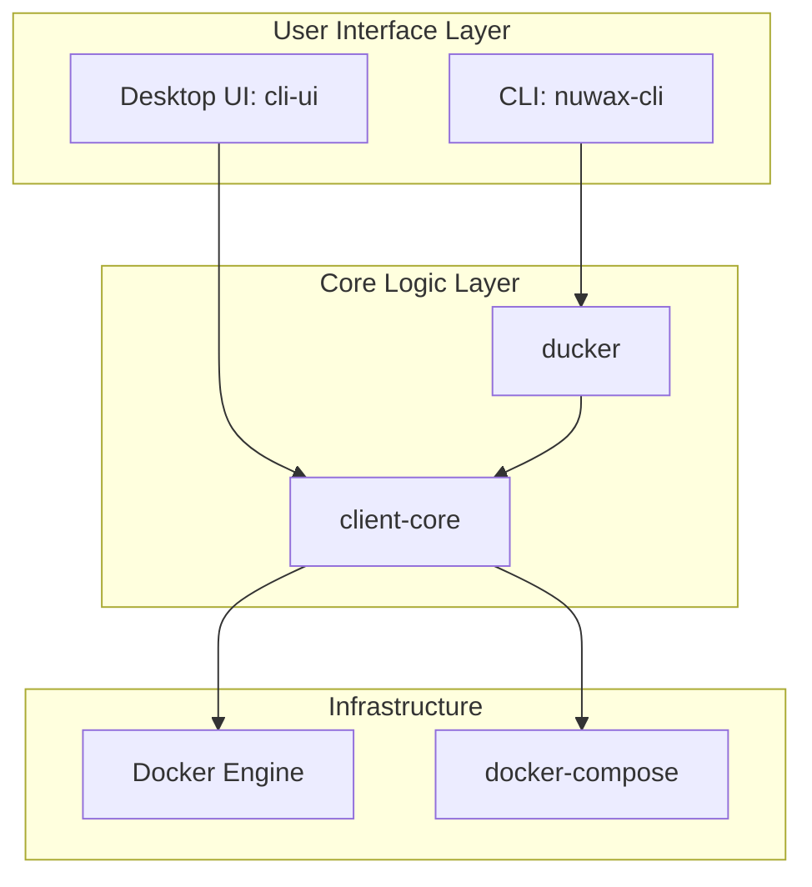
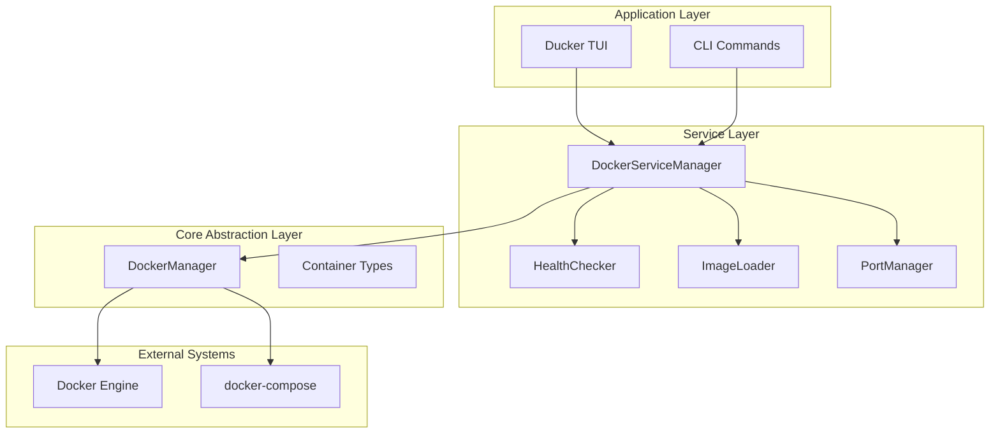
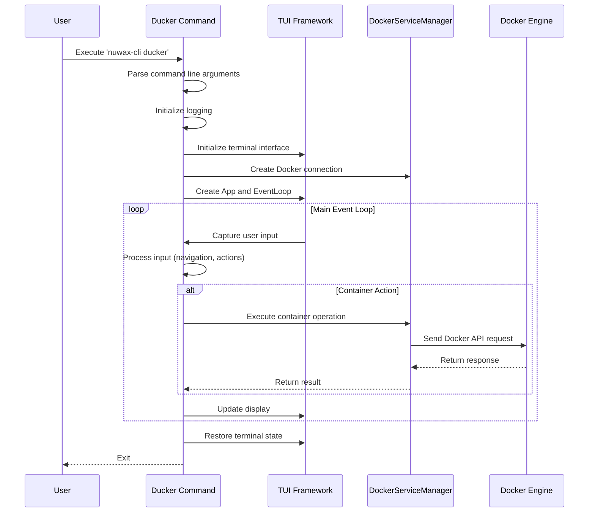
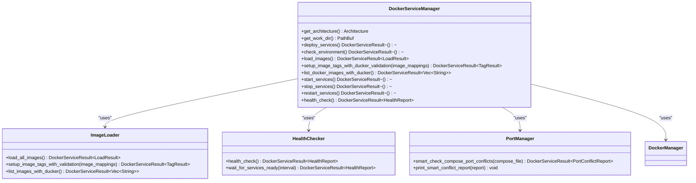
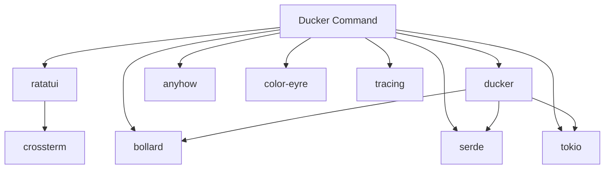

# Ducker Command

<cite>
**Referenced Files in This Document**   
- [ducker.rs](file://nuwax-cli/src/commands/ducker.rs#L1-L213)
- [manager.rs](file://nuwax-cli/src/docker_service/manager.rs#L1-L888)
- [mod.rs](file://nuwax-cli/src/docker_service/mod.rs#L1-L67)
- [types.rs](file://client-core/src/container/types.rs#L1-L60)
- [compose_parser.rs](file://nuwax-cli/src/docker_service/compose_parser.rs#L1-L271)
- [Cargo.toml](file://client-core/Cargo.toml#L1-L110)
- [Cargo.toml](file://nuwax-cli/Cargo.toml#L1-L119)
</cite>

## Table of Contents
1. [Introduction](#introduction)
2. [Project Structure](#project-structure)
3. [Core Components](#core-components)
4. [Architecture Overview](#architecture-overview)
5. [Detailed Component Analysis](#detailed-component-analysis)
6. [Dependency Analysis](#dependency-analysis)
7. [Performance Considerations](#performance-considerations)
8. [Troubleshooting Guide](#troubleshooting-guide)
9. [Conclusion](#conclusion)

## Introduction
The ducker command is a lightweight wrapper utility designed to simplify Docker operations within the Duck Client ecosystem. It provides an integrated Terminal User Interface (TUI) for managing Docker containers, images, volumes, and networks, offering a user experience similar to k9s. Unlike standalone tools, this implementation is directly embedded within the nuwax-cli application, eliminating the need for external installations. The ducker command serves as a critical component in the broader Docker service management workflow, enabling users to inspect, manage, and troubleshoot Dockerized services with enhanced visibility and control. Its integration with docker-compose workflows and service configuration files allows for seamless orchestration of multi-container applications, while its error handling and logging capabilities provide valuable context during deployment and upgrade processes.

## Project Structure
The Duck Client project follows a modular architecture with distinct components for user interface, core logic, and CLI functionality. The ducker command resides within the nuwax-cli module, which acts as the primary command-line interface for Docker service management. This structure enables a clear separation of concerns, with the client-core module providing fundamental container management capabilities that are leveraged by both the CLI and UI components. The integration of ducker as a direct dependency rather than an external tool highlights the project's focus on providing a self-contained, reliable experience for Docker operations.

**Diagram sources**
- [ducker.rs](file://nuwax-cli/src/commands/ducker.rs#L1-L213)
- [types.rs](file://client-core/src/container/types.rs#L1-L60)

## Core Components
The ducker command's functionality is built upon several core components that work together to provide a comprehensive Docker management experience. At its heart, the command processes user input through a parameter parsing system that handles configuration options for Docker socket paths, host URLs, and logging. The primary execution flow involves initializing a TUI interface using the ratatui framework, establishing a connection to the Docker daemon, and presenting an interactive interface for container management. Key capabilities include container lifecycle management (start, stop, delete, exec), image and volume operations, real-time log viewing, and system status monitoring. The integration with the DockerServiceManager enables advanced features like health checking, port conflict detection, and automated deployment workflows, making ducker a powerful tool for both routine operations and complex service orchestration.

**Section sources**
- [ducker.rs](file://nuwax-cli/src/commands/ducker.rs#L1-L213)
- [manager.rs](file://nuwax-cli/src/docker_service/manager.rs#L1-L888)

## Architecture Overview
The ducker command operates within a layered architecture that integrates with the broader Duck Client system. At the foundation, the client-core module provides essential container management abstractions through the DockerManager class, which handles interactions with docker-compose and service configurations. Above this, the docker_service module extends these capabilities with additional features like architecture detection, health checking, and permission management. The ducker command sits at the application layer, leveraging these services to provide a rich TUI experience. This architectural approach allows for code reuse across different interfaces (CLI and desktop UI) while maintaining a consistent operational model. The use of asynchronous Rust with Tokio enables non-blocking operations, ensuring responsive user interaction even during lengthy Docker operations.

**Diagram sources**
- [mod.rs](file://nuwax-cli/src/docker_service/mod.rs#L1-L67)
- [manager.rs](file://nuwax-cli/src/docker_service/manager.rs#L1-L888)
- [types.rs](file://client-core/src/container/types.rs#L1-L60)

## Detailed Component Analysis

### Ducker Command Implementation
The ducker command implementation demonstrates a clean, modular design focused on providing an intuitive user experience for Docker management. The core functionality is encapsulated in the `run_ducker` function, which orchestrates the entire execution flow from parameter parsing to TUI initialization and event handling. The command supports several configuration options that allow users to customize the Docker connection, including the ability to specify custom Docker socket paths and host URLs for remote Docker daemons. The integration with the ratatui framework enables a responsive, keyboard-driven interface that supports navigation, container inspection, and real-time log viewing.

**Diagram sources**
- [ducker.rs](file://nuwax-cli/src/commands/ducker.rs#L1-L213)

**Section sources**
- [ducker.rs](file://nuwax-cli/src/commands/ducker.rs#L1-L213)

### Docker Service Integration
The ducker command's integration with Docker services is facilitated through the DockerServiceManager, which provides a high-level interface for container orchestration. This integration enables ducker to perform advanced operations beyond basic container management, such as health checking, port conflict detection, and automated deployment workflows. The DockerServiceManager acts as a facade that coordinates multiple specialized components, including the ImageLoader for managing Docker images, the HealthChecker for monitoring service status, and the PortManager for handling network configuration. This layered approach allows ducker to provide comprehensive service management capabilities while abstracting away the complexity of individual operations.

**Diagram sources**
- [manager.rs](file://nuwax-cli/src/docker_service/manager.rs#L1-L888)
- [compose_parser.rs](file://nuwax-cli/src/docker_service/compose_parser.rs#L1-L271)

**Section sources**
- [manager.rs](file://nuwax-cli/src/docker_service/manager.rs#L1-L888)

## Dependency Analysis
The ducker command relies on a well-defined set of dependencies that enable its functionality while maintaining integration with the broader Duck Client ecosystem. The most critical dependency is the ducker crate itself, which provides the TUI framework and Docker management capabilities. This is complemented by the bollard library, which offers a native Rust interface to the Docker API, ensuring compatibility and performance. The ratatui framework provides the terminal user interface components, enabling a rich, interactive experience. Error handling is managed through the anyhow and color-eyre crates, which provide detailed context for debugging. Logging is implemented using the tracing framework, allowing for structured, hierarchical logging that can be filtered and analyzed. The integration with docker-compose is facilitated through the docker-compose-types crate, which provides type-safe parsing of compose files.

**Diagram sources**
- [Cargo.toml](file://nuwax-cli/Cargo.toml#L1-L119)
- [Cargo.toml](file://client-core/Cargo.toml#L1-L110)

**Section sources**
- [Cargo.toml](file://nuwax-cli/Cargo.toml#L1-L119)
- [Cargo.toml](file://client-core/Cargo.toml#L1-L110)

## Performance Considerations
The ducker command is designed with performance and responsiveness in mind, leveraging Rust's asynchronous capabilities to ensure a smooth user experience. The use of Tokio as the async runtime enables non-blocking operations, allowing the TUI to remain responsive even during lengthy Docker operations like image loading or container startup. The integration with the Docker daemon is optimized through connection reuse and efficient API calls, minimizing overhead. The TUI framework (ratatui) employs efficient rendering techniques to reduce terminal redraws and minimize latency. For large-scale operations, the command provides progress feedback and status updates, helping users understand the current state of long-running processes. The error handling system is designed to provide meaningful feedback without compromising performance, using structured logging to capture diagnostic information that can be analyzed post-execution.

## Troubleshooting Guide
When encountering issues with the ducker command, several common problems and their solutions should be considered. Connection issues to the Docker daemon are often caused by incorrect socket paths or host URLs; these can be resolved by verifying the Docker service is running and the connection parameters are correct. Permission errors, particularly on Unix systems, may require adjusting file or directory permissions for Docker socket access. Architecture mismatches between the host system and container images (e.g., amd64 vs arm64) can prevent containers from starting; this is addressed by using architecture-appropriate images or specifying platform options. Port conflicts may occur when multiple services attempt to bind to the same network ports; the ducker command includes port conflict detection to help identify and resolve these issues. For persistent problems, examining the detailed error messages and logs can provide insights into the root cause, with the structured logging system capturing comprehensive context for debugging.

**Section sources**
- [ducker.rs](file://nuwax-cli/src/commands/ducker.rs#L1-L213)
- [manager.rs](file://nuwax-cli/src/docker_service/manager.rs#L1-L888)

## Conclusion
The ducker command represents a sophisticated integration of Docker management capabilities within the Duck Client ecosystem. By providing a rich, interactive TUI interface directly embedded in the CLI tool, it eliminates the need for external dependencies while offering a powerful set of features for container orchestration. Its architecture leverages modular design principles, with clear separation between the user interface, service coordination, and core container management layers. This design enables code reuse across different interfaces while maintaining a consistent operational model. The command's integration with docker-compose workflows and service configuration files makes it an essential tool for managing complex, multi-container applications. As a lightweight wrapper over Docker operations, ducker simplifies common tasks while providing enhanced logging, error context, and troubleshooting capabilities that improve the overall developer experience.