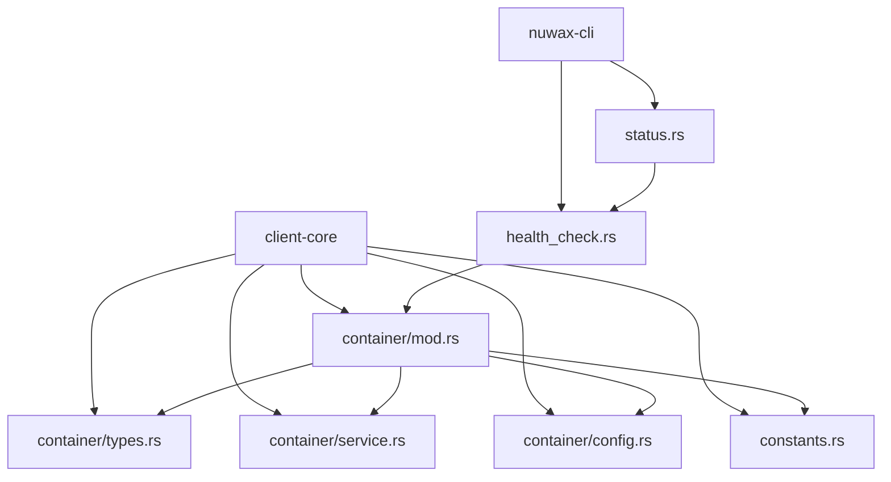
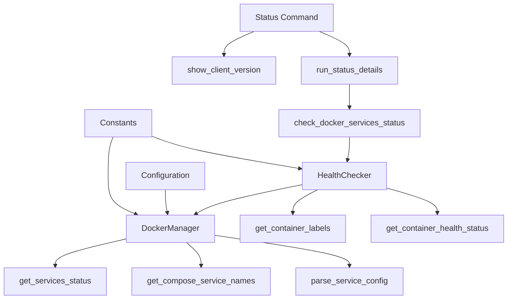
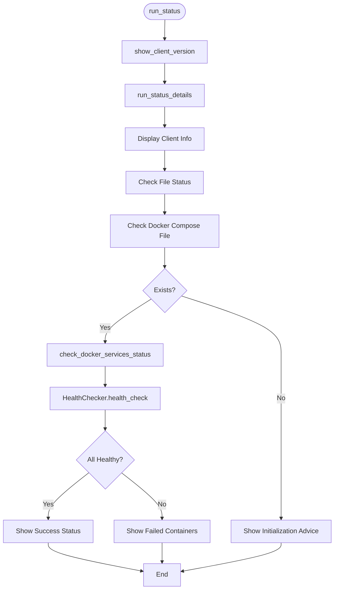
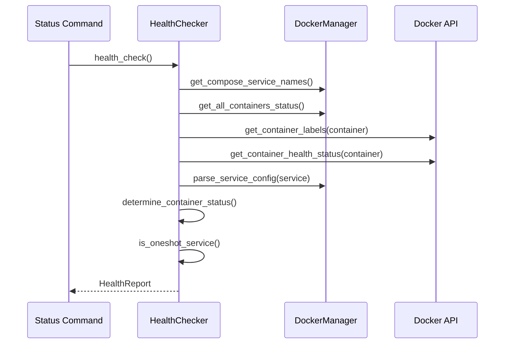
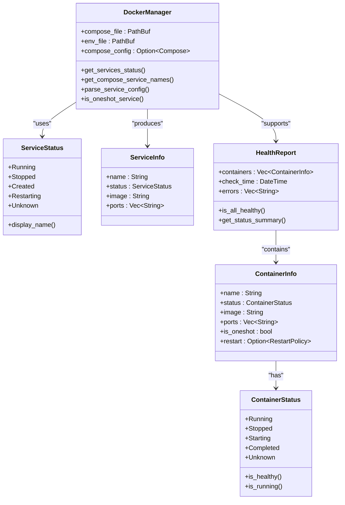
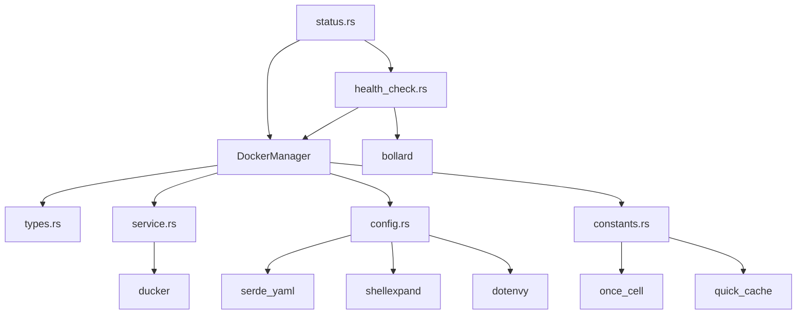

# Status Command

<cite>
**Referenced Files in This Document**   
- [status.rs](file://nuwax-cli/src/commands/status.rs#L1-L138)
- [health_check.rs](file://nuwax-cli/src/docker_service/health_check.rs#L1-L1009)
- [types.rs](file://client-core/src/container/types.rs#L1-L59)
- [service.rs](file://client-core/src/container/service.rs#L1-L510)
- [config.rs](file://client-core/src/container/config.rs#L1-L239)
- [constants.rs](file://client-core/src/constants.rs#L1-L521)
- [mod.rs](file://client-core/src/container/mod.rs#L1-L60)
</cite>

## Table of Contents
1. [Introduction](#introduction)
2. [Project Structure](#project-structure)
3. [Core Components](#core-components)
4. [Architecture Overview](#architecture-overview)
5. [Detailed Component Analysis](#detailed-component-analysis)
6. [Dependency Analysis](#dependency-analysis)
7. [Performance Considerations](#performance-considerations)
8. [Troubleshooting Guide](#troubleshooting-guide)
9. [Conclusion](#conclusion)

## Introduction
The **Status Command** is a critical utility within the `nuwax-cli` application that provides comprehensive insights into the current state of managed Docker services and overall system health. It aggregates information from multiple sources including Docker containers, version tracking, and configuration files to deliver a unified view of the application's operational status. This document details the implementation, data collection methods, output formatting, integration points, and troubleshooting guidance for the status command.

## Project Structure
The project is organized into several key modules:
- **cli-ui**: Frontend user interface built with Tauri, React, and TypeScript
- **client-core**: Core business logic and container management in Rust
- **nuwax-cli**: CLI commands and utilities
- **spec**: Design and architecture documentation

The status command functionality is primarily distributed across the `nuwax-cli` and `client-core` modules, with specific implementations in the status and health check components.

**Diagram sources**
- [status.rs](file://nuwax-cli/src/commands/status.rs#L1-L138)
- [health_check.rs](file://nuwax-cli/src/docker_service/health_check.rs#L1-L1009)
- [mod.rs](file://client-core/src/container/mod.rs#L1-L60)

**Section sources**
- [status.rs](file://nuwax-cli/src/commands/status.rs#L1-L138)
- [mod.rs](file://client-core/src/container/mod.rs#L1-L60)

## Core Components
The status command relies on several core components:
- **DockerManager**: Manages Docker container operations and status retrieval
- **ServiceStatus**: Enum representing container states (Running, Stopped, etc.)
- **HealthChecker**: Validates service health and generates reports
- **ContainerInfo**: Data structure for container metadata
- **HealthReport**: Aggregates health check results

These components work together to collect, process, and present system status information.

**Section sources**
- [types.rs](file://client-core/src/container/types.rs#L1-L59)
- [health_check.rs](file://nuwax-cli/src/docker_service/health_check.rs#L1-L1009)

## Architecture Overview
The status command follows a layered architecture where the CLI command delegates to specialized components for data collection and analysis. The system uses both direct Docker API calls and configuration file parsing to gather comprehensive status information.

**Diagram sources**
- [status.rs](file://nuwax-cli/src/commands/status.rs#L1-L138)
- [health_check.rs](file://nuwax-cli/src/docker_service/health_check.rs#L1-L1009)
- [service.rs](file://client-core/src/container/service.rs#L1-L510)

## Detailed Component Analysis

### Status Command Implementation
The status command implementation in `status.rs` provides the entry point for status reporting, aggregating client version information, file status, and Docker service status.

**Diagram sources**
- [status.rs](file://nuwax-cli/src/commands/status.rs#L1-L138)

**Section sources**
- [status.rs](file://nuwax-cli/src/commands/status.rs#L1-L138)

### Health Check System
The health check system uses a sophisticated approach to validate service health by combining Docker API data with Docker Compose configuration.

**Diagram sources**
- [health_check.rs](file://nuwax-cli/src/docker_service/health_check.rs#L1-L1009)

**Section sources**
- [health_check.rs](file://nuwax-cli/src/docker_service/health_check.rs#L1-L1009)

### Container Status Management
The container module provides the foundation for status reporting with comprehensive data structures and status determination logic.

**Diagram sources**
- [types.rs](file://client-core/src/container/types.rs#L1-L59)
- [service.rs](file://client-core/src/container/service.rs#L1-L510)
- [config.rs](file://client-core/src/container/config.rs#L1-L239)

**Section sources**
- [types.rs](file://client-core/src/container/types.rs#L1-L59)
- [service.rs](file://client-core/src/container/service.rs#L1-L510)
- [config.rs](file://client-core/src/container/config.rs#L1-L239)

## Dependency Analysis
The status command has a well-defined dependency chain that ensures reliable status reporting.

**Diagram sources**
- [status.rs](file://nuwax-cli/src/commands/status.rs#L1-L138)
- [health_check.rs](file://nuwax-cli/src/docker_service/health_check.rs#L1-L1009)
- [mod.rs](file://client-core/src/container/mod.rs#L1-L60)

**Section sources**
- [status.rs](file://nuwax-cli/src/commands/status.rs#L1-L138)
- [mod.rs](file://client-core/src/container/mod.rs#L1-L60)

## Performance Considerations
The status command implements several performance optimizations:
- **Configuration caching**: Docker Compose configurations are cached for 30 seconds using `quick_cache` to avoid repeated file parsing
- **Efficient container matching**: Uses Docker Compose labels for precise container identification rather than name pattern matching
- **Batch operations**: Retrieves all container information in a single API call
- **Asynchronous processing**: Uses async/await for non-blocking operations

The system balances accuracy with performance by:
- Caching configuration data to reduce I/O operations
- Using efficient data structures (HashSet for service names)
- Implementing timeout mechanisms for Docker operations
- Providing incremental status updates during long-running checks

**Section sources**
- [config.rs](file://client-core/src/container/config.rs#L1-L239)
- [service.rs](file://client-core/src/container/service.rs#L1-L510)

## Troubleshooting Guide
Common issues with status reporting and their solutions:

### Inconsistent Status Reports
**Symptoms**: Status command shows services as stopped when they are running, or vice versa.

**Causes and Solutions**:
- **Container name mismatch**: The system uses Docker Compose labels for accurate service identification. Ensure containers are created with proper labels.
- **Cache stale data**: The Docker Compose configuration is cached for 30 seconds. Wait or restart the application to clear the cache.
- **Permission issues**: Ensure the application has read access to the Docker socket and configuration files.

### Missing Services in Status
**Symptoms**: Services defined in docker-compose.yml are not appearing in the status report.

**Causes and Solutions**:
- **Project name mismatch**: Verify the COMPOSE_PROJECT_NAME environment variable or directory name matches the container labels.
- **File path issues**: Ensure the docker-compose.yml and .env files are in the expected locations.
- **Service not started**: Use `docker-compose ps` to verify the services are actually running.

### Health Check Failures
**Symptoms**: Health check reports services as unhealthy when they should be healthy.

**Causes and Solutions**:
- **Restart policy misidentification**: The system checks the `restart` policy in docker-compose.yml to determine if a service is one-shot. Ensure policies are correctly configured.
- **Health check timing**: Some services take time to become healthy. Wait and recheck status.
- **Network issues**: Verify container networking and port mappings.

### Performance Issues
**Symptoms**: Status command takes too long to execute.

**Causes and Solutions**:
- **Large number of containers**: The command checks all containers. Consider cleaning up unused containers.
- **Network latency**: If using remote Docker, consider local execution.
- **File system performance**: Ensure the configuration files are on a fast storage device.

**Section sources**
- [health_check.rs](file://nuwax-cli/src/docker_service/health_check.rs#L1-L1009)
- [service.rs](file://client-core/src/container/service.rs#L1-L510)
- [config.rs](file://client-core/src/container/config.rs#L1-L239)

## Conclusion
The Status Command provides a comprehensive and reliable way to monitor the health of Docker-managed services. By combining direct Docker API calls with configuration file analysis, it delivers accurate status information that accounts for both running containers and expected service configurations. The system's use of caching, precise container identification through labels, and sophisticated status determination logic makes it a robust tool for system monitoring. The integration with both CLI and potential GUI applications ensures consistent status reporting across different user interfaces.