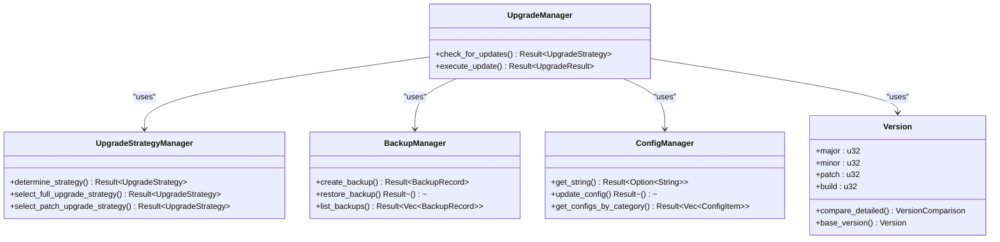
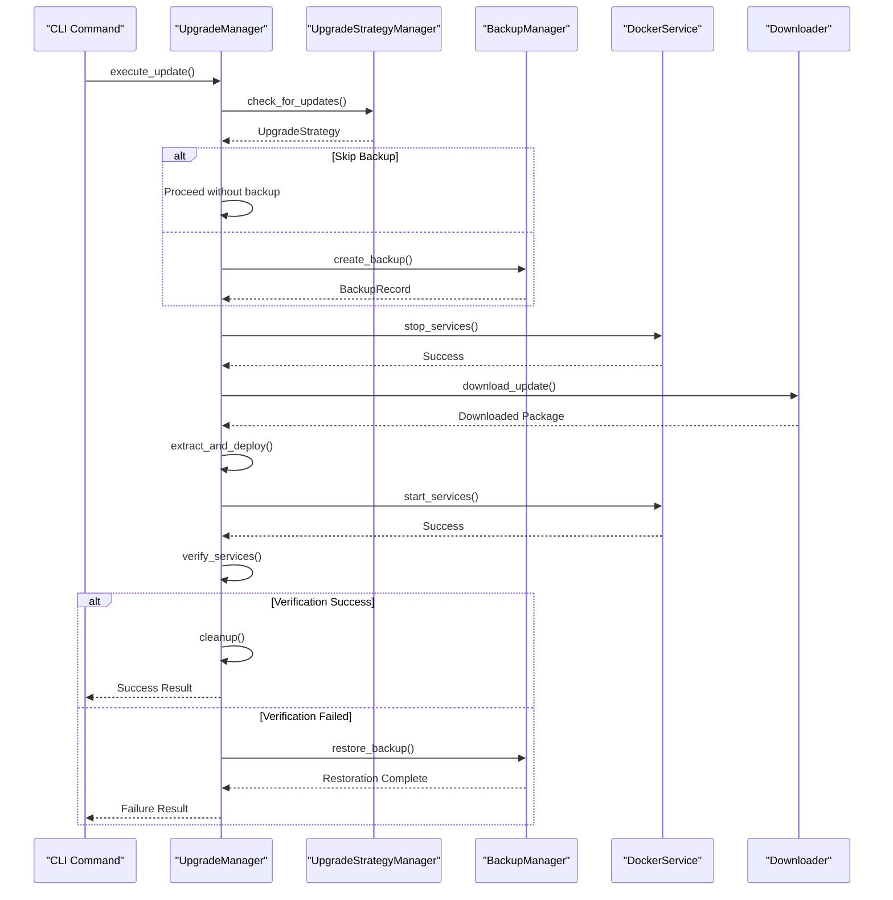
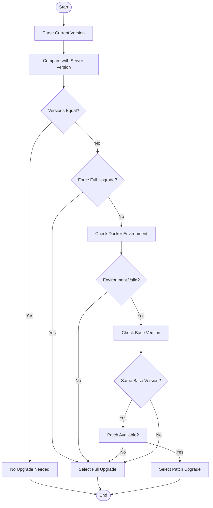
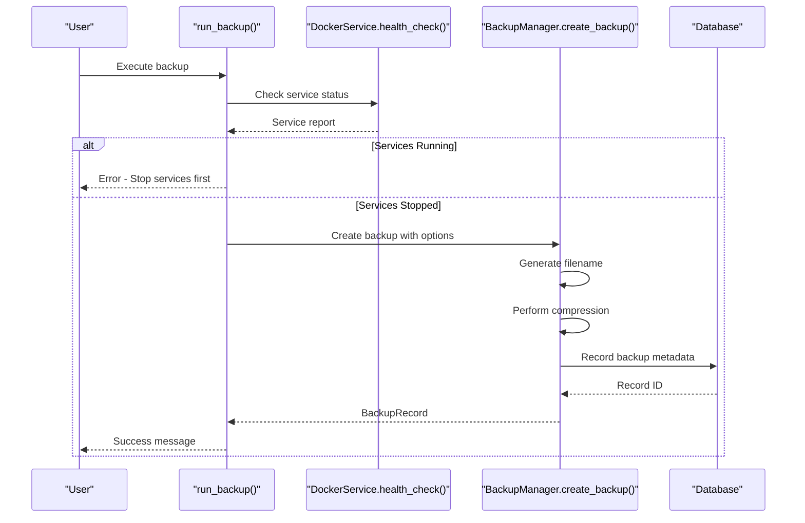
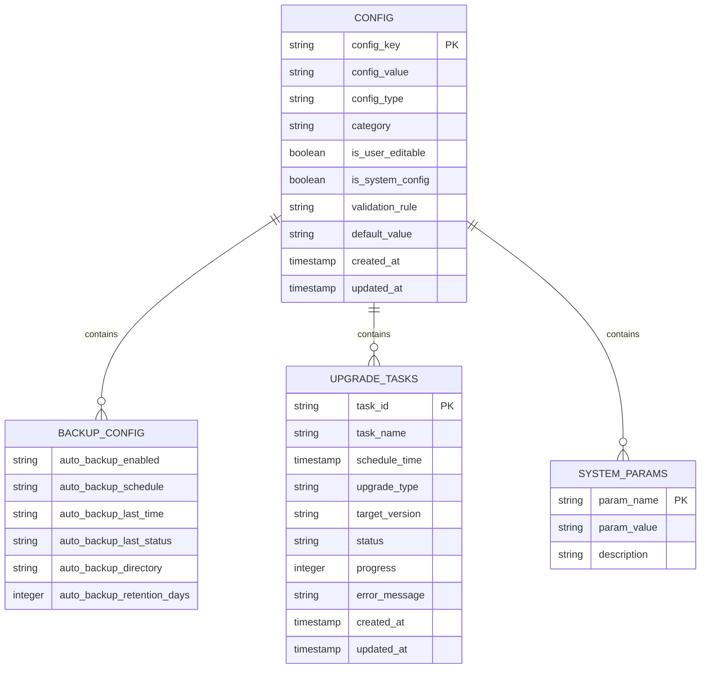
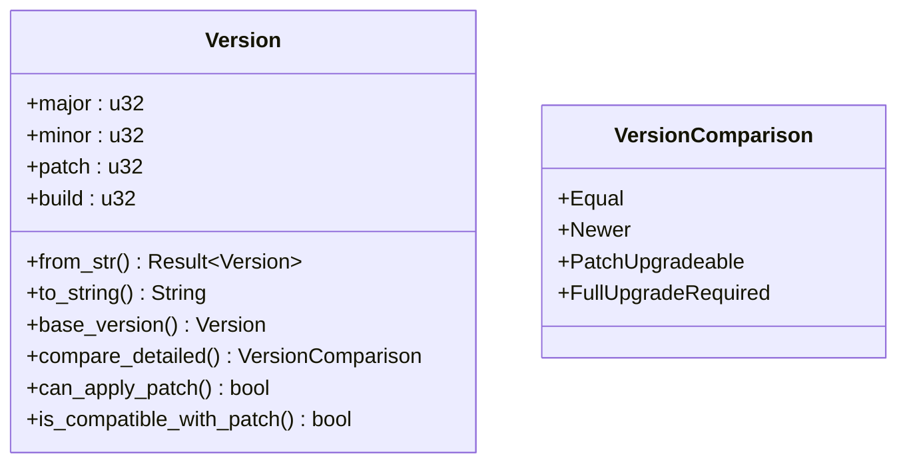
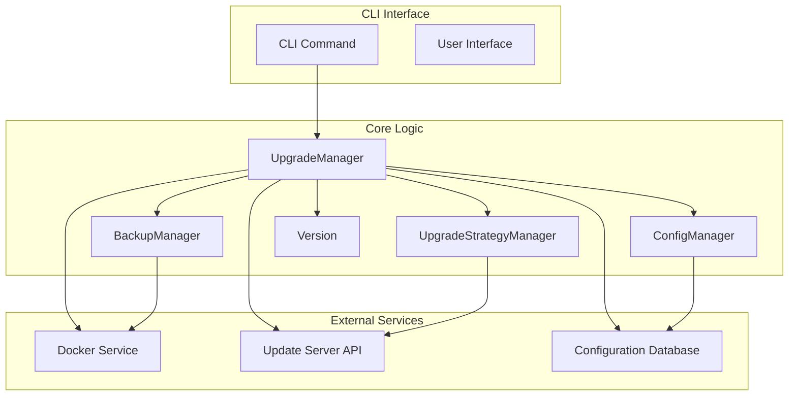

# Update Command

<cite>
**Referenced Files in This Document**   
- [upgrade.rs](file://client-core/src/upgrade.rs)
- [upgrade_strategy.rs](file://client-core/src/upgrade_strategy.rs)
- [backup.rs](file://client-core/src/backup.rs)
- [config_manager.rs](file://client-core/src/config_manager.rs)
- [version.rs](file://client-core/src/version.rs)
- [backup.rs](file://nuwax-cli/src/commands/backup.rs)
</cite>

## Table of Contents
1. [Introduction](#introduction)
2. [Update Command Overview](#update-command-overview)
3. [Core Components](#core-components)
4. [Update Process Flow](#update-process-flow)
5. [Upgrade Strategy Management](#upgrade-strategy-management)
6. [Backup and Rollback System](#backup-and-rollback-system)
7. [Configuration Management](#configuration-management)
8. [Version Management System](#version-management-system)
9. [Error Handling and Recovery](#error-handling-and-recovery)
10. [User Experience Features](#user-experience-features)
11. [Architecture Overview](#architecture-overview)

## Introduction
The Update Command is a comprehensive system designed to manage the complete update process for Docker-based services. It orchestrates a sequence of operations including version checking, backup creation, service management, package downloading, deployment, and verification. The system is designed with atomicity, resilience, and user experience in mind, ensuring safe and reliable updates while providing clear feedback and rollback capabilities.

## Update Command Overview

The Update Command serves as the central orchestration mechanism for service updates, coordinating multiple subsystems to ensure a seamless and reliable update process. It manages the entire lifecycle from initial version checking to final service verification.

The command follows a structured workflow:
1. Check for available updates
2. Determine appropriate upgrade strategy
3. Create pre-update backup
4. Download update package
5. Stop running services
6. Deploy update
7. Start services
8. Verify successful update
9. Clean up temporary files

This systematic approach ensures that updates are performed safely and can be rolled back in case of failures.

**Section sources**
- [upgrade.rs](file://client-core/src/upgrade.rs#L1-L90)

## Core Components

The update system comprises several key components that work together to deliver a robust update experience:

- **UpgradeManager**: Orchestrates the entire update process
- **UpgradeStrategyManager**: Determines the optimal update approach
- **BackupManager**: Handles backup creation and restoration
- **ConfigManager**: Manages configuration persistence
- **Version**: Handles version parsing and comparison

These components are designed with clear separation of concerns, allowing each to focus on specific aspects of the update process while maintaining loose coupling.

**Diagram sources**
- [upgrade.rs](file://client-core/src/upgrade.rs#L1-L90)
- [upgrade_strategy.rs](file://client-core/src/upgrade_strategy.rs#L1-L462)
- [backup.rs](file://client-core/src/backup.rs#L1-L623)
- [config_manager.rs](file://client-core/src/config_manager.rs#L1-L799)
- [version.rs](file://client-core/src/version.rs#L1-L409)

**Section sources**
- [upgrade.rs](file://client-core/src/upgrade.rs#L1-L90)
- [upgrade_strategy.rs](file://client-core/src/upgrade_strategy.rs#L1-L462)
- [backup.rs](file://client-core/src/backup.rs#L1-L623)
- [config_manager.rs](file://client-core/src/config_manager.rs#L1-L799)
- [version.rs](file://client-core/src/version.rs#L1-L409)

## Update Process Flow

The update process follows a well-defined sequence of steps, each with specific responsibilities and error handling mechanisms. The flow ensures that updates are performed safely and can be rolled back if necessary.

**Diagram sources**
- [upgrade.rs](file://client-core/src/upgrade.rs#L1-L90)
- [backup.rs](file://client-core/src/backup.rs#L1-L623)

**Section sources**
- [upgrade.rs](file://client-core/src/upgrade.rs#L1-L90)
- [backup.rs](file://client-core/src/backup.rs#L1-L623)

## Upgrade Strategy Management

The upgrade strategy system intelligently determines the most appropriate update approach based on various factors including version differences, architecture compatibility, and user preferences.

### Strategy Determination Logic

The system evaluates several conditions to determine the optimal upgrade strategy:

1. **Version Comparison**: Compares current and target versions to determine if update is needed
2. **Architecture Detection**: Identifies system architecture for platform-specific packages
3. **Force Flag**: Respects user preference for full upgrades
4. **Environment Check**: Validates presence of required directories and files

**Diagram sources**
- [upgrade_strategy.rs](file://client-core/src/upgrade_strategy.rs#L1-L462)

**Section sources**
- [upgrade_strategy.rs](file://client-core/src/upgrade_strategy.rs#L1-L462)

## Backup and Rollback System

The backup system provides critical protection against update failures, ensuring data integrity and enabling safe rollback to previous states.

### Backup Creation Process

The backup process follows these steps:
1. Validate Docker service state
2. Create timestamped backup file
3. Compress and archive specified directories
4. Record backup metadata in database
5. Return backup record

**Diagram sources**
- [backup.rs](file://nuwax-cli/src/commands/backup.rs#L1-L799)
- [backup.rs](file://client-core/src/backup.rs#L1-L623)

**Section sources**
- [backup.rs](file://nuwax-cli/src/commands/backup.rs#L1-L799)
- [backup.rs](file://client-core/src/backup.rs#L1-L623)

## Configuration Management

The configuration management system handles persistent settings and upgrade-related configuration, ensuring settings are preserved across updates.

### Configuration Structure

The system manages various configuration aspects:

- **Auto Backup Settings**: Schedule, retention, directory
- **Upgrade Tasks**: Scheduled upgrades, status tracking
- **System Parameters**: Various application settings

**Diagram sources**
- [config_manager.rs](file://client-core/src/config_manager.rs#L1-L799)

**Section sources**
- [config_manager.rs](file://client-core/src/config_manager.rs#L1-L799)

## Version Management System

The version management system provides robust version parsing, comparison, and validation capabilities, enabling intelligent upgrade decisions.

### Version Structure

The system uses a four-segment version format:
- **Major**: Major version number
- **Minor**: Minor version number
- **Patch**: Patch/revision number
- **Build**: Build/patch level

**Diagram sources**
- [version.rs](file://client-core/src/version.rs#L1-L409)

**Section sources**
- [version.rs](file://client-core/src/version.rs#L1-L409)

## Error Handling and Recovery

The system implements comprehensive error handling and recovery mechanisms to ensure update integrity and data safety.

### Failure Recovery Process

When an update fails, the system follows a structured recovery process:

1. **Immediate Stop**: Halt the update process
2. **Rollback Initiation**: Trigger automatic rollback
3. **Service Restoration**: Restore from backup
4. **Status Reporting**: Report failure and recovery status

The system ensures atomicity by treating the entire update process as a transaction that either completes successfully or rolls back completely.

**Section sources**
- [upgrade.rs](file://client-core/src/upgrade.rs#L1-L90)
- [backup.rs](file://client-core/src/backup.rs#L1-L623)

## User Experience Features

The update system incorporates several user experience features to provide clear feedback and control:

- **Progress Reporting**: Detailed step-by-step progress updates
- **Confirmation Prompts**: Safety checks before critical operations
- **Interactive Selection**: Backup selection interface
- **Comprehensive Logging**: Detailed operation logs
- **JSON Output**: Machine-readable output for integration

These features ensure users have full visibility into the update process and can make informed decisions.

**Section sources**
- [backup.rs](file://nuwax-cli/src/commands/backup.rs#L1-L799)

## Architecture Overview

The update system follows a modular architecture with clear separation of concerns, enabling maintainability and extensibility.

**Diagram sources**
- [upgrade.rs](file://client-core/src/upgrade.rs#L1-L90)
- [upgrade_strategy.rs](file://client-core/src/upgrade_strategy.rs#L1-L462)
- [backup.rs](file://client-core/src/backup.rs#L1-L623)
- [config_manager.rs](file://client-core/src/config_manager.rs#L1-L799)
- [version.rs](file://client-core/src/version.rs#L1-L409)