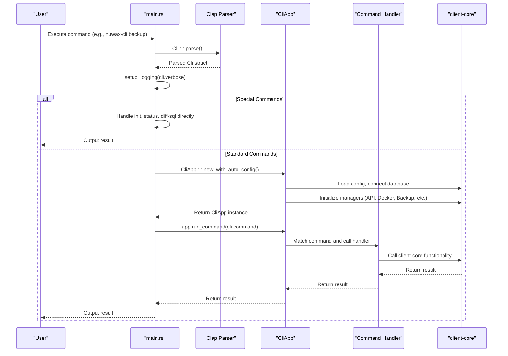
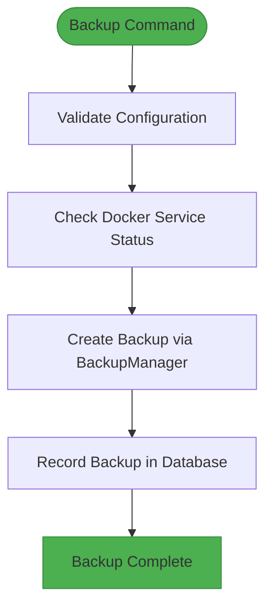
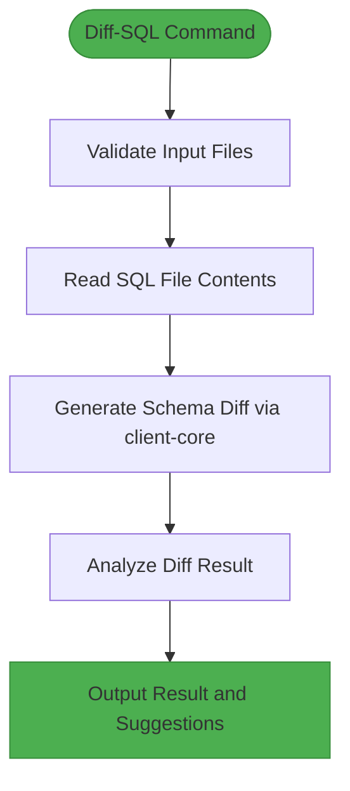
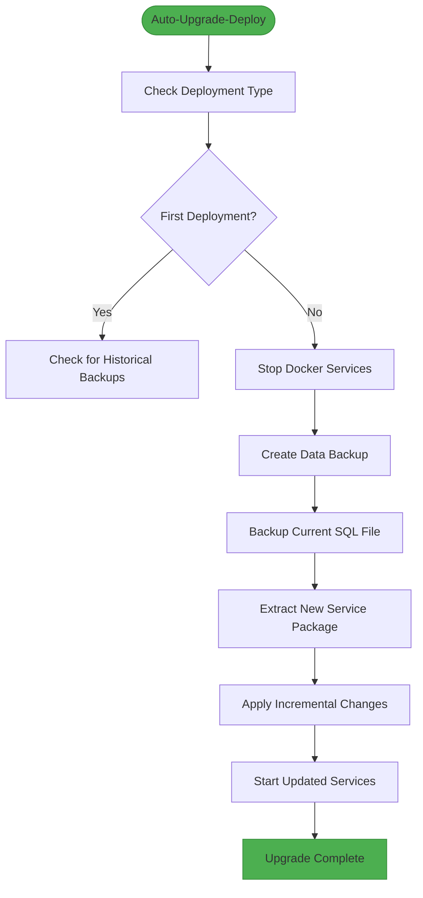
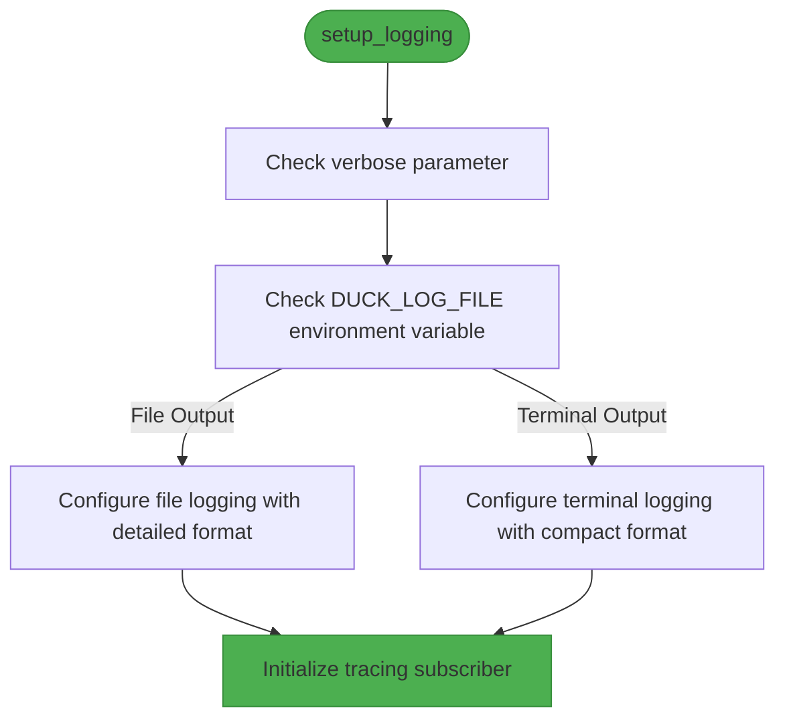
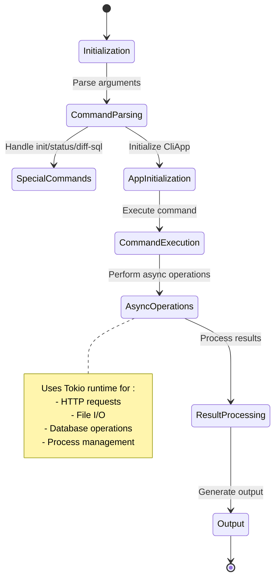

# CLI Component Architecture

<cite>
**Referenced Files in This Document**   
- [main.rs](file://nuwax-cli/src/main.rs#L1-L103)
- [cli.rs](file://nuwax-cli/src/cli.rs#L1-L221)
- [app.rs](file://nuwax-cli/src/app.rs#L1-L147)
- [backup.rs](file://nuwax-cli/src/commands/backup.rs#L1-L1033)
- [diff_sql.rs](file://nuwax-cli/src/commands/diff_sql.rs#L1-L114)
- [auto_upgrade_deploy.rs](file://nuwax-cli/src/commands/auto_upgrade_deploy.rs#L1-L1127)
- [utils/mod.rs](file://nuwax-cli/src/utils/mod.rs#L317-L516)
- [client-core/src/backup.rs](file://client-core/src/backup.rs)
</cite>

## Table of Contents
1. [Introduction](#introduction)
2. [Command-Line Interface Structure](#command-line-interface-structure)
3. [Execution Flow](#execution-flow)
4. [Command Implementation Examples](#command-implementation-examples)
5. [Error Handling Patterns](#error-handling-patterns)
6. [Logging Integration](#logging-integration)
7. [Async Execution with Tokio](#async-execution-with-tokio)
8. [Extending the CLI Interface](#extending-the-cli-interface)

## Introduction
The nuwax-cli application provides a comprehensive command-line interface for managing Docker services, performing backups, executing SQL differences, and handling automated upgrades. Built with the Clap library for argument parsing, this CLI serves as the primary user interface to the underlying client-core functionality. The architecture follows a clear separation of concerns, with the CLI layer handling user input and presentation, while delegating business logic to the client-core library. This document details the CLI component architecture, explaining how commands are structured, parsed, dispatched, and executed, along with the integration of error handling, logging, and asynchronous operations.

## Command-Line Interface Structure

The command-line interface of nuwax-cli is built using the Clap library, which provides a declarative approach to defining commands, subcommands, and arguments. The structure is hierarchical, with a main `Cli` struct that contains a `Commands` enum representing all available top-level commands.

```mermaid
classDiagram
class Cli {
+config : PathBuf
+verbose : bool
+command : Commands
}
class Commands {
+Status
+Init{force : bool}
+CheckUpdate(CheckUpdateCommand)
+ApiInfo
+Upgrade{args : UpgradeArgs}
+Backup
+ListBackups
+Rollback{backup_id : Option<i64>, force : bool, list_json : bool, rollback_data : bool}
+RollbackDataOnly{backup_id : Option<i64>, force : bool}
+DockerService(DockerServiceCommand)
+Ducker{args : Vec<String>}
+AutoBackup(AutoBackupCommand)
+AutoUpgradeDeploy(AutoUpgradeDeployCommand)
+Cache(CacheCommand)
+DiffSql{old_sql : PathBuf, new_sql : PathBuf, old_version : Option<String>, new_version : Option<String>, output : String}
}
class UpgradeArgs {
+force : bool
+check : bool
}
class AutoBackupCommand {
+Run
+Status
}
class AutoUpgradeDeployCommand {
+Run{port : Option<u16>}
+DelayTimeDeploy{time : u32, unit : String}
+Status
}
class CheckUpdateCommand {
+Check
+Install{version : Option<String>, force : bool}
}
class DockerServiceCommand {
+Start
+Stop
+Restart
+Status
+RestartContainer{container_name : String}
+LoadImages
+SetupTags
+ArchInfo
+ListImages
+CheckMountDirs
}
class CacheCommand {
+Clear
+Status
+CleanDownloads{keep : u32}
}
Cli --> Commands : "contains"
Commands --> UpgradeArgs : "uses"
Commands --> AutoBackupCommand : "uses"
Commands --> AutoUpgradeDeployCommand : "uses"
Commands --> CheckUpdateCommand : "uses"
Commands --> DockerServiceCommand : "uses"
Commands --> CacheCommand : "uses"
```

**Diagram sources**
- [cli.rs](file://nuwax-cli/src/cli.rs#L1-L221)

**Section sources**
- [cli.rs](file://nuwax-cli/src/cli.rs#L1-L221)

The `Cli` struct is annotated with `#[derive(Parser)]` from Clap, which automatically generates the argument parsing logic. It contains three main fields:
- `config`: A `PathBuf` specifying the configuration file path, with a default value of "config.toml"
- `verbose`: A boolean flag for enabling detailed output
- `command`: An enum of type `Commands` that represents the subcommand to be executed

The `Commands` enum uses `#[command(subcommand)]` to define a hierarchy of subcommands. Each variant corresponds to a specific command the user can invoke. Some commands, like `Upgrade`, `CheckUpdate`, `DockerService`, `AutoBackup`, `AutoUpgradeDeploy`, `Cache`, and `DiffSql`, contain nested arguments or subcommands, allowing for complex command structures with specific options.

For example, the `DiffSql` command requires two mandatory arguments (`old_sql` and `new_sql`), two optional version arguments (`old_version` and `new_version`), and an output file name with a default value. This structure enables users to perform SQL difference analysis with flexible input options.

## Execution Flow

The execution flow of nuwax-cli begins in the `main.rs` file, where the Tokio runtime is initialized with the `#[tokio::main]` macro. This sets up the asynchronous execution environment for the entire application.



**Diagram sources**
- [main.rs](file://nuwax-cli/src/main.rs#L1-L103)
- [app.rs](file://nuwax-cli/src/app.rs#L1-L147)

**Section sources**
- [main.rs](file://nuwax-cli/src/main.rs#L1-L103)
- [app.rs](file://nuwax-cli/src/app.rs#L1-L147)

The `main` function first parses the command-line arguments using `Cli::parse()`, which leverages Clap's automatic parsing based on the struct definition. After parsing, it calls `setup_logging(cli.verbose)` to configure the logging system according to the user's verbosity preference.

Certain commands are handled specially before the full application initialization:
- The `Init` command is handled directly in `main.rs` since it doesn't require a pre-existing configuration
- The `Status` command attempts to show basic version information even if application initialization fails, providing helpful guidance to users
- The `DiffSql` command is a pure file operation that doesn't require database or configuration initialization

For all other commands, the application creates a `CliApp` instance using `CliApp::new_with_auto_config().await`. This method is responsible for loading the configuration, connecting to the database, and initializing various managers (API client, Docker manager, backup manager, etc.). These managers are implemented in the client-core library and provide the business logic for the application.

Once the `CliApp` is initialized, it dispatches the command by calling `app.run_command(cli.command).await`. This method uses a match expression to route the command to the appropriate handler function, which then interacts with the client-core functionality to perform the requested operation.

## Command Implementation Examples

### Backup Command
The backup command implementation demonstrates the interaction between the CLI layer and client-core functionality. When a user runs `nuwax-cli backup`, the command is routed to the `run_backup` function in the commands module.



**Diagram sources**
- [backup.rs](file://nuwax-cli/src/commands/backup.rs#L1-L1033)
- [client-core/src/backup.rs](file://client-core/src/backup.rs)

**Section sources**
- [backup.rs](file://nuwax-cli/src/commands/backup.rs#L1-L1033)
- [client-core/src/backup.rs](file://client-core/src/backup.rs)

The implementation first validates the Docker Compose file and checks the status of running containers to ensure services are stopped before creating a backup. It then creates a `BackupManager` instance from client-core and calls its `create_backup` method with appropriate options. The `BackupManager` handles the actual backup process, including file compression and database record creation.

### Diff-SQL Command
The diff-sql command provides a pure file-based operation that compares two SQL files and generates a difference script. This command is special because it doesn't require application initialization.



**Diagram sources**
- [diff_sql.rs](file://nuwax-cli/src/commands/diff_sql.rs#L1-L114)
- [client-core/src/sql_diff/mod.rs](file://client-core/src/sql_diff/mod.rs)

**Section sources**
- [diff_sql.rs](file://nuwax-cli/src/commands/diff_sql.rs#L1-L114)

The `run_diff_sql` function first validates that both input files exist, then reads their contents. It calls `generate_schema_diff` from client-core's `sql_diff` module, which performs the actual SQL parsing and difference analysis. The result is then processed to determine if meaningful SQL statements were generated, and appropriate output is written to the specified file with user guidance.

### Auto-Upgrade-Deploy Command
The auto-upgrade-deploy command orchestrates a complex sequence of operations for upgrading the Docker services.



**Diagram sources**
- [auto_upgrade_deploy.rs](file://nuwax-cli/src/commands/auto_upgrade_deploy.rs#L1-L1127)

**Section sources**
- [auto_upgrade_deploy.rs](file://nuwax-cli/src/commands/auto_upgrade_deploy.rs#L1-L1127)

This command first determines whether this is a first-time deployment or an upgrade. For upgrades, it stops running services, creates a backup, and then downloads and extracts the new service package. It handles both full and incremental upgrades by analyzing the patch information and applying the appropriate file operations. The command leverages multiple client-core components, including the API client for fetching manifests, the upgrade manager for determining the upgrade strategy, and the backup manager for creating backups.

## Error Handling Patterns

The nuwax-cli application employs a comprehensive error handling strategy that combines Rust's type system with user-friendly error reporting. The primary error handling pattern uses the `anyhow` crate for error propagation and the `client_core::DuckError` type for domain-specific errors.

In the main execution flow, errors are handled with a consistent pattern:
```rust
if let Err(e) = some_operation().await {
    error!("❌ Operation failed: {}", e);
    std::process::exit(1);
}
```

This pattern captures errors, logs them with a descriptive message and emoji for visual clarity, and exits the process with a non-zero status code. For commands that need more nuanced error handling, such as the `Status` command, the application provides detailed guidance to users when initialization fails, suggesting possible causes and solutions.

The application also implements error source analysis to provide more specific error messages. For example, when application initialization fails, it examines the error chain to determine if the root cause is a missing configuration file, allowing it to provide a targeted suggestion to run `nuwax-cli init`.

**Section sources**
- [main.rs](file://nuwax-cli/src/main.rs#L1-L103)

## Logging Integration

Logging in nuwax-cli is implemented using the `tracing` and `tracing-subscriber` crates, following Rust CLI application best practices. The logging configuration is centralized in the `setup_logging` function in `utils/mod.rs`.

The logging system supports multiple configuration options:
- **Verbose flag**: The `--verbose` command-line argument sets the default log level to DEBUG
- **Environment variables**: The `RUST_LOG` environment variable allows fine-grained control over log levels for specific modules
- **Log file output**: Setting the `DUCK_LOG_FILE` environment variable redirects logs to a file with detailed formatting



**Diagram sources**
- [utils/mod.rs](file://nuwax-cli/src/utils/mod.rs#L457-L515)

**Section sources**
- [utils/mod.rs](file://nuwax-cli/src/utils/mod.rs#L457-L515)

When logging to the terminal, the system uses a compact format without timestamps, module paths, thread names, or line numbers to provide a clean, user-friendly output. When logging to a file, it includes all available information (timestamps, module paths, thread names, line numbers) to facilitate debugging. The system also filters out verbose logs from third-party libraries like reqwest, tokio, and hyper to reduce noise.

## Async Execution with Tokio

The nuwax-cli application is built on the Tokio asynchronous runtime, which is enabled by the `#[tokio::main]` macro on the main function. This allows the application to efficiently handle I/O-bound operations such as network requests, file operations, and database interactions.



**Diagram sources**
- [main.rs](file://nuwax-cli/src/main.rs#L5)
- [Cargo.toml](file://nuwax-cli/Cargo.toml#L55-L117)

**Section sources**
- [main.rs](file://nuwax-cli/src/main.rs#L5)

The application leverages Tokio's async/await syntax throughout its codebase, allowing for readable and maintainable asynchronous code. Key async operations include:
- Database connections and queries
- HTTP requests to the API server
- File system operations (reading, writing, compression)
- Docker service management
- Network operations for downloading service packages

The Cargo.toml file lists Tokio as a dependency with various features enabled, including full, rt-multi-thread, and fs, which provide the necessary functionality for the application's asynchronous operations.

## Extending the CLI Interface

Adding new commands to the nuwax-cli interface follows a consistent pattern that maintains the existing architecture. To add a new command:

1. **Define the command structure**: Add a new variant to the `Commands` enum in `cli.rs`, including any necessary arguments or subcommands.

2. **Implement the command handler**: Create a new function in the appropriate module within `src/commands/` that handles the command logic. This function should:
   - Use appropriate logging with `info!`, `warn!`, and `error!` macros
   - Handle errors using `anyhow::Result` and convert domain-specific errors when necessary
   - Interact with client-core functionality through the `CliApp` instance
   - Follow the async/await pattern for any asynchronous operations

3. **Register the command**: Add the command to the `run_command` method in `app.rs` using a match arm that calls the handler function.

4. **Add documentation**: Provide clear help text for the command and its arguments using Clap's documentation attributes.

The architecture encourages separation of concerns by keeping command parsing and routing in the CLI layer while delegating business logic to client-core. This allows for consistent error handling, logging, and async execution patterns across all commands. When implementing new commands, developers should leverage existing managers from client-core rather than duplicating functionality, promoting code reuse and maintainability.

**Section sources**
- [cli.rs](file://nuwax-cli/src/cli.rs#L1-L221)
- [app.rs](file://nuwax-cli/src/app.rs#L1-L147)
- [commands/mod.rs](file://nuwax-cli/src/commands/mod.rs)