# CLI Error Handling and Logging

<cite>
**Referenced Files in This Document**   
- [error.rs](file://nuwax-cli/src/docker_service/error.rs)
- [main.rs](file://nuwax-cli/src/main.rs)
- [mod.rs](file://nuwax-cli/src/utils/mod.rs)
- [error.rs](file://client-core/src/error.rs)
- [status.rs](file://nuwax-cli/src/commands/status.rs)
</cite>

## Table of Contents
1. [Introduction](#introduction)
2. [Error Type Definitions](#error-type-definitions)
3. [Error Propagation with Result Types](#error-propagation-with-result-types)
4. [Logging Framework Integration](#logging-framework-integration)
5. [Error Translation and User-Friendly Messages](#error-translation-and-user-friendly-messages)
6. [Error Recovery and Retry Mechanisms](#error-recovery-and-retry-mechanisms)
7. [Debugging Workflows and Log Analysis](#debugging-workflows-and-log-analysis)
8. [Conclusion](#conclusion)

## Introduction
The nuwax-cli application implements a comprehensive error handling and logging system designed to provide robust error management for Docker service operations. The system follows Rust CLI best practices, using the `thiserror` crate for custom error types, `anyhow` for context-aware error handling, and `tracing` for structured logging. This documentation details how errors are defined, propagated, logged, and presented to users across the application's command boundaries.

## Error Type Definitions

The error handling system in nuwax-cli is built around custom error types that provide specific context for different failure modes. The primary error types are defined in the `client-core` crate and extended in the `nuwax-cli` application.


**Diagram sources**
- [error.rs](file://client-core/src/error.rs#L1-L110)
- [error.rs](file://nuwax-cli/src/docker_service/error.rs#L1-L86)

**Section sources**
- [error.rs](file://client-core/src/error.rs#L1-L110)
- [error.rs](file://nuwax-cli/src/docker_service/error.rs#L1-L86)

The `DuckError` enum in the `client-core` crate serves as the foundational error type, encompassing various error categories such as configuration, database, network, and file system errors. The `DockerServiceError` enum in `nuwax-cli` extends this foundation with Docker-specific error types, providing granular error categorization for Docker service operations.

The `DockerServiceError` enum uses the `thiserror::Error` derive macro to automatically implement the `std::error::Error` trait and provide descriptive error messages. Each variant includes a formatted error message that provides context about the failure, such as "架构检测失败: {0}" (Architecture detection failed: {0}) for the `ArchitectureDetection` variant.

## Error Propagation with Result Types

Error propagation in nuwax-cli follows Rust's idiomatic approach using the `Result<T, E>` type and the `?` operator for early returns on error. The application defines type aliases like `DockerServiceResult<T>` to simplify function signatures and improve code readability.


**Diagram sources**
- [main.rs](file://nuwax-cli/src/main.rs#L1-L103)
- [error.rs](file://nuwax-cli/src/docker_service/error.rs#L1-L86)

**Section sources**
- [main.rs](file://nuwax-cli/src/main.rs#L1-L103)
- [error.rs](file://nuwax-cli/src/docker_service/error.rs#L1-L86)

In the `main.rs` file, the application entry point handles errors by converting them to appropriate exit codes and user-friendly messages. For example, when the `init` command fails, the error is logged with an emoji-prefixed message "❌ 初始化失败: {e}" (❌ Initialization failed: {e}) and the process exits with code 1.

The `From` trait implementations enable automatic error conversion between different error types. For instance, `std::io::Error` is automatically converted to `DockerServiceError::FileSystem`, and `client_core::DuckError` variants are mapped to appropriate `DockerServiceError` variants based on their type.

## Logging Framework Integration

The logging system in nuwax-cli is built on the `tracing` ecosystem, specifically using `tracing-subscriber` for subscriber management and `tracing-appender` for file-based logging. The logging configuration is centralized in the `setup_logging` function in `utils/mod.rs`.


**Diagram sources**
- [mod.rs](file://nuwax-cli/src/utils/mod.rs#L68-L200)
- [main.rs](file://nuwax-cli/src/main.rs#L27-L51)

**Section sources**
- [mod.rs](file://nuwax-cli/src/utils/mod.rs#L68-L200)

The `setup_logging` function configures the logging system based on the `verbose` CLI flag and the `DUCK_LOG_FILE` environment variable. When `verbose` is enabled, the default log level is set to "debug"; otherwise, it defaults to "info". The function also applies directives to suppress verbose logging from third-party crates like `reqwest`, `tokio`, and `hyper` to reduce noise.

For terminal output, the logger uses a compact format without timestamps, module paths, or thread names to provide a clean user experience. When logging to a file (specified by `DUCK_LOG_FILE`), the format includes additional debugging information such as timestamps, line numbers, and module paths.

The application uses various `tracing` macros (`info!`, `error!`, `warn!`, `debug!`) throughout the codebase to log events at different severity levels. These macros are used for both operational logging (e.g., "📦 开始解压Docker服务包" - "📦 Starting to extract Docker service package") and user guidance (e.g., "💡 状态分析和建议:" - "💡 Status analysis and suggestions:").

## Error Translation and User-Friendly Messages

Error translation in nuwax-cli focuses on converting low-level technical errors into user-friendly messages that guide users toward resolution. This is achieved through descriptive error enum variants, contextual error messages, and structured error handling in the main application flow.

```mermaid
sequenceDiagram
participant Core as client-core
participant CLI as nuwax-cli
participant User as End User
Core->>CLI : DuckError : : ConfigNotFound
CLI->>CLI : Map to user-friendly message
CLI->>User : "❌ 配置文件 'config.toml' 未找到。\n👉 请先运行 'nuwax-cli init' 命令来创建配置文件。"
Core->>CLI : DuckError : : Io(error)
CLI->>CLI : Map to DockerServiceError : : FileSystem
CLI->>User : "❌ 文件系统错误 : {error message}"
```



**Diagram sources**
- [main.rs](file://nuwax-cli/src/main.rs#L27-L51)
- [error.rs](file://client-core/src/error.rs#L1-L110)

**Section sources**
- [main.rs](file://nuwax-cli/src/main.rs#L27-L51)

When the application fails to initialize due to a missing configuration file, the error handling code specifically checks for the `DuckError::ConfigNotFound` variant and provides a targeted suggestion to run `nuwax-cli init`. This is implemented using error source chaining and downcasting:

```rust
let mut source = e.source();
let mut is_config_not_found = false;
while let Some(err) = source {
    if err.downcast_ref::<DuckError>().is_some() {
        if let Some(DuckError::ConfigNotFound) = err.downcast_ref::<DuckError>() {
            is_config_not_found = true;
            break;
        }
    }
    source = err.source();
}

if is_config_not_found {
    error!("❌ 配置文件 '{}' 未找到。", cli.config.display());
    error!("👉 请先运行 'nuwax-cli init' 命令来创建配置文件。");
} else {
    error!("❌ 应用初始化失败: {}", e);
}
```

The error messages incorporate emojis (e.g., ❌, 💡, 🔧) to enhance visual scanning and emotional tone, making error states more apparent and suggestions more approachable. The messages are also structured with clear separation between error descriptions and actionable recommendations.

## Error Recovery and Retry Mechanisms

While the provided code does not explicitly implement retry mechanisms, it demonstrates graceful degradation and fallback strategies, particularly in the CLI UI layer. The error recovery patterns focus on providing actionable feedback and alternative execution paths.

In the `status` command, when the application cannot retrieve detailed status information, it provides a comprehensive troubleshooting guide with potential causes and solutions:

```rust
error!("⚠️  无法获取完整状态信息: {}", e);
info!("");
info!("💡 可能的原因:");
info!("   - 当前目录不是 Nuwax Cli ent 工作目录");
info!("   - 配置文件或数据库文件不在当前目录");
info!("   - 数据库文件被其他进程占用");
info!("");
info!("🔧 解决方案:");
info!("   1. 切换到 Nuwax Cli ent 初始化的目录（包含 config.toml 的目录）");
info!("   2. 或者在新目录运行 'nuwax-cli init' 重新初始化");
info!("   3. 确保没有其他 nuwax-cli 进程在运行");
```

This approach transforms what could be a cryptic error into a structured diagnostic process, guiding users through common failure scenarios. The use of categorized sections (💡 可能的原因: - "💡 Possible causes:" and 🔧 解决方案: - "🔧 Solutions:") helps users systematically address the issue.

The Tauri frontend also implements a fallback mechanism for CLI execution, attempting to use a sidecar binary first and falling back to a system-installed binary if the sidecar fails:

```typescript
static async executeDuckCliSmart(args: string[], workingDir?: string): Promise<{ stdout: string; stderr: string; code: number }> {
    try {
        // 优先使用 Sidecar 方式
        return await this.executeDuckCli(args, workingDir);
    } catch (sidecarError) {
        console.warn('Sidecar failed, fallback to system command:', sidecarError);
        
        try {
            // 降级到系统命令
            return await this.executeSystemDuckCli(args, workingDir);
        } catch (systemError) {
            console.error('Both sidecar and system commands failed');
            throw new Error(`CLI execution failed: ${systemError}`);
        }
    }
}
```

This retry mechanism enhances reliability by providing alternative execution paths when the preferred method fails.

## Debugging Workflows and Log Analysis

The logging system in nuwax-cli is designed to support effective debugging and troubleshooting through structured log output, configurable verbosity, and multiple output destinations.

The primary debugging workflow involves using the `--verbose` flag or setting environment variables to increase log detail:

```bash
# Standard logging to terminal
nuwax-cli auto-backup status

# Detailed logging to terminal
nuwax-cli -v auto-backup status

# Logging to file
DUCK_LOG_FILE=duck.log nuwax-cli auto-backup status

# Fine-grained control with RUST_LOG
RUST_LOG=duck_cli::commands::auto_backup=debug nuwax-cli auto-backup status
```

For log analysis, developers can examine the structured output in log files that include timestamps, line numbers, and module paths when `DUCK_LOG_FILE` is set. The terminal output prioritizes readability with a compact format that omits technical details that might overwhelm end users.

The application also includes progress indicators for long-running operations, such as file extraction:

```rust
info!("     ⏳ {} 复制进度: {:.1}% ({:.1}/{:.1} MB)", file_name, percent as f64, mb_copied, mb_total);
```

These progress messages help users understand the application's state during potentially lengthy operations and can aid in diagnosing performance issues.

## Conclusion
The error handling and logging system in nuwax-cli demonstrates a well-structured approach to managing failures in a CLI application. By combining custom error types with descriptive messages, implementing proper error propagation through Result types, and integrating a flexible logging framework, the application provides a robust foundation for reliability and user experience. The system effectively translates technical errors into actionable user guidance while maintaining sufficient detail for debugging and troubleshooting. Future enhancements could include implementing explicit retry mechanisms for transient failures and expanding the structured logging capabilities for better observability.