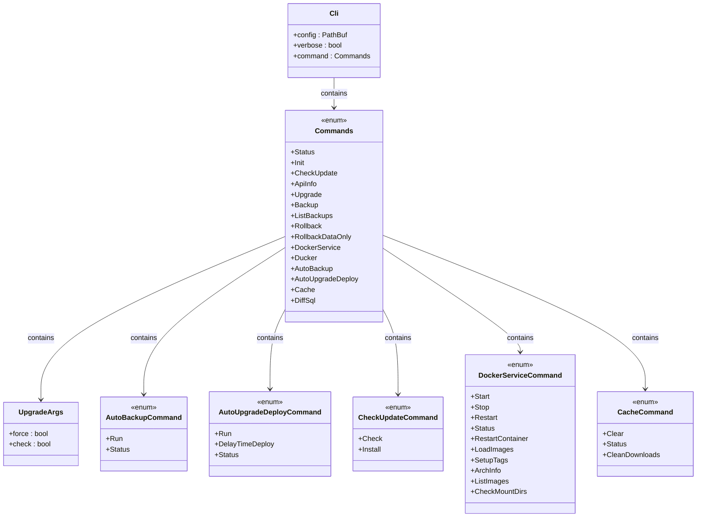

# CLI Execution Flow

<cite>
**Referenced Files in This Document**   
- [main.rs](file://nuwax-cli/src/main.rs)
- [cli.rs](file://nuwax-cli/src/cli.rs)
- [app.rs](file://nuwax-cli/src/app.rs)
- [commands/mod.rs](file://nuwax-cli/src/commands/mod.rs)
- [commands/status.rs](file://nuwax-cli/src/commands/status.rs)
- [commands/backup.rs](file://nuwax-cli/src/commands/backup.rs)
- [config.rs](file://client-core/src/config.rs)
- [upgrade.rs](file://client-core/src/upgrade.rs)
- [container/service.rs](file://client-core/src/container/service.rs)
- [backup.rs](file://client-core/src/backup.rs)
- [database.rs](file://client-core/src/database.rs)
- [db/manager.rs](file://client-core/src/db/manager.rs)
- [db/actor.rs](file://client-core/src/db/actor.rs)
- [db/messages.rs](file://client-core/src/db/messages.rs)
</cite>

## Table of Contents
1. [Introduction](#introduction)
2. [Project Structure](#project-structure)
3. [Core Components](#core-components)
4. [Architecture Overview](#architecture-overview)
5. [Detailed Component Analysis](#detailed-component-analysis)
6. [Dependency Analysis](#dependency-analysis)
7. [Performance Considerations](#performance-considerations)
8. [Troubleshooting Guide](#troubleshooting-guide)
9. [Conclusion](#conclusion)

## Introduction
This document provides a comprehensive analysis of the end-to-end execution flow of the nuwax-cli application. The analysis covers the entire lifecycle from binary entry point through command dispatch, configuration management, core library initialization, and business logic execution. Special focus is given to the asynchronous execution model using Tokio, data flow between components, and integration with Docker, remote servers, and local storage systems. The document includes detailed sequence diagrams and flowcharts to visualize key processes such as update checks, upgrade deployments, and backup operations, along with comprehensive error handling and logging integration.

## Project Structure
The nuwax-cli application follows a modular architecture with clear separation of concerns between the CLI interface and core business logic. The project structure is organized into several key components:


**Diagram sources**
- [main.rs](file://nuwax-cli/src/main.rs)
- [cli.rs](file://nuwax-cli/src/cli.rs)
- [app.rs](file://nuwax-cli/src/app.rs)
- [config.rs](file://client-core/src/config.rs)
- [upgrade.rs](file://client-core/src/upgrade.rs)
- [container/service.rs](file://client-core/src/container/service.rs)
- [backup.rs](file://client-core/src/backup.rs)
- [database.rs](file://client-core/src/database.rs)
- [db/manager.rs](file://client-core/src/db/manager.rs)
- [db/actor.rs](file://client-core/src/db/actor.rs)
- [db/messages.rs](file://client-core/src/db/messages.rs)

**Section sources**
- [main.rs](file://nuwax-cli/src/main.rs)
- [cli.rs](file://nuwax-cli/src/cli.rs)
- [app.rs](file://nuwax-cli/src/app.rs)

## Core Components
The nuwax-cli application consists of several core components that work together to provide Docker service management and upgrade functionality. The main entry point is in `main.rs`, which uses Clap for argument parsing and Tokio for asynchronous execution. The CLI structure is defined in `cli.rs` with various command types and subcommands. The application state and command dispatch are managed by `CliApp` in `app.rs`, which coordinates between different managers for configuration, database, Docker, backup, and upgrade operations.

**Section sources**
- [main.rs](file://nuwax-cli/src/main.rs#L1-L102)
- [cli.rs](file://nuwax-cli/src/cli.rs#L1-L221)
- [app.rs](file://nuwax-cli/src/app.rs#L1-L147)

## Architecture Overview
The nuwax-cli application follows a layered architecture with clear separation between the presentation layer (CLI), application logic, and core business components. The architecture leverages the client-core library for shared functionality across different clients.


**Diagram sources**
- [main.rs](file://nuwax-cli/src/main.rs)
- [app.rs](file://nuwax-cli/src/app.rs)
- [config.rs](file://client-core/src/config.rs)
- [database.rs](file://client-core/src/database.rs)
- [container/service.rs](file://client-core/src/container/service.rs)
- [backup.rs](file://client-core/src/backup.rs)
- [upgrade.rs](file://client-core/src/upgrade.rs)

## Detailed Component Analysis

### Entry Point and Initialization
The application entry point is in `main.rs`, which uses the Tokio runtime for asynchronous execution. The execution flow begins with command-line argument parsing using Clap, followed by logging setup and special handling for certain commands that don't require full application initialization.


**Diagram sources**
- [main.rs](file://nuwax-cli/src/main.rs#L1-L102)
- [cli.rs](file://nuwax-cli/src/cli.rs#L1-L221)
- [app.rs](file://nuwax-cli/src/app.rs#L1-L147)
- [config.rs](file://client-core/src/config.rs#L1-L661)
- [database.rs](file://client-core/src/database.rs#L1-L370)

**Section sources**
- [main.rs](file://nuwax-cli/src/main.rs#L1-L102)
- [cli.rs](file://nuwax-cli/src/cli.rs#L1-L221)
- [app.rs](file://nuwax-cli/src/app.rs#L1-L147)

### Command Line Interface Structure
The CLI structure is defined using Clap's derive macros in `cli.rs`, providing a hierarchical command structure with various subcommands for different operations.



**Diagram sources**
- [cli.rs](file://nuwax-cli/src/cli.rs#L1-L221)

**Section sources**
- [cli.rs](file://nuwax-cli/src/cli.rs#L1-L221)

### Application State Management
The `CliApp` struct in `app.rs` serves as the central coordinator for the application, managing state and providing access to various managers for different operations.


**Diagram sources**
- [app.rs](file://nuwax-cli/src/app.rs#L1-L147)
- [config.rs](file://client-core/src/config.rs#L1-L661)
- [database.rs](file://client-core/src/database.rs#L1-L370)
- [upgrade.rs](file://client-core/src/upgrade.rs#L1-L90)

**Section sources**
- [app.rs](file://nuwax-cli/src/app.rs#L1-L147)

### Configuration Management
The configuration system in `client-core/src/config.rs` provides a robust mechanism for loading, validating, and managing application configuration with support for versioning and migration.


**Diagram sources**
- [config.rs](file://client-core/src/config.rs#L1-L661)

**Section sources**
- [config.rs](file://client-core/src/config.rs#L1-L661)

### Database Architecture
The database system uses an Actor pattern to ensure thread-safe access to DuckDB, with a message-passing architecture between the manager and actor components.

```mermaid
sequenceDiagram
participant App as Application
participant Manager as DuckDbManager
participant Actor as DuckDbActor
participant DB as DuckDB
App->>Manager : Database Operation
Manager->>Manager : Create oneshot channel
Manager->>Actor : Send DbMessage with respond_to
Actor->>DB : Execute Operation
DB-->>Actor : Return Result
Actor->>Manager : Send Result via respond_to
Manager-->>App : Return Result
Note over Manager,Actor : Message passing ensures<br/>single-threaded access to DuckDB
```

**Diagram sources**
- [db/manager.rs](file://client-core/src/db/manager.rs#L1-L540)
- [db/actor.rs](file://client-core/src/db/actor.rs#L1-L742)
- [db/messages.rs](file://client-core/src/db/messages.rs#L1-L196)

**Section sources**
- [db/manager.rs](file://client-core/src/db/manager.rs#L1-L540)
- [db/actor.rs](file://client-core/src/db/actor.rs#L1-L742)
- [db/messages.rs](file://client-core/src/db/messages.rs#L1-L196)

### Status Command Flow
The status command provides comprehensive system information and follows a specific execution flow to gather and display relevant data.


**Diagram sources**
- [commands/status.rs](file://nuwax-cli/src/commands/status.rs#L1-L139)

**Section sources**
- [commands/status.rs](file://nuwax-cli/src/commands/status.rs#L1-L139)

### Backup Process
The backup process involves coordination between multiple components to create a comprehensive backup of the system state.


**Diagram sources**
- [commands/backup.rs](file://nuwax-cli/src/commands/backup.rs#L1-L1033)
- [backup.rs](file://client-core/src/backup.rs#L1-L624)

**Section sources**
- [commands/backup.rs](file://nuwax-cli/src/commands/backup.rs#L1-L1033)
- [backup.rs](file://client-core/src/backup.rs#L1-L624)

## Dependency Analysis
The nuwax-cli application has a well-defined dependency structure with clear separation between the CLI interface and core business logic. The main dependencies are organized as follows:


**Diagram sources**
- [nuwax-cli/Cargo.toml](file://nuwax-cli/Cargo.toml)
- [client-core/Cargo.toml](file://client-core/Cargo.toml)

**Section sources**
- [nuwax-cli/Cargo.toml](file://nuwax-cli/Cargo.toml)
- [client-core/Cargo.toml](file://client-core/Cargo.toml)

## Performance Considerations
The application employs several performance optimization techniques:

1. **Async/Await Pattern**: Uses Tokio for non-blocking I/O operations, allowing efficient handling of concurrent operations.
2. **Blocking Task Isolation**: Long-running CPU-intensive operations (like backup compression) are moved to blocking tasks to prevent blocking the async runtime.
3. **Actor Pattern**: The database access uses an Actor pattern to ensure thread safety while maintaining performance.
4. **Caching**: Configuration and frequently accessed data are cached to reduce redundant operations.
5. **Connection Pooling**: Database connections are managed efficiently through the DuckDbManager.

The backup process specifically uses `tokio::task::spawn_blocking` to handle the CPU-intensive tar/gzip operations without blocking the async runtime, ensuring that other operations can continue while backups are being created.

## Troubleshooting Guide
This section documents common issues and their solutions based on the error handling patterns in the codebase.

**Section sources**
- [main.rs](file://nuwax-cli/src/main.rs#L1-L102)
- [app.rs](file://nuwax-cli/src/app.rs#L1-L147)
- [commands/status.rs](file://nuwax-cli/src/commands/status.rs#L1-L139)

### Configuration Not Found
When the configuration file is not found, the application provides specific guidance:


**Solution**: Run `nuwax-cli init` to create the configuration file.

### Database Initialization Required
When the database exists but is not initialized:

```mermaid
flowchart TD
A[Database Not Initialized] --> B[Check is_database_initialized()]
B --> C{Returns false?}
C --> |Yes| D[Show init command suggestion]
C --> |No| E[Show generic error]
D --> F[Exit with code 1]
E --> F
```

**Solution**: Run `nuwax-cli init` to initialize the database.

### Docker Service Status Issues
When Docker services cannot be checked:


**Solutions**:
1. Ensure Docker is installed and running
2. Ensure docker-compose is available
3. Check file permissions
4. Verify network connectivity

## Conclusion
The nuwax-cli application demonstrates a well-architected Rust CLI tool with clear separation of concerns, robust error handling, and efficient asynchronous execution. The application follows modern Rust practices with proper use of async/await, error handling with anyhow and DuckError, and thread-safe database access through the Actor pattern. The modular design with the client-core library allows for code reuse across different clients. The comprehensive error handling and user-friendly error messages make the application robust and user-friendly. The use of Clap for argument parsing, Tokio for async execution, and tracing for logging provides a solid foundation for a production-quality CLI tool.