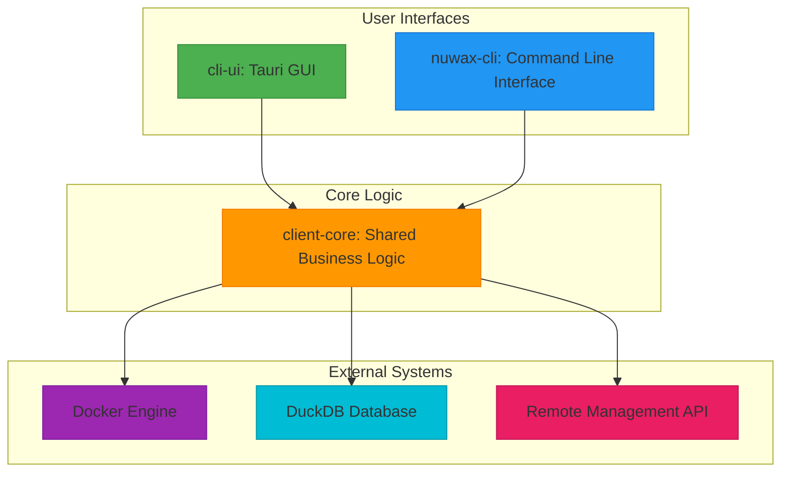
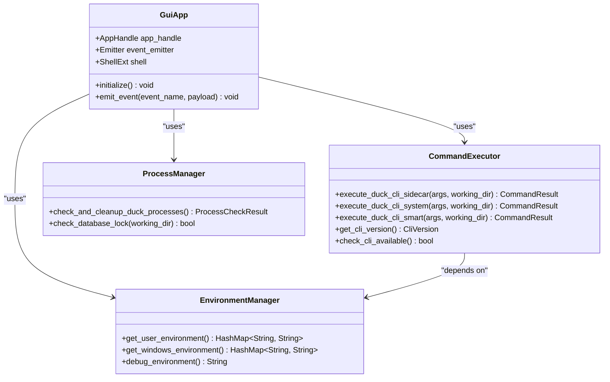
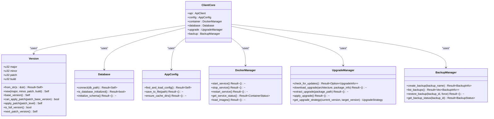
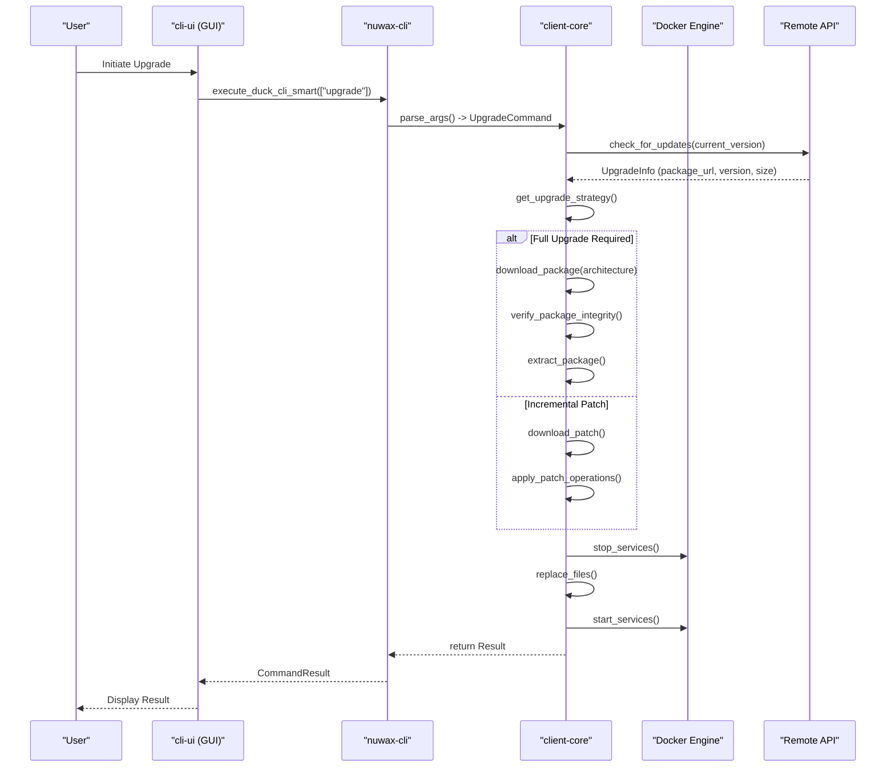
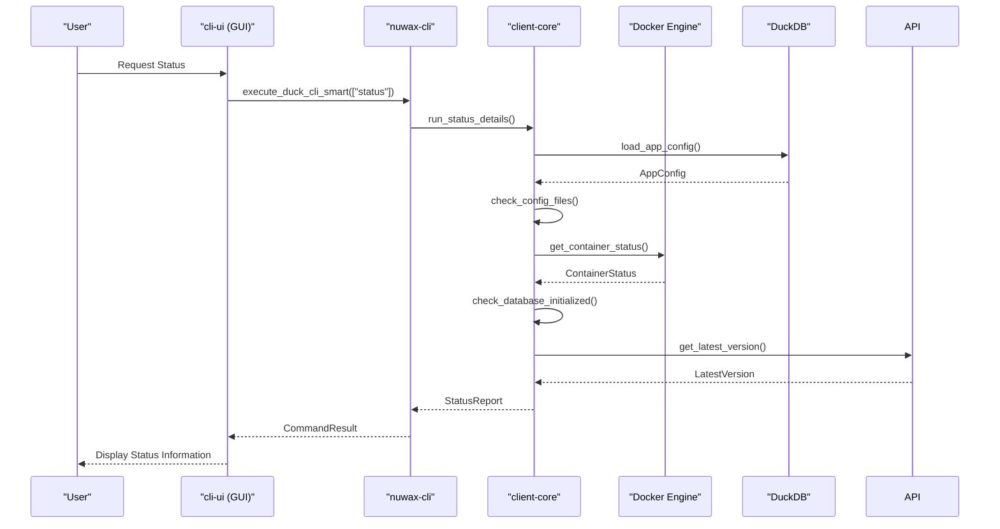

# Component Architecture and Interactions

<cite>
**Referenced Files in This Document**   
- [README.md](file://README.md)
- [cli-ui/README.md](file://cli-ui/README.md)
- [spec/Design.md](file://spec/Design.md)
- [spec/cli-ui.md](file://spec/cli-ui.md)
- [nuwax-cli/src/main.rs](file://nuwax-cli/src/main.rs)
- [nuwax-cli/src/cli.rs](file://nuwax-cli/src/cli.rs)
- [nuwax-cli/src/app.rs](file://nuwax-cli/src/app.rs)
- [nuwax-cli/src/lib.rs](file://nuwax-cli/src/lib.rs)
- [client-core/src/lib.rs](file://client-core/src/lib.rs)
- [client-core/src/version.rs](file://client-core/src/version.rs)
- [client-core/src/db/actor.rs](file://client-core/src/db/actor.rs)
- [cli-ui/src-tauri/src/commands/cli.rs](file://cli-ui/src-tauri/src/commands/cli.rs)
- [cli-ui/src-tauri/src/commands/mod.rs](file://cli-ui/src-tauri/src/commands/mod.rs)
- [cli-ui/src-tauri/build.rs](file://cli-ui/src-tauri/build.rs)
</cite>

## Table of Contents
1. [Introduction](#introduction)
2. [Core Components Overview](#core-components-overview)
3. [Architecture Overview](#architecture-overview)
4. [Detailed Component Analysis](#detailed-component-analysis)
5. [Data Flow and Command Execution](#data-flow-and-command-execution)
6. [Sequence Diagrams for Key Operations](#sequence-diagrams-for-key-operations)
7. [Error Handling and Async Processing](#error-handling-and-async-processing)
8. [State Management Patterns](#state-management-patterns)

## Introduction
The duck_client project is a comprehensive containerized service management system that provides lifecycle management for Docker services, including deployment, upgrade, backup, and monitoring. The system is designed with a modular architecture consisting of three main components: a Tauri-based GUI (cli-ui), a standalone CLI tool (nuwax-cli), and a shared business logic library (client-core). This document provides a detailed analysis of the component architecture, their interactions, and the data flow between them. The system leverages Rust's async capabilities through Tokio and follows a clean separation of concerns, allowing both the GUI and CLI to share the same core functionality while providing different user interfaces.

## Core Components Overview
The duck_client system is structured around three primary components that share a common core library. The cli-ui component provides a graphical user interface built with Tauri, React, and TypeScript, offering an accessible way for users to manage their Docker services. The nuwax-cli component serves as a standalone command-line interface that can be used independently of the GUI, providing the same functionality through terminal commands. Both of these user-facing components rely on the client-core library, which contains all the shared business logic, including service management, upgrade strategies, backup operations, and database interactions. This architectural pattern ensures that functionality is implemented in a single place, reducing code duplication and ensuring consistency across interfaces. The client-core library exports essential modules such as configuration management, database operations, container management, and upgrade functionality, which are consumed by both the CLI and GUI components.

**Section sources**
- [README.md](file://README.md)
- [spec/Design.md](file://spec/Design.md)

## Architecture Overview
The duck_client architecture follows a layered approach with a clear separation between user interface, command processing, and business logic. At the highest level, the system consists of two user-facing applications (the Tauri GUI and the CLI tool) that both depend on a shared core library. This core library contains all the business logic and is responsible for interacting with external systems such as Docker, databases, and remote APIs. The architecture is designed to be modular, with each component having well-defined responsibilities and interfaces. The Tauri application in cli-ui uses a sidecar pattern to execute the nuwax-cli binary, allowing the GUI to leverage the existing CLI functionality while providing a richer user experience. Alternatively, the GUI can execute system-installed CLI binaries, providing flexibility in deployment scenarios. The client-core library is structured as a Rust crate with multiple modules that handle specific aspects of the system's functionality, including configuration, database management, container operations, and upgrade strategies.



**Diagram sources**
- [spec/Design.md](file://spec/Design.md)
- [README.md](file://README.md)

## Detailed Component Analysis

### cli-ui (Tauri-based GUI) Analysis
The cli-ui component is a desktop application built using the Tauri framework with a React frontend. It provides a graphical interface for users to interact with the duck_client system without needing to use the command line. The application is structured with a React frontend that communicates with a Rust backend through Tauri commands. The frontend components are organized in the src/components directory and include various UI elements such as modals, panels, and status displays. The backend, located in src-tauri, exposes a set of commands that the frontend can invoke to perform operations on the system. These commands act as a bridge between the JavaScript/TypeScript frontend and the Rust backend, allowing the GUI to execute privileged operations that would not be possible in a browser environment. The build process for cli-ui automatically compiles the nuwax-cli binary and includes it as a sidecar application, ensuring that the GUI has access to the CLI functionality even if it's not installed on the system.



**Diagram sources**
- [cli-ui/src-tauri/src/commands/cli.rs](file://cli-ui/src-tauri/src/commands/cli.rs)
- [cli-ui/src-tauri/src/commands/mod.rs](file://cli-ui/src-tauri/src/commands/mod.rs)

**Section sources**
- [cli-ui/README.md](file://cli-ui/README.md)
- [cli-ui/src-tauri/build.rs](file://cli-ui/src-tauri/build.rs)
- [cli-ui/src-tauri/src/commands/cli.rs](file://cli-ui/src-tauri/src/commands/cli.rs)

### nuwax-cli (Standalone CLI) Analysis
The nuwax-cli component is a standalone command-line interface built with Rust and the Clap library for argument parsing. It serves as the primary interface for users who prefer command-line tools or need to automate operations through scripts. The CLI is structured around a command pattern, where the main application parses command-line arguments and dispatches to the appropriate handler function. Each command corresponds to a specific operation such as status checking, upgrading, backing up, or managing Docker services. The nuwax-cli application uses the client-core library for all business logic, acting primarily as a thin wrapper that parses user input and presents output in a terminal-friendly format. The application is initialized with the tokio runtime, allowing it to handle asynchronous operations such as network requests and file operations efficiently. For commands that don't require configuration (like init), the CLI can operate immediately, while most other commands require loading the application configuration and initializing the database connection before proceeding.

```mermaid
classDiagram
class CliApp {
+Arc~AppConfig~ config
+Arc~Database~ database
+Arc~ApiClient~ api_client
+Arc~AuthenticatedClient~ authenticated_client
+Arc~DockerManager~ docker_manager
+Arc~BackupManager~ backup_manager
+Arc~UpgradeManager~ upgrade_manager
+new_with_auto_config() Result~Self~
}
class Cli {
+PathBuf config
+bool verbose
+Commands command
}
class Commands {
+Status
+Init{force : bool}
+CheckUpdate(CheckUpdateCommand)
+ApiInfo
+Upgrade{args : UpgradeArgs}
+Backup
+ListBackups
+Rollback{backup_id : Option~i64~, force : bool, list_json : bool, rollback_data : bool}
+RollbackDataOnly{backup_id : Option~i64~, force : bool}
+DockerService(DockerServiceCommand)
+Ducker{args : Vec~String~}
+AutoBackup(AutoBackupCommand)
+AutoUpgradeDeploy(AutoUpgradeDeployCommand)
+Cache(CacheCommand)
+DiffSql{old_sql : PathBuf, new_sql : PathBuf, old_version : Option~String~, new_version : Option~String~, output : String}
}
class UpgradeArgs {
+bool force
+bool check
}
class DockerServiceCommand {
+Start
+Stop
+Restart
+Status
+RestartContainer{container_name : String}
+LoadImages
+SetupTags
+ArchInfo
+ListImages
+CheckMountDirs
}
CliApp --> AppConfig : "contains"
CliApp --> Database : "contains"
CliApp --> ApiClient : "contains"
CliApp --> DockerManager : "contains"
CliApp --> BackupManager : "contains"
CliApp --> UpgradeManager : "contains"
Cli --> Commands : "contains"
Commands --> UpgradeArgs : "contains"
Commands --> DockerServiceCommand : "contains"
```

**Diagram sources**
- [nuwax-cli/src/main.rs](file://nuwax-cli/src/main.rs)
- [nuwax-cli/src/cli.rs](file://nuwax-cli/src/cli.rs)
- [nuwax-cli/src/app.rs](file://nuwax-cli/src/app.rs)

**Section sources**
- [nuwax-cli/src/main.rs](file://nuwax-cli/src/main.rs)
- [nuwax-cli/src/cli.rs](file://nuwax-cli/src/cli.rs)
- [nuwax-cli/src/app.rs](file://nuwax-cli/src/app.rs)

### client-core (Shared Business Logic) Analysis
The client-core component is the heart of the duck_client system, containing all the shared business logic that is used by both the GUI and CLI interfaces. This Rust library is structured as a collection of modules that handle specific aspects of the system's functionality. The architecture follows Rust's module system, with each module encapsulating related functionality and exposing a clean API. Key modules include api for API communication, config for configuration management, container for Docker container operations, database for database interactions, and upgrade for service upgrade functionality. The library uses a combination of synchronous and asynchronous code, with async operations managed by the Tokio runtime. Error handling is consistent throughout the library, with custom error types defined in the error module and propagated using Rust's Result type. The library also includes functionality for version management, with a Version struct that supports four-segment version numbers (major.minor.patch.build) to support both full and incremental updates.



**Diagram sources**
- [client-core/src/lib.rs](file://client-core/src/lib.rs)
- [client-core/src/version.rs](file://client-core/src/version.rs)
- [client-core/src/db/actor.rs](file://client-core/src/db/actor.rs)

**Section sources**
- [client-core/src/lib.rs](file://client-core/src/lib.rs)
- [client-core/src/version.rs](file://client-core/src/version.rs)

## Data Flow and Command Execution
The data flow in the duck_client system follows a consistent pattern across both the GUI and CLI interfaces. When a user initiates an operation, whether through the GUI or command line, the request is translated into a call to the appropriate functionality in the client-core library. In the CLI, this happens directly through function calls, while in the GUI, it occurs through Tauri commands that bridge the JavaScript and Rust layers. The client-core library then orchestrates the operation, potentially interacting with external systems like Docker, the local database, or remote APIs. Results are returned through the call chain and presented to the user in the appropriate format. For long-running operations, the system provides progress updates through event emitters in the GUI or real-time output in the CLI. The architecture ensures that all business logic resides in the client-core library, maintaining consistency between interfaces and simplifying maintenance and updates.

## Sequence Diagrams for Key Operations

### Service Upgrade Operation
The service upgrade operation begins when a user initiates an upgrade through either the GUI or CLI. In the GUI, this triggers a Tauri command that executes the nuwax-cli binary with the appropriate arguments. The CLI parses these arguments and invokes the upgrade functionality in the client-core library. The upgrade manager first checks for available updates by querying the remote API, then determines the appropriate upgrade strategy (full or incremental) based on the current and target versions. If a download is required, the system retrieves the appropriate package for the user's architecture, verifies its integrity, and extracts it to the appropriate location. Finally, the upgrade is applied, and the system is restarted if necessary. Throughout this process, progress is reported back to the user interface.



**Diagram sources**
- [nuwax-cli/src/main.rs](file://nuwax-cli/src/main.rs)
- [client-core/src/upgrade.rs](file://client-core/src/upgrade.rs)
- [cli-ui/src-tauri/src/commands/cli.rs](file://cli-ui/src-tauri/src/commands/cli.rs)

### Status Check Operation
The status check operation provides users with information about the current state of their Docker services and the client application. When a user requests status information, the system collects data from multiple sources, including the Docker engine, local configuration files, and the application database. The CLI or GUI interface calls into the client-core library, which coordinates the collection of this information. The system checks whether the Docker services are running, verifies the integrity of configuration files, and retrieves version information from both the local installation and the remote API. This information is then formatted and presented to the user, often with suggestions for next steps based on the current state. The operation is designed to be fast and reliable, providing users with immediate feedback about their system's health.



**Diagram sources**
- [nuwax-cli/src/commands/status.rs](file://nuwax-cli/src/commands/status.rs)
- [client-core/src/config.rs](file://client-core/src/config.rs)
- [client-core/src/container/mod.rs](file://client-core/src/container/mod.rs)

## Error Handling and Async Processing
The duck_client system employs a comprehensive error handling strategy that ensures robust operation even in the face of failures. In the client-core library, errors are represented using custom error types that implement the std::error::Error trait, allowing them to be easily propagated through the call stack. The system uses Rust's Result type extensively, with functions returning Result<T, DuckError> where appropriate. For asynchronous operations, the system leverages Tokio's runtime, which provides efficient concurrency and non-blocking I/O. Long-running operations such as downloads and upgrades are executed asynchronously, allowing the system to remain responsive and provide real-time feedback to users. Error recovery mechanisms are built into critical operations, with automatic retries for transient failures and rollback procedures for operations that fail midway. The GUI and CLI interfaces present errors in user-friendly formats, often with suggestions for resolution.

**Section sources**
- [client-core/src/error.rs](file://client-core/src/error.rs)
- [nuwax-cli/src/main.rs](file://nuwax-cli/src/main.rs)
- [cli-ui/src-tauri/src/commands/cli.rs](file://cli-ui/src-tauri/src/commands/cli.rs)

## State Management Patterns
The duck_client system uses a combination of persistent and in-memory state management to track the application's status and user operations. The primary state storage is a DuckDB database that persists critical information such as application configuration, user preferences, operation history, and system status. This database is accessed through a thread-safe DatabaseManager that handles connection pooling and query execution. For real-time operations, the system maintains in-memory state that tracks the progress of ongoing tasks, such as downloads or upgrades. This state is updated frequently and broadcast to interested components through channels or event emitters. The system also implements a state machine pattern for managing the application's lifecycle, with well-defined states such as uninitialized, initializing, ready, upgrading, and error. This approach ensures consistency across the application and provides a clear indication of the system's current capabilities.

**Section sources**
- [client-core/src/db/actor.rs](file://client-core/src/db/actor.rs)
- [client-core/src/db/messages.rs](file://client-core/src/db/messages.rs)
- [spec/ui-tasks.md](file://spec/ui-tasks.md)