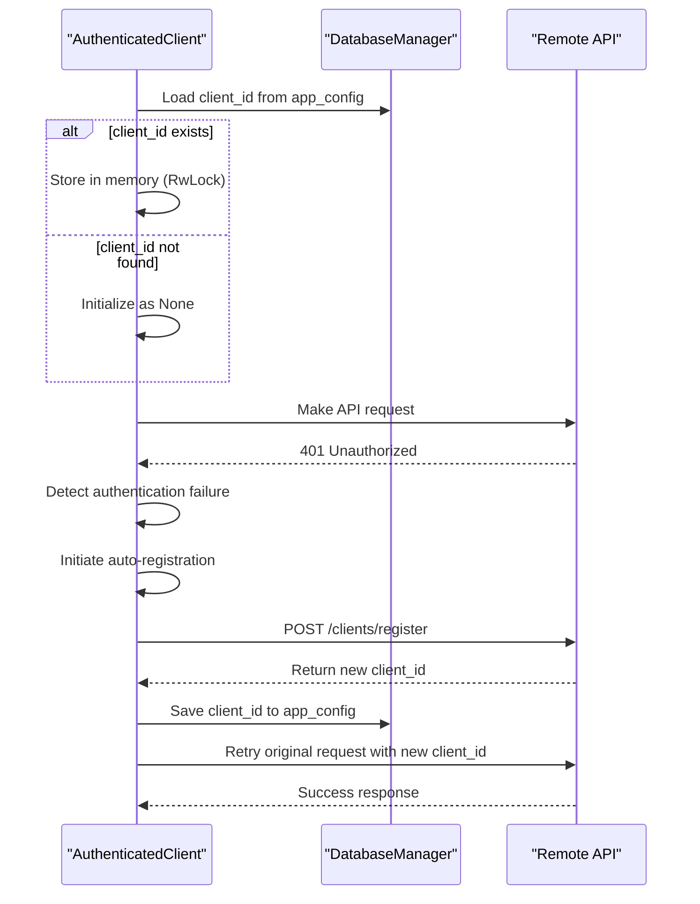
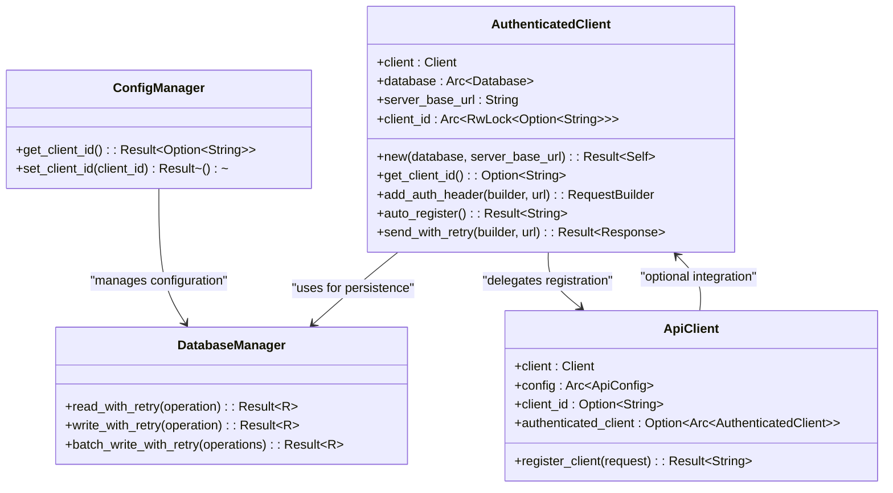
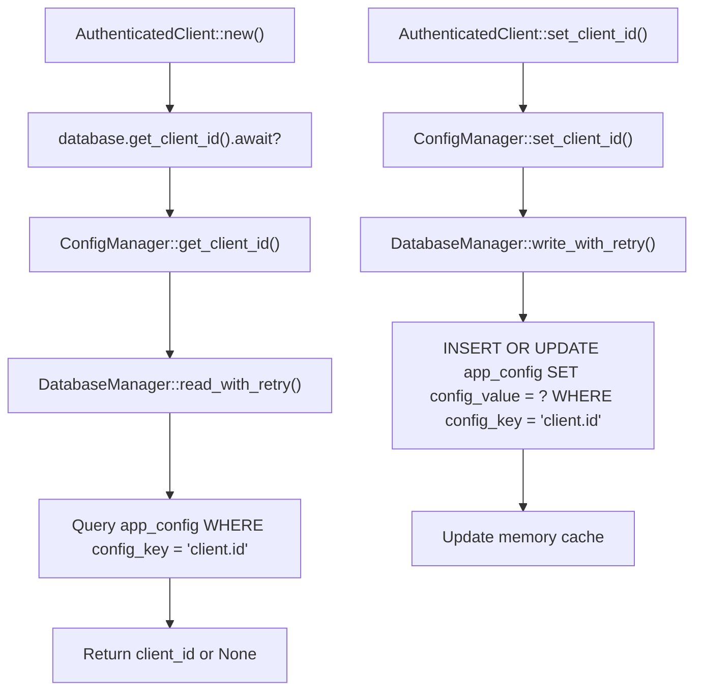
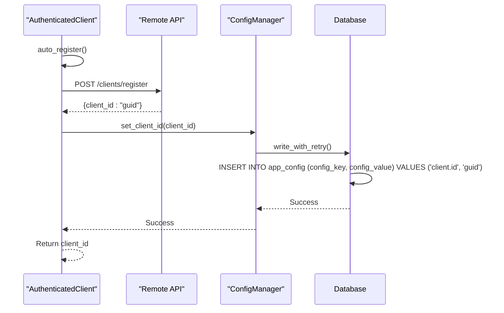
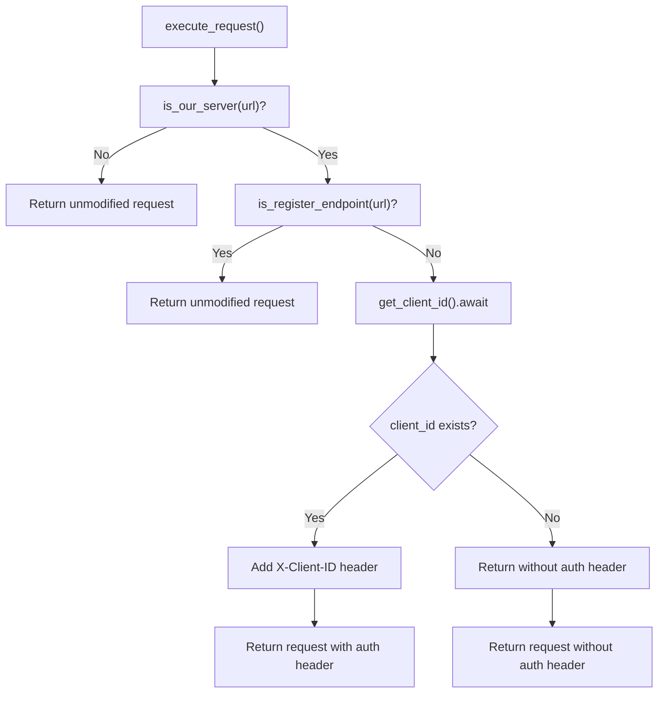
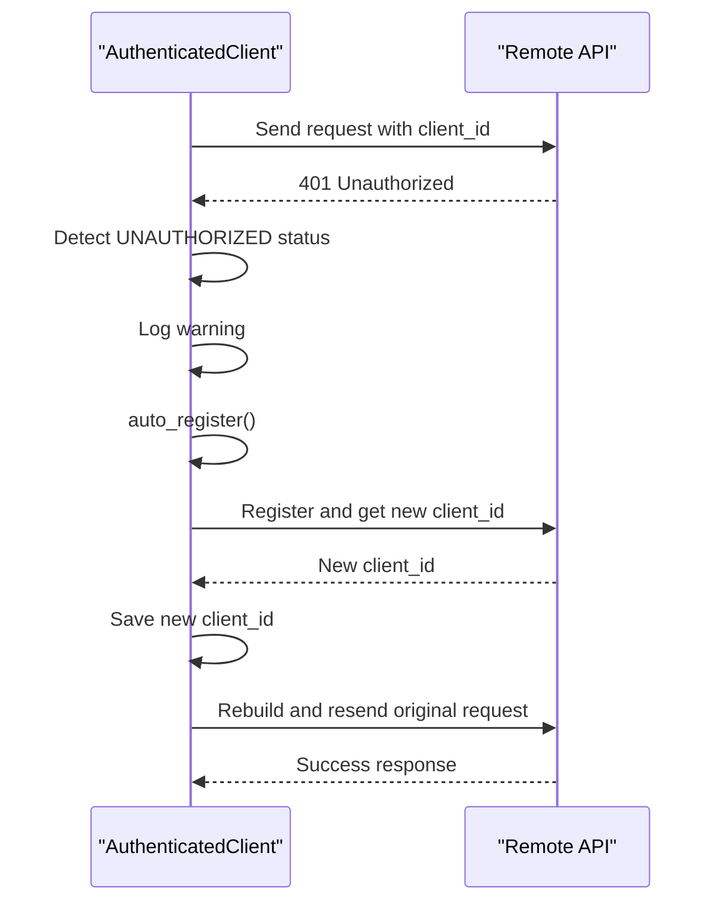
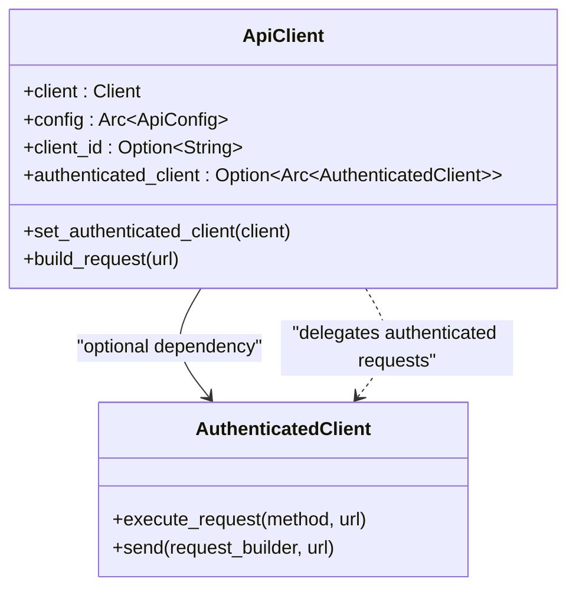
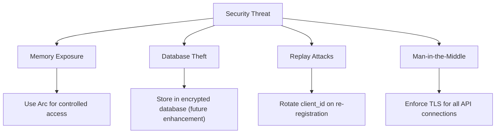
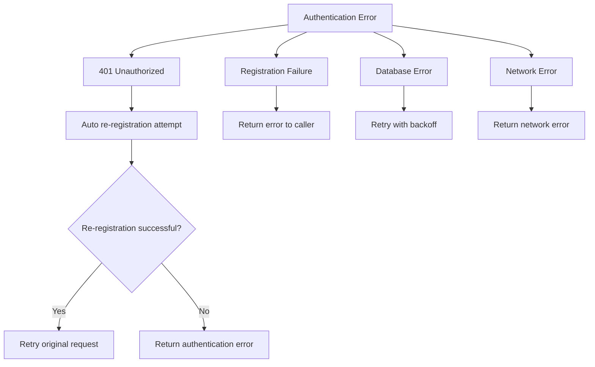

# API Authentication Mechanism

<cite>
**Referenced Files in This Document**   
- [authenticated_client.rs](file://client-core/src/authenticated_client.rs)
- [api.rs](file://client-core/src/api.rs)
- [database_manager.rs](file://client-core/src/database_manager.rs)
- [config_manager.rs](file://client-core/src/config_manager.rs)
- [init_duckdb.sql](file://client-core/migrations/init_duckdb.sql)
</cite>

## Table of Contents
1. [Introduction](#introduction)
2. [Authentication Flow Overview](#authentication-flow-overview)
3. [Core Components](#core-components)
4. [Credential Storage and Retrieval](#credential-storage-and-retrieval)
5. [Token Acquisition and Registration](#token-acquisition-and-registration)
6. [Header Injection and Request Processing](#header-injection-and-request-processing)
7. [Retry Logic for Authentication Failures](#retry-logic-for-authentication-failures)
8. [Integration with Main API Client](#integration-with-main-api-client)
9. [Security Considerations](#security-considerations)
10. [Usage Examples](#usage-examples)
11. [Error Handling and User Feedback](#error-handling-and-user-feedback)

## Introduction
The API authentication mechanism in the Duck Client system provides secure communication with remote services through client identification and automatic re-authentication. The implementation centers around the `AuthenticatedClient` struct, which handles credential persistence, token management, and HTTP header injection. This document details the complete authentication workflow, from initial registration to secure API communication, including failure recovery and integration patterns.

## Authentication Flow Overview
The authentication system follows a client-centric model where each installation receives a unique client identifier (client_id) upon first registration. This identifier is used for subsequent API requests instead of traditional API keys or OAuth tokens. The flow consists of three main phases: initialization, authentication, and request processing.



**Diagram sources**
- [authenticated_client.rs](file://client-core/src/authenticated_client.rs)
- [database_manager.rs](file://client-core/src/database_manager.rs)

**Section sources**
- [authenticated_client.rs](file://client-core/src/authenticated_client.rs)

## Core Components
The authentication system comprises several key components that work together to provide secure API access:

- **AuthenticatedClient**: Primary wrapper that manages client_id lifecycle and request authentication
- **DatabaseManager**: Handles persistent storage of credentials in DuckDB database
- **ConfigManager**: Provides high-level interface for configuration value management
- **ApiClient**: Main API interface that can utilize authenticated client for requests



**Diagram sources**
- [authenticated_client.rs](file://client-core/src/authenticated_client.rs#L0-L47)
- [database_manager.rs](file://client-core/src/database_manager.rs#L0-L50)
- [config_manager.rs](file://client-core/src/config_manager.rs#L0-L56)
- [api.rs](file://client-core/src/api.rs#L0-L45)

**Section sources**
- [authenticated_client.rs](file://client-core/src/authenticated_client.rs)
- [database_manager.rs](file://client-core/src/database_manager.rs)
- [config_manager.rs](file://client-core/src/config_manager.rs)
- [api.rs](file://client-core/src/api.rs)

## Credential Storage and Retrieval
Client credentials are securely stored in the DuckDB database using the `app_config` table, which is designed for concurrent access and data integrity.

### Database Schema
The `app_config` table stores all configuration values, including the client_id:

```sql
CREATE TABLE IF NOT EXISTS app_config (
    config_key VARCHAR PRIMARY KEY,
    config_value JSON NOT NULL,
    config_type VARCHAR NOT NULL,
    category VARCHAR NOT NULL DEFAULT 'general',
    description TEXT,
    is_system_config BOOLEAN DEFAULT FALSE,
    is_user_editable BOOLEAN DEFAULT TRUE,
    validation_rule TEXT,
    default_value JSON,
    created_at TIMESTAMP NOT NULL DEFAULT CURRENT_TIMESTAMP,
    updated_at TIMESTAMP NOT NULL DEFAULT CURRENT_TIMESTAMP
);
```

### Storage Implementation
The system uses a layered approach for credential storage:



**Section sources**
- [authenticated_client.rs](file://client-core/src/authenticated_client.rs#L47-L88)
- [config_manager.rs](file://client-core/src/config_manager.rs#L145-L226)
- [database_manager.rs](file://client-core/src/database_manager.rs#L200-L399)
- [init_duckdb.sql](file://client-core/migrations/init_duckdb.sql#L0-L50)

## Token Acquisition and Registration
The system implements automatic client registration to acquire client identifiers when none exists or when authentication fails.

### Registration Process


### Code Implementation
The registration flow is implemented in the `auto_register` method:

```rust
async fn auto_register(&self) -> Result<String> {
    let register_request = ClientRegisterRequest {
        // client registration data
    };
    
    let api_client = ApiClient::new(None, None);
    let client_id = api_client.register_client(register_request).await?;
    
    // Save to database
    self.set_client_id(client_id.clone()).await?;
    
    Ok(client_id)
}
```

**Section sources**
- [authenticated_client.rs](file://client-core/src/authenticated_client.rs#L88-L122)
- [api.rs](file://client-core/src/api.rs#L47-L76)

## Header Injection and Request Processing
The authentication system automatically injects client identifiers into HTTP requests destined for the remote API.

### Request Processing Flow


### Implementation Details
The header injection is handled by the `add_auth_header` method:

```rust
async fn add_auth_header(
    &self,
    mut request_builder: RequestBuilder,
    url: &str,
) -> RequestBuilder {
    if self.is_our_server(url) && !self.is_register_endpoint(url) {
        if let Some(client_id) = self.get_client_id().await {
            request_builder = request_builder.header("X-Client-ID", client_id);
        }
    }
    request_builder
}
```

**Section sources**
- [authenticated_client.rs](file://client-core/src/authenticated_client.rs#L88-L122)

## Retry Logic for Authentication Failures
The system implements automatic retry logic when API requests fail due to authentication issues.

### Failure Recovery Process


### Code Implementation
The retry logic is implemented in the `send_with_retry` method:

```rust
async fn send_with_retry(
    &self,
    request_builder: RequestBuilder,
    original_url: &str,
) -> Result<Response> {
    let response = request_builder.send().await?;

    if response.status() == reqwest::StatusCode::UNAUTHORIZED
        && self.is_our_server(original_url)
        && !self.is_register_endpoint(original_url)
    {
        warn!("API request authentication failed (401), attempting auto-re-registration...");

        match self.auto_register().await {
            Ok(new_client_id) => {
                info!("Auto re-registration successful, client ID: {}, retrying request...", new_client_id);

                let retry_request_builder = self
                    .client
                    .get(original_url)
                    .header("X-Client-ID", new_client_id);

                retry_request_builder.send().await
            }
            Err(e) => {
                error!("Auto re-registration failed: {}", e);
                Err(e)
            }
        }
    } else {
        Ok(response)
    }
}
```

**Section sources**
- [authenticated_client.rs](file://client-core/src/authenticated_client.rs#L124-L160)

## Integration with Main API Client
The authentication system integrates with the main API client to provide seamless authenticated requests.

### Integration Pattern


### Usage Example
```rust
// Create authenticated client
let auth_client = Arc::new(AuthenticatedClient::new(database, server_url).await?);

// Create API client and set authenticated client
let mut api_client = ApiClient::new(None, Some(auth_client));

// Make authenticated request
let announcements = api_client.get_announcements(None).await?;
```

**Section sources**
- [api.rs](file://client-core/src/api.rs#L0-L45)

## Security Considerations
The authentication system implements several security measures to protect client credentials and ensure secure communication.

### Memory Protection
Client identifiers are stored in memory using `Arc<RwLock<Option<String>>>`, which provides:
- Thread-safe access across async tasks
- Exclusive write access during updates
- Shared read access for request processing
- Automatic cleanup when no references remain

### Data Persistence Security
Credentials are stored in the DuckDB database with the following protections:
- **Atomic operations**: All writes use transactions to prevent corruption
- **Retry mechanisms**: Write conflicts are handled with exponential backoff
- **Secure schema**: Dedicated configuration table with proper indexing
- **Access control**: Configuration system distinguishes system vs. user-editable values

### Communication Security
The system enforces secure communication through:
- **TLS enforcement**: All API requests use HTTPS (implied by reqwest Client)
- **Header protection**: Client identifiers are sent only to trusted endpoints
- **Replay attack prevention**: Unique client identifiers are rotated on re-registration
- **Endpoint validation**: Authentication headers are only added to trusted server URLs

### Threat Mitigation


**Section sources**
- [authenticated_client.rs](file://client-core/src/authenticated_client.rs)
- [database_manager.rs](file://client-core/src/database_manager.rs)
- [init_duckdb.sql](file://client-core/migrations/init_duckdb.sql)

## Usage Examples
The authentication system can be used in both CLI and GUI contexts with minimal configuration.

### CLI Context Example
```rust
// Initialize database
let database_manager = DatabaseManager::new("duck_client.db").await?;
let database = Arc::new(Database::new(database_manager).await?);

// Create authenticated client
let auth_client = AuthenticatedClient::new(
    database.clone(),
    "https://api.duck-client.com".to_string()
).await?;

// Use for API requests
let response = auth_client.get("https://api.duck-client.com/status").await?;
```

### GUI Context Example
```rust
// In Tauri command
#[tauri::command]
async fn initialize_api_client(
    state: tauri::State<'_, AppState>
) -> Result<String, String> {
    let auth_client = AuthenticatedClient::new(
        state.database.clone(),
        state.config.api_url.clone()
    ).await.map_err(|e| e.to_string())?;
    
    // Store in application state
    state.auth_client.lock().await.replace(Arc::new(auth_client));
    
    Ok("Authenticated client initialized".to_string())
}
```

**Section sources**
- [authenticated_client.rs](file://client-core/src/authenticated_client.rs)
- [api.rs](file://client-core/src/api.rs)

## Error Handling and User Feedback
The system provides comprehensive error handling and user feedback for authentication issues.

### Error Types and Handling


### Logging Strategy
The system uses structured logging to track authentication events:

- **Info level**: Successful registration and authentication
- **Warning level**: Authentication failures and retry attempts
- **Error level**: Registration failures and critical errors

Example log messages:
- `"API request authentication failed (401), attempting auto-re-registration..."`
- `"Auto re-registration successful, client ID: {client_id}, retrying request..."`
- `"Client registration failed: {status} - {text}"`

### User Feedback
When integrated with UI components, the system can provide user feedback through:
- Notification banners for authentication issues
- Progress indicators during re-registration
- Error dialogs for persistent failures
- Automatic recovery without user intervention in most cases

**Section sources**
- [authenticated_client.rs](file://client-core/src/authenticated_client.rs)
- [api.rs](file://client-core/src/api.rs)