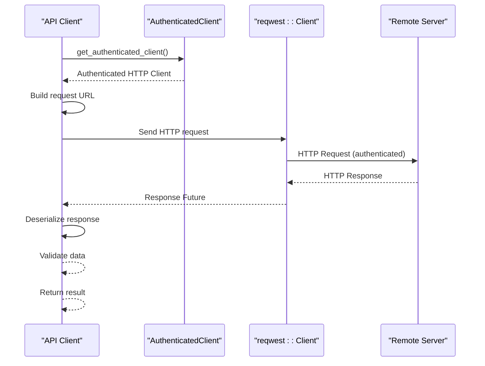
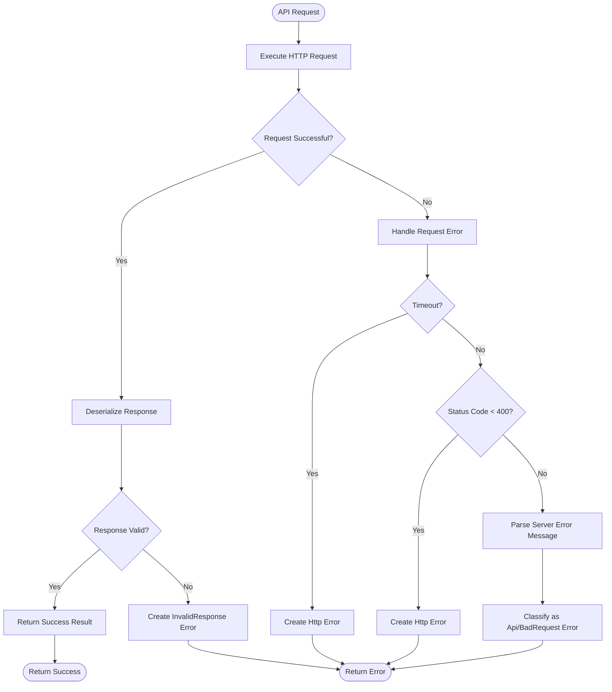
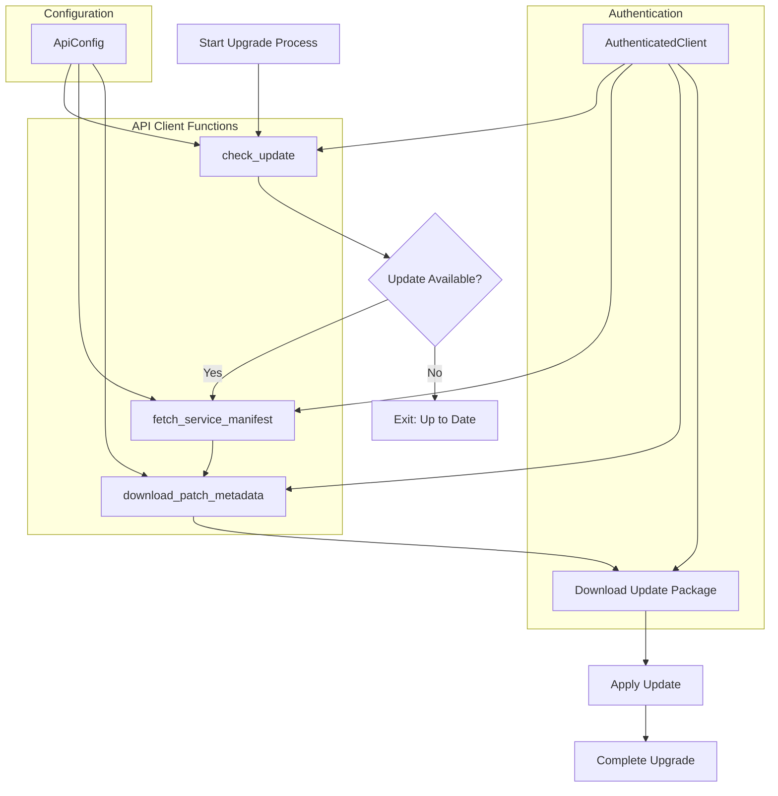

# API Client Implementation

<cite>
**Referenced Files in This Document**   
- [api.rs](file://client-core/src/api.rs#L1-L500)
- [api_config.rs](file://client-core/src/api_config.rs#L1-L125)
- [error.rs](file://client-core/src/error.rs#L1-L110)
- [downloader.rs](file://client-core/src/downloader.rs#L1-L1327)
- [authenticated_client.rs](file://client-core/src/authenticated_client.rs)
- [api_types.rs](file://client-core/src/api_types.rs)
</cite>

## Table of Contents
1. [API Client Implementation](#api-client-implementation)
2. [Core API Functions](#core-api-functions)
3. [HTTP Request Orchestration](#http-request-orchestration)
4. [Error Handling and Propagation](#error-handling-and-propagation)
5. [Integration with CLI and UI](#integration-with-cli-and-ui)
6. [Upgrade Workflow Integration](#upgrade-workflow-integration)

## Core API Functions

The `api.rs` module serves as the primary interface for client-server communication in the Duck Client system. It implements high-level functions that abstract away the complexity of HTTP interactions, authentication, and data serialization. The core functions include `check_update`, `fetch_service_manifest`, and `download_patch_metadata`, which are essential for the application's update and service management workflows.

These functions rely on the `AuthenticatedClient` from `authenticated_client.rs` to ensure all requests are properly authorized and use types defined in `api_types.rs` for request and response data structures. The API client is designed to be asynchronous, leveraging Rust's `async/await` syntax for non-blocking operations.

**Section sources**
- [api.rs](file://client-core/src/api.rs#L1-L500)
- [api_types.rs](file://client-core/src/api_types.rs#L1-L200)

## HTTP Request Orchestration

The API client orchestrates HTTP requests through a well-defined pattern that ensures reliability and consistency. Each API call follows a standardized process:

1. Obtain an authenticated HTTP client
2. Construct the request URL using configuration from `api_config.rs`
3. Serialize request data using serde
4. Execute the request with proper error handling
5. Deserialize and validate the response
6. Return structured data or propagate errors

The client integrates with `reqwest` for async request handling, implementing robust timeout management and retry logic. The default timeout is configured through `DownloaderConfig`, which sets a 60-minute timeout for long-running operations like large file downloads.

**Diagram sources**
- [api.rs](file://client-core/src/api.rs#L150-L200)
- [authenticated_client.rs](file://client-core/src/authenticated_client.rs#L20-L50)

**Section sources**
- [api.rs](file://client-core/src/api.rs#L100-L300)
- [authenticated_client.rs](file://client-core/src/authenticated_client.rs#L1-L80)

## Error Handling and Propagation

Error handling in the API client follows a comprehensive strategy that transforms low-level errors into meaningful user feedback. The system uses the `DuckError` enum defined in `error.rs`, which implements `thiserror::Error` for automatic error message generation and source chaining.

When API requests fail, the client captures the underlying `reqwest::Error` and converts it to a `DuckError::Http` variant. Service-specific errors from the server are parsed and transformed into appropriate `DuckError` variants like `Api`, `BadRequest`, or `InvalidResponse`. This hierarchical error system allows for both precise error handling and general error reporting.

The error propagation mechanism ensures that errors are not silently dropped. Each API function returns a `Result<T, DuckError>`, forcing callers to handle potential failures. The error types include contextual information that aids in debugging and user communication.

**Diagram sources**
- [api.rs](file://client-core/src/api.rs#L250-L400)
- [error.rs](file://client-core/src/error.rs#L1-L110)

**Section sources**
- [api.rs](file://client-core/src/api.rs#L300-L500)
- [error.rs](file://client-core/src/error.rs#L1-L110)

## Integration with CLI and UI

The API client is consumed by both `nuwax-cli` and `cli-ui` components, demonstrating its role as a shared service layer. In `nuwax-cli`, the API functions are called directly from command implementations like `check_update.rs` and `update.rs`. These commands construct parameters based on user input and configuration, then handle the results by displaying them to the terminal.

In `cli-ui`, the API client is accessed through Tauri commands in `src-tauri/src/commands/cli.rs`. The UI components trigger API calls via asynchronous JavaScript functions, which await the results and update the interface accordingly. This separation ensures that the UI remains responsive during potentially long-running operations.

For example, when checking for updates, both interfaces call `api::check_update()` with the current service version and receive a structured response indicating whether an update is available. The CLI displays this information as text, while the UI renders it as visual elements with appropriate styling.

**Section sources**
- [api.rs](file://client-core/src/api.rs#L1-L100)
- [nuwax-cli/src/commands/check_update.rs](file://nuwax-cli/src/commands/check_update.rs#L1-L50)
- [cli-ui/src-tauri/src/commands/cli.rs](file://cli-ui/src-tauri/src/commands/cli.rs#L1-L30)

## Upgrade Workflow Integration

The API client plays a central role in the overall upgrade workflow, serving as the communication bridge between the local client and the remote server. The upgrade process begins with `check_update`, which queries the server for the latest available version. If an update is available, `fetch_service_manifest` retrieves detailed information about the update, including patch metadata and download URLs.

The client then uses the `downloader.rs` module to download the update package, leveraging the authenticated client for secure downloads from protected endpoints. Throughout this process, the API client maintains configuration state from `api_config.rs`, ensuring that all requests are directed to the correct server endpoints.

The integration with configuration is particularly important, as the API client uses `ApiConfig` to construct endpoint URLs dynamically. This allows the system to support multiple environments (development, staging, production) without code changes. The `get_endpoint_url` method in `ApiConfig` combines the base URL with specific endpoint paths to generate complete request URLs.

**Diagram sources**
- [api.rs](file://client-core/src/api.rs#L1-L500)
- [api_config.rs](file://client-core/src/api_config.rs#L1-L125)
- [authenticated_client.rs](file://client-core/src/authenticated_client.rs#L1-L80)

**Section sources**
- [api.rs](file://client-core/src/api.rs#L1-L500)
- [api_config.rs](file://client-core/src/api_config.rs#L1-L125)
- [downloader.rs](file://client-core/src/downloader.rs#L1-L1327)