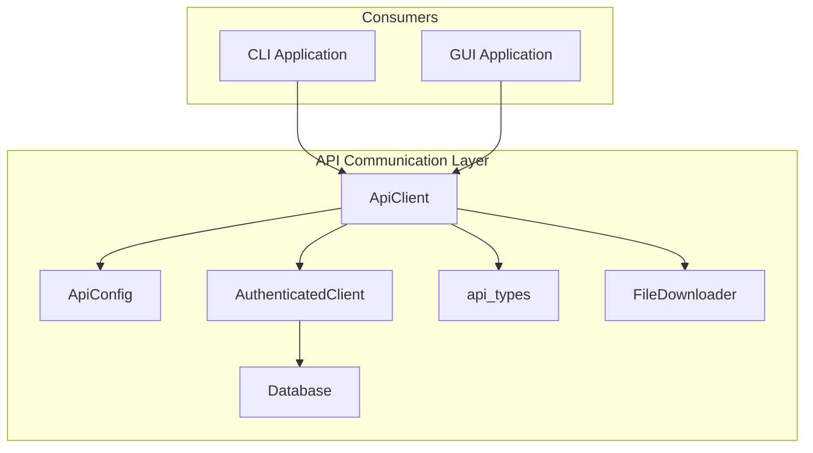
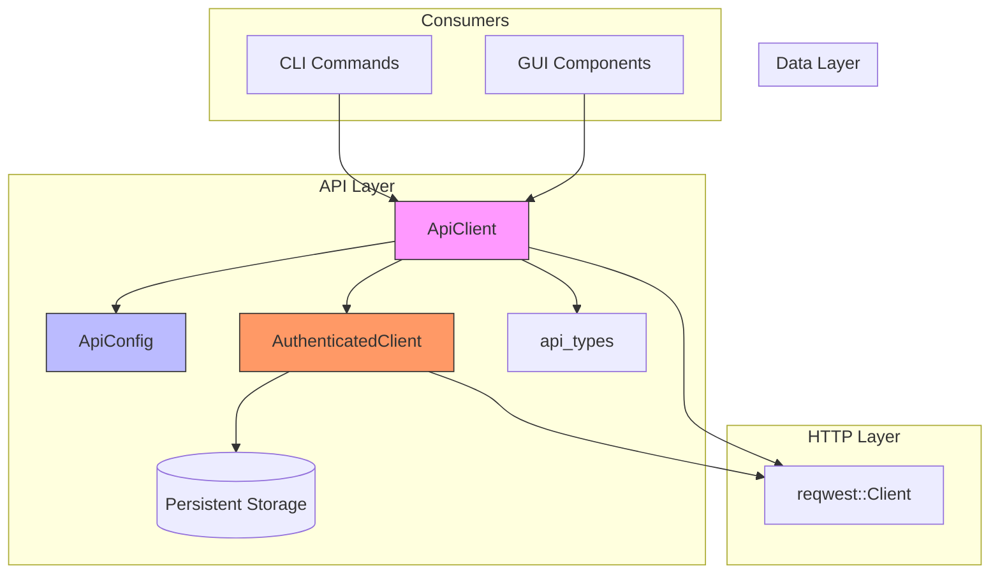
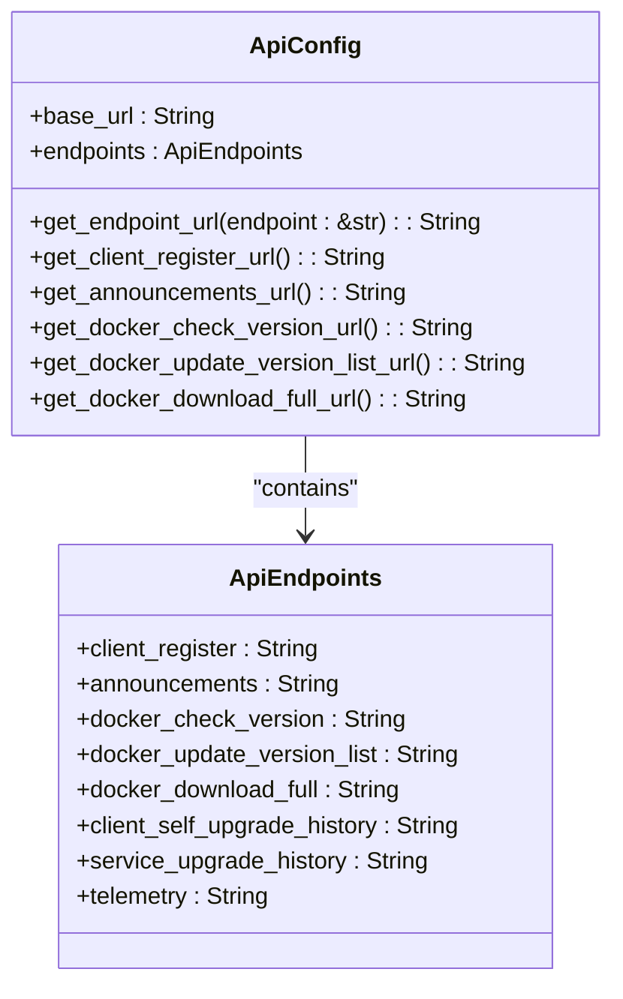
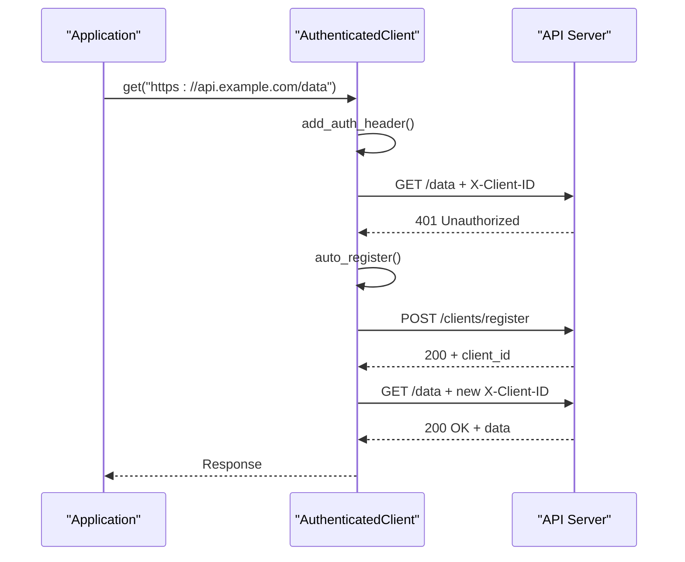
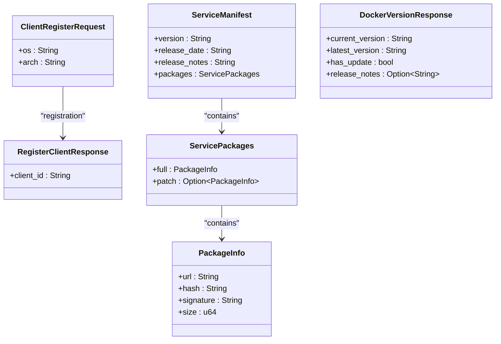
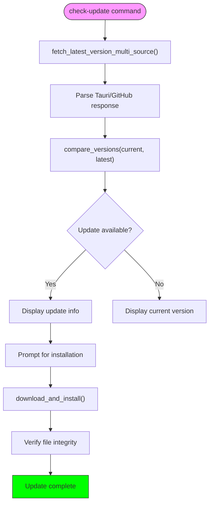
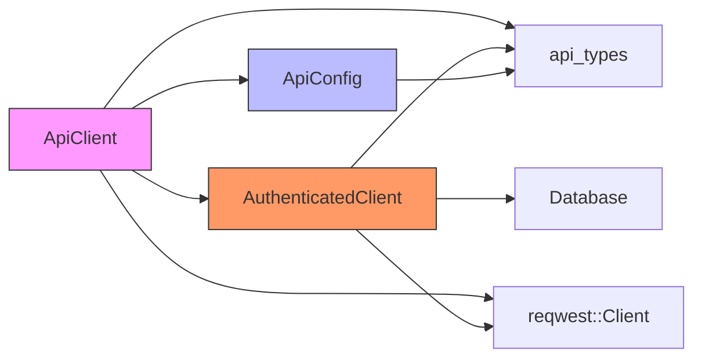

# API Communication Layer

<cite>
**Referenced Files in This Document**   
- [api.rs](file://client-core/src/api.rs)
- [api_config.rs](file://client-core/src/api_config.rs)
- [api_types.rs](file://client-core/src/api_types.rs)
- [authenticated_client.rs](file://client-core/src/authenticated_client.rs)
- [check_update.rs](file://nuwax-cli/src/commands/check_update.rs)
</cite>

## Table of Contents
1. [Introduction](#introduction)
2. [Project Structure](#project-structure)
3. [Core Components](#core-components)
4. [Architecture Overview](#architecture-overview)
5. [Detailed Component Analysis](#detailed-component-analysis)
6. [Dependency Analysis](#dependency-analysis)
7. [Performance Considerations](#performance-considerations)
8. [Troubleshooting Guide](#troubleshooting-guide)
9. [Conclusion](#conclusion)

## Introduction
The API Communication Layer in the Duck Client project is responsible for managing all interactions with remote servers to retrieve service manifests, version information, and patch metadata. This layer provides a structured and secure interface for both CLI and GUI components to communicate with backend services. It handles authentication, configuration management, request/response serialization, and error handling for network operations. The implementation uses Rust's async runtime with reqwest for HTTP communication, Serde for data serialization, and structured logging via tracing.

## Project Structure
The API communication functionality is primarily located in the `client-core` module of the repository. This module contains all core business logic and is used by both the CLI (`nuwax-cli`) and GUI (`cli-ui`) applications. The API layer is composed of several key components that work together to provide a robust communication interface.



**Diagram sources**
- [api.rs](file://client-core/src/api.rs)
- [api_config.rs](file://client-core/src/api_config.rs)
- [authenticated_client.rs](file://client-core/src/authenticated_client.rs)

**Section sources**
- [api.rs](file://client-core/src/api.rs)
- [api_config.rs](file://client-core/src/api_config.rs)

## Core Components
The API communication layer consists of four main components: ApiClient for high-level API operations, ApiConfig for managing endpoint configuration, api_types for defining serializable data structures, and AuthenticatedClient for handling authentication and client identity management. These components work together to provide a seamless interface for interacting with remote services while handling authentication, configuration, and error recovery transparently.

**Section sources**
- [api.rs](file://client-core/src/api.rs)
- [api_config.rs](file://client-core/src/api_config.rs)
- [api_types.rs](file://client-core/src/api_types.rs)
- [authenticated_client.rs](file://client-core/src/authenticated_client.rs)

## Architecture Overview
The API communication architecture follows a layered design pattern where higher-level components depend on lower-level services. The ApiClient serves as the primary interface, coordinating between configuration, authentication, and HTTP client functionality. Configuration is managed through ApiConfig which stores base URLs and endpoint paths. Authentication is handled by AuthenticatedClient which manages client identity and automatically handles re-authentication when needed. All data exchange formats are defined in api_types using Serde for JSON serialization.



**Diagram sources**
- [api.rs](file://client-core/src/api.rs)
- [api_config.rs](file://client-core/src/api_config.rs)
- [authenticated_client.rs](file://client-core/src/authenticated_client.rs)

## Detailed Component Analysis

### ApiClient Analysis
The ApiClient is the main interface for API operations, providing methods to check versions, download updates, and retrieve service information. It encapsulates the HTTP client and configuration, exposing a clean API for consumers.

```mermaid
classDiagram
class ApiClient {
+client : Client
+config : Arc~ApiConfig~
+client_id : Option~String~
+authenticated_client : Option~Arc~AuthenticatedClient~~
+new(client_id : Option~String~, authenticated_client : Option~Arc~AuthenticatedClient~~) : Self
+set_client_id(client_id : String) : void
+set_authenticated_client(authenticated_client : Arc~AuthenticatedClient~) : void
+get_config() : &ApiConfig
+register_client(request : ClientRegisterRequest) : Result~String~
+get_announcements(since : Option~&str~) : Result~AnnouncementsResponse~
+check_docker_version(current_version : &str) : Result~DockerVersionResponse~
+download_service_update<P : AsRef~Path~~(save_path : P) : Result~()~
}
class ApiConfig {
+base_url : String
+endpoints : ApiEndpoints
+get_endpoint_url(endpoint : &str) : String
}
class AuthenticatedClient {
+get(url : &str) : Result~RequestBuilder~
+post(url : &str) : Result~RequestBuilder~
+send(request_builder : RequestBuilder, url : &str) : Result~Response~
}
ApiClient --> ApiConfig : "uses"
ApiClient --> AuthenticatedClient : "uses"
ApiClient --> Client : "uses reqwest : : Client"
```

**Diagram sources**
- [api.rs](file://client-core/src/api.rs)
- [api_config.rs](file://client-core/src/api_config.rs)
- [authenticated_client.rs](file://client-core/src/authenticated_client.rs)

**Section sources**
- [api.rs](file://client-core/src/api.rs#L0-L45)

### ApiConfig Analysis
The ApiConfig component manages the API endpoint configuration, including base URLs and specific endpoint paths. It provides methods to construct complete URLs and implements default values for production endpoints.



**Diagram sources**
- [api_config.rs](file://client-core/src/api_config.rs#L0-L33)

**Section sources**
- [api_config.rs](file://client-core/src/api_config.rs#L0-L125)

### AuthenticatedClient Analysis
The AuthenticatedClient handles authentication for API requests, managing client identity and automatically re-registering when authentication fails. It intercepts requests to add authentication headers and handles 401 responses by automatically re-authenticating.



**Diagram sources**
- [authenticated_client.rs](file://client-core/src/authenticated_client.rs#L0-L47)

**Section sources**
- [authenticated_client.rs](file://client-core/src/authenticated_client.rs#L0-L227)

### api_types Analysis
The api_types module defines all serializable data structures used in API communication, including request and response formats for various operations. These types are designed for JSON serialization using Serde.



**Diagram sources**
- [api_types.rs](file://client-core/src/api_types.rs#L0-L56)

**Section sources**
- [api_types.rs](file://client-core/src/api_types.rs#L0-L902)

### check_update Command Flow
The check_update command demonstrates how the API layer is used by higher-level components. It coordinates version checking across multiple sources and handles the update process.



**Diagram sources**
- [check_update.rs](file://nuwax-cli/src/commands/check_update.rs#L0-L814)

**Section sources**
- [check_update.rs](file://nuwax-cli/src/commands/check_update.rs#L0-L814)

## Dependency Analysis
The API communication layer has well-defined dependencies that follow a clear hierarchy. The ApiClient depends on ApiConfig for endpoint configuration and AuthenticatedClient for authentication. Both ApiClient and AuthenticatedClient use reqwest for HTTP operations. The api_types module is used throughout for data serialization. The AuthenticatedClient depends on the Database component for persistent storage of client identity.



**Diagram sources**
- [api.rs](file://client-core/src/api.rs)
- [api_config.rs](file://client-core/src/api_config.rs)
- [authenticated_client.rs](file://client-core/src/authenticated_client.rs)

**Section sources**
- [api.rs](file://client-core/src/api.rs)
- [api_config.rs](file://client-core/src/api_config.rs)
- [authenticated_client.rs](file://client-core/src/authenticated_client.rs)

## Performance Considerations
The API communication layer includes several performance optimizations. The ApiClient uses an Arc-wrapped ApiConfig to share configuration across instances without duplication. The AuthenticatedClient maintains a persistent client_id to avoid repeated registration. Download operations use streaming to minimize memory usage, and progress is reported efficiently to avoid excessive logging. The check_update command implements fallback sources (version server then GitHub) to ensure availability while minimizing latency.

## Troubleshooting Guide
Common issues with the API communication layer include authentication failures, network connectivity problems, and configuration errors. Authentication failures (401) are automatically handled by the AuthenticatedClient through re-registration. Network issues are reported with descriptive error messages and can be diagnosed by checking the API configuration endpoints. Configuration problems can be inspected using the display implementation of ApiConfig which outputs all endpoint URLs. For debugging, the tracing logs provide detailed information about API requests and responses.

**Section sources**
- [authenticated_client.rs](file://client-core/src/authenticated_client.rs#L124-L160)
- [api.rs](file://client-core/src/api.rs#L47-L76)

## Conclusion
The API Communication Layer in the Duck Client project provides a robust, secure, and user-friendly interface for interacting with remote services. Its modular design separates concerns between configuration, authentication, and API operations, making it easy to maintain and extend. The layer handles common edge cases like authentication failures and network issues transparently, providing a reliable experience for both CLI and GUI consumers. By using modern Rust practices like async/await, Serde serialization, and proper error handling, the implementation is both performant and safe.