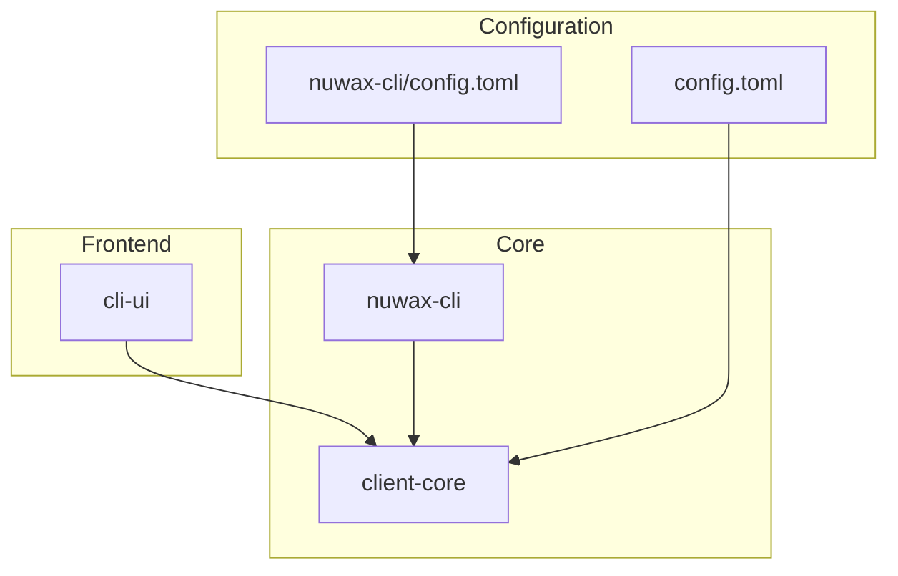
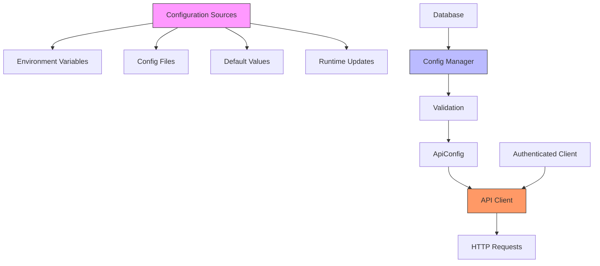
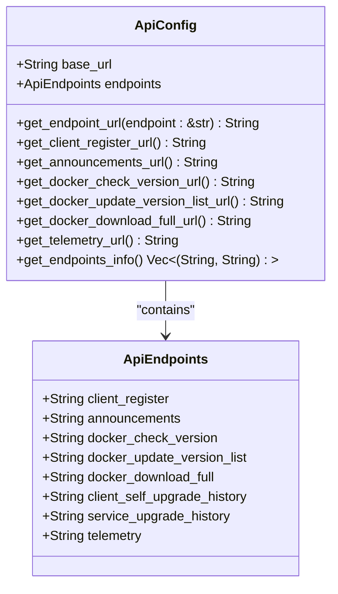
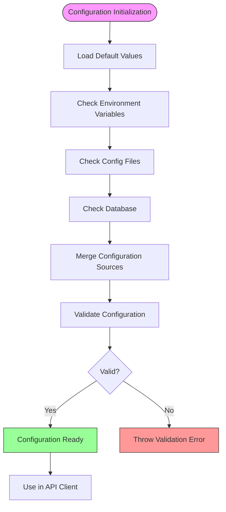
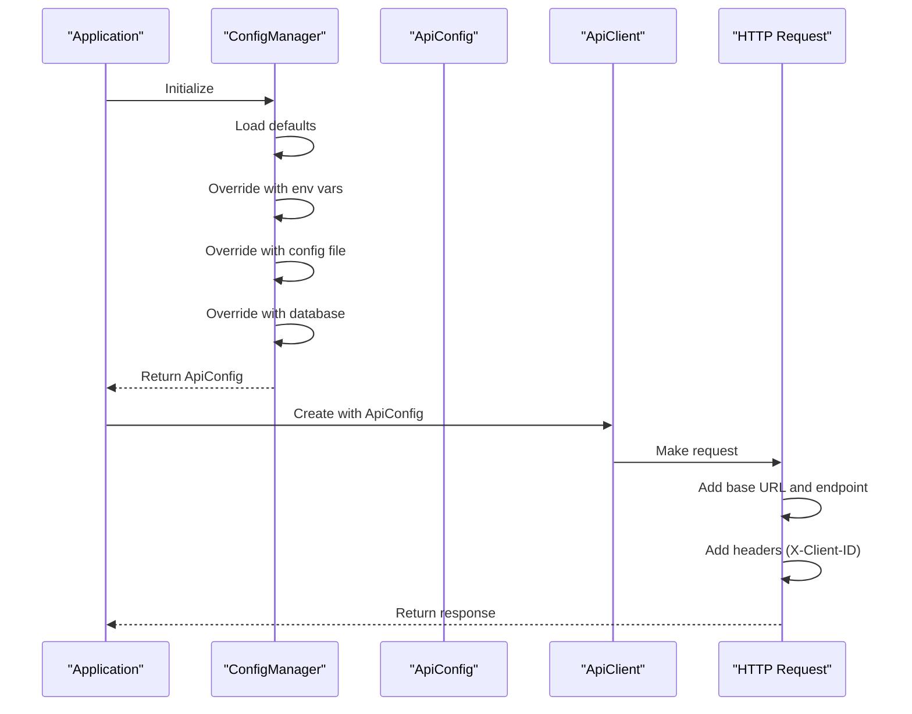
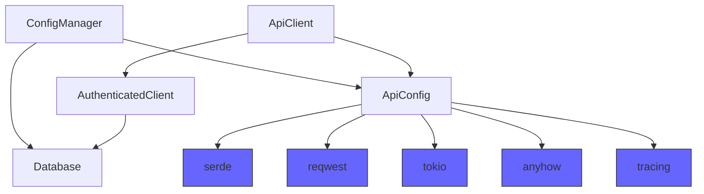

# API Configuration Management

<cite>
**Referenced Files in This Document**   
- [api_config.rs](file://client-core/src/api_config.rs)
- [api.rs](file://client-core/src/api.rs)
- [authenticated_client.rs](file://client-core/src/authenticated_client.rs)
- [constants.rs](file://client-core/src/constants.rs)
- [config.toml](file://config.toml)
</cite>

## Table of Contents
1. [Introduction](#introduction)
2. [Project Structure](#project-structure)
3. [Core Components](#core-components)
4. [Architecture Overview](#architecture-overview)
5. [Detailed Component Analysis](#detailed-component-analysis)
6. [Dependency Analysis](#dependency-analysis)
7. [Performance Considerations](#performance-considerations)
8. [Troubleshooting Guide](#troubleshooting-guide)
9. [Conclusion](#conclusion)

## Introduction
The API configuration system in the Duck Client manages communication parameters such as endpoint URLs, timeouts, retry policies, and authentication settings. This document provides a comprehensive overview of the `ApiConfig` type, its initialization, validation, serialization, and integration with the broader configuration management system. The system supports multiple configuration sources including environment variables, config files, and defaults, ensuring flexibility across development and production environments.

## Project Structure
The Duck Client repository is organized into several key modules:
- **cli-ui**: Frontend interface built with Tauri and React
- **client-core**: Core business logic and API client implementation
- **nuwax-cli**: Command-line interface and utilities
- **spec**: Design documentation and architecture specifications

The API configuration system is primarily located in the `client-core` module, with supporting configuration files in the root directory.

**Diagram sources**
- [config.toml](file://config.toml)
- [nuwax-cli/config.toml](file://nuwax-cli/config.toml)

**Section sources**
- [config.toml](file://config.toml)
- [nuwax-cli/config.toml](file://nuwax-cli/config.toml)

## Core Components
The API configuration system consists of several key components:
- **ApiConfig**: Main configuration structure containing base URL and endpoints
- **ApiEndpoints**: Struct defining all API endpoint paths
- **config_manager.rs**: Central configuration management system
- **authenticated_client.rs**: Handles authentication and client ID management

These components work together to provide a robust, flexible configuration system that supports dynamic updates and validation.

**Section sources**
- [api_config.rs](file://client-core/src/api_config.rs)
- [config_manager.rs](file://client-core/src/config_manager.rs)
- [authenticated_client.rs](file://client-core/src/authenticated_client.rs)

## Architecture Overview
The API configuration system follows a layered architecture where configuration values are sourced from multiple locations, validated, and injected into the API client. The system prioritizes configuration sources in the following order: environment variables, config files, and defaults.

**Diagram sources**
- [api_config.rs](file://client-core/src/api_config.rs)
- [config_manager.rs](file://client-core/src/config_manager.rs)
- [api.rs](file://client-core/src/api.rs)

## Detailed Component Analysis

### ApiConfig Structure Analysis
The `ApiConfig` type is the central data structure for API configuration, containing the base URL and all endpoint definitions.

**Diagram sources**
- [api_config.rs](file://client-core/src/api_config.rs#L35-L68)

**Section sources**
- [api_config.rs](file://client-core/src/api_config.rs#L0-L33)

### Configuration Initialization and Validation
The API configuration system initializes with default values and supports validation to ensure configuration integrity.

**Diagram sources**
- [api_config.rs](file://client-core/src/api_config.rs#L35-L68)
- [constants.rs](file://client-core/src/constants.rs#L500-L520)

**Section sources**
- [api_config.rs](file://client-core/src/api_config.rs#L35-L68)
- [constants.rs](file://client-core/src/constants.rs#L500-L520)

### Configuration Sourcing and Injection
The system sources configuration from multiple locations and injects it into the API client for use in HTTP requests.

**Diagram sources**
- [api_config.rs](file://client-core/src/api_config.rs)
- [api.rs](file://client-core/src/api.rs)
- [config_manager.rs](file://client-core/src/config_manager.rs)

**Section sources**
- [api_config.rs](file://client-core/src/api_config.rs)
- [api.rs](file://client-core/src/api.rs)
- [config_manager.rs](file://client-core/src/config_manager.rs)

## Dependency Analysis
The API configuration system has dependencies on several key components and external libraries.

**Diagram sources**
- [api_config.rs](file://client-core/src/api_config.rs)
- [Cargo.toml](file://client-core/Cargo.toml)

**Section sources**
- [api_config.rs](file://client-core/src/api_config.rs)
- [Cargo.toml](file://client-core/Cargo.toml)

## Performance Considerations
The API configuration system is designed for efficiency with the following considerations:

- **Immutable Configuration**: The `ApiConfig` is wrapped in `Arc` to allow efficient sharing across threads
- **Lazy Initialization**: Configuration is loaded once and reused
- **Minimal Overhead**: URL construction is simple string concatenation
- **Caching**: The config manager caches configuration values to avoid repeated database queries

The system has minimal performance impact on API calls, with configuration lookup being an O(1) operation.

## Troubleshooting Guide
Common issues and solutions for the API configuration system:

**Section sources**
- [api_config.rs](file://client-core/src/api_config.rs)
- [api.rs](file://client-core/src/api.rs)
- [authenticated_client.rs](file://client-core/src/authenticated_client.rs)

### Configuration Not Loading
**Symptoms**: Default values are used instead of custom configuration
**Causes**:
- Config file not in expected location
- Environment variables not set
- Database not initialized

**Solutions**:
1. Verify config file exists at `./config.toml`
2. Check environment variables are properly set
3. Ensure database is initialized and contains config values

### Invalid URL Errors
**Symptoms**: HTTP requests fail with malformed URL errors
**Causes**:
- Base URL not properly formatted
- Endpoint paths contain invalid characters

**Solutions**:
1. Ensure base URL includes protocol (https://)
2. Verify endpoint paths start with /
3. Check for special characters in configuration values

### Authentication Failures
**Symptoms**: 401 Unauthorized errors despite valid configuration
**Causes**:
- Missing or invalid client_id
- Authentication headers not being sent

**Solutions**:
1. Verify client registration completes successfully
2. Check that X-Client-ID header is included in requests
3. Ensure authenticated_client is properly injected into ApiClient

## Conclusion
The API configuration system in the Duck Client provides a robust, flexible way to manage API communication parameters. By supporting multiple configuration sources, validation, and seamless integration with the API client, the system ensures reliable operation across different environments. The design prioritizes simplicity, performance, and maintainability, making it easy to extend and modify as requirements evolve.