# API Data Structures and Serialization

<cite>
**Referenced Files in This Document**   
- [api_types.rs](file://client-core/src/api_types.rs)
- [version.rs](file://client-core/src/version.rs)
- [api.rs](file://client-core/src/api.rs)
- [upgrade_strategy.rs](file://client-core/src/upgrade_strategy.rs)
- [authenticated_client.rs](file://client-core/src/authenticated_client.rs)
- [api_config.rs](file://client-core/src/api_config.rs)
- [constants.rs](file://client-core/src/constants.rs)
</cite>

## Table of Contents
1. [Introduction](#introduction)
2. [Core API Data Models](#core-api-data-models)
3. [Service Manifest Structures](#service-manifest-structures)
4. [Version Information and Validation](#version-information-and-validation)
5. [Patch Metadata and Operations](#patch-metadata-and-operations)
6. [API Request and Response Payloads](#api-request-and-response-payloads)
7. [Custom Serialization Logic](#custom-serialization-logic)
8. [Usage Across Application Layers](#usage-across-application-layers)
9. [JSON Schema Mapping and Examples](#json-schema-mapping-and-examples)
10. [Backward Compatibility Strategy](#backward-compatibility-strategy)

## Introduction
This document provides comprehensive documentation for the API data models defined in `api_types.rs`, focusing on the core structures used for service updates, version management, and patch operations. The API data models serve as the foundation for communication between the client and server, enabling features such as version checking, incremental updates, and telemetry reporting. These Serde-serializable structs are shared across multiple layers of the application, including the API client, upgrade strategy engine, and UI components, ensuring consistency in data handling and validation.

The documentation covers the purpose, data types, and validation rules for each field in the key structs: `ServiceManifest`, `EnhancedServiceManifest`, `VersionInfo`, `PatchMetadata`, and related types. It explains how these types are used in request and response payloads, their mapping to JSON schemas, and the custom (de)serialization logic implemented for version parsing and architecture-specific fields. The document also illustrates how these types are utilized across different components of the system and how backward compatibility is maintained during schema evolution.

**Section sources**
- [api_types.rs](file://client-core/src/api_types.rs)

## Core API Data Models

The API data models are defined in `api_types.rs` and represent the contract between the client and server. These Serde-serializable structs are used for both request and response payloads across various endpoints. The models are designed to support both traditional and enhanced update mechanisms, with backward compatibility for older clients.

The core data models include:
- **ServiceManifest**: Traditional format for service updates
- **EnhancedServiceManifest**: New format supporting architecture-specific packages and incremental updates
- **VersionInfo**: Docker version information and update status
- **PatchMetadata**: Information about incremental updates and patch operations
- **Request/Response types**: For client registration, announcements, and telemetry

These types are shared between the API client, upgrade strategy, and UI layers, ensuring consistent data handling throughout the application. The structs implement both `Serialize` and `Deserialize` traits from Serde, enabling seamless conversion between Rust structs and JSON representations.

```mermaid
classDiagram
class ServiceManifest {
+version : String
+release_date : String
+release_notes : String
+packages : ServicePackages
}
class EnhancedServiceManifest {
+version : Version
+release_date : String
+release_notes : String
+packages : Option~ServicePackages~
+platforms : Option~PlatformPackages~
+patch : Option~PatchInfo~
}
class ServicePackages {
+full : PackageInfo
+patch : Option~PackageInfo~
}
class PlatformPackages {
+x86_64 : Option~PlatformPackageInfo~
+aarch64 : Option~PlatformPackageInfo~
}
class PatchInfo {
+x86_64 : Option~PatchPackageInfo~
+aarch64 : Option~PatchPackageInfo~
}
class PackageInfo {
+url : String
+hash : String
+signature : String
+size : u64
}
class PlatformPackageInfo {
+signature : String
+url : String
}
class PatchPackageInfo {
+url : String
+hash : Option~String~
+signature : Option~String~
+operations : PatchOperations
+notes : Option~String~
}
class PatchOperations {
+replace : Option~ReplaceOperations~
+delete : Option~ReplaceOperations~
}
class ReplaceOperations {
+files : Vec~String~
+directories : Vec~String~
}
ServiceManifest --> ServicePackages
EnhancedServiceManifest --> ServicePackages : "optional"
EnhancedServiceManifest --> PlatformPackages : "optional"
EnhancedServiceManifest --> PatchInfo : "optional"
ServicePackages --> PackageInfo
PlatformPackages --> PlatformPackageInfo
PatchInfo --> PatchPackageInfo
PatchPackageInfo --> PatchOperations
PatchOperations --> ReplaceOperations
```



**Diagram sources**
- [api_types.rs](file://client-core/src/api_types.rs#L100-L300)

**Section sources**
- [api_types.rs](file://client-core/src/api_types.rs#L1-L902)

## Service Manifest Structures

The service manifest structures define the format for service update information, with support for both traditional and enhanced formats. The `ServiceManifest` struct represents the traditional format, while `EnhancedServiceManifest` provides additional capabilities for architecture-specific packages and incremental updates.

### ServiceManifest (Traditional Format)

The `ServiceManifest` struct represents the traditional format for service updates, designed for backward compatibility with older clients. It contains the following fields:

- **version**: `String` - The version number of the service update
- **release_date**: `String` - The release date in RFC3339 format
- **release_notes**: `String` - Release notes describing the changes
- **packages**: `ServicePackages` - Information about available packages

The `ServicePackages` struct contains:
- **full**: `PackageInfo` - Information about the full update package
- **patch**: `Option<PackageInfo>` - Optional information about a patch package

The `PackageInfo` struct includes:
- **url**: `String` - Download URL for the package
- **hash**: `String` - Hash value for integrity verification
- **signature**: `String` - Digital signature for authentication
- **size**: `u64` - Size of the package in bytes


**Diagram sources**
- [api_types.rs](file://client-core/src/api_types.rs#L100-L150)

### EnhancedServiceManifest (New Format)

The `EnhancedServiceManifest` struct represents the new format that supports architecture-specific packages and incremental updates. It extends the traditional format with additional fields:

- **version**: `Version` - The version number using the custom `Version` type
- **release_date**: `String` - The release date in RFC3339 format
- **release_notes**: `String` - Release notes describing the changes
- **packages**: `Option<ServicePackages>` - Optional traditional package information for backward compatibility
- **platforms**: `Option<PlatformPackages>` - Architecture-specific package information
- **patch**: `Option<PatchInfo>` - Incremental update information

The `PlatformPackages` struct contains architecture-specific package information:
- **x86_64**: `Option<PlatformPackageInfo>` - Package information for x86_64 architecture
- **aarch64**: `Option<PlatformPackageInfo>` - Package information for aarch64 architecture

The `PlatformPackageInfo` struct includes:
- **signature**: `String` - Digital signature for authentication
- **url**: `String` - Download URL for the package

This enhanced format allows the server to provide different packages for different architectures and supports incremental updates through the `patch` field.


**Diagram sources**
- [api_types.rs](file://client-core/src/api_types.rs#L150-L250)

**Section sources**
- [api_types.rs](file://client-core/src/api_types.rs#L100-L300)

## Version Information and Validation

The version information and validation system is centered around the `Version` struct defined in `version.rs`, which provides robust version parsing, comparison, and validation capabilities. This custom type is used in the `EnhancedServiceManifest` to represent version numbers with four components: major, minor, patch, and build.

### Version Struct

The `Version` struct has the following fields:
- **major**: `u32` - Major version number
- **minor**: `u32` - Minor version number
- **patch**: `u32` - Patch version number
- **build**: `u32` - Build number (used for incremental updates)

The struct implements `FromStr` for parsing version strings in various formats:
- "1.2.3" → Version { major: 1, minor: 2, patch: 3, build: 0 }
- "1.2.3.4" → Version { major: 1, minor: 2, patch: 3, build: 4 }
- "v1.2.3" → Version { major: 1, minor: 2, patch: 3, build: 0 }

The `version_from_str` function is used as a custom deserializer to convert string representations to the `Version` type during JSON deserialization.

### Validation Methods

The `EnhancedServiceManifest` and related structs implement comprehensive validation methods to ensure data integrity:

- **validate()**: Validates the entire manifest structure
- **supports_architecture()**: Checks if the manifest supports a specific architecture
- **has_patch_for_architecture()**: Checks if a patch is available for a specific architecture

The validation process includes:
1. Release date format validation using `chrono::DateTime::parse_from_rfc3339`
2. URL format validation for package URLs
3. Required field checks (e.g., URL cannot be empty)
4. Architecture-specific validation for platform packages
5. Patch operation validation to prevent dangerous file paths


**Diagram sources**
- [api_types.rs](file://client-core/src/api_types.rs#L700-L800)
- [version.rs](file://client-core/src/version.rs#L50-L150)

**Section sources**
- [api_types.rs](file://client-core/src/api_types.rs#L700-L800)
- [version.rs](file://client-core/src/version.rs#L1-L410)

## Patch Metadata and Operations

The patch metadata system enables incremental updates by defining the changes between versions. The `PatchInfo` and related structs provide a structured way to describe file operations required for an incremental update.

### PatchInfo Structure

The `PatchInfo` struct contains architecture-specific patch information:
- **x86_64**: `Option<PatchPackageInfo>` - Patch information for x86_64 architecture
- **aarch64**: `Option<PatchPackageInfo>` - Patch information for aarch64 architecture

The `PatchPackageInfo` struct includes:
- **url**: `String` - Download URL for the patch package
- **hash**: `Option<String>` - Hash value for integrity verification
- **signature**: `Option<String>` - Digital signature for authentication
- **operations**: `PatchOperations` - File operations to apply the patch
- **notes**: `Option<String>` - Additional notes about the patch

### Patch Operations

The `PatchOperations` struct defines the file operations required to apply a patch:
- **replace**: `Option<ReplaceOperations>` - Files and directories to replace
- **delete**: `Option<ReplaceOperations>` - Files and directories to delete

The `ReplaceOperations` struct contains:
- **files**: `Vec<String>` - List of file paths to replace or delete
- **directories**: `Vec<String>` - List of directory paths to replace or delete

The system includes safety checks to prevent dangerous file paths:
- Paths cannot start with "/" (absolute paths)
- Paths cannot contain "../" or "..\\" (parent directory traversal)
- Paths cannot start with "C:\\" (Windows system paths)

The `get_changed_files()` method on `PatchPackageInfo` returns a list of all files and directories that will be modified by the patch, which is used by the upgrade strategy to determine what needs to be backed up.


**Diagram sources**
- [api_types.rs](file://client-core/src/api_types.rs#L250-L350)

**Section sources**
- [api_types.rs](file://client-core/src/api_types.rs#L250-L400)

## API Request and Response Payloads

The API data models are used in various request and response payloads across the application's endpoints. The `api.rs` file defines the API client that handles these payloads, while `authenticated_client.rs` manages authentication.

### Request Payloads

The following request types are defined in `api_types.rs`:

- **ClientRegisterRequest**: Used to register a new client
  - **os**: `String` - Operating system (e.g., "linux", "windows")
  - **arch**: `String` - Architecture (e.g., "x86_64", "aarch64")

- **ServiceUpgradeHistoryRequest**: Used to report service upgrade history
  - **service_name**: `String` - Name of the service
  - **from_version**: `String` - Previous version
  - **to_version**: `String` - New version
  - **status**: `String` - Upgrade status ("success", "failed")
  - **details**: `Option<String>` - Additional details

- **ClientSelfUpgradeHistoryRequest**: Used to report client self-upgrade history
  - **from_version**: `String` - Previous version
  - **to_version**: `String` - New version
  - **status**: `String` - Upgrade status
  - **details**: `Option<String>` - Additional details

- **TelemetryRequest**: Used to report telemetry data
  - **event_type**: `String` - Type of event
  - **data**: `serde_json::Value` - Event data

### Response Payloads

The following response types are defined:

- **RegisterClientResponse**: Response to client registration
  - **client_id**: `String` - Unique identifier for the client

- **AnnouncementsResponse**: Response containing system announcements
  - **announcements**: `Vec<Announcement>` - List of announcements

- **DockerVersionResponse**: Response for Docker version check
  - **current_version**: `String` - Current version
  - **latest_version**: `String` - Latest available version
  - **has_update**: `bool` - Whether an update is available
  - **release_notes**: `Option<String>` - Release notes for the latest version

- **DockerVersionListResponse**: Response containing list of Docker versions
  - **versions**: `Vec<DockerVersion>` - List of available versions

The API client in `api.rs` handles the serialization and deserialization of these payloads, adding authentication headers and handling error responses.


**Diagram sources**
- [api.rs](file://client-core/src/api.rs#L50-L200)
- [authenticated_client.rs](file://client-core/src/authenticated_client.rs#L50-L150)

**Section sources**
- [api_types.rs](file://client-core/src/api_types.rs#L50-L100)
- [api.rs](file://client-core/src/api.rs#L1-L976)
- [authenticated_client.rs](file://client-core/src/authenticated_client.rs#L1-L227)

## Custom Serialization Logic

The API data models employ custom serialization logic to handle complex data types and ensure data integrity. This logic is implemented using Serde's custom (de)serialization features.

### Version Deserialization

The `version_from_str` function in `version.rs` serves as a custom deserializer for the `Version` type:

```rust
pub fn version_from_str<'de, D>(deserializer: D) -> std::result::Result<Version, D::Error>
where
    D: Deserializer<'de>,
{
    let s = String::deserialize(deserializer)?;
    Version::from_str(&s).map_err(serde::de::Error::custom)
}
```

This function:
1. Deserializes the input as a string
2. Parses the string into a `Version` using `Version::from_str()`
3. Converts any parsing errors to Serde deserialization errors

The `Version::from_str()` method uses the `winnow` parser combinator library to parse version strings in various formats, including:
- "1.2.3"
- "1.2.3.4"
- "v1.2.3"
- "V1.2.3.4"

### Field Renaming

The `serde` attribute with `rename` is used to map JSON field names to Rust field names:

```rust
#[derive(Debug, Deserialize)]
pub struct PlatformPackages {
    #[serde(rename = "x86_64")]
    pub x86_64: Option<PlatformPackageInfo>,
    #[serde(rename = "aarch64")]
    pub aarch64: Option<PlatformPackageInfo>,
}
```

This allows the JSON to use the architecture names as field names while using valid Rust identifiers in the struct.

### From Implementation

The `From` trait is implemented to convert between similar types:

```rust
impl From<PackageInfo> for PlatformPackageInfo {
    fn from(package_info: PackageInfo) -> Self {
        PlatformPackageInfo {
            url: package_info.url,
            signature: package_info.signature,
        }
    }
}
```

This enables easy conversion from the traditional `PackageInfo` to the enhanced `PlatformPackageInfo` format.


**Diagram sources**
- [version.rs](file://client-core/src/version.rs#L250-L300)
- [api_types.rs](file://client-core/src/api_types.rs#L200-L250)

**Section sources**
- [version.rs](file://client-core/src/version.rs#L250-L300)
- [api_types.rs](file://client-core/src/api_types.rs#L200-L250)

## Usage Across Application Layers

The API data models are shared across multiple layers of the application, ensuring consistency in data handling and validation. The primary consumers of these models are the API client, upgrade strategy engine, and UI components.

### API Client Layer

The `ApiClient` in `api.rs` uses the data models for:
- Sending and receiving requests/responses
- Validating received data
- Converting between different manifest formats
- Handling authentication headers

The client automatically handles backward compatibility by detecting whether a manifest contains the `platforms` field and parsing it accordingly.

### Upgrade Strategy Layer

The `UpgradeStrategyManager` in `upgrade_strategy.rs` uses the data models to:
- Determine the appropriate upgrade strategy (full or patch)
- Extract download URLs and metadata
- Identify files that need to be backed up
- Validate version compatibility

The upgrade strategy decision process:
1. Compares current and target versions
2. Checks for available patches
3. Determines if the current architecture is supported
4. Selects the appropriate upgrade strategy

### UI Layer

The UI components use the data models to:
- Display version information and release notes
- Show upgrade progress and status
- Present announcement information
- Report telemetry data

The shared data models ensure that all layers of the application work with the same data structure, reducing the risk of inconsistencies and bugs.


**Diagram sources**
- [api.rs](file://client-core/src/api.rs#L1-L100)
- [upgrade_strategy.rs](file://client-core/src/upgrade_strategy.rs#L1-L100)

**Section sources**
- [api.rs](file://client-core/src/api.rs#L1-L976)
- [upgrade_strategy.rs](file://client-core/src/upgrade_strategy.rs#L1-L463)

## JSON Schema Mapping and Examples

The API data models map directly to JSON schemas used by the remote server. This section provides examples of serialized JSON for key endpoints and explains the schema structure.

### Enhanced Service Manifest Example

```json
{
  "version": "0.0.13",
  "release_date": "2025-01-12T13:49:59Z",
  "release_notes": "Enhanced version update",
  "packages": {
    "full": {
      "url": "https://example.com/docker.zip",
      "hash": "external",
      "signature": "",
      "size": 0
    },
    "patch": null
  },
  "platforms": {
    "x86_64": {
      "signature": "dW50cnVzdGVkIGNvbW1lbnQ6IHNpZ25hdHVyZSBmcm9tIGNsaSBzZWNyZXQga2V5CkNMSS1MSU5VWC1YNjQtdjEuMS4w",
      "url": "https://packages.com/x86_64/docker.zip"
    },
    "aarch64": {
      "signature": "dW50cnVzdGVkIGNvbW1lbnQ6IHNpZ25hdHVyZSBmcm9tIGNsaSBzZWNyZXQga2V5CkNMSS1XSU5ET1dTLVg2NC12MS4xLjA=",
      "url": "https://packages.com/aarch64/docker.zip"
    }
  },
  "patch": {
    "x86_64": {
      "url": "https://packages.com/patches/x86_64-patch.tar.gz",
      "hash": "sha256:patch_hash_x86_64",
      "signature": "patch_signature_x86_64",
      "operations": {
        "replace": {
          "files": [
            "app/app.jar",
            "config/application.yml"
          ],
          "directories": [
            "front/",
            "plugins/"
          ]
        },
        "delete": {
          "files": [
            "app/app.jar",
            "config/application.yml"
          ],
          "directories": [
            "front/",
            "plugins/"
          ]
        }
      }
    },
    "aarch64": {
      "url": "https://packages.com/patches/aarch64-patch.tar.gz",
      "hash": "sha256:patch_hash_aarch64",
      "signature": "patch_signature_aarch64",
      "operations": {
        "replace": {
          "files": [
            "app.jar",
            "config/application.yml"
          ],
          "directories": [
            "front/",
            "plugins/"
          ]
        },
        "delete": {
          "files": [
            "app/app.jar",
            "config/application.yml"
          ],
          "directories": [
            "front/",
            "plugins/"
          ]
        }
      }
    }
  }
}
```

### API Endpoint Mapping

The API endpoints are defined in `api_config.rs` and `constants.rs`, mapping the data models to specific URLs:

- **Client Registration**: `POST /clients/register`
  - Request: `ClientRegisterRequest`
  - Response: `RegisterClientResponse`

- **Service Manifest**: `GET /docker/check-version`
  - Response: `EnhancedServiceManifest` or `ServiceManifest`

- **Announcements**: `GET /announcements`
  - Response: `AnnouncementsResponse`

- **Service Upgrade History**: `POST /service-upgrade-history/{service_name}`
  - Request: `ServiceUpgradeHistoryRequest`

The `ApiConfig` struct contains the base URL and endpoint paths, which are combined to form complete URLs.


**Diagram sources**
- [api_types.rs](file://client-core/src/api_types.rs#L1-L902)
- [api_config.rs](file://client-core/src/api_config.rs#L1-L125)

**Section sources**
- [api_types.rs](file://client-core/src/api_types.rs#L1-L902)
- [api_config.rs](file://client-core/src/api_config.rs#L1-L125)

## Backward Compatibility Strategy

The system employs a comprehensive backward compatibility strategy to support both old and new clients while evolving the API schema. This strategy ensures that clients can continue to function even as new features are added to the server.

### Schema Evolution

The backward compatibility is achieved through several mechanisms:

1. **Optional Fields**: New fields in `EnhancedServiceManifest` are marked as `Option<T>`, allowing older clients to ignore them.
2. **Fallback Parsing**: The `get_enhanced_service_manifest()` method in `api.rs` can parse both the old `ServiceManifest` format and the new `EnhancedServiceManifest` format.
3. **Field Renaming**: The `serde(rename = "...")` attribute allows JSON field names to differ from Rust field names, enabling schema changes without breaking existing clients.
4. **Default Values**: The `Default` trait is implemented for structs, providing sensible defaults for missing fields.

### Fallback Mechanism

When the API client requests the service manifest, it follows this process:

1. Request the manifest from the server
2. Receive the JSON response as text
3. Parse the JSON into a `serde_json::Value`
4. Check if the root object contains a "platforms" field
5. If "platforms" exists, parse as `EnhancedServiceManifest`
6. If "platforms" does not exist, parse as `ServiceManifest` and convert to `EnhancedServiceManifest`

This allows the server to gradually migrate to the new format while supporting older clients that expect the traditional format.

### Version Comparison

The `Version` struct includes methods for backward compatibility in version comparison:

- **base_version()**: Returns the version without the build number, allowing comparison of the core version
- **can_apply_patch()**: Checks if a patch can be applied based on the base version
- **is_compatible_with_patch()**: Checks if the current version is compatible with a patch version

These methods ensure that incremental updates can be applied correctly even as the versioning scheme evolves.


**Diagram sources**
- [api.rs](file://client-core/src/api.rs#L500-L600)
- [version.rs](file://client-core/src/version.rs#L200-L250)

**Section sources**
- [api.rs](file://client-core/src/api.rs#L500-L600)
- [version.rs](file://client-core/src/version.rs#L200-L250)