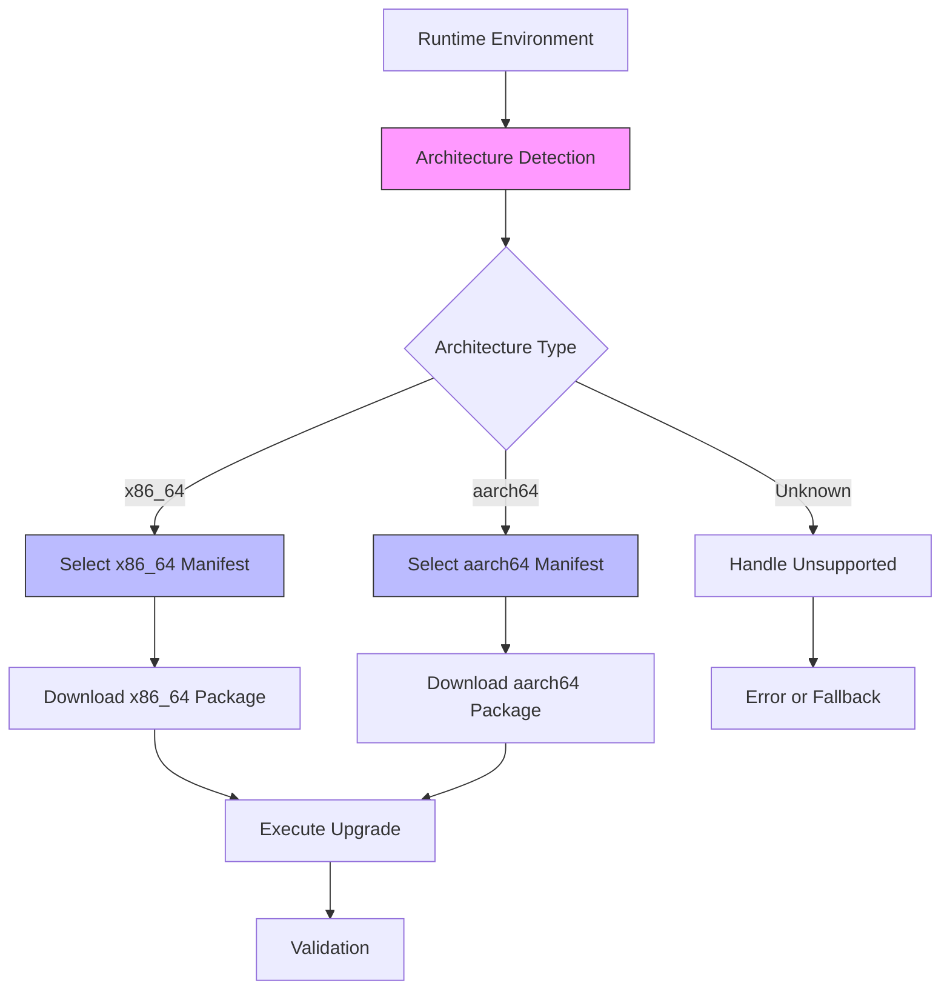
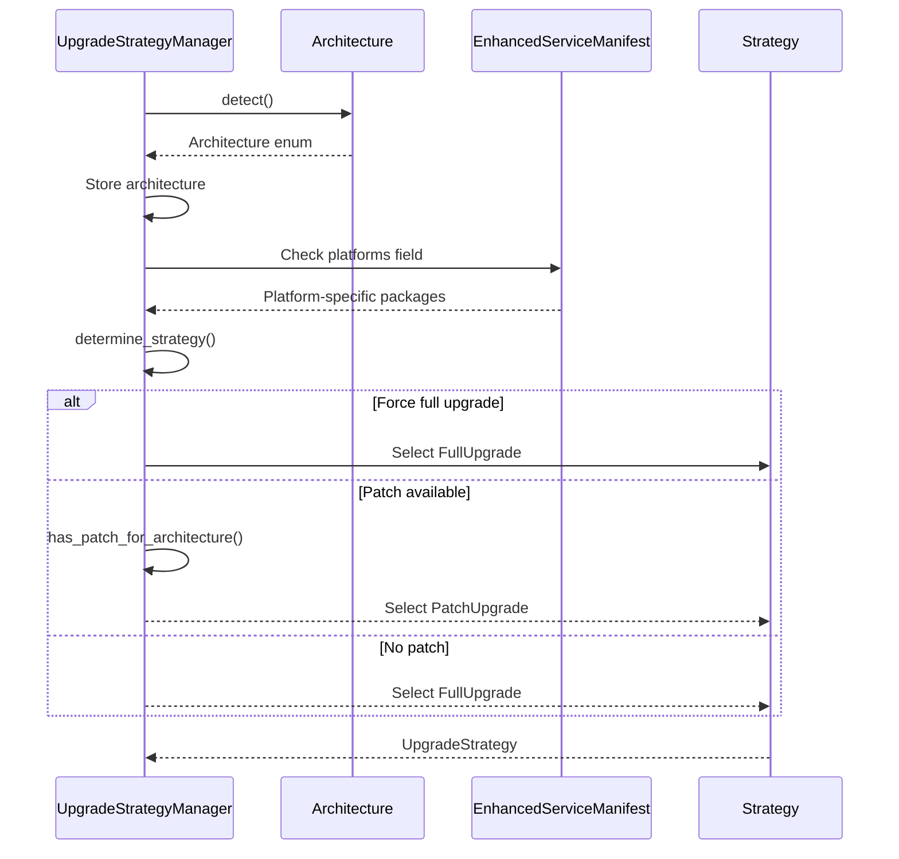
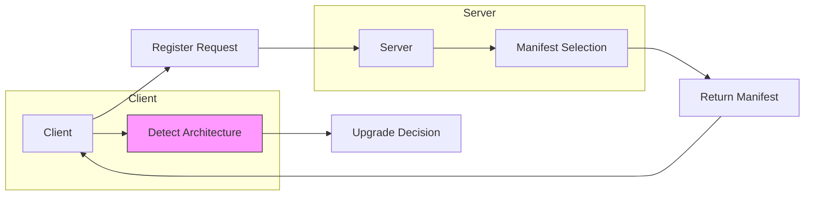

# Architecture Detection Mechanism

<cite>
**Referenced Files in This Document**   
- [architecture.rs](file://client-core/src/architecture.rs#L0-L451)
- [upgrade_strategy.rs](file://client-core/src/upgrade_strategy.rs#L0-L463)
- [api_types.rs](file://client-core/src/api_types.rs#L0-L902)
- [constants.rs](file://client-core/src/constants.rs#L322-L345)
- [api.rs](file://client-core/src/api.rs#L597-L620)
</cite>

## Table of Contents
1. [Architecture Detection Mechanism](#architecture-detection-mechanism)
2. [Core Components](#core-components)
3. [Architecture Overview](#architecture-overview)
4. [Detailed Component Analysis](#detailed-component-analysis)
5. [Integration with Upgrade Strategy](#integration-with-upgrade-strategy)
6. [API Client Integration](#api-client-integration)
7. [Performance and Caching Considerations](#performance-and-caching-considerations)
8. [Error Handling and Override Mechanisms](#error-handling-and-override-mechanisms)

## Core Components

The architecture detection mechanism is implemented primarily in the `Architecture` enum within `client-core/src/architecture.rs`. This component provides comprehensive functionality for detecting, validating, and working with system architectures in a cross-platform upgrade context.

The core implementation revolves around three main aspects:
- Runtime architecture detection using standard library functions
- Architecture mapping to platform-specific resources
- Compatibility validation for upgrade operations

```rust
/// Supported system architecture enumeration
#[derive(Debug, Clone, PartialEq, Eq, Hash, Serialize, Deserialize)]
pub enum Architecture {
    /// x86_64 architecture (Intel/AMD 64-bit)
    X86_64,
    /// aarch64 architecture (ARM 64-bit)
    Aarch64,
    /// Unsupported architecture
    Unsupported(String),
}
```

The `Architecture` enum serves as the central data structure for representing system architectures throughout the application. It supports serialization/deserialization for persistence and network transmission, and implements equality and hashing for use in collections.

**Section sources**
- [architecture.rs](file://client-core/src/architecture.rs#L8-L25)

## Architecture Overview

The architecture detection system follows a layered approach, integrating with various components of the upgrade process to ensure platform-appropriate operations.



**Diagram sources**
- [architecture.rs](file://client-core/src/architecture.rs#L8-L25)
- [upgrade_strategy.rs](file://client-core/src/upgrade_strategy.rs#L104-L137)

## Detailed Component Analysis

### Architecture Detection Implementation

The architecture detection mechanism uses Rust's standard library to determine the host system architecture at runtime. The primary method is `detect()`, which leverages `std::env::consts::ARCH` to obtain the architecture string from the execution environment.

```mermaid
flowchart TD
Start([detect() called]) --> GetArch["Get std::env::consts::ARCH"]
GetArch --> Parse["Parse architecture string"]
Parse --> Match{"Match known architecture?"}
Match --> |x86_64 variants| X86[Return X86_64]
Match --> |aarch64 variants| Aarch64[Return Aarch64]
Match --> |Unknown| Warn["Log warning"]
Warn --> Unsupported["Return Unsupported(arch_str)"]
X86 --> End([Return result])
Aarch64 --> End
Unsupported --> End
style Start fill:#f9f,stroke:#333
style End fill:#f9f,stroke:#333
```

**Diagram sources**
- [architecture.rs](file://client-core/src/architecture.rs#L30-L50)

The detection process follows these steps:
1. Retrieve the architecture string from `std::env::consts::ARCH`
2. Attempt to parse the string into a known architecture variant
3. Return the appropriate `Architecture` enum variant

The implementation supports multiple string representations for each architecture:
- **x86_64**: "x86_64", "amd64", "x64"
- **aarch64**: "aarch64", "arm64", "armv8"

This flexibility ensures compatibility across different system reporting conventions.

**Section sources**
- [architecture.rs](file://client-core/src/architecture.rs#L30-L50)

### Architecture to Package Mapping

Once the architecture is detected, it is mapped to platform-specific service manifests and patch packages. This mapping is implemented through the `get_docker_file_name()` method and constants defined in the configuration.

```mermaid
classDiagram
class Architecture {
+detect() Architecture
+get_docker_file_name() String
+as_str() &str
+from_str(arch_str : &str) Result~Architecture~
+is_supported() bool
}
class Constants {
+DOCKER_SERVICE_X86_64_PACKAGE : &str
+DOCKER_SERVICE_AARCH64_PACKAGE : &str
}
Architecture --> Constants : "uses constants for"
Constants "1" --> "2" Architecture : "defines package names for"
note right of Architecture
Maps detected architecture to
platform-specific package names
using constants from configuration
end note
```

**Diagram sources**
- [architecture.rs](file://client-core/src/architecture.rs#L59-L65)
- [constants.rs](file://client-core/src/constants.rs#L337-L339)

The package mapping uses constants defined in `constants.rs`:
```rust
pub const DOCKER_SERVICE_X86_64_PACKAGE: &str = "docker-x86_64.zip";
pub const DOCKER_SERVICE_AARCH64_PACKAGE: &str = "docker-aarch64.zip";
```

When `get_docker_file_name()` is called, it returns the appropriate package name based on the detected architecture:
- `Architecture::X86_64` → "docker-x86_64.zip"
- `Architecture::Aarch64` → "docker-aarch64.zip"
- `Architecture::Unsupported(arch)` → "docker-{arch}.zip"

This ensures that the correct platform-specific package is selected for download and installation.

**Section sources**
- [architecture.rs](file://client-core/src/architecture.rs#L59-L65)
- [constants.rs](file://client-core/src/constants.rs#L337-L339)

## Integration with Upgrade Strategy

The detected architecture plays a crucial role in determining the appropriate upgrade strategy. The `UpgradeStrategyManager` uses the detected architecture to select the correct package from the service manifest and determine the optimal upgrade path.



**Diagram sources**
- [upgrade_strategy.rs](file://client-core/src/upgrade_strategy.rs#L104-L137)
- [architecture.rs](file://client-core/src/architecture.rs#L30-L50)

The integration occurs in the `UpgradeStrategyManager` constructor, where architecture detection is performed:

```rust
pub fn new(
    current_version: String,
    force_full: bool,
    manifest: EnhancedServiceManifest,
) -> Self {
    Self {
        manifest,
        current_version,
        force_full,
        architecture: Architecture::detect(),
    }
}
```

The detected architecture is then used in several key methods:

1. **`get_platform_package()`**: Retrieves the platform-specific package information from the manifest
```rust
fn get_platform_package(&self) -> Result<crate::api_types::PlatformPackageInfo> {
    match self.architecture {
        Architecture::X86_64 => platforms.x86_64.clone(),
        Architecture::Aarch64 => platforms.aarch64.clone(),
        Architecture::Unsupported(_) => Err(anyhow::anyhow!("Unsupported architecture")),
    }
}
```

2. **`has_patch_for_architecture()`**: Checks if a patch is available for the detected architecture
```rust
fn has_patch_for_architecture(&self) -> bool {
    match self.architecture {
        Architecture::X86_64 => patch.x86_64.is_some(),
        Architecture::Aarch64 => patch.aarch64.is_some(),
        Architecture::Unsupported(_) => false,
    }
}
```

This integration ensures that the upgrade process selects the appropriate package bundle based on the host architecture, optimizing download size and ensuring compatibility.

**Section sources**
- [upgrade_strategy.rs](file://client-core/src/upgrade_strategy.rs#L104-L137)
- [upgrade_strategy.rs](file://client-core/src/upgrade_strategy.rs#L300-L330)

## API Client Integration

The architecture detection mechanism integrates with the API client to fetch architecture-specific manifests. When the client registers with the server, it includes architecture information to receive appropriate service manifests.



**Diagram sources**
- [api_types.rs](file://client-core/src/api_types.rs#L0-L56)
- [api.rs](file://client-core/src/api.rs#L597-L620)

The API client uses the `get_enhanced_service_manifest()` method to retrieve service manifests that contain architecture-specific information:

```rust
pub async fn get_enhanced_service_manifest(&self) -> Result<EnhancedServiceManifest> {
    let url = self.config.get_endpoint_url(&self.config.endpoints.service_manifest);
    let response = self.build_request(&url).send().await?;
    
    if response.status().is_success() {
        let manifest: EnhancedServiceManifest = response.json().await?;
        Ok(manifest)
    } else {
        Err(anyhow::anyhow!("Failed to get service manifest"))
    }
}
```

The `EnhancedServiceManifest` structure contains architecture-specific fields:

```rust
pub struct EnhancedServiceManifest {
    pub version: Version,
    pub release_date: String,
    pub release_notes: String,
    pub packages: Option<ServicePackages>,
    pub platforms: Option<PlatformPackages>,
    pub patch: Option<PatchInfo>,
}

pub struct PlatformPackages {
    #[serde(rename = "x86_64")]
    pub x86_64: Option<PlatformPackageInfo>,
    #[serde(rename = "aarch64")]
    pub aarch64: Option<PlatformPackageInfo>,
}
```

The `supports_architecture()` method in `EnhancedServiceManifest` allows checking if a specific architecture is supported:

```rust
pub fn supports_architecture(&self, arch: &str) -> bool {
    match arch {
        "x86_64" => platforms.x86_64.is_some(),
        "aarch64" => platforms.aarch64.is_some(),
        _ => false,
    }
}
```

This integration ensures that the client receives manifests with appropriate package URLs and metadata for the detected architecture.

**Section sources**
- [api.rs](file://client-core/src/api.rs#L597-L620)
- [api_types.rs](file://client-core/src/api_types.rs#L300-L338)

## Performance and Caching Considerations

The architecture detection mechanism is designed to be lightweight and efficient, with minimal performance impact on the overall upgrade process.

The detection process has O(1) time complexity as it involves:
1. A single system call to retrieve `std::env::consts::ARCH`
2. A string comparison against known architecture variants
3. Return of the appropriate enum variant

Since architecture detection occurs once during the initialization of `UpgradeStrategyManager`, the result is effectively cached for the duration of the upgrade process. This prevents redundant detection calls and ensures consistency across different components that may need architecture information.

The detection is also idempotent - calling `Architecture::detect()` multiple times on the same system will always return the same result, making caching unnecessary beyond the instance-level storage in `UpgradeStrategyManager`.

Memory usage is minimal, with the `Architecture` enum requiring only enough space to store the enum variant and, in the case of `Unsupported`, a string allocation for unknown architectures.

**Section sources**
- [architecture.rs](file://client-core/src/architecture.rs#L30-L50)
- [upgrade_strategy.rs](file://client-core/src/upgrade_strategy.rs#L104-L137)

## Error Handling and Override Mechanisms

The architecture detection system includes robust error handling for edge cases and provides mechanisms for users to override automatic detection when necessary.

### Error Handling

When an unknown architecture is detected, the system handles it gracefully:

```rust
pub fn detect() -> Self {
    let arch_str = std::env::consts::ARCH;
    Self::from_str(arch_str).unwrap_or_else(|_| {
        warn!("Detected unknown architecture: {}", arch_str);
        Self::Unsupported(arch_str.to_string())
    })
}
```

Key error handling features:
- **Unknown architectures**: Logged as warnings and represented as `Unsupported(String)`
- **Parsing errors**: Handled through `Result` type with descriptive error messages
- **Missing packages**: Result in explicit errors when attempting to retrieve platform-specific packages

The system also includes compatibility checking:

```rust
pub fn check_compatibility(target_arch: &Architecture) -> Result<()> {
    let current_arch = Architecture::detect();
    if current_arch == *target_arch {
        Ok(())
    } else {
        Err(anyhow::anyhow!(format!(
            "Architecture mismatch: current system is {}, target is {}",
            current_arch.display_name(),
            target_arch.display_name()
        )))
    }
}
```

### Override Mechanisms

While not explicitly implemented in the provided code, the architecture system supports potential override mechanisms through:

1. **Command-line arguments**: As suggested in the specification file:
```
duck-cli upgrade --arch aarch64   # Specify architecture
```

2. **Configuration files**: Architecture could be specified in configuration to override detection

3. **Environment variables**: System environment could influence detection

The modular design of the `Architecture` enum and its `from_str()` method makes implementing such overrides straightforward. An override mechanism would likely:
1. Check for user-specified architecture
2. Use `Architecture::from_str()` to parse the specified value
3. Validate the architecture is supported
4. Use the specified architecture instead of detected one

This would allow users to force a specific architecture when automatic detection fails or when cross-architecture operations are needed.

**Section sources**
- [architecture.rs](file://client-core/src/architecture.rs#L150-L180)
- [spec/upgrade-architecture-enhancement.md](file://spec/upgrade-architecture-enhancement.md#L464-L481)