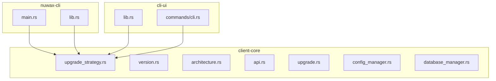
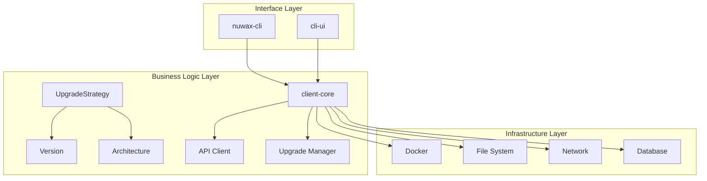
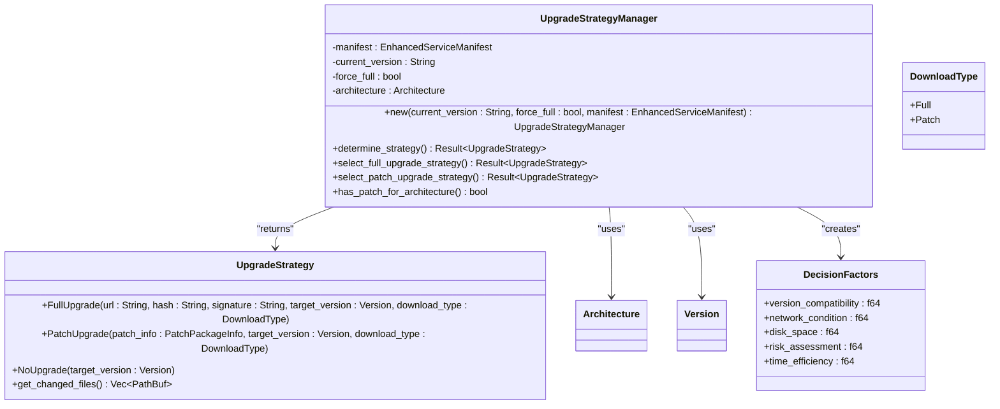
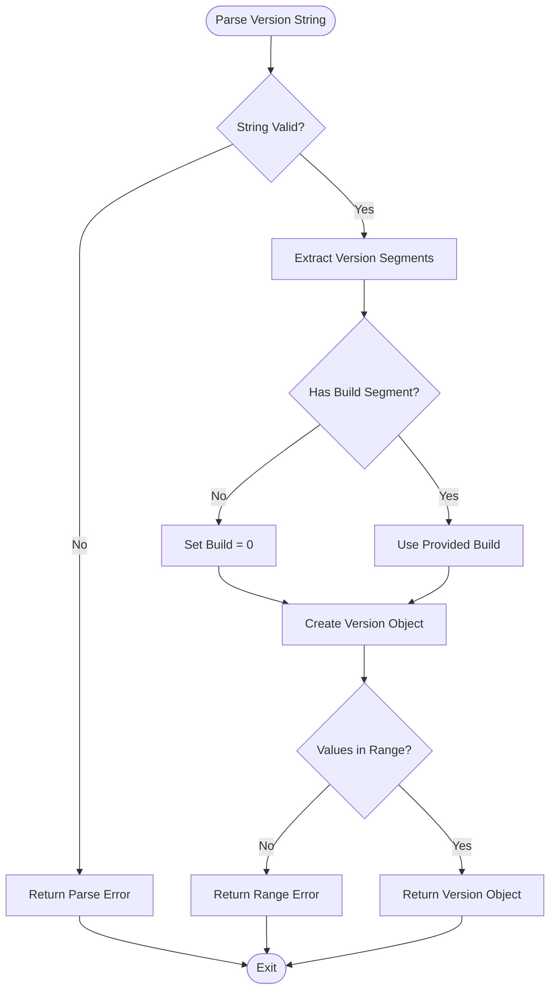
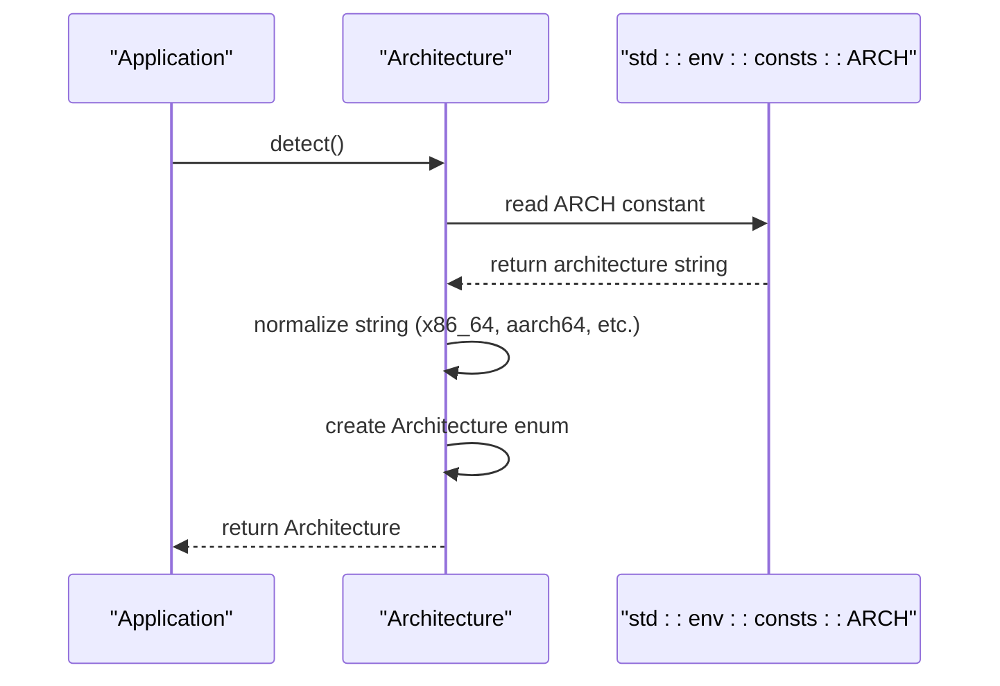
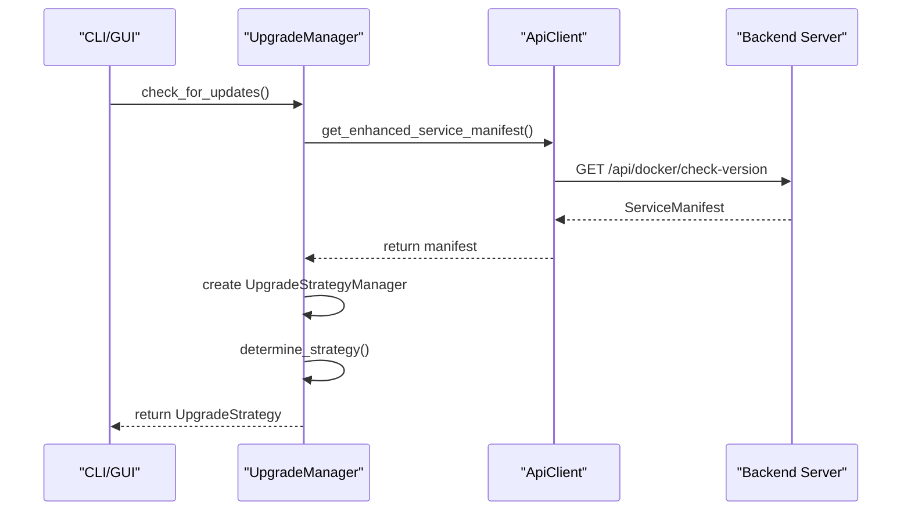
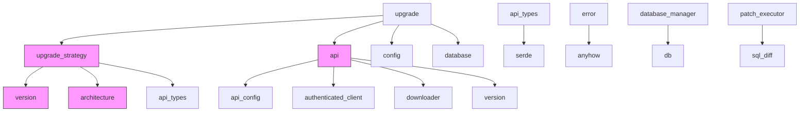

# Core Logic Architecture

<cite>
**Referenced Files in This Document**   
- [lib.rs](file://client-core/src/lib.rs)
- [upgrade_strategy.rs](file://client-core/src/upgrade_strategy.rs)
- [version.rs](file://client-core/src/version.rs)
- [architecture.rs](file://client-core/src/architecture.rs)
- [api.rs](file://client-core/src/api.rs)
- [upgrade.rs](file://client-core/src/upgrade.rs)
- [main.rs](file://nuwax-cli/src/main.rs)
- [lib.rs](file://nuwax-cli/src/lib.rs)
- [lib.rs](file://cli-ui/src-tauri/src/lib.rs)
- [cli.rs](file://cli-ui/src-tauri/src/commands/cli.rs)
</cite>

## Table of Contents
1. [Introduction](#introduction)
2. [Project Structure](#project-structure)
3. [Core Components](#core-components)
4. [Architecture Overview](#architecture-overview)
5. [Detailed Component Analysis](#detailed-component-analysis)
6. [Dependency Analysis](#dependency-analysis)
7. [Performance Considerations](#performance-considerations)
8. [Troubleshooting Guide](#troubleshooting-guide)
9. [Conclusion](#conclusion)

## Introduction
This document provides a comprehensive analysis of the core logic architecture of the `client-core` library, which serves as the shared business logic layer for both GUI (`cli-ui`) and CLI (`nuwax-cli`) interfaces. The system is designed to manage Docker-based service upgrades, version control, architecture detection, and API communication in a unified manner. The architecture leverages Rust's strong type system, async runtime (Tokio), and modular design to ensure consistency, reliability, and maintainability across different client interfaces.

## Project Structure
The repository is organized into multiple components, with `client-core` acting as the central shared library. It contains all business logic related to version management, upgrade strategies, Docker operations, and API communication. The `nuwax-cli` and `cli-ui` applications consume this library to provide command-line and graphical interfaces respectively.

**Diagram sources**
- [lib.rs](file://client-core/src/lib.rs#L1-L27)
- [main.rs](file://nuwax-cli/src/main.rs#L1-L103)
- [lib.rs](file://nuwax-cli/src/lib.rs#L1-L28)
- [lib.rs](file://cli-ui/src-tauri/src/lib.rs#L1-L36)
- [cli.rs](file://cli-ui/src-tauri/src/commands/cli.rs#L1-L628)

**Section sources**
- [lib.rs](file://client-core/src/lib.rs#L1-L27)

## Core Components
The `client-core` library exposes several key modules that encapsulate shared functionality:
- **upgrade_strategy**: Implements the strategy pattern for different upgrade types (full, patch, no-upgrade)
- **version**: Handles version parsing, comparison, and compatibility checks
- **architecture**: Detects and manages system architecture information
- **api**: Manages communication with the backend server
- **upgrade**: Coordinates the overall upgrade process
- **config_manager** and **database_manager**: Handle configuration and database operations

These components are designed to be consumed by both CLI and GUI applications, ensuring consistent behavior across interfaces.

**Section sources**
- [lib.rs](file://client-core/src/lib.rs#L1-L27)

## Architecture Overview
The system follows a layered architecture with clear separation of concerns. The `client-core` library acts as the business logic layer, sitting between the interface layer (`nuwax-cli`, `cli-ui`) and the infrastructure layer (Docker, file system, network).

**Diagram sources**
- [lib.rs](file://client-core/src/lib.rs#L1-L27)
- [upgrade_strategy.rs](file://client-core/src/upgrade_strategy.rs#L1-L463)
- [version.rs](file://client-core/src/version.rs#L1-L410)
- [architecture.rs](file://client-core/src/architecture.rs#L1-L451)
- [api.rs](file://client-core/src/api.rs#L1-L976)
- [upgrade.rs](file://client-core/src/upgrade.rs#L1-L90)

## Detailed Component Analysis

### Upgrade Strategy Implementation
The upgrade strategy component implements the strategy pattern to handle different types of upgrades based on version comparison and system conditions.

#### Class Diagram

**Diagram sources**
- [upgrade_strategy.rs](file://client-core/src/upgrade_strategy.rs#L1-L463)

**Section sources**
- [upgrade_strategy.rs](file://client-core/src/upgrade_strategy.rs#L1-L463)

### Version Management System
The version module provides robust version parsing and comparison capabilities, supporting four-segment version numbers (major.minor.patch.build).

#### Flowchart

**Diagram sources**
- [version.rs](file://client-core/src/version.rs#L1-L410)

**Section sources**
- [version.rs](file://client-core/src/version.rs#L1-L410)

### Architecture Detection
The architecture module detects the current system architecture and provides utilities for architecture-specific operations.

#### Sequence Diagram

**Diagram sources**
- [architecture.rs](file://client-core/src/architecture.rs#L1-L451)

**Section sources**
- [architecture.rs](file://client-core/src/architecture.rs#L1-L451)

### API Communication Layer
The API client handles communication with the backend server, including version checks and update downloads.

#### Sequence Diagram

**Diagram sources**
- [api.rs](file://client-core/src/api.rs#L1-L976)
- [upgrade.rs](file://client-core/src/upgrade.rs#L1-L90)

**Section sources**
- [api.rs](file://client-core/src/api.rs#L1-L976)
- [upgrade.rs](file://client-core/src/upgrade.rs#L1-L90)

## Dependency Analysis
The `client-core` library has a well-defined dependency structure, with clear import relationships between modules.

**Diagram sources**
- [lib.rs](file://client-core/src/lib.rs#L1-L27)
- [upgrade_strategy.rs](file://client-core/src/upgrade_strategy.rs#L1-L463)
- [version.rs](file://client-core/src/version.rs#L1-L410)
- [architecture.rs](file://client-core/src/architecture.rs#L1-L451)
- [api.rs](file://client-core/src/api.rs#L1-L976)

**Section sources**
- [lib.rs](file://client-core/src/lib.rs#L1-L27)

## Performance Considerations
The system is designed with performance in mind, leveraging async operations through Tokio for I/O-bound tasks such as network requests and file operations. The upgrade strategy decision-making process is optimized to minimize network calls by caching manifest data and performing version comparisons locally. Architecture detection is a lightweight operation that occurs once at startup. Version parsing uses the `winnow` parser combinator library for efficient string processing. Error handling is implemented using `anyhow` and `thiserror` for zero-cost abstractions in release builds.

## Troubleshooting Guide
Common issues and their solutions:

**Section sources**
- [upgrade_strategy.rs](file://client-core/src/upgrade_strategy.rs#L1-L463)
- [version.rs](file://client-core/src/version.rs#L1-L410)
- [architecture.rs](file://client-core/src/architecture.rs#L1-L451)
- [api.rs](file://client-core/src/api.rs#L1-L976)

### Version Parsing Errors
- **Symptom**: "版本号解析失败" (Version parsing failed)
- **Cause**: Invalid version string format
- **Solution**: Ensure version strings follow the format `major.minor.patch.build` (e.g., `0.0.13.5`)

### Architecture Detection Issues
- **Symptom**: "检测到未知架构" (Unknown architecture detected)
- **Cause**: System architecture not supported
- **Solution**: Verify system is x86_64 or aarch64; check `std::env::consts::ARCH` value

### Upgrade Strategy Decision Problems
- **Symptom**: Unexpected full upgrade when patch should be available
- **Cause**: Missing docker directory or compose file
- **Solution**: Ensure `./docker` directory and compose file exist in working directory

### API Communication Failures
- **Symptom**: "检查Docker版本失败" (Docker version check failed)
- **Cause**: Network issues or server unavailability
- **Solution**: Check network connectivity and server status

## Conclusion
The `client-core` library provides a robust, shared foundation for both CLI and GUI interfaces, implementing a sophisticated upgrade system that intelligently selects between full and incremental updates based on version compatibility, system architecture, and environmental factors. The architecture follows clean design principles with clear separation of concerns, making it maintainable and extensible. By centralizing business logic in a shared library, the system ensures consistent behavior across different user interfaces while leveraging Rust's safety and performance characteristics for reliable operation.