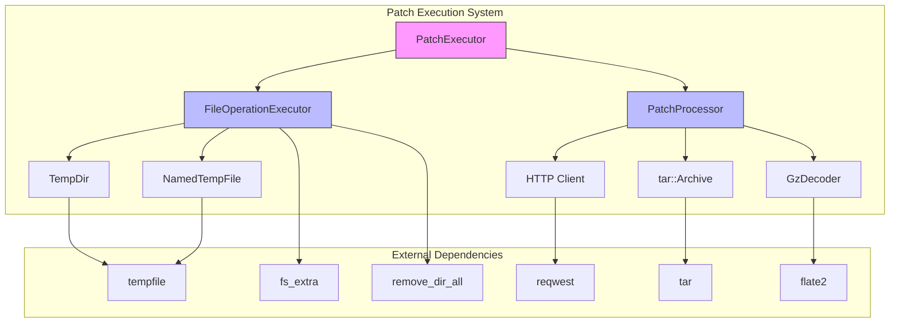
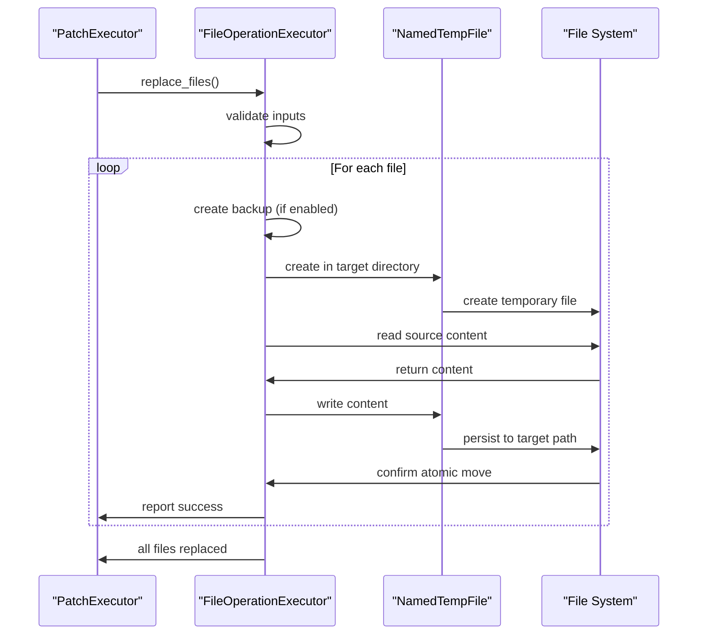
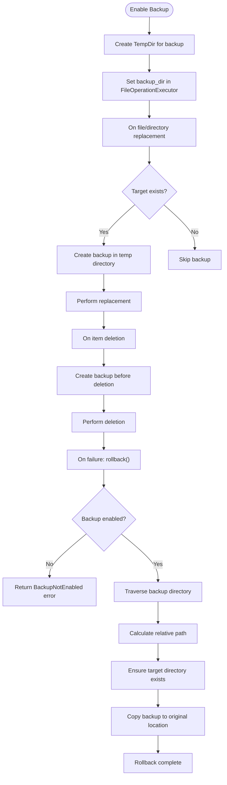
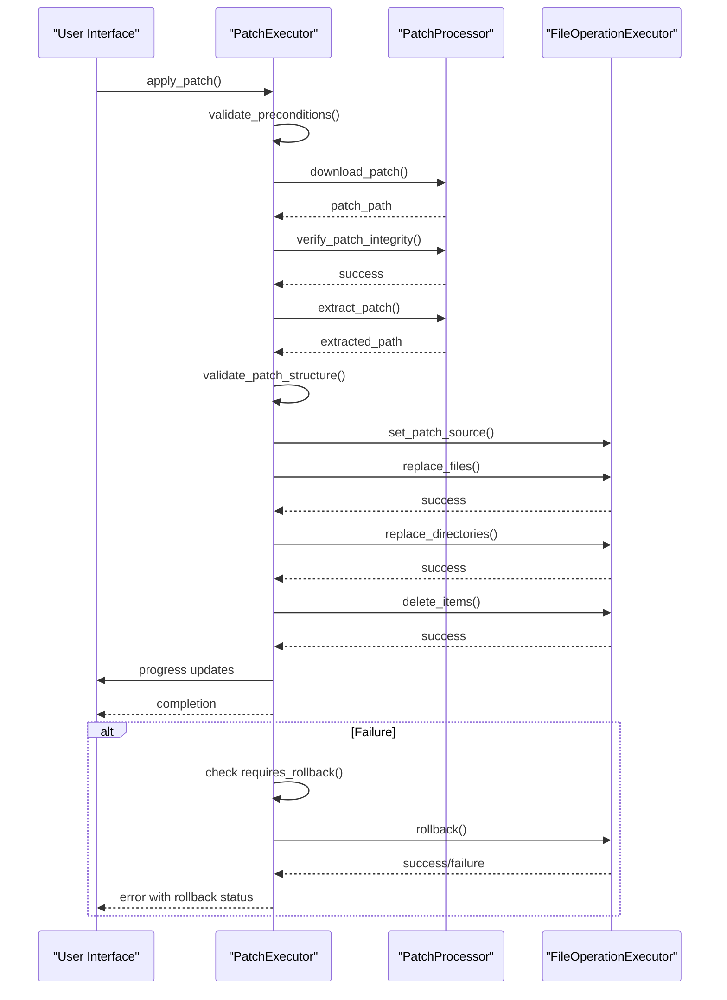

# File Patch Operations

<cite>
**Referenced Files in This Document**   
- [file_operations.rs](file://client-core/src/patch_executor/file_operations.rs)
- [error.rs](file://client-core/src/patch_executor/error.rs)
- [patch_processor.rs](file://client-core/src/patch_executor/patch_processor.rs)
- [mod.rs](file://client-core/src/patch_executor/mod.rs)
- [api_types.rs](file://client-core/src/api_types.rs)
</cite>

## Table of Contents
1. [Introduction](#introduction)
2. [Core Architecture](#core-architecture)
3. [File Operations Implementation](#file-operations-implementation)
4. [Atomic Replacement Mechanism](#atomic-replacement-mechanism)
5. [Backup and Rollback System](#backup-and-rollback-system)
6. [Error Handling Strategy](#error-handling-strategy)
7. [Integration with Patch Execution Workflow](#integration-with-patch-execution-workflow)
8. [Security and Validation](#security-and-validation)
9. [Performance Characteristics](#performance-characteristics)
10. [Usage Examples](#usage-examples)

## Introduction

The file patch operations system in the duck_client repository provides a robust mechanism for safely applying binary and configuration file updates. This document details the implementation of atomic file replacements, backup creation, permission preservation, and error recovery mechanisms. The system is designed to ensure data integrity during patch application while providing comprehensive rollback capabilities in case of failures.

The core functionality is implemented in the `file_operations.rs` module, which works in conjunction with the patch processor and main executor to form a complete patch management solution. The system handles various file types including regular files, directories, symbolic links, and executable scripts, ensuring safe and reliable updates.

**Section sources**
- [file_operations.rs](file://client-core/src/patch_executor/file_operations.rs#L1-L50)
- [mod.rs](file://client-core/src/patch_executor/mod.rs#L1-L20)

## Core Architecture

The file patch operations system follows a modular architecture with clear separation of concerns. The main components work together to provide a comprehensive patch management solution.



**Diagram sources**
- [mod.rs](file://client-core/src/patch_executor/mod.rs#L1-L50)
- [file_operations.rs](file://client-core/src/patch_executor/file_operations.rs#L1-L30)
- [patch_processor.rs](file://client-core/src/patch_executor/patch_processor.rs#L1-L30)

**Section sources**
- [mod.rs](file://client-core/src/patch_executor/mod.rs#L1-L50)
- [file_operations.rs](file://client-core/src/patch_executor/file_operations.rs#L1-L30)
- [patch_processor.rs](file://client-core/src/patch_executor/patch_processor.rs#L1-L30)

## File Operations Implementation

The `FileOperationExecutor` struct is the core component responsible for performing file operations during patch application. It provides methods for replacing files and directories, deleting items, and managing backups.

```mermaid
classDiagram
class FileOperationExecutor {
+work_dir : PathBuf
+backup_dir : Option<TempDir>
+patch_source : Option<PathBuf>
+new(work_dir : PathBuf) Result<Self>
+enable_backup() Result<()>
+set_patch_source(patch_source : &Path) Result<()>
+replace_files(files : &[String]) Result<()>
+replace_directories(directories : &[String]) Result<()>
+delete_items(items : &[String]) Result<()>
+rollback() Result<()>
+work_dir() &Path
+is_backup_enabled() bool
+patch_source() Option<&Path>
}
class PatchExecutorError {
+IoError(std : : io : : Error)
+PathError{path : String}
+PermissionError{path : String}
+AtomicOperationFailed{reason : String}
+RollbackFailed{reason : String}
+DownloadFailed{url : String}
+VerificationFailed{reason : String}
+HashMismatch{expected : String, actual : String}
+SignatureVerificationFailed{reason : String}
+BackupNotEnabled
+PatchSourceNotSet
+TempFileError(tempfile : : PersistError)
+HttpError(reqwest : : Error)
+Custom{message : String}
}
FileOperationExecutor --> PatchExecutorError : "returns"
FileOperationExecutor --> TempDir : "uses"
FileOperationExecutor --> NamedTempFile : "uses"
FileOperationExecutor --> fs_extra : "uses"
FileOperationExecutor --> remove_dir_all : "uses"
```

**Diagram sources**
- [file_operations.rs](file://client-core/src/patch_executor/file_operations.rs#L15-L100)
- [error.rs](file://client-core/src/patch_executor/error.rs#L15-L50)

**Section sources**
- [file_operations.rs](file://client-core/src/patch_executor/file_operations.rs#L1-L300)
- [error.rs](file://client-core/src/patch_executor/error.rs#L1-L200)

### File and Directory Replacement

The system provides comprehensive methods for replacing both individual files and entire directories. The `replace_files` and `replace_directories` methods handle collections of files and directories respectively, ensuring atomic operations and proper error handling.

```rust
/// Replace multiple files
pub async fn replace_files(&self, files: &[String]) -> Result<()> {
    info!("🔄 开始替换 {} 个文件", files.len());
    
    for file_path in files {
        self.replace_single_file(file_path).await?;
    }
    
    info!("✅ 文件替换完成");
    Ok(())
}

/// Replace multiple directories
pub async fn replace_directories(&self, directories: &[String]) -> Result<()> {
    info!("🔄 开始替换 {} 个目录", directories.len());
    
    for dir_path in directories {
        self.replace_single_directory(dir_path).await?;
    }
    
    info!("✅ 目录替换完成");
    Ok(())
}
```

The implementation ensures that each file and directory is processed individually, with proper error handling and logging. This approach allows for partial success scenarios where some files can be updated even if others fail.

**Section sources**
- [file_operations.rs](file://client-core/src/patch_executor/file_operations.rs#L50-L100)

### Deletion Operations

The deletion system handles both files and directories through the `delete_items` method, which processes a list of items to be removed. The implementation includes safety checks and backup creation when enabled.

```rust
/// Delete multiple items (files or directories)
pub async fn delete_items(&self, items: &[String]) -> Result<()> {
    info!("🗑️ 开始删除 {} 个项目", items.len());
    
    for item_path in items {
        self.delete_single_item(item_path).await?;
    }
    
    info!("✅ 删除操作完成");
    Ok(())
}
```

Each item is checked for existence before deletion, and appropriate actions are taken based on whether it's a file or directory. The system uses platform-compatible methods for directory removal, ensuring cross-platform compatibility.

**Section sources**
- [file_operations.rs](file://client-core/src/patch_executor/file_operations.rs#L100-L130)

## Atomic Replacement Mechanism

The atomic file replacement system ensures that file updates are performed safely without leaving the system in an inconsistent state. This is achieved through a temporary file approach that guarantees either complete success or no changes at all.



**Diagram sources**
- [file_operations.rs](file://client-core/src/patch_executor/file_operations.rs#L200-L250)

**Section sources**
- [file_operations.rs](file://client-core/src/patch_executor/file_operations.rs#L200-L250)

### Temporary File Implementation

The atomic replacement is implemented using the `NamedTempFile` from the tempfile crate, which creates temporary files in the same directory as the target file. This ensures that the final move operation is atomic at the filesystem level.

```rust
/// Atomic file replacement using temporary file
async fn atomic_file_replace(&self, source: &Path, target: &Path) -> Result<()> {
    // Ensure target directory exists
    if let Some(parent) = target.parent() {
        fs::create_dir_all(parent).await?;
    }
    
    // Create temporary file in target directory
    let temp_file = NamedTempFile::new_in(target.parent().unwrap_or_else(|| Path::new(".")))?;
    
    // Copy content from source to temporary file
    let source_content = fs::read(source).await?;
    fs::write(temp_file.path(), source_content).await?;
    
    // Atomically move temporary file to target location
    temp_file.persist(target)?;
    
    debug!("原子性替换完成: {:?} -> {:?}", source, target);
    Ok(())
}
```

This approach has several advantages:
- **Atomicity**: The final move operation is atomic at the filesystem level
- **Safety**: If the process is interrupted, only the temporary file is left behind
- **Cross-platform compatibility**: Works consistently across different operating systems
- **No partial writes**: The target file is never in a partially written state

**Section sources**
- [file_operations.rs](file://client-core/src/patch_executor/file_operations.rs#L200-L250)

## Backup and Rollback System

The backup and rollback system provides critical recovery capabilities in case of patch application failures. When enabled, it creates a complete backup of modified files and directories before making any changes.



**Diagram sources**
- [file_operations.rs](file://client-core/src/patch_executor/file_operations.rs#L300-L500)

**Section sources**
- [file_operations.rs](file://client-core/src/patch_executor/file_operations.rs#L300-L500)

### Backup Creation

Backup creation is triggered when the `enable_backup` method is called on the `FileOperationExecutor`. This creates a temporary directory that serves as the backup location for all modified files and directories.

```rust
/// Enable backup mode (supports rollback)
pub fn enable_backup(&mut self) -> Result<()> {
    self.backup_dir = Some(TempDir::new()?);
    info!("📦 已启用文件操作备份模式");
    Ok(())
}
```

When file replacements or deletions occur, the system automatically creates backups of the original files and directories:

```rust
// Create backup before replacing a file
if let Some(backup_dir) = &self.backup_dir {
    if target_path.exists() {
        let backup_path = backup_dir.path().join(file_path);
        if let Some(parent) = backup_path.parent() {
            fs::create_dir_all(parent).await?;
        }
        fs::copy(&target_path, &backup_path).await?;
        debug!("已备份文件: {} -> {:?}", file_path, backup_path);
    }
}
```

The backup system preserves the complete directory structure, ensuring that files can be restored to their exact original locations.

**Section sources**
- [file_operations.rs](file://client-core/src/patch_executor/file_operations.rs#L75-L85)
- [file_operations.rs](file://client-core/src/patch_executor/file_operations.rs#L150-L170)

### Rollback Process

The rollback system restores the system to its pre-patch state by copying all backup files back to their original locations. This process is initiated when the `rollback` method is called.

```rust
/// Rollback file operations
pub async fn rollback(&self) -> Result<()> {
    if let Some(backup_dir) = &self.backup_dir {
        warn!("🔙 开始回滚文件操作...");
        
        // Traverse backup directory and restore all files
        let backup_path = backup_dir.path().to_owned();
        let work_dir = self.work_dir.clone();
        
        tokio::task::spawn_blocking(move || {
            for entry in WalkDir::new(&backup_path) {
                let entry = entry.map_err(|e| {
                    PatchExecutorError::custom(format!("遍历备份目录失败: {e}"))
                })?;
                
                let backup_file_path = entry.path();
                if backup_file_path.is_file() {
                    // Calculate relative path
                    let relative_path =
                        backup_file_path.strip_prefix(&backup_path).map_err(|e| {
                            PatchExecutorError::custom(format!("计算相对路径失败: {e}"))
                        })?;
                    
                    let target_path = work_dir.join(relative_path);
                    
                    // Ensure target directory exists
                    if let Some(parent) = target_path.parent() {
                        std::fs::create_dir_all(parent).map_err(|e| {
                            PatchExecutorError::custom(format!("创建回滚目标目录失败: {e}"))
                        })?;
                    }
                    
                    // Restore file
                    std::fs::copy(backup_file_path, &target_path).map_err(|e| {
                        PatchExecutorError::custom(format!("恢复文件失败: {e}"))
                    })?;
                    
                    debug!("恢复文件: {:?} -> {:?}", backup_file_path, target_path);
                }
            }
            
            Ok::<(), PatchExecutorError>(())
        })
        .await
        .map_err(|e| PatchExecutorError::custom(format!("回滚任务失败: {e}")))??;
        
        info!("✅ 文件操作回滚完成");
    } else {
        return Err(PatchExecutorError::BackupNotEnabled);
    }
    
    Ok(())
}
```

The rollback process runs in a blocking task to ensure filesystem operations are completed reliably. It traverses the entire backup directory structure, restoring each file to its original location while preserving the directory hierarchy.

**Section sources**
- [file_operations.rs](file://client-core/src/patch_executor/file_operations.rs#L300-L500)

## Error Handling Strategy

The error handling system is comprehensive and well-structured, providing specific error types for different failure scenarios. The `PatchExecutorError` enum defines all possible error conditions that can occur during patch operations.

```mermaid
classDiagram
class PatchExecutorError {
+IoError(std : : io : : Error)
+PathError{path : String}
+PermissionError{path : String}
+AtomicOperationFailed{reason : String}
+RollbackFailed{reason : String}
+DownloadFailed{url : String}
+VerificationFailed{reason : String}
+HashMismatch{expected : String, actual : String}
+SignatureVerificationFailed{reason : String}
+BackupNotEnabled
+PatchSourceNotSet
+TempFileError(tempfile : : PersistError)
+HttpError(reqwest : : Error)
+Custom{message : String}
}
PatchExecutorError --> std : : io : : Error : "wraps"
PatchExecutorError --> tempfile : : PersistError : "wraps"
PatchExecutorError --> reqwest : : Error : "wraps"
PatchExecutorError --> serde_json : : Error : "wraps"
PatchExecutorError --> zip : : result : : ZipError : "wraps"
PatchExecutorError --> fs_extra : : error : : Error : "wraps"
```

**Diagram sources**
- [error.rs](file://client-core/src/patch_executor/error.rs#L15-L50)

**Section sources**
- [error.rs](file://client-core/src/patch_executor/error.rs#L1-L200)

### Error Classification

The error system includes methods to classify errors based on their recoverability and whether they require rollback:

```rust
/// Check if error is recoverable
pub fn is_recoverable(&self) -> bool {
    match self {
        Self::IoError(_) => true,
        Self::HttpError(_) => true,
        Self::DownloadFailed { .. } => true,
        Self::TempFileError(_) => true,
        Self::VerificationFailed { .. } => false,
        Self::HashMismatch { .. } => false,
        Self::SignatureVerificationFailed { .. } => false,
        Self::PermissionError { .. } => false,
        Self::UnsupportedOperation { .. } => false,
        Self::BackupNotEnabled => false,
        Self::PatchSourceNotSet => false,
        _ => true,
    }
}

/// Check if rollback is required
pub fn requires_rollback(&self) -> bool {
    match self {
        Self::VerificationFailed { .. } => false,
        Self::HashMismatch { .. } => false,
        Self::SignatureVerificationFailed { .. } => false,
        Self::DownloadFailed { .. } => false,
        Self::BackupNotEnabled => false,
        Self::PatchSourceNotSet => false,
        _ => true,
    }
}
```

This classification enables intelligent error handling in the main patch executor, which can decide whether to attempt rollback based on the error type.

**Section sources**
- [error.rs](file://client-core/src/patch_executor/error.rs#L150-L200)

## Integration with Patch Execution Workflow

The file operations system is integrated into the overall patch execution workflow through the `PatchExecutor` class, which coordinates the entire patch application process.



**Diagram sources**
- [mod.rs](file://client-core/src/patch_executor/mod.rs#L100-L200)
- [patch_processor.rs](file://client-core/src/patch_executor/patch_processor.rs#L100-L200)

**Section sources**
- [mod.rs](file://client-core/src/patch_executor/mod.rs#L100-L200)

### Workflow Coordination

The `PatchExecutor` class coordinates the entire patch application process, integrating the file operations with other components:

```rust
/// Execute patch application pipeline
async fn execute_patch_pipeline<F>(
    &mut self,
    patch_info: &PatchPackageInfo,
    operations: &PatchOperations,
    progress_callback: &F,
) -> Result<(), PatchExecutorError>
where
    F: Fn(f64) + Send + Sync,
{
    // 1. Download and verify patch package
    info!("📥 下载补丁包...");
    let patch_path = self.patch_processor.download_patch(patch_info).await?;
    progress_callback(0.25);
    
    // 2. Verify patch integrity and signature
    info!("🔍 验证补丁完整性...");
    self.patch_processor
        .verify_patch_integrity(&patch_path, patch_info)
        .await?;
    progress_callback(0.35);
    
    // 3. Extract patch package
    info!("📦 解压补丁包...");
    let extracted_path = self.patch_processor.extract_patch(&patch_path).await?;
    progress_callback(0.45);
    
    // 4. Validate extracted file structure
    info!("🔍 验证补丁文件结构...");
    self.validate_patch_structure(&extracted_path, operations)
        .await?;
    progress_callback(0.5);
    
    // 5. Apply patch operations
    info!("🔧 应用补丁操作...");
    self.apply_patch_operations(&extracted_path, operations, progress_callback)
        .await?;
    
    Ok(())
}
```

The workflow is designed with progress reporting, allowing the UI to provide feedback to users during the potentially lengthy patch application process.

**Section sources**
- [mod.rs](file://client-core/src/patch_executor/mod.rs#L100-L200)

### Operation Application

The `apply_patch_operations` method translates high-level patch operations into specific file operations:

```rust
/// Apply patch operations
async fn apply_patch_operations<F>(
    &mut self,
    extracted_path: &Path,
    operations: &PatchOperations,
    progress_callback: &F,
) -> Result<(), PatchExecutorError>
where
    F: Fn(f64) + Send + Sync,
{
    // Set patch source directory
    self.file_executor.set_patch_source(extracted_path)?;
    
    // Calculate total operations for progress tracking
    let total_operations = operations.total_operations();
    let mut completed_operations = 0;
    
    let base_progress = 0.5;
    let operations_progress_range = 0.5;
    
    // Apply file replacements
    if let Some(replace) = &operations.replace {
        if !replace.files.is_empty() {
            info!("📄 替换 {} 个文件", &replace.files.len());
            self.file_executor.replace_files(&replace.files).await?;
            completed_operations += replace.files.len();
            let progress = base_progress
                + (completed_operations as f64 / total_operations as f64)
                    * operations_progress_range;
            progress_callback(progress);
        }
        
        if !replace.directories.is_empty() {
            info!("📁 替换 {} 个目录", &replace.directories.len());
            self.file_executor.replace_directories(&replace.directories).await?;
            completed_operations += replace.directories.len();
            let progress = base_progress
                + (completed_operations as f64 / total_operations as f64)
                    * operations_progress_range;
            progress_callback(progress);
        }
    }
    
    // Apply deletions
    if let Some(delete) = &operations.delete {
        if !delete.files.is_empty() {
            info!("🗑️ 删除 {} 个项目", &delete.files.len());
            self.file_executor.delete_items(&delete.files).await?;
            completed_operations += &delete.files.len();
            let progress = base_progress
                + (completed_operations as f64 / total_operations as f64)
                    * operations_progress_range;
            progress_callback(progress);
        }
        
        if !delete.directories.is_empty() {
            info!("🗑️ 删除 {} 个目录", &delete.directories.len());
            self.file_executor.delete_items(&delete.directories).await?;
            completed_operations += &delete.directories.len();
            let progress = base_progress
                + (completed_operations as f64 / total_operations as f64)
                    * operations_progress_range;
            progress_callback(progress);
        }
    }
    
    info!("✅ 补丁操作应用完成");
    Ok(())
}
```

This method ensures that progress is reported accurately throughout the operation, with each type of operation contributing proportionally to the overall progress.

**Section sources**
- [mod.rs](file://client-core/src/patch_executor/mod.rs#L200-L300)

## Security and Validation

The system includes comprehensive security measures to prevent malicious attacks and ensure data integrity.

### Path Validation

The system validates all file paths to prevent directory traversal attacks:

```rust
// Security check: prevent path traversal attacks
if path_buf.is_absolute()
    || path_buf
        .components()
        .any(|c| c == std::path::Component::ParentDir)
{
    return Err(PatchExecutorError::extraction_failed(format!(
        "不安全的文件路径: {path_buf:?}"
    )));
}
```

Additionally, the `ReplaceOperations` validation checks for dangerous paths:

```rust
// Security check: prevent access to system important paths
if file_path.starts_with("/")
    || file_path.starts_with("../")
    || file_path.contains("..\\")
    || file_path.starts_with("C:\\")
{
    return Err(anyhow::anyhow!("危险的文件路径: {}", file_path));
}
```

### Hash Verification

The system verifies file integrity using SHA-256 hashing:

```rust
/// Verify file hash
async fn verify_hash(&self, file_path: &Path, expected_hash: &str) -> Result<()> {
    debug!("验证文件哈希: {:?}", file_path);
    
    // Parse expected hash (format: sha256:hash_value)
    let expected_hash = if expected_hash.starts_with("sha256:") {
        &expected_hash[7..]
    } else {
        expected_hash
    };
    
    // Calculate file's SHA256 hash
    let file_content = fs::read(file_path).await?;
    let mut hasher = Sha256::new();
    hasher.update(&file_content);
    let actual_hash = format!("{:x}", hasher.finalize());
    
    // Compare hashes
    if actual_hash != expected_hash {
        return Err(PatchExecutorError::hash_mismatch(
            expected_hash.to_string(),
            actual_hash,
        ));
    }
    
    debug!("哈希验证通过: {}", actual_hash);
    Ok(())
}
```

**Section sources**
- [patch_processor.rs](file://client-core/src/patch_executor/patch_processor.rs#L150-L200)
- [api_types.rs](file://client-core/src/api_types.rs#L400-L500)

## Performance Characteristics

The file operations system is designed with performance in mind, using asynchronous operations and efficient algorithms.

### Asynchronous Operations

All file operations are implemented asynchronously using Tokio, allowing for non-blocking I/O:

```rust
// Asynchronous file operations
use tokio::fs;

// All file operations use async/await
async fn replace_single_file(&self, file_path: &str) -> Result<()> {
    let target_path = self.work_dir.join(file_path);
    let source_path = self.get_patch_source_path(file_path)?;
    
    // Create backup if needed
    if let Some(backup_dir) = &self.backup_dir {
        if target_path.exists() {
            let backup_path = backup_dir.path().join(file_path);
            if let Some(parent) = backup_path.parent() {
                fs::create_dir_all(parent).await?;
            }
            fs::copy(&target_path, &backup_path).await?;
        }
    }
    
    // Atomic replacement
    self.atomic_file_replace(&source_path, &target_path).await?;
    
    info!("📄 已替换文件: {}", file_path);
    Ok(())
}
```

### Blocking Operations in Separate Tasks

Long-running blocking operations are moved to separate threads to prevent blocking the async runtime:

```rust
// Copy directory in blocking task
tokio::task::spawn_blocking(move || {
    let options = dir::CopyOptions::new().overwrite(true).copy_inside(true);
    
    // Ensure target directory's parent exists
    if let Some(parent) = target_clone.parent() {
        std::fs::create_dir_all(parent)
            .map_err(|e| PatchExecutorError::custom(format!("创建目标父目录失败: {e}")))?;
    }
    
    // Create target directory if it doesn't exist
    if !target_clone.exists() {
        std::fs::create_dir_all(&target_clone)
            .map_err(|e| PatchExecutorError::custom(format!("创建目标目录失败: {e}")))?;
    }
    
    // Copy source directory contents to target
    dir::copy(
        &source_clone,
        target_clone.parent().unwrap_or(&target_clone),
        &options,
    )
    .map_err(|e| PatchExecutorError::custom(format!("目录复制失败: {e}")))?;
    
    Ok::<(), PatchExecutorError>(())
})
.await
.map_err(|e| PatchExecutorError::custom(format!("复制目录任务失败: {e}")))??;
```

This approach ensures that the main async runtime remains responsive while long-running filesystem operations are performed in the background.

**Section sources**
- [file_operations.rs](file://client-core/src/patch_executor/file_operations.rs#L250-L300)
- [patch_processor.rs](file://client-core/src/patch_executor/patch_processor.rs#L175-L200)

## Usage Examples

### Basic File Replacement

```rust
// Create temporary directories for testing
let temp_dir = TempDir::new().unwrap();
let patch_source_dir = TempDir::new().unwrap();

// Initialize the file operation executor
let mut executor = FileOperationExecutor::new(temp_dir.path().to_owned()).unwrap();
executor.enable_backup().unwrap();
executor.set_patch_source(patch_source_dir.path()).unwrap();

// Create original file
let original_file = temp_dir.path().join("test.txt");
let original_content = "original content";
fs::write(&original_file, original_content).await.unwrap();

// Create patch file
let patch_file = patch_source_dir.path().join("test.txt");
let patch_content = "new content";
fs::write(&patch_file, patch_content).await.unwrap();

// Execute file replacement
executor
    .replace_files(&["test.txt".to_string()])
    .await
    .unwrap();

// Verify file was replaced
let new_content = fs::read_to_string(&original_file).await.unwrap();
assert_eq!(new_content, patch_content);

// Test rollback
executor.rollback().await.unwrap();

// Verify file was restored
let restored_content = fs::read_to_string(&original_file).await.unwrap();
assert_eq!(restored_content, original_content);
```

### Directory Replacement with Rollback

```rust
// Create temporary directories
let temp_dir = TempDir::new().unwrap();
let patch_source_dir = TempDir::new().unwrap();

// Initialize executor
let mut executor = FileOperationExecutor::new(temp_dir.path().to_owned()).unwrap();
executor.enable_backup().unwrap();
executor.set_patch_source(patch_source_dir.path()).unwrap();

// Create original directory and file
let original_dir = temp_dir.path().join("testdir");
fs::create_dir_all(&original_dir).await.unwrap();
fs::write(original_dir.join("file1.txt"), "original file1")
    .await
    .unwrap();

// Create patch directory and file
let patch_dir = patch_source_dir.path().join("testdir");
fs::create_dir_all(&patch_dir).await.unwrap();
fs::write(patch_dir.join("file2.txt"), "new file2")
    .await
    .unwrap();

// Execute directory replacement
executor
    .replace_directories(&["testdir".to_string()])
    .await
    .unwrap();

// Verify directory was replaced
assert!(!original_dir.join("file1.txt").exists());
assert!(original_dir.join("file2.txt").exists());
let new_content = fs::read_to_string(original_dir.join("file2.txt"))
    .await
    .unwrap();
assert_eq!(new_content, "new file2");
```

### Error Handling with Rollback

```rust
// Create executor with backup enabled
let temp_dir = TempDir::new().unwrap();
let mut executor = PatchExecutor::new(temp_dir.path().to_owned()).unwrap();
executor.enable_backup();

// Attempt to apply patch (this would normally fail with real patch info)
let result = executor.apply_patch(&patch_info, &operations, |progress| {
    println!("Progress: {:.1}%", progress * 100.0);
}).await;

// If the operation fails and requires rollback, it will be attempted automatically
match result {
    Ok(()) => println!("Patch applied successfully"),
    Err(e) => {
        println!("Patch application failed: {}", e);
        if !e.requires_rollback() {
            println!("Rollback not required for this error type");
        }
    }
}
```

These examples demonstrate the core functionality of the file patch operations system, showing how to perform safe file replacements with automatic backup and rollback capabilities.