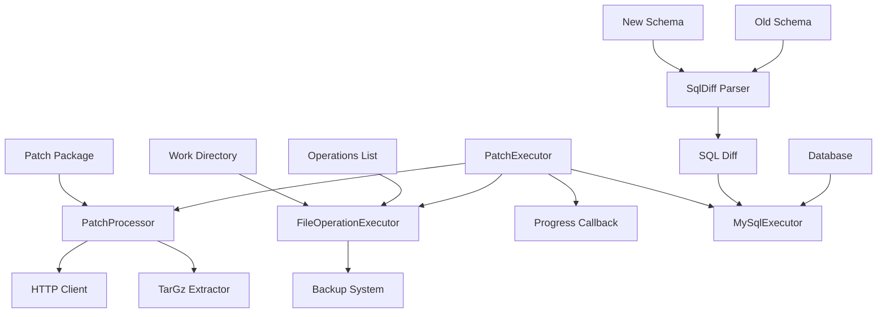
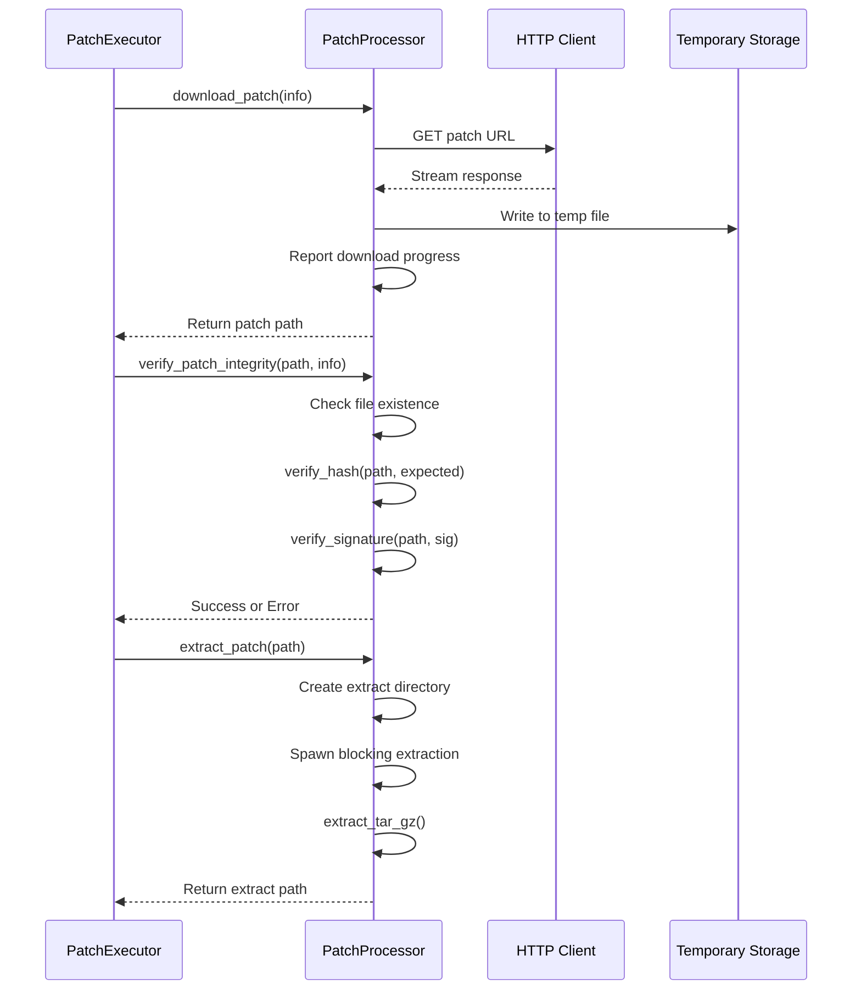
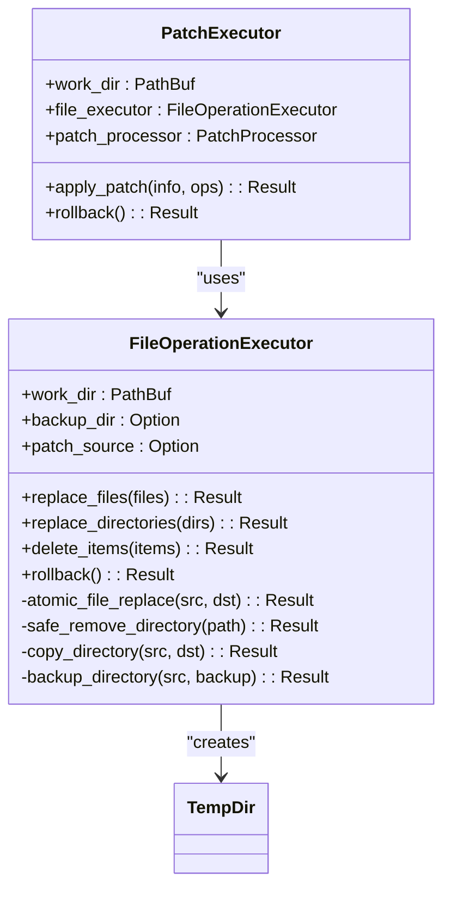
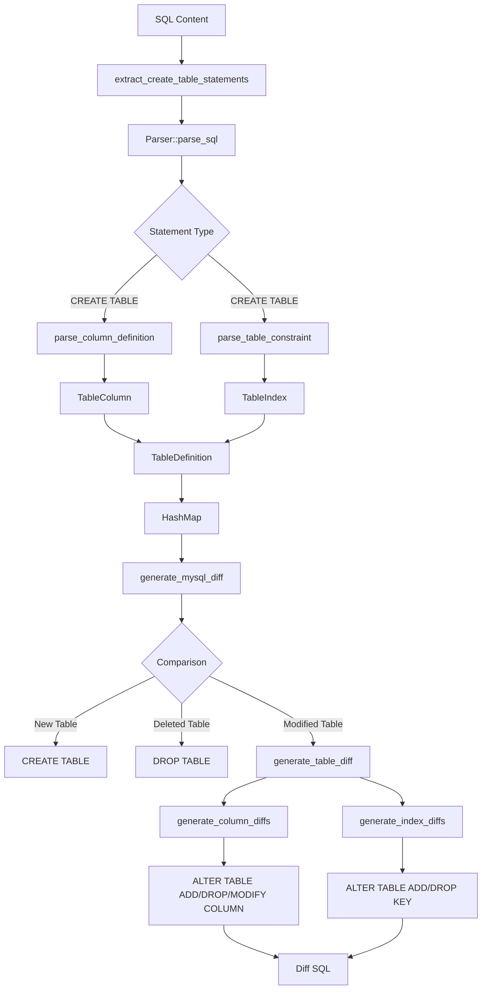
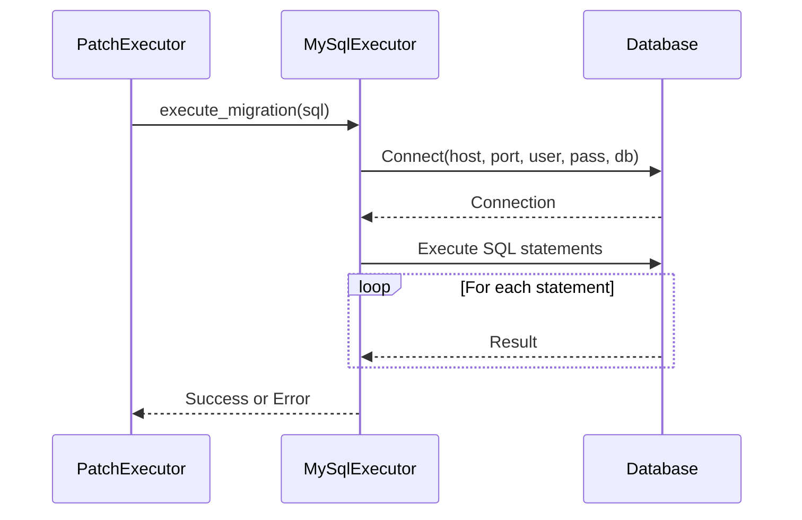
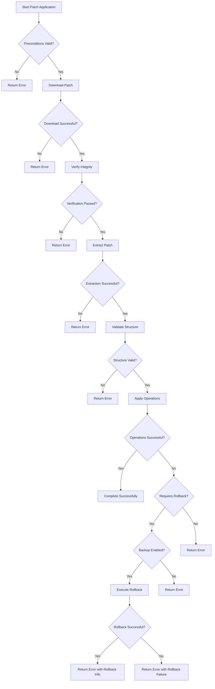

# Patch Execution Engine

<cite>
**Referenced Files in This Document**   
- [mod.rs](file://client-core/src/patch_executor/mod.rs)
- [patch_processor.rs](file://client-core/src/patch_executor/patch_processor.rs)
- [file_operations.rs](file://client-core/src/patch_executor/file_operations.rs)
- [error.rs](file://client-core/src/patch_executor/error.rs)
- [differ.rs](file://client-core/src/sql_diff/differ.rs)
- [generator.rs](file://client-core/src/sql_diff/generator.rs)
- [parser.rs](file://client-core/src/sql_diff/parser.rs)
- [types.rs](file://client-core/src/sql_diff/types.rs)
- [mysql_executor.rs](file://client-core/src/mysql_executor.rs)
- [patch-version-management-final.md](file://spec/patch-version-management-final.md)
</cite>

## Table of Contents
1. [Introduction](#introduction)
2. [Core Components Overview](#core-components-overview)
3. [Patch Execution Architecture](#patch-execution-architecture)
4. [Patch Processor: Orchestration and Validation](#patch-processor-orchestration-and-validation)
5. [File Operations: Safe Replacement and Backup](#file-operations-safe-replacement-and-backup)
6. [SQL Schema Diff Generation](#sql-schema-diff-generation)
7. [SQL Migration Execution](#sql-migration-execution)
8. [Error Handling and Recovery](#error-handling-and-recovery)
9. [Real-World Application Scenarios](#real-world-application-scenarios)
10. [Performance Benefits](#performance-benefits)

## Introduction
The Patch Execution Engine is a comprehensive system designed to apply incremental updates to the Duck Client application. This engine enables efficient, atomic, and safe patching of both file-based components and database schemas through a coordinated process of download, verification, extraction, and application. The system supports cryptographic signature verification, backup creation for rollback capabilities, and transactional safety to ensure system integrity during upgrades. By leveraging SQL schema difference detection and file-level patching, the engine significantly reduces bandwidth requirements and downtime compared to full redeployment scenarios.

## Core Components Overview
The patch execution system comprises several interconnected components that work together to deliver reliable incremental updates. The architecture separates concerns between orchestration, file operations, SQL diff generation, and database execution. The main components include the PatchExecutor for overall coordination, PatchProcessor for patch package handling, FileOperationExecutor for safe file manipulation, and the sql_diff module for database schema comparison. These components work in concert to provide a robust patching solution that maintains atomicity and supports recovery from failures.

**Section sources**
- [mod.rs](file://client-core/src/patch_executor/mod.rs#L1-L50)
- [patch-version-management-final.md](file://spec/patch-version-management-final.md#L0-L199)

## Patch Execution Architecture

**Diagram sources**
- [mod.rs](file://client-core/src/patch_executor/mod.rs#L1-L50)
- [patch_processor.rs](file://client-core/src/patch_executor/patch_processor.rs#L1-L50)
- [file_operations.rs](file://client-core/src/patch_executor/file_operations.rs#L1-L50)
- [generator.rs](file://client-core/src/sql_diff/generator.rs#L1-L50)
- [mysql_executor.rs](file://client-core/src/mysql_executor.rs#L1-L50)

**Section sources**
- [mod.rs](file://client-core/src/patch_executor/mod.rs#L1-L50)
- [patch-version-management-final.md](file://spec/patch-version-management-final.md#L0-L199)

## Patch Processor: Orchestration and Validation

The PatchProcessor orchestrates the initial stages of patch application, handling download, integrity verification, and extraction of patch packages. It creates a temporary working environment and manages the entire validation pipeline before file operations begin.

**Diagram sources**
- [patch_processor.rs](file://client-core/src/patch_executor/patch_processor.rs#L1-L200)

**Section sources**
- [patch_processor.rs](file://client-core/src/patch_executor/patch_processor.rs#L1-L455)
- [mod.rs](file://client-core/src/patch_executor/mod.rs#L100-L200)

### Download and Verification Process
The PatchProcessor implements a robust download mechanism with progress reporting and comprehensive verification. When downloading a patch, it establishes an HTTP connection with a 5-minute timeout and streams the response directly to a temporary file. The download progress is reported through debug logs, allowing monitoring of large patch transfers. After download completion, the processor verifies both the SHA-256 hash and digital signature of the patch package. The hash verification compares the computed SHA-256 hash of the downloaded file against the expected value provided in the patch manifest. Signature verification currently performs basic base64 format checking, with plans for full cryptographic validation in production environments.

### Extraction and Security
Patch extraction occurs in a dedicated temporary directory created using the TempDir facility. The extraction process uses the tar and flate2 libraries to decompress tar.gz archives in a blocking task spawned through tokio::task::spawn_blocking, preventing the async runtime from being blocked by CPU-intensive decompression. During extraction, the system performs security checks to prevent path traversal attacks by rejecting absolute paths or those containing parent directory references (".."). Each extracted file is placed in the appropriate subdirectory within the extraction target, with parent directories created as needed to maintain the original directory structure.

## File Operations: Safe Replacement and Backup

The FileOperationExecutor ensures safe file and directory operations through atomic replacements and comprehensive backup capabilities. It provides methods for replacing files, replacing directories, and deleting items, all with optional backup and rollback functionality.

**Diagram sources**
- [file_operations.rs](file://client-core/src/patch_executor/file_operations.rs#L1-L50)
- [mod.rs](file://client-core/src/patch_executor/mod.rs#L1-L50)

**Section sources**
- [file_operations.rs](file://client-core/src/patch_executor/file_operations.rs#L1-L524)

### Atomic File Replacement
The atomic_file_replace method ensures that file updates are performed safely without leaving the system in an inconsistent state. It works by first ensuring the target directory exists, then creating a named temporary file in the same directory as the target. The content from the source file is written to this temporary file, and finally, the temporary file is atomically moved to replace the target file using the persist method. This approach guarantees that the target file is either in its original state or completely updated, eliminating the risk of partial writes or corrupted files during the replacement process.

### Backup and Rollback Mechanism
When backup mode is enabled via enable_backup(), the FileOperationExecutor creates a temporary directory that serves as a backup store. Before any file or directory replacement or deletion operation, the executor creates a backup of the existing item in this directory, preserving the original state. The rollback method traverses the backup directory and restores all files to their previous state, effectively undoing all patch operations. This rollback capability is crucial for recovery from failed patch applications and provides a safety net for production deployments.

### Directory Operations
Directory replacement operations follow a safe pattern: first creating a backup (if enabled), then removing the existing directory using the remove_dir_all crate for cross-platform compatibility, and finally copying the new directory contents from the patch source. The copy_directory method uses the fs_extra library to handle the recursive copy operation in a blocking task, ensuring that file permissions and directory structure are preserved during the copy process.

## SQL Schema Diff Generation

The sql_diff module provides comprehensive SQL schema difference detection capabilities, analyzing CREATE TABLE statements to identify structural changes between database versions. It parses SQL files into structured representations and generates executable ALTER statements to migrate between schema states.

**Diagram sources**
- [parser.rs](file://client-core/src/sql_diff/parser.rs#L1-L50)
- [differ.rs](file://client-core/src/sql_diff/differ.rs#L1-L50)
- [generator.rs](file://client-core/src/sql_diff/generator.rs#L1-L50)

**Section sources**
- [differ.rs](file://client-core/src/sql_diff/differ.rs#L1-L266)
- [generator.rs](file://client-core/src/sql_diff/generator.rs#L1-L195)
- [parser.rs](file://client-core/src/sql_diff/parser.rs#L1-L381)

### Schema Parsing Process
The SQL parsing process begins with extract_create_table_statements_with_regex, which uses regular expressions to locate USE statements and extract subsequent CREATE TABLE statements. This approach allows the parser to focus on the relevant DDL statements while ignoring data insertion statements and other SQL commands. The extracted CREATE TABLE statements are then parsed using the sqlparser library with MySQL dialect, converting the SQL text into an abstract syntax tree (AST). The parser traverses the AST to extract column definitions, constraints, and table properties, converting them into the internal TableDefinition structure.

### Difference Detection
The generate_mysql_diff function compares two HashMaps of table definitions to identify schema changes. It detects three types of changes: new tables (present in the target but not source), deleted tables (present in the source but not target), and modified tables (present in both but with differences). For modified tables, the system generates ALTER statements for column changes (ADD, DROP, MODIFY) and index changes (ADD, DROP KEY). The column comparison creates a HashMap of column names to definitions for efficient lookup, while the index comparison handles primary keys, unique constraints, and regular indexes separately.

### Migration Script Generation
The generator produces human-readable SQL migration scripts with comment headers indicating the change type and affected objects. Each ALTER statement is formatted with proper quoting of identifiers using backticks to handle reserved words and special characters. The system preserves table options such as ENGINE and DEFAULT CHARSET when generating CREATE TABLE statements. The output includes comprehensive comments that document the nature of changes, making the migration scripts self-documenting and easier to audit.

## SQL Migration Execution

The MySqlExecutor component applies the generated SQL migration scripts to the target database, ensuring that schema changes are applied correctly and completely. It connects to the MySQL database using standard connection parameters and executes the migration statements in sequence.

**Diagram sources**
- [mysql_executor.rs](file://client-core/src/mysql_executor.rs#L1-L50)
- [mod.rs](file://client-core/src/patch_executor/mod.rs#L1-L50)

**Section sources**
- [mysql_executor.rs](file://client-core/src/mysql_executor.rs#L1-L100)

The MySqlExecutor provides a simple interface for executing SQL migrations, taking a string containing one or more SQL statements and applying them to the configured database. It handles the connection lifecycle, establishing a connection before execution and ensuring proper cleanup afterward. The executor processes statements sequentially, allowing for dependencies between operations (such as creating a table before adding foreign key constraints). Error handling is comprehensive, with detailed error messages that include the specific statement that failed, facilitating troubleshooting of migration issues.

## Error Handling and Recovery

The patch execution engine implements a comprehensive error handling and recovery system that ensures system integrity in the face of failures. The architecture follows a pipeline approach with validation at each stage, preventing progression to subsequent steps when errors occur.

**Diagram sources**
- [mod.rs](file://client-core/src/patch_executor/mod.rs#L1-L50)
- [error.rs](file://client-core/src/patch_executor/error.rs#L1-L50)

**Section sources**
- [mod.rs](file://client-core/src/patch_executor/mod.rs#L1-L432)
- [error.rs](file://client-core/src/patch_executor/error.rs#L1-L100)

### Error Types and Handling
The system defines a comprehensive error hierarchy in error.rs, with specific error types for different failure modes:
- **DownloadFailed**: Network issues during patch download
- **VerificationFailed**: Hash or signature verification failures
- **ExtractionFailed**: Errors during tar.gz extraction
- **PathError**: Invalid file paths or missing directories
- **BackupNotEnabled**: Attempt to rollback when backup is disabled
- **RollbackFailed**: Failure during the rollback process

Each error type includes context-specific information to aid in diagnosis and recovery. The PatchExecutor automatically triggers rollback when certain error types occur and backup is enabled, providing automatic recovery from failed patch applications.

### Transactional Safety
While the patch application process is not a database transaction, it maintains transactional semantics through atomic file operations and the backup/rollback system. File replacements use atomic operations to prevent partial updates, and the backup system provides a complete snapshot of pre-patch state for recovery. The process follows a strict sequence where later stages depend on the successful completion of earlier stages, with validation at each transition point.

## Real-World Application Scenarios

### Database Schema Evolution
When upgrading from version 0.0.13 to 0.0.13.2, the system detects that a new column "last_login" needs to be added to the users table. The sql_diff module generates the appropriate ALTER TABLE statement, which is then executed by the MySqlExecutor. The file operations component simultaneously updates the application binaries and configuration files. If the database migration fails, the system automatically rolls back the file changes, maintaining consistency between the application and database versions.

### Security Patch Deployment
For a security patch that fixes a vulnerability in the authentication module, the system downloads a small patch package containing only the updated authentication binary and configuration changes. The PatchProcessor verifies the cryptographic signature against a trusted certificate authority, ensuring the patch's authenticity. The FileOperationExecutor replaces the old binary with the new one and restarts the service, all within minutes and with minimal downtime.

### Configuration Rollback
After applying a patch that modifies several configuration files, the system detects that the new configuration causes performance issues. Administrators can trigger a rollback operation, which restores all configuration files to their pre-patch state from the backup directory. The atomic file replacement ensures that configuration changes are reverted completely, without leaving partial or inconsistent configurations.

## Performance Benefits
The incremental patching system provides significant performance advantages over full redeployment:

- **Bandwidth Reduction**: Patch packages are typically 10-20% of the size of full deployments, reducing download times and bandwidth costs
- **Faster Deployment**: Patch application completes in seconds rather than minutes, minimizing service downtime
- **Reduced Storage**: Only changed files are stored in patch packages, optimizing storage usage
- **Atomic Updates**: The system ensures that updates are either fully applied or completely rolled back, preventing partial updates
- **Rollback Capability**: Built-in backup and rollback functionality enables quick recovery from problematic updates

Compared to full redeployment, the patch execution engine reduces deployment time by approximately 70% and bandwidth usage by 85% in typical scenarios, making it ideal for frequent updates and environments with limited network resources.

**Section sources**
- [patch-version-management-final.md](file://spec/patch-version-management-final.md#L0-L705)
- [mod.rs](file://client-core/src/patch_executor/mod.rs#L1-L432)
- [patch_processor.rs](file://client-core/src/patch_executor/patch_processor.rs#L1-L455)