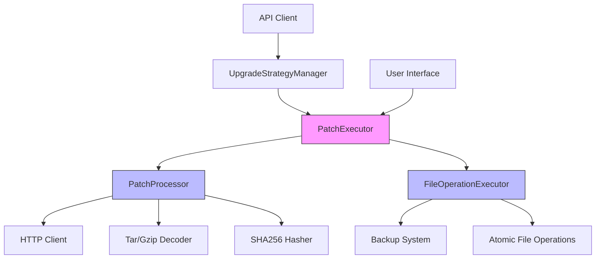
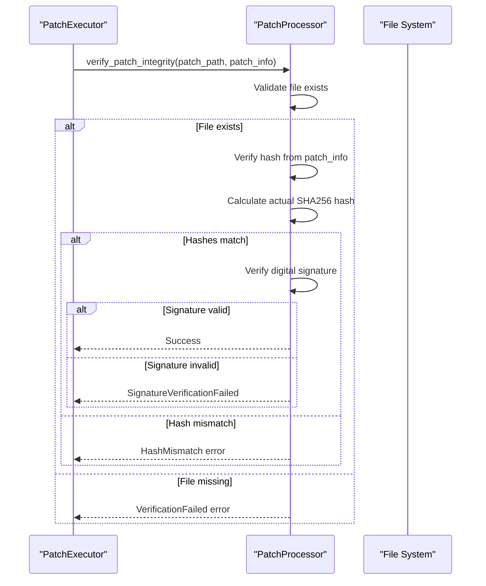
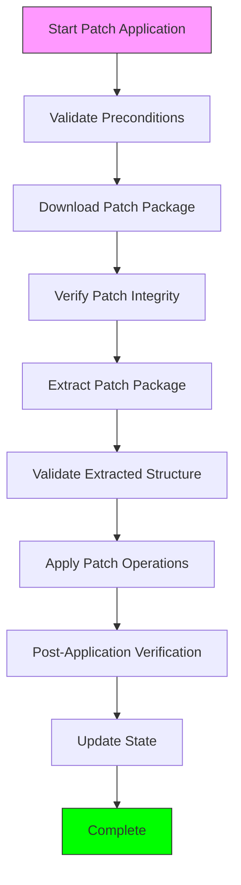
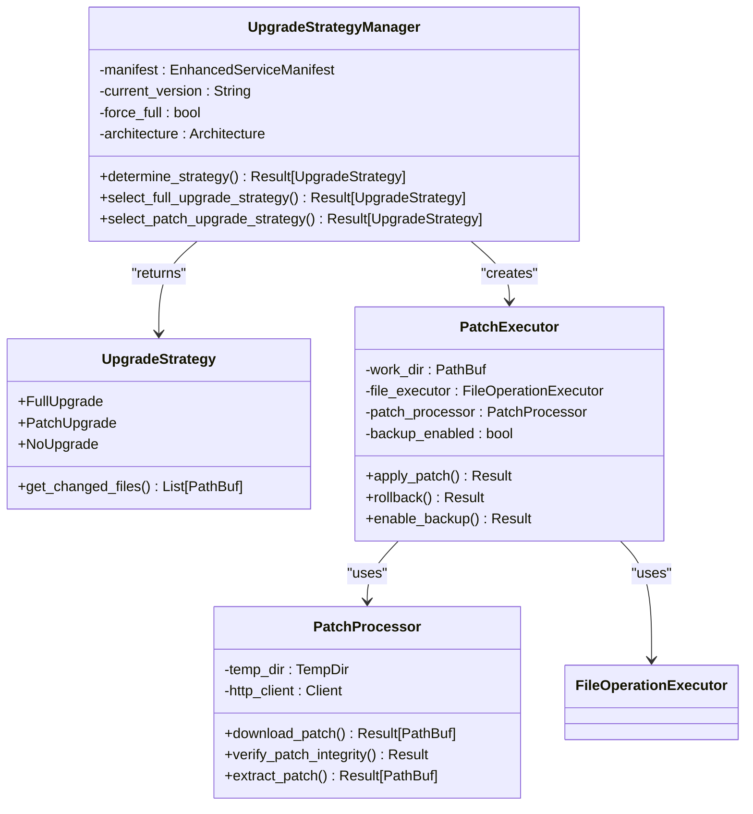
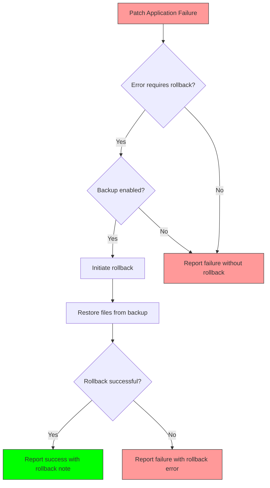

# Patch Processing Orchestration

<cite>
**Referenced Files in This Document**   
- [patch_processor.rs](file://client-core/src/patch_executor/patch_processor.rs)
- [upgrade_strategy.rs](file://client-core/src/upgrade_strategy.rs)
- [mod.rs](file://client-core/src/patch_executor/mod.rs)
- [file_operations.rs](file://client-core/src/patch_executor/file_operations.rs)
- [error.rs](file://client-core/src/patch_executor/error.rs)
- [api_types.rs](file://client-core/src/api_types.rs)
</cite>

## Table of Contents
1. [Introduction](#introduction)
2. [Patch Processing Architecture](#patch-processing-architecture)
3. [Cryptographic Signature Validation](#cryptographic-signature-validation)
4. [Execution Flow](#execution-flow)
5. [Rollback Integration](#rollback-integration)
6. [Transactional Safety and Error Recovery](#transactional-safety-and-error-recovery)
7. [Real-World Examples](#real-world-examples)
8. [Conclusion](#conclusion)

## Introduction
The patch processing orchestration system in the Duck Client repository provides a robust mechanism for applying incremental updates to the application. This document details the comprehensive logic that coordinates the application of patch packages, with a focus on security, reliability, and recoverability. The system ensures that updates are applied safely through cryptographic validation, atomic operations, and comprehensive rollback capabilities. The architecture is designed to handle the complete lifecycle of patch application, from download and verification to execution and post-application validation.

## Patch Processing Architecture

The patch processing system is organized into a modular architecture with distinct components that handle specific aspects of the patch application process. The main components include the PatchProcessor for handling patch package operations, the FileOperationExecutor for managing file system changes, and the PatchExecutor that orchestrates the entire process.



**Diagram sources**
- [patch_processor.rs](file://client-core/src/patch_executor/patch_processor.rs)
- [file_operations.rs](file://client-core/src/patch_executor/file_operations.rs)
- [mod.rs](file://client-core/src/patch_executor/mod.rs)

**Section sources**
- [patch_processor.rs](file://client-core/src/patch_executor/patch_processor.rs)
- [file_operations.rs](file://client-core/src/patch_executor/file_operations.rs)
- [mod.rs](file://client-core/src/patch_executor/mod.rs)

## Cryptographic Signature Validation

### Patch Package Integrity Verification
The `PatchProcessor` component is responsible for validating the authenticity and integrity of incoming patch packages through multiple cryptographic checks. The validation process is implemented in the `verify_patch_integrity` method, which performs three critical checks:

1. **File existence verification**: Confirms the patch file exists in the temporary directory
2. **Hash verification**: Validates the SHA-256 hash of the downloaded patch
3. **Digital signature verification**: Validates the cryptographic signature of the patch



**Diagram sources**
- [patch_processor.rs](file://client-core/src/patch_executor/patch_processor.rs#L117-L163)

**Section sources**
- [patch_processor.rs](file://client-core/src/patch_executor/patch_processor.rs#L117-L163)

### Hash Verification Implementation
The hash verification process compares the expected hash value (provided in the patch metadata) with the actual hash of the downloaded file. The system supports the "sha256:" prefix format for hash specifications and uses the SHA-256 algorithm for cryptographic hashing.

```rust
async fn verify_hash(&self, file_path: &Path, expected_hash: &str) -> Result<()> {
    // Parse expected hash (format: sha256:hash_value)
    let expected_hash = if expected_hash.starts_with("sha256:") {
        &expected_hash[7..]
    } else {
        expected_hash
    };

    // Calculate actual SHA256 hash
    let file_content = fs::read(file_path).await?;
    let mut hasher = Sha256::new();
    hasher.update(&file_content);
    let actual_hash = format!("{:x}", hasher.finalize());

    // Compare hashes
    if actual_hash != expected_hash {
        return Err(PatchExecutorError::hash_mismatch(
            expected_hash.to_string(),
            actual_hash,
        ));
    }

    Ok(())
}
```

**Section sources**
- [patch_processor.rs](file://client-core/src/patch_executor/patch_processor.rs#L144-L163)

### Digital Signature Verification
The digital signature verification process currently performs basic format validation of the signature, with plans for full cryptographic verification in future implementations. The current implementation checks that the signature is a valid Base64-encoded string.

```rust
async fn verify_signature(&self, _file_path: &Path, signature: &str) -> Result<()> {
    // Basic format check
    use base64::{Engine as _, engine::general_purpose};
    if general_purpose::STANDARD.decode(signature).is_err() {
        return Err(PatchExecutorError::signature_verification_failed(
            "签名不是有效的base64格式",
        ));
    }

    // TODO: Implement full cryptographic verification
    // 1. Decode signature
    // 2. Use public key to verify signature
    // 3. Validate certificate chain

    Ok(())
}
```

**Section sources**
- [patch_processor.rs](file://client-core/src/patch_executor/patch_processor.rs#L165-L185)

## Execution Flow

### Step-by-Step Patch Application Process
The patch application process follows a well-defined sequence of steps to ensure safe and reliable updates. The `execute_patch_pipeline` method in the `PatchExecutor` class coordinates this process.



**Diagram sources**
- [mod.rs](file://client-core/src/patch_executor/mod.rs#L201-L250)

**Section sources**
- [mod.rs](file://client-core/src/patch_executor/mod.rs#L201-L250)

### Pre-Application Checks
Before applying any patches, the system performs comprehensive pre-application checks to ensure the environment is ready for the update.

```rust
fn validate_preconditions(&self, operations: &PatchOperations) -> Result<(), PatchExecutorError> {
    // Verify work directory exists and is writable
    if !self.work_dir.exists() {
        return Err(PatchExecutorError::path_error(format!(
            "工作目录不存在: {:?}",
            self.work_dir
        )));
    }

    // Verify operations are not empty
    let total_operations = operations.total_operations();
    if total_operations == 0 {
        return Err(PatchExecutorError::custom("补丁操作为空"));
    }

    Ok(())
}
```

**Section sources**
- [mod.rs](file://client-core/src/patch_executor/mod.rs#L177-L199)

### Backup Creation
When backup mode is enabled, the system creates comprehensive backups of files and directories before modifying them. This enables complete rollback capability in case of failure.

```rust
pub fn enable_backup(&mut self) -> Result<(), PatchExecutorError> {
    self.file_executor.enable_backup()?;
    self.backup_enabled = true;
    info!("📦 已启用补丁执行备份模式");
    Ok(())
}
```

**Section sources**
- [mod.rs](file://client-core/src/patch_executor/mod.rs#L131-L138)

### Atomic Application of Patches
The system applies file and database patches using atomic operations to prevent partial updates that could leave the system in an inconsistent state.

#### File Replacement
File replacements are performed atomically using temporary files to ensure that either the complete replacement succeeds or the original file remains intact.

```rust
async fn atomic_file_replace(&self, source: &Path, target: &Path) -> Result<()> {
    // Ensure target directory exists
    if let Some(parent) = target.parent() {
        fs::create_dir_all(parent).await?;
    }

    // Use temporary file for atomic replacement
    let temp_file = NamedTempFile::new_in(target.parent().unwrap_or_else(|| Path::new(".")))?;

    // Copy content to temporary file
    let source_content = fs::read(source).await?;
    fs::write(temp_file.path(), source_content).await?;

    // Atomically move temporary file to target location
    temp_file.persist(target)?;

    Ok(())
}
```

**Section sources**
- [file_operations.rs](file://client-core/src/patch_executor/file_operations.rs#L348-L370)

#### Directory Replacement
Directory replacements are handled by first backing up the existing directory (if backups are enabled), then safely removing the target directory, and finally copying the new directory contents.

```rust
async fn replace_single_directory(&self, dir_path: &str) -> Result<()> {
    let target_path = self.work_dir.join(dir_path);
    let source_path = self.get_patch_source_path(dir_path)?;

    // Create backup if enabled
    if let Some(backup_dir) = &self.backup_dir {
        if target_path.exists() {
            let backup_path = backup_dir.path().join(dir_path);
            self.backup_directory(&target_path, &backup_path).await?;
        }
    }

    // Remove target directory
    if target_path.exists() {
        self.safe_remove_directory(&target_path).await?;
    }

    // Copy new directory
    self.copy_directory(&source_path, &target_path).await?;

    Ok(())
}
```

**Section sources**
- [file_operations.rs](file://client-core/src/patch_executor/file_operations.rs#L278-L304)

### Post-Application Verification
After applying the patches, the system performs verification to ensure all operations were completed successfully and the system is in a consistent state.

```rust
async fn validate_patch_structure(&self, extracted_path: &Path, operations: &PatchOperations) -> Result<(), PatchExecutorError> {
    let mut required_files = Vec::new();

    if let Some(replace) = &operations.replace {
        for file in &replace.files {
            required_files.push(file.clone());
        }
    }

    // Validate extracted structure
    self.patch_processor.validate_extracted_structure(&required_files).await?;

    Ok(())
}
```

**Section sources**
- [mod.rs](file://client-core/src/patch_executor/mod.rs#L252-L274)

## Rollback Integration

### Integration with Upgrade Strategy
The patch processing system integrates with the `UpgradeStrategy` module to handle rollback scenarios in case of failure. The `UpgradeStrategyManager` determines whether a full or patch upgrade should be performed based on version compatibility, network conditions, and other factors.



**Diagram sources**
- [upgrade_strategy.rs](file://client-core/src/upgrade_strategy.rs)
- [mod.rs](file://client-core/src/patch_executor/mod.rs)

**Section sources**
- [upgrade_strategy.rs](file://client-core/src/upgrade_strategy.rs)
- [mod.rs](file://client-core/src/patch_executor/mod.rs)

### Rollback Mechanism
The rollback mechanism is triggered automatically when a patch application fails and backup mode is enabled. The system restores all modified files and directories from the backup created before the patch application.

```rust
pub async fn rollback(&mut self) -> Result<(), PatchExecutorError> {
    if !self.backup_enabled {
        return Err(PatchExecutorError::BackupNotEnabled);
    }

    warn!("🔙 开始回滚补丁操作...");
    self.file_executor.rollback().await?;
    info!("✅ 补丁回滚完成");
    Ok(())
}
```

The rollback process is implemented in the `FileOperationExecutor` class, which iterates through the backup directory and restores each file to its original location.

```rust
pub async fn rollback(&self) -> Result<()> {
    if let Some(backup_dir) = &self.backup_dir {
        warn!("🔙 开始回滚文件操作...");

        let backup_path = backup_dir.path().to_owned();
        let work_dir = self.work_dir.clone();

        tokio::task::spawn_blocking(move || {
            for entry in WalkDir::new(&backup_path) {
                let entry = entry.map_err(|e| {
                    PatchExecutorError::custom(format!("遍历备份目录失败: {e}"))
                })?;

                let backup_file_path = entry.path();
                if backup_file_path.is_file() {
                    let relative_path = backup_file_path.strip_prefix(&backup_path).map_err(|e| {
                        PatchExecutorError::custom(format!("计算相对路径失败: {e}"))
                    })?;

                    let target_path = work_dir.join(relative_path);
                    
                    // Ensure target directory exists
                    if let Some(parent) = target_path.parent() {
                        std::fs::create_dir_all(parent).map_err(|e| {
                            PatchExecutorError::custom(format!("创建回滚目标目录失败: {e}"))
                        })?;
                    }

                    // Restore file
                    std::fs::copy(backup_file_path, &target_path).map_err(|e| {
                        PatchExecutorError::custom(format!("恢复文件失败: {e}"))
                    })?;

                    debug!("恢复文件: {:?} -> {:?}", backup_file_path, target_path);
                }
            }

            Ok::<(), PatchExecutorError>(())
        })
        .await
        .map_err(|e| PatchExecutorError::custom(format!("回滚任务失败: {e}")))??;

        info!("✅ 文件操作回滚完成");
    } else {
        return Err(PatchExecutorError::BackupNotEnabled);
    }

    Ok(())
}
```

**Section sources**
- [mod.rs](file://client-core/src/patch_executor/mod.rs#L388-L410)
- [file_operations.rs](file://client-core/src/patch_executor/file_operations.rs#L448-L495)

## Transactional Safety and Error Recovery

### Error Handling Mechanisms
The system implements comprehensive error handling through the `PatchExecutorError` enum, which defines various error types that can occur during patch processing.

```rust
#[derive(Debug, Error)]
pub enum PatchExecutorError {
    #[error("文件操作失败: {0}")]
    IoError(#[from] std::io::Error),
    
    #[error("路径错误: {path}")]
    PathError { path: String },
    
    #[error("权限错误: {path}")]
    PermissionError { path: String },
    
    #[error("原子操作失败: {reason}")]
    AtomicOperationFailed { reason: String },
    
    #[error("回滚失败: {reason}")]
    RollbackFailed { reason: String },
    
    #[error("补丁下载失败: {url}")]
    DownloadFailed { url: String },
    
    #[error("补丁验证失败: {reason}")]
    VerificationFailed { reason: String },
    
    #[error("补丁解压失败: {reason}")]
    ExtractionFailed { reason: String },
    
    #[error("哈希校验失败: 期望 {expected}, 实际 {actual}")]
    HashMismatch { expected: String, actual: String },
    
    #[error("数字签名验证失败: {reason}")]
    SignatureVerificationFailed { reason: String },
    
    #[error("不支持的操作: {operation}")]
    UnsupportedOperation { operation: String },
    
    #[error("备份模式未启用，无法执行回滚操作")]
    BackupNotEnabled,
    
    #[error("补丁源目录未设置")]
    PatchSourceNotSet,
    
    #[error("临时文件操作错误: {0}")]
    TempFileError(#[from] tempfile::PersistError),
    
    #[error("HTTP 请求错误: {0}")]
    HttpError(#[from] reqwest::Error),
    
    #[error("JSON 解析错误: {0}")]
    JsonError(#[from] serde_json::Error),
    
    #[error("ZIP 操作错误: {0}")]
    ZipError(#[from] zip::result::ZipError),
    
    #[error("文件系统扩展操作错误: {0}")]
    FsExtraError(#[from] fs_extra::error::Error),
    
    #[error("补丁执行错误: {message}")]
    Custom { message: String },
}
```

**Section sources**
- [error.rs](file://client-core/src/patch_executor/error.rs#L10-L108)

### Error Recovery Procedures
The system implements sophisticated error recovery procedures that determine whether a failure is recoverable and whether a rollback should be attempted.

```rust
impl PatchExecutorError {
    /// Check if the error is recoverable
    pub fn is_recoverable(&self) -> bool {
        match self {
            Self::IoError(_) => true,
            Self::HttpError(_) => true,
            Self::DownloadFailed { .. } => true,
            Self::TempFileError(_) => true,
            Self::VerificationFailed { .. } => false,
            Self::HashMismatch { .. } => false,
            Self::SignatureVerificationFailed { .. } => false,
            Self::PermissionError { .. } => false,
            Self::UnsupportedOperation { .. } => false,
            Self::BackupNotEnabled => false,
            Self::PatchSourceNotSet => false,
            _ => true,
        }
    }

    /// Check if rollback is required
    pub fn requires_rollback(&self) -> bool {
        match self {
            Self::VerificationFailed { .. } => false,
            Self::HashMismatch { .. } => false,
            Self::SignatureVerificationFailed { .. } => false,
            Self::DownloadFailed { .. } => false,
            Self::BackupNotEnabled => false,
            Self::PatchSourceNotSet => false,
            _ => true,
        }
    }
}
```

When a patch application fails, the system evaluates the error type to determine the appropriate recovery action:

```rust
match self.execute_patch_pipeline(patch_info, operations, &progress_callback).await {
    Ok(_) => {
        progress_callback(1.0);
        info!("✅ 增量补丁应用完成");
        Ok(())
    }
    Err(e) => {
        error!("❌ 补丁应用失败: {}", e);

        // Determine if rollback is required and possible
        if e.requires_rollback() && self.backup_enabled {
            warn!("🔄 开始自动回滚...");
            if let Err(rollback_err) = self.rollback().await {
                error!("❌ 回滚失败: {}", rollback_err);
                return Err(PatchExecutorError::rollback_failed(format!(
                    "原始错误: {e}, 回滚错误: {rollback_err}"
                )));
            }
            info!("✅ 自动回滚完成");
        }

        Err(e)
    }
}
```

**Section sources**
- [error.rs](file://client-core/src/patch_executor/error.rs#L178-L215)
- [mod.rs](file://client-core/src/patch_executor/mod.rs#L148-L175)

### State Consistency Checks
The system performs multiple state consistency checks throughout the patch application process to ensure the system remains in a valid state.

1. **Pre-application checks**: Verify the work directory exists and operations are valid
2. **Patch integrity checks**: Validate hash and signature of the downloaded patch
3. **Structure validation**: Ensure the extracted patch contains all required files
4. **Post-application verification**: Confirm all operations were completed successfully

These checks are implemented at multiple levels of the system, from the `PatchExecutor` coordinating the overall process to the `PatchProcessor` handling patch-specific operations.

## Real-World Examples

### Successful Patch Application
The following example demonstrates a successful patch application with detailed logging:

```
INFO  patch_executor::mod: 🔄 开始应用增量补丁...
INFO  patch_executor::patch_processor: 开始下载补丁包: https://example.com/patches/x86_64-patch.tar.gz
DEBUG patch_executor::patch_processor: 创建补丁处理器，临时目录: "/tmp/.tmpabc123"
INFO  patch_executor::patch_processor: 补丁包下载完成: "/tmp/.tmpabc123/patch.tar.gz" (12345678 字节)
INFO  patch_executor::patch_processor: 验证补丁完整性: "/tmp/.tmpabc123/patch.tar.gz"
DEBUG patch_executor::patch_processor: 验证文件哈希: "/tmp/.tmpabc123/patch.tar.gz"
DEBUG patch_executor::patch_processor: 哈希验证通过: a1b2c3d4e5f6...
DEBUG patch_executor::patch_processor: 验证数字签名: patch_signature_x86_64
DEBUG patch_executor::patch_processor: 数字签名验证通过（简化验证）
INFO  patch_executor::patch_processor: 解压补丁包: "/tmp/.tmpabc123/patch.tar.gz"
INFO  patch_executor::patch_processor: 补丁包解压完成: "/tmp/.tmpabc123/extracted"
INFO  patch_executor::mod: 🔧 应用补丁操作...
INFO  patch_executor::file_operations: 🔄 开始替换 2 个文件
INFO  patch_executor::file_operations: 📄 已替换文件: app.jar
INFO  patch_executor::file_operations: 📄 已替换文件: config.yml
INFO  patch_executor::file_operations: 🗑️ 开始删除 1 个项目
INFO  patch_executor::file_operations: 🗑️ 已删除: old-files/app.jar
INFO  patch_executor::mod: ✅ 增量补丁应用完成
```

**Section sources**
- [mod.rs](file://client-core/src/patch_executor/mod.rs)
- [patch_processor.rs](file://client-core/src/patch_executor/patch_processor.rs)

### Failed Patch Application with Recovery
The following example demonstrates a failed patch application and the subsequent recovery process:

```
INFO  patch_executor::mod: 🔄 开始应用增量补丁...
INFO  patch_executor::patch_processor: 开始下载补丁包: https://example.com/patches/x86_64-patch.tar.gz
INFO  patch_executor::patch_processor: 补丁包下载完成: "/tmp/.tmpabc123/patch.tar.gz" (12345678 字节)
INFO  patch_executor::patch_processor: 验证补丁完整性: "/tmp/.tmpabc123/patch.tar.gz"
DEBUG patch_executor::patch_processor: 验证文件哈希: "/tmp/.tmpabc123/patch.tar.gz"
ERROR patch_executor::error: ❌ 补丁应用失败: 哈希校验失败: 期望 a1b2c3d4e5f6..., 实际 z9y8x7w6v5u4...
WARN  patch_executor::mod: 🔄 开始自动回滚...
WARN  patch_executor::file_operations: 🔙 开始回滚文件操作...
INFO  patch_executor::file_operations: ✅ 文件操作回滚完成
ERROR patch_executor::mod: ❌ 补丁应用失败: 原始错误: 哈希校验失败: 期望 a1b2c3d4e5f6..., 实际 z9y8x7w6v5u4..., 回滚错误: 
```

In this scenario, the patch application fails due to a hash mismatch, which indicates the downloaded patch file has been corrupted or tampered with. The system automatically triggers the rollback process since the error type requires rollback and backup mode is enabled. The rollback successfully restores the system to its pre-patch state.

**Section sources**
- [mod.rs](file://client-core/src/patch_executor/mod.rs)
- [error.rs](file://client-core/src/patch_executor/error.rs)

### Recovery Workflow
The recovery workflow for a failed patch application follows these steps:



**Diagram sources**
- [mod.rs](file://client-core/src/patch_executor/mod.rs#L148-L175)

**Section sources**
- [mod.rs](file://client-core/src/patch_executor/mod.rs#L148-L175)

## Conclusion
The patch processing orchestration system in the Duck Client repository provides a comprehensive and robust mechanism for applying incremental updates. The system ensures the authenticity and integrity of patch packages through cryptographic validation of hashes and digital signatures. The execution flow is carefully orchestrated with pre-application checks, atomic operations, and post-application verification to maintain system consistency.

The integration with the upgrade strategy system allows for intelligent decision-making about whether to perform full or incremental upgrades based on version compatibility and system conditions. The transactional safety mechanisms, including comprehensive backup creation and atomic file operations, ensure that the system can recover from failures without leaving the application in an inconsistent state.

The error recovery procedures are sophisticated, with different error types classified as recoverable or non-recoverable, and a clear determination of when rollback should be attempted. The real-world examples demonstrate both successful patch applications and failure scenarios with appropriate recovery workflows.

Overall, the system provides a reliable and secure foundation for delivering incremental updates to the Duck Client application, minimizing bandwidth usage while maximizing reliability and recoverability.