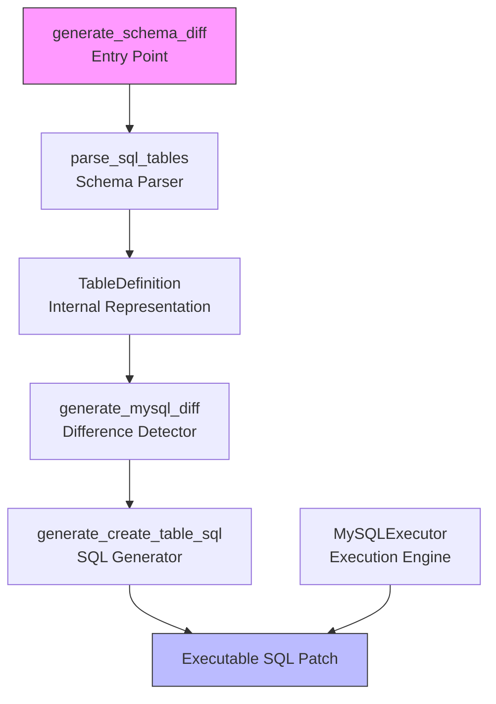
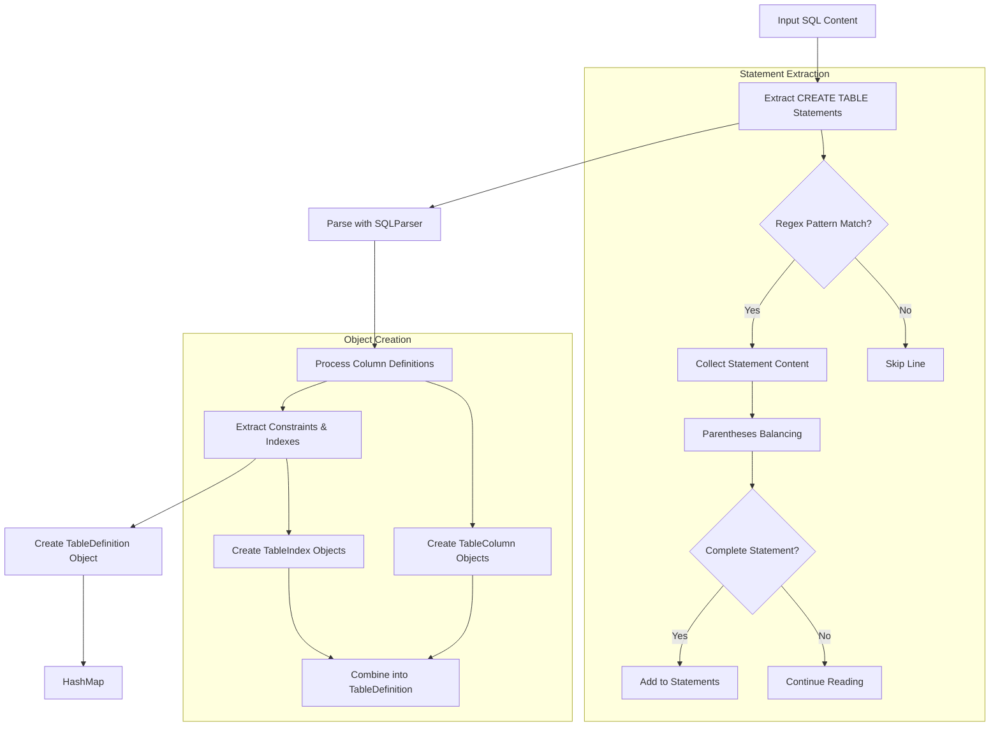
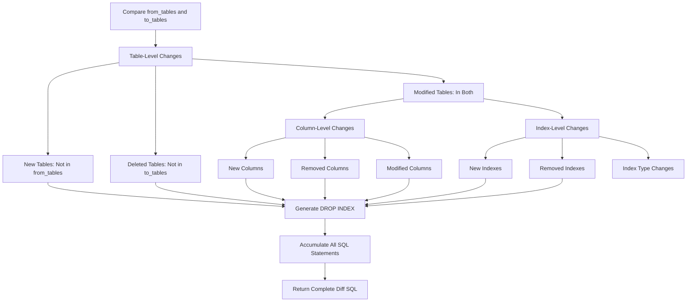
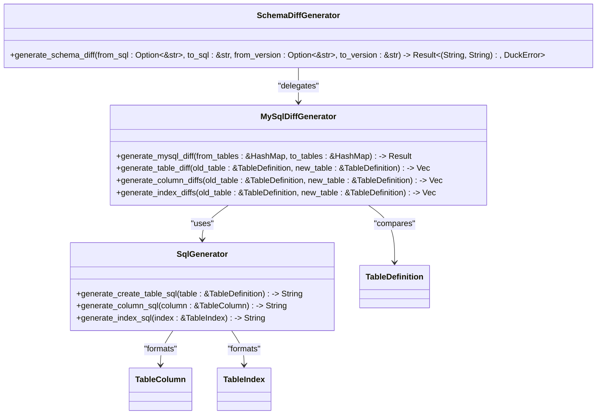
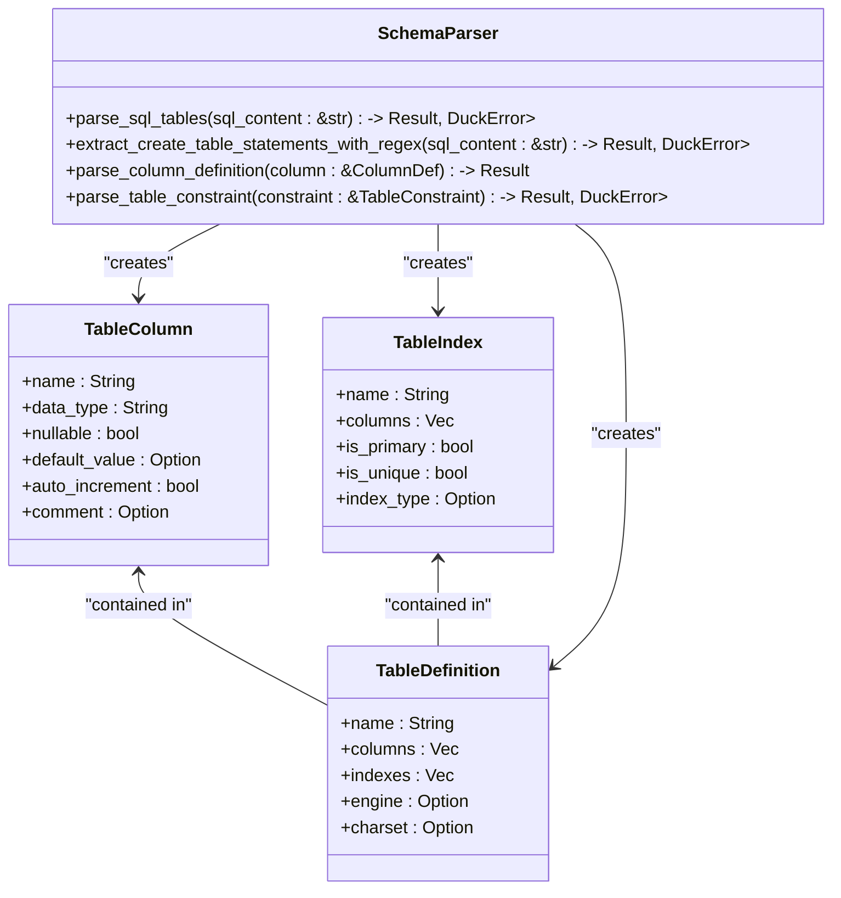
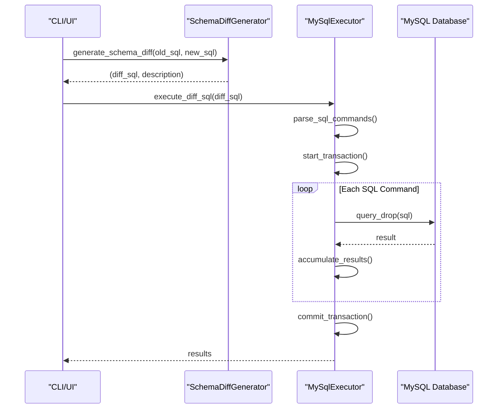
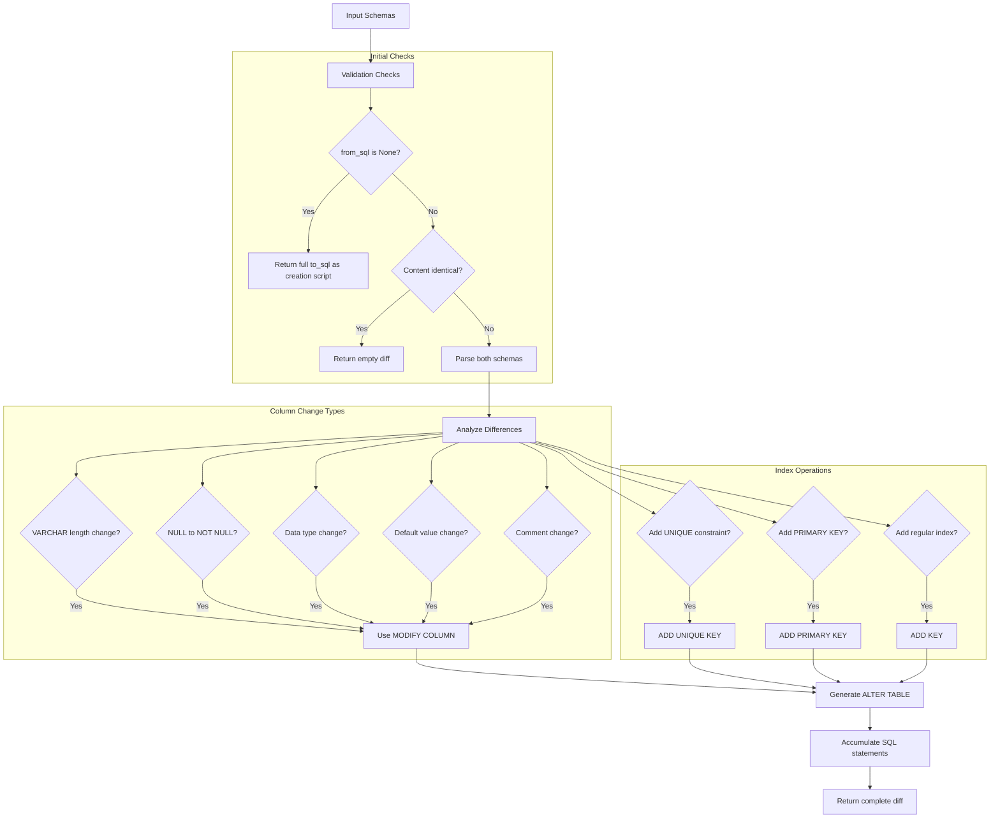
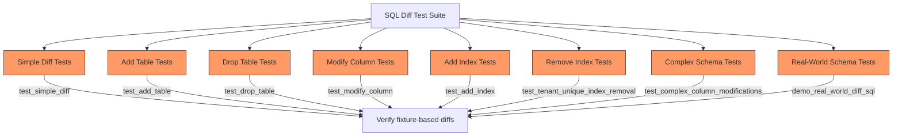
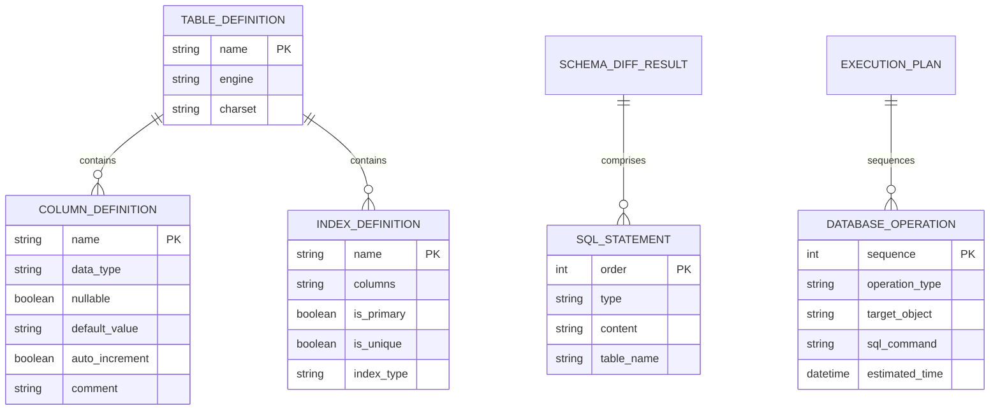

# SQL Diff Generation

<cite>
**Referenced Files in This Document**   
- [differ.rs](file://client-core/src/sql_diff/differ.rs)
- [generator.rs](file://client-core/src/sql_diff/generator.rs)
- [types.rs](file://client-core/src/sql_diff/types.rs)
- [parser.rs](file://client-core/src/sql_diff/parser.rs)
- [mod.rs](file://client-core/src/sql_diff/mod.rs)
- [tests.rs](file://client-core/src/sql_diff/tests.rs)
- [mysql_executor.rs](file://client-core/src/mysql_executor.rs)
- [old_init_mysql.sql](file://client-core/fixtures/old_init_mysql.sql)
- [new_init_mysql.sql](file://client-core/fixtures/new_init_mysql.sql)
- [diff_sql_tests.rs](file://client-core/tests/diff_sql_tests.rs)
</cite>

## Table of Contents
1. [Introduction](#introduction)
2. [Core Components Overview](#core-components-overview)
3. [Schema Parsing Mechanism](#schema-parsing-mechanism)
4. [Difference Detection Algorithm](#difference-detection-algorithm)
5. [SQL Generation Process](#sql-generation-process)
6. [Data Structure Representation](#data-structure-representation)
7. [Integration with Execution Pipeline](#integration-with-execution-pipeline)
8. [Edge Case Handling](#edge-case-handling)
9. [Validation and Testing](#validation-and-testing)
10. [Performance Characteristics](#performance-characteristics)

## Introduction
The SQL diff generation system is a core component of the database migration framework that detects and generates schema differences between two database states. This system analyzes SQL schema definitions and produces executable migration scripts that can be applied to evolve database structures safely and efficiently. The implementation focuses on MySQL compatibility and handles various structural changes including table additions, column modifications, index changes, and constraint updates. The system is designed to be robust, accurate, and safe for production use.

## Core Components Overview

The SQL diff generation system consists of several interconnected components that work together to analyze schema differences and generate migration scripts. The main components include the parser, differ, generator, and type definitions, each responsible for a specific aspect of the diff generation process.

**Diagram sources**
- [generator.rs](file://client-core/src/sql_diff/generator.rs#L8-L194)
- [parser.rs](file://client-core/src/sql_diff/parser.rs#L8-L381)
- [differ.rs](file://client-core/src/sql_diff/differ.rs#L8-L266)
- [types.rs](file://client-core/src/sql_diff/types.rs#L1-L31)

**Section sources**
- [mod.rs](file://client-core/src/sql_diff/mod.rs#L1-L11)
- [generator.rs](file://client-core/src/sql_diff/generator.rs#L8-L194)

## Schema Parsing Mechanism

The schema parsing mechanism extracts table definitions from raw SQL content by identifying CREATE TABLE statements and converting them into structured data objects. The parser uses a combination of regular expressions and SQL parsing libraries to accurately extract schema information while ignoring irrelevant statements.

**Diagram sources**
- [parser.rs](file://client-core/src/sql_diff/parser.rs#L8-L381)
- [types.rs](file://client-core/src/sql_diff/types.rs#L1-L31)

**Section sources**
- [parser.rs](file://client-core/src/sql_diff/parser.rs#L8-L381)

## Difference Detection Algorithm

The difference detection algorithm compares two sets of table definitions and identifies structural changes between them. The algorithm operates at multiple levels: table-level, column-level, and index-level differences, ensuring comprehensive coverage of all possible schema modifications.

**Diagram sources**
- [differ.rs](file://client-core/src/sql_diff/differ.rs#L8-L266)
- [generator.rs](file://client-core/src/sql_diff/generator.rs#L8-L194)

**Section sources**
- [differ.rs](file://client-core/src/sql_diff/differ.rs#L8-L266)

## SQL Generation Process

The SQL generation process transforms detected differences into executable MySQL statements that can be applied to migrate a database from one schema version to another. The process ensures that generated SQL is syntactically correct, properly ordered, and includes appropriate comments for traceability.

**Diagram sources**
- [generator.rs](file://client-core/src/sql_diff/generator.rs#L8-L194)
- [differ.rs](file://client-core/src/sql_diff/differ.rs#L8-L266)
- [types.rs](file://client-core/src/sql_diff/types.rs#L1-L31)

**Section sources**
- [generator.rs](file://client-core/src/sql_diff/generator.rs#L8-L194)

## Data Structure Representation

The system uses a set of Rust structs to represent database schema elements in memory. These data structures provide a type-safe and efficient way to work with schema information during the diff generation process.

**Diagram sources**
- [types.rs](file://client-core/src/sql_diff/types.rs#L1-L31)
- [parser.rs](file://client-core/src/sql_diff/parser.rs#L8-L381)

**Section sources**
- [types.rs](file://client-core/src/sql_diff/types.rs#L1-L31)

## Integration with Execution Pipeline

The generated SQL differences are integrated with the MySQL execution pipeline through the MySqlExecutor component, which handles the application of migration scripts to target databases. This integration ensures that generated patches can be safely and reliably applied.

**Diagram sources**
- [generator.rs](file://client-core/src/sql_diff/generator.rs#L8-L194)
- [mysql_executor.rs](file://client-core/src/mysql_executor.rs#L0-L379)

**Section sources**
- [mysql_executor.rs](file://client-core/src/mysql_executor.rs#L0-L379)

## Edge Case Handling

The system includes comprehensive handling of edge cases and special scenarios that commonly occur during schema evolution. These include handling of identical schemas, initial version creation, and various types of structural modifications.

**Section sources**
- [generator.rs](file://client-core/src/sql_diff/generator.rs#L8-L194)
- [differ.rs](file://client-core/src/sql_diff/differ.rs#L8-L266)
- [tests.rs](file://client-core/src/sql_diff/tests.rs#L0-L872)

## Validation and Testing

The system includes extensive testing to validate its correctness and reliability. Tests cover various scenarios including simple column additions, complex structural changes, and edge cases like comment modifications and constraint changes.

**Diagram sources**
- [tests.rs](file://client-core/src/sql_diff/tests.rs#L0-L872)
- [diff_sql_tests.rs](file://client-core/tests/diff_sql_tests.rs#L0-L298)

**Section sources**
- [tests.rs](file://client-core/src/sql_diff/tests.rs#L0-L872)

## Performance Characteristics

The SQL diff generation system is designed with performance considerations for handling large schemas efficiently. The implementation uses HashMap lookups for O(1) average-case complexity when comparing table and column definitions, and processes schemas in a single pass where possible.

**Section sources**
- [differ.rs](file://client-core/src/sql_diff/differ.rs#L8-L266)
- [parser.rs](file://client-core/src/sql_diff/parser.rs#L8-L381)