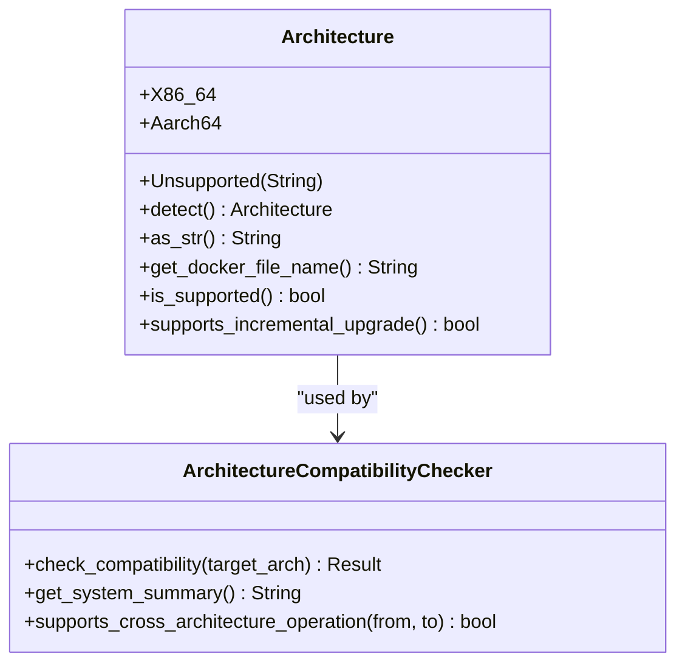
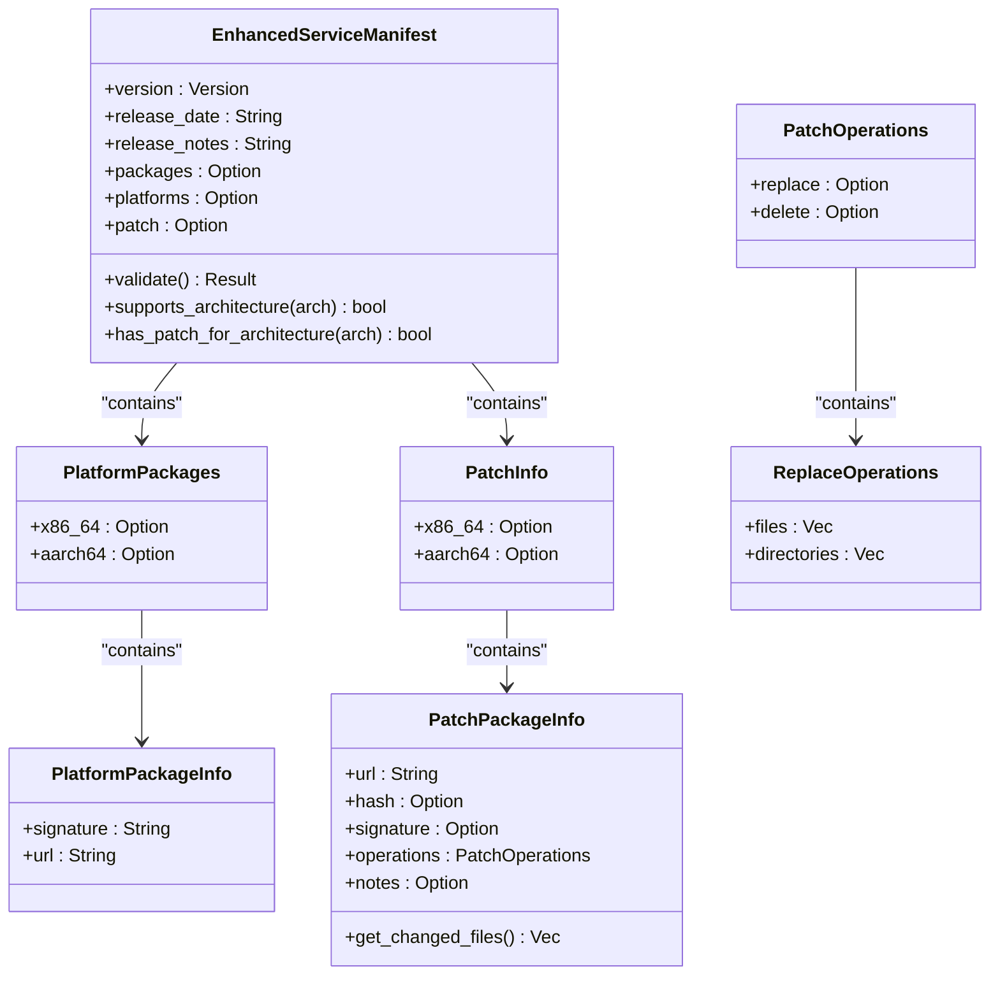
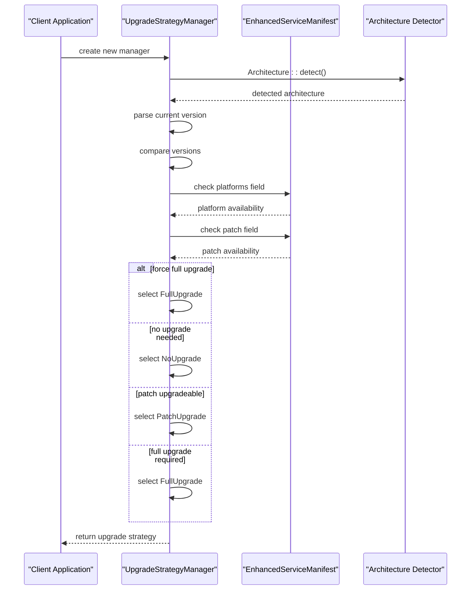
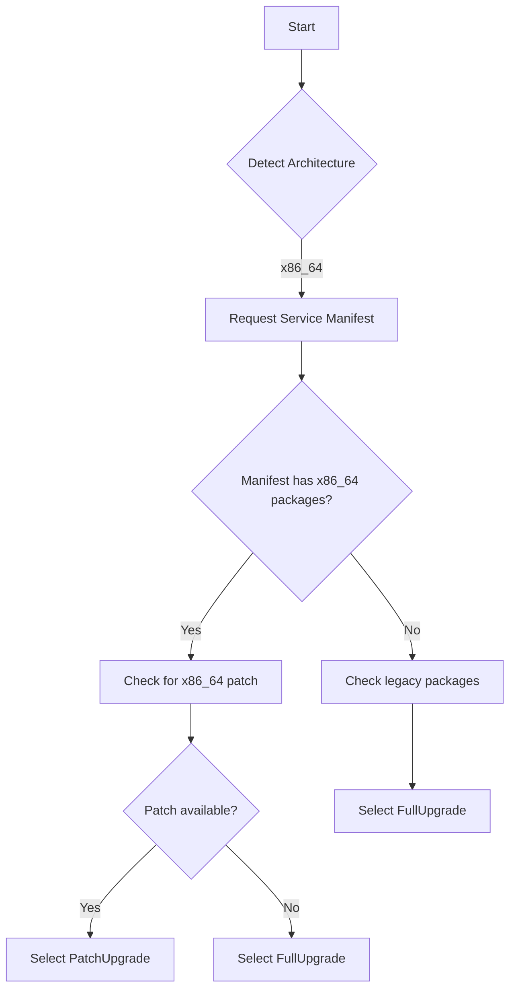

# Architecture-Aware Upgrades

<cite>
**Referenced Files in This Document**   
- [architecture.rs](file://client-core/src/architecture.rs)
- [api_types.rs](file://client-core/src/api_types.rs)
- [upgrade_strategy.rs](file://client-core/src/upgrade_strategy.rs)
</cite>

## Table of Contents
1. [Introduction](#introduction)
2. [Architecture Detection](#architecture-detection)
3. [Enhanced Service Manifest](#enhanced-service-manifest)
4. [Upgrade Strategy Selection](#upgrade-strategy-selection)
5. [Cross-Platform Deployment Scenarios](#cross-platform-deployment-scenarios)
6. [Fallback Behaviors](#fallback-behaviors)
7. [Binary Compatibility Validation](#binary-compatibility-validation)
8. [Testing Strategies](#testing-strategies)
9. [Emulation Considerations](#emulation-considerations)

## Introduction
This document provides a comprehensive analysis of the architecture-aware upgrade system in the Duck Client application. The system enables intelligent upgrade decisions based on host platform detection, platform-specific asset selection, and appropriate upgrade strategy selection. The architecture integrates runtime platform detection with service manifest parsing and upgrade decision logic to ensure compatibility and efficiency across different hardware platforms.

## Architecture Detection

The architecture detection system is implemented in the `architecture.rs` module and provides comprehensive platform detection capabilities. The system automatically detects the host platform at runtime and supports both x86_64 and aarch64 architectures.



**Diagram sources**
- [architecture.rs](file://client-core/src/architecture.rs#L15-L451)

**Section sources**
- [architecture.rs](file://client-core/src/architecture.rs#L15-L451)

The `Architecture` enum represents the supported system architectures with three variants:
- **X86_64**: Intel/AMD 64-bit architecture
- **Aarch64**: ARM 64-bit architecture
- **Unsupported**: For handling unknown architectures

The detection mechanism uses Rust's standard library constant `std::env::consts::ARCH` to determine the current system architecture. The `detect()` method automatically identifies the platform and returns the appropriate enum variant:

```rust
pub fn detect() -> Self {
    let arch_str = std::env::consts::ARCH;
    Self::from_str(arch_str).unwrap_or_else(|_| {
        warn!("Detected unknown architecture: {}", arch_str);
        Self::Unsupported(arch_str.to_string())
    })
}
```

The system supports multiple string representations for each architecture, providing flexibility in parsing:
- **x86_64**: Recognized as "x86_64", "amd64", or "x64"
- **aarch64**: Recognized as "aarch64", "arm64", or "armv8"

Additional utility methods provide architecture-specific information:
- `as_str()`: Returns the canonical string representation
- `get_docker_file_name()`: Generates the appropriate Docker package filename
- `is_supported()`: Checks if the architecture is officially supported
- `supports_incremental_upgrade()`: Determines if incremental upgrades are available

## Enhanced Service Manifest

The `EnhancedServiceManifest` structure in `api_types.rs` extends the traditional service manifest to support platform-specific assets and incremental upgrades. This data structure enables the system to deliver appropriate packages based on the client's architecture.



**Diagram sources**
- [api_types.rs](file://client-core/src/api_types.rs#L1-L902)

**Section sources**
- [api_types.rs](file://client-core/src/api_types.rs#L1-L902)

The enhanced manifest structure includes several key components:

### Platform-Specific Package Information
The `platforms` field contains architecture-specific package information with separate entries for x86_64 and aarch64 architectures. Each platform entry includes:
- **url**: Download URL for the platform-specific package
- **signature**: Digital signature for package verification

### Incremental Upgrade Support
The `patch` field enables incremental upgrades with architecture-specific patch packages. Each patch package contains:
- **url**: Download URL for the patch
- **hash**: Cryptographic hash for integrity verification
- **signature**: Digital signature for authenticity verification
- **operations**: Detailed file operations required for the patch
- **notes**: Human-readable description of the patch

### Validation and Compatibility Methods
The manifest includes several validation methods to ensure data integrity:
- `validate()`: Validates the entire manifest structure
- `supports_architecture(arch)`: Checks if the manifest supports a specific architecture
- `has_patch_for_architecture(arch)`: Determines if a patch is available for the specified architecture

## Upgrade Strategy Selection

The upgrade strategy selection process is managed by the `UpgradeStrategyManager` in `upgrade_strategy.rs`. This component integrates architecture detection with manifest analysis to determine the appropriate upgrade approach.



**Diagram sources**
- [upgrade_strategy.rs](file://client-core/src/upgrade_strategy.rs#L1-L463)

**Section sources**
- [upgrade_strategy.rs](file://client-core/src/upgrade_strategy.rs#L1-L463)

The strategy selection process follows these steps:

### Initialization
The `UpgradeStrategyManager` is initialized with:
- Current client version
- Force full upgrade flag
- Enhanced service manifest
- Automatically detected architecture

```rust
pub fn new(
    current_version: String,
    force_full: bool,
    manifest: EnhancedServiceManifest,
) -> Self {
    Self {
        manifest,
        current_version,
        force_full,
        architecture: Architecture::detect(),
    }
}
```

### Decision Process
The `determine_strategy()` method implements the decision logic:

1. **Force Full Upgrade Check**: If the `force_full` flag is set, always select full upgrade
2. **Working Directory Validation**: Check for existing Docker directory and compose file
3. **Version Comparison**: Compare current and target versions using detailed comparison
4. **Architecture-Specific Filtering**: Filter available patches based on detected architecture

```rust
match base_comparison {
    VersionComparison::Equal | VersionComparison::Newer => {
        Ok(UpgradeStrategy::NoUpgrade { /* ... */ })
    }
    VersionComparison::PatchUpgradeable => {
        if !self.has_patch_for_architecture() {
            self.select_full_upgrade_strategy()
        } else {
            self.select_patch_upgrade_strategy()
        }
    }
    VersionComparison::FullUpgradeRequired => {
        self.select_full_upgrade_strategy()
    }
}
```

### Strategy Types
The system supports three upgrade strategies:
- **FullUpgrade**: Complete replacement of the existing installation
- **PatchUpgrade**: Incremental update with specific file operations
- **NoUpgrade**: No action required as the current version is up-to-date

## Cross-Platform Deployment Scenarios

The architecture-aware upgrade system supports various cross-platform deployment scenarios, ensuring compatibility across different hardware platforms.

### x86_64 to x86_64 Deployment
When deploying on x86_64 systems, the system follows this workflow:
1. Detect architecture as x86_64
2. Request service manifest from server
3. Check for x86_64-specific packages in the manifest
4. Select appropriate upgrade strategy based on version comparison



### aarch64 to aarch64 Deployment
For aarch64 (ARM) systems, the process is similar but uses ARM-specific assets:
1. Detect architecture as aarch64
2. Request service manifest
3. Check for aarch64-specific packages
4. Select upgrade strategy accordingly

### Mixed Architecture Considerations
The system prevents cross-architecture deployments by design. The `ArchitectureCompatibilityChecker` ensures that upgrades only proceed when the target architecture matches the current system:

```rust
pub fn check_compatibility(target_arch: &Architecture) -> Result<()> {
    let current_arch = Architecture::detect();
    
    if current_arch == *target_arch {
        Ok(())
    } else {
        Err(anyhow::anyhow!(format!(
            "Architecture mismatch: current system is {}, target is {}",
            current_arch.display_name(),
            target_arch.display_name()
        )))
    }
}
```

## Fallback Behaviors

The system implements several fallback mechanisms to handle edge cases and ensure upgrade reliability.

### Missing Architecture-Specific Patches
When architecture-specific patches are unavailable, the system falls back to full upgrades:

```rust
if !self.has_patch_for_architecture() {
    info!("Current architecture has no incremental upgrade package, selecting full upgrade strategy");
    self.select_full_upgrade_strategy()
} else {
    info!("Selecting incremental upgrade strategy");
    self.select_patch_upgrade_strategy()
}
```

### Legacy Manifest Compatibility
The system maintains backward compatibility with older manifest formats that don't include platform-specific information:

```rust
if let Some(_) = &self.manifest.platforms {
    // Use architecture-specific package
    let platform_info = self.get_platform_package()?;
} else {
    // Fall back to legacy package
    if let Some(package_info) = &self.manifest.packages {
        let full_info = &package_info.full;
    }
}
```

### Unsupported Architecture Handling
For unsupported architectures, the system provides graceful degradation:
- Logs warning about unknown architecture
- Treats the architecture as unsupported
- May fall back to generic packages if available
- Prevents incompatible upgrades

## Binary Compatibility Validation

The system implements multiple layers of binary compatibility validation to ensure upgrade integrity.

### Signature Verification
All packages include digital signatures that are verified before installation:
- Platform-specific packages include signatures in the manifest
- The system validates signatures against trusted keys
- Prevents installation of tampered or unauthorized packages

### Hash Validation
Patch packages include cryptographic hashes for integrity verification:
- SHA-256 or similar strong hashing algorithms
- Verified after download and before application
- Ensures file integrity during transfer

### Path Safety Checks
The system validates all file operations to prevent security vulnerabilities:
- Rejects paths containing "../" or other traversal sequences
- Blocks absolute paths that could affect system files
- Validates directory and file paths in patch operations

```rust
impl ReplaceOperations {
    pub fn validate(&self) -> Result<()> {
        for file_path in &self.files {
            if file_path.starts_with("/")
                || file_path.starts_with("../")
                || file_path.contains("..\\")
                || file_path.starts_with("C:\\")
            {
                return Err(anyhow::anyhow!("Dangerous file path: {}", file_path));
            }
        }
        // Similar validation for directories
    }
}
```

## Testing Strategies

The system includes comprehensive testing strategies to ensure multi-architecture support.

### Unit Testing
Extensive unit tests verify core functionality:
- Architecture detection across different platforms
- String parsing for various architecture representations
- Manifest parsing and validation
- Upgrade strategy selection logic

```rust
#[cfg(test)]
mod tests {
    #[test]
    fn test_architecture_parsing() {
        assert_eq!(Architecture::from_str("x86_64").unwrap(), Architecture::X86_64);
        assert_eq!(Architecture::from_str("arm64").unwrap(), Architecture::Aarch64);
        assert!(Architecture::from_str("mips").is_err());
    }
    
    #[test]
    fn test_enhanced_manifest_parsing() {
        let manifest: EnhancedServiceManifest = serde_json::from_str(json_str)?;
        assert!(manifest.platforms.is_some());
        assert!(manifest.patch.is_some());
    }
}
```

### Integration Testing
Integration tests validate end-to-end workflows:
- Complete upgrade processes on different architectures
- Fallback behavior when specific assets are missing
- Compatibility between different version formats

### Performance Benchmarking
Performance benchmarks ensure upgrade efficiency:
- Version comparison speed
- Manifest parsing performance
- Network condition simulation
- Memory usage during upgrades

## Emulation Considerations

While the current system focuses on native architecture support, there are considerations for potential emulation scenarios.

### Current Limitations
The system currently does not support cross-architecture emulation:
- `supports_cross_architecture_operation()` returns false for different architectures
- Prevents accidental deployment of incompatible binaries
- Ensures performance and stability on native platforms

### Future Emulation Support
Potential future enhancements could include:
- Detection of emulation environments (e.g., Rosetta 2)
- Configuration options to allow cross-architecture deployments
- Performance warnings when running under emulation
- Optimized packages for common emulation scenarios

The architecture-aware upgrade system provides a robust foundation for multi-platform support, ensuring compatibility, security, and efficiency across different hardware platforms while maintaining backward compatibility and graceful fallback behaviors.