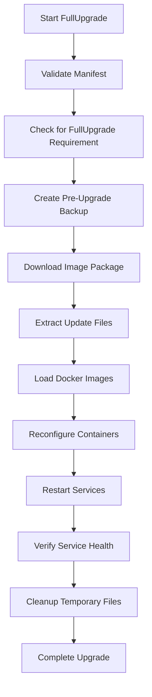
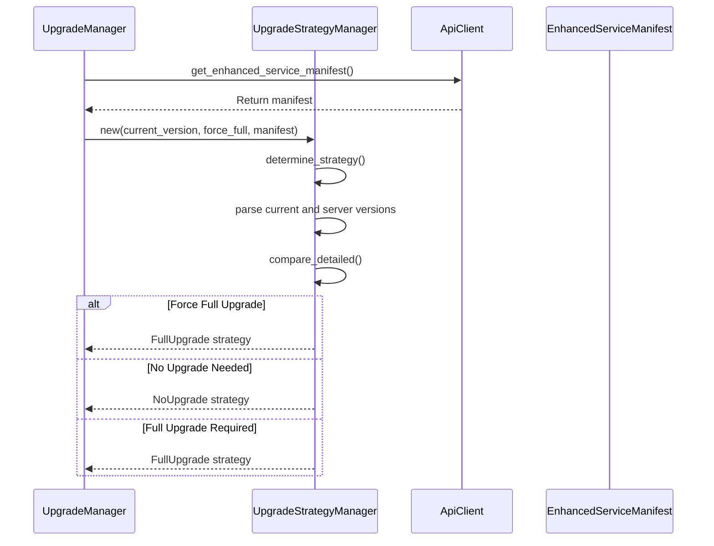
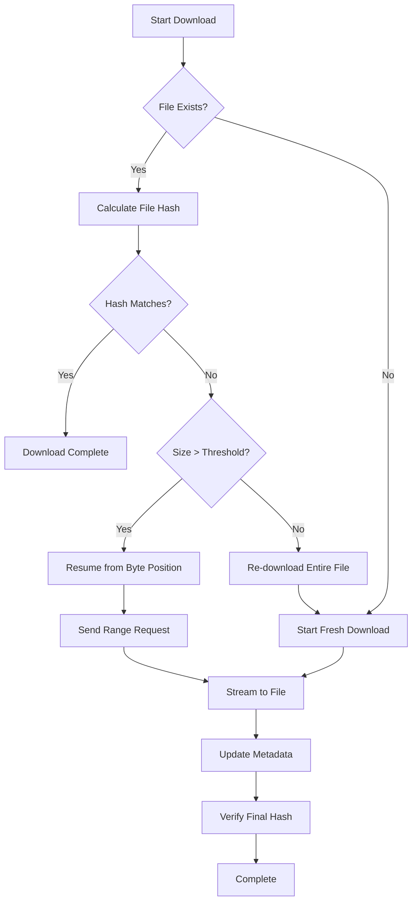
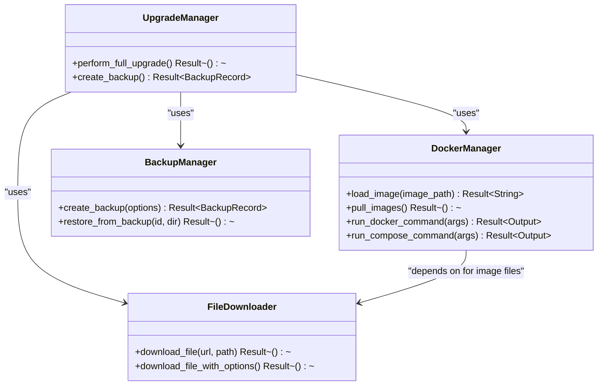
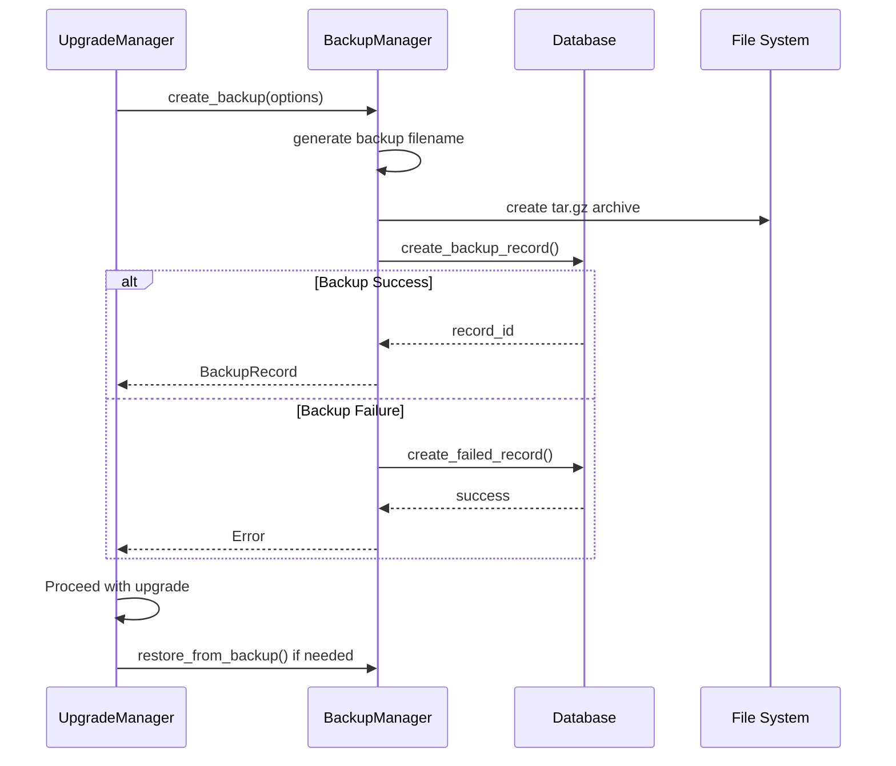

# Full Upgrade Implementation

<cite>
**Referenced Files in This Document**   
- [upgrade_strategy.rs](file://client-core/src/upgrade_strategy.rs)
- [downloader.rs](file://client-core/src/downloader.rs)
- [image.rs](file://client-core/src/container/image.rs)
- [backup.rs](file://client-core/src/backup.rs)
- [upgrade.rs](file://client-core/src/upgrade.rs)
</cite>

## Table of Contents
1. [Introduction](#introduction)
2. [FullUpgrade Workflow Overview](#fullupgrade-workflow-overview)
3. [Manifest Validation and Strategy Selection](#manifest-validation-and-strategy-selection)
4. [Image Download Process with Resumption](#image-download-process-with-resumption)
5. [Docker Image Handling and Container Reconfiguration](#docker-image-handling-and-container-reconfiguration)
6. [Backup System Integration](#backup-system-integration)
7. [Resource Usage and Timeout Handling](#resource-usage-and-timeout-handling)
8. [Fallback Mechanisms and Error Recovery](#fallback-mechanisms-and-error-recovery)
9. [Real-World Scenarios and Examples](#real-world-scenarios-and-examples)
10. [Expected Logs and User Feedback](#expected-logs-and-user-feedback)

## Introduction
The FullUpgrade strategy is a comprehensive redeployment mechanism triggered when major version changes or missing patches necessitate a complete system overhaul. This implementation ensures backward compatibility while providing robust error handling, progress tracking, and recovery mechanisms. The process involves manifest validation, image downloading with resumption capabilities, Docker image operations, container reconfiguration, and service restart. This document details the complete workflow, integration points, and operational characteristics of the FullUpgrade strategy.

## FullUpgrade Workflow Overview
The FullUpgrade process follows a structured sequence of operations designed to ensure reliability and data integrity during major version transitions. The workflow begins with manifest validation to determine the appropriate upgrade strategy, followed by image download via the downloader module. Once downloaded, Docker images are loaded and containers are reconfigured before services are restarted. Throughout this process, the system maintains backward compatibility and integrates with the backup system to protect against data loss.

The upgrade process is initiated through the UpgradeManager, which coordinates between various components including the UpgradeStrategyManager for decision-making, FileDownloader for image acquisition, DockerManager for container operations, and BackupManager for data protection. Each step in the process is designed to be idempotent and recoverable, allowing the system to resume from interruptions.

**Diagram sources**
- [upgrade_strategy.rs](file://client-core/src/upgrade_strategy.rs)
- [upgrade.rs](file://client-core/src/upgrade.rs)

**Section sources**
- [upgrade_strategy.rs](file://client-core/src/upgrade_strategy.rs#L0-L462)
- [upgrade.rs](file://client-core/src/upgrade.rs#L0-L89)

## Manifest Validation and Strategy Selection
The upgrade process begins with manifest validation and strategy selection performed by the UpgradeStrategyManager. This component analyzes the EnhancedServiceManifest received from the server and compares it with the current client version to determine the appropriate upgrade path. The decision is based on several factors including version compatibility, architecture detection, and forced upgrade requirements.

The VersionComparison enum defines three possible outcomes: Equal (no upgrade needed), PatchUpgradeable (incremental update possible), and FullUpgradeRequired (complete redeployment necessary). The FullUpgrade strategy is selected when there are major version differences, missing critical patches, or when the force_full flag is set. The system also checks for the existence of the docker directory and compose file, falling back to FullUpgrade if these are missing.

**Diagram sources**
- [upgrade_strategy.rs](file://client-core/src/upgrade_strategy.rs#L104-L137)
- [upgrade.rs](file://client-core/src/upgrade.rs#L57-L88)

**Section sources**
- [upgrade_strategy.rs](file://client-core/src/upgrade_strategy.rs#L104-L137)
- [upgrade.rs](file://client-core/src/upgrade.rs#L57-L88)

## Image Download Process with Resumption
The image download process is handled by the FileDownloader component, which provides robust support for large file downloads with resumption capabilities. The downloader implements intelligent strategies for different URL types, automatically detecting whether a file is hosted on object storage (like AWS S3 or Aliyun OSS) and adjusting timeout settings accordingly.

The download process supports HTTP Range requests for resuming interrupted downloads. Before starting a download, the system checks for existing partial files and validates their integrity through hash comparison. If the existing file's hash matches the expected value, the download is considered complete. Otherwise, if the file size exceeds the resume_threshold (1MB by default), the download resumes from the current position. Files smaller than the threshold are re-downloaded entirely.

**Diagram sources**
- [downloader.rs](file://client-core/src/downloader.rs#L0-L799)

**Section sources**
- [downloader.rs](file://client-core/src/downloader.rs#L0-L799)

## Docker Image Handling and Container Reconfiguration
The FullUpgrade process integrates with the container/image.rs module for Docker image operations. The DockerManager provides two key methods for image handling: load_image for loading images from local files and pull_images for pulling images from registries. During a FullUpgrade, the load_image method is primarily used to import images from downloaded packages.

The image loading process parses the output of the docker load command to extract the actual image name, which is then used for container reconfiguration. If the command succeeds but the image name cannot be parsed, the operation fails to prevent configuration errors. After images are loaded, the container configuration is updated based on the new manifest, and services are restarted to apply the changes.

**Diagram sources**
- [image.rs](file://client-core/src/container/image.rs#L0-L70)
- [downloader.rs](file://client-core/src/downloader.rs#L0-L799)

**Section sources**
- [image.rs](file://client-core/src/container/image.rs#L0-L70)
- [downloader.rs](file://client-core/src/downloader.rs#L0-L799)

## Backup System Integration
Before executing destructive changes during a FullUpgrade, the system integrates with the backup mechanism to ensure data protection. The BackupManager creates pre-upgrade backups that capture the current state of the system, allowing for rollback if the upgrade fails. The backup process is selective, focusing on critical data directories while preserving configuration files.

For FullUpgrade operations, the backup typically includes the "data" directory, which contains application data and databases. The backup is created in compressed tar.gz format with configurable compression levels. The system records backup metadata in the database, including version information, timestamp, and backup type (pre-upgrade). This integration ensures that users can recover their system to a known good state if the upgrade encounters issues.

**Diagram sources**
- [backup.rs](file://client-core/src/backup.rs#L0-L623)

**Section sources**
- [backup.rs](file://client-core/src/backup.rs#L0-L623)

## Resource Usage and Timeout Handling
The FullUpgrade implementation includes comprehensive resource usage considerations and timeout handling mechanisms. The FileDownloader is configured with a default timeout of 60 minutes for downloads, which is extended for object storage and CDN URLs that typically host large files. The system uses asynchronous I/O operations to minimize memory usage during large file transfers.

Resource management is handled through configurable parameters in the DownloaderConfig, including chunk_size (8KB default), retry_count (3 attempts), and progress reporting intervals. The system uses tokio::task::spawn_blocking for CPU-intensive operations like compression and decompression to prevent blocking the async runtime. Memory usage is optimized by streaming data directly to disk rather than loading entire files into memory.

Timeouts are handled at multiple levels: HTTP request timeouts, download operation timeouts, and system-level timeouts for Docker operations. The system implements exponential backoff for retryable operations and provides detailed error reporting to help diagnose connectivity issues. Network conditions are monitored to adjust download strategies dynamically.

**Section sources**
- [downloader.rs](file://client-core/src/downloader.rs#L0-L799)

## Fallback Mechanisms and Error Recovery
The FullUpgrade implementation includes several fallback mechanisms and error recovery strategies. When a download fails, the system preserves metadata to enable resumption on the next attempt. If hash verification fails after download completion, the system treats this as a corruption error and triggers a re-download. For Docker operations, the system captures both stdout and stderr output to provide detailed error information.

The upgrade process follows a fail-safe approach: if any step fails, the system stops further execution and preserves the previous state. The backup created before the upgrade serves as the primary recovery mechanism. The system also implements fallback logic in the upgrade strategy selection: if architecture-specific packages are unavailable, it attempts to use generic packages before failing.

Error recovery is facilitated through the UpgradeResult structure, which captures success status, version information, error messages, and backup identifiers. This information is used to generate meaningful user feedback and to support automated recovery processes.

**Section sources**
- [downloader.rs](file://client-core/src/downloader.rs#L0-L799)
- [upgrade.rs](file://client-core/src/upgrade.rs#L0-L55)

## Real-World Scenarios and Examples
The FullUpgrade strategy is selected in several real-world scenarios:

1. **Major Version Changes**: When upgrading from version 0.0.12 to 0.0.13.2, the system detects a base version change and selects FullUpgrade.
2. **Missing Critical Patches**: If multiple patch versions have been skipped, the system requires a full upgrade to ensure compatibility.
3. **Architecture Changes**: When switching from x86_64 to aarch64 architecture, a complete redeployment is necessary.
4. **Corrupted Installations**: If file integrity checks fail, a full upgrade restores the system to a known good state.
5. **Initial Setup**: When no docker directory exists, the system defaults to FullUpgrade.

Example: A user running version 0.0.12 receives a manifest for version 0.0.13.2. The UpgradeStrategyManager compares the versions and determines that a base version change has occurred. It selects the FullUpgrade strategy, downloads the appropriate package for the user's architecture, creates a backup of the data directory, extracts the update, loads the new Docker images, and restarts the services.

**Section sources**
- [upgrade_strategy.rs](file://client-core/src/upgrade_strategy.rs#L399-L438)

## Expected Logs and User Feedback
The FullUpgrade process generates comprehensive logs and user feedback at each stage. The system uses structured logging with emoji indicators to enhance readability:

- "🔍 开始升级策略决策" - Strategy decision begins
- "📦 选择全量升级策略" - FullUpgrade strategy selected
- "🌐 开始下载文件" - Download starts
- "💾 已保存下载元数据" - Download metadata saved
- "🎉 下载完成" - Download completed
- "开始创建备份" - Backup creation starts
- "备份创建成功" - Backup completed
- "执行docker load命令" - Image loading begins
- "成功解析加载的镜像名称" - Image name parsed successfully

User feedback follows the UpgradeStep enum, progressing through: CheckingUpdates, CreatingBackup, StoppingServices, DownloadingUpdate, ExtractingUpdate, LoadingImages, StartingServices, VerifyingServices, and Completed. Progress callbacks provide real-time updates, and the final result includes success status, version information, and error details if applicable.

**Section sources**
- [upgrade_strategy.rs](file://client-core/src/upgrade_strategy.rs#L104-L137)
- [downloader.rs](file://client-core/src/downloader.rs#L0-L799)
- [upgrade.rs](file://client-core/src/upgrade.rs#L0-L55)