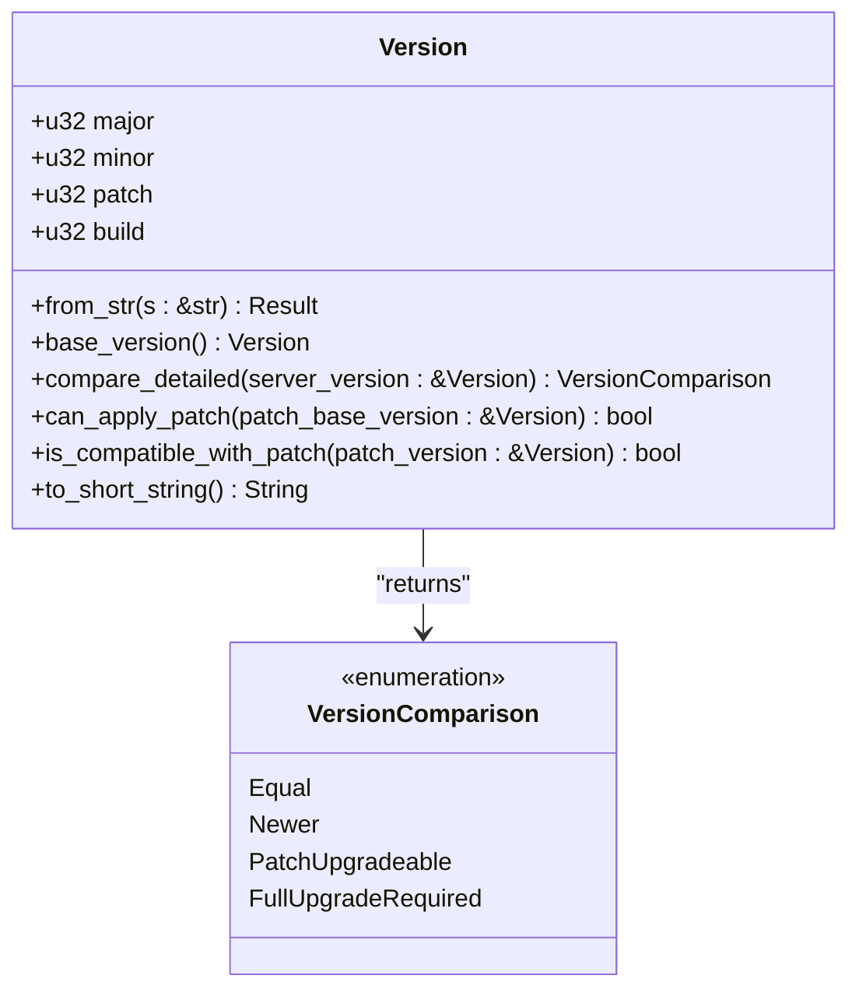
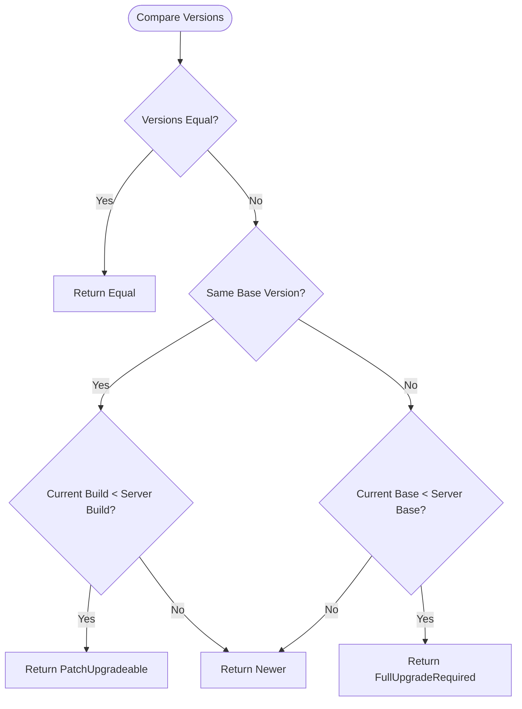
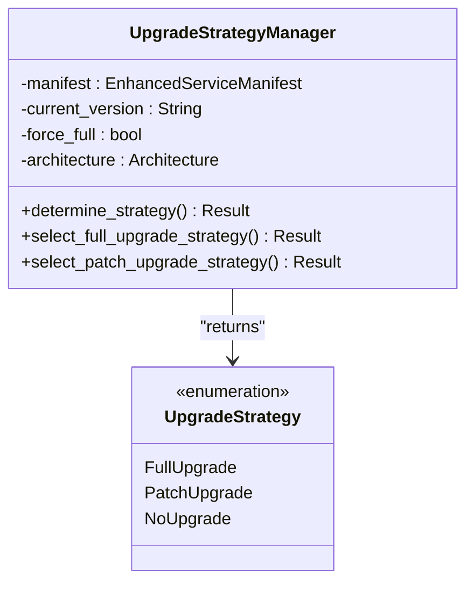
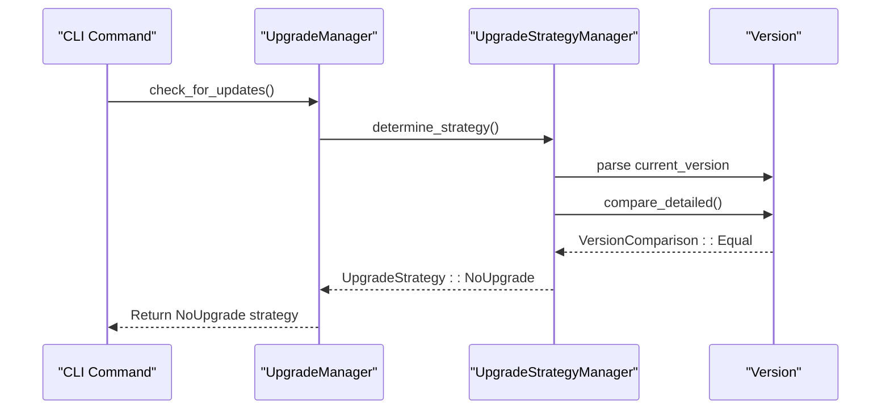
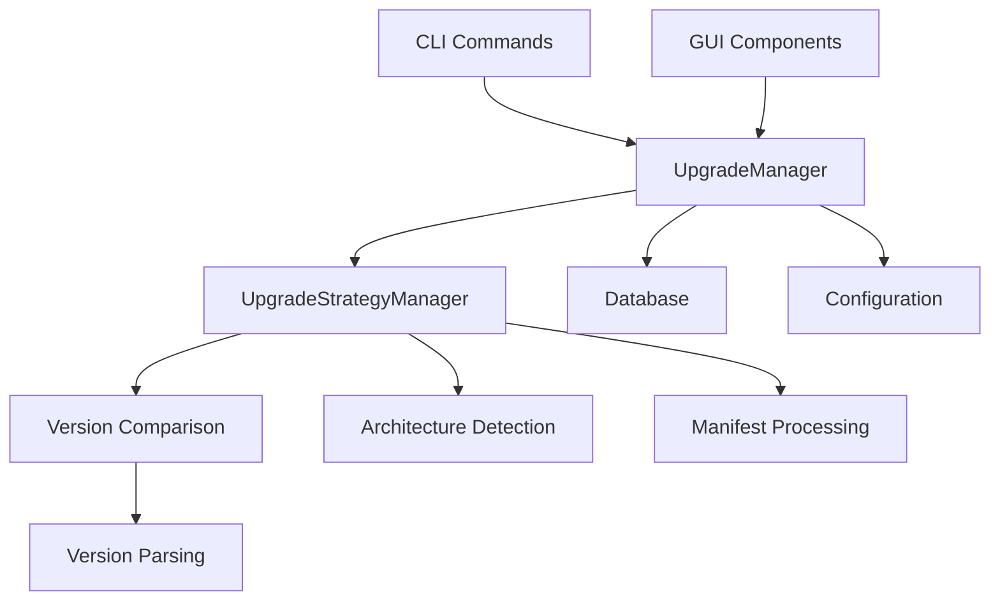

# No Upgrade Path

<cite>
**Referenced Files in This Document**   
- [version.rs](file://client-core/src/version.rs)
- [upgrade_strategy.rs](file://client-core/src/upgrade_strategy.rs)
- [upgrade.rs](file://client-core/src/upgrade.rs)
- [update.rs](file://nuwax-cli/src/commands/update.rs)
- [docker_service.rs](file://nuwax-cli/src/commands/docker_service.rs)
- [auto_upgrade_deploy.rs](file://nuwax-cli/src/commands/auto_upgrade_deploy.rs)
</cite>

## Table of Contents
1. [Introduction](#introduction)
2. [Version Parsing and Comparison](#version-parsing-and-comparison)
3. [NoUpgrade Strategy Implementation](#noupgrade-strategy-implementation)
4. [System Integrity and Audit Trail](#system-integrity-and-audit-trail)
5. [CLI and GUI Status Reporting](#cli-and-gui-status-reporting)
6. [Edge Cases and Special Conditions](#edge-cases-and-special-conditions)
7. [Architecture Integration](#architecture-integration)

## Introduction
The NoUpgrade strategy represents a critical component of the duck_client application's upgrade management system. This strategy is executed when the current installed version is already up-to-date with the target version available on the server. Rather than being a simple no-operation, the NoUpgrade strategy performs essential system validation, maintains audit trails, and ensures system integrity. This document details the implementation of the NoUpgrade strategy, focusing on version comparison logic, semantic version parsing, and integration across the application's architecture.

## Version Parsing and Comparison

The version comparison system is implemented in the `version.rs` module, which provides comprehensive semantic versioning support with a four-segment format (major.minor.patch.build). This implementation enables precise version evaluation for upgrade decisions.



**Diagram sources**
- [version.rs](file://client-core/src/version.rs#L36-L263)

**Section sources**
- [version.rs](file://client-core/src/version.rs#L0-L410)

### Semantic Version Parsing
The `Version` struct parses version strings using the winnow parser combinator library, supporting multiple input formats:
- Three-segment format: "1.2.3" → Version { major: 1, minor: 2, patch: 3, build: 0 }
- Four-segment format: "1.2.3.4" → Version { major: 1, minor: 2, patch: 3, build: 4 }
- Optional "v" prefix: "v0.0.13.5" or "V0.0.13.5"

The parser validates input format and ensures complete consumption of the input string, rejecting malformed versions with trailing characters.

### Version Comparison Logic
The `compare_detailed` method implements the core logic for upgrade decision-making, returning a `VersionComparison` enum that determines the appropriate upgrade strategy:



**Diagram sources**
- [version.rs](file://client-core/src/version.rs#L219-L263)

The comparison process follows these steps:
1. **Exact equality check**: If current and target versions are identical, return `VersionComparison::Equal`
2. **Base version comparison**: Extract base versions (major.minor.patch) and compare
3. **Build-level evaluation**: For identical base versions, compare build numbers to determine if a patch upgrade is possible
4. **Major version assessment**: For different base versions, determine if a full upgrade is required or if the current version is newer

## NoUpgrade Strategy Implementation

The NoUpgrade strategy is implemented as part of the `UpgradeStrategy` enum in the `upgrade_strategy.rs` module. This strategy is selected when no upgrade is necessary, either because versions are identical or the current version is newer than the target.



**Diagram sources**
- [upgrade_strategy.rs](file://client-core/src/upgrade_strategy.rs#L56-L156)

**Section sources**
- [upgrade_strategy.rs](file://client-core/src/upgrade_strategy.rs#L0-L463)

### Strategy Determination Process
The `UpgradeStrategyManager` determines the appropriate upgrade strategy through the following process:

1. **Parse current version**: Convert the current version string to a `Version` struct
2. **Compare with server version**: Use `compare_detailed` to assess version relationship
3. **Check force full flag**: If `force_full` is true, select full upgrade regardless of version comparison
4. **Validate environment**: Check for existence of docker directory and compose file
5. **Return appropriate strategy**: Based on comparison result

The NoUpgrade strategy is specifically selected when:
- `VersionComparison::Equal`: Current and target versions are identical
- `VersionComparison::Newer`: Current version is more recent than the target version

```rust
match base_comparison {
    crate::version::VersionComparison::Equal | crate::version::VersionComparison::Newer => {
        info!("✅ 当前版本已是最新，无需升级");
        Ok(UpgradeStrategy::NoUpgrade {
            target_version: self.manifest.version.clone(),
        })
    }
    // ... other cases
}
```

### Changed Files Analysis
The NoUpgrade strategy correctly identifies that no files need to be changed during the upgrade process:

```rust
impl UpgradeStrategy {
    pub fn get_changed_files(&self) -> Vec<PathBuf> {
        let change_files = match self {
            UpgradeStrategy::FullUpgrade { .. } => vec!["data".to_string()],
            UpgradeStrategy::PatchUpgrade { patch_info, .. } => patch_info.get_changed_files(),
            UpgradeStrategy::NoUpgrade { .. } => {
                vec![]
            }
        };
        change_files.into_iter().map(PathBuf::from).collect()
    }
}
```

This implementation ensures that no unnecessary backup operations are performed when no upgrade is needed.

## System Integrity and Audit Trail

Despite being a "no upgrade" scenario, the system performs several important integrity checks and maintains comprehensive audit trails.

### Health Checks
When the NoUpgrade strategy is selected, the system still performs health checks through the upgrade management pipeline. The `check_for_updates` method in `upgrade.rs` initiates the upgrade strategy determination process, which includes logging and validation steps even when no upgrade is performed.



**Diagram sources**
- [upgrade.rs](file://client-core/src/upgrade.rs#L57-L88)
- [upgrade_strategy.rs](file://client-core/src/upgrade_strategy.rs#L104-L156)

**Section sources**
- [upgrade.rs](file://client-core/src/upgrade.rs#L0-L89)

### Audit Trail Generation
The system maintains an audit trail of version checks through logging and potentially database records. When the NoUpgrade strategy is selected, the system logs informational messages indicating that the current version is already up-to-date:

```rust
info!("✅ 当前版本已是最新，无需升级");
```

Additionally, the system may record these events in the user_actions table in the database, which includes fields for client_version, action_type (UPGRADE), status (SUCCESS), and platform_info.

## CLI and GUI Status Reporting

The NoUpgrade strategy is reflected in both command-line interface (CLI) and graphical user interface (GUI) components, providing clear feedback to users about their system status.

### CLI Implementation
In the CLI, the `update.rs` command handles the display of upgrade status:

```rust
UpgradeStrategy::NoUpgrade { target_version } => {
    info!("   当前版本: {}", current_version_str);
    info!("   最新版本: {}", target_version);
    info!("✅ 当前已是最新版本");
}
```

This implementation provides users with clear information about their current version, the latest available version, and confirmation that no upgrade is necessary.

### GUI Integration
While specific GUI implementation details are not available in the provided code, the pattern established in the CLI suggests that the GUI would similarly display up-to-date status when the NoUpgrade strategy is selected. The `OperationPanel` and `TerminalWindow` components in the `cli-ui` directory likely receive the upgrade strategy information and render appropriate status indicators.

## Edge Cases and Special Conditions

The NoUpgrade strategy implementation accounts for several edge cases and special conditions that could affect version equality assessment.

### Version Normalization
The system handles version normalization through the `base_version` method, which creates a version with build=0 for comparison purposes:

```rust
pub fn base_version(&self) -> Version {
    Version::new_without_build(self.major, self.minor, self.patch)
}
```

This ensures that versions like "0.0.13" and "0.0.13.0" are treated as equivalent.

### Build Metadata Handling
The four-segment version system (major.minor.patch.build) allows for sophisticated build metadata handling. The build number represents patch levels applied to a base version, enabling the system to determine whether incremental updates are available.

### Architecture-Specific Version Pinning
The system considers architecture when determining upgrade strategies. The `UpgradeStrategyManager` includes architecture detection, ensuring that version comparisons account for platform-specific builds.

### Development and Dirty States
While not explicitly handled in the provided code, the version comparison system is designed to work with development builds. The validation rules prevent excessively large version numbers, but allow for typical development versioning patterns.

## Architecture Integration

The NoUpgrade strategy is integrated throughout the application architecture, from core logic to user-facing components.



**Diagram sources**
- [upgrade.rs](file://client-core/src/upgrade.rs)
- [upgrade_strategy.rs](file://client-core/src/upgrade_strategy.rs)
- [version.rs](file://client-core/src/version.rs)

**Section sources**
- [upgrade.rs](file://client-core/src/upgrade.rs#L0-L89)
- [upgrade_strategy.rs](file://client-core/src/upgrade_strategy.rs#L0-L463)
- [version.rs](file://client-core/src/version.rs#L0-L410)

The strategy flows from user commands through the upgrade management system, with the NoUpgrade decision propagating back to the user interface to provide appropriate feedback. This integration ensures consistent behavior across all application components.