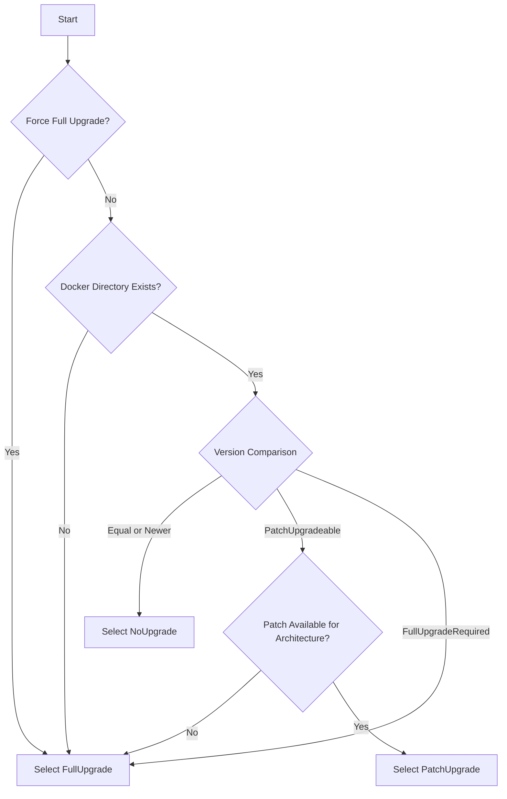
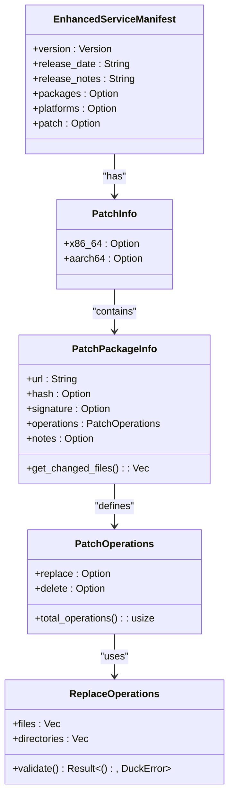
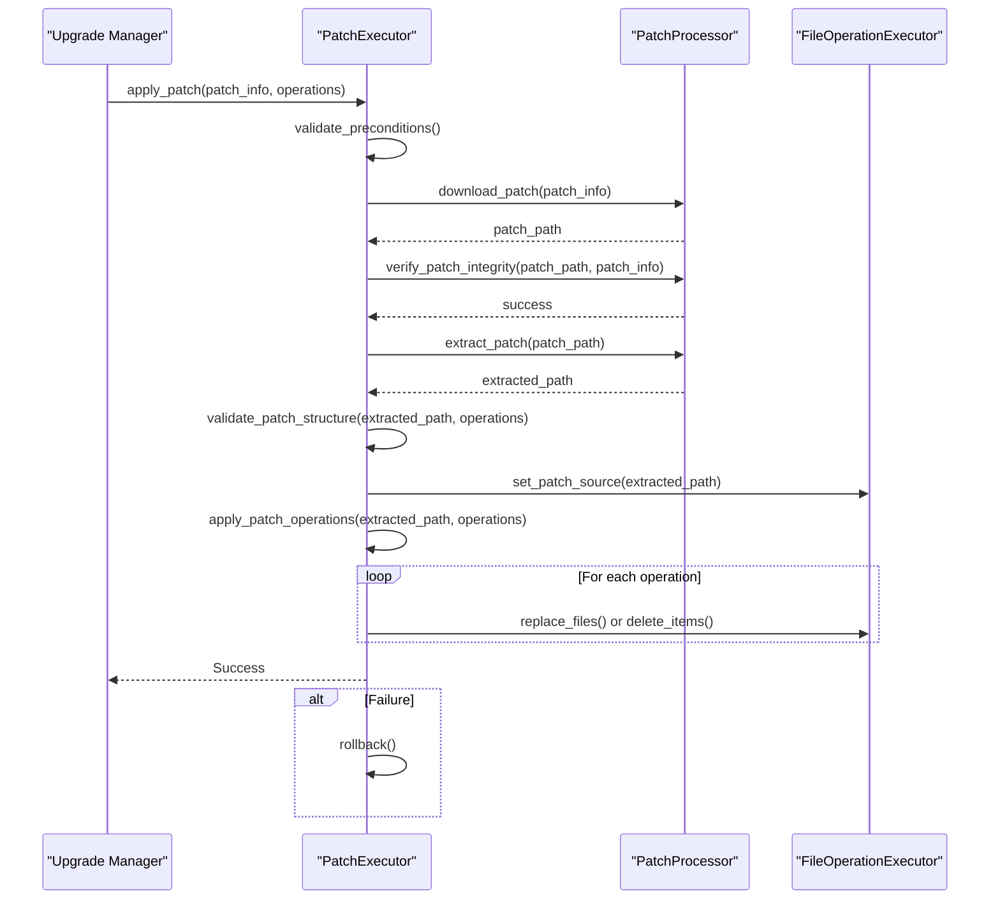
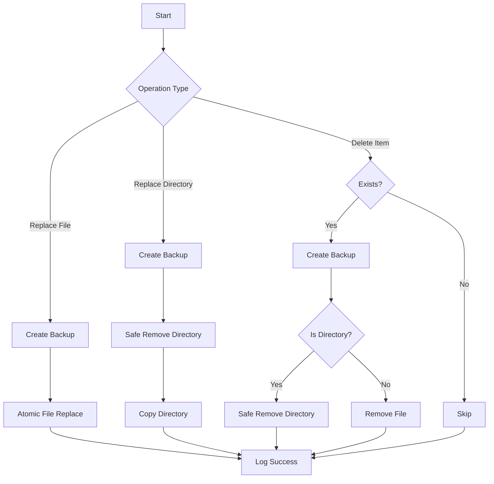
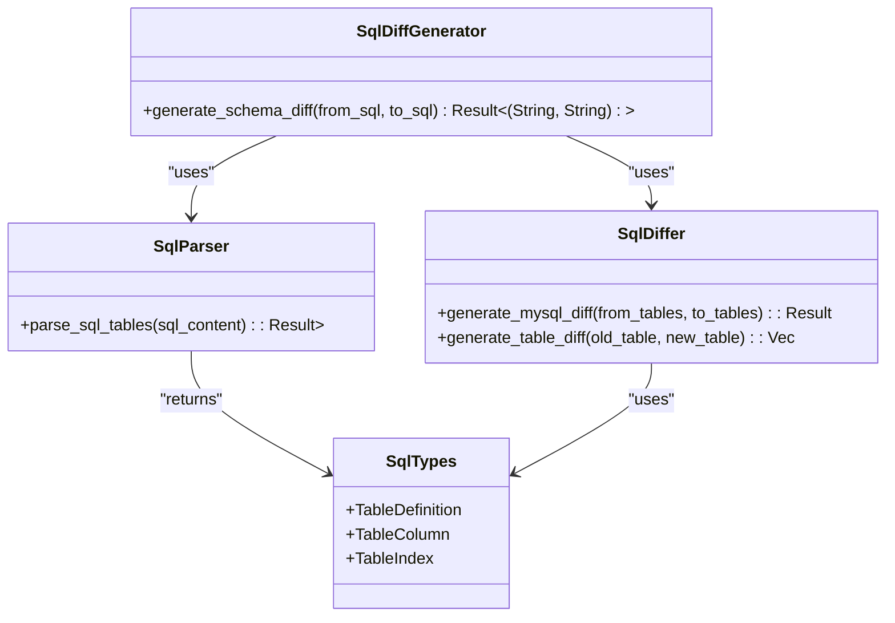
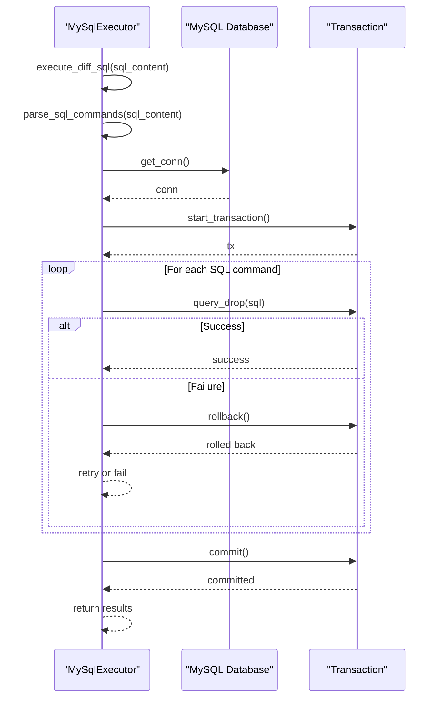
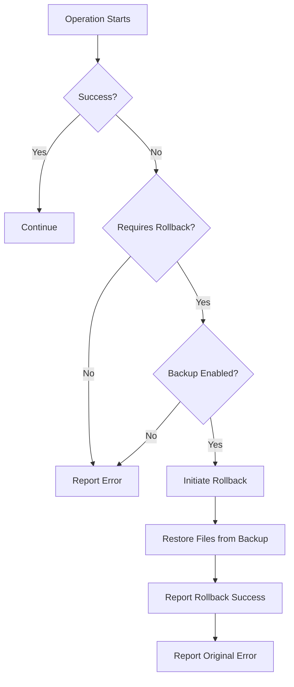
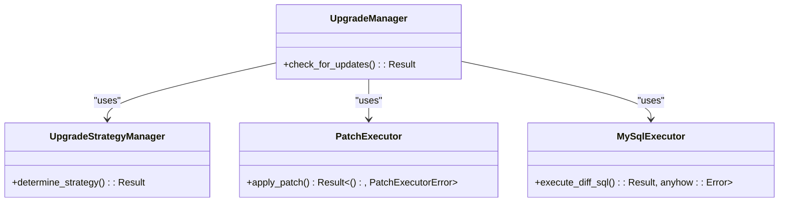

# Patch Upgrade Implementation

<cite>
**Referenced Files in This Document**   
- [upgrade_strategy.rs](file://client-core/src/upgrade_strategy.rs#L1-L463)
- [patch_executor/mod.rs](file://client-core/src/patch_executor/mod.rs#L1-L432)
- [patch_executor/file_operations.rs](file://client-core/src/patch_executor/file_operations.rs#L1-L524)
- [sql_diff/differ.rs](file://client-core/src/sql_diff/differ.rs#L1-L266)
- [sql_diff/types.rs](file://client-core/src/sql_diff/types.rs#L1-L31)
- [sql_diff/generator.rs](file://client-core/src/sql_diff/generator.rs#L1-L195)
- [sql_diff/parser.rs](file://client-core/src/sql_diff/parser.rs#L1-L381)
- [mysql_executor.rs](file://client-core/src/mysql_executor.rs#L1-L379)
- [api_types.rs](file://client-core/src/api_types.rs#L1-L902)
- [upgrade.rs](file://client-core/src/upgrade.rs#L1-L90)
</cite>

## Table of Contents
1. [Introduction](#introduction)
2. [Patch Upgrade Strategy Decision](#patch-upgrade-strategy-decision)
3. [Patch Package Structure and Manifest](#patch-package-structure-and-manifest)
4. [Patch Application Process Flow](#patch-application-process-flow)
5. [File Operations Execution](#file-operations-execution)
6. [SQL Schema Migration and Synchronization](#sql-schema-migration-and-synchronization)
7. [Database Schema Synchronization with MySQL Executor](#database-schema-synchronization-with-mysql-executor)
8. [Error Handling, Rollback, and Recovery](#error-handling-rollback-and-recovery)
9. [Integration and Orchestration](#integration-and-orchestration)

## Introduction
The PatchUpgrade strategy is a core component of the Duck Client's update mechanism, designed to efficiently apply incremental updates when minor or patch versions change. This document details the implementation of the PatchUpgrade system, focusing on how it minimizes bandwidth usage by downloading only changed assets and applying atomic operations. The process involves parsing a patch manifest, applying SQL differences via the `sql_diff` module, executing file operations using the `patch_executor`, and synchronizing the database schema using the `mysql_executor`. The system ensures idempotency, supports partial failure recovery, and includes robust verification steps. This documentation provides a comprehensive overview of the architecture, data flow, and key components that enable secure and reliable incremental updates.

## Patch Upgrade Strategy Decision

The `UpgradeStrategyManager` is responsible for determining the appropriate upgrade strategy based on the current version, server manifest, and environmental factors. It evaluates whether a full upgrade, patch upgrade, or no upgrade is required.

**Diagram sources**
- [upgrade_strategy.rs](file://client-core/src/upgrade_strategy.rs#L1-L463)

**Section sources**
- [upgrade_strategy.rs](file://client-core/src/upgrade_strategy.rs#L1-L463)

## Patch Package Structure and Manifest

The `EnhancedServiceManifest` defines the structure of the server response, which includes information for both full and patch upgrades. The `PatchPackageInfo` contains the URL, hash, signature, and a detailed list of file operations to be performed.

**Diagram sources**
- [api_types.rs](file://client-core/src/api_types.rs#L1-L902)

**Section sources**
- [api_types.rs](file://client-core/src/api_types.rs#L1-L902)

## Patch Application Process Flow

The `PatchExecutor` orchestrates the entire patch application process, which includes downloading, verifying, extracting, and applying the patch. The process is designed to be transactional, with a rollback mechanism in place for failure recovery.

**Diagram sources**
- [patch_executor/mod.rs](file://client-core/src/patch_executor/mod.rs#L1-L432)

**Section sources**
- [patch_executor/mod.rs](file://client-core/src/patch_executor/mod.rs#L1-L432)

## File Operations Execution

The `FileOperationExecutor` handles the safe execution of file operations, including replacement and deletion. It supports a backup mode that enables rollback in case of failure. Operations are performed atomically to ensure data integrity.

**Diagram sources**
- [patch_executor/file_operations.rs](file://client-core/src/patch_executor/file_operations.rs#L1-L524)

**Section sources**
- [patch_executor/file_operations.rs](file://client-core/src/patch_executor/file_operations.rs#L1-L524)

## SQL Schema Migration and Synchronization

The `sql_diff` module is responsible for generating the SQL migration scripts that are used to synchronize the database schema. It parses the SQL files, compares the table definitions, and generates the necessary `ALTER TABLE` statements.

**Diagram sources**
- [sql_diff/generator.rs](file://client-core/src/sql_diff/generator.rs#L1-L195)
- [sql_diff/parser.rs](file://client-core/src/sql_diff/parser.rs#L1-L381)
- [sql_diff/differ.rs](file://client-core/src/sql_diff/differ.rs#L1-L266)
- [sql_diff/types.rs](file://client-core/src/sql_diff/types.rs#L1-L31)

**Section sources**
- [sql_diff/generator.rs](file://client-core/src/sql_diff/generator.rs#L1-L195)
- [sql_diff/parser.rs](file://client-core/src/sql_diff/parser.rs#L1-L381)
- [sql_diff/differ.rs](file://client-core/src/sql_diff/differ.rs#L1-L266)
- [sql_diff/types.rs](file://client-core/src/sql_diff/types.rs#L1-L31)

## Database Schema Synchronization with MySQL Executor

The `MySqlExecutor` is responsible for applying the generated SQL migration scripts to the database. It uses a transactional approach to ensure that all changes are applied atomically, with automatic rollback in case of failure.

**Diagram sources**
- [mysql_executor.rs](file://client-core/src/mysql_executor.rs#L1-L379)

**Section sources**
- [mysql_executor.rs](file://client-core/src/mysql_executor.rs#L1-L379)

## Error Handling, Rollback, and Recovery

The system implements a comprehensive error handling and recovery strategy. The `PatchExecutor` can automatically initiate a rollback if an error occurs during the patch application. The `MySqlExecutor` uses database transactions to ensure atomicity, and the `FileOperationExecutor` uses backups to enable file-level rollback.

**Diagram sources**
- [patch_executor/mod.rs](file://client-core/src/patch_executor/mod.rs#L1-L432)
- [patch_executor/file_operations.rs](file://client-core/src/patch_executor/file_operations.rs#L1-L524)
- [mysql_executor.rs](file://client-core/src/mysql_executor.rs#L1-L379)

**Section sources**
- [patch_executor/mod.rs](file://client-core/src/patch_executor/mod.rs#L1-L432)
- [patch_executor/file_operations.rs](file://client-core/src/patch_executor/file_operations.rs#L1-L524)
- [mysql_executor.rs](file://client-core/src/mysql_executor.rs#L1-L379)

## Integration and Orchestration

The `UpgradeManager` in the `upgrade.rs` module serves as the main orchestrator, integrating the `UpgradeStrategyManager`, `PatchExecutor`, and `MySqlExecutor` to provide a seamless upgrade experience. It handles the high-level workflow, from checking for updates to applying the patch and verifying the result.

**Diagram sources**
- [upgrade.rs](file://client-core/src/upgrade.rs#L1-L90)
- [upgrade_strategy.rs](file://client-core/src/upgrade_strategy.rs#L1-L463)
- [patch_executor/mod.rs](file://client-core/src/patch_executor/mod.rs#L1-L432)
- [mysql_executor.rs](file://client-core/src/mysql_executor.rs#L1-L379)

**Section sources**
- [upgrade.rs](file://client-core/src/upgrade.rs#L1-L90)